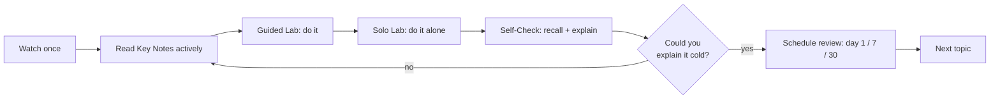

# How to learn

The biggest gains in this course don't come from the content — they come from **how you study it**.
Every lesson is deliberately built around a handful of techniques that decades of cognitive-science
research show actually work. Learn the techniques once here, then notice them in each lesson's
eight sections.

!!! quote "The core idea"
    You do not learn by putting information *in* (re-reading, re-watching). You learn by pulling it
    *out* (recalling, explaining, doing) — and by spacing that effort over time. Struggle is not a
    sign the method is failing; it is the method working.

## The five techniques (and where each lives in a lesson)

### 1. Retrieval practice (active recall)
Testing yourself *is* studying, not a check on studying. Trying to recall an answer — even
unsuccessfully — strengthens memory far more than re-reading.

- **In a lesson:** the **Self-Check** flashcards and questions; the "explain it back" prompt.
- **Source:** [retrievalpractice.org](https://www.retrievalpractice.org/) (Pooja Agarwal & colleagues) ·
  *Make It Stick: The Science of Successful Learning*, Brown, Roediger & McDaniel (Harvard University Press, 2014).

### 2. Spaced repetition
Review just as you're about to forget. Re-studying at expanding intervals (day 1 → 7 → 30) beats
cramming for durable memory.

- **In a lesson:** the **Review** footer with day-1/7/30 dates; each new module reviews one item from an old one.
- **Source:** *Make It Stick* (above); the classic "spacing effect" literature.

### 3. Interleaving
Mix related topics instead of blocking one at a time. It feels harder — and produces better transfer
and discrimination between concepts.

- **In a lesson:** review days pull in *earlier* modules; the connections section links neighbouring topics.
- **Source:** *Make It Stick*; Rohrer & Taylor on interleaved practice.

### 4. Deliberate practice
Skill grows from focused work at the **edge of your current ability**, with immediate feedback and
targeted correction of weak points — not from comfortable repetition.

- **In a lesson:** the **Solo Lab** (harder, minimal hand-holding); the leveled exercise ladders.
- **Source:** Ericsson, Krampe & Tesch-Römer, *Psychological Review* (1993) · *Peak*, Ericsson & Pool (2016).

### 5. Elaboration & the Feynman technique
Explain an idea simply, in your own words, as if teaching it. Gaps in your explanation reveal exactly
what you don't yet understand.

- **In a lesson:** the **teach-back** prompt in Self-Check; the "explain to a 10-year-old" tasks.
- **Source:** the Feynman technique (Richard Feynman's learning method); elaborative-interrogation research.

## Put it together: one honest study loop

## Reading is a skill — grow it on purpose

The fastest learners read primary sources: official docs, man pages, specifications, a key book
chapter. It feels slow at first and gets faster with reps. Each lesson's **Key Notes** are written
to stand alone, but they always point you to the real source — follow those links. The habit of
reading `man free`, the kernel docs, or an RFC *yourself* is the difference between knowledge and
expertise.

!!! tip "A well-known on-ramp"
    If you want a guided introduction to these ideas, the free course **"Learning How to Learn"**
    (Barbara Oakley & Terrence Sejnowski, on Coursera) is the most popular in the world on this
    topic and covers focused/diffuse thinking, chunking, and beating procrastination.

## The one rule

**Difficulty is the point.** When recall feels effortful, when the solo lab makes you think, when the
spaced review catches something you'd half-forgotten — that friction is where learning happens. Don't
optimize it away.
