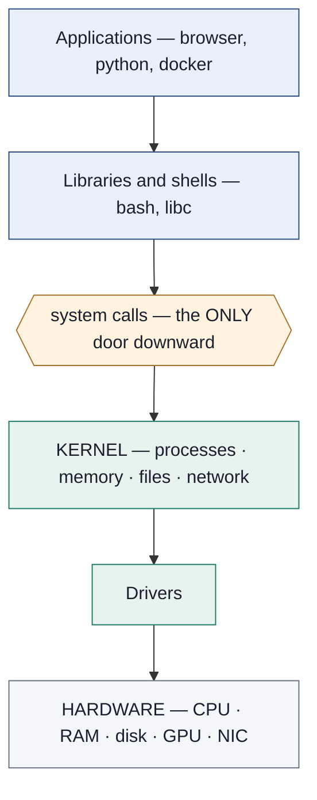
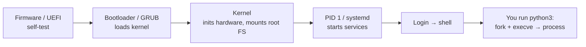

# Module 01 — Computer & OS Fundamentals

<small>Stage 1 · Foundations · ~2 weeks at 4 h/day · No prerequisites — this is the front door.</small>

## Why this matters

A **computer** stores instructions and data in memory and executes those instructions, one after
another, on a processor. An **operating system (OS)** is the master program that manages the
hardware and shares it safely among every other program.

Everything later in this course — Linux, containers, Kubernetes, GPUs, AI infrastructure — is just
**programs being managed by an OS on hardware**. Understand this module deeply and nothing later is
magic. Skip it and everything later is memorization.

!!! info "What this unlocks"
    Linux *is* one of these kernels · the shell speaks to the kernel through system calls · Docker is
    kernel isolation mechanisms · Kubernetes is the scheduler idea at cluster scale · performance
    tuning is the memory hierarchy with a profiler · AI infrastructure is the accelerator at
    production depth. **Every later module is this one, specialized.**

---

## Watch

*Watch once, then rely on the notes below — you should never need to rewatch.*

<div class="lo-video-placeholder" markdown="1">
<span class="lo-play">▶</span>
**Explainer video — coming**
<small>Record per <code>../media/README.md</code>, upload to YouTube, then replace this card with the embed.</small>
</div>

??? note "For the author — drop-in YouTube embed (replace VIDEO_ID)"
    Once the explainer is on YouTube, replace the placeholder card above with:
    ```html
    <div class="lo-video-embed">
      <iframe src="https://www.youtube-nocookie.com/embed/VIDEO_ID"
              title="Module 01 — Computer & OS Fundamentals"
              allow="accelerometer; autoplay; clipboard-write; encrypted-media; gyroscope; picture-in-picture"
              allowfullscreen></iframe>
    </div>
    ```
    Video script beats (from the blueprint's Analogy / Visual Model / Misconceptions):
    the kitchen analogy (CPU = chef, RAM = counter, disk = pantry, cache = arm's reach) →
    the six mechanisms → "measure first" → the three misconceptions to kill (RAM≠storage,
    OS≠the desktop, GHz≠speed).

**Terminal cast — the inspection commands, start to finish:**

<div class="asciinema-player-wrapper" data-cast="../casts/module-01-demo.cast" data-cols="90" data-rows="24"></div>

!!! tip "Follow along, don't just watch"
    Open the [Guided Lab](#guided-lab-meet-your-machine) in a browser terminal and run each command
    yourself as it appears. Typing beats watching every time.

---

## Key Notes

*Standalone. This is the reference you keep.*

### The picture: hardware, kernel, you



The **user/kernel boundary** is the security line of the entire stack: user code is restricted and
must ask the kernel — through a **system call** (`open`, `read`, `write`, `fork`, `execve`) — for
anything privileged.

### The six ideas that explain everything

1. **Stored program & fetch–decode–execute.** Instructions are just numbers in memory; the CPU
   endlessly fetches the next one, decodes it, executes it. That's all "running a program" is.
2. **Memory hierarchy.** Each level is bigger and slower than the one above it. Performance work is
   mostly "stay near the top."
3. **Process.** A *running* program: its code + its private virtual memory + its state. One program
   can run as many processes.
4. **Scheduling.** The kernel switches the CPU between processes thousands of times a second
   (context switches), creating the illusion everything runs at once.
5. **Virtual memory.** Each process sees its own private address space; the kernel + CPU (MMU) map it
   to real RAM pages. This is both the *protection* and the "more memory than RAM" trick — and later
   the foundation of containers.
6. **Syscalls & privilege.** The CPU runs in **user mode** (restricted) or **kernel mode**
   (all-powerful). The split, enforced by hardware, is where all security begins.

### The memory hierarchy (know these magnitudes cold)

| Level | Size | Latency | |
|---|---|---|---|
| Registers | ~KB | ~0.3 ns | fastest / smallest |
| L1 / L2 / L3 cache | ~MB | 1–30 ns | |
| RAM | ~GB | ~100 ns | |
| SSD | ~TB | ~100 µs | |
| Network / cloud | ~∞ | ~ms | slowest / biggest |

Each jump down is roughly **1000× slower**. "Slow" always means *waiting on something further down
the hierarchy*.

### Power button to running program



When you type `python3`: the shell asks the kernel (`fork` + `execve`) to create a process; the
kernel loads the program and schedules it; every print/read is a syscall; on exit the kernel
reclaims everything.

### Core concepts, compressed

- Everything is numbers — data *and* instructions *and* text *and* pixels, all binary.
- The CPU is fast but dumb; software is layers of simple steps.
- Memory is a hierarchy; distance from the CPU = slowness.
- The OS = **sharing + protection + abstraction**, enforced by hardware privilege modes.
- A **process** is the unit of running software; a **file** is the unit of stored data.
- GPUs/NPUs trade flexibility for parallel throughput.

<div class="lo-remember" markdown="1">
**Must remember (if you keep only five things):**

1. A program is a file; a **process** is that program *running* (own memory, PID, state).
2. The OS does three jobs: **sharing, protection, abstraction** — enforced by user vs kernel mode.
3. **Memory hierarchy:** registers → cache → RAM → SSD → network, each ~1000× slower.
4. A **syscall** is the only door from user code into the kernel.
5. Boot order: **UEFI → bootloader → kernel → PID 1 (systemd) → services → login.**
</div>

---

## Guided Lab: meet your machine

*Basic, step-by-step. Every command here is **read-only** — it inspects, never changes anything.*

<div class="lo-lab-actions" markdown="1">
[▶ Open interactive lab (browser terminal){ .lo-btn }](https://killercoda.com/learning-os/scenario/module-01){ target=_blank }
[View lab source{ .lo-btn .lo-btn--ghost }](https://github.com/randaguiac20/learning-os/tree/main/killercoda/module-01){ target=_blank }
</div>

!!! note "No install needed"
    The button opens a free Ubuntu terminal in your browser (Killercoda). It goes live when the
    scenario in `killercoda/module-01/` is published — see `../platform/RUNBOOK.md`. You can
    also run every command on any Linux machine, or in the terminal cast above.

=== "1 · Your machine"
    ```bash
    uname -a       # kernel + architecture
    hostnamectl    # machine identity
    uptime         # how long it's been running, load average
    ```
    **Record:** kernel version, hostname, uptime. Which fact came from the kernel, which from a file?

=== "2 · Your CPU"
    ```bash
    lscpu
    cat /proc/cpuinfo | less
    ```
    Find: model, **cores vs threads**, L1/L2/L3 cache sizes, max MHz. Draw the memory-hierarchy
    pyramid for *your* CPU.

=== "3 · Your memory"
    ```bash
    free -h
    cat /proc/meminfo | head -20
    ```
    Explain **total vs used vs available vs cached**. Open 10 browser tabs, rerun `free -h`, explain
    the change. (High "used" from cache is *healthy* — read the `available` column.)

=== "4 · Your storage"
    ```bash
    lsblk
    df -h
    ```
    Map the chain: **physical device → partition → mount point → your files.**

=== "5 · Processes, live"
    ```bash
    top            # press P (sort by CPU), M (sort by memory), q to quit
    sleep 300 &    # start a background process; note its PID
    ps aux | grep sleep
    kill <PID>     # terminate it; verify it's gone
    ```
    You just **created, observed, and terminated a process** through the kernel. What is PID 1?

!!! success "You can stop here and have learned something real"
    If you can read your machine's vital signs and run a process through its whole lifecycle, the
    guided lab is done. Now make it harder.

---

## Solo Lab: figure it out

*Harder. Goals only — minimal hand-holding. Struggle here is the point; reveal a hint only after you've tried.*

**Same browser terminal as above.** Work each goal before opening its hint.

### Challenge 1 — Count the context switches
Find out how many context switches your system has performed since boot.

??? tip "Hint"
    The kernel exposes live counters as files under `/proc`. Look for a system-wide stats file.

??? success "Solution"
    ```bash
    grep ctxt /proc/stat
    ```
    `/proc/stat`'s `ctxt` line is the total context-switch count since boot — direct evidence of the
    scheduler doing mechanism #4, thousands of times a second.

### Challenge 2 — Reconcile the CPU count
`nproc` prints a number. Reconcile it exactly with `lscpu`'s **cores × threads-per-core × sockets**.

??? tip "Hint"
    `nproc` counts *logical* CPUs. `lscpu` shows sockets, cores per socket, and threads per core —
    multiply them.

??? success "Solution"
    `nproc` == `Socket(s) × Core(s) per socket × Thread(s) per core` from `lscpu`. If threads-per-core
    is 2, hyper-threading is why `nproc` is double the physical core count.

### Challenge 3 — Read the error, name the layer
Run `ls /root`. It fails. In your journal, answer: **which layer refused you** (hardware? kernel?
filesystem permissions?) and why is that refusal *correct* behaviour?

??? success "Solution"
    Filesystem **permissions**, enforced by the kernel: `/root` is mode `700`, owned by root. Your
    unprivileged process is denied by the protection model (mechanism #6) — exactly what should
    happen. This is security as a *feature*, not a bug.

### Challenge 4 (stretch) — 200 processes, one core
`top` shows hundreds of processes but your machine has few cores. Explain precisely how they all
appear to "run at once."

??? success "Solution"
    "Running" mostly means *runnable*; one core executes exactly one instruction stream at a time, in
    ~millisecond slices. The scheduler context-switches so fast it looks simultaneous, and most of
    those processes are actually **sleeping** on I/O or timers, not competing for the CPU at all.

---

## Self-Check

*Close the notes. Answer aloud or in writing **first**, then reveal. Recalling — even when it's hard —
is what builds the memory.*

??? question "Program vs process?"
    A program is a passive file of instructions on disk. A **process** is a running instance with its
    own virtual memory, PID, and state. One program → many processes.

??? question "The three jobs of an OS?"
    **Sharing** (many programs, few resources), **protection** (one crash can't kill another), and
    **abstraction** ("open file", not "spin disk to sector 5012").

??? question "Order by latency: RAM, L1 cache, SSD, network round-trip — with rough magnitudes."
    L1 ≈ 1 ns → RAM ≈ 100 ns → SSD ≈ 100 µs → intercontinental network ≈ 150 ms. Each jump ≈ 1000×.

??? question "`free -h` shows 95% used but the machine is snappy. Problem?"
    Usually not. Most "used" is reclaimable **page cache**. Check the **available** column; worry only
    if *available* is low **and** swap is churning.

??? question "What is a syscall, and why does it matter for security?"
    A user program's request for a kernel service — the only door into kernel mode. Because it's
    hardware-enforced, untrusted code physically cannot touch other processes' memory or devices
    except through kernel-checked syscalls.

??? question "Boot order, power button to login?"
    UEFI/firmware → bootloader (GRUB) → kernel (mounts root FS) → PID 1 (systemd) → services → login.

!!! example "Teach it back (the real test)"
    Out loud, in **2 minutes, no notes**: *"Explain what an operating system is and why computers need
    one."* You must land **sharing, protection, abstraction** (any wording). Then, in **90 seconds**,
    teach *"memory vs storage"* to a 10-year-old — analogy required, jargon forbidden. If you can't yet,
    that's your signal to reread the Key Notes, not to move on.

---

## Mastery checklist

*Tick these honestly, cold (no notes). They **gate** progress to Module 02 — a module is only "done"
when every box is true.*

- [ ] **Explain** the three OS jobs with one example each.
- [ ] **Draw** all four diagrams from memory: the stack, the memory hierarchy, fetch–decode–execute, and boot.
- [ ] **Inspect** unaided: kernel, CPU, memory, and disks via `uname`, `lscpu`, `free`, `lsblk`, and `/proc`.
- [ ] **Administer** a full process lifecycle: start a background process, find it, inspect it, terminate it, verify.
- [ ] **Monitor** with `top`: distinguish CPU pressure vs memory pressure vs idle.
- [ ] **Troubleshoot** an unseen "slow machine" scenario with stated hypotheses and the right tool order.
- [ ] **Debug** a given error (`Permission denied`, or a state-`D` process) to the correct layer, with reasoning.
- [ ] **Secure:** explain user/kernel privilege as a security boundary, why `sudo` demands suspicion, and what `/etc/shadow` protects.
- [ ] **Scale:** explain up vs out, and why multicore happened (the ~2005 power wall).
- [ ] **Teach:** pass the teach-back above (OS explanation mandatory).
- [ ] Read one thing unaided this module — a `man` page, the kernel docs, or OSTEP ch. 2 — and say what question it answered.

---

## Review — lock it in

Spaced repetition is not optional; it's where the memory actually forms. When you finish this module,
schedule these and *keep* them:

| When | Do |
|---|---|
| **Day 1** | All flashcards · redraw the stack diagram · one 1-minute "what is an OS" explanation |
| **Day 7** | All four diagrams from memory · rewrite the inspection commands cold · the security questions |
| **Day 30** | Reread your own notes and correct anything you now understand better · the two stretch challenges |

From Module 02 onward, every review day also pulls in **one** Module 01 item (a diagram, a question,
or a lab redone cold) — that interleaving is what makes it stick.

**Connects forward to:** Linux (the concrete OS) · the shell (the interface to all of this) · Docker
(process isolation) · Kubernetes (the scheduler at scale) · performance tuning (the hierarchy with a
profiler) · AI infrastructure (the accelerator, industrialized).

!!! quote "The one-sentence takeaway"
    Learn Module 01 deeply and the rest of the course is variations on themes you already own.
