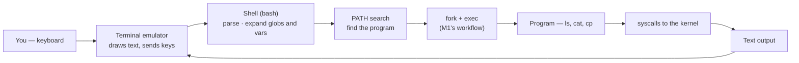

# Module 02 — First Contact with the Terminal

<small>Stage 1 · Foundations · ~1 week at 4 h/day · Prerequisite — Module 01 (the machine model you now talk to).</small>

## Why this matters

A **terminal** (terminal emulator) is a program that displays text and forwards your keystrokes to a
**shell**. The **shell** (Bash here) reads your command lines, runs programs for you, and prints their
output. Terminal = the window; shell = the interpreter inside it.

Module 01 gave you the model of the machine; this module gives you your **hands**. Every topic in this
curriculum — Linux, Docker, Kubernetes, Git, Python, remote GPU boxes — is operated from a shell. This
is the last module that "teaches the terminal": afterwards the terminal is simply the medium everything
else lives in. By the end of the week the prompt is a place you *work*, not a hazard you avoid.

!!! info "What this unlocks"
    M3–M4 administer Linux *through* this prompt · M5 turns today's command lines into scripts · M6 (Vim)
    and M7 (Tmux) live inside the terminal · M9 (SSH) is this exact interface over the network · a
    `docker exec -it … bash` (M16) drops you into a container's shell — **this module, inside a box.**
    Learn it as reflexes now and every later tool is just new vocabulary in the same conversation.

---

## Watch

*Watch once, then rely on the notes below — you should never need to rewatch.*

<div class="lo-video-placeholder" markdown="1">
<span class="lo-play">▶</span>
**Explainer video — coming**
<small>Record per <code>../media/README.md</code>, upload to YouTube, then replace this card with the embed.</small>
</div>

??? note "For the author — drop-in YouTube embed (replace VIDEO_ID)"
    Once the explainer is on YouTube, replace the placeholder card above with:
    ```html
    <div class="lo-video-embed">
      <iframe src="https://www.youtube-nocookie.com/embed/VIDEO_ID"
              title="Module 02 — First Contact with the Terminal"
              allow="accelerometer; autoplay; clipboard-write; encrypted-media; gyroscope; picture-in-picture"
              allowfullscreen></iframe>
    </div>
    ```
    Video script beats (from the blueprint's Definition / Architecture / Misconceptions):
    terminal vs shell (the window vs the person answering the phone) → prompt anatomy →
    the keystroke→output loop (fork/exec back to M1) → globbing happens in the shell, not the program →
    the three safety habits that stand in for `rm`'s missing undo.

**Terminal cast — pending; record per `../media/README.md`.**

!!! tip "Follow along, don't just watch"
    Open the [Guided Lab](#guided-lab-your-first-working-session) in a browser terminal and run each
    command yourself as it appears. Typing beats watching every time — and it is part of how the memory
    forms.

---

## Key Notes

*Standalone. This is the reference you keep.*

### The picture: keystroke to output



The shell is just a program (M1: a **process**) that starts *other* processes and wires their text
input/output back to your terminal. When you type `ls`, the shell searches the directories in `$PATH`
for a program named `ls`, then `fork`+`exec`s it — the exact workflow you traced in Module 01, now
under your fingers.

### Command line anatomy

```
ls -l /home
└─ command   └─ argument (WHAT it operates on)
      └─ option/flag (HOW it behaves)
```

`command -options arguments`. Options modify behaviour; arguments say what to act on; `man` documents
every option there is.

### Paths — the address system

- **Absolute** starts at root `/` — `/home/you/notes.md` — same location from anywhere.
- **Relative** starts at your **working directory** — `notes.md` — depends on where you are.
- `.` = here · `..` = parent · `~` = your home · `-` (with `cd`) = the previous directory.
- `pwd` + `ls` are your **eyes**: where am I, and what's here?

```
 /                    ← root
 ├── home/
 │    └── you/        ← ~ (your home)
 │         └── terminal-lab/   ← cd terminal-lab (relative)  |  /home/you/terminal-lab (absolute)
 ├── etc/   ├── usr/bin/   └── proc/
```

### Prompt anatomy — read it before you type

```
 you @ machine : ~/notes $
 └ user        └ where you are (~ = your home)
       └ which machine        └ "ready" — and a WARNING: # would mean root!
```

A `$` prompt is a normal user (you own your home, mistakes are cheap). A `#` prompt is **root** — every
keystroke has full-system power. This module never needs `#`, and never uses `sudo`.

### Six mechanisms that explain the rest

1. **The PATH search.** Typing `ls` makes the shell scan `$PATH`'s directories for a program named
   `ls`, then fork/exec it. `command not found` means: typo, not installed, or not in PATH.
2. **Globbing is the shell's job.** `*.md` is expanded by the **shell** into matching filenames
   *before* the program runs. The program never sees the `*`. Prove it: `echo *.md`.
3. **Built-in vs program.** `cd` must be a shell **built-in** — a child process couldn't change its
   parent's directory. `ls` is a real program in `/usr/bin`. `type <cmd>` tells you which.
4. **Everything is a file.** Directories, devices, even kernel state (`/proc`) — one namespace, one set
   of tools.
5. **Exit status.** Commands succeed (status `0`) or fail (non-zero) and *say so*. `echo $?` shows the
   last one — your first taste of programmatic error handling (M5 builds on it).
6. **Tab & history are accuracy tools, not conveniences.** Tab completion can't typo a path; `↑` and
   `Ctrl-R` recall exactly what you ran. At scale that's minutes saved and near-zero path errors.

### The safety model — because `rm` has no undo

There is **no trash can** in the terminal: `rm` deletes forever. The three habits that stand in for the
missing undo:

- **Sandbox discipline** — do destructive work only where mistakes are cheap (`~/terminal-lab/`).
- **`ls` before `rm`/`mv`** — look at what exists before you change it.
- **`echo` the glob** — see what `*.md` expands to *before* a destructive command uses it.

Plus: never paste an unread multi-line command (its newlines **execute** as they arrive), and never run
what you can't explain — *especially* with `sudo`.

<div class="lo-remember" markdown="1">
**Must remember (if you keep only six things):**

1. **Terminal = the window; shell (bash) = the interpreter inside it.** Different things.
2. **The shell expands** `*`, `~`, `$VAR` *before* the program sees anything — `echo` shows you what.
3. **Paths:** absolute starts at `/`; relative starts at your working directory. `pwd` + `ls` are your eyes.
4. **`cd` is a built-in, `ls` is a program** — `type <cmd>` tells you which; `$PATH` is where programs are found.
5. **`rm` is forever.** Sandbox · `ls`-before-`rm` · `echo`-the-glob — the three habits that replace undo.
6. **Learn commands from `man`** (start at SYNOPSIS, search with `/`, quit with `q`) — not from guessing.
</div>

---

## Guided Lab: your first working session

*Basic, step-by-step. Read-only commands inspect; the create/copy/delete steps happen ONLY inside a
throwaway `~/terminal-lab/` sandbox you build first — nothing outside it is ever touched.*

<div class="lo-lab-actions" markdown="1">
[▶ Open interactive lab (browser terminal){ .lo-btn }](https://killercoda.com/learning-os/course/killercoda/module-02){ target=_blank }
[View lab source{ .lo-btn .lo-btn--ghost }](https://github.com/randaguiac20/learning-os/tree/main/killercoda/module-02){ target=_blank }
</div>

!!! note "No install needed"
    The button opens a free Ubuntu terminal in your browser (Killercoda) — no signup, nothing to
    install. You can also run every command on any Linux machine.

=== "1 · Read the prompt, get your bearings"
    ```bash
    pwd            # where am I?
    ls             # what's here?
    ls -l          # long form: is each line a file or a directory?
    ls -la ~       # -a reveals hidden dotfiles like .bashrc
    ```
    In *your* prompt, identify the four parts: user, host, current directory, the `$`. Journal: what did
    `-a` reveal, and what is the first character of each `ls -l` line?

=== "2 · Navigate"
    ```bash
    cd /            # to root — recognise M1's filesystem tour
    ls
    cd /usr/bin     # where the programs live
    ls | wc -l      # how many programs? (two programs composed!)
    cd              # bare cd = home
    cd -            # back to where you just were
    ```
    Practice until `cd`, `pwd`, `ls` need zero thought. Reach `/etc` two ways: absolute (`cd /etc`) and
    relative (`cd ../../etc` — adjust for where you are).

=== "3 · Build a sandbox and a tree"
    ```bash
    mkdir ~/terminal-lab            # your sandbox — all destructive work lives here
    cd ~/terminal-lab
    pwd                             # confirm: /home/<you>/terminal-lab
    mkdir -p projects/{alpha,beta}/notes   # one command builds a tree (brace expansion)
    ls -R                           # see the whole structure
    touch projects/alpha/notes/day1.md
    ```
    Journal: what does `-p` do? (Check `man mkdir`.) Verify after every step — that rhythm *is* the lab.

=== "4 · Copy, move, rename — verify each time"
    ```bash
    cp projects/alpha/notes/day1.md day1-backup.md
    ls -R                           # verify the copy exists
    mv day1-backup.md projects/beta/            # move it
    mv projects/beta/day1-backup.md projects/beta/day1-copy.md   # mv also renames
    ls -R                           # verify after EVERY mutation
    ```
    `mv` both moves and renames. The verification rhythm (`ls -R` between mutations) is the real content.

=== "5 · Delete, safely"
    ```bash
    touch trash1 trash2 trash3
    ls                              # look before you delete
    rm -i trash1                    # -i prompts before removing — answer it
    rm trash2 trash3
    ls                              # confirm they're gone
    ```
    !!! warning "Only inside the sandbox"
        Every `rm` here targets scratch files you just created in `~/terminal-lab/`. Never run `rm` (and
        never `rm -rf` at all this month) outside a directory you built for throwaway practice. `ls`
        first, always.

=== "6 · Look inside files, then get help"
    ```bash
    cat /etc/hostname               # whole (small) file
    less /etc/profile               # page it: space, b, /word to search, q to quit
    head -5 /etc/passwd             # first lines
    tail -5 /etc/passwd             # last lines
    wc -l /etc/passwd               # count lines
    man ls                          # the reference: find what -h, -t, -r do — q to quit
    ```
    A pager is not "frozen" — it's *waiting*. `q` gets you out of `less` and `man`. In `man`, read the
    **SYNOPSIS** first and search with `/`.

!!! success "You can stop here and have learned something real"
    If you can read your prompt, navigate anywhere, build and reorganise a tree, delete safely, and
    learn an option from `man` — the guided lab is done. Now make it harder.

---

## Solo Lab: figure it out

*Harder. Goals only — minimal hand-holding. Work in your `~/terminal-lab/` sandbox. Struggle here is
the point; reveal a hint only after you've tried.*

### Challenge 1 — One command, whole tree
Create, in a **single** command, the tree `journal/2026/aug/{week1,week2}` inside the sandbox.

??? tip "Hint"
    `mkdir` has a flag that creates parent directories as needed, and the shell can expand `{a,b}` into
    two names in one go.

??? success "Solution"
    ```bash
    mkdir -p journal/2026/aug/{week1,week2}
    ls -R journal
    ```
    `-p` makes the intermediate dirs (`2026`, `aug`); brace expansion `{week1,week2}` is the shell
    writing out both leaf names before `mkdir` runs.

### Challenge 2 — Count without counting by eye
Find out how many files in `/etc` end in `.conf` — without counting them yourself.

??? tip "Hint"
    List them, then pipe into a line-counter. Beware: some names may hide in subdirectories.

??? success "Solution"
    ```bash
    ls /etc/*.conf | wc -l
    ```
    The shell expands `/etc/*.conf` to the matching paths; `wc -l` counts the lines `ls` prints. (This
    counts the top level of `/etc` only — a fair reading of the task.)

### Challenge 3 — Prove the shell expands the glob, not the program
Show, with one command, exactly what `*.md` becomes *before* any program acts on it.

??? success "Solution"
    ```bash
    echo *.md
    ```
    `echo` just prints its arguments — so it prints the filenames the **shell** already substituted for
    `*.md`. The program never sees the `*`. In an *empty* directory `echo *.md` prints the literal
    `*.md` (no match, so bash leaves the pattern alone) — a preview of M5's `nullglob`.

### Challenge 4 — Learn an unseen option from `man` only
Using **only** `man ls` (no web), make `ls` sort by size, largest last, in human-readable units. State
the SYNOPSIS notation you relied on.

??? success "Solution"
    ```bash
    ls -lShr        # -S sort by size, -r reverse (largest last), -h human units, -l long
    ```
    Found by searching the OPTIONS section (`/size`, `/reverse`, `/human`). SYNOPSIS shows `ls [OPTION]…
    [FILE]…` — options are optional and combinable, which is why `-lShr` bundles four.

### Challenge 5 (stretch) — `type` vs `which` disagree
`type cd` says "shell builtin"; `which cd` may print nothing. Explain the discrepancy precisely.

??? success "Solution"
    `type` reports how **bash** will interpret the word, and a built-in wins over any file — so it names
    `cd` a builtin. `which` only searches `$PATH` for executable **files**; it knows nothing about
    builtins, so for `cd` it finds nothing (or an unrelated file that would never actually run).

---

## Self-Check

*Close the notes. Answer aloud or in writing **first**, then reveal. Recalling — even when it's hard —
is what builds the memory.*

??? question "Terminal vs shell — what is each, and which one is Bash?"
    The **terminal** is the window program that draws text and forwards your keystrokes; the **shell**
    is the command interpreter running inside it. **Bash is the shell.** (Phone line vs the person
    answering: the terminal carries the conversation; bash is who answers.)

??? question "In `ls -l /home`, which part is the option and which the argument?"
    `-l` is the **option** (modifies *how* `ls` behaves — long format); `/home` is the **argument**
    (*what* it operates on).

??? question "Who expands `*.md` — the shell or `ls`? How would you prove it?"
    The **shell**, before the program runs. Prove it with `echo *.md`: `echo` only prints its
    arguments, so what you see is the filenames the shell already substituted — `ls` never sees the `*`.

??? question "Why is `cd` a shell built-in while `ls` is a separate program?"
    `cd` changes the shell's *own* working directory; a child process can't change its parent's
    directory, so it must run inside the shell. `ls` only reads and prints — fine as an external
    program in `/usr/bin`.

??? question "`rm` has no undo. Name the three habits that stand in for one."
    **Sandbox discipline** (act where mistakes are cheap), **`ls`-before-`rm`/`mv`** (look before you
    change), and **`echo`-the-glob** (see the expansion before a destructive command uses it). Backups
    come later (M15).

??? question "`bash: lls: command not found` — the three likely causes, in order?"
    (1) **Typo** of a real command (most likely — retype or Tab-complete); (2) the program **isn't
    installed** (`type lls`, `man lls`); (3) it's installed but **not in `$PATH`** (`echo $PATH`).

??? question "`less` shows `(END)` and won't let you out. What happened, and the key?"
    You're in the **pager** at the end of the file — not frozen, just waiting. Press **`q`** to quit.

!!! example "Teach it back (the real test)"
    Out loud, in **3 minutes, no notes**: *"What is the terminal, what is the shell, and why do
    professionals still use them?"* You must distinguish terminal from shell and give **≥2 engineering
    reasons** (scriptable, remote/SSH, identical everywhere). Then, in **90 seconds**, teach *"what is a
    path?"* to a 10-year-old — postal-address analogy required, then show `pwd`/`cd` making it real. If
    you can't yet, that's your signal to reread the Key Notes, not to move on.

---

## Mastery checklist

*Tick these honestly, cold (no notes). They **gate** progress — passing M2 also closes **Stage 1**. A
module is only "done" when every box is true.*

- [ ] **Explain** terminal vs shell vs prompt vs command precisely, with the process model underneath.
- [ ] **Draw** all three from memory: the keystroke→output loop, the path tree, and prompt anatomy.
- [ ] **Navigate** to any of `/etc`, `/var/log`, `/usr/bin`, `~`, the sandbox, `/proc` and prove arrival with `pwd` — Tab-completing, no wrong turns.
- [ ] **Build** the Level-2 sequence (tree, files, copy, rename, safe delete) in under 3 minutes, zero errors, a verify between every mutation.
- [ ] **Develop** a novel two-command pipe (e.g. count matching files) and explain each part.
- [ ] **Secure:** state *and* demonstrate the safety habits — sandbox, `ls`-before-`rm`, `echo`-the-glob, read-before-paste, no-sudo.
- [ ] **Troubleshoot** one unseen planted failure (typo / wrong dir / stuck pager / empty glob) with a stated method: hypothesis → check → fix.
- [ ] **Debug** a misbehaving glob with `echo` and interpret both possible findings (no match vs wrong directory).
- [ ] **Optimize:** show Tab / `Ctrl-R` / `Ctrl-A` / `Ctrl-E` / `Ctrl-C` fluency live, and say why keystrokes matter at scale.
- [ ] **Configure:** show and explain 3 lines of your own `~/.bashrc` (read-only understanding).
- [ ] **Self-serve:** solve ≥3 unseen tasks using only `man` (start at SYNOPSIS), and score ≥80% on the validation bank.
- [ ] **Teach:** pass the teach-back above (terminal-vs-shell explanation mandatory).

---

## Review — lock it in

Spaced repetition is not optional; it's where the memory actually forms. From this module on
**interleaving is active** — every M2 review also pulls in one Module 01 item. Schedule these and
*keep* them:

| When | Do | Interleaved M1 item |
|---|---|---|
| **Day 1** | Command sprint cold (dir → file → copy → rename → verify → safe delete) · all flashcards | One 1-minute "what is an OS" explanation |
| **Day 3** | Redraw the keystroke loop · glob-prediction sprint · debug an empty-glob scenario | `free -h` interpretation cold |
| **Day 7** | Rebuild the sandbox tree from nothing, unaided · the safety-habit questions | Memory-hierarchy diagram from memory |
| **Day 14** | Learn one unseen command via `man`/SYNOPSIS only · "press Enter" walkthrough, timed | Boot-sequence narration |
| **Day 30** | Recreate the Terminal Home structure in ≤10 min · the two stretch challenges | M1 machine-inspection diagnosis |

**Connects forward to:** Bash scripting (M5 — today's command lines, written to a file) · Vim (M6) and
Tmux (M7), which live inside the terminal · SSH (M9 — this interface over the network) · Git (M8) and
Claude Code (M11), commands obeying today's anatomy · Docker (M16), where `docker exec -it … bash` is
this module inside a container.

!!! quote "The one-sentence takeaway"
    M1 taught what the machine is; M2 taught how to talk to it — every remaining module is just new
    vocabulary in this same conversation.
