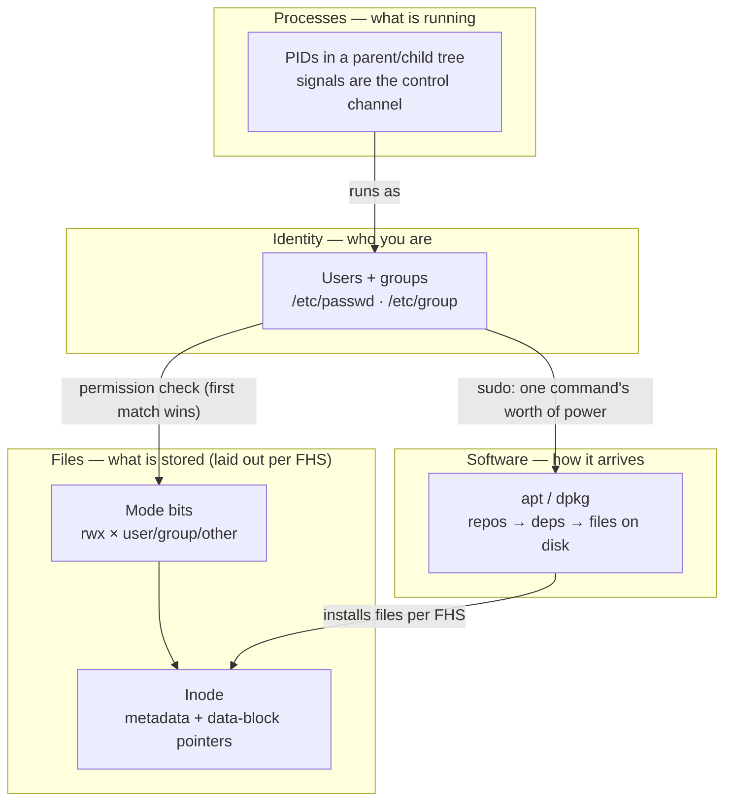
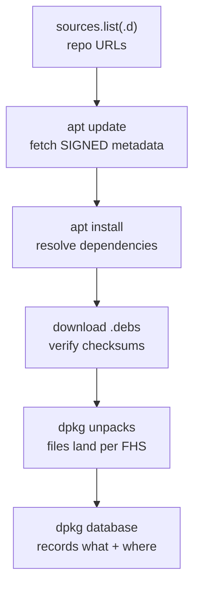
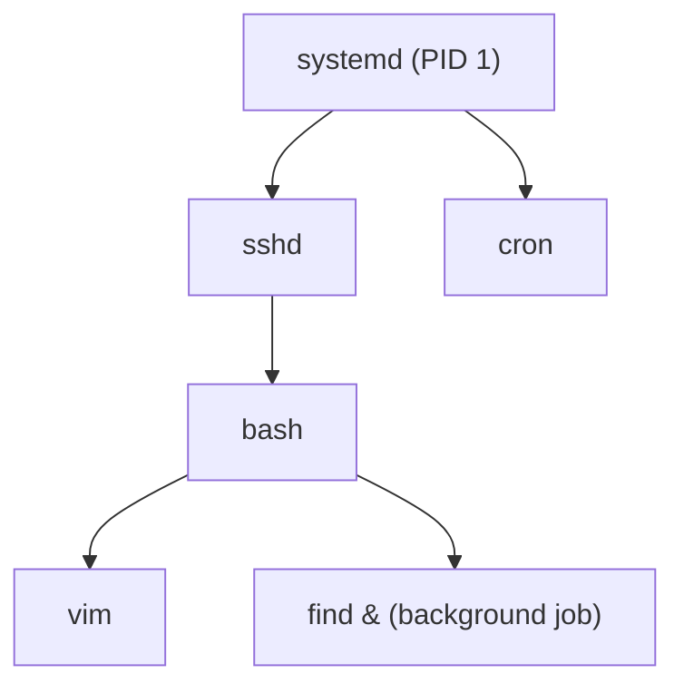

# Module 03 — Linux Essentials

<small>Stage 2 · Core Concepts · ~3 weeks at 4 h/day · Prerequisite — Module 02 (the terminal you'll type all of this in).</small>

## Why this matters

**Linux** is, strictly, a kernel (M1); practically, a family of operating systems (**distributions**)
that bundle that kernel with a GNU userland, a package manager, and defaults. **Linux Essentials** is
the resident-level skill set: knowing *where* everything lives, *who* may touch what, *how* software
arrives, and *how* running programs are controlled.

Module 02 gave you hands at the prompt; this module makes you a resident instead of a visitor. Every
privileged action in your career — deploying, securing, debugging production — reduces to **four
pillars**: files, permissions, packages, and processes. Install them properly now and nothing later is
mysterious; a container (M16) is just these four pillars boxed.

!!! info "What this unlocks"
    M4 supervises files + users as **services** (units in `/etc`, logs in `/var/log`) · M5 scripts
    manipulate all four pillars · M9 SSH **refuses** keys that aren't `600` — this module explains why
    that's right · M16 Docker images are an FHS tree + a dpkg database, and a Dockerfile's `USER` is
    `useradd` thinking · M19 Kubernetes `securityContext` (`runAsUser`, `fsGroup`) is this permission
    model declared in YAML · M24 least privilege starts here. **Learn the four pillars at laptop scale
    now, or debug them blind at production scale later.**

---

## Watch

*Watch once, then rely on the notes below — you should never need to rewatch.*

<div class="lo-video-placeholder" markdown="1">
<span class="lo-play">▶</span>
**Explainer video — coming**
<small>Record per <code>../media/README.md</code>, upload to YouTube, then replace this card with the embed.</small>
</div>

??? note "For the author — drop-in YouTube embed (replace VIDEO_ID)"
    Once the explainer is on YouTube, replace the placeholder card above with:
    ```html
    <div class="lo-video-embed">
      <iframe src="https://www.youtube-nocookie.com/embed/VIDEO_ID"
              title="Module 03 — Linux Essentials"
              allow="accelerometer; autoplay; clipboard-write; encrypted-media; gyroscope; picture-in-picture"
              allowfullscreen></iframe>
    </div>
    ```
    Video script beats (from the blueprint's Analogy / Visual Model / Misconceptions):
    the four pillars (files · identity · software · processes) → the library-card analogy (name vs
    inode — the card points to the book) → permissions as first-match evaluation, not additive → the
    directory-`w` surprise (deleting edits the *directory*, not the file) → apt as a librarian with a
    signed catalog, not a downloader → `sudo` as a scalpel with a logbook, not a crown → TERM before
    KILL, always.

**Terminal cast — pending; record per `../media/README.md`.**

!!! tip "Follow along, don't just watch"
    Open the [Guided Lab](#guided-lab-become-a-resident) in a browser terminal and run each command
    yourself as it appears. Typing beats watching every time — and it is part of how the memory forms.

---

## Key Notes

*Standalone. This is the reference you keep.*

### The picture: the four pillars



Access is **identity × mode bits**: the kernel decides what you may do by matching *who you are* against
the *rwx bits* on the inode. Software enters only one sane way (packages), and running programs are
governed only one polite way (signals). Master these four and you can audit any Linux system.

### The FHS map — where things belong

The **Filesystem Hierarchy Standard** (FHS 3.0) is why your skills transfer between distros: the layout
is a standard, not a distro quirk.

| Directory | Holds | Remember it as |
|---|---|---|
| `/etc` | host-specific **config** (text files) | the settings drawer |
| `/var/log` | **variable** data — logs especially | what grows over time |
| `/usr/bin` | **package-installed** binaries | software apt put there |
| `/usr/local/bin` | **locally-built** software (outside the package manager) | what *you* compiled |
| `/home` | each user's data | your stuff |
| `/srv` | data served to others (shared workspaces) | shared drives |
| `/tmp` | scratch, world-writable + sticky (`1777`) | throwaway |
| `/opt` | self-contained add-on packages | bundled add-ons |
| `/proc`, `/sys` | live kernel views as files | the kernel, as files |
| `/boot` | kernel images + bootloader | what M1's boot loaded |

### Files: name vs inode

A filename is *not* the file. The **inode** is the file — its metadata (owner, mode, times, link count)
plus pointers to the data blocks. A name is just a directory entry mapping a label to an inode number.

| Operation | What it does to the inode |
|---|---|
| `ln original hardlink` | second **name** → same inode (`links=2`); either name reaches the data |
| `ln -s target softlink` | separate tiny inode holding a **path**; resolved at open, can **dangle** |
| `mv` (same filesystem) | renames — **same** inode |
| `cp` | **new** inode, new data blocks |
| `rm name` | removes a **name**; the inode (and disk space) dies only when its **last name** *and* **last open handle** are gone |

That last row is the answer to *"I deleted a huge log but `df` didn't change"*: a process still holds the
inode open, so the blocks stay allocated until it closes them. This is `ls -i` and `stat` truth.

### Permissions: identity × mode bits

Read `-rwxr-x--- 2 alice dev 1200 Aug 20 deploy.sh` left to right:

| Field | Value | Meaning |
|---|---|---|
| type | `-` | `-` file · `d` directory · `l` symlink |
| owner | `rwx` | alice: read, write, execute → **7** |
| group | `r-x` | dev: read, execute/traverse → **5** |
| other | `---` | everyone else: nothing → **0** |
| links | `2` | a hard link exists somewhere |
| owner / group | `alice` / `dev` | the identities that own it |

So `rwxr-x---` is octal **750**. Two rules do most of the work:

- **Evaluation is first-match, not additive.** The kernel checks: are you the owner? apply **owner**
  bits and stop. Else in the group? apply **group** bits and stop. Else **other** bits. An owner whose
  bits are `---` is locked out of their own world-readable file.
- **Directory bits mean something different:** `r` = list names, `w` = **create/delete entries (even
  files you don't own!)**, `x` = traverse/enter. Directory `w` is *deletion power* — the #1 permissions
  surprise. The fix is the **sticky bit** (`+t`, as on `/tmp`'s `1777`): only an entry's owner may
  delete it.

Two more you'll meet in the labs: **`umask`** subtracts from the defaults (`022` → new files `644`,
dirs `755`), and **setgid on a directory** (`2775`, shown `drwxrwsr-x`) makes new files inherit the
*directory's* group — the trick that keeps a shared space group-consistent.

### Software: the apt pipeline



`update` refreshes repo **metadata** (signature checked **here** — the software trust chain); `install`
resolves dependencies against it, downloads `.deb`s, unpacks per FHS, runs maintainer scripts, and
records state. That database is why installs are inspectable and reversible: `dpkg -L pkg` lists what
landed where, `dpkg -S /path` finds which package owns a file, and **`remove`** keeps config files
(state `rc`) while **`purge`** deletes them too. Packages are the *only* sane way software enters — and
the only way it leaves cleanly. `curl | bash` is the anti-pattern.

### Processes & signals



Processes form a **tree** (`ps auxf` shows it); **signals** are the only polite way to talk to them:

| Signal | `kill` form | Meaning |
|---|---|---|
| SIGTERM | `kill PID` (default) | **ask** politely — a handler may flush data and clean up |
| SIGKILL | `kill -9 PID` | **unrefusable** — the kernel just stops scheduling it; no cleanup, data at risk |
| SIGHUP | `kill -HUP PID` | conventionally **reload config** |
| SIGTSTP | `Ctrl-Z` | suspend the foreground job |

**TERM before KILL, always** — `-9` forbids last words. Job control (`&`, `Ctrl-Z`, `bg`, `fg`, `jobs`)
is the shell multiplexing your terminal between processes.

### Six mechanisms that explain the rest

1. **Name vs inode.** Names point to inodes; permissions live on inodes; directories are just
   name→inode tables. Explains hard links, `mv` vs `cp`, and deleted-but-full disks.
2. **First-match permission evaluation.** Owner → group → other, first match wins and stops.
3. **Directory `w` is deletion power.** Deleting a file edits its *directory*, not the file — sticky bit
   is the fix.
4. **`umask` explains birth modes.** Files are born `644`, dirs `755` under the usual `022` mask.
5. **apt's pipeline ends in a database.** Signed metadata → dependency resolution → files per FHS →
   recorded — which is why removal is clean and `dpkg` can answer *what* and *where*.
6. **Signals govern the process tree.** TERM asks, KILL forces, HUP reloads; `sudo` is per-command,
   scoped, and logged — a scalpel with a logbook, not a skeleton key.

<div class="lo-remember" markdown="1">
**Must remember (if you keep only six things):**

1. **A name is not the file — the inode is.** `rm` removes a name; the data dies when the last name *and*
   last open handle go.
2. **Access = identity × mode bits, evaluated first-match** — owner, else group, else other; owner
   `---` locks the owner out.
3. **Directory `w` = the right to delete** entries you don't own. Sticky bit (`/tmp`'s `1777`) is the fix.
4. **Groups are how you share; `chmod 777` is how you leak.** Setgid (`2775`) keeps shared dirs
   group-consistent.
5. **Packages are the only sane way software enters** — `apt`/`dpkg` verify, resolve, and record; not
   `curl | bash`. `remove` keeps config, `purge` deletes it.
6. **TERM before KILL**, and `sudo` the *command*, not a shell — scoped, logged, revocable.
</div>

---

## Guided Lab: become a resident

*Basic, step-by-step. Read-only commands (`ls`, `stat`, `find`) inspect and change nothing; the
create/link/chmod steps happen ONLY inside a throwaway `~/learning/labs/m3/` sandbox you build first.
This guided lab needs **no `sudo`** — the sudo work waits for the Solo Lab.*

<div class="lo-lab-actions" markdown="1">
[▶ Open interactive lab](https://killercoda.com/learning-os/course/killercoda/module-03){ .lo-btn target=_blank }
[⧉ Open in Codespaces](https://codespaces.new/randaguiac20/learning-os){ .lo-btn target=_blank }
[⌨ Run locally](#run-locally){ .lo-btn .lo-btn--ghost }
[View lab source](https://github.com/randaguiac20/learning-os/tree/main/killercoda/module-03){ .lo-btn .lo-btn--ghost target=_blank }
</div>

<span id="run-locally"></span>
!!! tip "Three ways to run this lab — pick any (all free)"
    - **Instant, no account** — click **Open interactive lab** (Killercoda): a Linux terminal in your browser.
    - **Your own cloud** — click **Open in Codespaces**: runs in your GitHub account's free tier (120 core-hrs/mo).
    - **Local, unlimited, $0** — any Linux / macOS / WSL terminal, or a throwaway container: `docker run -it ubuntu bash`, then follow the steps below.

    Killercoda is the zero-setup on-ramp; Codespaces and local use *your own* free resources, so they scale to any class size.

=== "1 · FHS expedition"
    ```bash
    ls -ld /etc /var/log /usr/bin /usr/local/bin /tmp /home   # who owns each? what mode?
    ls /etc | head                 # config files — name 3 you can explain
    ls -ld /tmp                     # note the trailing t: sticky (1777)
    cat /etc/hostname               # a real host config file
    ```
    Journal: what's the difference between `/usr/bin` and `/usr/local/bin` (check the FHS)? Notice the
    layout has a *permission pattern* — system dirs are owned by root and world-**readable**, not
    world-writable.

=== "2 · Build the sandbox, then inodes & hard links"
    ```bash
    mkdir -p ~/learning/labs/m3    # your sandbox — all mutating work lives here
    cd ~/learning/labs/m3
    echo data > original
    ls -i original                 # note the inode number
    ln original hardlink           # a second NAME for the same inode
    ls -li                         # same inode! link count is now 2
    rm original                    # remove one name...
    cat hardlink                   # ...the data lives on (inode still has a name)
    ```
    Journal the name-vs-inode explanation in your own words: `rm` removed a *label*, not the file.

=== "3 · Symlinks & their traps"
    ```bash
    ln -s hardlink softlink        # a symlink stores a PATH, not an inode
    ls -l                          # see the arrow: softlink -> hardlink
    rm hardlink                    # remove the target...
    cat softlink                   # ...now it DANGLES (No such file or directory)
    ls -l /usr/bin/python3*        # a real symlink chain out in the wild
    readlink -f /usr/bin/python3   # follow it to the final target
    ```
    A dangling symlink points at a path that no longer exists. Recreate `hardlink` (`echo data >
    hardlink`) to heal it, then verify with `cat softlink`.

=== "4 · Read and set modes"
    ```bash
    touch secret.md
    chmod 600 secret.md            # owner rw, nobody else
    ls -l secret.md                # say it aloud: rw------- = 600
    chmod u+x,g+r,o-r secret.md    # symbolic: predict ls -l BEFORE running
    ls -l secret.md
    chmod 644 secret.md            # back to a sane default
    stat secret.md                 # inode, links, and the three timestamps
    ```
    Predict every `ls -l` line *before* you run the `chmod`. Octal and symbolic are two notations for the
    same nine bits.

=== "5 · The directory-permission surprise"
    ```bash
    mkdir vault && touch vault/gem
    chmod 600 vault                # no x on the dir...
    ls vault                       # ...FAILS: can't list without x
    chmod 100 vault                # x but no r
    cat vault/gem                  # works! you can traverse to a known name
    ls vault                       # still fails: r lists names, x traverses
    chmod 700 vault                # restore
    ```
    `r` lists names, `x` traverses, `w` **creates/deletes entries**. Directory `w` is deletion power —
    which is exactly why `/tmp` adds the sticky bit.

=== "6 · find, and index vs scan"
    ```bash
    find ~ -name '*.md'            # QUOTE the glob — let find expand it, not the shell (M2!)
    find ~ -type d                 # only directories
    find ~/learning -name '*.md' -exec wc -l {} +   # compose a search with an action
    find /etc -name '*.conf' 2>/dev/null            # 2>/dev/null hides permission errors
    ```
    Those hidden errors are *correct* — you're not root, so some of `/etc` is off-limits. `find` walks
    the live tree (always true, slower); `locate` reads a prebuilt index (fast, maybe stale) — your first
    scan-vs-index trade-off.

!!! success "You can stop here and have learned something real"
    If you can read the FHS layout, explain name-vs-inode, set modes in both notations, demonstrate the
    directory-`w` surprise, and compose a `find -exec` — the guided lab is done. Now make it harder.

---

## Solo Lab: figure it out

*Harder. Goals only — minimal hand-holding. Work in `~/learning/labs/m3/`. Challenges 3–5 use your
**first `sudo`**: read the command aloud, state exactly what it touches, then run it. Struggle here is
the point; reveal a hint only after you've tried.*

### Challenge 1 — Prove your home has no world-writable files
Find every world-writable file under your home directory. There should be none — if any turn up, explain
and fix.

??? tip "Hint"
    `find` can test permission bits directly. The pattern for "world-writable" is a `-perm` test on the
    other-write bit (`o+w`).

??? success "Solution"
    ```bash
    find ~ -type f -perm -o+w
    ```
    `-perm -o+w` matches files where the *other-write* bit is set, regardless of the rest. Empty output
    is the healthy answer. Fix any hit with `chmod o-w <file>` — world-writable is how malware persists.

### Challenge 2 — The deletion trap, then prevent it
Create a directory where a file **you own** could be deleted by someone else (directory `w` for group),
then redesign it so sharing stays but deletion-by-others stops.

??? tip "Hint"
    Directory `w` grants deletion. The fix is the same one `/tmp` uses — a special bit that restricts
    deletion to each entry's owner. Check `man chmod` for `/sticky`.

??? success "Solution"
    ```bash
    mkdir trap && chmod 770 trap        # group has w on the dir = can delete anyone's entries
    chmod +t trap                       # sticky bit: only an entry's owner may delete it
    ls -ld trap                         # drwxrwx--T  → the T is the sticky bit
    ```
    Sharing (group `rwx`) is preserved; the sticky bit removes the deletion-by-others hazard. This is the
    heart of the "Shared Space, Governed" project below.

### Challenge 3 — [sudo] Own the software lifecycle
Investigate an unseen package **before** installing it, install it, inventory its files, use it once,
then remove it leaving zero trace — narrating each apt pipeline stage as it happens.

??? tip "Hint"
    Never install blind: `apt show` (deps, size, origin) and `apt policy` (which repo?) come *before*
    `install`. `dpkg -L` inventories; `purge` (not `remove`) leaves zero trace.

??? success "Solution"
    ```bash
    sudo apt update                     # refresh signed metadata
    apt show tree                       # read deps, size, origin BEFORE installing
    apt policy tree                     # which repo/version would you get?
    sudo apt install -y tree
    dpkg -L tree                        # inventory: every file, FHS-shaped
    tree ~/learning -L 2                # use it once, meaningfully
    sudo apt purge -y tree              # remove AND delete config (remove alone leaves rc state)
    dpkg -l | grep tree || echo "gone without trace"
    ```
    `remove` would leave config files (`dpkg -l` state `rc`); `purge` deletes them too. Read every apt
    prompt before confirming — never blind-confirm an `autoremove` list.

### Challenge 4 — [sudo] Signals without collateral damage
Start a background job, suspend and resume it with job control, then send TERM (not KILL) to a specific
PID you locate precisely. No wrong victims.

??? tip "Hint"
    `Ctrl-Z` suspends, `bg`/`fg` move a job, `jobs` lists them. Find an exact PID with `pgrep`, and reach
    for TERM first — KILL only if TERM is ignored.

??? success "Solution"
    ```bash
    sleep 500 &                         # background job
    jobs                                # [1]+ Running
    fg                                  # bring it forward, then press Ctrl-Z to suspend
    jobs                                # [1]+ Stopped
    bg                                  # resume in the background
    pgrep -a sleep                      # find the EXACT pid (not a broad match)
    kill -TERM <pid>                    # ask politely — the default signal
    pgrep sleep || echo "terminated cleanly"
    ```
    TERM lets a handler flush and clean up; `kill -9` (KILL) forbids that and risks data. TERM before
    KILL, every time.

### Challenge 5 (stretch) — Which package owns `/bin/ls`?
In a single command, discover which installed package owns `/bin/ls` — found via `man dpkg`, no web.

??? success "Solution"
    ```bash
    dpkg -S /bin/ls
    ```
    `dpkg -S <path>` is the reverse of `dpkg -L <pkg>`: it searches the dpkg database for the package
    that installed a given file (here, `coreutils`). Reverse lookup is how you answer "where did this file
    come from?" on any Debian-family system.

??? note "Mini-project — Shared Space, Governed (from `08-projects.md`)"
    Productionize challenges 2–4 into a documented multi-user workspace: a `team` group and a test user;
    `/srv/shared` with **setgid + sticky** (`3775`) so new files inherit the group *and* only owners may
    delete their own; a `drop/` (all write) and a `published/` (you write, others read); every property
    **proven** by a test run as both users; and a reviewed (not run) `teardown.sh`. Write it up in
    `~/learning/projects/shared-space/README.md` with the 6-claim test matrix (create/read/delete ×
    own/other's files). M4 will point a service at it; M5 will script an audit of it.

---

## Self-Check

*Close the notes. Answer aloud or in writing **first**, then reveal. Recalling — even when it's hard —
is what builds the memory.*

??? question "What is an inode, and what does a filename have to do with it?"
    The **inode is the file itself** — metadata (owner, mode, times, link count) plus pointers to the
    data blocks. A **filename is a directory entry** mapping a label to an inode number: a card in a
    catalog, not the book. Two names (a hard link) can point at one inode.

??? question "Decode `-rwxr-x--- 2 alice dev` — every field, plus the octal."
    Regular file (`-`); owner **alice** has `rwx` (7); group **dev** has `r-x` (5); other has `---` (0);
    link count **2** means a hard link exists. The mode is **750**.

??? question "State the permission evaluation order exactly. Is it additive?"
    **Not additive — first match wins and stops.** Owner? apply owner bits only. Else in the group?
    group bits only. Else other bits. An owner whose bits are `---` is locked out of their own
    world-readable file.

??? question "A file you own can be deleted by someone else. Which permission on which object, and the fix?"
    The **`w` bit on the containing directory** — deleting a file edits the *directory's* entry table,
    not the file. Fix: the **sticky bit** (`chmod +t`, as on `/tmp`'s `1777`), which limits deletion to
    each entry's owner.

??? question "`apt remove` vs `apt purge`?"
    `remove` deletes the package's files but **keeps its config** (dpkg state `rc`); `purge` deletes the
    config too. If a reinstall behaves oddly because old config lingered, you should have `purge`d.

??? question "`kill PID` vs `kill -9 PID` — and when does the difference actually matter?"
    Default is **SIGTERM**: a polite *ask* a handler can catch to flush data and clean up. **SIGKILL**
    (`-9`) is unrefusable — the kernel just stops scheduling it, no cleanup. They look identical on a
    `sleep`, but differ the moment a process has cleanup to do. **TERM first, KILL only as last resort.**

??? question "Disk is 95% full; you deleted the biggest logs; `df` didn't move. Why, and how do you find the holder?"
    A process still holds the deleted file's **inode open**, so its blocks stay allocated until the
    handle closes. Deletion removed the *name*, not the data. Find the holder with `lsof` (it marks the
    entry `(deleted)`), then HUP or restart that process to release the space.

!!! example "Teach it back (the real test)"
    Out loud, in **4 minutes, no notes**: *"Explain Linux's permission model end to end — identity, bits,
    evaluation order, and the directory rules."* You **must** land **first-match evaluation** and the
    **directory-`w` surprise**. Then, in **90 seconds**, teach *"why installing from the app store beats
    downloading a random installer"* to a non-technical parent — using apt's pipeline (signed catalog,
    dependency resolution, clean removal) in plain words. If you can't yet, that's your signal to reread
    the Key Notes, not to move on.

---

## Mastery checklist

*Tick these honestly, cold (no notes). They **gate** progress to Module 04. A module is only "done"
when every box is true.*

- [ ] **Explain** the permission model with evaluation order *and* the directory rules, flawlessly.
- [ ] **Draw** all four from memory: the mode decoder, name→inode→data (with a hard link + symlink), the apt pipeline, and a process tree.
- [ ] **Define** 15 random terms cold (inode, setgid, conffile, SIGHUP, repo, umask, sticky bit…) in ≤2 sentences each.
- [ ] **Build** the shared-space scenario cold in ≤10 min — setgid + sticky, tested as *both* users.
- [ ] **Administer** a full user lifecycle: create with home + shell, add to a group, verify, remove with `-r` — narrated.
- [ ] **Develop** a novel `find -exec` that solves an unseen file-audit ask.
- [ ] **Secure:** run a mini-audit — `sudo -l`, a world-writable sweep, a setuid inventory — and judge each finding.
- [ ] **Monitor** a `ps auxf` tree and read the STAT column; spot the odd process (Z / D) in a listing.
- [ ] **Troubleshoot** the deleted-but-full-disk case: explain the inode model and resolve with `lsof`.
- [ ] **Optimize:** measure `find` vs `locate` and justify the choice for two different use cases.
- [ ] **Configure:** add aliases to `~/.bashrc` (with a dated backup) and explain one `sudoers` line read via `visudo`.
- [ ] **Self-serve:** solve ≥3 unseen tasks using only `man`/FHS, and score ≥80% on the validation bank.
- [ ] **Teach:** pass the teach-back above (the permission-model explanation is mandatory).

---

## Review — lock it in

Spaced repetition is not optional; it's where the memory actually forms. Interleaving stays active —
every M3 review also pulls in a prior-module item. Schedule these and *keep* them:

| When | Do | Interleaved prior-module item |
|---|---|---|
| **Day 1** | Octal + reverse sprints (750, 700, 2775, 1777 → rwx and back) · all flashcards | M2 flashcards you missed |
| **Day 3** | Redraw the apt pipeline · rebuild the setgid+sticky shared dir from memory | M1: memory hierarchy with latencies |
| **Day 7** | Permission charades cold (6 `ls -l` lines, who-can-do-what) · the two debugging cases | M2: the keystroke→output loop |
| **Day 14** | Design an unseen permission scheme cold, commands included · redo the sudo mini-audit | M1: boot-sequence narration |
| **Day 30** | Mini-project self-review · the deleted-but-full-disk case + `lsof` recovery | M2 cookbook prune |

**Connects forward to:** Linux Administration (M4 — services are processes with users + files, logs in
`/var/log`) · Bash scripting (M5 — every command here becomes a building block) · SSH (M9 — keys *demand*
`600`, and now you know why) · Docker (M16 — an image is an FHS tree + a dpkg database; `USER` is
`useradd` thinking) · Kubernetes (M19 — `securityContext` is this model in YAML) · Security (M24 — least
privilege, setuid audits, and the supply-chain trust chain, grown up).

!!! quote "The one-sentence takeaway"
    Containers, clusters, and clouds are these four pillars in new packaging — master files, permissions,
    packages, and processes here at laptop scale, or debug them blind at production scale later.
