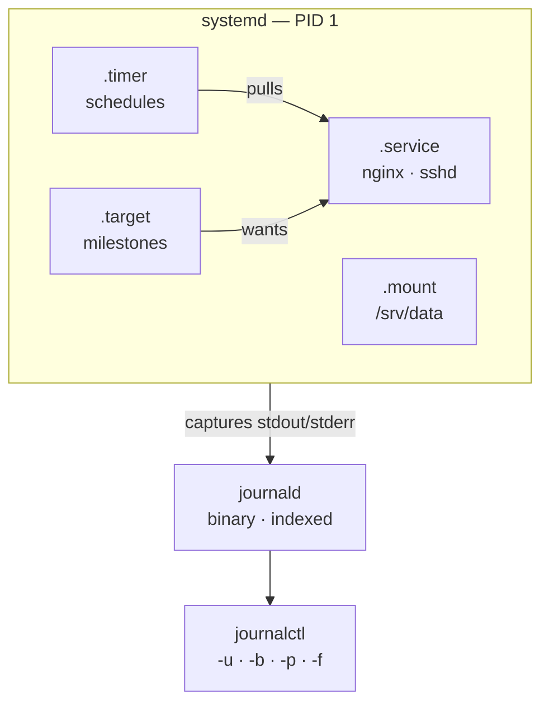
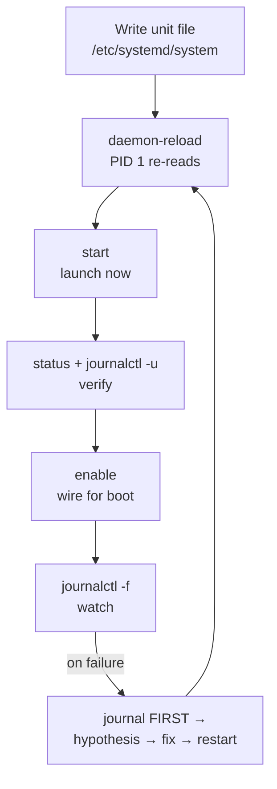
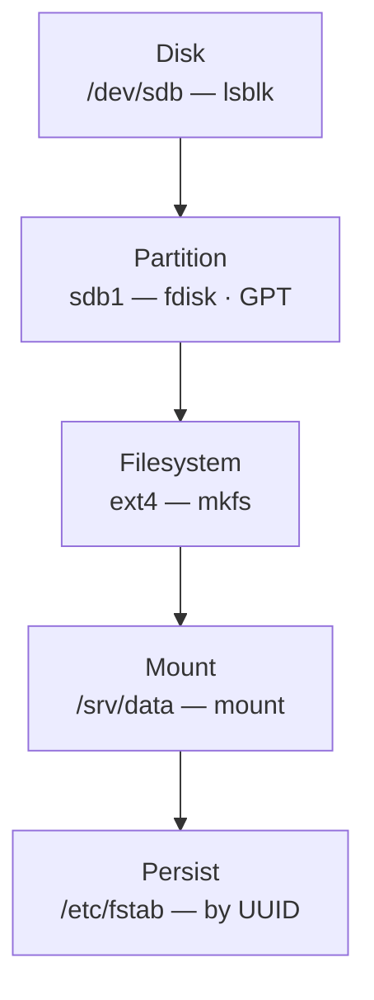

# Module 04 — Linux Administration

<small>Stage 2 · Core Concepts · ~3 weeks at 4 h/day · Prerequisite — Module 03 (the Linux pillars you now make run *unattended*).</small>

## Why this matters

**Linux administration** is operating the system as a deliberate machine: supervised long-running
programs (**services**), durable records of what happened (**logs**), managed places for data to live
(**storage**), work that runs without you (**schedules**), and insurance against loss (**backups**).

Module 03 gave you the pillars — users, permissions, packages, processes. This module makes them run
*unattended*. Every production system is exactly this module at scale: services that restart
themselves, logs that answer "what happened at 3 AM", disks that don't fill silently, jobs that fire on
time, and backups that actually restore. This is also where the **VM habit** begins — destructive
practice belongs in disposable machines with snapshots, never on a box you care about.

!!! info "What this unlocks"
    M5 turns today's command lines into **scripts that become services and timers** · M15 (automation) is
    these exact mechanisms driven by code across a fleet · M16 (Docker) largely **replaces unit files
    per-app** — `docker run --restart=on-failure` *is* supervision, and you'll compare them head-on · M19
    (Kubernetes) rhymes with everything here — desired state, supervision, dependencies, timers, mounts —
    it is **M4 at cluster scale** · M25 ships journald off-box to central logging. Learn the reconciliation
    instinct now, where the whole system still fits in your head.

---

## Watch

*Watch once, then rely on the notes below — you should never need to rewatch.*

<div class="lo-video-placeholder" markdown="1">
<span class="lo-play">▶</span>
**Explainer video — coming**
<small>Record per <code>../media/README.md</code>, upload to YouTube, then replace this card with the embed.</small>
</div>

??? note "For the author — drop-in YouTube embed (replace VIDEO_ID)"
    Once the explainer is on YouTube, replace the placeholder card above with:
    ```html
    <div class="lo-video-embed">
      <iframe src="https://www.youtube-nocookie.com/embed/VIDEO_ID"
              title="Module 04 — Linux Administration"
              allow="accelerometer; autoplay; clipboard-write; encrypted-media; gyroscope; picture-in-picture"
              allowfullscreen></iframe>
    </div>
    ```
    Video script beats (from the blueprint's Analogy / Visual Model / Misconceptions):
    the babysitter analogy for supervision (PID 1 is every service's parent) → enable-vs-start (setting the
    alarm vs waking up) → the journal as flight recorder, not diary → the bookshelf-on-wheels for a mount
    (fstab is the note to wheel it back every morning) → the spare-tire-never-inflated for untested backups
    (the GitLab 2017 case: five mechanisms, zero restores).

**Terminal cast — pending; record per `../media/README.md`.**

!!! tip "Follow along, don't just watch"
    Open the [Guided Lab](#guided-lab-services-the-journal) in a browser terminal and run each command
    yourself as it appears. Typing beats watching every time — and it is part of how the memory forms.

---

## Key Notes

*Standalone. This is the reference you keep.*

### The picture: supervision and the journal



**systemd** is PID 1 — the parent of every service (Module 01's process tree, at the top). It reads
declarative **unit** files, starts everything that *can* run in parallel by resolving a dependency
graph, and **supervises**: when a service exits, it applies policy (`Restart=on-failure`, backoff). It
also wires each service's stdout/stderr into **journald**, which stamps every line with metadata (unit,
PID, boot ID, priority) and indexes it so `journalctl` can answer questions a flat text log cannot.

### Unit anatomy — read it before you write it

A unit file is INI-style, in three sections. This is a hardened oneshot health reporter:

| Line | Section | Role |
|---|---|---|
| `Description=Health reporter` | `[Unit]` | identity |
| `After=network.target` | `[Unit]` | **ordering** — start after the network is up |
| `ExecStart=/usr/local/bin/health.sh` | `[Service]` | **what** to run (absolute path — always) |
| `Type=oneshot` | `[Service]` | runs and exits (vs `simple` for a long-running daemon) |
| `User=caretaker` | `[Service]` | **who** it runs as — M3 least-privilege identity |
| `Restart=on-failure` | `[Service]` | supervision policy — restart on crash only |
| `WantedBy=multi-user.target` | `[Install]` | **boot wiring** — who "wants" me at boot |

Vendor units live in `/usr/lib/systemd/system/` — **never edit them** (lost on upgrade). Your units and
overrides go in `/etc/systemd/system/`; use `systemctl edit` for drop-ins that keep the vendor file
pristine.

### `enable` ≠ `start` — the #1 beginner confusion

These are independent axes — boot-wiring versus now — and conflating them (both directions) is the
classic mistake. "It worked until I rebooted" means you `start`ed but never `enable`d.

| | `start` / `stop` | `enable` / `disable` |
|---|---|---|
| **What it does** | asks PID 1 to launch/kill the unit **now** | creates/removes a symlink in the target's `.wants/` dir |
| **Mechanism** | acts on `[Service]` | acts on `[Install]` |
| **Survives reboot?** | no | yes (that's the whole point) |
| **Both at once** | — | `systemctl enable --now <unit>` |

After editing any unit file you must `sudo systemctl daemon-reload` — systemd caches parsed units in
memory, so editing the file on disk changes nothing until PID 1 re-reads it. `systemctl cat <unit>`
shows what's **really** loaded, drop-ins included.

### The operator's loop



**Journal first, always.** For every "why did it fail?" the answer is nearly always already printed:
`journalctl -u <unit> -b` before you theorize. `status=203/EXEC` = bad `ExecStart` path, missing execute
bit, or a broken interpreter. A unit that `activating (auto-restart)` in a loop is crash-looping under
`Restart=` — read the journal for the cause; do not just remove `Restart=` (that hides the disease, keeps
the corpse down).

### The storage stack — device to persistent mount



Each layer has its own tool and its own failure mode. Persistence is an fstab line of **six fields**:

| Field | Example | Meaning |
|---|---|---|
| device | `UUID=1234-…` | **by UUID, never `/dev/sdb1`** — device names reorder |
| mount point | `/srv/data` | must already exist (`mkdir`) |
| type | `ext4` | filesystem |
| options | `defaults,nofail` | `nofail` = a missing disk won't block boot |
| dump | `0` | legacy backup flag |
| pass | `2` | fsck order (`1` for root, `2` for others) |

The professional test is **`sudo mount -a` before you reboot** — it applies fstab now, so a typo
surfaces while you're logged in, not as **emergency mode** at boot. (An fstab typo dropping you to an
emergency shell is a rite of passage — do it *on purpose in a VM* so it becomes competence, not fear.)

### Schedules and backups

Two schedulers; prefer **timers** for system jobs:

| Aspect | cron (`crontab -e`) | systemd timer (`.timer`) |
|---|---|---|
| Logging | you wire it up (or lose output) | automatic, in the journal |
| Missed while powered off | run is **lost** | `Persistent=true` runs it at next boot (catch-up) |
| Depends on network-up | awkward | `After=network-online.target` on the paired service |
| Per-user jobs | native (user crontab) | possible, heavier |
| Every 15 min | `*/15 * * * *` | `OnCalendar=*:0/15` |

A timer is a **two-part machine**: the `.timer` pulls, the paired `.service` does the work — and the
`[Install]` belongs to the **timer** (`WantedBy=timers.target`), not the service. Backups rest on two
primitives: **`tar`** archives-and-compresses (cold archives; inspect with `tar -tvf` *before*
extracting), **`rsync`** synchronizes efficiently (its second run is near-instant because it moves only
changed blocks — Tridgell's delta algorithm; rehearse with `--dry-run`/`-n` *always*).

### Six mechanisms that explain the rest

1. **Units are declared, not scripted.** You describe *what*; systemd handles *when/how/again*. The
   dependency graph (`After=`/`Requires=`/`WantedBy=`) lets it start everything that can run in parallel.
2. **Supervision loop.** systemd is every service's parent; it sees exits and applies policy —
   crash-restart with no human. `systemctl stop` sends TERM then KILL (graceful); `kill -9` skips the
   cleanup and leaves a mess.
3. **The journal is structured.** stdout/stderr are captured automatically (no log files to configure),
   stamped and indexed; `-b -1` answers "what happened *before* the reboot" — a thing `tail` cannot.
4. **The storage stack persists by UUID.** `mkfs` writes filesystem structures (superblocks, inode
   tables — M3's inodes live *here*); `mount` grafts it on; fstab replays it by UUID at boot.
5. **Timers catch up.** `Persistent=true` fires a missed job at next boot; cron just misses it — one of
   several reasons timers are displacing cron for system work.
6. **A backup is a restore that hasn't been needed yet.** Untested backups don't exist. The project
   *requires* a restore drill — because five backup mechanisms that don't restore is the GitLab lesson.

<div class="lo-remember" markdown="1">
**Must remember (if you keep only six things):**

1. **`enable` ≠ `start`.** enable = boot wiring (a symlink); start = launch now. `enable --now` does both.
2. **After editing a unit → `daemon-reload`; after editing fstab → `mount -a`.** PID 1 and the kernel both cache.
3. **Journal first.** `journalctl -u <unit> -b` before you theorize — the failure is almost always printed.
4. **Storage stack:** disk → partition → filesystem → mount → **fstab by UUID** (never device name; add `nofail`).
5. **Timers beat cron for system jobs** — logging, catch-up (`Persistent=true`), and dependencies.
6. **A backup that hasn't been restored is a hope.** Do the restore drill. Do destructive labs in a VM.
</div>

---

## Guided Lab: services & the journal

*Basic, step-by-step. Week-1 material — services, units, timers, and the journal — is safe to run on any
Linux box. It creates a dedicated `caretaker` user and units under `/etc/systemd/system/`; **this module
uses `sudo`** for real admin work, so read every command before you run it.*

<div class="lo-lab-actions" markdown="1">
[▶ Open interactive lab{ .lo-btn }](https://killercoda.com/learning-os/course/killercoda/module-04){ target=_blank }
[⧉ Open in Codespaces{ .lo-btn }](https://codespaces.new/randaguiac20/learning-os){ target=_blank }
[⌨ Run locally{ .lo-btn .lo-btn--ghost }](#run-locally)
[View lab source{ .lo-btn .lo-btn--ghost }](https://github.com/randaguiac20/learning-os/tree/main/killercoda/module-04){ target=_blank }
</div>

<span id="run-locally"></span>
!!! tip "Three ways to run this lab — pick any (all free)"
    - **Instant, no account** — click **Open interactive lab** (Killercoda): a full Linux VM (systemd + root) in your browser.
    - **Your own cloud** — click **Open in Codespaces**: runs in your GitHub account's free tier (120 core-hrs/mo).
    - **Local, unlimited, $0** — any Linux box or throwaway VM with systemd: `multipass launch --name m4` or `docker run -it --privileged ubuntu bash`, then follow the steps below.

    Killercoda is the zero-setup on-ramp; Codespaces and local use *your own* free resources, so they scale to any class size. For the storage steps, prefer a **disposable VM with a snapshot** — that is the professional's sandbox.

=== "1 · Survey the running system"
    ```bash
    systemctl list-units --type=service --state=running   # what's alive?
    systemctl --failed                                    # anything broken? (morning ritual)
    systemctl list-timers                                 # what's scheduled already?
    journalctl -b --no-pager | tail -20                   # this boot's log tail
    ```
    Pick three services and `systemctl status <name>` each — read **every** line: *loaded? enabled?
    active?* and the recent log lines fused in. Journal: which are `enabled` but not `active`, and vice
    versa?

=== "2 · Lifecycle — see enable vs start"
    ```bash
    sudo useradd -r -s /usr/sbin/nologin caretaker        # M3: a dedicated system user
    sudo tee /etc/systemd/system/hello-care.service >/dev/null <<'EOF'
    [Unit]
    Description=Caretaker heartbeat
    [Service]
    Type=oneshot
    ExecStart=/bin/echo "Caretaker alive"
    User=caretaker
    EOF
    sudo systemctl daemon-reload                          # PID 1 re-reads units
    sudo systemctl start hello-care                       # run it now
    systemctl status hello-care                           # see it ran; note "loaded/inactive(dead)"
    ```
    Now inspect the two independent axes: `systemctl is-enabled hello-care` vs `is-active hello-care`, and
    read the real loaded content with `systemctl cat hello-care`. Say aloud what `enable` would add that
    `start` did not.

=== "3 · Your echo is in the journal"
    ```bash
    journalctl -u hello-care                              # your echo, stamped with metadata
    journalctl -u hello-care -b                           # only this boot
    journalctl -p err -b --no-pager | tail               # all errors this boot
    ```
    Now **break it on purpose** — typo the path — then read the failure:
    ```bash
    sudo sed -i 's#/bin/echo#/bin/ecoh#' /etc/systemd/system/hello-care.service
    sudo systemctl daemon-reload && sudo systemctl start hello-care   # fails
    systemctl status hello-care                           # status=203/EXEC — the journal names the cause
    sudo sed -i 's#/bin/ecoh#/bin/echo#' /etc/systemd/system/hello-care.service
    sudo systemctl daemon-reload                          # fix it back
    ```
    That symptom → journal → hypothesis → fix loop **is the job**.

=== "4 · A health service on a timer"
    ```bash
    sudo tee /usr/local/bin/health.sh >/dev/null <<'EOF'
    #!/bin/bash
    echo "== health $(date) =="; df -h /; free -h; systemctl --failed
    EOF
    sudo chmod +x /usr/local/bin/health.sh                # M3: it must be executable
    sudo tee /etc/systemd/system/health.service >/dev/null <<'EOF'
    [Unit]
    Description=System health report
    [Service]
    Type=oneshot
    ExecStart=/usr/local/bin/health.sh
    EOF
    sudo tee /etc/systemd/system/health.timer >/dev/null <<'EOF'
    [Unit]
    Description=Run health report every 15 min
    [Timer]
    OnCalendar=*:0/15
    Persistent=true
    [Install]
    WantedBy=timers.target
    EOF
    sudo systemctl daemon-reload
    sudo systemctl enable --now health.timer              # wire for boot AND start now
    systemctl list-timers | grep health                  # confirm it's scheduled
    ```
    Note the `[Install]` lives on the **timer**, not the service — the timer pulls, the service does.

=== "5 · Prove it, then read what it did"
    ```bash
    sudo systemctl start health.service                   # force one run now
    journalctl -u health.service --no-pager | tail -20    # the report, captured for free
    systemctl status health.timer                         # next elapse time
    ```
    The service reports every quarter hour, forever, without you — and every run lands in the journal,
    queryable by unit and time. That is a supervised, observable, scheduled program: a real operational
    contract.

!!! success "You can stop here and have learned something real"
    If you can survey the system, author a unit, read your own output in the journal, and put a service on
    a timer that survives — the guided lab is done. Now make it harder (and reach for a VM).

---

## Solo Lab: figure it out

*Harder. Goals only — minimal hand-holding. The storage and chaos challenges mutate the system: do them
in a **disposable VM, snapshot first**. Struggle is the point; reveal a hint only after you've tried.*

### Challenge 1 — Run something 30 s after every boot
Make `hello-care.service` fire **30 seconds after every boot**, and prove it across two reboots.

??? tip "Hint"
    You want a *timer*, and a relative-to-boot expression rather than a wall-clock one. Look up
    `OnBootSec=` in `man systemd.timer`. Remember where the `[Install]` goes.

??? success "Solution"
    ```bash
    sudo tee /etc/systemd/system/hello-care.timer >/dev/null <<'EOF'
    [Unit]
    Description=hello-care 30s after boot
    [Timer]
    OnBootSec=30s
    [Install]
    WantedBy=timers.target
    EOF
    sudo systemctl daemon-reload && sudo systemctl enable --now hello-care.timer
    ```
    Verify with `systemctl list-timers` and, after a reboot, `journalctl -u hello-care -b`. `OnBootSec=`
    is measured from boot; `[Install]` is on the **timer**.

### Challenge 2 — Decode a `203/EXEC` failure
A unit fails with `status=203/EXEC`. Name the three most likely causes and the one-command check for each.

??? tip "Hint"
    `203/EXEC` means systemd could not *execute* what `ExecStart` points at. Think about the three things
    that stop a file from running.

??? success "Solution"
    (1) **Wrong path** — `systemctl cat <unit>` then `ls -l` the `ExecStart` target. (2) **Not
    executable** — `ls -l` for the `x` bit; `chmod +x`. (3) **Broken interpreter/shebang** — `file
    <script>`, and try running it as the unit's user with `sudo -u <user> <script>`. Confirm the fix with
    `journalctl -u <unit> -b`.

### Challenge 3 — The timer that never fires
A `.timer` is enabled but its service never runs. Give the diagnostic method.

??? success "Solution"
    Check both units. `systemctl list-timers` — does it appear with a next-elapse? If not, the timer's
    `[Install]` is missing/misplaced (must be on the timer, `WantedBy=timers.target`) or the `OnCalendar=`
    syntax is wrong (`systemd-analyze calendar '*:0/15'` validates it). If the timer fires but nothing
    happens, the paired `.service` name is wrong or was never installed. Method: `systemctl status`
    **both** units.

### Challenge 4 — Storage stack, end to end (VM)
On a spare disk (or a loopback file), take a raw device all the way to a **persistent, boot-safe**
mount at `/srv/data`, and prove it survives a reboot — narrating each layer *before* you run it.

??? tip "Hint"
    disk → partition (GPT) → filesystem → mount → fstab. Identify the device with `lsblk` *before* every
    destructive step. Persist by **UUID**, add `nofail`, and test with `mount -a` before rebooting.

??? success "Solution"
    ```bash
    lsblk                                        # find the device — triple-check!
    sudo mkfs.ext4 /dev/sdb1                      # (after fdisk: g, n, w to make sdb1)
    sudo mkdir -p /srv/data && sudo mount /dev/sdb1 /srv/data
    UUID=$(sudo blkid -s UUID -o value /dev/sdb1)
    echo "UUID=$UUID /srv/data ext4 defaults,nofail 0 2" | sudo tee -a /etc/fstab
    sudo mount -a                                 # THE test — errors surface now, not at boot
    ```
    Reboot and confirm with `findmnt /srv/data`. `mount -a` before reboot is what converts fstab fear into
    fstab competence.

### Challenge 5 (stretch) — `mask` vs `disable`
Explain, mechanically, how `systemctl mask` differs from `disable`, and give one case where mask is the
right tool.

??? success "Solution"
    `disable` removes the boot-wiring symlink from the target's `.wants/` — but the unit can still be
    started manually or **pulled by a dependency**. `mask` symlinks the unit name to `/dev/null` in
    `/etc/systemd/system`, so it **cannot be loaded or started by anything**, dependencies included.
    Right tool: forcibly preventing a conflicting service from activating during a migration. `unmask` to
    reverse it.

??? note "Project — bring it together: System Caretaker v1"
    The stage project: your machine **reports on and protects itself**. Build `health.sh` +
    `health.service`/`.timer` (from the Guided Lab) *and* a `backup.sh` + `backup.service`/`.timer`
    (daily `OnCalendar=*-*-* 02:30:00`, `Persistent=true`) that `rsync`s `/etc` and your learning dir to a
    dedicated location keeping **3 generations**, journal-logged, with a **non-zero exit on failure** so
    `systemctl --failed` catches it. Then the part that makes it real: a **performed, documented restore
    drill** — delete a chosen file, restore it from a generation, `diff`-verify — plus a README covering
    operate / verify / restore. See `08-projects.md`. *A backup existed only after that drill.*

---

## Self-Check

*Close the notes. Answer aloud or in writing **first**, then reveal. Recalling — even when it's hard —
is what builds the memory.*

??? question "`systemctl enable` vs `start` — what does each do, mechanically (not the effect)?"
    `enable` creates a **symlink** in the target's `.wants/` directory per the unit's `[Install]` section —
    boot wiring, no process started. `start` asks PID 1 to **launch the unit now** per `[Service]`. They're
    independent axes; `enable --now` does both.

??? question "You edited `health.service`, but `start` still uses the OLD `ExecStart`. What did you forget, and why?"
    `sudo systemctl daemon-reload`. systemd caches parsed units **in memory**; editing the file changes
    disk, not PID 1's view — reload re-reads it. (After editing fstab, the equivalent is `mount -a`.)

??? question "Walk the storage stack from raw disk to persistent mount — five layers, one tool each."
    Disk (`lsblk`) → partition (`fdisk`, GPT) → filesystem (`mkfs.ext4`) → mount (`mount`, onto a `mkdir`'d
    point) → persistence (`/etc/fstab` **by UUID**, tested with `mount -a`).

??? question "A timer with `Persistent=true` vs a cron line — the machine was OFF at the scheduled time. What happens on power-up?"
    The **timer** fires the missed run shortly after boot (it stores the last-trigger timestamp on disk).
    **cron** simply missed it — the moment passed, nothing runs. (anacron exists precisely to patch this for
    daily-class jobs.)

??? question "`systemctl status app` shows `activating (auto-restart)` in a loop. What's happening, and what fix would be *wrong*?"
    It's **crash-looping** under `Restart=`. Read `journalctl -u app -b` for *why it dies* and `systemctl
    cat app` for the policy/paths. The **wrong** fix is removing `Restart=` or masking it — that hides the
    disease and keeps the corpse down. Fix the cause.

??? question "Why must `/` never reach 100%, and which three mechanisms from this module prevent it?"
    At 100% **all writes fail** — logs, PID files, sockets — so services fail chaotically and even fixes are
    hard (you can't write). Prevention: a **size-capped journald**, **logrotate**, and **`df -h` in the
    daily ritual** (real alerting arrives in M25).

??? question "Why `chmod 600` a swapfile?"
    Swap holds memory **pages** — potentially every secret that was in RAM. Mode `600` (root-only) stops
    other users reading swapped-out secrets straight off disk.

!!! example "Teach it back (the real test)"
    Out loud, in **4 minutes, no notes**: *"How does a Linux server keep itself running without a human?"*
    You must land **supervision** (PID 1 as parent), **enable-vs-start** (correctly — it's the trap), **the
    journal** as flight recorder, and **why fstab + backups make data survive**. Then, in **90 seconds**,
    teach *"why did grandpa's photos vanish when the external drive was unplugged?"* — the bookshelf-on-
    wheels analogy (the books never left the shelf; the shelf left the room; fstab is the note to wheel it
    back). If you can't yet, that's your signal to reread the Key Notes, not to move on.

---

## Mastery checklist

*Tick these honestly, cold (no notes). They **gate** progress to Module 05 (Bash Scripting), the stage
finale. A module is only "done" when every box is true.*

- [ ] **Explain** the supervision model, `enable` vs `start`, and the journal — flawlessly.
- [ ] **Define** 15 random terms cold (oneshot, `WantedBy`, UUID, `Persistent`, masking, `nofail`, RPO…).
- [ ] **Draw** all four from memory: unit anatomy, the storage stack, the boot chain, and a backup layout.
- [ ] **Build** a service + timer from a cold spec in ≤15 min — valid on first `daemon-reload`, `[Install]` on the timer.
- [ ] **Configure** an fstab entry authored + `mount -a`-tested; journald persistence enabled and verified.
- [ ] **Administer** the full service lifecycle narrated; a dispatcher run (6 services, mixed states) clean.
- [ ] **Develop** `health.sh` with a meaningful non-zero exit, deployed and visible in the journal.
- [ ] **Automate** both Caretaker timers live, surviving reboot, evidenced in `list-timers` + journal.
- [ ] **Secure:** unit hardening applied (`ProtectSystem`, `PrivateTmp`, `NoNewPrivileges`), each explained; backup/swap perms audited.
- [ ] **Monitor:** answer "what is this machine doing and why?" from `--failed`, `-p err`, `status`, `list-timers`.
- [ ] **Troubleshoot** three fault classes with method (bad fstab / crash-loop / dead timer), journal-first.
- [ ] **Debug** a `203/EXEC` failure and a timer-not-firing case to root cause.
- [ ] **Optimize:** boot analyzed with `systemd-analyze blame`; one justified change measured before/after.
- [ ] **Design** a backup (sources, generations, schedule, verification) cold, with RPO reasoning.
- [ ] **Teach:** pass the teach-back above (supervision + enable-vs-start mandatory).

---

## Review — lock it in

Spaced repetition is not optional; it's where the memory actually forms. **Interleaving stays active** —
every M4 review also pulls in one prior-module item. Schedule these and *keep* them:

| When | Do | Interleaved (prior module) |
|---|---|---|
| **Day 1** | Flashcards · `enable`/`start` explanation cold · the enable-vs-start validation questions | M3 flashcards you missed |
| **Day 3** | Write `health.service` + `.timer` from memory · decode a `203/EXEC` and a dead-timer | M3 permission (octal) sprint |
| **Day 7** | fstab line + `mount -a` narration · OnCalendar sprint (hourly · 02:30 · every 15 min · Mondays 9:00) | M1 memory-hierarchy numbers |
| **Day 14** | Backup design cold (RPO 24 h) · the swap/`PrivateTmp`/`NoNewPrivileges` security questions | M2 keystroke→output loop from memory |
| **Day 30** | Caretaker self-review: read its journal output, find one improvement | M3 sudo audit redone |

**Connects forward to:** Bash scripting (M5 — today's scripts gain `set -euo pipefail` + traps so exit
codes *mean* something to `Restart`/`--failed`) · Automation (M15 — Ansible-class tools template exactly
these units, fstab, and backup jobs) · Docker (M16 — `--restart=on-failure` *is* supervision; containers
vs units, compared) · Kubernetes (M19 — desired state, supervision, dependencies, timers→CronJobs,
fstab→volumes) · Observability (M25 — journald → central logging, thresholds → alerts).

!!! quote "The one-sentence takeaway"
    M4 is single-machine Kubernetes: desired state, supervision, schedules, and durable storage — learn the
    reconciliation instinct here, where the whole system still fits in your head.
