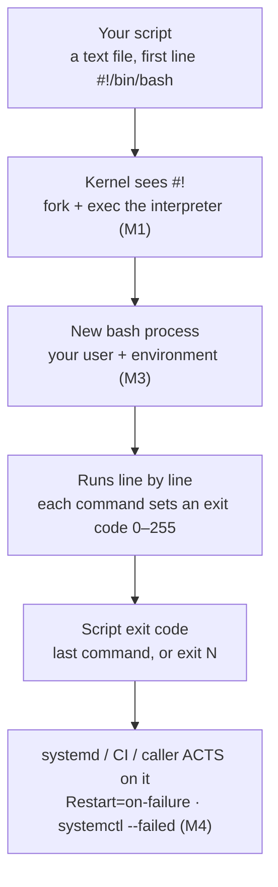
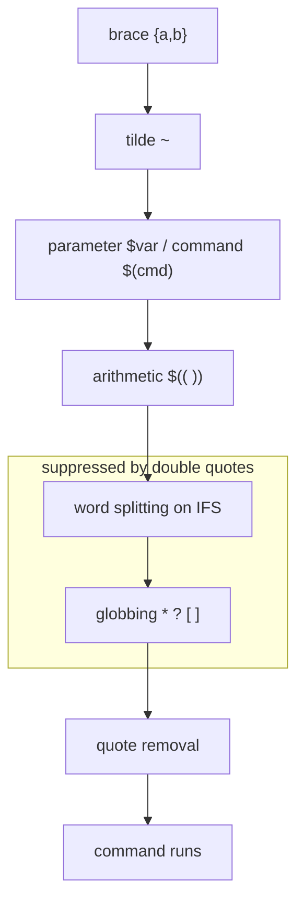

# Module 05 — Bash Scripting

<small>Stage 2 · Core Concepts · ~2 weeks at 4 h/day · Prerequisites — M2 (the commands are the vocabulary), M3 (execute bit, environment, signals), M4 (units/timers/journal — where scripts live). Closes Stage 2.</small>

## Why this matters

**Bash scripting** is programming the shell: turning the commands you already type into files that make
decisions (`if`), repeat work (`for`/`while`), package logic (functions), fail loudly (`set -euo
pipefail`, exit codes), and clean up after themselves (traps) — so machines run them **unattended**.

Module 04 built the trigger-and-supervision layer (units, timers, the journal); this module builds the
**payloads** those timers run. The gap between "works when I type it" and "safe when a timer runs it at
02:30" is exactly this module — and it is where your exit codes finally start to *mean* something:
M4's `Restart=on-failure` and `systemctl --failed` only work if your scripts fail honestly.

!!! info "What this unlocks"
    Every ops tool you meet from here is, or wraps, a shell script. **M8** Git hooks are bash and
    `git bisect run` wants honest exit codes · **M12** names the variables/loops/functions you meet
    here · **M13** Python takes over where Bash stops (the ~100-line boundary) · **M15** CI steps are
    YAML-wrapped shell with a lint gate · **M16** every Dockerfile `RUN` and `docker-entrypoint.sh` is
    graded M5 material · **M19** K8s liveness probes exec commands whose **exit codes** decide pod
    restarts — the exact contract, at cluster scale.

---

## Watch

*Watch once, then rely on the notes below — you should never need to rewatch.*

<div class="lo-video-placeholder" markdown="1">
<span class="lo-play">▶</span>
**Explainer video — coming**
<small>Record per <code>../media/README.md</code>, upload to YouTube, then replace this card with the embed.</small>
</div>

??? note "For the author — drop-in YouTube embed (replace VIDEO_ID)"
    Once the explainer is on YouTube, replace the placeholder card above with:
    ```html
    <div class="lo-video-embed">
      <iframe src="https://www.youtube-nocookie.com/embed/VIDEO_ID"
              title="Module 05 — Bash Scripting"
              allow="accelerometer; autoplay; clipboard-write; encrypted-media; gyroscope; picture-in-picture"
              allowfullscreen></iframe>
    </div>
    ```
    Video script beats (from the blueprint's Analogy / Visual Model / Misconceptions):
    the shipping-box analogy for quoting (no box → the two halves of `Summer Photos` go to different
    addresses) → the eight-line skeleton → the expansion pipeline and where quotes intervene →
    the seatbelt (`set -euo pipefail` — permissive defaults from 1977, roads from today) →
    exit codes as the API to systemd (back to M4) → the Steam-bug story as the closing argument.

**Terminal cast — pending; record per `../media/README.md`.**

!!! tip "Follow along, don't just watch"
    Open the [Guided Lab](#guided-lab-your-first-real-scripts) in a browser terminal and write each
    script yourself as it appears. Typing beats watching every time — and it is part of how the memory
    forms.

---

## Key Notes

*Standalone. This is the reference you keep.*

### The picture: how a script runs



A script is just a text file. The kernel reads the **shebang** (`#!/bin/bash`), then fork/execs that
interpreter with the file as its argument — a **new** bash process (M1's workflow, M3's inherited
environment). That is why a script can't `cd` your interactive shell: a child process cannot mutate its
parent. Each command sets `$?`; the script's own exit code is its last command's (or `exit N`), and
**that** is the signal systemd reads.

### The script skeleton — eight lines that carry the module

```bash
#!/bin/bash                                   # contract: which interpreter
set -euo pipefail                             # contract: fail loudly
readonly DEST="${1:?usage: $0 <dest>}"        # input, validated
cleanup() { rm -rf "$tmpdir"; }               # cleanup logic
trap cleanup EXIT                             # ...guaranteed to run
main() {                                      # logic lives in functions
  local f                                     # scoped state
  ...
}
main "$@"                                      # single entry, args passed intact
```

| Line | Job |
|---|---|
| `#!/bin/bash` | Shebang — tells the kernel which interpreter runs the file. A **contract**, not a comment. |
| `set -euo pipefail` | The failure contract — stop on error, unset var, or a broken pipe. |
| `readonly DEST="${1:?...}"` | Read and **validate** input; `${var:?msg}` dies with a message if unset. |
| `trap cleanup EXIT` | Register cleanup that runs on **every** exit path — success, failure, Ctrl-C. |
| `main() { local f; ... }` | Small functions with `local` state; one job each. |
| `main "$@"` | Single entry point; `"$@"` passes every argument intact. |

### Quoting — the #1 bug class

The single most important habit: **quote every expansion** — `"$var"`, `"$(cmd)"`, `"${arr[@]}"`.
Unquoted is a bug until proven otherwise. The three forms:

| Form | What expands | Word-split + glob? | Use for |
|---|---|---|---|
| `"$var"` | Parameter/command expansion happens | **No** — suppressed | Almost always — the safe default |
| `$var` (bare) | Expansion, **then** split on IFS, **then** glob | **Yes** — danger | Almost never |
| `'$var'` | Nothing — pure literal | n/a | When you mean the literal text |

Why it bites: bare `$f` where `f="two words.txt"` becomes *two* arguments; `f="a*b.txt"` gets globbed
against the directory. Real filenames contain spaces and glob characters — clean test data hides the
bug, hostile input detonates it.

### The expansion pipeline — why quoting works

Bash processes every line through a fixed order of stages. Double quotes suppress exactly the two that
cause the classic bugs:



Every classic bug — unquoted `$var` with spaces, `for f in $(ls)` — is an expansion-order story.
Command substitution output is word-split *then* globbed, which is why `for f in $(ls *.txt)` corrupts
real filenames. The correct loop globs directly: `for f in *.txt; do … "$f" …; done`.

### Exit codes are the API

Commands succeed (`0`) or fail (`1`–`255`) and *say so* — one way to succeed, many ways to fail, which
is why `0` is "true" in shell conditionals (a convention, not a boolean). `$?` holds the last code.

| Consumer | Reads the exit code via |
|---|---|
| `if` / `while` | Branches on `0` = true |
| `&&` / `\|\|` | Chains: run-if-success / run-if-failure |
| A function | Its last command's code, or `return N` |
| The script | Its last command's code, or `exit N` |
| **systemd (M4)** | `Restart=on-failure`, `systemctl --failed` |

Errors go to **stderr** (`echo "error" >&2`), data to **stdout** — or pipes and journals lie. One
stream is for humans reading logs; the other is for machines taking action.

### `set -euo pipefail` — the seatbelt

Bash's defaults are permissive because they are from 1977; your scripts are not. Three flags, one bug
each caught:

| Flag | Aborts / fails on | Bug it catches |
|---|---|---|
| `-e` | Any unchecked non-zero exit | The copy-then-continue-half-done march |
| `-u` | Expanding an **unset** variable | The Steam-bug typo (`$targt` for `$target`) |
| `-o pipefail` | Any failing member of a pipe | `grep x file \| sort` "succeeding" when grep found nothing |

Know `-e`'s edges: it does **not** fire when a status is being *tested* — inside `if`/`while`
conditions or on the left of `&&`/`||`. That is by design (conditionals must be able to test failing
commands). So serious scripts *also* put explicit `|| die "context"` on critical lines — belt and
suspenders, with a better message.

### The reliability kit

- **Traps make cleanup unconditional.** `trap 'rm -rf "$tmpdir"' EXIT` fires on success, on `exit 1`,
  on a `-e` abort, and on Ctrl-C — the difference between scripts that litter and scripts you trust.
  `trap 'echo "failed at line $LINENO" >&2' ERR` makes a script report its own crash site.
- **`mktemp` / `mktemp -d`**, never `/tmp/myscript.$$` — a predictable name lets an attacker pre-create
  a symlink your write follows (symlink attack).
- **Idempotence** — running twice equals running once. Timers retry and overlap; use `mkdir -p`, rsync
  (converges state), guard checks, and `flock` against concurrency.
- **`while IFS= read -r line`** is the canonical safe line-reader (`IFS=` stops trimming, `-r` stops
  backslash mangling). Add `|| [[ -n "$line" ]]` to catch a last line with no trailing newline.
- **ShellCheck** reviews every script, every time; the Google Shell Style Guide settles style.

### Know when NOT to Bash

Each `$(cmd)` forks a process (M1) — a loop calling `grep` 10,000 times loses to one `grep` reading
10,000 lines. Prefer builtins (`[[`, `(( ))`, parameter expansion `${path##*/}` for basename,
`${var%.txt}` to strip an extension) over external forks in hot loops. And the honest ceiling: **over
~100 lines or with real data structures, the answer is Python (M13).** Shell is glue, not girders.

<div class="lo-remember" markdown="1">
**Must remember (if you keep only seven things):**

1. **First two lines of every script:** `#!/bin/bash` then `set -euo pipefail`.
2. **Quote every expansion** — `"$var"`, `"$(cmd)"`, `"${arr[@]}"`. Bare `$var` splits on IFS then globs.
3. **Exit codes are the API** — `0` = success; stderr for errors, stdout for data; systemd reads the code (M4).
4. **`-e` / `-u` / `pipefail`** catch: unchecked failure · unset variable · a broken pipe. `-e` is exempt when a status is *tested*.
5. **`"$@"`** = each argument intact (many words); **`"$*"`** = one word joined by IFS. They differ.
6. **`trap … EXIT` + `mktemp`** = guaranteed cleanup, no litter, on every exit path.
7. **`bash -n` → `shellcheck` → `bash -x`** — static checks before dynamic; over ~100 lines, switch to Python.
</div>

---

## Guided Lab: your first real scripts

*Basic, step-by-step. You write and run small scripts in a `~/learning/scripts/` workbench. Nothing
here is destructive — the one variable-driven `rm` demo is deferred to the Solo Lab and stays in a
throwaway sandbox.*

<div class="lo-lab-actions" markdown="1">
[▶ Open interactive lab](https://killercoda.com/learning-os/course/killercoda/module-05){ .lo-btn target=_blank }
[⧉ Open in Codespaces](https://codespaces.new/randaguiac20/learning-os){ .lo-btn target=_blank }
[⌨ Run locally](#run-locally){ .lo-btn .lo-btn--ghost }
[View lab source](https://github.com/randaguiac20/learning-os/tree/main/killercoda/module-05){ .lo-btn .lo-btn--ghost target=_blank }
</div>

<span id="run-locally"></span>
!!! tip "Three ways to run this lab — pick any (all free)"
    - **Instant, no account** — click **Open interactive lab** (Killercoda): a Linux terminal in your browser.
    - **Your own cloud** — click **Open in Codespaces**: runs in your GitHub account's free tier (120 core-hrs/mo).
    - **Local, unlimited, $0** — any Linux / macOS / WSL terminal, or a throwaway container: `docker run -it ubuntu bash`, then follow the steps below.

    Killercoda is the zero-setup on-ramp; Codespaces and local use *your own* free resources, so they scale to any class size.

=== "1 · First script, three ways to run it"
    ```bash
    mkdir -p ~/learning/scripts && cd ~/learning/scripts
    printf '%s\n' '#!/bin/bash' 'echo "Hello from $(hostname) at $(date +%T)"' > hello.sh
    bash hello.sh          # the interpreter runs the file — no execute bit needed
    chmod +x hello.sh      # M3's execute bit
    ./hello.sh             # now the kernel reads the shebang itself
    ```
    Journal: which invocation needed `chmod +x` and which didn't, and why? Remove the shebang, run
    `./hello.sh` again — what runs it now? (The *calling* shell, by luck.)

=== "2 · Variables and the quoting gauntlet"
    ```bash
    mkdir -p /tmp/mine && cd /tmp/mine
    touch "two words.txt" "a*b.txt" normal.txt
    f="two words.txt"
    ls -l $f               # bare: splits into TWO arguments — fails
    ls -l "$f"             # quoted: one argument — works
    echo *   ;  echo "*"  ;  echo '*'   # glob vs literal star
    ```
    Name the expansion steps that make bare `$f` fail (parameter expansion → **word splitting** →
    globbing). This lab is the module's cornerstone — do not rush it.

=== "3 · Exit codes and conditionals"
    ```bash
    grep -q root /etc/passwd; echo $?      # 0 — found
    grep -q nobody-xyz /etc/passwd; echo $?  # 1 — not found
    printf '%s\n' '#!/bin/bash' 'set -euo pipefail' \
      'if grep -q "^$1:" /etc/passwd; then echo "exists"; else echo "missing" >&2; exit 1; fi' > check-user.sh
    chmod +x check-user.sh
    ./check-user.sh root && echo "found"    # exit 0 → the && runs
    ./check-user.sh nobodyxyz || echo "absent (exit $?)"
    ```
    The exit code is what lets `&&`, `||`, and later systemd *act* on the result.

=== "4 · Loops and safe reading"
    ```bash
    cd /tmp/mine
    for f in *.txt; do echo "found: $f"; done        # glob loop — safe with spaces
    while IFS= read -r line; do
      echo "user: ${line%%:*}"                       # strip everything after first :
    done < /etc/passwd
    i=0; while (( i < 5 )); do echo "i=$i"; i=$(( i + 1 )); done
    ```
    `for f in *.txt` beats `for f in $(ls)`; `while IFS= read -r` is the canonical safe line-reader.
    Try `${line%%:*}` (a builtin) instead of piping to `cut` — no fork.

=== "5 · Functions and positional args"
    ```bash
    cat > argshow.sh <<'EOF'
    #!/bin/bash
    set -euo pipefail
    usage() { echo "usage: $0 arg..." >&2; exit 2; }
    show() { local a; echo "count=$#"; for a in "$@"; do echo "[$a]"; done; }
    main() { [[ $# -gt 0 ]] || usage; show "$@"; }
    main "$@"
    EOF
    chmod +x argshow.sh
    ./argshow.sh a "b c" d          # predict the output BEFORE running
    ```
    Predict, then run. Note `usage()` writes to **stderr** and exits `2`; `local` scopes `a`;
    `"$@"` keeps `b c` as one argument. Swap `"$@"` for `$@` and `"$*"` and watch the three-way difference.

=== "6 · Lint it, then trace it"
    ```bash
    command -v shellcheck >/dev/null || sudo apt-get install -y shellcheck
    shellcheck ~/learning/scripts/*.sh    # read every wiki link it prints — they are micro-lessons
    bash -n argshow.sh                     # parse only, no run
    bash -x argshow.sh a "b c"             # trace every expanded command
    ```
    Order matters: `bash -n` (parse) → `shellcheck` (static, even un-run branches) → `bash -x`
    (dynamic, the path actually taken). Fix every finding or justify a `# shellcheck disable=SCxxxx`.

!!! success "You can stop here and have learned something real"
    If you can write a script with a shebang and `set -euo pipefail`, quote your expansions, branch on
    an exit code, loop safely, factor into functions, and run shellcheck — the guided lab is done. Now
    make it harder.

---

## Solo Lab: figure it out

*Harder. Goals only — minimal hand-holding. Work in `~/learning/scripts/`; the destructive demo stays
in a throwaway sandbox and never runs as root. Struggle here is the point; reveal a hint only after
you've tried.*

### Challenge 1 — Count files per extension
Write `count-ext.sh <dir>`: to full standard (skeleton, quoting, stderr, honest exit), print each file
extension in `<dir>` with its count, largest first; error to stderr and exit non-zero if `<dir>` is
missing. shellcheck-clean on the first try.

??? tip "Hint"
    Validate `$1` with `[[ -d "$1" ]]`. Strip to the extension with `${f##*.}`. Count with `sort |
    uniq -c | sort -rn`.

??? success "Solution"
    ```bash
    #!/bin/bash
    set -euo pipefail
    main() {
      local dir="${1:?usage: $0 <dir>}" f
      [[ -d "$dir" ]] || { echo "not a directory: $dir" >&2; exit 1; }
      for f in "$dir"/*; do [[ -f "$f" ]] && echo "${f##*.}"; done \
        | sort | uniq -c | sort -rn
    }
    main "$@"
    ```
    `${f##*.}` is a builtin (no fork); the failure path (missing dir) writes stderr and exits `1`
    without being prompted for it.

### Challenge 2 — `"$@"` vs `"$*"`, seen once
Construct a single call that makes `"$@"` and `"$*"` visibly differ, and explain the word boundaries.

??? success "Solution"
    ```bash
    set -- a "b c"
    printf '[%s]\n' "$@"      # -> [a] then [b c]   (two words, each intact)
    printf '[%s]\n' "$*"      # -> [a b c]          (ONE word, joined by first IFS char)
    ```
    `"$@"` produces one word per parameter (each preserved); `"$*"` joins them all into one word with
    the first character of `IFS` (a space). This is why `main "$@"` — never `$*` — passes args intact.

### Challenge 3 — Guaranteed cleanup with a trap
Write a script that makes a temp dir with `mktemp -d` and proves the cleanup fires on normal exit, on
`exit 1`, and on Ctrl-C — leaving `/tmp` with no litter.

??? tip "Hint"
    Register the trap on `EXIT` (not just normal return), and echo the temp dir so you can check
    `/tmp` before and after.

??? success "Solution"
    ```bash
    #!/bin/bash
    set -euo pipefail
    tmpdir="$(mktemp -d)"
    trap 'rm -rf "$tmpdir"' EXIT
    echo "working in $tmpdir"
    sleep 30            # press Ctrl-C here, or let it finish, or add: exit 1
    ```
    `trap … EXIT` runs the handler on success, on a `-e` abort, on `exit N`, **and** on the `INT` from
    Ctrl-C — every exit path. Check `ls -d /tmp/tmp.*` before and after: no leftovers.

### Challenge 4 — Argument parsing like a real tool
Write `backup-lite.sh` with `getopts "d:ng:h"`: `-d dest` (required — validate), `-n` dry-run, `-g N`
generations (default 3), `-h` usage. Unknown flag or missing `-d` → usage to stderr, exit 2.

??? success "Solution"
    ```bash
    #!/bin/bash
    set -euo pipefail
    usage() { echo "usage: $0 -d dest [-n] [-g N] [-h]" >&2; exit 2; }
    main() {
      local dest="" dry="" gens=3 opt
      while getopts "d:ng:h" opt; do
        case "$opt" in
          d) dest="$OPTARG" ;;
          n) dry="--dry-run" ;;
          g) gens="$OPTARG" ;;
          h) usage ;;
          *) usage ;;
        esac
      done
      [[ -n "$dest" ]] || usage
      echo "would rsync ${dry:-(real)} keep=$gens -> ${dest:?}"
    }
    main "$@"
    ```
    The `:` after `d` and `g` means "takes a value" (lands in `$OPTARG`); a missing `-d` or unknown flag
    falls to `usage` → stderr, exit `2`. Dry-run is the *safe* default direction.

### Challenge 5 (stretch) — The Steam-bug shape, safely
In a **throwaway** directory (never as root), reproduce the class of bug where a misspelled variable
turns `rm -rf "$target/"*` into a disaster, then show two independent guards that stop it.

??? warning "Only in a sandbox, never as root"
    Do this in a fresh scratch dir (e.g. `/tmp/steam-demo`) with harmless files. Never run the unguarded
    form anywhere real, and never with `sudo`.

??? success "Solution"
    ```bash
    mkdir -p /tmp/steam-demo/keep && cd /tmp/steam-demo && touch a b c
    target="/tmp/steam-demo"
    # BUG: a typo makes $targt empty -> rm -rf "/"* aims at the root. DO NOT run unguarded.
    # Guard 1 — set -u makes the unset variable fatal:
    ( set -u; rm -rf "$targt/"* ) 2>&1 | head -1     # -> unbound variable, aborts
    # Guard 2 — ${var:?} dies with a message even without -u:
    ( rm -rf "${targt:?missing target}/"* ) 2>&1 | head -1
    ```
    Both guards stop the empty-variable expansion before `rm` ever runs. In real life: `set -u` at the
    top, `${dir:?}` on the destructive line, **and** validate `[[ -d "$dir" ]]` and ownership first.
    One `set -u` would have prevented the 2015 Steam bug that deleted users' home directories.

---

## Self-Check

*Close the notes. Answer aloud or in writing **first**, then reveal. Recalling — even when it's hard —
is what builds the memory.*

??? question "What exactly does the shebang do, and what happens without one?"
    The kernel's exec sees `#!` and launches the named interpreter with the script path as its argument
    (fork+exec, M1). **Without it**, the *calling* shell may run the file as its own dialect — it works
    by luck, and behavior depends on the caller. The shebang is a **contract**, not decoration.

??? question "`\"$var\"` vs `$var` vs `'$var'` — which expansions apply, and when does the difference bite?"
    `'$var'` — nothing expands, pure literal. `"$var"` — parameter expansion happens; **word splitting
    and globbing do not**. Bare `$var` — expansion, **then** split on IFS, **then** glob. It bites when
    the value holds spaces, tabs, newlines, or glob characters — i.e. real filenames.

??? question "Why is `0` \"true\" in shell conditionals when every other language says otherwise?"
    A command has **one** way to succeed (`0`) and **many** failure kinds (`1`–`255`). Testing "did it
    work" is the common case, so success = true. It is an exit-code convention, not a boolean.

??? question "What do `-e`, `-u`, and `-o pipefail` each change — one bug each?"
    `-e`: an unchecked non-zero exit aborts (catches copy-then-continue-half-done). `-u`: expanding an
    unset variable is fatal (catches the Steam-bug typo). `pipefail`: a pipe fails if **any** member
    fails (catches `grep bad file | sort` "succeeding" when grep found nothing).

??? question "`for f in $(ls *.txt)` works in your test dir but corrupts real filenames. Why, and the fix?"
    Command-substitution output is **word-split** (names with spaces shatter) then **globbed** (`a*b.txt`
    re-expands). Parsing `ls` is unreliable anyway. Fix: `for f in *.txt; do … "$f" …; done` — glob
    directly, quote inside.

??? question "With `set -e` on, `if failing_cmd; then …` does NOT abort. Why is that correct?"
    `-e` must not fire on a command whose status is being **tested** — that's the whole point of `if`.
    Aborting there would make conditionals impossible. The rule: an exit status that is *examined*
    doesn't trigger `-e`. Hence explicit `|| die "msg"` on critical, untested commands.

??? question "A `while read` loop processes every line except the last. Why, and the canonical fix?"
    `read` returns non-zero at EOF even when it filled `$line` (a final line with no trailing newline),
    so the body is skipped for that fragment. Fix: `while IFS= read -r line || [[ -n \"$line\" ]]`.

??? question "Why `mktemp` instead of `/tmp/myscript.$$`?"
    `$$` is predictable — an attacker pre-creates `/tmp/myscript.<pid>` as a symlink to a victim file and
    your write follows it (a **symlink attack**). `mktemp` creates the file atomically with an
    unpredictable name and safe mode.

!!! example "Teach it back (the real test)"
    Out loud, in **4 minutes, no notes**: *"What makes a shell script trustworthy enough to run
    unattended at 02:30?"* — you must land the **contract** (shebang + set flags), **quoting**
    discipline, **honest exit codes** with a named consumer (systemd), guaranteed **cleanup** (traps),
    and the **lint** gate; the seatbelt framing must appear. Then, in **90 seconds**, teach *"why did
    the computer delete the wrong photos when the folder was called `Summer Photos`?"* to a beginner —
    shipping-box analogy required (no box, the two halves go to different addresses), jargon last. If
    you can't yet, reread the Key Notes, don't move on.

---

## Mastery checklist

*Tick these honestly, cold (no notes). They **gate** progress — passing M5 also closes **Stage 2**. A
module is only "done" when every box is true.*

- [ ] **Explain** the expansion pipeline and quoting flawlessly, and name `-e`'s edge cases.
- [ ] **Draw** all four blanks from memory: the 8-line skeleton, the expansion pipeline (with the quote-suppression bracket), the exit-code flow, and the getopts loop.
- [ ] **Build** a Level-2 cold script (e.g. count files per extension) in ≤20 min, shellcheck-clean on the first run.
- [ ] **Develop** to standard: functions with `local`, errors to stderr, honest exit codes, `main "$@"` throughout.
- [ ] **Configure** a config precedence (defaults < config block < environment) in a tool and explain it.
- [ ] **Secure:** `mktemp` + `umask`, an `EUID` refuse-to-run-as-root check, and validated destructive paths; recite the Steam-bug guards with their mechanism.
- [ ] **Automate** an idempotent, `flock`-guarded, timer-run tool and prove it (rsync stats / a no-op second run).
- [ ] **Troubleshoot** a works-interactively-fails-under-timer script cold, with a stated method (PATH / cwd / no-TTY gap → absolute paths, `Environment=`).
- [ ] **Debug** with `bash -n` → `shellcheck` → `bash -x` in the right order; fix the last-line `read` bug.
- [ ] **Optimize:** measure fork cost with `time`, rewrite one loop with builtins, show the numbers.
- [ ] **Integrate:** wire the exit-code contract end-to-end — script → unit → `systemctl --failed` — live (M4).
- [ ] **Decide:** argue the ~100-line bash-vs-Python boundary per scenario without dogma, and justify a portability shebang choice.
- [ ] **Self-serve:** learn ≥3 things from `man bash` / `help <builtin>` alone, and score ≥80% on the validation bank.
- [ ] **Teach:** pass the teach-back above (the trustworthy-at-02:30 explanation is mandatory).

---

## Review — lock it in

Spaced repetition is not optional; it's where the memory actually forms. Interleaving stays active —
every M5 review also pulls in one **Module 04** item (its units host these scripts). Schedule these and
*keep* them:

| When | Do | Interleaved M4 item |
|---|---|---|
| **Day 1** | Flashcards · type the 8-line skeleton from memory, shellcheck-clean · validation A-category | M4 flashcards you missed |
| **Day 3** | Write the getopts `backup-lite` shape from memory · the `-e`-edge and last-line-read questions | Write `health.timer` cold |
| **Day 7** | Quoting-gauntlet redo in a fresh minefield dir · the security questions (`mktemp`, `rm -rf` guards) | Permissions triage (M3 carryover) |
| **Day 14** | Re-read your Caretaker v2 code: find one bug or improvement, fix it, shellcheck | Journal-triage sprint |
| **Day 30** | Cold-write a new small tool (20-min spec) to the full standard | Redraw the M4 unit-anatomy blank |

**Connects forward to:** Vim (M6 — the editor these files deserve) · Git (M8 — hooks are bash;
`git bisect run` wants honest exit codes) · Programming Fundamentals (M12 — the variables/loops/
functions, named) · Python (M13 — takes over past the ~100-line boundary) · CI/automation (M15 —
lint-gated shell steps) · Docker (M16 — every `RUN` and entrypoint is graded M5) · Kubernetes
(M19 — probe exit codes decide pod restarts).

!!! quote "The one-sentence takeaway"
    M5 turns the resident operator into a builder: from here on, everything you know how to **do**, you
    know how to **encode** — and every later module's tooling assumes exactly that.
