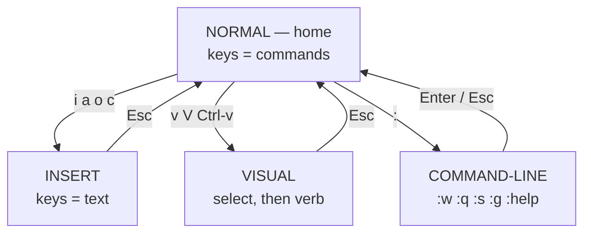

# Module 06 — Vim

<small>Stage 3 · Intermediate Skills · ~1 week at 4 h/day · Prerequisites — M2 (terminal fluency; `less`/`man` already trained your vi-keys `j k / n G q`), M5 (the Caretaker codebase — your practice gym). Opens Stage 3.</small>

## Why this matters

**Vim** ("Vi IMproved") is a **modal** text editor: instead of one mode where every key inserts a
character, it has modes where keys are **commands** — and those commands form a **grammar** (verb +
count + motion/object, e.g. `d2w` = *delete two words*) that turns editing intentions into a few
repeatable, automatable keystrokes.

You will spend the rest of this curriculum — and your career — editing text: scripts (M5), configs
(M4), manifests (M19), code (M12+). Editing is 90% navigating and changing existing text and only 10%
typing new text, yet ordinary editors optimize the 10% and tax the 90% (hands leave home row, mouse
round-trips, arrow-mashing). Modal editing gives the 90% its own keyboard. And on the minimal servers
and containers you will meet, GUI editors simply aren't there — `vi` always is.

!!! info "What this unlocks"
    **M7** Tmux copy-mode speaks these exact vi-keys — M6 pays off in days · **M8** Git opens Vim for
    commit messages, rebase-todo lists, and `vimdiff` conflict resolution · **M9** SSH is the payoff:
    full editing power on any remote machine, where GUI editors can't follow · **M10** your vimrc
    becomes a chezmoi-managed dotfile · **M16** containers ship at most BusyBox `vi` · **M19**
    `kubectl edit` drops you into `$EDITOR` mid-incident. Learn the grammar once; it outlives every
    program that hosts it.

---

## Watch

*Watch once, then rely on the notes below — you should never need to rewatch.*

<div class="lo-video-placeholder" markdown="1">
<span class="lo-play">▶</span>
**Explainer video — coming**
<small>Record per <code>../media/README.md</code>, upload to YouTube, then replace this card with the embed.</small>
</div>

??? note "For the author — drop-in YouTube embed (replace VIDEO_ID)"
    Once the explainer is on YouTube, replace the placeholder card above with:
    ```html
    <div class="lo-video-embed">
      <iframe src="https://www.youtube-nocookie.com/embed/VIDEO_ID"
              title="Module 06 — Vim"
              allow="accelerometer; autoplay; clipboard-write; encrypted-media; gyroscope; picture-in-picture"
              allowfullscreen></iframe>
    </div>
    ```
    Video script beats (from the blueprint's Definition / Architecture / Misconceptions):
    the two-keyboards idea (one for driving, one for writing) → the mode map, `Esc` as *going home* →
    the grammar as multiplication (10 verbs × 20 motions, learned as 10 + 20) → text objects making
    edits position-independent, hence repeatable with `.` → the honest cost (the week-one cliff), then
    the compounding payoff.

**Terminal cast — pending; record per `../media/README.md`.**

!!! tip "Follow along, don't just watch"
    Open the [Guided Lab](#guided-lab-survival-and-the-grammar) in a browser terminal and run each step
    yourself as it appears. With Vim especially, typing beats watching every time — the skill is
    physical, and it is part of how the memory forms.

---

## Key Notes

*Standalone. This is the reference you keep.*

### The picture: the mode map

Normal mode is **home**: keys are commands. Every other mode is a quick trip you return from with `Esc`
— reflexively.



The famous beginner pain ("I can't type!") *is* the design: typing is the special case; commanding is
the default. The famous escape ("how do I quit Vim?") dissolves the moment you know which mode you're
in — `Esc` gets you to Normal, then `:q!` leaves without saving, `:wq` or `ZZ` saves and leaves.

### The four modes

| Mode | Keys mean | Enter with | Leave with |
|---|---|---|---|
| **Normal** (home) | commands | *(where you start / `Esc`)* | — |
| **Insert** | literal text | `i` `a` `o` `O` `c` | `Esc` |
| **Visual** | select a region, then a verb | `v` (char) `V` (line) `Ctrl-v` (block) | `Esc` |
| **Command-line** | `:` ex commands over ranges | `:` | `Enter` runs · `Esc` cancels |

### The grammar — `[count] verb motion/object`

Read an edit as a **sentence**. Verbs and motions/objects are independent vocabularies Vim composes at
runtime — so **10 verbs × 20 motions = 200 commands you never memorized**, and one new motion instantly
upgrades *every* verb.

| Type | The word | Read as |
|---|---|---|
| `2` | count | *twice* |
| `d` | verb (operator) | *delete* |
| `w` | motion | *to next word* |
| → `d2w` | | **delete two words** |
| `c` + `i"` | verb + text object | **change inside quotes** (`ci"`) |
| `y` + `ap` | verb + text object | **yank a paragraph** (`yap`) |
| `gU` + `iw` | verb + text object | **UPPERCASE a word** (`gUiw`) |

Doubled verb = **whole line**: `dd` delete line · `yy` yank line · `cc` change line · `>>` indent line.

### Verbs, motions, objects — the vocabularies

| Kind | Examples | What they do |
|---|---|---|
| **Verbs** (operators) | `d` delete · `c` change · `y` yank · `>`/`<` indent · `gu`/`gU` case · `.` repeat last change | act on whatever motion/object follows |
| **Motions** (from the cursor) | `w b e` words · `0 ^ $` line ends · `f{c}` / `t{c}` char-find · `/{pat}` search · `{ }` paragraphs · `gg G 42G` file/line | move a distance the verb consumes |
| **Text objects** (around the cursor) | `iw`/`aw` word · `i"`/`a"` quotes · `i(`/`a(` parens · `ip`/`ap` paragraph · `it`/`at` tags | select a structural region — *inner* vs *around* |

**Motions vs objects** is the load-bearing distinction: a motion runs **from** the cursor to a target
(`dw` mid-word leaves the front half); a text object selects the region **around** the cursor
(`diw` deletes the whole word from anywhere inside it). Because objects are position-independent, the
same keystrokes work at the next site — which is exactly what `.` replays.

### Registers — Vim's many clipboards

`:reg` shows them all. The classic frustration ("my yank vanished after a delete") is solved by knowing
`"0`.

| Register | Holds | Written by | Rescue / use |
|---|---|---|---|
| `""` unnamed | last delete **or** yank | `d` `x` `y` | `p` puts it |
| `"0` yank | last **yank only** (deletes never touch it) | `y` | `"0p` — rescues a yank after a delete |
| `"a`–`"z` named | whatever you aim at them | `"ay{motion}`, `qa`…`q` records into `"a` | `"ap`, `@a` replays |
| `"+` system | the OS clipboard | `"+y` (needs `+clipboard`) | `"+p` pastes from other apps |
| `"%` · `".` | filename · last inserted text | Vim | reference |

### The dot formula, macros, and Ex heritage

- **The dot command `.`** repeats the last change. Ideal Vim: one keystroke to move (`n`, `;`, `j`),
  one to act (`.`). Structure edits so `.` can repeat them — `ciwNAME<Esc>` then `n.n.n.` beats
  retyping. `;`/`,` repeat the last `f`/`t` find the same way.
- **Macros** generalize `.`: `qa` records keystrokes into register `a`, `q` stops, `@a` replays, `10@a`
  bulk-applies, `@@` repeats the last. Macros are **supervised** automation — a failing motion aborts
  the replay, so brittle macros are *fine* (you're watching), unlike scripts (M5), which run unwatched.
- **Ex commands** (`:`) operate on **ranges** — the line-editor DNA that makes file-wide edits
  one-liners: `:%s/old/new/gc` (whole file, confirm each), `:5,12s/…`, `:g/^#/d` (delete comment
  lines), `:g/TODO/p`. `:g` (global) is literally `grep`'s ancestor — read the name: **g/re/p**.

### Config is code, and edits leak to disk

Your lasting artifact is `~/.vimrc`: ~25–40 lines built **line by line as friction appears**, *every
line commented with the pain it solves* — never a 300-line block pasted from the internet (you can only
maintain what you understand). Sensible starters: `set number relativenumber`, the search quartet
(`incsearch hlsearch ignorecase smartcase`), `set hidden`, persistent undo (`undofile` + `undodir`),
a whitespace policy (`expandtab shiftwidth=2`), `syntax on`.

Editing privileged files is a **security** act: use `sudoedit` (edits a copy *as you*, writes back with
sudo) — never `sudo vim` (runs your *entire* editor, vimrc, and `:!` shell access **as root**). Know
that three artifacts can leak file contents onto disk — **swap** (`.swp`), **undo** (`undodir`), and
**viminfo** (registers + search history) — and set `nomodeline` on servers (modelines were a
config-in-file attack vector).

<div class="lo-remember" markdown="1">
**Must remember (if you keep only six things):**

1. **Normal mode is home; `Esc` returns you there.** Typing (Insert) is the errand, not the default.
2. **Think in sentences:** `[count] verb motion/object`. One new motion upgrades every verb — grammar multiplies.
3. **Text objects beat motions for repeatability:** `ciw` works from anywhere in the word, so `.` can replay it.
4. **`"0` rescues a yank a delete clobbered** (`"0p`); deletes and yanks both fill the unnamed register.
5. **Make it repeatable (`.`, `n.`), then cheap (macros); scale file-wide with Ex** (`:%s//gc`, `:g/pat/d`).
6. **Earn your vimrc line by line, commented;** edit privileged files with `sudoedit`, never `sudo vim`.
</div>

---

## Guided Lab: survival and the grammar

*Basic, step-by-step. You edit **real files** in a throwaway `~/vim-gym/` sandbox you build first —
nothing outside it is touched. Rule for the week: when you don't know a command, `:help` it before you
Google it.*

<div class="lo-lab-actions" markdown="1">
[▶ Open interactive lab{ .lo-btn }](https://killercoda.com/learning-os/course/killercoda/module-06){ target=_blank }
[⧉ Open in Codespaces{ .lo-btn }](https://codespaces.new/randaguiac20/learning-os){ target=_blank }
[⌨ Run locally{ .lo-btn .lo-btn--ghost }](#run-locally)
[View lab source{ .lo-btn .lo-btn--ghost }](https://github.com/randaguiac20/learning-os/tree/main/killercoda/module-06){ target=_blank }
</div>

<span id="run-locally"></span>
!!! tip "Three ways to run this lab — pick any (all free)"
    - **Instant, no account** — click **Open interactive lab** (Killercoda): a Linux terminal in your browser.
    - **Your own cloud** — click **Open in Codespaces**: runs in your GitHub account's free tier (120 core-hrs/mo).
    - **Local, unlimited, $0** — any Linux / macOS / WSL terminal, or a throwaway container: `docker run -it ubuntu bash` (then `apt-get update && apt-get install -y vim`), and follow the steps below.

    Killercoda is the zero-setup on-ramp; Codespaces and local use *your own* free resources, so they scale to any class size.

=== "1 · Check your Vim, then vimtutor"
    ```bash
    vim --version | head -3        # vim or vim-tiny? apt-get install -y vim if tiny
    vim --version | grep clipboard # +clipboard (usable "+) or -clipboard?
    mkdir -p ~/vim-gym && cd ~/vim-gym
    vimtutor                       # do lessons 1–7, no skipping; q-to-quit lives inside
    ```
    `vimtutor` is a real Vim editing a throwaway copy of its own lesson file — the safest place to
    make every beginner mistake. Journal (in Vim from now on): which three commands felt most alien?

=== "2 · Feel the mode map"
    ```bash
    printf 'one\ntwo\nthree\n' > modes.txt
    vim modes.txt
    ```
    Inside, deliberately enter and leave every mode, noting **where** each insert lands:
    `i` (before cursor) · `a` (after) · `o` (new line below) · `O` (above) → `Esc` home;
    `v` `V` `Ctrl-v` (visuals) → `Esc`; `:` (command-line) → `Esc`. Do 20 round-trips until `Esc` is
    automatic. Meet the traps calmly, on purpose: press `q` then a key (you're *recording* — `q` stops
    it); `Ctrl-s` (terminal *frozen* — `Ctrl-q` thaws it; that's flow control from M2). Quit with `:q!`.

=== "3 · Verbs × motions (the multiplication)"
    ```bash
    printf 'the quick brown fox jumps\nover the lazy dog today\n' > grammar.txt
    vim grammar.txt
    ```
    With `w b e 0 ^ $` as your motions, apply each with **no verb** (just move), then with `d`, `c`,
    `y`. Feel it: you're learning 6 motions + 3 verbs, not 18 commands. Counts: `d2w`, `c3w`. Whole
    line: `dd` `yy` `>>`. Ban the arrow keys today. `:q!` when done exploring.

=== "4 · Text objects — the killer feature"
    ```bash
    printf 'greeting="hello"\nname="stranger"\nrun(one, two, three)\n' > objects.sh
    vim objects.sh
    ```
    Put the cursor **anywhere** inside the quotes → `ci"` retypes the value; inside the parens → `da(`
    deletes the whole argument list; on a word → `ciw` vs `caw` (inner keeps the surrounding space,
    around eats it). This is the single highest-value 15 minutes of the week. `:wq` to save.

=== "5 · The dot formula"
    ```bash
    printf 'total = old + 1\necho old\nreturn old\n' > dot.txt
    vim dot.txt
    ```
    Rename `old` everywhere with judgment: `/old<Enter>` to the first hit, `ciwnew<Esc>`, then
    `n.` `n.` — search-next, dot-repeat, *deciding at each `n`*. Compare with the bulk tool
    `:%s/\<old\>/new/gc` (`\<…\>` = word boundaries, `c` = confirm each). Two idioms, same job: dot for
    judgment calls, `:s` for mechanical sweeps.

=== "6 · Save, quit, and never be trapped"
    ```bash
    vim dot.txt
    ```
    From Normal mode: `:w` writes · `:wq` or `ZZ` writes and quits · `:q` quits (refuses if unsaved) ·
    `:q!` quits **discarding** changes · `:x` writes only if changed. If you're ever stuck, `Esc`
    first — get to Normal — *then* choose. That is the whole "how do I exit Vim?" mystery, solved.

!!! success "You can stop here and have learned something real"
    If you can move by grammar (not arrows), change inside quotes and parens from anywhere, rename with
    `n.`, and leave Vim on purpose — the guided lab is done. Now make it harder.

---

## Solo Lab: figure it out

*Harder. Goals only — minimal hand-holding. Work on copies in `~/vim-gym/`. Struggle here is the point;
reveal a hint only after you've tried. `:help` before Google.*

### Challenge 1 — Rescue a clobbered yank
Yank one line (`yy`), then delete a *different* unwanted line (`dd`), then `p`. The wrong text appears.
Put the line you originally yanked, without re-yanking it.

??? tip "Hint"
    Deletes and yanks both overwrite the *unnamed* register — but yanks also write a second register
    that deletes never touch.

??? success "Solution"
    ```text
    "0p
    ```
    `dd` overwrote the unnamed register `""`, so a plain `p` puts the deleted line. The last **yank**
    still lives in `"0` (deletes don't touch it), so `"0p` puts it back. Confirm with `:reg` — read
    `""` and `"0` side by side.

### Challenge 2 — One macro, twelve times
Turn a block of `key=value` lines into aligned `key = value` (spaces around the `=`) using **one**
recorded macro replayed with a count — not twelve manual edits.

??? tip "Hint"
    Record on the first line (`qa`), do the edit with a motion that lands you on the **next** line's
    start, stop (`q`), then replay with a count (`@a`). `f=` finds the `=`; `s` substitutes a char.

??? success "Solution"
    ```text
    qa 0 f= s␣=␣<Esc> j q       (record: find =, replace with " = ", down to next line)
    11@a                         (replay on the remaining 11 lines)
    ```
    Start position and ending on the next line's first column are what make the macro re-runnable.
    A line without an `=` makes the macro *stop* — which is fine: you're watching, so you fix that one
    by hand. That's the supervised-automation contrast with M5's unwatched scripts.

### Challenge 3 — Extract error lines with Ex only
From a copy of a log, produce a file containing **only** the lines matching `error` — using ex
commands, no manual selection. Find *two* different one-liners.

??? tip "Hint"
    One approach keeps matches and writes them out; the other *deletes the non-matches* and saves.
    `:v/pat/d` is "delete lines that do **not** match".

??? success "Solution"
    ```text
    :g/error/normal :w! >> errors.txt<CR>     (append each matching line to a file)
    ```
    or, working on the copy in place:
    ```text
    :v/error/d      then      :w errors.txt   (delete every non-error line, then save)
    ```
    `:g` runs a command on every **matching** line; `:v` (aka `:g!`) on every **non-matching** one.
    This is the `ed`→`ex`→`vi`→`vim` lineage you're now *using*, not just reading about.

### Challenge 4 — Surgery with objects only
Given a function whose `if` block is wrongly indented, fix the indentation using only text objects and
`>`/`<` — **no Insert mode**. Then delete the function's entire argument list from anywhere inside it.

??? success "Solution"
    ```text
    >ip        (indent the inner paragraph — the block)   or   >i{ inside braces
    da(        (delete a-parens: the whole (arg, list), cursor anywhere within)
    ```
    Objects make the edit position-independent: `>ip` re-indents the whole block regardless of where
    the cursor sits in it, and `da(` removes the parens *and* their contents from any point inside.
    No visual-select, so both stay `.`-repeatable.

### Challenge 5 (stretch) — Your first earned vimrc line
Add exactly one line to `~/.vimrc` that solves a real friction you hit this week — a mapping for your
most-repeated action — and be able to explain it cold.

??? success "Solution"
    ```vim
    " <leader>s: save, then lint the current file without leaving Vim (M5 gate, now in-editor)
    nnoremap <leader>s :w<CR>:!shellcheck %<CR>
    ```
    `nnoremap` = a non-recursive **N**ormal-mode map; `<leader>` is your namespace prefix; `%` expands
    to the current file; `<CR>` is Enter. Reload with `:source %`. The rule that outranks the mapping:
    **every vimrc line is commented with the pain it solves** — you must own it, not borrow it.

---

## Self-Check

*Close the notes. Answer aloud or in writing **first**, then reveal. Recalling — even when it's hard —
is what builds the memory.*

??? question "Why is Vim modal — what editing reality does the design bet on?"
    Editing is ~90% navigating and changing existing text, ~10% typing new text. Modal design gives the
    *majority* activity — commanding — the whole keyboard, and makes typing (Insert) the special case.
    Normal mode optimizes precision movement and surgical change.

??? question "State the grammar formula. Why is learning one new motion worth more than one new command?"
    `[count] verb motion/object`. Verbs and motions are independent sets composed at use-time, so
    *V* verbs × *M* motions = *V×M* capabilities from *V+M* learned items. A new motion instantly works
    with **every** verb you already know — multiplicative, not additive.

??? question "`ci\"` works from anywhere inside the quotes; a motion like `c/\"` doesn't. Why, and why does it matter for `.`?"
    Motions run **from** the cursor to a target; text objects select a region **around** the cursor
    defined by structure. Objects are position-independent, so the identical keystrokes apply at the
    next site — which is exactly what `.` replays. Objects are what make edits repeatable.

??? question "You `yy` a line, then `dd` another, then `p` — the wrong text appears. Explain and fix."
    `dd` overwrote the **unnamed** register (deletes and yanks both write it), so `p` puts the deleted
    line. Your yank still lives in `"0` (deletes never touch it). Fix: **`"0p`**.

??? question "Whole-line verbs, and the exit keys for each mode?"
    Double the verb for the whole line: `dd` `yy` `cc` `>>`. To leave any non-Normal mode: **`Esc`**
    (Insert/Visual), `Enter` or `Esc` (Command-line). Everything returns to Normal — home.

??? question "`sudoedit` vs `sudo vim` — what runs as root in each, and why does it matter?"
    `sudoedit` copies the file to a temp path, runs your editor **as you** (your vimrc, no privileges),
    then writes back via sudo with validation. `sudo vim` runs the entire editor + vimrc + `:!` shell
    access **as root** — a huge privileged surface. Prefer `sudoedit`.

??? question "You're on a minimal container with `vi` only, no config. What still works, what doesn't, and why the split?"
    Still work: modes, the grammar core (`d w c $ /`), `:s`, marks — the **POSIX vi** subset. Gone:
    most text objects, multi-level undo, visual block, `"0` semantics, your vimrc/mappings, persistent
    undo. The split is the standard itself: POSIX froze `vi` ~1992; Vim's additions are the "IM".

!!! example "Teach it back (the real test)"
    Out loud, in **4 minutes, no notes**: *"Why does Vim refuse to just let you type?"* — the 90/10
    reality, modes as two keyboards, the grammar with the multiplication argument, and repeatability
    (`.`) as the payoff; the honest week-one cliff **must** appear. Then, in **90 seconds** for a
    non-technical listener: *"Why learn a 1991 editor?"* — the piano analogy (one hard week, a lifetime
    of playing) plus "it's on every server like stairs in every building — elevators are nicer until
    the power's out." If you can't yet, reread the Key Notes — don't move on.

---

## Mastery checklist

*Tick these honestly, cold (no notes). They **gate** progress to M7 (Tmux). A module is only "done"
when every box is true — except the stage-gate race, which may legitimately land at the D14 retest.*

- [ ] **Explain** modal design + the grammar + the dot formula flawlessly, with `i` vs `a` objects precise.
- [ ] **Draw** all four blanks from memory: the mode map, the grammar table, the register map, and your own vimrc.
- [ ] **Navigate** to any target in a ~100-line file in ≤3 keystrokes, arrow-free (search, char-finds, counts, `*`, `G`).
- [ ] **Change** by grammar first-try on 8/10 dictated edits — objects over visual-select — stating each as a sentence before the keys.
- [ ] **Scale** one edit three ways with the right tool each: dot + `n.` (judgment), `:%s/\<…\>//gc` (mechanical), macro (structural).
- [ ] **Automate:** record a macro first-take and bulk-apply it on real work; `@@` and counted replay fluent.
- [ ] **Registers:** demonstrate the `"0p` rescue, a named register, and `:reg` reading, unprompted.
- [ ] **Secure:** articulate `sudoedit` vs `sudo vim` mechanics, `nomodeline` reasoning, and the swap/undo/viminfo leak points.
- [ ] **Configure** a vimrc v1 (25–40 lines) live, and explain any line cold on random pointing — zero unexplainable lines.
- [ ] **Troubleshoot** the ops gauntlet: `Ctrl-s` freeze (`Ctrl-q`), swap recovery (`vim -r`), stair-stepped paste (`:set paste`), stuck-in-a-mode.
- [ ] **Debug** a planted-bug vimrc by bisection: `vim -u NONE` → halve the file → `:verbose set opt?`.
- [ ] **Self-serve:** learn ≥3 capabilities from `:help` alone (named), and score ≥80% on the validation bank.
- [ ] **Teach:** pass the teach-back above (the "why does Vim refuse to let you type?" explanation is mandatory).
- [ ] **Race (stage-gate):** record Day-6 old-editor vs Vim times; if Vim is slower, schedule the D14 retest (the gate accepts it).

---

## Review — lock it in

Spaced repetition is not optional; it's where the memory actually forms. Interleaving stays active —
every M6 review also pulls in one **Module 05** item (the Caretaker scripts are the files you edit).
And Vim has a special property: **it reviews itself** — every future editing session is implicit
practice, so these reviews keep the *concepts* and stretch goals alive. Schedule these and *keep* them:

| When | Do | Interleaved M5 item |
|---|---|---|
| **Day 1** | Flashcards · escape-room sprint (recording trap, frozen terminal, stuck in Insert, unsaved-quit) | The 8-line script skeleton, shellcheck-clean |
| **Day 3** | Macro cold-task (fresh list→array variant) · the register + `"0p` questions | Write a getopts skeleton *in Vim*, timed |
| **Day 7** | Registers + Ex sprints · the vimrc blank (still own every line?) | Quoting-gauntlet redo in a fresh minefield |
| **Day 14** | **THE RACE, retest** (same task shape as Day 6) — record the delta | `shellcheck` an old Caretaker script |
| **Day 30** | Keystroke audit redo on real work · adopt one new `:help` topic | Cold-write a small tool to the full standard |

**Connects forward to:** Tmux (M7 — the session layer around the editor; copy-mode is vi-keys) · Git
(M8 — commit messages, rebase-todo, `vimdiff` conflicts; the vimrc becomes your first versioned file) ·
SSH (M9 — full editing power on any remote box) · Chezmoi (M10 — vimrc becomes a managed dotfile) ·
Programming (M12+ — editing is the inner loop; `kubectl edit` at M19 drops you here under pressure).

!!! quote "The one-sentence takeaway"
    M6 converts editing from a tax on every future module into compound interest — the same keystrokes,
    on your laptop today and inside a broken production node in Stage 8.
