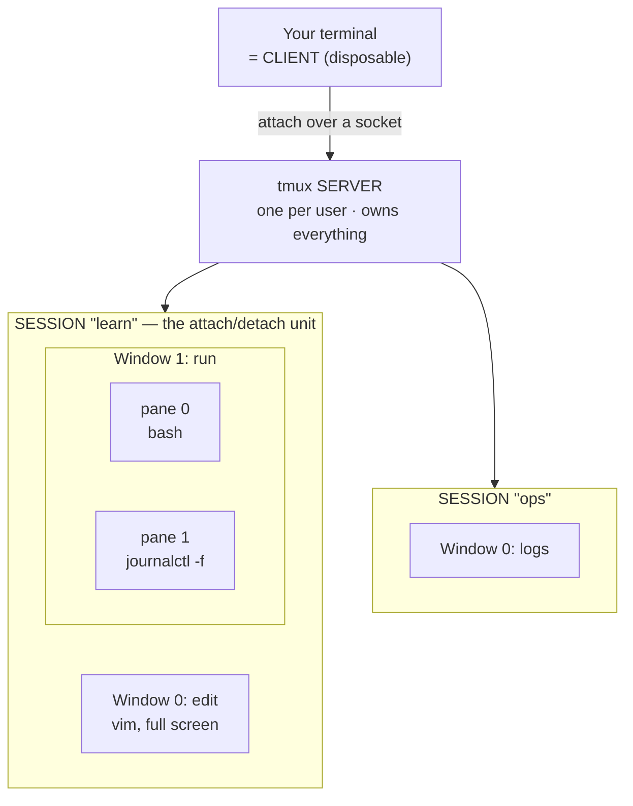
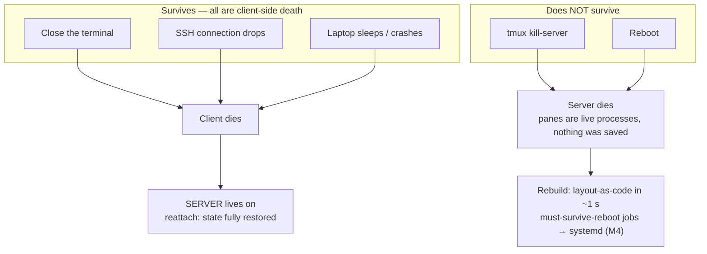

# Module 07 — Tmux

<small>Stage 3 · Intermediate Skills · ~½ week at 4 h/day · Prerequisites — M2 (the terminal/pty model), M3 (SIGHUP, sockets + permissions), M6 (vi keys, now navigating your terminal history too). Second tool of the Stage 3 belt.</small>

## Why this matters

**tmux** (terminal multiplexer) is a *server* that hosts terminal sessions independently of any terminal
window: one terminal can display many terminals (windows and panes), and you can **detach** from a
session and **reattach** later — from anywhere — with everything still running exactly as you left it.

Module 06 gave you an editor that lives in the terminal; this module gives that editor a *workspace* that
survives you. Two properties change how you work: (1) **persistence** — close the laptop, drop the SSH
connection, reattach tomorrow and your editors, logs, and long-running jobs never noticed; (2)
**multiplexing** — editor + logs + shell side-by-side in ONE terminal, keyboard-driven. From this module
on, your terminal work lives inside tmux by default.

!!! info "What this unlocks"
    **M8** — long interactive Git operations (rebases, bisects) now survive interruptions, and your two
    new dotfiles get version history · **M9 (SSH)** — the payoff: `ssh box` then `tmux attach`, your whole
    workspace waiting on the server (remote work without tmux is work you can lose) · **M11** — Claude
    Code sessions run in a pane beside your editor, supervised like logs · **M15+** — long automation runs
    watched from a scripted dashboard · **M23** — the incident session (a named workspace per incident:
    logs pane + action pane) is a scripted reflex. Learn it now, three modules before you need it.

---

## Watch

*Watch once, then rely on the notes below — you should never need to rewatch.*

<div class="lo-video-placeholder" markdown="1">
<span class="lo-play">▶</span>
**Explainer video — coming**
<small>Record per <code>../media/README.md</code>, upload to YouTube, then replace this card with the embed.</small>
</div>

??? note "For the author — drop-in YouTube embed (replace VIDEO_ID)"
    Once the explainer is on YouTube, replace the placeholder card above with:
    ```html
    <div class="lo-video-embed">
      <iframe src="https://www.youtube-nocookie.com/embed/VIDEO_ID"
              title="Module 07 — Tmux"
              allow="accelerometer; autoplay; clipboard-write; encrypted-media; gyroscope; picture-in-picture"
              allowfullscreen></iframe>
    </div>
    ```
    Video script beats (the theater analogy, the mechanism, the misconceptions):
    the SIGHUP problem (close the window, the play dies — back to M3) → the client–server split with the
    theater analogy (the play runs on **stage** = the server; your screen is just a **seat** = the client)
    → the live survival demo (kill the terminal mid-`watch`, reattach — the clock never stopped) →
    windows/panes in 60 s → keys-are-commands (`prefix %` *runs* `split-window -h`, so layouts are
    scriptable) → the honest boundary (reboot kills it; that's systemd's job — M4).

**Terminal cast — pending; record per `../media/README.md`.**

!!! tip "Follow along, don't just watch"
    Open the [Guided Lab](#guided-lab-your-first-sessions) in a browser terminal and run each command
    yourself as it appears. Typing beats watching every time — and it is part of how the memory forms.

---

## Key Notes

*Standalone. This is the reference you keep.*

### The picture: client, server, and what they hold



The first `tmux` command forks a **server** process (one per user) that owns a Unix socket in
`/tmp/tmux-<uid>/`. Your terminal is only a **client** talking to it. Every pane's shell is a child of
the *server*, not of your terminal — so closing the terminal, or an SSH drop, never signals those
processes. **Persistence is parenthood** (M1's process tree + M3's SIGHUP: the hangup goes to the client,
which is disposable). Each pane is its own **pty** — the same pseudo-terminal mechanism M2 asked about,
now answered mechanically.

### The object hierarchy — name every level

Server ⊃ sessions ⊃ windows ⊃ panes; clients attach to sessions.

| Component | What it is |
|---|---|
| **Server** | One per user, holds ALL sessions; starts on first `tmux`, dies when the last session ends |
| **Session** | A named workspace of windows — the unit you attach/detach (`tmux new -s name`) |
| **Window** | A full-screen "tab" inside a session (`prefix c`; numbered and named) |
| **Pane** | A split of a window — each pane is a real **pty** running its own shell |
| **Client** | Your actual terminal, attached to one session (many clients can share one — that's pairing) |
| **Prefix key** | `Ctrl-b` by default — the escape hatch that says "the next key is for tmux, not the shell" |

Read it as a policy: **sessions = projects, windows = tasks, panes = simultaneous views.** Name them, and
future-you attaches by name instead of guessing what `3` was.

### Prefix-then-key — one chord namespace

Every tmux keystroke is *prefixed* by `Ctrl-b` (written `prefix`). The prefix keeps tmux's keys out of
your programs' keys: press `prefix`, release, then the command key. The bindings you actually use daily:

| Do | Keys | Do | Keys |
|---|---|---|---|
| New named session | `tmux new -s name` | Split vertical / horizontal | `prefix %` / `prefix "` |
| Detach | `prefix d` | Move between panes | `prefix` + arrows (or `o`) |
| List sessions (out / in) | `tmux ls` / `prefix s` | Zoom a pane (toggle full-screen) | `prefix z` |
| Attach to "dev" | `tmux attach -t dev` | Kill a pane | `prefix x` (or `exit` its shell) |
| Kill session / whole server | `tmux kill-session -t x` / `tmux kill-server` | Enter copy mode / paste | `prefix [` / `prefix ]` |
| New window / rename | `prefix c` / `prefix ,` | Copy-mode keys are… | **vi** (`setw -g mode-keys vi`) |
| Next / last window | `prefix n` / `prefix l` | Command prompt | `prefix :` |

!!! warning "`exit` is not `detach`"
    Typing `exit` in a pane **kills that shell** — last pane closes the window, last window ends the
    session, last session stops the server. To *leave with everything running*, use `prefix d`. This is
    the single most common beginner mistake; feel the difference once and never repeat it.

### Keys are commands — which is why layouts are scriptable

`prefix %` doesn't "do a split" magically — it *runs the command* `split-window -h`. Every binding maps
to a real command, and the same command reaches the server three ways:

| Route | You type | When to use |
|---|---|---|
| **Bound key** | `prefix %` | Interactive, at the keyboard |
| **Command mode** | `prefix :` then `split-window -h` | Interactive, for unbound or rare commands |
| **Any shell** | `tmux split-window -h` | From a script — even from *outside* tmux |

That third route is the whole game: **anything you can type, you can script.** `tmux new-session -d`
builds a session *without attaching* (so a script can keep configuring it), `send-keys` types into a pane
programmatically, and `tmux ls` / `list-panes` inspect live state — all from a plain shell.

### The survival map — what lives, what dies, and why



tmux does not *save* your session — it keeps it **alive** (live processes under a surviving parent).
Reboot proves the difference: nothing is serialized, so the server and its panes are simply gone. The
professional two-part answer: **layouts-as-code** rebuild the workspace in seconds, and anything that must
survive reboots or run on a schedule was a **systemd** unit/timer all along (M4's boundary, restated).

### Copy mode — where M6 pays its first dividend

`prefix [` freezes a pane into navigable scrollback. Set `setw -g mode-keys vi` and it *is* Vim: `j k`,
`/` and `?` to search, `n`/`N`, `v` to select, `y` to yank; `prefix ]` pastes. Copy an error line from a
`journalctl` pane straight into a Vim note in another window — no mouse, works over SSH, and (unlike the
terminal emulator's own selection) it handles wrapped lines correctly. Bridging to the *system* clipboard
(`set -g set-clipboard on` / OSC 52) is terminal-dependent — test yours and write down the result; it
matters at M9.

### The earned `~/.tmux.conf` — config as code

Every line earned from real friction, every line commented (the M6 discipline). The Vim user's first
three earn their place immediately:

| Line | Why it earns its place |
|---|---|
| `set -g mode-keys vi` | Copy-mode fluency on day one — your M6 grammar, reused |
| `set -sg escape-time 0` | Kills the Esc lag that makes Vim-inside-tmux feel broken (feel the lag first, *then* fix it) |
| `set -g default-terminal "tmux-256color"` | Correct colors — the classic washed-out-Vim fix is a `$TERM` fix |

Then the taste-level extras: `set -g base-index 1` (window numbers match the keyboard), `|`/`-` split
remaps if the mnemonics bit you, a bumped `history-limit` (memory per pane — set it deliberately), a
modest status line, and a reload binding: `bind r source-file ~/.tmux.conf \; display "reloaded"`. Keep
bindings **close to defaults** — every exotic remap is a tax on every server and pairing session that
doesn't have your config.

<div class="lo-remember" markdown="1">
**Must remember (if you keep only seven things):**

1. **Persistence is parenthood.** Panes are children of the SERVER, not your terminal — so closing the window (or an SSH drop) signals only the disposable **client**.
2. **`exit` kills; `prefix d` detaches.** exit ends the shell (and can end the window/session/server); detach leaves everything running.
3. **Server ⊃ session ⊃ window ⊃ pane.** Session = attach/detach unit; each pane = its own pty. Name your sessions and windows.
4. **Keys are commands.** `prefix %` *runs* `split-window -h`; the same command works from `prefix :` and from `tmux …` in any shell — that's why layouts script.
5. **Build headless, then attach.** `tmux new-session -d` + `send-keys` construct a whole workspace from a script; guard it with `$TMUX` so it never nests.
6. **tmux keeps things ALIVE, not SAVED.** Survives client death; dies on `kill-server`/reboot. Rebuild with a layout script; use **systemd (M4)** for what must survive reboots.
7. **Earn each `.tmux.conf` line.** A Vim user's first three: `mode-keys vi`, `escape-time 0`, `default-terminal tmux-256color`. Stay near stock.
</div>

---

## Guided Lab: your first sessions

*Basic, step-by-step. Everything here is safe — you create named sessions and a throwaway `~/.tmux.conf`,
and nothing outside your home is touched. tmux-by-default starts now: every terminal you open this week
starts or attaches a session.*

<div class="lo-lab-actions" markdown="1">
[▶ Open interactive lab{ .lo-btn }](https://killercoda.com/learning-os/course/killercoda/module-07){ target=_blank }
[⧉ Open in Codespaces{ .lo-btn }](https://codespaces.new/randaguiac20/learning-os){ target=_blank }
[⌨ Run locally{ .lo-btn .lo-btn--ghost }](#run-locally)
[View lab source{ .lo-btn .lo-btn--ghost }](https://github.com/randaguiac20/learning-os/tree/main/killercoda/module-07){ target=_blank }
</div>

<span id="run-locally"></span>
!!! tip "Three ways to run this lab — pick any (all free)"
    - **Instant, no account** — click **Open interactive lab** (Killercoda): a Linux terminal in your browser.
    - **Your own cloud** — click **Open in Codespaces**: runs in your GitHub account's free tier (120 core-hrs/mo).
    - **Local, unlimited, $0** — any Linux / macOS / WSL terminal, or a throwaway container: `docker run -it ubuntu bash` (then `apt-get update && apt-get install -y tmux`), and follow the steps below.

    Killercoda is the zero-setup on-ramp; Codespaces and local use *your own* free resources, so they scale to any class size.

=== "1 · The survival demo (do this FIRST)"
    ```bash
    tmux new -s proof            # start a named session
    watch -n1 date               # something visibly alive; leave it running
    ```
    Now **close the entire terminal window** (yes, really). Open a new one and:
    ```bash
    tmux ls                      # the session is still listed
    tmux attach -t proof         # the clock never stopped
    ```
    See the mechanism from *outside* tmux: `pstree -p $(pgrep -x tmux | head -1)` — the server owns your
    `watch` process. Journal the before/after process-parent story in your own words. This one demo is the
    whole point of the module.

=== "2 · Session lifecycle fluency"
    ```bash
    tmux new -s learn            # create three named sessions
    tmux new -d -s ops           # -d: create without attaching
    tmux new -d -s scratch
    tmux ls                      # what's running
    ```
    Inside a session, practice the loop until it's reflexive: `prefix d` (detach) · `tmux attach -t ops` ·
    `prefix s` (the switcher). Then the classic mistake **on purpose**: type `exit` in a pane and feel it
    *kill* the shell — that is why you detach, not exit. Clean up one session:
    ```bash
    tmux kill-session -t scratch
    ```

=== "3 · Windows as tasks"
    ```bash
    tmux attach -t learn
    ```
    Inside `learn`, build the workstation shape: `prefix c` three times, rename each with `prefix ,` to
    `edit`, `run`, `man`. Navigate until automatic: `prefix n`/`prefix p` (next/prev), a number key to jump,
    `prefix l` (last), `prefix w` (tree picker). Put **vim full-screen** in `edit`, a shell in `run`, and
    `man tmux` in `man`. Editor full-screen beats editor-in-a-sliver — switch windows, don't shrink Vim.

=== "4 · Panes where side-by-side matters"
    In the `run` window:
    ```bash
    # prefix %   -> split vertical (two columns)
    # prefix "   -> split horizontal (two rows)
    # prefix o / arrows -> move between panes
    # prefix z   -> zoom one pane full-screen (toggle) — the underrated key
    # prefix Space -> cycle preset layouts
    ```
    Build the classic: a shell on top, `journalctl -f` below (M4). Edit scripts in the `edit` window and
    watch their journal output land live in `run`. Kill a pane with `prefix x` (or `exit` its shell).

=== "5 · Copy mode — the M6 dividend"
    First, so the keys feel right, start a fresh config:
    ```bash
    printf '%s\n' 'setw -g mode-keys vi' > ~/.tmux.conf
    tmux source-file ~/.tmux.conf
    ```
    Fill a pane with output (e.g. `journalctl -n 200 --no-pager` or `seq 1 500`), then `prefix [` to enter
    copy mode. Navigate with `j k`, search with `/word` then `n`, select with `v`, yank with `y`, and
    paste with `prefix ]`. Real exercise: copy one error line from a logs pane into a Vim note in the
    `edit` window — **no mouse**. Check `tmux show-buffer`.

=== "6 · The first earned tmux.conf"
    ```bash
    cat >> ~/.tmux.conf <<'EOF'
    set -sg escape-time 0                       # no Esc lag in Vim (feel it first)
    set -g default-terminal "tmux-256color"     # correct colors
    set -g base-index 1                         # window numbers match the keyboard
    bind r source-file ~/.tmux.conf \; display "reloaded"   # a reload key
    EOF
    tmux source-file ~/.tmux.conf               # apply it live
    ```
    Reload with `prefix r` from now on. Every line is here because it fixed a real friction — that is the
    only reason a line belongs in your config.

!!! success "You can stop here and have learned something real"
    If you can prove survival, run the session lifecycle without confusing `exit` and detach, organize
    work into named windows and panes, extract text with copy mode, and start an earned `.tmux.conf` — the
    guided lab is done. Now make it harder.

---

## Solo Lab: figure it out

*Harder. Goals only — minimal hand-holding. Struggle here is the point; reveal a hint only after you've
tried. The layout script is the module's required project (`workstation.sh`) — build it for real.*

### Challenge 1 — Workstation as code (the project)
Write `workstation.sh` (full M5 standard: shebang, `set -euo pipefail`, a `$TMUX` guard, has-session
idempotence) that builds your daily layout **headless** then attaches: session `dev`, window `edit`
running vim, a second window `run` split with a `journalctl -f` follow, landing on `edit`. Re-running must
**attach**, not duplicate.

??? tip "Hint"
    Guard with `[[ -n "${TMUX:-}" ]]` → `switch-client` instead of attach (never nest). Check existence
    with `tmux has-session -t dev 2>/dev/null`. Build with `-d` (detached) so the script can keep issuing
    commands against a session no one is attached to yet, and `attach` only at the very end.

??? success "Solution"
    ```bash
    #!/bin/bash
    set -euo pipefail
    session="dev"
    if tmux has-session -t "$session" 2>/dev/null; then
      [[ -n "${TMUX:-}" ]] && exec tmux switch-client -t "$session"
      exec tmux attach -t "$session"
    fi
    tmux new-session -d -s "$session" -n edit
    tmux send-keys  -t "$session:edit" 'cd ~ && vim' Enter
    tmux new-window -t "$session" -n run
    tmux split-window -v -t "$session:run"
    tmux send-keys  -t "$session:run.1" 'journalctl -f 2>/dev/null || tail -f /var/log/syslog' Enter
    tmux select-window -t "$session:edit"
    [[ -n "${TMUX:-}" ]] && exec tmux switch-client -t "$session"
    exec tmux attach -t "$session"
    ```
    `-d` matters because a script isn't a terminal to attach yet — build headless, attach last. The
    `$TMUX` guard makes it safe to run from *inside* tmux (switch instead of nest).

### Challenge 2 — One command, from any shell
Without attaching anything, open a new window running `htop` in the `dev` session, then prove it exists.

??? success "Solution"
    ```bash
    tmux new-window -t dev -n mon htop
    tmux list-windows -t dev
    ```
    Keys are commands — so a new window is just a command you can fire from a plain shell. `send-keys`
    would type into a pane; `new-window … htop` launches the program directly.

### Challenge 3 — Fleet view of your own workspace
From **outside** tmux, print what program is running in every pane, tagged by `session:window.pane`.

??? tip "Hint"
    `list-panes -a` walks every pane; `-F` takes a format string of `#{…}` variables. Skim `man tmux`
    FORMATS for 15 minutes and change the format once, on purpose.

??? success "Solution"
    ```bash
    tmux list-panes -a -F '#{session_name}:#{window_index}.#{pane_index} #{pane_pid} #{pane_current_command}'
    ```
    Cross-check one pane's PID in `pstree`/`ps` (M3) to see the server parenting it. Formats expose live
    state without attaching — the observability half of the module.

### Challenge 4 — The rescue gauntlet
Handle three failure modes calmly, with a *method*, not thrashing: (a) you attach and see a small boxed
screen surrounded by dots; (b) Vim's Esc lags and its colors are washed out; (c) you're inside a nested
tmux and the prefix "does nothing."

??? success "Solution"
    ```bash
    # (a) A smaller client is also attached; tmux sizes to the smallest. Detach the others:
    tmux attach -d -t <session>       # or, from inside: tmux detach -a
    # (b) Two causes, two fixes — the FAQ headliners:
    #   Esc lag  -> set -sg escape-time 0
    #   colors   -> set -g default-terminal "tmux-256color"  (and a terminal that supports it)
    # (c) You are already inside tmux ($TMUX is set). Reach the INNER prefix with send-prefix:
    #   press  C-b C-b   ...but better: don't nest — detach or switch-client first.
    ```
    Diagnose with the tools, not superstition: `tmux list-keys | grep <key>` (is it bound? prefix vs
    `-n`?), `tmux show-options -g` (what's actually set), and the FAQ for TERM/escape-time.

### Challenge 5 (stretch) — Scrollback hygiene and the socket
On a shared box, scrollback is a data-leak surface (anyone who later attaches can scroll to secrets you
`cat`-ed). Demonstrate the leak and the cure, then inspect the socket that makes sharing possible.

??? warning "Understand the trust model before you pair"
    Socket access = the ability to command the server = **every shell in every session** = full
    account-level compromise. Pairing (two clients, one session) and the threat are the *same* feature.

??? success "Solution"
    ```bash
    echo "PRETEND_SECRET=hunter2"        # appears in this pane's scrollback
    tmux clear-history                   # scrub THIS pane's history
    # verify: prefix [ and search — the line is gone
    ls -la /tmp/tmux-$(id -u)/           # the socket dir: mode 700, owned by you (M3 perms doing real work)
    ```
    Directory mode `700` is why only *you* can command your server. Shared sockets (`tmux -S /tmp/pair`)
    plus group permissions enable cross-user pairing — a deliberate act, eyes open (M9 revisits this
    remotely).

---

## Self-Check

*Close the notes. Answer aloud or in writing **first**, then reveal. Recalling — even when it's hard — is
what builds the memory.*

??? question "Why does closing a terminal kill a bare shell's jobs but not a tmux session's?"
    Closing a terminal sends **SIGHUP** to its controlling process group — a bare shell and its jobs die
    (M3). In tmux, the terminal only hosts the **client**; the pane processes are children of the
    **server**'s ptys, so no hangup ever reaches them. **Persistence is parenthood.**

??? question "Define server, session, window, pane, client — and give the containment hierarchy."
    Server: the per-user daemon holding everything. Session: a named workspace, the attach/detach unit.
    Window: a full-screen tab in a session. Pane: a split region backed by its own pty+shell. Client: a
    real terminal attached to one session. **Server ⊃ sessions ⊃ windows ⊃ panes; clients attach to
    sessions.**

??? question "Trace `exit` in your last pane vs `prefix d` — what happens to window, session, server?"
    `exit`: kills that pane's shell; last pane → the window closes; last window → the session dies; last
    session → the server exits. `prefix d`: the client disconnects and **session, windows, panes, and
    processes all continue untouched.** One destroys, one detaches.

??? question "What is `prefix %` *really* doing, and why does that make layouts scriptable?"
    It runs the command `split-window -h`. Every key is a binding to a command; the same command works from
    `prefix :` and from any shell (`tmux split-window -h`). Scripting a layout is just running those
    commands against a (possibly detached) session — no keystroke simulation needed.

??? question "You attach and see a small boxed area surrounded by dots. What's happening, and two fixes?"
    Another attached **client has a smaller terminal**, and tmux sizes the shared session to the smallest
    attached client. Fix by detaching the others (`tmux attach -d`, or `tmux detach -a` from inside) or by
    enlarging the small client.

??? question "After a reboot, `tmux ls` reports no server. Explain the boundary and the professional answer."
    tmux persistence is **live processes under a running server**; a reboot kills the server and nothing
    was serialized, so it's gone by design. The two-part answer: (a) a **layout-as-code** script rebuilds
    the workspace in seconds; (b) anything that must survive reboots or run unattended belongs in a
    **systemd** unit/timer (M4) — tmux is for interactive work, not service supervision.

??? question "Vim inside tmux: Esc feels laggy and colors are washed out. Both causes, both fixes?"
    Esc lag: tmux waits `escape-time` ms to disambiguate Esc from an escape sequence → `set -sg
    escape-time 0`. Colors: a `$TERM` mismatch → `set -g default-terminal "tmux-256color"` (plus a
    terminal that supports it). Both are the FAQ's headline gotchas.

!!! example "Teach it back (the real test)"
    Out loud, in **4 minutes, no notes**: *"Why does closing your terminal normally destroy your work, and
    how does tmux change that?"* — you must land **SIGHUP + parenthood** (M1/M3), the **client–server**
    split, **detach vs exit**, and the honest **boundary** (reboot kills it; systemd owns the reboot-proof
    world). The **theater analogy** must appear and then yield to the mechanism. Then, in **90 seconds**,
    teach *"why wasn't the download lost when the hotel wifi died?"* to a beginner — the play keeps running
    on **stage** even when you leave your **seat**; jargon last. If you can't yet, reread the Key Notes,
    don't move on.

---

## Mastery checklist

*Tick these honestly, cold (no notes). They **gate** progress — a module is only "done" when every box is
true.*

- [ ] **Explain** client–server persistence via parenthood flawlessly, and keep `exit` vs `prefix d` precise.
- [ ] **Define** 15 random terms cold (pane, pty, prefix, paste buffer, `send-keys`, `base-index`, `escape-time`, socket…).
- [ ] **Draw** all four blanks from memory: the object hierarchy, the survival map, the key→command routes, and your own `tmux.conf`.
- [ ] **Build** a new layout spec scripted cold in ≤20 min — idempotent (re-run attaches) and `$TMUX`-guarded.
- [ ] **Configure** `tmux.conf` v1 live; explain every line on random pointing; defend the mouse decision.
- [ ] **Administer** session hygiene (the `ls` → name → kill ritual) and articulate what `kill-server` takes down.
- [ ] **Develop** the edit/run pattern in daily use — vim full-screen window + run/log window, no sliver-vim.
- [ ] **Automate** `workstation.sh` on your PATH, used daily, evolved ≥2× from real friction (diffs logged).
- [ ] **Secure:** socket perms + what-access-grants + scrollback hygiene (`clear-history`), all demonstrated.
- [ ] **Monitor** with `list-panes -F` fleet view and a `pstree` cross-check; build Mission Control (or an equivalent).
- [ ] **Troubleshoot** the rescue gauntlet cold: boxed screen, Esc-lag + wrong TERM, nested prefix, scrollback, the reboot story.
- [ ] **Debug** a planted `tmux.conf` with the config-free-start + bisect method; be fluent with `list-keys` / `show-options`.
- [ ] **Integrate:** cross-pane copy-mode extraction fluent; clipboard-bridge status documented; `$TMUX` guard in scripts.
- [ ] **Decide** tmux vs `nohup` vs systemd per scenario without dogma, and articulate the pairing trust call.
- [ ] **Self-serve:** learn ≥3 things from `man tmux` / the wiki alone, and score ≥80% on the validation bank.
- [ ] **Teach:** pass the teach-back above (the terminal-that-survives explanation is mandatory).

---

## Review — lock it in

Spaced repetition is not optional; it's where the memory actually forms. Interleaving stays active — every
M7 review also pulls in one **Module 06 (Vim)** item (the tools pair: editor inside multiplexer). Like
M6, this module **self-reviews through immersion** — tmux-by-default makes every day a rep. Schedule these
and *keep* them:

| When | Do | Interleaved M6 item |
|---|---|---|
| **Day 1** | Flashcards · the lifecycle sprint (new → detach → list → attach → kill) · validation B5–B7 | M6 flashcards you missed |
| **Day 3** | Rebuild `workstation.sh`'s logic on paper, cold · validation C10, E14 | M6: a macro cold-task |
| **Day 7** | Scripting sprint typed · narrate the nested-tmux and boxed-screen scenarios | M6: the spoken-grammar sprint |
| **Day 14** | Layout-script review — one real improvement from two weeks of daily use | M6: THE RACE retest (shared date!) |
| **Day 30** | Session-hygiene audit: has the evening `tmux ls` ritual held? · validation F15–F16 | M6: register sprint cold |

**Connects forward to:** Git (M8 — long rebases/bisects survive interruptions; your two new dotfiles get
history) · SSH (M9 — the payoff: `ssh box` then `tmux attach`, your workspace waiting on the server) ·
Claude Code (M11 — agent sessions in a pane beside your editor) · Automation (M15+ — long runs watched
from Mission Control panes; `send-keys` drives lab setups) · Debugging (M23 — the incident-session
template, designed on paper this week, becomes a scripted reflex).

!!! quote "The one-sentence takeaway"
    M7 decouples your work from your window: from now on your processes survive you leaving — the exact
    property remote engineering (M9) and long-running AI work (capstone) cannot exist without.
