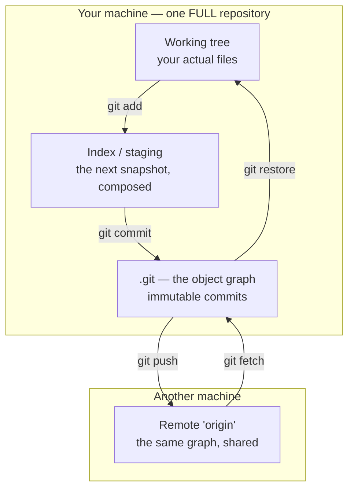
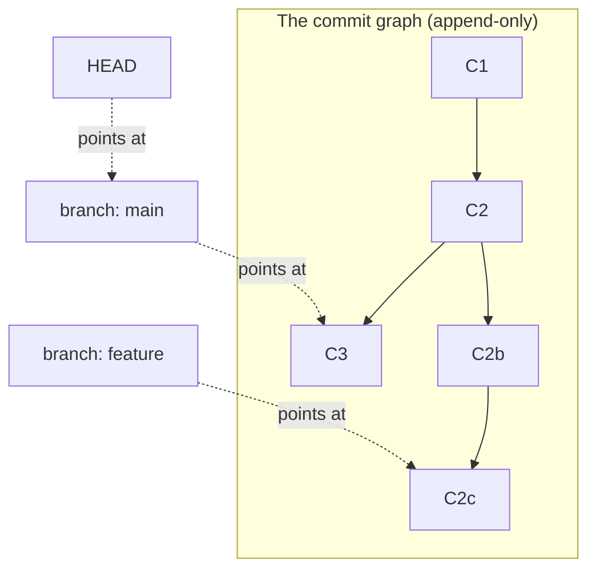

# Module 08 — Git

<small>Stage 3 · Intermediate Skills · ~2 weeks at 4 h/day · Prerequisite — Modules 05–07 (scripts worth versioning, Vim to write messages and resolve conflicts, Tmux so long rebases survive a disconnect).</small>

## Why this matters

**Git** is a distributed version control system: it stores your project as a graph of immutable
**snapshots** (commits), each pointing to its parent(s), with movable pointers (**branches**) into that
graph — so you can record every state, branch into parallel work, merge lines back together, share them
between machines, and recover almost anything.

`script.sh.old2.FINAL.bak` is version control by fear. From this module on, *everything you build is
versioned*: your dotfiles (M6/M7's artifacts are waiting), your scripts, every future project through
the capstone. Git is also the industry's collaboration substrate — GitHub PRs, code review, and CI (M15)
all stand on it — and its graph model is a **thinking tool**: engineers who can see the graph fix in
minutes what costs graph-blind users their afternoon (or their work).

!!! info "What this unlocks"
    M9 (SSH) is `git clone git@…` finally understood — this exact model over the network · M10 (chezmoi)
    is a Git repo wearing dotfile-manager clothes — your M8 skills *are* its power-user mode · M11 (Claude
    Code) writes code **in your repos** — your diff-review discipline is what makes AI assistance safe ·
    M15 (CI) is a hook grown up server-side: every pipeline starts at a commit. Learn the **graph** now
    and collaboration, debugging-in-time, and AI-assisted work all become routine instead of risky.

---

## Watch

*Watch once, then rely on the notes below — you should never need to rewatch.*

<div class="lo-video-placeholder" markdown="1">
<span class="lo-play">▶</span>
**Explainer video — coming**
<small>Record per <code>../media/README.md</code>, upload to YouTube, then replace this card with the embed.</small>
</div>

??? note "For the author — drop-in YouTube embed (replace VIDEO_ID)"
    Once the explainer is on YouTube, replace the placeholder card above with:
    ```html
    <div class="lo-video-embed">
      <iframe src="https://www.youtube-nocookie.com/embed/VIDEO_ID"
              title="Module 08 — Git"
              allow="accelerometer; autoplay; clipboard-write; encrypted-media; gyroscope; picture-in-picture"
              allowfullscreen></iframe>
    </div>
    ```
    Video script beats (from the blueprint's Definition / Architecture / Misconceptions):
    the photo album, not the edit-list (snapshots, not diffs) → the three areas and why staging exists →
    a branch is a 41-byte file (show it) → merge vs rebase drawn live, and the Golden Rule → the two
    safety nets: `revert` for shared history, `reflog` for local — "I lost my code" is a missing tool,
    not a missing feature.

**Terminal cast — pending; record per `../media/README.md`.**

!!! tip "Follow along, don't just watch"
    Open the [Guided Lab](#guided-lab-your-first-repository) in a browser terminal and run each command
    yourself as it appears. Typing beats watching every time — and it is part of how the memory forms.

---

## Key Notes

*Standalone. This is the reference you keep.*

### The picture: the three areas (and a fourth machine)



Only the **working tree** is your ordinary files; the **index** is the *proposed next commit* (you put
changes there deliberately with `add`); the **repository** (`.git`) is the immutable graph of everything
committed. A **remote** is just the same graph on another machine — and because your clone is a *full*
repository, you are already using Git distributed (laptop now; a server via M9 soon).

### The object model — four types, all addressed by content

Everything in `.git` is one of four object types, each named by the **hash of its content** (identical
content is stored once; corruption is detectable with `fsck`):

| Object | What it holds | Points at |
|---|---|---|
| **blob** | one file's *contents* (no name — the name lives in the tree) | nothing |
| **tree** | one directory: names → blobs and sub-trees | blobs, trees |
| **commit** | a snapshot: one tree hash + parent hash(es) + author/date + message | its tree, its parent(s) |
| **tag** (annotated) | a named, message-bearing pointer to a commit — for releases | one commit |

A commit's hash covers its tree **and** its parents, so altering any ancestor changes every descendant
hash — history is a tamper-evident chain (the same idea blockchains later borrowed). Diffs are *computed
on demand*; commits store whole snapshots, which is why `checkout`/`switch` are instant.

### The graph & pointers — a branch is 41 bytes



A **branch** is a ~41-byte file in `.git/refs/heads/` holding one commit hash. Creating a branch writes
*one file*; switching moves *one pointer* and materialises files from the local database. **THAT** is why
Git branching changed how the industry works while SVN's directory-copy branches stayed scary. **HEAD**
answers "where am I" — it points to your current branch (or, when it points straight at a commit,
you are in a harmless **detached HEAD**).

### Porcelain vs plumbing — two layers, one database

Git ships a friendly **porcelain** (the daily commands) over a scriptable **plumbing** (the low-level
ones). You live in porcelain; you visit plumbing to *see the model*:

| Layer | Examples | You use it to… |
|---|---|---|
| **Porcelain** (daily) | `status` `add` `commit` `log` `branch` `switch` `merge` `rebase` `push` `pull` | do the work |
| **Plumbing** (internals) | `hash-object` `cat-file` `rev-list` `rev-parse` `show-ref` | prove *how* the work is stored |

`git cat-file -p HEAD` shows a commit is just tree + parent + author + message; `echo hi | git
hash-object --stdin` gives the same hash every time — content addressing, made visible.

### The daily loop

`status` (**always first**) → work → `diff` (review *yourself* before staging) → `add -p` (stage
**hunks**, deliberately) → `commit` (imperative subject ≤ 50 chars + a body saying **WHY**) → repeat →
`push`. Feature work: **branch → commits → merge/PR back**. Weekly: `log --graph --oneline --all` to
*see* your history and prune merged branches. The staging area is a **feature, not friction** — commits
are *composed* (`add -p`), not dumped (`git add .` as a reflex is how junk sneaks in).

### Merge vs rebase — the choice with reasons

Two ways to combine lines of work. When history is linear, a merge is a **fast-forward** (pointer slide,
no new commit); otherwise Git does a 3-way merge from the common ancestor (a **conflict** is just a region
both sides changed — Git writes markers and asks the human):

| | **Merge** | **Rebase** |
|---|---|---|
| Graph shape | new commit with **two parents** | commits **replayed** onto a new base |
| Hashes | preserved | **new** (content re-committed) |
| Reads like | the truth (non-linear DAG) | a clean linear story |
| Safe on | anything | **private** history only |

**The Golden Rule: never rewrite commits that have left your machine.** Rebasing shared history *forks
reality* — you replaced pages other people already photocopied. Rebase to tidy your private diary; then
stop.

### The undo taxonomy — "which trees move"

Every "undo" is a choice of which of the three areas moves. `reset` is the general lever:

| Command | Working tree | Index | HEAD | Use when |
|---|---|---|---|---|
| `restore <file>` | ✅ discards | — | — | throw away an unstaged edit |
| `restore --staged <file>` | — | ✅ unstage | — | un-`add` something |
| `commit --amend` | — | — | ✅ new hash | fix the **last** commit (private only) |
| `revert <hash>` | — | — | ➕ new inverse commit | undo on **shared** history |
| `reset --soft HEAD~1` | — | — | ✅ | recompose the last commit |
| `reset --mixed HEAD~1` | — | ✅ | ✅ | unstage *and* rework staging |
| `reset --hard HEAD~1` | ✅ **discards** | ✅ | ✅ | abandon local work (`status` first!) |

`revert` on shared history (append-only — everyone fast-forwards); `reset` only on private history.

### fetch vs pull — and the bookmark that ends the confusion

`fetch` downloads remote commits and moves **`origin/main`** — a *remote-tracking* pointer, a read-only
local bookmark of where the remote was at last contact. Your own branch is untouched. `pull` = `fetch` +
**integrate** (merge or rebase per config) into your current branch. Understanding this split kills most
remote confusion: after a rejected `push` ("non-fast-forward"), the remote simply moved — **`fetch` →
look (`log main..origin/main`) → integrate → push**, never `--force` as a reflex (`--force-with-lease`
exists for the rare legitimate rewrite of your *own* shared branch).

### The safety model — panic is optional

Almost nothing committed is ever lost. The **reflog** is your local journal of every place HEAD has been
(~90 days), so a `reset --hard` "disaster" is a lookup, not a loss: `git reflog` → find the hash →
`git branch rescue <hash>` → it's back. And `.gitignore` **before the first commit** keeps secrets and
artifacts out — but it only affects *untracked* files, so anything already committed lives in history
until it's rewritten *and* the secret is rotated (rotation first — rewriting can't recall copies).

<div class="lo-remember" markdown="1">
**Must remember (if you keep only six things):**

1. **Commits are snapshots in an append-only graph; branches are ~41-byte movable pointers.** *See* the
   graph (`log --graph`) until you think in it.
2. **Three areas:** working tree → **`add`** → index → **`commit`** → repository. Staging is a feature —
   compose commits with `add -p`, don't dump with `git add .`.
3. **Merge keeps the truth (two parents); rebase rewrites for readability (new hashes).** The **Golden
   Rule**: never rewrite history that left your machine.
4. **`revert` on shared, `reset` on private.** Every scary command has an abort — learn the abort *with*
   the operation.
5. **`fetch` moves the `origin/*` bookmark; `pull` = fetch + integrate.** After a rejection: fetch, look,
   integrate — never reflexive `--force`.
6. **`reflog` before panic.** A pushed repo is a backed-up repo (prove it with a fresh clone).
</div>

---

## Guided Lab: your first repository

*Basic, step-by-step. Everything happens inside a throwaway `~/git-lab` repo you build first — all local,
no network or GitHub account needed. You'll set your identity, make atomic commits, branch, merge a real
conflict, break history on purpose, and recover it.*

<div class="lo-lab-actions" markdown="1">
[▶ Open interactive lab](https://killercoda.com/learning-os/course/killercoda/module-08){ .lo-btn target=_blank }
[⧉ Open in Codespaces](https://codespaces.new/randaguiac20/learning-os){ .lo-btn target=_blank }
[⌨ Run locally](#run-locally){ .lo-btn .lo-btn--ghost }
[View lab source](https://github.com/randaguiac20/learning-os/tree/main/killercoda/module-08){ .lo-btn .lo-btn--ghost target=_blank }
</div>

<span id="run-locally"></span>
!!! tip "Three ways to run this lab — pick any (all free)"
    - **Instant, no account** — click **Open interactive lab** (Killercoda): a Linux terminal in your browser.
    - **Your own cloud** — click **Open in Codespaces**: runs in your GitHub account's free tier (120 core-hrs/mo).
    - **Local, unlimited, $0** — any Linux / macOS / WSL terminal, or a throwaway container: `docker run -it ubuntu bash`, then follow the steps below.

    Killercoda is the zero-setup on-ramp; Codespaces and local use *your own* free resources, so they scale to any class size.

=== "1 · Identity, first repo, atomic commits"
    ```bash
    git config --global user.name "Lab User"       # who the commits belong to
    git config --global user.email "lab@example.com"
    git config --global init.defaultBranch main
    mkdir ~/git-lab && cd ~/git-lab && git init    # a full repository, right here
    printf 'set number\n' > .vimrc
    git status                                     # untracked — status FIRST, always
    git add .vimrc && git commit -m "Add vimrc with line numbers"
    printf 'alias ll="ls -la"\n' > .bashrc
    git add .bashrc && git commit -m "Add ll alias to bashrc"
    git log --oneline                              # two ATOMIC commits, one idea each
    ```
    Journal: what did `status` say *before* the `add`, and *after*? A commit is a **statement**
    (chosen content + a caption), not an autosave.

=== "2 · Branch and fast-forward merge"
    ```bash
    git switch -c test-idea            # create AND move onto a branch (watch .git/HEAD)
    cat .git/HEAD                       # "ref: refs/heads/test-idea" — HEAD is a pointer
    printf 'syntax on\n' >> .vimrc
    git commit -am "Enable syntax highlighting"
    git log --graph --oneline --all    # SEE the two pointers
    git switch main                    # files revert — the working tree follows HEAD
    git merge test-idea                # fast-forward: pointer slide, NO merge commit
    git branch -d test-idea            # the pointer dies; the commits remain
    ```
    A fast-forward happens because history was **linear** — main just slides forward to the tip. No new
    commit was needed. Confirm with `git log --oneline`.

=== "3 · A real merge and a conflict"
    ```bash
    printf 'echo "v1"\n' > app.sh && git add app.sh && git commit -m "Add app.sh printing v1"
    git switch -c feature             # diverge here
    printf 'echo "feature"\n' > app.sh && git commit -am "Change app.sh to print feature"
    git switch main
    printf 'echo "main"\n' > app.sh && git commit -am "Change app.sh to print main"
    git merge feature                 # CONFLICT — both changed the same line
    ```
    Don't flinch — a conflict is normal. `git status` lists the file; open `app.sh` and you'll see
    Git's markers (`<<<<<<< HEAD`, `=======`, `>>>>>>> feature`) — two truths. Resolve by **choosing**,
    then finish the merge (this creates a merge commit with **two parents**):
    ```bash
    printf 'echo "merged"\n' > app.sh   # resolve: pick the combined truth, remove all markers
    git add app.sh
    git commit -m "Merge feature into main"
    git log --graph --oneline           # two parents converge here
    ```
    Click **Check** to verify the merge commit exists and no conflict markers remain.

=== "4 · Break history, then recover it"
    ```bash
    printf 'important work\n' > notes.txt
    git add notes.txt && git commit -m "Add rescue-me notes"
    git log --oneline                     # note the commit is on top
    git reset --hard HEAD~1               # "DISASTER" — the commit is gone from main
    git log --oneline                     # ...it's not here anymore
    git reflog                            # but every HEAD move is journaled — find the hash
    git branch rescue HEAD@{1}            # rescue the lost commit onto a new branch
    git log --oneline rescue              # "Add rescue-me notes" is back
    ```
    Nothing referenced is truly lost for ~90 days. `reflog` → `branch rescue <hash>` is the recovery
    reflex. Click **Check** to verify the `rescue` branch holds the recovered commit.

=== "5 · Your own 'remote' — no network needed"
    ```bash
    git init --bare ~/origin.git         # a bare repo = "your own GitHub", on local disk
    git remote add origin ~/origin.git
    git push -u origin main              # publish; -u sets tracking
    git branch -vv                       # main now tracks origin/main
    git clone ~/origin.git ~/git-lab-2   # a second clone (the "server")
    cd ~/git-lab-2 && git log --oneline  # your full history, cloned
    ```
    !!! success "You just used Git distributed"
        A `push` to a bare repo, then a fresh `clone`, is exactly the GitHub loop — no network, no
        account. `fetch` moves the `origin/*` bookmark; your own branch only moves when you integrate.

!!! success "You can stop here and have learned something real"
    If you can make atomic commits, branch and fast-forward, resolve a conflict into a merge commit,
    recover a hard-reset via `reflog`, and push to a local bare remote — the guided lab is done. Now make
    it harder.

---

## Solo Lab: figure it out

*Harder. Goals only — minimal hand-holding. Work in a gym clone so mistakes are cheap. Struggle here is
the point; reveal a hint only after you've tried.*

### Challenge 1 — Wrong-branch rescue
You made **two commits on `main`** that belonged on a feature branch. Move them onto a new `feature`
branch and return `main` to where it was — **without losing anything**.

??? tip "Hint"
    A branch is just a pointer at the current commit. Name the work *before* you move `main` back, and
    `reset` becomes safe.

??? success "Solution"
    ```bash
    git branch feature          # pointer at current tip — the two commits are now safe there
    git reset --hard HEAD~2     # move main back two commits
    git switch feature          # your work is here, intact
    ```
    Commits get a *name* before `main` moves, so nothing is orphaned. `reflog` would recover them even if
    you forgot.

### Challenge 2 — Compose atomic commits from a tangle
One file has **two unrelated changes**. Stage and commit them as **two separate** commits using hunk
staging — not two files, two *hunks* of the same file.

??? tip "Hint"
    `git add -p` walks you through hunks; press `y`/`n` per hunk (`s` splits a big one). Commit, then
    `add -p` again for the rest.

??? success "Solution"
    ```bash
    git add -p            # stage only the first change's hunk(s): y / n / s
    git commit -m "First logical change"
    git add -p            # now the second
    git commit -m "Second logical change"
    ```
    Each commit builds and reads on its own — the atomicity test. This is what makes `bisect` and `blame`
    pay off later.

### Challenge 3 — Find when a line appeared, three ways
For a line in a file's history, discover the commit that introduced it **three different ways** and say
what each tells you the others don't.

??? success "Solution"
    ```bash
    git blame app.sh                 # who last touched each line (the "now" view)
    git log -S'echo' -- app.sh       # pickaxe: commits where that string's count changed
    git log -p -- app.sh             # the full patch narrative of the file
    ```
    `blame` = this line *now*; `log -S` = when it *appeared/vanished*; `log -p` = the whole story.

### Challenge 4 — Recover an old version without resetting
Retrieve a file's contents **from 3 commits ago** into your working tree, leaving history and HEAD
exactly where they are.

??? tip "Hint"
    `restore` can take a `--source`; `show` can print any `commit:path` straight to stdout.

??? success "Solution"
    ```bash
    git restore --source=HEAD~3 -- app.sh   # overwrite working file from an old commit
    # or, just to look:
    git show HEAD~3:app.sh
    ```
    Neither moves a branch or HEAD — surgical retrieval, no reset.

### Challenge 5 (stretch) — The Golden Rule, made visceral
Using two clones of your bare repo, **reproduce the disaster**: push a commit, `clone` it (the
"teammate"), then rewrite that pushed commit (`commit --amend` or `rebase`) and force-push. Pull as the
teammate and read the wreckage. Then name the correct habit.

??? success "Solution"
    ```bash
    # in clone A: git commit --amend -m "rewritten";  git push --force
    # in clone B (had the OLD commit): git pull        # divergence / rejected / weird merge
    ```
    You replaced a commit others already had — two versions of "the same" work now exist. The rule:
    **never rewrite published history**; when a legitimate rewrite of *your own* shared branch is truly
    needed, `--force-with-lease` refuses if the remote moved beyond what you last saw (`--force` would
    not).

---

## Self-Check

*Close the notes. Answer aloud or in writing **first**, then reveal. Recalling — even when it's hard —
is what builds the memory.*

??? question "Commits are snapshots, not diffs — what does a commit object actually contain, and why is checkout instant?"
    A commit holds a **tree** hash (a full snapshot of the root directory), its **parent** hash(es),
    author/committer + timestamps, and the message. Trees point to blobs (content stored once, dedup'd by
    hash). Checkout materialises files straight from the **local** object database — no network, no
    diff-replay; diffs are computed on demand.

??? question "What IS a branch, physically? Why did this change industry workflows when SVN's branches didn't?"
    A ~41-byte file in `.git/refs/heads/` containing one commit hash. Creating or switching a branch
    writes/moves *one file*, so branches cost nothing → developers branch for everything → feature
    branches and PRs are built on it. SVN branches were server-side directory copies — heavyweight, so
    people avoided them.

??? question "Explain the three areas — what do `add`, `commit`, `restore`, and `restore --staged` each move?"
    Working tree = your files; index = the composed next commit; repo = the immutable graph. `add`:
    working → index. `commit`: index → graph. `restore <file>`: graph/index → working (discards your
    edit). `restore --staged`: unstage (index ← HEAD). (`reset` moves HEAD ± index ± working per flavor.)

??? question "fetch vs pull — what does each move, and what is `origin/main` really?"
    `fetch` downloads new objects and moves the **remote-tracking bookmark** `origin/main`; your own
    branches are untouched. `pull` = `fetch` + integrate (merge or rebase per config) into your current
    branch. `origin/main` is a read-only local pointer recording where the remote was at last contact.

??? question "A `git push` is rejected 'non-fast-forward'. What happened, and the correct sequence?"
    The remote has commits you don't. Correct: **`fetch` → inspect (`log main..origin/main`) → integrate
    (merge/rebase) → push**. `--force-with-lease` is legitimate only after a deliberate rewrite of your
    *own* shared branch — it refuses if the remote moved beyond what you last saw (protecting others'
    work where `--force` wouldn't).

??? question "You hard-reset and 'lost' a commit. Walk the recovery."
    Nothing referenced is lost for ~90 days. `git reflog` shows every place HEAD has been → find the lost
    commit's hash → `git branch rescue <hash>` (or `git reset --hard <hash>`) → it's back. Panic is a
    missing tool, not a missing feature.

??? question "Why `revert` (not `reset`) on shared branches?"
    `revert` **adds a new commit** that inverses an old one — the graph only grows, so everyone's clones
    fast-forward cleanly. `reset` moves your pointer *backward* — your history now diverges from what
    others hold, and their pulls conflict or resurrect the change. Shared history is **append-only**.

!!! example "Teach it back (the real test)"
    Out loud, in **5 minutes, no notes**: *"Git is a graph of photographs."* You must cover **snapshots
    not diffs**, **branches as ~41-byte pointers** (show the file!), **merge vs rebase** drawn live, and
    the **two safety nets** (revert for shared, reflog for local) — with one live demo: delete a branch,
    resurrect it. Then, in **90 seconds**, teach *"why do programmers take snapshots all day?"* with the
    photo-album analogy (every photo captioned, pointing to the one before). If you can't yet, that's your
    signal to reread the Key Notes, not to move on.

---

## Mastery checklist

*Tick these honestly, cold (no notes). They **gate** progress to Module 09 (SSH). A module is only
"done" when every box is true.*

- [ ] **Explain** the snapshot model + three areas + the fetch/pull split, flawlessly.
- [ ] **Define** 15 random terms cold (index, merge-base, detached HEAD, remote-tracking, reflog, annotated tag, bare repo…).
- [ ] **Draw** all four from memory: three areas, merge-vs-rebase, the remote triangle, the object model.
- [ ] **Build** 5 atomic commits from a tangle in ≤ 20 min via `add -p`, each message to standard.
- [ ] **Configure** global config with reasons (identity, editor, a written `pull.rebase` policy) and a categorical `.gitignore`.
- [ ] **Automate** a `pre-commit` shellcheck gate (both paths tested) and run `git bisect run` on a planted bug.
- [ ] **Troubleshoot** the incident gauntlet: detached HEAD, non-fast-forward rejection, rebased-shared branch, committed secret, hard-reset — 5 of 6 clean.
- [ ] **Debug** with `blame`, `log -S` (pickaxe), and `bisect` on real history — one archaeology dig completed.
- [ ] **Monitor:** `log --graph` a daily habit; `branch -vv` / `remote -v` fluent; incoming inspected before integrating.
- [ ] **Optimize:** `add -p` over `add .` habitual; a shallow clone measured; top-5 aliases earned *after* muscle memory.
- [ ] **Secure:** the secrets protocol recited in order (rotate first); why hooks don't clone; 2FA + a minimal token.
- [ ] **Recover:** perform the reflog rescue live, and state what the reflog does *not* cover (other machines, fresh clones).
- [ ] **Teach:** pass the teach-back (5/6 tasks; the snapshot-model explanation is mandatory).

---

## Review — lock it in

Spaced repetition is not optional; it's where the memory actually forms. **Interleaving stays active** —
every M8 review also pulls in one prior-module item (the toolbelt practices together). Daily repo use
*is* review: commit discipline in your real work protects the graph model and the recovery reflexes — the
parts panic erases. Schedule these and *keep* them:

| When | Do | Interleaved item |
|---|---|---|
| **Day 1** | Flashcards · loop sprint (status→diff→add -p→commit→push) · undo sprint (four cures) | M7: tmux lifecycle sprint |
| **Day 3** | Recovery drill LIVE (hard-reset a gym repo, rescue via reflog) · detached-HEAD & rejection scenarios | M6: Vim escape-room sprint |
| **Day 7** | Graph reading on a fresh unfamiliar repo — narrate its `log --graph` · merge-vs-rebase blank | M5: write a `pre-commit`-style check cold |
| **Day 14** | Bisect a fresh planted bug (automated) · message audit of your last 20 real commits | M7: layout-script improvement |
| **Day 30** | Branch-hygiene + secrets audit across all repos · your merge/message **policy** recited as your own | M4: journal triage |

**Connects forward to:** SSH (M9 — `git clone git@…` as this model over the network, plus your own
bare-repo-over-SSH "private GitHub") · chezmoi (M10 — the dotfiles repo becomes the machine-bootstrap
source of truth) · Claude Code (M11 — AI writes code in your repos; your diff-review discipline keeps it
safe) · CI (M15 — a hook grown up, triggered by every push) · Debugging (M23 — bisect and blame as
archaeology under incident pressure).

!!! quote "The one-sentence takeaway"
    M8 gives every artifact you'll ever make a memory and an undo — and gives *you* the graph literacy
    that turns collaboration, debugging-in-time, and AI-assisted work from risky into routine.
