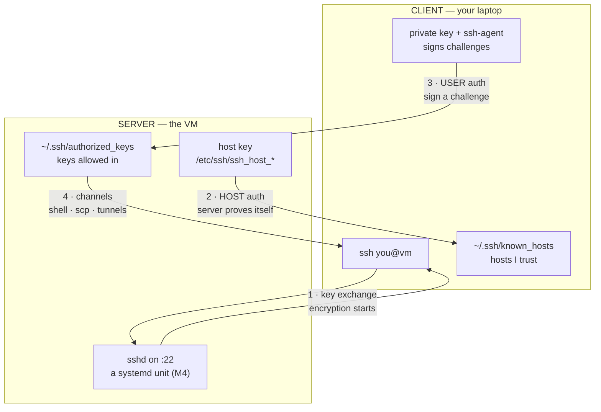

# Module 09 — SSH

<small>Stage 3 · Intermediate Skills · ~1 week at 4 h/day · Prerequisites — M4 (sshd is a systemd unit; the VM is the server; journal debugging), M7 (tmux — remote work's survival layer, the pairing this exists for), M8 (git@ remotes decoded), M3 (permissions SSH *enforces*).</small>

## Why this matters

**SSH** (Secure Shell) is a protocol — and **OpenSSH** its universal implementation — for operating
machines over an **untrusted network**. It authenticates *both* sides (host keys prove the **server**;
your keys prove **you**), encrypts everything after, and carries not just shells but files, Git, port
forwards, and any TCP stream.

Every server you will ever touch — cloud VMs, Kubernetes nodes, GPU boxes, the capstone's
infrastructure — is reached through SSH. This module is also **Stage 3's convergence point**: Vim edits
remotely (M6's promise), tmux sessions survive disconnects (M7's reason for existing), Git pushes over
SSH (M8's `git@github.com` decoded), and your dotfiles bootstrap any machine (M10 finishes it). After
this week, "remote" stops being a different world — "this machine" and "that machine" become one
workspace.

!!! info "What this unlocks"
    **M10** turns this week's manual dotfile-landing into one bootstrap command over SSH · **M11** runs
    Claude Code on remote repos · **M14** (Networking) makes you `tcpdump` your own handshake — port
    22/TCP stops being abstract, and TLS will *rhyme* with the two-auth model · **M15** Ansible is your
    `ssh host 'cmd'` loops industrialized, over nothing but sshd and the keys you built · **M16–M20**
    `docker context` over SSH, K8s nodes debugged over SSH, `kubectl port-forward` is `-L`'s cousin ·
    **M22/Capstone** GPU boxes reached, dashboards tunnelled (TensorBoard via `-L`) · **M24** deepens the
    hardening (fail2ban, certificates, audit). "Comfortable over SSH" is the sentence under half the job
    posts you'll read.

---

## Watch

*Watch once, then rely on the notes below — you should never need to rewatch.*

<div class="lo-video-placeholder" markdown="1">
<span class="lo-play">▶</span>
**Explainer video — coming**
<small>Record per <code>../media/README.md</code>, upload to YouTube, then replace this card with the embed.</small>
</div>

??? note "For the author — drop-in YouTube embed (replace VIDEO_ID)"
    Once the explainer is on YouTube, replace the placeholder card above with:
    ```html
    <div class="lo-video-embed">
      <iframe src="https://www.youtube-nocookie.com/embed/VIDEO_ID"
              title="Module 09 — SSH"
              allow="accelerometer; autoplay; clipboard-write; encrypted-media; gyroscope; picture-in-picture"
              allowfullscreen></iframe>
    </div>
    ```
    Video script beats (from the blueprint's Analogy / Visual Model / Misconceptions):
    the threat (sniffing/spoofing on a shared network) → the **two authentications in order** (host
    first — the wax-seal + face-recognition analogies) → why a *signature* beats a *secret* (nothing
    replayable crosses the wire) → the scary first-connect prompt is TOFU, not noise → the agent vs agent
    **forwarding** risk gap → the ten-minute hardening ritual (second session, `sshd -t`, key-only) as the
    closing argument.

**Terminal cast — pending; record per `../media/README.md`.**

!!! tip "Follow along, don't just watch"
    Open the [Guided Lab](#guided-lab-going-remote-on-one-machine) in a browser terminal and run each
    command yourself as it appears. Typing beats watching every time — and it is part of how the memory
    forms.

---

## Key Notes

*Standalone. This is the reference you keep.*

### The picture: the two authentications



Every SSH connection performs **two** authentications, in this order. **First the SERVER proves
itself** — it demonstrates it holds the private half of its *host key*, and your client checks that
against `~/.ssh/known_hosts` (the defense against connecting to an impostor). **Then you prove
yourself** — the server sends a challenge, your client *signs* it with your private key, and the server
verifies the signature against `~/.ssh/authorized_keys`. You must know **who** you're talking to before
proving who you are.

The single most important consequence: **public-key auth is a signature, not a secret you send.** Only a
signature over a server-chosen challenge crosses the wire — never the private key, never anything
replayable. A sniffer captures nothing reusable; a fake server gains no credential. That is why keys beat
passwords *even over a compromised path* (a password typed at a MITM'd prompt is simply stolen).

### The scary first-connect prompt — TOFU

The first time you connect, you get *"The authenticity of host … can't be established … Are you sure?"*
That is **TOFU — Trust On First Use**: you are **pinning** an unverified host key into `known_hosts`. It
accepts a window where an impostor could be pinned instead. Close that gap by verifying the fingerprint
**out-of-band** (the VM console, the cloud panel, GitHub's published list) *before* you type `yes`.

Later, a **changed** host key produces `WARNING: REMOTE HOST IDENTIFICATION HAS CHANGED`. Know which
warning is which — and what each means:

| Message | What happened | What to do |
|---|---|---|
| "authenticity … can't be established" | **First contact** — no pin yet (TOFU) | Verify the fingerprint out-of-band, *then* accept |
| "REMOTE HOST IDENTIFICATION HAS CHANGED" | The pinned key no longer matches | **STOP.** Rebuilt server *or* MITM. Verify out-of-band; `ssh-keygen -R host` only **after** verifying |

On a production box, treat a changed-key warning as an **incident until verified**. (GitHub's 2023 RSA
host-key rotation made millions see this warning at once — the system *worked*; that is what it is for.)

### Key geography — what lives where, and what it proves

The private key **is your identity.** Generate one **per device**, protect it with a passphrase, and
only ever copy the **public** half. Never copy a private key between machines.

| File | Side | Half | Proves | Perms |
|---|---|---|---|---|
| `~/.ssh/id_ed25519` | client | **private** | you, to a server (by signing) — never leaves | **600** |
| `~/.ssh/id_ed25519.pub` | client | public | — (travels freely) | 644 |
| `~/.ssh/known_hosts` | client | — | which host keys you trust (server → you) | 644 |
| `~/.ssh/authorized_keys` | server | public | which keys may log in **as this user** | 600 |
| `/etc/ssh/ssh_host_*_key` | server | private | the server's own identity, to you | 600 |
| `/etc/ssh/sshd_config` | server | — | the door policy | 644 |

OpenSSH **refuses** to use a private key with loose permissions (and `~/.ssh` must be `700`) — software-
enforced least privilege, exactly as M3 predicted. Modern keys are **Ed25519** (djb's curve, 2013);
prefer it over RSA.

| Key type | Verdict |
|---|---|
| **Ed25519** | The modern default — short, fast, strong. `ssh-keygen -t ed25519` |
| RSA (≥3072) | Still fine, larger and slower; needed only for very old servers |
| ECDSA / DSA | Avoid — ECDSA's curves are contested, DSA is dead |

### The agent — passphrase once, use all day

The **ssh-agent** holds your *decrypted* private keys in process memory and signs challenges for
clients on request. You type the passphrase **once per login session** (`ssh-add`), and every later
`ssh` is prompt-free. `ssh-add -l` lists what it holds.

**Agent *forwarding* (`-A`) is a different risk class.** It exports the agent's **socket** to the remote
host — anyone with root there can ask it to sign, **borrowing your identity** live, for everything your
key opens (GitHub included). The recurring compromise: dev `ssh -A`s into a shared box, attacker pivots.

- **Agent risk** = local compromise (bounded to your machine).
- **Forwarded-agent risk** = *every* box you forwarded to.

Default forwarding **off**; use **ProxyJump (`-J`)** instead — it routes *through* a bastion and **lends
nothing**.

### The config book — `~/.ssh/config`

`ssh vm` reads `~/.ssh/config` top-down, **first match wins per option**. Host aliases expand to the
facts of each machine — this is infrastructure-as-config for your connections (chezmoi manages it in
M10). Comment it like every config you own; it becomes the README of your infrastructure.

```text
Host vm
    HostName 203.0.113.10
    User you
    IdentityFile ~/.ssh/id_ed25519
    IdentitiesOnly yes
    AddKeysToAgent yes
```

| Field | Role |
|---|---|
| `Host vm` | the **alias** you type — `ssh vm` |
| `HostName` | the real address (IP or DNS name) |
| `User` | who to log in as (no more `you@`) |
| `IdentityFile` | which private key to offer |
| `IdentitiesOnly yes` | offer **only** this key — faster, quieter, avoids `MaxAuthTries` lockouts |
| `ProxyJump bastion` | hop through a bastion in one command |
| `ControlMaster` / `ControlPersist` | reuse one connection — instant repeat `ssh`/`scp` |

### The tunnel triple (+ the hop)

The encrypted transport **multiplexes channels**: your shell, `sftp`, and forwarded ports all ride one
TCP session. Any TCP app can ride SSH — the poor man's VPN, and the debugging superpower. The mnemonic
is baked into the flag:

| Flag | Reads as | Direction | One real use |
|---|---|---|---|
| `-L 8080:localhost:80` | **L**ocal — *bring it to me* | my `:8080` → tunnel → the server's view of `localhost:80` | reach a server-only web admin UI |
| `-R 9090:localhost:3000` | **R**emote — *expose mine there* | the server's `:9090` → tunnel → my `localhost:3000` | demo my local dev service from the server |
| `-D 1080` | **D**ynamic — *browse as the server* | a SOCKS proxy: my apps exit **from** the server | reach anything the server can reach |
| `-J bastion` | **J**ump | laptop → bastion → internal, one command | multi-hop **without lending the agent** |

A `-D` proxy makes the server your ISP — it sees your destinations and any plaintext payloads. Route
work traffic through work bastions; not personal browsing through prod.

### sshd is just a service — harden it with discipline

Server-side is M4 **verbatim**: `systemctl status ssh`, `journalctl -u ssh -f` (watch your own logins —
and, on an exposed box, the Internet's knocking). Put changes in a **drop-in** (`sshd_config.d/*.conf`,
the M4 vendor-file rule), never edit the vendor file blindly.

| Directive | Set to | Why |
|---|---|---|
| `PermitRootLogin` | `no` | root over SSH is a brute-force magnet |
| `PasswordAuthentication` | `no` | passwords are guessable/phishable/reusable — keys are none |
| `MaxAuthTries` | `3` | cut off credential-stuffing early |
| `AllowUsers` / `AllowGroups` | your user | least privilege on who may even try |

The ritual, every time — **and the golden rule: never change auth without a proven second way in.**

1. **Two sessions open** (one survives a bad restart) *plus* console/break-glass access.
2. `sudo sshd -t` — **syntax gate** before any restart.
3. `sudo systemctl restart ssh`.
4. **Positive test** (new key login works) *and* **negative test** (`ssh -o PubkeyAuthentication=no vm` →
   denied). `sudo sshd -T | grep -iE 'permitroot|password'` confirms the *effective* config.

The failure mode of an auth change is locking out the only person who can fix it. The lockout drill makes
that real, cheaply.

<div class="lo-remember" markdown="1">
**Must remember (if you keep only seven things):**

1. **Two authentications, in order:** the **server** proves itself (host key vs `known_hosts`), *then*
   **you** prove yourself (a signature vs `authorized_keys`).
2. **Key auth sends a signature, not a secret** — nothing replayable crosses the wire; that's why keys
   beat passwords even on a hostile network.
3. **The private key is your identity** — passphrase it, agent it, one per device; only the **public**
   half travels.
4. **The changed-host-key warning is the one you never ignore** — STOP, verify out-of-band, *then* act.
5. **Agent forwarding (`-A`) lends your identity to a remote root** — default off; use `ProxyJump (-J)`.
6. **Tunnels:** `-L` bring it **L**ocal · `-R` expose mine (**R**emote) · `-D` **D**ynamic SOCKS exit.
7. **Never change sshd auth without a proven second door** — two sessions + console; `sshd -t` before
   every restart; **tmux first** on any server (M7's law).
</div>

---

## Guided Lab: going remote on one machine

*Basic, step-by-step. You install a real SSH server, generate an Ed25519 key, log in **password-free**,
name the host in `~/.ssh/config`, and open a tunnel — all against `localhost`, so no second machine is
needed. Nothing here is destructive.*

<div class="lo-lab-actions" markdown="1">
[▶ Open interactive lab](https://killercoda.com/learning-os/course/killercoda/module-09){ .lo-btn target=_blank }
[⧉ Open in Codespaces](https://codespaces.new/randaguiac20/learning-os){ .lo-btn target=_blank }
[⌨ Run locally](#run-locally){ .lo-btn .lo-btn--ghost }
[View lab source](https://github.com/randaguiac20/learning-os/tree/main/killercoda/module-09){ .lo-btn .lo-btn--ghost target=_blank }
</div>

<span id="run-locally"></span>
!!! tip "Three ways to run this lab — pick any (all free)"
    - **Instant, no account** — click **Open interactive lab** (Killercoda): a Linux terminal in your browser.
    - **Your own cloud** — click **Open in Codespaces**: runs in your GitHub account's free tier (120 core-hrs/mo).
    - **Local, unlimited, $0** — any Linux / macOS / WSL terminal, or a throwaway container: `docker run -it ubuntu bash`, then follow the steps below.

    Killercoda is the zero-setup on-ramp; Codespaces and local use *your own* free resources, so they scale to any class size.

=== "1 · Bring the server up, meet its identity"
    ```bash
    apt-get update && apt-get install -y openssh-server   # sshd — a real SSH server
    service ssh start                                     # start the daemon (a service! M4)
    service ssh status                                    # confirm it's listening on :22
    ssh-keygen -l -f /etc/ssh/ssh_host_ed25519_key.pub    # the SERVER's fingerprint — note it
    ssh -o StrictHostKeyChecking=accept-new localhost true # first contact: HOST auth (TOFU) pins the key
    cat ~/.ssh/known_hosts                                # the pin you just recorded
    ```
    You just did **auth #1**: your client verified the server's host key and pinned it into
    `known_hosts`. In real life you'd compare that fingerprint out-of-band **before** trusting it.

=== "2 · Generate your Ed25519 identity"
    ```bash
    ssh-keygen -t ed25519 -C "you@lab-$(date +%Y%m)" -N "" -f ~/.ssh/id_ed25519
    ls -l ~/.ssh                     # note the perms: private 600, public 644, dir 700
    file ~/.ssh/id_ed25519 ~/.ssh/id_ed25519.pub   # private vs public — which one travels?
    ssh-keygen -l -f ~/.ssh/id_ed25519.pub         # YOUR fingerprint
    ```
    The `.pub` half travels; the private half **never leaves this machine**. (Here we use an empty
    passphrase so the lab flows — on a real key you'd set one and load it with `ssh-add`; see the note in
    the Solo Lab.)

=== "3 · Install the key, log in password-free"
    ```bash
    mkdir -p ~/.ssh && chmod 700 ~/.ssh
    cat ~/.ssh/id_ed25519.pub >> ~/.ssh/authorized_keys    # authorize YOUR key for this user
    chmod 600 ~/.ssh/authorized_keys
    ssh -o BatchMode=yes localhost 'whoami; hostname'      # BatchMode = keys only, no prompt
    ssh -v localhost true 2>&1 | grep -iE 'offering|accepted|authenticated'  # watch auth #2 happen
    ```
    That was **auth #2**: the server challenged, your key **signed**, and it matched a line in
    `authorized_keys`. `ssh-copy-id user@host` is the real-world tool that appends that line for you;
    here we did it by hand to see exactly what it writes.

=== "4 · Name the host in your config"
    ```bash
    cat >> ~/.ssh/config <<'EOF'
    Host mybox
        HostName 127.0.0.1
        User root
        IdentityFile ~/.ssh/id_ed25519
        IdentitiesOnly yes
    EOF
    chmod 600 ~/.ssh/config
    ssh -o StrictHostKeyChecking=accept-new mybox 'echo connected as $USER'   # ssh mybox — bare alias
    ```
    `ssh mybox` now carries the address, user, and key — nothing to remember or type. `IdentitiesOnly
    yes` offers **only** this key (faster, and it avoids `MaxAuthTries` lockouts when an agent holds many).

=== "5 · A tunnel, and watch the door"
    ```bash
    python3 -m http.server 8000 --bind 127.0.0.1 >/tmp/srv.log 2>&1 &   # a service only localhost sees
    ssh -f -N -L 8080:localhost:8000 mybox            # -L: bring the remote :8000 to my :8080
    curl -s localhost:8080 | head -3                  # the tunnelled page appears (bring it Local)
    journalctl -u ssh --no-pager | tail -5 2>/dev/null || grep -i sshd /var/log/auth.log | tail -5
    ```
    `-L 8080:localhost:8000` means *my* `:8080` delivers to the **server's** view of `localhost:8000`.
    The last line is the door log — every accepted and failed login is an observable event (on a real
    exposed box this list is never empty; that's where fail2ban earns its place, M24).

!!! success "You can stop here and have learned something real"
    If you can stand up sshd, generate a key, log in with **no password**, alias the host in
    `~/.ssh/config`, and open an `-L` tunnel — the guided lab is done. Now make it harder.

---

## Solo Lab: figure it out

*Harder. Goals only — minimal hand-holding. Keep working against `localhost`/`127.0.0.1`; a second user
created with `adduser` can stand in for "another machine". Struggle here is the point; reveal a hint only
after you've tried.*

### Challenge 1 — The Doorkeeper, from scratch
Create a **new** user (`adduser alice`), then — as that user — generate a labeled Ed25519 key, install it
into that user's `authorized_keys`, alias the host in *their* `~/.ssh/config`, and prove password-free
login. Then **inventory aloud**: which file is where, and what does each prove? ≤10 min.

??? tip "Hint"
    Keys are **per-user**: `authorized_keys` lives in the *target* user's home. Switch with `su - alice`.
    The private key must be `600` and `~/.ssh` `700`, or OpenSSH silently refuses it.

??? success "Solution"
    ```bash
    adduser --disabled-password --gecos "" alice
    su - alice -c 'ssh-keygen -t ed25519 -C "alice@lab" -N "" -f ~/.ssh/id_ed25519 \
      && install -d -m700 ~/.ssh \
      && cat ~/.ssh/id_ed25519.pub >> ~/.ssh/authorized_keys && chmod 600 ~/.ssh/authorized_keys'
    su - alice -c 'ssh -o BatchMode=yes -o StrictHostKeyChecking=accept-new localhost whoami'
    ```
    Inventory: `alice`'s **private** key proves *her* by signing; her `.pub` in *her* `authorized_keys`
    is what the server checks; the host key (in her `known_hosts` after first contact) proves the server
    to her. No file misplaced, perms right without fixing-after.

### Challenge 2 — A passphrase key + the agent
Regenerate your key **with** a passphrase, and make login prompt-free anyway by loading it into the
agent. Prove the agent holds it, then show what happens in a shell with **no** agent.

??? tip "Hint"
    `ssh-agent` prints the env vars a shell needs — `eval "$(ssh-agent -s)"` starts one for the current
    shell. `ssh-add` loads a key (passphrase once); `ssh-add -l` lists what's held.

??? success "Solution"
    ```bash
    ssh-keygen -t ed25519 -N 'correct horse' -f ~/.ssh/id_ed25519 -C "you@lab" <<<y   # overwrite
    cat ~/.ssh/id_ed25519.pub >> ~/.ssh/authorized_keys      # re-authorize the new key
    eval "$(ssh-agent -s)" && ssh-add ~/.ssh/id_ed25519       # passphrase ONCE
    ssh-add -l                                                # fingerprint held in memory
    ssh -o BatchMode=yes localhost true && echo "no prompt — the agent signed"
    env -u SSH_AUTH_SOCK ssh -o BatchMode=yes localhost true || echo "no agent -> would need the passphrase"
    ```
    The agent holds the **decrypted** key and signs on request — passphrase once per session. Strip
    `SSH_AUTH_SOCK` and the plumbing is gone: this is why cron jobs (no agent) need `BatchMode` + an
    explicit key.

### Challenge 3 — Harden the server, with the ritual
Turn passwords **off** and root login **off** via a drop-in, with full discipline: `sshd -t` before
restart, a second session held open, and **both** a positive and a negative test. Prove the effective
config.

??? warning "Keep a second terminal open"
    Never change auth policy without a proven second way in. In the lab your other pane *is* that door;
    on a real box it is the console. Run `sshd -t` **before** every restart.

??? success "Solution"
    ```bash
    cat > /etc/ssh/sshd_config.d/10-hardening.conf <<'EOF'
    PermitRootLogin prohibit-password
    PasswordAuthentication no
    MaxAuthTries 3
    EOF
    sshd -t && service ssh restart                              # syntax gate, THEN restart
    ssh -o BatchMode=yes localhost true && echo "key login: OK (positive test)"
    ssh -o PubkeyAuthentication=no -o PreferredAuthentications=password localhost true \
      2>&1 | grep -qi 'permission denied' && echo "passwords: DEAD (negative test)"
    sshd -T | grep -iE 'permitrootlogin|passwordauthentication|maxauthtries'
    ```
    `sshd -t` is the syntax gate; `sshd -T` dumps the **effective** config (defaults + drop-ins merged) —
    trust but verify. The negative test is the half people skip: proving passwords are *actually* refused.

### Challenge 4 — The lockout drill (break-glass)
Simulate the classic disaster **on purpose**: move your `authorized_keys` aside so a fresh key login is
refused, confirm the lockout, then recover — and write the one-line moral.

??? success "Solution"
    ```bash
    mv ~/.ssh/authorized_keys{,.bak}
    ssh -o BatchMode=yes localhost true || echo "LOCKED OUT: no key accepted (passwords are off too)"
    mv ~/.ssh/authorized_keys{.bak,}                 # recover — your 'console' is this same shell
    ssh -o BatchMode=yes localhost true && echo "recovered"
    ```
    Moral: **never change auth without a proven second door.** Here your still-open shell was the
    break-glass; on a real server that's the provider console. The failure mode of an auth change is
    locking out the one person who can fix it.

### Challenge 5 (stretch) — Agent forwarding vs ProxyJump, felt not memorized
Show that agent forwarding (`-A`) makes your agent reachable *from the remote box*, then show
`ProxyJump` giving the same multi-hop reach with **nothing lent**.

??? success "Solution"
    ```bash
    eval "$(ssh-agent -s)" && ssh-add ~/.ssh/id_ed25519
    ssh -A localhost 'ssh-add -l'                    # your agent, visible on the REMOTE side (-A)
    ssh -J localhost localhost 'echo hopped through the jump host, no agent lent'  # -J: route, don't lend
    ```
    With `-A`, root on that box could sign as you for as long as you're connected — the pivot-to-GitHub
    attack. `-J` tunnels the second hop *through* the first and exposes no agent: same reach, nothing to
    steal. Default `-A` off; reach for `-J`.

---

## Self-Check

*Close the notes. Answer aloud or in writing **first**, then reveal. Recalling — even when it's hard —
is what builds the memory.*

??? question "SSH performs two authentications per connection — name them, their order, and the file that anchors each."
    **Host authentication first:** the server proves it holds its host key; the client checks
    `~/.ssh/known_hosts` (defends against an impostor server). **Then user authentication:** the client
    signs a challenge with the private key; the server checks `~/.ssh/authorized_keys`. Order matters —
    you must know *who* you're talking to before proving who you are.

??? question "Why does public-key auth beat passwords even over a compromised network path?"
    Only a **signature over a server-chosen challenge** crosses the wire — never the private key, never
    a reusable secret. A sniffer captures nothing replayable; a fake server gains no credential. A
    password typed at a MITM'd prompt, by contrast, is simply stolen.

??? question "What is TOFU, what risk does it accept, and how do you close the gap when it matters?"
    **Trust On First Use:** the first connection pins an *unverified* host key — accepting a window where
    an impostor could be pinned instead. Close it by verifying the fingerprint **out-of-band**: the VM
    console, the provider panel, or a published list (e.g. GitHub's).

??? question "You see `REMOTE HOST IDENTIFICATION HAS CHANGED`. Two legitimate causes, the dangerous one, and the protocol?"
    Legitimate: the server was **reinstalled/rekeyed**, or the name now points at a different legitimate
    machine. Dangerous: **MITM**. Protocol: do **not** connect or blindly `ssh-keygen -R`; verify the new
    fingerprint out-of-band; *only then* remove the old entry and accept. On production, treat as an
    incident until verified.

??? question "Why is agent *forwarding* (`-A`) a different risk class than the agent itself — and the safer alternative?"
    The agent serves **your** machine; forwarding exports its **socket** to the **remote** host, so
    anyone with root there can request signatures — borrowing your identity live, for every box your key
    opens. The agent's risk is local; a forwarded agent's risk is *every* host you forwarded to. Use
    **ProxyJump (`-J`)** — it routes through and lends nothing.

??? question "You get `Permission denied (publickey)`. Give an ordered checklist with the evidence for each."
    (1) `ssh-add -l` — is the right key in the agent? (2) `ssh -v` — was it **offered**, and what did the
    server answer? (3) server `journalctl -u ssh` — the *real* reason (perms, bad line). (4)
    `authorized_keys` intact, one line, in the **right** user's home? (5) perms — `~/.ssh` 700, key 600,
    `$HOME` not group-writable (server refuses silently otherwise). (6) config — `IdentityFile` /
    `IdentitiesOnly` pointing at the right key?

??? question "Why must the private key be 600 and `~/.ssh` 700 — and what does OpenSSH do if not?"
    The private key **is** the identity: group/world-readable means anyone local can *be* you; a writable
    `~/.ssh` lets others add *their* key to your `authorized_keys`. OpenSSH **refuses** permissive files
    (silent key-skip; the journal/`-v` notes it) — software-enforced least privilege, exactly as M3 taught.

??? question "`sshd -t` vs `sshd -T` — what does each do and where does it belong?"
    `sshd -t`: **syntax/validity check** — run **before every restart**. `sshd -T`: dump the
    **effective** config (all defaults resolved, drop-ins merged) — run **after** changes to confirm
    what's actually live, and when debugging "but I set that!".

!!! example "Teach it back (the real test)"
    Out loud, in **4 minutes, no notes**: *"How is it safe to administer a server across the open
    Internet?"* — you must land the threat (sniffing/spoofing), the **two authentications in order (host
    first!)**, why a *signature* beats a *secret*, and the operational layer (agent, config, tmux-first);
    the **wax-seal** analogy must appear and then yield to mechanism. Then, in **90 seconds**, teach *"how
    does the computer know it's really you without you ever sending a password?"* to a beginner — the
    **signet-ring** story required (you never mail the ring; the bank sends fresh wax, you stamp it, they
    compare the imprint on file), jargon last. If you can't yet, reread the Key Notes, don't move on.

---

## Mastery checklist

*Tick these honestly, cold (no notes). They **gate** progress. A module is only "done" when every box is
true.*

- [ ] **Explain** the two authentications in order and *what crosses the wire*, flawlessly.
- [ ] **Define** 15 random terms cold (TOFU, host key, agent, ProxyJump, ControlMaster, BatchMode, SOCKS, drop-in, IdentitiesOnly…).
- [ ] **Draw** all four blanks: the two-auth handshake (four key files placed), key geography, the tunnel triple, and your own `~/.ssh/config`.
- [ ] **Build** the Doorkeeper: a clean-user identity chain (keygen → install → config → agent → password-free login) in ≤10 min, perms right without fixing-after.
- [ ] **Configure** the client config-book live — aliases, `IdentitiesOnly`, a jump block — and own every line.
- [ ] **Administer** the Gatekeeper: hardening with the full ritual (second session, `sshd -t`, restart, **positive *and* negative** test, `sshd -T` confirmation), ≤12 min.
- [ ] **Secure:** rank blast radius (passphrase-less key stolen › forwarded agent on a compromised host › leaked `authorized_keys` ≥ leaked `known_hosts`); demonstrate `-A` vs `-J`; author a hardening checklist.
- [ ] **Tunnel:** produce `-L`/`-R`/`-D`/`-J` for five dictated scenarios, right direction first try, each **proven** with `curl`/`ss`.
- [ ] **Troubleshoot** the gauntlet: 4 of 5 incidents clean (permission-denied, changed-key, frozen session `~.`, cron-ssh-fails, the lockout) — `-v` and the journal *before* theories.
- [ ] **Automate** a `BatchMode` remote health check and a `vm-up.sh` (wait-for-sshd → attach) with honest exit codes (M5).
- [ ] **Optimize:** measure ControlMaster cold-vs-warm; test `-C` compression honestly; reach any host in ≤6 keystrokes.
- [ ] **Scale/Design:** argue the keys-vs-certificates threshold and sketch team/fleet access (bastion, per-device keys, revocation story) cold.
- [ ] **Self-serve:** learn ≥3 things from the OpenSSH man pages alone (a config option, an escape sequence, an `ssh-keygen` capability), and score ≥80% on the validation bank.
- [ ] **Teach:** pass the teach-back above (the two-authentications explanation is mandatory; host-auth-first is the trap everyone drops).

---

## Review — lock it in

Spaced repetition is not optional; it's where the memory actually forms. Interleaving stays active —
every M9 review also pulls in one **prior-module** item (M7's tmux and M8's Git are the pairings this
converges). Schedule these and *keep* them:

| When | Do | Interleaved prior-module item |
|---|---|---|
| **Day 1** | Flashcards · tunnel-triple sprint · validation B5–B7 (changed-key, denied, `-A` risk) | M8 flashcards you missed |
| **Day 3** | Cold hardening recipe typed against a fresh sshd — full ritual, negative test included | M7: tmux builder sprint |
| **Day 7** | Denied-checklist drill on a planted fault · the perms/blast-radius questions (H19–H21) | M8: `git bisect` drill |
| **Day 14** | Tunnel triple rebuilt from memory against live services · config audit (own every line still?) | M6: Vim keystroke audit |
| **Day 30** | Full key-hygiene audit (agent / authorized_keys / config — one table, no orphans) · re-read your hardening checklist vs reality | M5: script audit |

**Connects forward to:** Chezmoi + Mise (M10 — the manual dotfile-landing becomes one bootstrap command
over SSH) · Claude Code (M11 — agent workflows over your own infrastructure) · Networking (M14 —
`tcpdump` your handshake; refused-vs-timed-out becomes layer knowledge; TLS rhymes with the two-auth
model) · Automation (M15 — Ansible is your `ssh` loops industrialized over the exact transport and keys) ·
Docker/Kubernetes (M16–M20 — `docker context` and node debugging over SSH; `kubectl port-forward` is
`-L`'s cousin) · Security (M24 — fail2ban, certificates, audit, bastions at enterprise scale).

!!! quote "The one-sentence takeaway"
    M9 makes the network disappear: with keys, config, tmux, and Git converging over SSH, "this machine"
    and "that machine" become one workspace — the property every remaining stage silently assumes.
