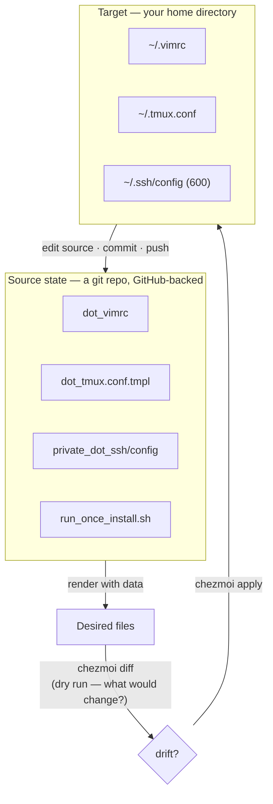
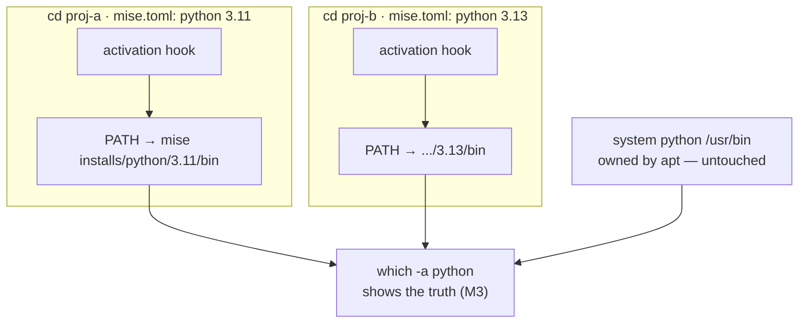

# Module 10 — Dotfiles & Toolchains

<small>Stage 3 · Intermediate Skills · ~½ week at 4 h/day · Prerequisites — M8 (chezmoi's source *is* a git repo), M9 (bootstrap clones over SSH; ssh config becomes a managed file), M6/M7 (the vimrc and tmux.conf being unified), M5 (run_ scripts to standard), M3 (PATH, permissions, the system-vs-user boundary).</small>

## Why this matters

**chezmoi** is a dotfile manager: it keeps the *source of truth* for your config files in a Git repo and
computes each machine's actual files from it — with **templates** for the differences. **mise** is a
polyglot toolchain manager: it installs and auto-switches versions of runtimes and tools (Python, Node,
kubectl, a thousand more) *per directory*, from a checked-in `mise.toml`. Together they turn "my setup"
from accumulated luck into versioned, tested infrastructure.

Stage 3 built four precious artifacts — vimrc (M6), tmux.conf (M7), ssh config (M9), gitconfig (M8) —
plus scripts, all currently hand-copied (you felt that friction in M9 and journaled "M10 fixes this").
This module makes any machine yours in **one command**, and makes "works on my machine" a solved problem
for **tools** before M13 makes it matter for code. The half-week size is honest: these are small tools
that leverage everything you already know — Git, SSH, templates-as-code.

!!! info "What this unlocks"
    **M11** (Claude Code) runs *inside* the environment you codify here — its `CLAUDE.md` and settings
    ride the same repo · **M13** layers venvs on top of mise's interpreter pinning (the three-layer
    Python story completes) · **M15** (Ansible) is this exact reconcile idea at *fleet* scope · **M18**
    (devcontainers) is the team version of your personal dotfiles · **M19** (GitOps) reconciles cluster
    state from git — the same kernel idea you first meet as `chezmoi apply`, at maximum blast radius.

---

## Watch

*Watch once, then rely on the notes below — you should never need to rewatch.*

<div class="lo-video-placeholder" markdown="1">
<span class="lo-play">▶</span>
**Explainer video — coming**
<small>Record per <code>../media/README.md</code>, upload to YouTube, then replace this card with the embed.</small>
</div>

??? note "For the author — drop-in YouTube embed (replace VIDEO_ID)"
    Once the explainer is on YouTube, replace the placeholder card above with:
    ```html
    <div class="lo-video-embed">
      <iframe src="https://www.youtube-nocookie.com/embed/VIDEO_ID"
              title="Module 10 — Dotfiles & Toolchains"
              allow="accelerometer; autoplay; clipboard-write; encrypted-media; gyroscope; picture-in-picture"
              allowfullscreen></iframe>
    </div>
    ```
    Video script beats (from the blueprint's Analogy / Visual Model / Misconceptions):
    the drift problem (which machine has the *good* vimrc?) → source-of-truth + reconcile, the
    sheet-music analogy (one score, every orchestra plays it) → `diff` before `apply`, always →
    attributes-in-filenames (`private_` carries mode 600 that Git can't) → one `.tmpl` renders the
    laptop *and* the server flavor → mise's PATH surgery per `cd`, system Python untouched → the two
    laws: test the bootstrap like a backup (M4), never `init --apply` a stranger's repo unread.

**Terminal cast — pending; record per `../media/README.md`.**

!!! tip "Follow along, don't just watch"
    Open the [Guided Lab](#guided-lab-adopt-your-dotfiles) in a browser terminal and run each command
    yourself as it appears. Typing beats watching every time — and it is part of how the memory forms.

---

## Key Notes

*Standalone. This is the reference you keep.*

### The picture: the reconcile loop

chezmoi never "syncs" — it **reconciles**. One direction of truth (source → target); it renders your
desired files from the source repo plus data, diffs them against reality, and applies the delta. You
declare **what**; it handles **how** — the exact model behind systemd units (M4) and Kubernetes
manifests (M19).



The daily loop is one path through this picture: **edit the source → `chezmoi diff` → `apply` → commit →
push**. Edit a *target* by mistake and the next `diff` will try to "revert" it — that is drift, and it
tells you which direction the truth flows.

### Filename attributes — metadata carried in the name

chezmoi encodes each file's metadata in its **source filename**, versioned right alongside the content —
no post-apply `chmod` scripts:

| Prefix / suffix on the source file | Renders as | Why it matters |
|---|---|---|
| `dot_vimrc` | `~/.vimrc` (leading dot) | Git-safe names; the dot is restored on apply |
| `private_dot_ssh/config` | `~/.ssh/config`, **mode 600** | Git stores only `+x`, never `600` — `private_` closes exactly the gap M3 says matters |
| `executable_workstation.sh` | `~/workstation.sh`, **+x** | The execute bit, declared |
| `dot_tmux.conf.tmpl` | `~/.tmux.conf`, **rendered** | Passed through the Go template engine first |
| `run_once_install.sh` | *executed once ever* | Setup automation carried *with* the dotfiles |

### Templates — one source, many machines

A template renders **differences** from **data**. Data is prompted once at init (via
`.chezmoi.toml.tmpl`) or read from built-ins (`chezmoi data` shows hostname, os, arch…). One
`dot_tmux.conf.tmpl` renders the laptop flavor *and* the server flavor — your M6/M7 server-profile files
stop being separate copies:

```text
dot_vimrc.tmpl
  {{ if eq .role "server" }}   → minimal render   (the VM)
  {{ else }}                   → full render      (the laptop)
  {{ end }}
data ← .chezmoi.toml.tmpl (prompted at init: role, name, email…)
```

The rule is **restraint**: template only the *real* differences, keep conditionals few and commented. A
vimrc template nobody understands fails the stranger test harder than two honest files would.

### mise — the toolchain, switched per directory

mise reads a `mise.toml` in (or above) your working directory and rewrites `PATH` **once per `cd`** via a
shell activation hook — no per-command shim tax (asdf's old pain). `which -a python` always shows the
truth; the system's Python stays exactly where `apt` put it.



The three layers never fight — each owns one thing:

| Layer | Owns | Example |
|---|---|---|
| **system Python** | the OS's own tools | `apt`'s `/usr/bin/python3` — never yours to swap (M3) |
| **mise** | which *interpreter version* a directory sees | `python@3.11` here, `python@3.13` there |
| **venv** (M13) | which *packages* a project sees | `pip install` isolated atop whichever interpreter |

### The scope boundary — what goes where

Not everything belongs to chezmoi. The judgment that separates an engineer from a folder-keeper:

| Artifact | Managed by | Why |
|---|---|---|
| vimrc, tmux.conf, ssh config, gitconfig | **chezmoi** (environment) | personal config, versioned + templated |
| a project's `mise.toml`, `.env`, source | **project repo** (M8) | belongs *with* the project, not your home |
| `sshd_config`, machine/fleet config | **system** (apt / M15 Ansible) | machine policy, not personal environment |
| a per-project runtime (`python@3.11`) | **mise** | pinned in the project's `mise.toml` |
| a secret token, a colleague's cool vimrc | **nowhere** (as-is) | secrets never in the repo; strangers' repos run *their* code on apply |

<div class="lo-remember" markdown="1">
**Must remember (if you keep only six things):**

1. **chezmoi reconciles, it doesn't sync** — one direction of truth (source → target); edit the SOURCE, never the target.
2. **The daily loop is law:** edit source → `chezmoi diff` → `apply` → commit → push. Diff before apply, *always* (M4's habit).
3. **Attributes live in filenames:** `dot_` → leading dot · `private_` → mode 600 (the gap Git can't fill) · `.tmpl` → template.
4. **Templates declare differences, not copies** — one `.tmpl`, data-driven, renders laptop *and* server. Template only *real* differences.
5. **Three Python layers, no conflict:** system (apt, untouched) · mise (interpreter version) · venv (packages, M13). `which -a` reads the truth.
6. **Two laws:** an untested bootstrap is a *hope* (test it like a backup, M4); never `init --apply` a stranger's repo unread — `run_` scripts execute as you.
</div>

---

## Guided Lab: adopt your dotfiles

*Basic, step-by-step. You install chezmoi + mise, put a real dotfile under management, drill the
edit → diff → apply loop, and pin a project's runtime. Everything happens in a throwaway home you can
reset — nothing outside the lab is touched.*

<div class="lo-lab-actions" markdown="1">
[▶ Open interactive lab](https://killercoda.com/learning-os/course/killercoda/module-10){ .lo-btn target=_blank }
[⧉ Open in Codespaces](https://codespaces.new/randaguiac20/learning-os){ .lo-btn target=_blank }
[⌨ Run locally](#run-locally){ .lo-btn .lo-btn--ghost }
[View lab source](https://github.com/randaguiac20/learning-os/tree/main/killercoda/module-10){ .lo-btn .lo-btn--ghost target=_blank }
</div>

<span id="run-locally"></span>
!!! tip "Three ways to run this lab — pick any (all free)"
    - **Instant, no account** — click **Open interactive lab** (Killercoda): a Linux terminal in your browser.
    - **Your own cloud** — click **Open in Codespaces**: runs in your GitHub account's free tier (120 core-hrs/mo).
    - **Local, unlimited, $0** — any Linux / macOS / WSL terminal, or a throwaway container: `docker run -it ubuntu bash`, then follow the steps below.

    Killercoda is the zero-setup on-ramp; Codespaces and local use *your own* free resources, so they scale to any class size.

=== "1 · Install the managers"
    ```bash
    sh -c "$(curl -fsLS get.chezmoi.io)" -- -b /usr/local/bin   # single Go binary
    chezmoi --version
    curl -fsSL https://mise.run | sh                            # mise → ~/.local/bin
    export PATH="$HOME/.local/bin:$PATH"
    eval "$(mise activate bash)"                                # the activation hook, for this shell
    mise --version
    ```
    Both are single binaries — no runtime, no plugins to bootstrap. `chezmoi doctor` and `mise doctor`
    both ship real diagnostics; run each once while healthy so you recognise *sick* later.

=== "2 · Put a real dotfile under management"
    ```bash
    chezmoi init                          # creates the source repo at ~/.local/share/chezmoi
    printf 'set number\n' > ~/.vimrc      # a real dotfile in your home
    chezmoi add ~/.vimrc                  # copy it INTO the source state
    ls -la "$(chezmoi source-path)"       # look: it became dot_vimrc — the attribute, live
    chezmoi managed                       # the inventory begins
    ```
    `chezmoi add` reads the *target* and writes the *source* — note the `dot_` prefix chezmoi chose. This
    source directory is a git repo; in real life you `git remote add` your dotfiles repo and push (M8).

=== "3 · Drill the loop (edit source → diff → apply)"
    ```bash
    echo 'syntax on' >> "$(chezmoi source-path)/dot_vimrc"   # edit the SOURCE, never ~/.vimrc
    chezmoi diff                                             # READ it — what would change?
    chezmoi apply                                            # reconcile the target to source
    cat ~/.vimrc                                             # both lines present now
    ```
    Now the anti-pattern **on purpose** — edit the *target* and watch chezmoi want to revert it:
    ```bash
    echo 'set ruler' >> ~/.vimrc     # editing the TARGET (the wrong way)
    chezmoi diff                     # chezmoi wants to UNDO your edit — that's drift
    chezmoi add ~/.vimrc             # accept it upstream instead (one legitimate exit)
    ```
    Two legitimate exits from drift: `chezmoi add` (accept the target change into source) or `chezmoi
    apply` (discard it, source wins). The process fix is `chezmoi edit` next time.

=== "4 · Enforce a mode with private_"
    ```bash
    mkdir -p ~/.ssh && printf 'Host *\n    ServerAliveInterval 60\n' > ~/.ssh/config
    chmod 600 ~/.ssh/config
    chezmoi add ~/.ssh/config              # source becomes private_… (mode carried in the name)
    ls -la "$(chezmoi source-path)"        # see the private_ prefix
    stat -c '%a %n' ~/.ssh/config          # applied mode is 600 — attribute → mode (M3 payoff)
    ```
    Git can store `+x` but never `600`; `private_` closes exactly that gap. On any future machine the ssh
    config lands at 600 automatically — you can't forget it.

=== "5 · Pin a project's runtime with mise"
    ```bash
    mkdir -p ~/dotfiles-lab/mise-demo && cd ~/dotfiles-lab/mise-demo
    cat > mise.toml <<'EOF'
    [tools]
    python = "3.11"
    node = "22"
    EOF
    mise ls                    # what mise sees for this directory (installs on first use)
    which -a python            # the M3 truth-reader — mise's path first, system's untouched
    ```
    This `mise.toml` **is** the reproducibility contract for M12+ projects: a teammate runs `mise install`
    and gets identical tools. Note the boundary — the curriculum's own `.venv` stays as-is; mise pins the
    *interpreter*, venvs isolate *packages* (M13 formalises the layering).

!!! success "You can stop here and have learned something real"
    If you can put a dotfile under management, drill the edit → diff → apply loop, resolve drift both
    directions, enforce a mode with `private_`, and pin a project runtime — the guided lab is done. Now
    make it harder.

---

## Solo Lab: figure it out

*Harder. Goals only — minimal hand-holding. Work in the lab home you can reset. Struggle here is the
point; reveal a hint only after you've tried.*

### Challenge 1 — Template a real machine difference
Turn a single setting into a role-branched template: on a **server** tmux gets *no* mouse mode; on a
**laptop** it stays on. Prove the render in isolation *before* you apply.

??? tip "Hint"
    Add `role` to `.chezmoi.toml.tmpl` as prompted data, then branch with `{{ if eq .role "server" }}`.
    `chezmoi execute-template` renders a snippet against the current data without touching any file.

??? success "Solution"
    ```bash
    # .chezmoi.toml.tmpl (prompts once at init):
    #   [data]
    #   role = {{ promptString "role" | quote }}
    chezmoi execute-template '{{ if eq .role "server" }}set -g mouse off{{ else }}set -g mouse on{{ end }}'
    ```
    `execute-template` proves the *logic* against real data before any apply — data before logic is how
    you debug templates (most "template bugs" are data surprises).

### Challenge 2 — Auto-detect instead of prompting
Add a difference that needs **no prompt**: enable a setting only on machines that have `systemd`. Justify
auto-detect vs a prompt.

??? tip "Hint"
    chezmoi templates can call `lookPath`. Facts the machine *knows* (os, arch, hostname, whether a binary
    exists) should be detected, not asked — you can't answer them wrong.

??? success "Solution"
    ```bash
    chezmoi execute-template '{{ if lookPath "systemctl" }}# systemd present{{ else }}# no systemd{{ end }}'
    ```
    Prompt for facts the machine can't know (role, work-vs-personal email); **detect** facts it does
    (`os`, `arch`, `lookPath` results) — zero friction, impossible to answer wrong.

### Challenge 3 — Prove asdf compatibility
Write a `.tool-versions` file by hand (asdf's format) and confirm mise reads it natively — no conversion.

??? success "Solution"
    ```bash
    mkdir -p ~/dotfiles-lab/asdf-demo && cd ~/dotfiles-lab/asdf-demo
    printf 'python 3.11.9\nnode 22.0.0\n' > .tool-versions
    mise ls          # mise picks the versions straight from .tool-versions
    ```
    Interface compatibility (reading asdf's registry *and* `.tool-versions`) is exactly how a better
    implementation won adoption *without* an ecosystem reset — the tmux-over-screen story (M7) again.

### Challenge 4 — A run_once script that rides along
Add a `run_once_` script to the source that installs a baseline tool the first time chezmoi applies, and
prove it runs exactly once. What makes it "the highest-privilege code you own"?

??? tip "Hint"
    Name it `run_once_install-baseline.sh` in the source. Apply, watch it fire; apply again, watch silence.
    Idempotency is not optional — applies re-run normally, on every future machine.

??? success "Solution"
    ```bash
    cat > "$(chezmoi source-path)/run_once_install-baseline.sh" <<'EOF'
    #!/bin/bash
    set -euo pipefail
    command -v shellcheck >/dev/null || echo "would install shellcheck (idempotent guard)"
    EOF
    chezmoi apply    # script fires once (hash recorded in chezmoi state)
    chezmoi apply    # silence — once means once
    ```
    It runs **automatically on every machine you ever bootstrap**, as you — a sloppy or compromised
    script propagates everywhere you go. Hence M5-standard, idempotent, and audited like any installer.

### Challenge 5 (stretch) — The scope-boundary rapid fire
For each of these, state in one breath *where it's managed and why*: `sshd_config`, a project's `.env`,
your prompt config, `kubectl`, a work-only alias, the curriculum's `.venv`, a secret token, a colleague's
vimrc you admire.

??? success "Solution"
    `sshd_config` → **system** (machine policy, M4 drop-ins; fleet = M15 — never chezmoi) · project `.env`
    → **project repo**, and secrets *out* of it · prompt config → **chezmoi** (personal environment) ·
    `kubectl` → **mise** (pinned per cluster-repo) · work-only alias → **chezmoi template** (role branch)
    · curriculum `.venv` → **as-is** (project rule; mise pins the interpreter, venv the packages) · secret
    token → **nowhere in the repo** (agent/manager/age if it must travel) · colleague's vimrc → **read it,
    adopt pieces into YOUR source** — never `init --apply` their repo (their `run_` scripts are their
    code).

---

## Self-Check

*Close the notes. Answer aloud or in writing **first**, then reveal. Recalling — even when it's hard — is
what builds the memory.*

??? question "Source state vs target state — what is each, and what do `diff` and `apply` do between them?"
    **Source** is the repo's declarative truth (files + attributes + templates); **target** is your actual
    home files. `chezmoi diff` computes the desired-vs-actual delta (a dry run); `apply` reconciles the
    target *to* the desired. Direction matters: source wins unless you deliberately `add` a target change
    upstream.

??? question "How do the filename attributes work, and what gap does `private_` close that Git alone can't?"
    Metadata is encoded in the source **name**, versioned with content: `dot_` → leading dot; `private_` →
    mode **600** on apply; `executable_` → `+x`; `.tmpl` → rendered through the template engine. Git tracks
    only `+x`, never `600` — `private_` closes exactly that gap (the ssh-config case M3 warned about).

??? question "You edited `~/.tmux.conf` directly and `chezmoi diff` now wants to 'undo' it. What happened, and your two legitimate exits?"
    You edited the **target**; the source still holds the old truth, so reconcile wants to enforce it.
    Exits: `chezmoi add` (accept the target change into the source, then commit/push) **or** `chezmoi
    apply` (discard the local edit — source wins). Process fix: use `chezmoi edit` next time.

??? question "mise vs venv vs system Python — what does each own, and how do they stack without conflict?"
    **System** Python is apt's, owned by the OS for OS tools (never yours to swap). **mise** picks which
    *interpreter version* a directory sees (per-project pins). **venv** isolates which *packages* a project
    sees, atop whichever interpreter (M13). Stack: system untouched → mise selects 3.11 vs 3.13 → venv
    isolates deps on top. `which -a python` shows the whole stack.

??? question "'mise isn't switching versions' — the three-step diagnosis, with commands?"
    (1) `mise doctor` — is activation on, config found? (2) Is the hook actually in *this* shell —
    `type mise`, and did chezmoi apply the activation line to `.bashrc`? (3) `echo $PATH` + `which -a
    python` — is something earlier shadowing it (a venv, an alias)? Data/PATH truth over guesses (M3).

??? question "Why must `run_` scripts be idempotent, and what makes them 'the highest-privilege code you own'?"
    Applies re-run *normally* — every machine, every drift-fix — so a non-idempotent script fails or
    duplicates on run 2. They execute **automatically on every future machine you own, forever**, as you;
    a compromised or sloppy one propagates everywhere. Hence M5-standard and audited like an installer.

??? question "Why is `init --apply` on a stranger's repo equivalent to running their code?"
    `run_` scripts and hooks execute on apply *with your privileges*, and templates can write data into
    rendered files. Applying a repo you haven't read is executing code you haven't audited (case study:
    dotfiles repos have shipped credential-stealers). Rule: read the scripts first — fork, audit, adopt
    pieces into *your* source.

!!! example "Teach it back (the real test)"
    Out loud, in **4 minutes, no notes**: *"What does it mean that your environment is 'code', and what
    does that buy you?"* — the drift problem, source-of-truth + reconcile (`diff`/`apply`), templates for
    differences, pinned toolchains, and the proof standard (bootstrap tested like a backup — M4's law).
    The sheet-music analogy must appear **and then yield to mechanism**. Then, in **90 seconds**, teach
    *"why does it take some people a week to set up a new computer, and you two minutes?"* — the
    recipe-vs-leftovers story, no jargon until the last sentence. If you can't yet, that's your signal to
    reread the Key Notes, not to move on.

---

## Mastery checklist

*Tick these honestly, cold (no notes). They **gate** progress — a module is only "done" when every box is
true. Passing M10 ships the **Portable Workstation** and closes Stage 3's tooling loop.*

- [ ] **Explain** the reconcile model (direction of truth!) + template data flow + the mise/venv/system layering, flawless.
- [ ] **Draw** all three from memory: the reconcile loop (with git edges + the daily path), template branching, and mise switching.
- [ ] **Configure** `.chezmoi.toml.tmpl` (role prompt + sensible default) and mise global vs project config, every choice explained.
- [ ] **Develop** the M6/M7 server profiles UNIFIED as one template, no-regression proven (empty diff on the laptop role).
- [ ] **Automate** a `run_once` and a `run_onchange` script, both idempotent and M5-standard (shellcheck-clean).
- [ ] **Secure:** `private_`→600 verified live; a written secrets policy; the strangers'-repo + run_-scripts-as-code rules articulated.
- [ ] **Troubleshoot** the three planted faults (missing template data, lost activation hook, non-idempotent script) each with a stated method.
- [ ] **Debug** with data-before-logic isolation (`chezmoi data` → `chezmoi execute-template`) and a PATH truth-read for mise.
- [ ] **Deploy** THE BOOTSTRAP: a clean, timed run on a reset VM; both roles render correctly; tag `v1.0`.
- [ ] **Optimize:** bootstrap timed, profiled, and meaningfully cut — before/after numbers, not impressions.
- [ ] **Design:** ≥8/10 scope-boundary placements (chezmoi / project / system / mise / nowhere) with clean reasoning, incl. the secret and colleague's-vimrc traps.
- [ ] **Self-serve:** ≥3 things learned from chezmoi.io / mise.jdx.dev docs alone (a template function, an attribute, a mise setting), and ≥80% on the validation bank.
- [ ] **Teach:** pass the teach-back above (reconcile-not-sync mandatory).

---

## Review — lock it in

Spaced repetition is not optional; it's where the memory actually forms. Interleaving stays active — every
M10 review also pulls in one **Module 09** (SSH) item, since the bootstrap clones over SSH and ssh config
is now a managed file. Schedule these and *keep* them:

| When | Do | Interleaved M9 item |
|---|---|---|
| **Day 1** | Flashcards · the loop sprint (five commands, 20 s) · attribute + truth sprints · validation A1–A3 | M9 handshake sprint — the key-exchange steps in order |
| **Day 3** | Add a small real difference via `.tmpl` cold · `execute-template` proof · validation D11–D12 | M9 tunnel sprint — local vs remote forward drawn |
| **Day 7** | Drift drill: plant + resolve both directions (`add` vs `apply`) · the security questions | M9 denied-connection checklist from memory |
| **Day 14** | Scope-boundary table redrawn from memory · `env-status.sh` review | M9 ssh config block cold (Host/User/IdentityFile) |
| **Day 30** | **BOOTSTRAP RE-TEST on a reset VM** (timed vs baseline) · managed-inventory audit | M9 break-glass: recover access with keys lost |

**Connects forward to:** Claude Code (M11 — its `CLAUDE.md` and settings ride the same repo) · venvs
(M13 — package isolation layered on mise's interpreter pinning) · Ansible (M15 — reconcile-from-git at
*machine/fleet* scope) · devcontainers (M18 — the team version of your personal dotfiles) · GitOps
(M19 — cluster state reconciled from git, the same kernel idea at maximum blast radius).

!!! quote "The one-sentence takeaway"
    M10 closes Stage 3's loop: the tools you spent five modules mastering now install, configure, and
    prove themselves from one command — "my setup" becomes versioned, tested infrastructure every
    remaining module (and machine) inherits for free.
