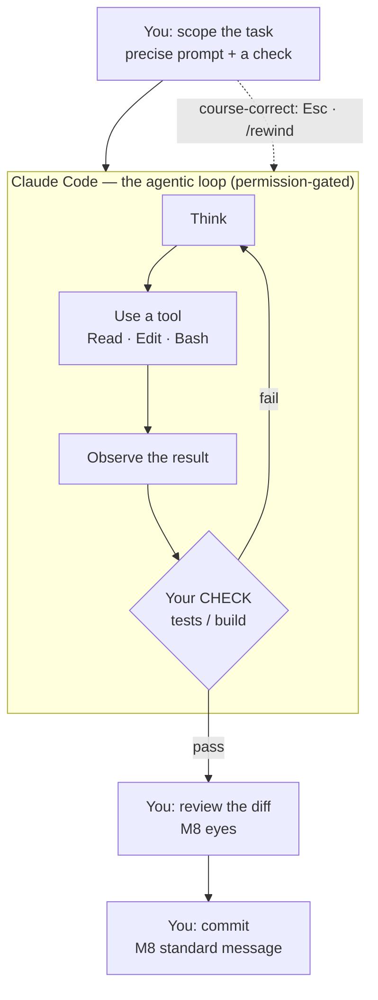

# Module 11 — Claude Code

<small>Stage 3 · Intermediate Skills · ~1 week at 4 h/day · Prerequisite — Module 08 (Git — the diff-reading that becomes your review discipline). This module closes Stage 3.</small>

## Why this matters

**Claude Code** is an *agentic* coding tool: an AI (Claude) that reads your codebase, edits files, runs
commands, and works through multi-step tasks **in your terminal** — while you scope the work, watch or
step away, review the diffs, and decide what ships. It is not autocomplete and not a chat window; it is
a junior engineer you **direct**.

Two things braid together here. As a **tool**, Claude Code multiplies your output on real work —
exploration, refactors, tests, debugging — and every later module assumes you can direct it well. As a
**discipline**, working safely with an AI engineer needs exactly the skills Stage 3 built: Git
diff-reading (M8), atomic commits, verification habits. This module turns them into a review workflow.
One rule stands above all for a **learner**: *the AI accelerates your work; it must never do your
learning* — the gates in every module test **you**, unassisted.

!!! info "What this unlocks"
    From here to the capstone you work as **director and engineer-of-record** of a tireless junior. M12–M13
    learn to program *with* an explainer on tap (roles deliberately inverted as pedagogy) · M15 puts
    headless runs + verification gates into CI · M23 makes it your debugging partner · M29 (the sequel)
    builds the full agentic layer — hooks, MCP, subagent orchestration, the SDK — **on whatever discipline
    survives this week.** The directing skills (scope · context · verify · review) transfer to *every*
    agent tool, which is why they, not the tool, are the real content.

---

## Watch

*Watch once, then rely on the notes below — you should never need to rewatch.*

<div class="lo-video-placeholder" markdown="1">
<span class="lo-play">▶</span>
**Explainer video — coming**
<small>Record per <code>../media/README.md</code>, upload to YouTube, then replace this card with the embed.</small>
</div>

??? note "For the author — drop-in YouTube embed (replace VIDEO_ID)"
    Once the explainer is on YouTube, replace the placeholder card above with:
    ```html
    <div class="lo-video-embed">
      <iframe src="https://www.youtube-nocookie.com/embed/VIDEO_ID"
              title="Module 11 — Claude Code"
              allow="accelerometer; autoplay; clipboard-write; encrypted-media; gyroscope; picture-in-picture"
              allowfullscreen></iframe>
    </div>
    ```
    Video script beats (from the blueprint's Definition / Architecture / Misconceptions):
    the contractor analogy (fast, tireless, needs a clear brief — you still inspect the work) →
    the agentic loop (think→tool→observe→repeat) and its stop-condition problem → the check that turns
    "looks done" into "the evidence passed" → the role shift (writer → director + engineer-of-record) →
    context economics in two sentences (the desk drowning in papers) → the Learner's Law.

**Terminal cast — pending; record per `../media/README.md`.**

!!! tip "Follow along, don't just watch"
    Open the [Guided Lab](#guided-lab-scaffold-your-ai-environment) and build the config yourself as it
    appears. The Killercoda scenario needs **no API key** — you author and validate the files. The *live*
    agent drills are flagged "in your own terminal" — that is where the muscle memory actually forms.

---

## Key Notes

*Standalone. This is the reference you keep.*

### The picture: the directed loop



The model proposes a tool call; the harness runs it and feeds the result back; repeat. It stops when the
work **looks** done — which is a *plausibility* judgement, not a *correctness* one. So the single
highest-leverage move is giving it a **check it can run** (tests, a build, a diff against a fixture):
then "done" means *the check passed*, and you turn from a supervisor watching into an evidence-reader.
Note where things sit — the check lives **inside** the loop (the agent iterates against it); your review
is **outside** it (you gate what ships).

### The context window — the scarce resource

The **context window** is the finite working memory that holds *everything*: the system prompt +
CLAUDE.md, every message, every file read, every command output. Performance **degrades as it fills** —
forgotten instructions, more mistakes. Context hygiene is matching a tool to each inflow:

| Inflow that fills the window | Hygiene tool | When |
|---|---|---|
| Switching to an unrelated task | `/clear` | Between tasks — the kitchen-sink session is the #1 failure pattern |
| A long single task, history worth keeping | `/compact` | Mid-task; optionally with focus instructions |
| A side question | `/btw` | Keeps the aside out of the working context entirely |
| Wide reading (survey many files) | **Subagent** | Reads in a *separate* window; only a summary returns |
| Junk entering at all | Scoped prompts | Name the files; don't let exploration run unbounded |

### Instruction layers — where each rule belongs

Instructions live in layers; escalate to a more deterministic/persistent layer only what earns it. The
prune test for CLAUDE.md: *"would removing this line cause a mistake?"* — if not, cut it (a bloated file
gets ignored, and the docs say so plainly).

| Layer | Loaded | Use it for | Example |
|---|---|---|---|
| **Hook** | Deterministic — always fires | Rules that must **never** be skipped | `shellcheck` after every `*.sh` edit |
| **CLAUDE.md** | Every session, advisory | Universal, **non-inferable** facts (short!) | The test command · the exit-code contract |
| **Skill** | On demand | Sometimes-relevant workflows / knowledge | `/new-tool` script-scaffolding routine |
| **Prompt** | This task only | Everything specific to right now | "Follow `backup-lite.sh`'s getopts style" |

### Permission modes — the trust dial

Trust is **configured**, not assumed — M3's least-privilege thinking, applied to an AI. Every mutating
action is checkable:

| Mode | What it does | Trust posture |
|---|---|---|
| **Default (ask)** | Prompts you per mutating action | Per-decision — you gate each one |
| **Plan mode** (`Shift+Tab`) | Read-only: explore and *plan* with no changes | Zero trust needed — mutation is impossible |
| **Auto-accept edits** (`Shift+Tab`) | Applies edits without asking | Standing trust for a scoped, watched task |
| **Allowlist** | Named, narrow commands run without asking | Earned by evidence — `Bash(npm run lint)`, never `Bash(*)` |
| **Sandbox** | OS-level isolation bounds the blast radius | Containment regardless of any decision |

### CLAUDE.md — placement and content

`/init` generates a starter file; then **you prune it** (the M6 vimrc rule: own every line). Three
scopes, all versioned with your dotfiles / repos (M8/M10):

| Scope | Path | Holds |
|---|---|---|
| **User** | `~/.claude/CLAUDE.md` | Your standing rules — **including the Learner's Law, verbatim** |
| **Project** | `./CLAUDE.md` | Checked in, reviewed like code — the repo's shared conventions |
| **Local** | `./CLAUDE.local.md` | Personal, gitignored — your own notes for this repo |

### Useful slash commands

| Command | What it does |
|---|---|
| `/init` | Generate a starter project `CLAUDE.md` — then prune it |
| `/clear` · `/compact` | Reset context between tasks · condense it mid-task |
| `/context` | Show what is filling the window right now |
| `/permissions` | View and edit the allowlist |
| `/rewind` | Restore conversation and/or Claude's file edits to a checkpoint |
| `/rename` · `--resume` · `--continue` | Name a session · re-open one deliberately · resume the last |
| `/btw` | Ask a side question without polluting the task context |

### The workflow (the recommended shape)

**Explore** (plan mode: read, understand — no changes) → **Plan** (a written plan you **edit** before
approving) → **Implement** (with the check: "run the tests, fix failures") → **Verify** (evidence shown —
test output, not claims) → **Review** (you read the *full diff* — M8 eyes) → **Commit** (M8 standard
message). Skip the ceremony for one-sentence diffs; **never** skip review. Course-correct early (Esc);
two failed corrections → `/clear` + a better prompt that encodes what you just learned.

<div class="lo-remember" markdown="1">
**Must remember (if you keep only seven things):**

1. **The loop stops when it *looks* done.** A **check it can run** turns plausibility into evidence — this is practice #1.
2. **Context is finite and degrades as it fills.** `/clear` between tasks · `/compact` mid-task · `/btw` for asides · subagents for wide reads.
3. **Instructions live in layers:** hooks (never-skip) · CLAUDE.md (every-session facts, short) · skills (sometimes) · prompt (now).
4. **Trust is a dial, configured narrowly:** default-ask · plan mode (read-only) · allowlists (named commands, never `Bash(*)`).
5. **You are the engineer of record** — review *every* diff (correctness gaps · scope drift · pattern drift). Authorship moved; accountability didn't.
6. **Checkpoints are not Git.** `/rewind` undoes Claude's edits only; Bash side effects escape it. **Git (M8) is the real net.**
7. **The Learner's Law:** the AI does your chores, never your practice. The gates are cold and bare-handed by design.
</div>

---

## Guided Lab: scaffold your AI environment

*Basic, step-by-step. Claude Code needs an account + network, so a free browser VM can't run it live.
What it **can** do — and what this lab drills — is authoring and validating the **configuration** that
directs the agent: a `CLAUDE.md`, a `.claude/` project structure, a custom slash command, a skill, and a
`settings.json` permission allowlist. The **live** agent drills are flagged "in your own terminal."*

<div class="lo-lab-actions" markdown="1">
[▶ Open interactive lab{ .lo-btn }](https://killercoda.com/learning-os/course/killercoda/module-11){ target=_blank }
[⧉ Open in Codespaces{ .lo-btn }](https://codespaces.new/randaguiac20/learning-os){ target=_blank }
[⌨ Run locally{ .lo-btn .lo-btn--ghost }](#run-locally)
[View lab source{ .lo-btn .lo-btn--ghost }](https://github.com/randaguiac20/learning-os/tree/main/killercoda/module-11){ target=_blank }
</div>

<span id="run-locally"></span>
!!! tip "Three ways to run this lab — for THIS module, local is the real one"
    - **Local, with your key — the emphasized path** — install Claude Code in *your own* Linux / macOS / WSL terminal, `claude` login, and run the live drills against a **gym copy** of a repo. This is the only place the agent actually works; the reflexes form here.
    - **Instant, no account** — click **Open interactive lab** (Killercoda): a Linux terminal that **scaffolds and validates the config** (CLAUDE.md, `.claude/`, a slash command, a skill, a permissions file) with **no API key**. Perfect for the file-shape half of the skill.
    - **Your own cloud** — click **Open in Codespaces**: your GitHub free tier (120 core-hrs/mo); scaffold there, or install Claude Code and run live if you have a key.

    Killercoda proves you can *author* the environment offline; your own terminal proves you can *direct*
    the agent. You need both halves — do the scaffolding in the browser, the live drills at home.

=== "1 · Ask before you configure (your own terminal)"
    In a **gym copy** of a repo, in your own terminal with your key:
    ```bash
    claude          # start a session
    # then, as prompts — codebase Q&A only, the senior-engineer-question pattern:
    #   "explain this repo's structure"
    #   "how does <script>.sh decide its exit code?"
    #   "what would break if lib.sh's log() changed its format?"
    ```
    **Watch the loop:** which files does it read? Read its tool calls as they happen — that observation
    *is* trust-calibration data. Run `/context` after to see what the session cost in window space. No
    key yet? Skip to step 2 and scaffold the config the browser lab builds.

=== "2 · Write a pruned project CLAUDE.md"
    This works anywhere — it's just a file. Create `./CLAUDE.md` with only **non-inferable, universal**
    facts:
    ```bash
    mkdir -p claude-lab && cd claude-lab
    cat > CLAUDE.md <<'EOF'
    # Project: Caretaker

    ## Commands
    - Test: `./run-tests.sh`
    - Lint: `shellcheck *.sh` — must pass before commit

    ## Conventions
    - Every tool exits 0 on success, non-zero on failure (the exit-code contract).
    - New scripts follow `backup-lite.sh`'s getopts pattern.

    ## Gotchas
    - `lib.sh` must be sourced before any function call.
    EOF
    cat CLAUDE.md
    ```
    Apply the **prune test** to every line: *would removing it cause a mistake?* If not, it doesn't earn
    its place — a bloated file gets ignored.

=== "3 · Build the .claude/ structure + a slash command"
    A **custom slash command** is just a Markdown file under `.claude/commands/`. `$ARGUMENTS` is
    substituted from what you type after the command name:
    ```bash
    mkdir -p .claude/commands
    cat > .claude/commands/new-tool.md <<'EOF'
    ---
    description: Scaffold a new shell tool with our standards
    argument-hint: <tool-name>
    ---
    Create a new script named `$ARGUMENTS.sh` following `backup-lite.sh`'s getopts style.
    Include a usage function, the exit-code contract, and a failure-matrix comment block.
    Run `shellcheck` on it at the end and show me the output.
    EOF
    ls -R .claude
    ```
    Invoked in a real session as `/new-tool logrotate-check`. The file existing with the right
    frontmatter is what the browser lab checks.

=== "4 · Author a permissions allowlist (settings.json)"
    Trust is **earned narrowly**. Encode your top few provably-safe commands in `.claude/settings.json` —
    named forms, never `Bash(*)`:
    ```bash
    cat > .claude/settings.json <<'EOF'
    {
      "permissions": {
        "allow": [
          "Bash(shellcheck:*)",
          "Bash(bash -n:*)",
          "Bash(git status:*)",
          "Bash(git diff:*)"
        ],
        "deny": [
          "Bash(rm -rf:*)"
        ]
      }
    }
    EOF
    python3 -m json.tool .claude/settings.json   # prove it's valid JSON
    ```
    Read-only + idempotent commands earn the allowlist; anything mutating outside the repo keeps asking.

=== "5 · Write a skill (SKILL.md)"
    A **skill** is on-demand knowledge: `.claude/skills/<name>/SKILL.md` with YAML frontmatter naming and
    describing it.
    ```bash
    mkdir -p .claude/skills/failure-matrix
    cat > .claude/skills/failure-matrix/SKILL.md <<'EOF'
    ---
    name: failure-matrix
    description: Add a standard failure-matrix comment block to a shell tool and verify every path.
    ---
    When adding a failure matrix: list each failure condition, its exit code, and the message.
    Confirm `shellcheck` passes and the exit-code contract holds for every path before finishing.
    EOF
    ls -R .claude/skills
    ```
    Journal the **layering rule**: the lint is a *hook* (never-skip), the scaffold a *skill*
    (sometimes), the exit-code contract a *CLAUDE.md line* (every-session fact).

!!! success "You can stop here and have learned something real"
    If you can write a pruned CLAUDE.md, lay out a valid `.claude/` (a slash command, a skill, a JSON
    permissions file), and say **which layer each rule belongs in and why** — the guided lab is done.
    Now make it harder.

---

## Solo Lab: figure it out

*Harder. Goals only — minimal hand-holding. The config challenges run anywhere; the live-direction
challenges are flagged "your own terminal, your key." Struggle here is the point; reveal a hint only
after you've tried.*

### Challenge 1 — The layering decision
You have three rules: (a) "run `shellcheck` after every `.sh` edit", (b) "the test command is
`./run-tests.sh`", (c) "scaffold new scripts from `backup-lite.sh`". Place each in the right layer —
hook, CLAUDE.md, or skill — and justify each in one sentence.

??? tip "Hint"
    Ask of each: *must it NEVER be skipped* (→ hook, deterministic), *is it a universal every-session
    fact* (→ CLAUDE.md), or *is it only sometimes relevant* (→ skill)?

??? success "Solution"
    - (a) **Hook** — a never-skip rule; an instruction can be missed, a hook always fires.
    - (b) **CLAUDE.md** — a non-inferable fact needed every session, short and universal.
    - (c) **Skill** — a workflow relevant only when you're creating a new script.

    The gradient is *determinism/persistence*: escalate to a firmer layer only what earns it.

### Challenge 2 — An allowlist that's narrow but useful
Write a `.claude/settings.json` that lets the agent run your **test runner** and `git diff` without
asking, but still prompts for anything that writes outside the repo. State why `Bash(*)` would be wrong.

??? success "Solution"
    ```json
    {
      "permissions": {
        "allow": ["Bash(./run-tests.sh:*)", "Bash(git diff:*)", "Bash(git status:*)"],
        "deny": ["Bash(rm -rf:*)"]
      }
    }
    ```
    `Bash(*)` grants *standing* trust to every command — it destroys the whole point of the gate. The
    allowlist encodes trust **narrowly and by evidence**: only the provably-safe, read-only/idempotent
    commands you approved repeatedly yesterday.

### Challenge 3 — The prune test, applied (your own terminal)
Run `/init` in a gym repo, read the generated `CLAUDE.md` critically, and cut it to only the lines that
pass the prune test. Then **verify the behavior shifts**: bloat a copy with 40 lines of noise + 2
critical rules, and watch the agent miss a critical rule; prune, and watch adherence return.

??? tip "Hint"
    The docs' own claim is that a bloated file gets ignored. Don't assume it — *observe* it. Treat
    CLAUDE.md like code: versioned, and tested-by-observation.

??? success "Solution"
    Keep: the test command, the exit-code contract, "shellcheck must pass", one or two real gotchas. Cut:
    anything the code already says, restated prose, aspirational style essays. The behavior shift *is* the
    lesson — rules drown in noise, and the fix is subtraction, not more instructions.

### Challenge 4 — Headless composition (your own terminal)
Compose Claude Code with your M4/M5 pipes: get a **one-line** summary of the current failing systemd
units, using `claude -p` as just another Unix filter.

??? success "Solution"
    ```bash
    systemctl --failed | claude -p "anything needing attention? one line"
    # JSON out for further piping (M5 composition):
    claude -p "list the .sh files missing a failure-matrix comment" --output-format json | jq
    ```
    `claude -p` is non-interactive, pipeable, scriptable — the Unix philosophy, M5 meeting AI.
    `--allowedTools` scopes an unattended run; keep secrets out of reachable scope.

### Challenge 5 (stretch) — The Writer/Reviewer split (your own terminal)
Have session A implement a small change; open a **fresh** session B and ask it to review A's diff against
criteria *you* write. Journal what B caught that A's own self-assessment missed — and the one instruction
B needs to stay useful.

??? success "Solution"
    B sees only the **diff + criteria** — not the reasoning, assumptions, and momentum that produced the
    code, so it isn't biased toward defending it (self-review inherits all three biases). The necessary
    instruction: *"flag only gaps affecting correctness or stated requirements"* — because a reviewer
    asked for findings will always produce findings, and chasing all of them yields over-engineering.

---

## Self-Check

*Close the notes. Answer aloud or in writing **first**, then reveal. Recalling — even when it's hard —
is what builds the memory.*

??? question "The agentic loop stops when the work 'looks done'. Why does that make verification practice #1?"
    "Looks done" is a **plausibility** judgement, not a correctness one. A **check the agent can run**
    (tests, build, fixture-diff) changes the stop condition from *appearance* to *evidence* — and turns
    you from a supervisor *watching* into an evidence-*reader*.

??? question "What fills the context window, and which hygiene tool addresses which inflow?"
    Everything: system + CLAUDE.md, all messages, every file read, every output — and it **degrades** as
    it fills. Task switch → `/clear`; long single task → `/compact`; side question → `/btw`; wide reads →
    a **subagent** (separate window, summary returns); junk-in → scoped prompts.

??? question "Name the four instruction layers and the rule for what belongs in each."
    **Hook** (deterministic, always fires) → never-skip rules · **CLAUDE.md** (every session, advisory) →
    universal non-inferable facts, short · **Skill** (on demand) → sometimes-relevant workflows ·
    **Prompt** (this task) → everything specific now. Escalate to a firmer layer only what earns it.

??? question "Plan mode, allowlist, sandbox — what does each change about trust?"
    **Plan mode** (`Shift+Tab`): read-only, so mutation is impossible — zero trust needed.
    **Allowlist**: standing trust for *named, narrow* commands, earned by evidence (never `Bash(*)`).
    **Sandbox**: OS-level isolation that bounds the blast radius regardless of any decision.

??? question "The agent keeps ignoring a rule that IS in your CLAUDE.md. The three hypotheses, in order?"
    (1) **File too long** — rules drowning in bloat (most common; test by pruning hard and watching
    adherence return). (2) **Rule ambiguous** — test by rephrasing to one concrete behavior in one
    sentence. (3) **Rule needs determinism** — it's hook-shaped; convert it so it can't be missed.

??? question "'It said the tests pass but the feature is broken.' Run the autopsy."
    Three process questions — never "the AI failed": (a) Did a **check** exist that it could run, or was
    "done" just plausible? (b) Did I read **evidence** (test output) or accept a claim? (c) Did my
    **review** interrogate the diff or skim it? The gap is always one of the three; the fix is *process*.

??? question "Checkpoints / `/rewind` vs Git — what does each track, and the one thing checkpoints must never be?"
    Checkpoints snapshot the **conversation + Claude's own edits** per prompt, session-scoped — and they
    **miss Bash side effects**. Git tracks everything, forever, shareably. Compose them: checkpoints for
    intra-task experiments, Git for every completed unit. Never treat a checkpoint as a **Git replacement**.

!!! example "Teach it back (the real test)"
    Out loud, in **4 minutes, no notes**: *"What is an agentic coding tool, and what changes about YOUR
    job when you use one?"* The **contractor analogy** must appear and then **yield to mechanism** — the
    loop, the stop-condition problem, the check that fixes it, the writer→director role shift, context
    economics in two sentences. Then, in **90 seconds**, teach *"Is the computer writing your programs
    now?"* to a beginner — the master-builder-and-apprentice story (the apprentice drafts everything; the
    builder still draws the plans, checks every joint, and **signs the building**). If you can't yet,
    reread the Key Notes — don't move on.

---

## Mastery checklist

*Tick these honestly, cold (no notes). They **gate** progress — passing M11 also closes **Stage 3**. A
module is only "done" when every box is true. Per the Learner's Law: the knowledge is yours, unassisted
(you direct the agent live only where a test says so).*

- [ ] **Explain** the loop + the stop-condition problem + context economics + layer placement, flawless.
- [ ] **Define** 15 random terms cold (plan mode, allowlist, compaction, subagent, hook, skill, checkpoint, MCP, headless…).
- [ ] **Draw** all four blanks from memory: the directed loop, context economics, instruction layers, your trust policy.
- [ ] **Configure:** a pruned, behavior-tested CLAUDE.md ×2 scopes; a firing hook; an invoked skill — all versioned (M8/M10).
- [ ] **Build** five first-pass task briefs (files + constraints + pattern-reference + done-criteria-with-check), ≤1 correction average.
- [ ] **Develop** a real multi-file feature through full ceremony (explore→plan→code→verify→review→commit) with an honest ledger.
- [ ] **Automate:** compose `claude -p` headless in a pipe; run one `--allowedTools`-scoped run; write the unattended-run charter.
- [ ] **Secure:** state the three surfaces (prompt-injection · MCP servers · secrets in scope) + never-approve-unread, each with a mitigation.
- [ ] **Monitor:** transcript-reading habit evidenced; evidence-not-claims demanded in reviews; correction-count tracked across the week.
- [ ] **Troubleshoot** the three scenarios cold: ignored rule · dumb session · done-but-broken — each with its diagnosis.
- [ ] **Design & defend** a trust policy per least-privilege; **architect** the instruction-layer map with every item justified in its layer.
- [ ] **Teach:** pass the teach-back (5/6, the concept task mandatory) — and use `code.claude.com/docs` to learn ≥3 things independently.

---

## Review — lock it in

Spaced repetition is where the memory forms. **Interleaving stays active** — every M11 review also pulls
one item from the modules that close Stage 3 with it (M8/M9/M10). Daily driving *is* review; the
scheduled sessions protect the **discipline** (the part convenience erodes). Schedule these and *keep*
them:

| When | Do | Interleaved (M8–M10) |
|---|---|---|
| **Day 4** | Directed-loop + context blanks · workflow & hygiene sprints · validation A1–A4 | M10 mise/tool loop sprint · M8 three-areas blank |
| **Day 7 (gate)** | All four blanks · all sprints · validation J23–J24, G18 · **STAGE 3 GATE** | M9 SSH-hardening sprint · M8 recovery sprint |
| **Day 1** | Flashcards · autopsy sprint · validation B5–B7 | One M8 diff-reading question cold |
| **Day 3** | CLAUDE.md audit (still lean? behavior-tested?) · validation K25–K27 | M9 tunnel sprint |
| **Day 14** | The rematch-ledger revisited — has the delegation boundary moved, and is it justified? | M10 dotfiles drift drill |
| **Day 30** | Full discipline self-audit: correction counts, review depth, any vibe-merges (honest) | M7/M6 sampler |

**Connects forward to:** every module from M12 on (a study + build accelerator, gates staying
bare-hands) · M15 (headless + gates become CI stages) · M23 (the debugging partner) · M29 (hooks at
depth, MCP, subagent orchestration, the Agent SDK — the full agentic layer on this week's discipline) ·
the capstone, built end-to-end with this system.

!!! quote "The one-sentence takeaway"
    From here to the capstone you work as director and engineer-of-record of a tireless junior whose work
    you always verify — while your own hands stay strong enough to pass every gate alone.
