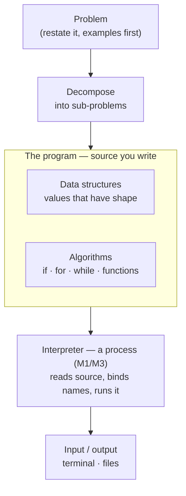
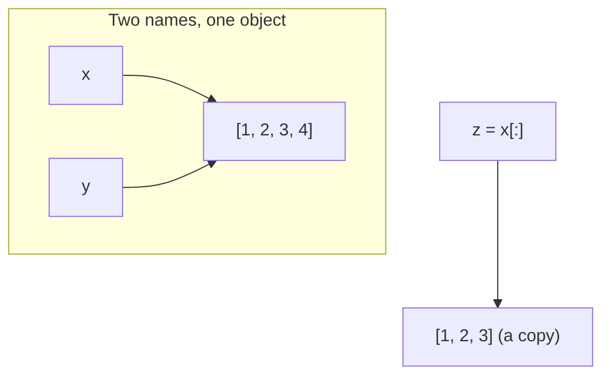
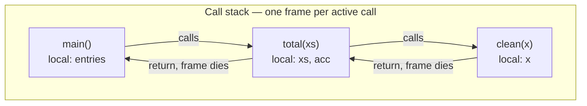
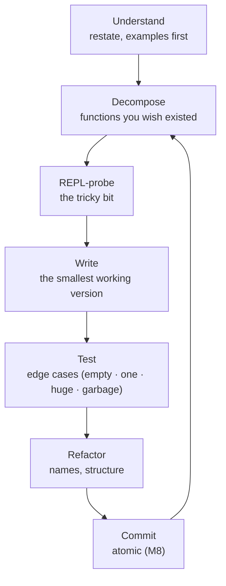

# Module 12 — Programming Fundamentals

<small>Stage 4 · Advanced Topics · ~3 weeks at 4 h/day · Prerequisite — Module 05 (Bash scripting — the 100-line boundary this module crosses).</small>

## Why this matters

**Programming** is designing precise procedures (**algorithms**) over structured information (**data
structures**) and expressing them in a language a machine executes. Module 05 taught you to encode
*procedures* — do this, then that, honestly, with exit codes. Programming adds the two halves bash was
missing: **data that has shape** (lists of records, mappings, sets — not just strings), and **logic that
composes** (functions building on functions, with measurable cost).

This is the exact wall M5 warned you about. Bash was the 100-line language — no real data structures,
string-typed everything, error handling by discipline rather than design. You just reached the boundary;
this module is what is on the other side. The concepts here — variables, types, control flow, functions,
scope, collections, complexity — are **language-agnostic**: they are the transferable core of every
language you will ever meet. Python is only the *vehicle* we learn them in (readable, already on your
machine, the lingua franca of automation and AI). A second language later costs a fraction of the first,
because it is the same ideas wearing new syntax.

!!! info "What this unlocks"
    M13 (Python for Engineers) **industrializes** everything here — idioms, testing, packaging · M14's
    network tools are these functions and structures · M15's automation is written in this language ·
    M23's debugging methodology formalizes the ladder you build here · M26–M28's AI work is Python
    end-to-end. This is the single skill that turns every remaining module from *"learning about"* into
    **"building with."**

---

## Watch

*Watch once, then rely on the notes below — you should never need to rewatch.*

<div class="lo-video-placeholder" markdown="1">
<span class="lo-play">▶</span>
**Explainer video — coming**
<small>Record per <code>../media/README.md</code>, upload to YouTube, then replace this card with the embed.</small>
</div>

??? note "For the author — drop-in YouTube embed (replace VIDEO_ID)"
    Once the explainer is on YouTube, replace the placeholder card above with:
    ```html
    <div class="lo-video-embed">
      <iframe src="https://www.youtube-nocookie.com/embed/VIDEO_ID"
              title="Module 12 — Programming Fundamentals"
              allow="accelerometer; autoplay; clipboard-write; encrypted-media; gyroscope; picture-in-picture"
              allowfullscreen></iframe>
    </div>
    ```
    Video script beats (from the blueprint's Definition / Architecture / Misconceptions):
    programming is problem → decompose → data structures + algorithms → expression in a language (the
    recipe-vs-cooking distinction, then yield to mechanism) → **names bind objects** (sticky notes, not
    boxes — the model that predicts every aliasing bug) → **structure follows access pattern** (list vs
    dict vs set, and why that choice *is* the performance) → the one habit: **edge cases before code.**

**Terminal cast — pending; record per `../media/README.md`.**

!!! tip "Follow along, don't just watch"
    Open the [Guided Lab](#guided-lab-your-first-programs) in a browser terminal and type each program
    yourself. Typing beats watching every time — and predicting the output *before* you run it is where
    the mental model actually forms.

---

## Key Notes

*Standalone. This is the reference you keep.*

### The picture: from a problem to a running program



A program is **data + logic**. You hand the source to an **interpreter** (`python3` — just a process, the
M1/M3 model again): it reads top-to-bottom, binds names to objects, calls functions, and raises errors
when something is wrong. Programs are automation *grown up* — the M5 arc, one level higher, now with real
data and composable logic.

### Values and types — every value knows what it is

Every value has a **type**, and the type decides what operations *mean* (`+` adds numbers but joins
strings). Types are checked while the program runs (**dynamic typing**) — fast to write, but a mismatch
only shows up on the line that runs it, which is why tests matter later (M13).

| Type | Example | Holds |
|---|---|---|
| `int` | `42` | whole numbers |
| `float` | `3.14` | fractional numbers |
| `str` | `"hi"` | text (immutable) |
| `bool` | `True` / `False` | truth |
| `None` | `None` | "no value" |

`type(x)` tells the truth; `/` is true division, `//` floors, `%` is remainder — knowing which you meant
prevents a classic off-by-a-lot bug.

### Variables are names bound to objects — the sticky-note model

`x = 5` does **not** put 5 into a box called `x`. It sticks the **name** `x` onto the object `5`.
Assignment **never copies** — it binds. So two names can label **one** object, and mutating through either
is seen by both (this is *aliasing*, the single most bug-preventing model to hold):

| Statement | Effect |
|---|---|
| `b = a` | a **second name** for the *same* object — mutate via `b` and `a` sees it |
| `b = a[:]` or `list(a)` | a **new object** (a copy) — independent from `a` |



`id(x)` proves it: after `y = x` both ids match; after `z = x[:]` the id differs. The **mutability split**
is the other half of the rule: `list`, `dict`, and `set` can be changed in place; `int`, `float`, `str`,
`bool`, `tuple`, `None` cannot — "changing" one of those makes a *new* object.

### Control flow — exactly three shapes

Dijkstra's "Go To Considered Harmful" (1968) settled it: any procedure is built from just three shapes.
Everything you will ever write is a composition of these:

| Shape | Keyword(s) | Meaning |
|---|---|---|
| **Sequence** | (top-to-bottom) | do steps in order |
| **Selection** | `if` / `elif` / `else` | choose a branch by a condition |
| **Iteration** | `for` (over a collection) · `while` (on a condition) | repeat |

`for x in thing` works on lists, strings, files, ranges, and dict keys alike — one loop syntax, because
they all speak the same **iteration protocol**. Ranges and slices are **half-open** (`[start, end)`) on
purpose: lengths are `end − start`, and adjacent slices tile perfectly (`s[:i] + s[i:] == s`) with no ±1
bookkeeping.

### Functions and scope — the unit of thought

A **function** is named, reusable, testable logic: `def name(params): … return value`. It is the unit you
*think* in — small, named for what it returns, provable alone. Two rules carry most of the weight:

- **`return` composes; `print` does not.** A function that only prints is a dead end; one that returns a
  value can feed the next function. Forget `return` and the function silently hands back `None`.
- **Every call gets a frame.** A **frame** holds that call's local names; it is born at the call and dies
  at `return`. Frames stack — recursion is frames all the way down. Name lookup follows **LEGB**: Local →
  Enclosing → Global → Builtins. That order explains every *"why is x not defined?"* you will ever hit.



An **exception** unwinds this stack: `raise` abandons frames one by one until a matching `except` catches
it — or, uncaught, the interpreter prints a **traceback**. Read a traceback **bottom-up**: the last line
is the error itself; the lines above are the route the calls took to get there.

### Data structures — the structure chooser

Choose the structure **first** and the algorithm often writes itself. The right choice is decided by your
dominant **access pattern**, not by taste:

| Need | Structure | How to use | Cost |
|---|---|---|---|
| Order + growth | `list` | `xs.append(x)`, `xs[i]`, slicing | O(1) append/index · O(n) search |
| Lookup by key | `dict` | `d[key]`, `d.get(key, default)` | ≈ O(1) get/set |
| Membership / uniqueness | `set` | `x in s`, `a & b`, dedup for free | ≈ O(1) `in` |
| Fixed-shape record | `tuple` | `name, port = pair` (unpack) | immutable · hashable |

A *list of dicts* is every dataset you will ever meet (journal exports, API responses, configs). A *list
of tuples* is a table. Composing these small pieces is how real data gets modelled.

### Complexity intuition — cost grows with input

You measure, you don't guess (M1's law, restated for code). **Big-O** describes how cost grows as input
`n` grows:

| Growth | Name | Example |
|---|---|---|
| O(1) | constant | `dict`/`set` lookup (hash straight to it) |
| O(n) | linear | scanning a `list` for membership |
| O(n log n) | log-linear | sorting |
| O(n²) | quadratic | a loop inside a loop |

Membership in a `set` beats a `list` because hashing *computes* the location instead of *searching* for
it — the same "know where it is beats look everywhere" as M1's cache story. Choosing `dict`/`set` by
access pattern **is** optimization; micro-tuning comes last, and only after you have measured.

### The programmer's loop



Stuck for more than 20 minutes? **Explain it aloud** (rubber-duck — or Claude Code *explaining a concept*,
never *solving the exercise*: the Law). Katas and gates are yours, bare-hands; the AI explains and reviews
your finished code — role-inverted from M11's default, deliberately.

<div class="lo-remember" markdown="1">
**Must remember (if you keep only six things):**

1. **Programs = data structures + algorithms.** Choose the *structure* first; the algorithm often follows.
2. **Variables are names bound to objects** (sticky notes, not boxes). Assignment never copies — aliasing is a feature you must *see coming*.
3. **Control flow has three shapes:** sequence, selection (`if`), iteration (`for`/`while`). That's all there is.
4. **Functions are the unit of thought.** Each call gets a frame (born at call, dies at return); scope is **LEGB**; `return` composes, `print` doesn't.
5. **Structure follows access pattern:** `list` = order, `dict`/`set` = lookup, `tuple` = fixed shape — and that choice *is* the performance (Big-O).
6. **Errors are information.** Read tracebacks **bottom-up**; catch **specific** exceptions, only where you can act. `except: pass` is the `|| true` of Python — banned.
</div>

---

## Guided Lab: your first programs

*Basic, step-by-step. Python is the vehicle for the fundamentals — you'll explore values and types, then
write small programs to files and run them: a conditional, a loop, a function, and a data structure. Every
program lives in a throwaway `~/learning/py/` workspace you build first.*

<div class="lo-lab-actions" markdown="1">
[▶ Open interactive lab](https://killercoda.com/learning-os/course/killercoda/module-12){ .lo-btn target=_blank }
[⧉ Open in Codespaces](https://codespaces.new/randaguiac20/learning-os){ .lo-btn target=_blank }
[⌨ Run locally](#run-locally){ .lo-btn .lo-btn--ghost }
[View lab source](https://github.com/randaguiac20/learning-os/tree/main/killercoda/module-12){ .lo-btn .lo-btn--ghost target=_blank }
</div>

<span id="run-locally"></span>
!!! tip "Three ways to run this lab — pick any (all free)"
    - **Instant, no account** — click **Open interactive lab** (Killercoda): a Linux terminal with `python3` in your browser.
    - **Your own cloud** — click **Open in Codespaces**: runs in your GitHub account's free tier (120 core-hrs/mo).
    - **Local, unlimited, $0** — any Linux / macOS / WSL terminal with `python3` (check `python3 --version`), or a throwaway container: `docker run -it python:3 bash`, then follow the steps below.

    Killercoda is the zero-setup on-ramp; Codespaces and local use *your own* free resources, so they scale to any class size.

=== "1 · Meet the interpreter"
    ```bash
    mkdir -p ~/learning/py && cd ~/learning/py   # your practice workspace
    python3 --version                            # the interpreter — a process
    python3 -c 'print(type(5), type(3.14), type("hi"), type(True), type(None))'
    python3 -c 'x = 5; print(x, type(x)); x = "now text"; print(x, type(x))'   # dynamic!
    python3 -c 'a = [1, 2, 3]; b = a; b.append(4); print("a:", a, "b:", b)'    # aliasing
    ```
    The last line prints `a: [1, 2, 3, 4]` — `b = a` made a *second name* for the *same* list. Predict
    every line's output **before** you run it. (`python3` on its own opens the REPL; `exit()` leaves it.)

=== "2 · Selection — choose a branch"
    ```bash
    cat > ~/learning/py/grade.py <<'EOF'
    score = 72
    if score >= 90:
        grade = "A"
    elif score >= 80:
        grade = "B"
    elif score >= 70:
        grade = "C"
    else:
        grade = "F"
    print(f"score {score} -> grade {grade}")
    EOF
    python3 ~/learning/py/grade.py
    ```
    Prints `score 72 -> grade C`. **Order matters:** the ladder checks top-down and stops at the first
    true branch. Change `72` and re-run. Journal: what happens if you reorder the branches?

=== "3 · Iteration — repeat with a loop"
    ```bash
    cat > ~/learning/py/fizzbuzz.py <<'EOF'
    for n in range(1, 16):          # half-open: 1..15
        if n % 15 == 0:
            print("FizzBuzz")
        elif n % 3 == 0:
            print("Fizz")
        elif n % 5 == 0:
            print("Buzz")
        else:
            print(n)
    EOF
    python3 ~/learning/py/fizzbuzz.py
    ```
    A `for` loop over a half-open `range` — 15 iterations, iteration and selection combined. Verify in the
    lab with **Check**: line 3 is `Fizz`, line 5 is `Buzz`, line 15 is `FizzBuzz`.

=== "4 · Functions + a data structure"
    ```bash
    cat > ~/learning/py/wordfreq.py <<'EOF'
    text = "the quick brown fox the lazy dog the fox"

    def count_words(t):
        counts = {}                       # a dict: word -> count
        for w in t.split():
            counts[w] = counts.get(w, 0) + 1   # .get with a default
        return counts                     # return composes; print would not

    counts = count_words(text)
    top = max(counts, key=counts.get)
    print(f"most common: {top} ({counts[top]})")
    EOF
    python3 ~/learning/py/wordfreq.py
    ```
    Prints `most common: the (3)`. A **function** (its own scope, returns a value), a **dict** counting by
    key, and the `.get(k, 0)` idiom. Verify in the lab with **Check**.

=== "5 · Errors as information"
    ```bash
    python3 -c 'print(int("abc"))'        # read the traceback BOTTOM-UP: ValueError
    cat > ~/learning/py/safe_int.py <<'EOF'
    import sys
    raw = "abc"
    try:
        n = int(raw)
    except ValueError:
        print(f"not a number: {raw!r}", file=sys.stderr)
        sys.exit(1)                       # M5's contract: non-zero on failure
    print(n)
    EOF
    python3 ~/learning/py/safe_int.py; echo "exit: $?"
    ```
    The bare `int("abc")` raises a `ValueError`; the safe version catches the **specific** error, writes to
    **stderr**, and exits **non-zero** — the M5 CLI contract, kept in language #2.

!!! success "You can stop here and have learned something real"
    If you can read a value's type, bind names and see aliasing, write a conditional and a loop, define a
    function that returns, count with a dict, and read a traceback bottom-up — the guided lab is done. Now
    make it harder.

---

## Solo Lab: figure it out

*Harder. Goals only — minimal hand-holding. Work in `~/learning/py/`, bare-hands (the Law). List the edge
cases in a comment **before** you write code. Reveal a hint only after you've tried.*

### Challenge 1 — FizzBuzz without the `if`-ladder
You wrote FizzBuzz with `if/elif/else`. Now solve the *same* problem **without** an `if/elif` chain —
build the output string by concatenation, or drive it from a small data structure. Judge the two shapes.

??? tip "Hint"
    Start each number with an empty string; append `"Fizz"` when divisible by 3 and `"Buzz"` when
    divisible by 5; print the number only if the string is still empty. Or: a list/dict of
    `(divisor, word)` rules the loop walks.

??? success "Solution"
    ```python
    for n in range(1, 16):
        out = ""
        if n % 3 == 0: out += "Fizz"
        if n % 5 == 0: out += "Buzz"
        print(out or n)          # empty string is falsy -> print the number
    ```
    Data-driven beats branch-driven as the cases grow — the same problem in three shapes teaches judgment,
    not trivia.

### Challenge 2 — Replicate a shell pipeline in pure code
Reproduce what `sort | uniq -c | sort -rn` does for a file: read its words and print each distinct word
with its count, most frequent first. Then diff your thinking against the real pipeline — they should
agree.

??? tip "Hint"
    Count into a `dict` (or `collections.Counter`), then sort the items by count descending:
    `sorted(counts.items(), key=lambda kv: kv[1], reverse=True)`.

??? success "Solution"
    ```python
    from collections import Counter
    text = "the quick brown fox the lazy dog the fox"
    counts = Counter(text.split())
    for word, n in counts.most_common():
        print(f"{n:>3} {word}")
    ```
    `Counter` is the stdlib's dict-counter; `most_common()` returns items sorted by count. M2's pipes and
    M12's structures express the same idea — and match.

### Challenge 3 — The mutable-default trap
Write `add_item(item, items=[])` that appends `item` to `items` and returns it. Call it three times with
no `items` argument. Explain what you observe, then fix it.

??? success "Solution"
    ```python
    def add_item(item, items=None):      # NOT items=[]
        if items is None:
            items = []
        items.append(item)
        return items
    ```
    A default value is evaluated **once**, at definition time — a bare `items=[]` shares *one* list across
    every call, so it accumulates. The `None` sentinel creates a fresh list each call. A classic you plant
    once and never fall for again.

### Challenge 4 — Prove aliasing with `id()`
In the REPL, demonstrate — with `id()` as evidence — that `b = a` makes two names for one list while
`c = a[:]` makes a copy. Mutate through `b` and show `a` changes; mutate through `c` and show `a` does
not.

??? success "Solution"
    ```python
    a = [1, 2, 3]
    b = a;      print(id(a) == id(b))    # True  — same object
    c = a[:];   print(id(a) == id(c))    # False — a copy
    b.append(4); print(a)                # [1, 2, 3, 4] — b's change is a's change
    c.append(9); print(a)                # unchanged — c is independent
    ```
    The sticky-note model, proven. This is the demo you teach back in the Self-Check.

### Challenge 5 (stretch) — Measure list vs set membership
Build a small timing harness: check membership of a value NOT present in a `list` of 1,000,000 items, then
in a `set` of the same items. Time both with `time.perf_counter`. State the shapes you observe and the
mechanism.

??? success "Solution"
    ```python
    import time
    n = 1_000_000
    xs = list(range(n)); ss = set(xs); target = -1   # absent -> worst case
    for name, coll in (("list", xs), ("set", ss)):
        t = time.perf_counter()
        target in coll
        print(f"{name}: {time.perf_counter() - t:.6f}s")
    ```
    The `list` scans every element (O(n)); the `set` hashes straight to a bucket (≈O(1)) — an
    orders-of-magnitude gap, *measured*, not asserted. M1's cache lesson, in software.

---

## Self-Check

*Close the notes. Answer aloud or in writing **first**, then reveal. Recalling — even when it's hard — is
what builds the memory.*

??? question "\"Names bind objects; assignment never copies.\" Predict: `a = [1]; b = a; b += [2]; print(a)`."
    Prints **`[1, 2]`**. `b = a` adds a *second name* to the same list; `b += [2]` mutates that list in
    place, so `a` — the other name for it — sees the change. A copy (`b = a[:]` or `list(a)`) would have
    left `a` as `[1]`.

??? question "Name the three shapes of control flow, and which keyword makes each."
    **Sequence** (top-to-bottom, no keyword), **selection** (`if`/`elif`/`else`), and **iteration**
    (`for` over a collection, `while` on a condition). Dijkstra showed every procedure is built from just
    these three — no `goto` required.

??? question "Which core types can be changed in place, and which cannot?"
    Mutable: **`list`, `dict`, `set`**. Immutable: **`int`, `float`, `str`, `bool`, `tuple`, `None`** —
    "changing" one of those creates a *new* object. This split explains both the aliasing surprise and the
    mutable-default trap.

??? question "What is a frame, when is it born and when does it die, and what is the scope lookup order?"
    A **frame** holds one call's local names. It is **born at the call** and **dies at `return`**; frames
    stack (recursion is frames all the way down). Name lookup is **LEGB**: Local → Enclosing → Global →
    Builtins.

??? question "A function prints the right thing but the caller gets `None`. What happened?"
    The function **prints** its result but never **returns** it — so it hands back `None` by default, and
    the caller printed *that*. `print` displays; only `return` produces a value that composes. Add the
    `return`.

??? question "You need to test membership repeatedly against a large collection. `list` or `set`, and why?"
    **`set`** — membership is ≈O(1) because hashing computes the location, versus a `list`'s O(n) scan of
    every element. The structure choice *is* the performance; measure it and the gap is orders of
    magnitude at scale.

??? question "How do you read a traceback, and where do you catch an exception?"
    Read it **bottom-up**: the last line is the error (type + message); the lines above are the call route
    that reached it. Catch a **specific** exception at the level where you can meaningfully **act** (retry,
    default, message) — never a bare `except: pass`, which hides the failure (even a typo) silently.

!!! example "Teach it back (the real test)"
    Out loud, in **5 minutes, no notes** — *"Sticky notes and card catalogs"*: (1) **names bind objects** —
    a live demo with `id()` and the `b = a` aliasing reveal (your listener should be able to predict the
    demo afterward); (2) **structure follows access pattern** — the library-vs-shelf-walk analogy and your
    own measured list-vs-set numbers; ending with the one habit: **edge cases before code.** If you can't
    yet, that's your signal to reread the Key Notes, not to move on.

---

## Mastery checklist

*Tick these honestly, cold (no notes). They **gate** progress to Module 13. A module is only "done" when
every box is true.*

- [ ] **Explain** the binding model (names on objects), the mutability split, frames/scope (LEGB), and half-open intervals — flawless.
- [ ] **Define** 12 random terms cold (alias, hashable, comprehension, LEGB, traceback, iterable, unpacking, expression vs statement, mutability, scope, complexity, immutable).
- [ ] **Draw** from memory: the source→interpreter picture, the sticky-note/aliasing diagram, the call-frame stack, and the programmer's loop.
- [ ] **Build** three small programs (a conditional, a loop, a function returning a value) from a blank file in under 20 minutes, edges listed first.
- [ ] **Develop** a data-structure program: count by key with a `dict`, and justify `dict`/`set`/`list`/`tuple` for a given access pattern.
- [ ] **Troubleshoot** the error taxonomy from symptoms: NameError, TypeError, KeyError, ValueError, IndexError — one cause and first check for each.
- [ ] **Debug** a planted bug with the ladder: reproduce → read the traceback bottom-up → isolate → name the root cause (not the symptom) → add a guard.
- [ ] **Optimize:** run the list-vs-set measurement, own the numbers, and recite the order — correct → measure → structure/algorithm → micro.
- [ ] **Design:** choose the right structure for ≥6 scenarios and defend each by access pattern and complexity.
- [ ] **Secure:** state why `eval(input())` is catastrophic and why `except: pass` is banned; give the safe pattern for each.
- [ ] **Best practices:** edges-before-code, `return`-not-`print`, specific excepts, REPL-first — observed unprompted, all module.
- [ ] **Teach:** pass the teach-back above ("Sticky notes and card catalogs"), the aliasing reveal mandatory.

---

## Review — lock it in

Spaced repetition is not optional; it's where the memory actually forms. This module has a special
property: the **katas are daily review by design**, and from Week 3 your own *Recall* tool runs the
flashcards — the module reviews itself with the artifact it built. Interleaving stays active — every M12
review also pulls one earlier-module item. Schedule these and *keep* them:

| When | Do | Interleaved item |
|---|---|---|
| **Week-1 close** | Sticky-note + programmer's-loop blanks · predict + slice sprints · concept questions A1–A4 | M11: the-Law hygiene sprint |
| **Week-2 close** | Structure-chooser + call-frame blanks · idiom + traceback sprints · scenario questions B5–B7 | M8: atomic-commit sprint |
| **Day 1** | Flashcards (via Recall!) · predict sprint · troubleshooting questions D11–D12 | M11 flashcards you missed |
| **Day 3** | One cold kata, timed, bare-hands · the decompose-on-paper drill on a fresh spec | M8: read a branch graph |
| **Day 7** | Traceback autopsy on a planted 3-bug script · production/security questions F15–F16, H19–H20 | M9: SSH hardening sprint |
| **Day 30** | Two cold katas (one easy, one medium) · structure-chooser on 8 fresh scenarios | M7: tmux builder sprint |

**Connects forward to:** Python for Engineers (M13 — everything here, industrialized: idioms, pytest,
packaging) · network tools (M14 — sockets and checks written as these functions) · automation (M15 — real
programs replace hand-processes) · debugging methodology (M23 — your ladder, formalized, with a real
debugger) · AI/ML (M26–M28 — Python is its mother tongue; arrays are lists-with-physics, configs are
dicts, training scripts are these loops at scale).

!!! quote "The one-sentence takeaway"
    M5 drew the line at 100 lines of bash; M12 crosses it — you now think in **data structures and
    algorithms** and can build real tools from nothing, the single skill that turns every remaining module
    from *learning about* into *building with*.
