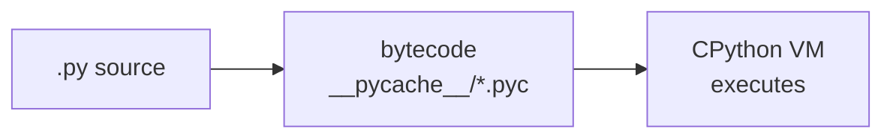
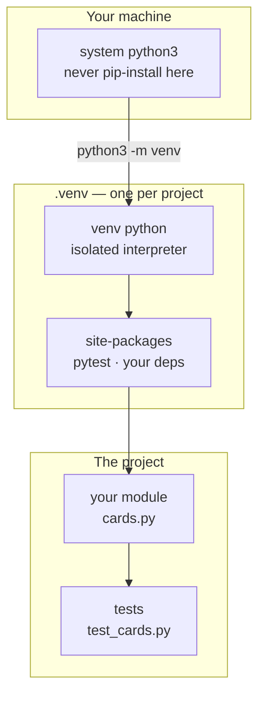
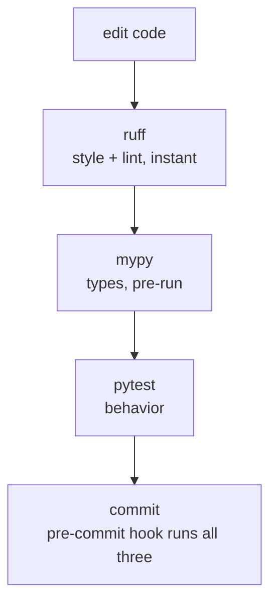

# Module 13 — Python for Engineers

<small>Stage 4 · Advanced Topics · ~4 weeks · Prerequisite — Module 12 (the Python you can now write; this module makes it dependable).</small>

## Why this matters

Module 12 made you able to **build** in Python. This module makes what you build **dependable**: an
isolated environment per project, idiomatic code other engineers read without friction, typed
interfaces that document *and* machine-check themselves, tests as the safety net, honest logging
instead of stray `print`, and packaging that turns a loose script into an installable command.

This is the layer the industry actually interviews for. "Python engineer" — across backend, data,
ML, and DevOps — means exactly this: the **gate** (lint + types + tests) as your hygiene floor, and
the discipline to keep it. Everything Python-shaped ahead assumes this module: Netscope (M14) is
*built inside* this shape, automation (M15) is held to this standard, and the capstone's services are
this module at scale. This is also where M5's old promise lands — `logsum.sh` finally earns its
typed, tested Python rewrite, and "works on my machine" dies for **code** the way M10 killed it for
tools.

!!! info "What this unlocks"
    M14 pours networking into a package you scaffold *here* · M15 lifts your local `check.sh` gate
    into CI · M16–18 containerize **packaged** apps (a `Dockerfile` over a wheel is clean; over loose
    scripts it's archaeology) · M21 grows `cProfile`/`tracemalloc` into `perf`/`py-spy` · M23 makes
    `pdb` + tests your debugging infrastructure · M26–28: every training script and serving shim is a
    small typed package. **Notebooks explore; packages ship — the boundary you can now hold.**

---

## Watch

*Watch once, then rely on the notes below — you should never need to rewatch.*

<div class="lo-video-placeholder" markdown="1">
<span class="lo-play">▶</span>
**Explainer video — coming**
<small>Record per <code>../media/README.md</code>, upload to YouTube, then replace this card with the embed.</small>
</div>

??? note "For the author — drop-in YouTube embed (replace VIDEO_ID)"
    Once the explainer is on YouTube, replace the placeholder card above with:
    ```html
    <div class="lo-video-embed">
      <iframe src="https://www.youtube-nocookie.com/embed/VIDEO_ID"
              title="Module 13 — Python for Engineers"
              allow="accelerometer; autoplay; clipboard-write; encrypted-media; gyroscope; picture-in-picture"
              allowfullscreen></iframe>
    </div>
    ```
    Video script beats (from the blueprint's Definition / Architecture / Misconceptions):
    the interpreter/bytecode model (why a `.venv` is a *whole* interpreter) → the venv as isolation →
    `pip install` as a trust decision → `@dataclass` and hints as executable documentation →
    generators suspending a frame → the gate (ruff→mypy→pytest) and why the order is cheap-before-deep →
    the entry point that makes a command from a function.

**Terminal cast — pending; record per `../media/README.md`.**

!!! tip "Follow along, don't just watch"
    Open the [Guided Lab](#guided-lab-a-real-python-project-in-miniature) in a browser terminal and run
    each command yourself as it appears. Typing beats watching every time — and building the `.venv`,
    the module, and the test with your own hands is how the memory forms.

---

## Key Notes

*Standalone. This is the reference you keep.*

### The interpreter, briefly

Python is **interpreted**, but not naively line-by-line. CPython first compiles your source to
**bytecode** (the `.pyc` files under `__pycache__/`), then a virtual machine executes that bytecode.
This is why a syntax error anywhere in a file stops it before *any* line runs — the whole module is
compiled first.



The practical upshot: a "Python installation" is an **interpreter plus its libraries**. A virtual
environment is a *copy of that arrangement* you own per project — which is the next picture.

### The environment: system Python, venv, packages

Never `pip install` into the system Python — you'd pollute a shared interpreter every tool on the
machine depends on. Instead, `python3 -m venv .venv` builds an **isolated interpreter** for one
project; `pip` then installs that project's dependencies into *its* `site-packages`, touching nothing
outside.



`which python` is your truth-reader: after `source .venv/bin/activate` it must point *inside* `.venv`.
The **recreate-drill** — `rm -rf .venv`, rebuild from your declared deps — proves your dependency list
is complete: if it rebuilds and tests pass, nothing was undeclared. A `.venv` is disposable *by design*.

### The gate — the module's spine

Every change runs the same three checks, cheap-and-shallow before slow-and-deep, and a pre-commit hook
(M8) runs them so it's **infrastructure, not willpower**:



Each stage catches what the others **cannot see**:

| Stage | What it catches | Blind to |
|---|---|---|
| **ruff** (lint + format) | style + bug-by-pattern, instantly | types; runtime behavior |
| **mypy** (type checker) | interface/type contradictions across files, *before* running | style; actual behavior |
| **pytest** (tests) | behavior vs the contract | style; and it doesn't read types |

### Idioms — Python as Pythonistas write it

Idiomatic code reduces reader surprise. The core moves:

| Idiom | Plain version | Why the idiom reads better |
|---|---|---|
| **EAFP** ("ask forgiveness") | `if k in d: ... else: ...` | `try: d[k] except KeyError:` — one lookup, the happy path unindented |
| **Truthiness** | `if len(x) > 0:` | `if x:` — empty containers are already falsy |
| **Unpacking** | `first = xs[0]; rest = xs[1:]` | `first, *rest = xs` |
| **`enumerate`/`zip`** | `for i in range(len(xs)):` | `for i, x in enumerate(xs):` — no index bookkeeping |
| **`sorted(key=...)`** | manual comparison loop | `sorted(cards, key=lambda c: c.accuracy)` |
| **Comprehension** | `out = []; for ...: out.append(...)` | `[f(x) for x in xs if cond]` — when it stays readable |

The judgment: an idiom that *shows off* (a nested one-liner nobody can read) is worse than the plain
version. **EAFP where the exception is rare; LBYL where the miss is the common path.**

### Generators — laziness that scales

`yield` **suspends the function's frame** (locals intact, instruction pointer parked) and hands one
value out; `next()` resumes it in place. A generator *is* the iterator protocol implemented for you.
The payoff: a pipeline holds **one item in flight per stage** — constant memory over *any* input size.

```python
def entries(f):
    for line in f:
        yield json.loads(line)   # frame SUSPENDS here, resumes on next()

for e in entries(open(big_file)):   # gigabytes in, kilobytes resident
    ...
```

What **kills** the laziness: any operation that needs *all* items resident — `list(...)`, `sorted(...)`,
random access. Sorting a stream is choosing to pay memory; know when you're choosing. **Rule:**
unbounded or user-sized input through a pipeline → generators are mandatory; small known-bounded data →
a list is fine and simpler.

### The data model — dataclasses, dunders, the class law

`@dataclass` generates `__init__`, `__repr__`, and `__eq__` from your field declarations at
class-creation time — you declare **shape**, Python derives the mechanics. A mutable default needs
`field(default_factory=list)` (the M12 trap, designed away — the default is evaluated *once* otherwise).
A `frozen=True` dataclass is **hashable** — usable as a dict key or set member.

Dunder methods teach *your* objects the language's protocols: `__len__`, `__iter__` (often
`yield from`), `__eq__`. And the decision of *whether to make a class at all* follows one law:

| Kind | Goes to | Example |
|---|---|---|
| **Data** | a `@dataclass` | `Card(front, back, reviews)` |
| **Behavior** | a method / function | `Deck.draw()` |
| **Variation** | **composition** (has-a) | `Scheduler` *has a* `Deck` |
| **Taxonomy of failure** | inheritance (its honest home) | `RecallError → DeckCorruptError` |

Inheritance is the **last** resort — a module of functions is often the professional choice. A `property`
(`Card.accuracy`) is a computed attribute that can never go stale.

### Type hints — the treaty of dynamic typing

Hints are **inert annotations at runtime** — Python ignores them; external checkers (mypy/pyright) read
them *before* you run. You buy documentation and machine-checking without losing dynamism. Adopt them
**gradually**: public interfaces first, per-module strictness ratcheted from loose to strict.

Two rules earn their keep:

- **Accept broad, return specific** — `def load(lines: Iterable[str]) -> list[Card]:`. Callers keep
  freedom on the way in; keep their capabilities (index, `len`) on the way out. (Postel, typed.)
- **The `Any` leak is infectious** — one untyped boundary (`json.loads` returns `Any`) silences
  checking downstream, and a type lie survives mypy to blow up at runtime. Type the boundary
  (a `TypedDict` or dataclass parse layer) and the leak closes.

### Errors, logging, and the three channels

Catch exceptions **at boundaries** (the CLI edge), not at depth — `except Exception` buried deep hides
bugs. Design domain exceptions (`DeckCorruptError`), log them with context, exit honestly.

`print` is fine while exploring; **shipping** `print`-debugging is not. `logging` replaces it: loggers
form a dot-named hierarchy with per-logger/handler levels, `--verbose` maps to `DEBUG`, and output flows
to stderr/journald (M4 closes its loop). The iron rule: **libraries `getLogger(__name__)` and emit;
applications configure.** A library that configures handlers imposes policy on every app that imports it.

Three output channels, three audiences: **stdout = data · stderr = errors · logging = diagnostics.**

### Packaging — from script to command

A script **graduates** to a package when any of three triggers fire: another file imports it, it belongs
on `PATH` as a command, or it owns dependencies. The package's identity lives in **one** file,
`pyproject.toml` (PEP 621): metadata, deps, tool config, and entry points. An **entry point** turns a
function into a command:

```toml
[project.scripts]
recall = "recall.cli:main"
```

`pip install -e .` (editable) then writes a tiny `recall` script onto `PATH` that imports and calls your
`main()` — your function joins `ls` and `git` as a first-class command (M3's PATH, self-extended). The
**src layout** (`src/recall/`) means tests can only import the *installed* package, never the accidental
local directory: **what you test is what ships.**

<div class="lo-remember" markdown="1">
**Must remember (if you keep only eight things):**

1. **Never `pip install` into system Python.** One `.venv` per project; `which python` proves you're in it; recreate it fearlessly.
2. **The gate is ruff → mypy → pytest**, in a pre-commit hook — cheap-and-shallow before slow-and-deep; each stage catches what the others can't see.
3. **`yield` suspends the frame** — pipelines hold one item in flight, constant memory; `list()`/`sorted()` destroy the laziness.
4. **Data → dataclass · behavior → methods · variation → composition · taxonomy-of-errors → inheritance** — and inheritance is *last*.
5. **`field(default_factory=list)`** for a mutable default; **`frozen=True`** makes it hashable.
6. **Hints are inert at runtime, checked pre-run.** Accept broad (`Iterable`), return specific (`list`); the `Any` leak is infectious — type the boundary.
7. **stdout = data · stderr = errors · logging = diagnostics.** Libraries emit, apps configure; `print`-debugging never ships.
8. **A script becomes a package** when imported / needed on PATH / owns deps — `pyproject.toml` is the one config; `pip install -e .` + an entry point make a command.
</div>

---

## Guided Lab: a real Python project in miniature

*Basic, step-by-step. You build a throwaway `~/recall/` project: an isolated `.venv`, a package
installed into it, a small typed module with a generator, and a passing pytest suite. Nothing outside
the project — and nothing in the system Python — is ever touched.*

<div class="lo-lab-actions" markdown="1">
[▶ Open interactive lab](https://killercoda.com/learning-os/course/killercoda/module-13){ .lo-btn target=_blank }
[⧉ Open in Codespaces](https://codespaces.new/randaguiac20/learning-os){ .lo-btn target=_blank }
[⌨ Run locally](#run-locally){ .lo-btn .lo-btn--ghost }
[View lab source](https://github.com/randaguiac20/learning-os/tree/main/killercoda/module-13){ .lo-btn .lo-btn--ghost target=_blank }
</div>

<span id="run-locally"></span>
!!! tip "Three ways to run this lab — pick any (all free)"
    - **Instant, no account** — click **Open interactive lab** (Killercoda): a Linux terminal in your browser.
    - **Your own cloud** — click **Open in Codespaces**: runs in your GitHub account's free tier (120 core-hrs/mo).
    - **Local, unlimited, $0** — any Linux / macOS / WSL terminal, or a throwaway container: `docker run -it ubuntu bash`, then follow the steps below.

    Killercoda is the zero-setup on-ramp; Codespaces and local use *your own* free resources, so they scale to any class size.

=== "1 · Build an isolated environment"
    ```bash
    python3 --version                 # confirm the interpreter is here
    apt-get update -qq && apt-get install -y python3-venv python3-pip   # venv/pip modules
    mkdir -p ~/recall && cd ~/recall  # the project lives here
    python3 -m venv .venv             # an isolated interpreter for THIS project
    source .venv/bin/activate         # activate it
    which python                      # MUST print a path inside ~/recall/.venv
    ```
    After activation your prompt shows `(.venv)`. `which python` pointing *inside* `.venv` is the whole
    point — nothing you install now touches the system Python.

=== "2 · Install a package into the venv"
    ```bash
    python -m pip install --upgrade pip   # pip updating itself, inside the venv
    pip install pytest                     # the testing package — installed into .venv only
    pip list                               # see it (and its deps) living in THIS venv
    python -c "import pytest; print(pytest.__version__)"   # importable inside the venv
    ```
    `pip list` shows the package under `~/recall/.venv/lib/…`, not the system. Every `pip install` is a
    trust decision — install what you *mean*, pin what you ship.

=== "3 · Write a small typed module"
    ```bash
    cat > cards.py <<'PY'
    """A tiny Recall module: typed records, a generator, EAFP parsing."""
    from dataclasses import dataclass, field
    from typing import Iterable


    @dataclass
    class Card:
        front: str
        back: str
        reviews: list[int] = field(default_factory=list)   # mutable default, done right

        @property
        def accuracy(self) -> float:                        # computed, never stale
            if not self.reviews:
                return 0.0
            return sum(self.reviews) / len(self.reviews)


    def parse_cards(lines: Iterable[str]) -> list[Card]:
        """Parse 'front|back' lines into Cards, skipping malformed ones (EAFP)."""
        cards: list[Card] = []
        for line in lines:
            line = line.strip()
            if not line:
                continue
            try:
                front, back = line.split("|", 1)            # ValueError if no '|'
            except ValueError:
                continue                                    # skip the malformed line
            cards.append(Card(front.strip(), back.strip()))
        return cards


    def due_fronts(cards: Iterable[Card]):
        """Lazily yield each card's front — a generator, one at a time."""
        for card in cards:
            yield card.front
    PY
    python -c "from cards import parse_cards; print(len(parse_cards(['a|b','nope','c|d'])))"
    ```
    That last line prints `2` — the malformed `'nope'` line was skipped by the `try/except` (EAFP).
    Note the hints (`Iterable` in, `list[Card]` out), the `default_factory`, the `@property`, and the
    generator. **Click *Check*** to verify the venv, the package, and the module.

=== "4 · Write a test and run the gate"
    ```bash
    cat > test_cards.py <<'PY'
    import pytest
    from cards import Card, parse_cards, due_fronts


    def test_accuracy_empty():
        assert Card("q", "a").accuracy == 0.0


    @pytest.mark.parametrize("reviews, expected", [
        ([1, 1, 1], 1.0),
        ([1, 0], 0.5),
        ([0, 0], 0.0),
    ])
    def test_accuracy(reviews, expected):
        assert Card("q", "a", reviews).accuracy == expected


    def test_parse_skips_malformed():
        cards = parse_cards(["hi|hello", "garbage-no-pipe", "", "chat|talk"])
        assert len(cards) == 2
        assert cards[0].front == "hi"


    def test_due_fronts_is_lazy():
        gen = due_fronts([Card("a", "b"), Card("c", "d")])
        assert next(gen) == "a"   # one item pulled — the rest never computed
    PY
    python -m pytest -q
    ```
    `parametrize` sweeps four accuracy cases through one test. Green pytest is the treaty signed:
    untested Python is unfinished Python. **Click *Check*** to confirm the suite passes inside the venv.

=== "5 · Make it a command (argparse)"
    ```bash
    cat > recall_cli.py <<'PY'
    """A minimal argparse CLI over the cards module — the entry-point idea, in miniature."""
    import argparse
    from cards import parse_cards, due_fronts

    SAMPLE = ["capital of France|Paris", "2+2|4", "malformed line"]


    def main() -> int:
        parser = argparse.ArgumentParser(prog="recall", description="Tiny Recall demo")
        parser.add_argument("--count", action="store_true", help="print how many cards parsed")
        args = parser.parse_args()
        cards = parse_cards(SAMPLE)
        if args.count:
            print(len(cards))
        else:
            for front in due_fronts(cards):
                print(front)
        return 0


    if __name__ == "__main__":
        raise SystemExit(main())
    PY
    python recall_cli.py            # prints each card's front (the malformed line was skipped)
    python recall_cli.py --count    # prints 2
    python recall_cli.py --help     # argparse gives --help for FREE
    ```
    In a real package, `pyproject.toml`'s `[project.scripts] recall = "recall.cli:main"` plus
    `pip install -e .` would put a `recall` command on your `PATH` — this file is that idea in one hand.

!!! success "You can stop here and have learned something real"
    If you built an isolated `.venv`, installed a package into it, wrote a typed module with a generator,
    and ran a green pytest suite — the guided lab is done. Now make it harder.

---

## Solo Lab: figure it out

*Harder. Goals only — minimal hand-holding. Work inside your `~/recall/` project with the `.venv`
active. Struggle here is the point; reveal a hint only after you've tried.*

### Challenge 1 — Prove the isolation, then the recreate-drill
Show, in commands, that `pytest` lives in the venv and *not* the system Python. Then delete `.venv`
entirely and rebuild it so the tests pass again — from your declared deps alone.

??? tip "Hint"
    `which python` and `which pytest` before and after `deactivate`. To rebuild: `rm -rf .venv`, remake
    it, reinstall. What would you need written down to make the reinstall one command?

??? success "Solution"
    ```bash
    which pytest              # inside .venv/bin while active
    deactivate; which pytest  # now absent (or a different one) — proof of isolation
    source .venv/bin/activate
    pip freeze > requirements.txt   # declare what's installed
    rm -rf .venv                     # the drill: throw it away
    python3 -m venv .venv && source .venv/bin/activate
    pip install -r requirements.txt  # rebuild from the declaration ALONE
    python -m pytest -q              # green = nothing was undeclared
    ```
    The recreate-drill is a *test of your dependency list*: if it rebuilds and passes, your declaration
    is complete. A `.venv` is disposable — that's the feature (M10's bootstrap law, project-scale).

### Challenge 2 — A frozen dataclass as a set member
Make a second, **frozen** variant of `Card` and prove frozen-ness buys you hashability: put two
*identical* frozen cards in a `set` and show it dedupes to one.

??? tip "Hint"
    `@dataclass(frozen=True)`. Hashability requires stable value-identity — which mutation would break,
    so mutable dataclasses aren't hashable by default (M12's dict-key rule).

??? success "Solution"
    ```python
    from dataclasses import dataclass

    @dataclass(frozen=True)
    class FrozenCard:
        front: str
        back: str

    s = {FrozenCard("q", "a"), FrozenCard("q", "a")}
    print(len(s))   # 1 — identical frozen cards hash equal, so the set dedupes
    ```
    Frozen = hash derived from fields, safely. Where it's the *feature*: config records as dict keys,
    cache keys, set membership — immutability as correctness, not restriction.

### Challenge 3 — The generator memory claim, felt
Write a generator that yields `n` items and a list version that builds all `n`. For a large `n`, show —
with `tracemalloc` — that the generator's peak memory stays flat while the list's grows with `n`.

??? tip "Hint"
    `tracemalloc.start()`, do the work, `tracemalloc.get_traced_memory()`. Consuming a generator with a
    plain `for` (and *not* keeping the items) is what stays flat.

??? success "Solution"
    ```python
    import tracemalloc

    def gen(n):
        for i in range(n):
            yield i * i

    for label, make in [("list", lambda n: [i*i for i in range(n)]),
                        ("generator", lambda n: sum(gen(n)))]:
        tracemalloc.start()
        _ = make(2_000_000)
        peak = tracemalloc.get_traced_memory()[1]
        tracemalloc.stop()
        print(f"{label:10} peak ~{peak//1024} KiB")
    ```
    The list peaks ∝ `n`; the generator stays near the interpreter baseline (one item in flight). The
    one-line rule: **unbounded or user-sized input → generators mandatory.**

### Challenge 4 — Catch a type lie with a test
Introduce a deliberate `Any` leak: a code path where a function hinted `-> list[Card]` actually returns
a list of `dict`s. mypy stays silent (the `Any` slips through). Write the pytest that catches it, then
close the leak by typing the boundary.

??? success "Solution"
    ```python
    # The lie: json.loads returns Any, so mypy trusts whatever we do with it.
    import json
    def load(raw: str) -> list["Card"]:
        return json.loads(raw)   # actually list[dict] — mypy sees Any, says nothing

    # The test that refuses to be fooled (behavior, not types):
    def test_load_returns_cards():
        cards = load('[{"front": "q", "back": "a"}]')
        assert all(isinstance(c, Card) for c in cards)   # FAILS: they're dicts
    ```
    Fix by typing the boundary — parse the `dict`s into `Card`s in a real parse layer, so `Any` never
    escapes. The test is the treaty; the type checker only checks what you don't lie to it about.

### Challenge 5 (stretch) — A `@timed` decorator
Write your first decorator: `@timed` wraps a function, logs how long it took, and returns the result
unchanged. Apply it to `parse_cards`. Understand it via the functions-are-objects model.

??? success "Solution"
    ```python
    import functools, logging, time
    log = logging.getLogger(__name__)

    def timed(fn):
        @functools.wraps(fn)          # keep the wrapped function's name/docstring
        def wrapper(*args, **kwargs):
            start = time.perf_counter()
            result = fn(*args, **kwargs)
            log.info("%s took %.3f ms", fn.__name__, (time.perf_counter() - start) * 1e3)
            return result
        return wrapper
    ```
    A decorator is just a function that takes a function and returns a replacement — `functools.wraps`
    preserves the identity so tooling (and `--help`) still see the real name. Note it *logs*, not
    `print`s: this is a library-shaped helper, so it emits and lets the app configure.

---

## Self-Check

*Close the notes. Answer aloud or in writing **first**, then reveal. Recalling — even when it's hard —
is what builds the memory.*

??? question "What does `yield` do to a function's frame, and what property does that give a pipeline?"
    It **suspends** the frame — locals intact, instruction pointer parked — and hands one value out;
    `next()` resumes it in place. So a pipeline holds **one item in flight per stage**: constant memory
    over any input size, and work happens only as consumed (early exit saves the rest).

??? question "Why never `pip install` into the system Python — and what proves you're isolated?"
    The system interpreter is shared by every tool on the machine; polluting it breaks things far from
    your project. A `.venv` gives you an isolated interpreter + `site-packages`. **`which python`** (and
    `which pytest`) pointing inside `.venv` is the proof; the **recreate-drill** proves your deps are
    fully declared.

??? question "What does `@dataclass` generate, and why does `field(default_factory=list)` exist?"
    At class-creation it writes `__init__`, `__repr__`, and `__eq__` from the field declarations.
    Defaults are evaluated **once**, so a bare `= []` would be shared across all instances (M12's trap);
    `default_factory` defers creation to instance-time, giving each its own list.

??? question "Hints are inert at runtime — so what are they *for*, and the two typing rules?"
    They're documentation the reader trusts and **mypy/pyright check pre-run** — machine-checked
    interfaces without losing dynamism. Rules: **accept broad** (`Iterable`) in parameters, **return
    specific** (`list`); and beware the **`Any` leak** — one untyped boundary silences checking
    downstream, so type the boundary.

??? question "The gate is ruff → mypy → pytest. What does each catch that the other two can't?"
    **ruff:** style + bug-by-pattern, instantly (knows nothing of types or behavior). **mypy:**
    interface/type contradictions across files, *before* running (doesn't run code). **pytest:** actual
    behavior vs the contract (doesn't read style or types). Cheap-and-shallow before slow-and-deep, and
    a pre-commit hook runs all three so it's infrastructure, not memory.

??? question "The class law — where do data, behavior, variation, and error-taxonomy each go?"
    **Data → a `@dataclass`** · **behavior → a method/function** · **variation → composition** (has-a,
    e.g. `Scheduler` has a `Deck`) · **taxonomy of failure → inheritance** (`RecallError →
    DeckCorruptError` — inheritance's one honest home). Inheritance is the *last* resort; a module of
    functions is often the professional choice.

??? question "Three output channels — which audience gets which, and the library-vs-app logging rule?"
    **stdout = data · stderr = errors · logging = diagnostics.** Applications **configure** logging
    (where it goes, how verbose); **libraries never do** — a library that configures handlers imposes
    policy on every app that imports it. Libraries just `getLogger(__name__)` and emit; `print`-debugging
    never ships.

!!! example "Teach it back (the real test)"
    Out loud, in **4 minutes, no notes**: teach *the gate* — ruff, mypy, pytest — to an M12 graduate:
    what each stage catches that the others can't, why the order is cheap-before-deep, and why it lives
    in a hook instead of your memory. End with the one-line treaty: what the gate buys that discipline
    alone doesn't. Then, in **90 seconds**, teach a smart 12-year-old *why tests make you faster*
    (brakes let you go fast downhill), with one concrete beat. If you can't yet, that's your signal to
    reread the Key Notes, not to move on.

---

## Mastery checklist

*Tick these honestly, cold (no notes). They **gate** progress — passing M13 closes Stage 4's Python
half, and M14 (Networking) assumes all of it. A module is only "done" when every box is true.*

- [ ] **Explain** the gate (ruff→mypy→pytest) and what each stage uniquely catches — order justified.
- [ ] **Describe** the reference project shape (pyproject / src / tests / .venv) and why src layout exists — drawn from memory.
- [ ] **Define** the graduation law (imported / on PATH / owns deps) with your own examples.
- [ ] **Isolate:** build a `.venv`, install into it, and prove isolation with `which python`; pass the recreate-drill from a deleted `.venv`.
- [ ] **Idioms:** identify un-idiomatic Python and the idiom that fixes it (EAFP, unpacking, enumerate/zip, key= sorting, truthiness) — traps included.
- [ ] **Generators:** write a `yield` pipeline and *measure* the generator-vs-list memory delta with `tracemalloc`; name what kills the laziness.
- [ ] **Model:** design a typed skeleton (dataclasses + signatures, no bodies) that mypy passes, defended against the class law.
- [ ] **Test** with the fixture kit: `parametrize`, `tmp_path`, a fixture, one `monkeypatch` at a boundary — all live in a suite.
- [ ] **Implement** a feature test-first (red → green → refactor) and state where TDD helped vs dragged.
- [ ] **Types:** hint public interfaces (accept broad, return specific), catch a type lie a test finds but mypy missed, and close the `Any` leak.
- [ ] **Log & secure:** migrate `print`→`logging` (levels, `--verbose`); run subprocess with list-args + `check=True`; recite the pickle ban with *why*.
- [ ] **Package:** take a script to `pyproject.toml` + entry point + `pip install -e .` — the command runs from any directory.
- [ ] **Automate:** the gate in a pre-commit hook + a `check.sh`; a planted flaw demonstrably blocked.
- [ ] **Self-serve:** learn ≥3 things directly from `docs.pytest.org` / `packaging.python.org` / `docs.python.org`, and score ≥80% on the validation bank.
- [ ] **Teach:** pass the teach-back above (the gate explanation mandatory).

---

## Review — lock it in

Spaced repetition is not optional; it's where the memory actually forms. **Interleaving stays active** —
every M13 review also pulls in one prior-module item. From Lab 9 on, **Recall v2's own scheduler runs
these reviews** (dogfood squared). Schedule these and *keep* them:

| When | Do | Interleaved prior item |
|---|---|---|
| **Week-1 close (Day 7)** | Generator + gate blanks · dataclass sprint (Card from memory, 60 s) · validation A1–A2 | M12: iterator-protocol predict sprint |
| **Week-2 close (Day 14)** | Typing sprint · class-law recitation with your own examples · validation A3, K26 | M8: commit-loop sprint |
| **Week-3 close (Day 21)** | Test + package sprints · fixture-ladder recitation · validation D11–D12, F15–F16 | M10: mise/venv bootstrap re-test |
| **D1 / D3 / D7** | Flashcards (via Recall v2 now) · package a trivial tool ≤30 min · planted-bug set cold (fixture scope, Any leak, logger tree) | M12 flashcards missed · one cold kata |
| **D14 / D30** | Recreate-drill on both packages · dependency audit · a fresh TDD feature, coverage read | M5: contract recitation (stdout/stderr/exit) |

**Connects forward to:** M14 (Netscope's organs, implemented inside the packaged shell you scaffold
here) · M15 (`check.sh` becomes CI; packages become deployables) · M16–18 (containerizing *packaged*
apps) · M21 (cProfile/tracemalloc → perf/py-spy) · M23 (pdb + tests as debugging infrastructure) ·
M26–28 (every training script and serving shim, a small typed package).

!!! quote "The one-sentence takeaway"
    M13 turns M12's *ability* into *engineering* — typed, tested, packaged, gated — the floor under
    every Python artifact from Netscope to the capstone, and the difference between code that ran once
    and software that ships.
