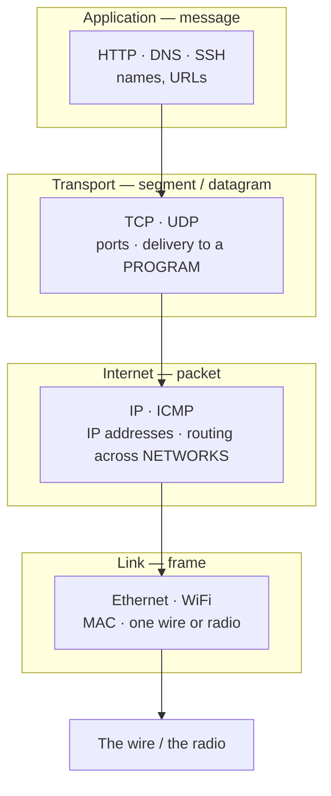
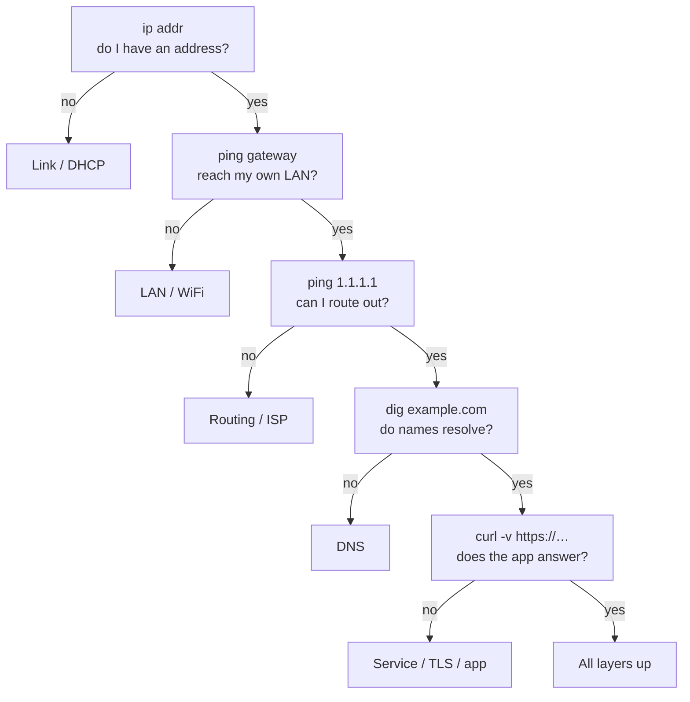

# Module 14 — Networking

<small>Stage 4 · Advanced Topics · ~3 weeks at 4 h/day · Prerequisite — Module 13 (Netscope's engineered shell — the stubs this module fills with real network code). This module closes Stage 4.</small>

## Why this matters

**Networking** is how independent computers cooperate: an agreed stack of protocols — **layers**, each
solving ONE problem and trusting the layer below — that turns "electrical signals on a wire" into "an
HTTPS page in your terminal." This module teaches that stack not as trivia but as a **live system you
can interrogate on your own machine**: from an Ethernet frame up to a TLS handshake, each layer made
visible before the next is stacked on top of it.

Every remaining module stands on this one. SSH (M9) rides TCP; Docker (M16) builds virtual networks;
Kubernetes (M19–M20) is roughly **40% networking by weight**; observability (M25) watches these very
packets. And the debugging superpower it grants is immediate: *"is it DNS, the route, the port, or the
app?"* stops being an hour of guessing and becomes a **60-second ladder**. This is also where Stage 4
lands its finale — Netscope's four stubs (`dns`, `tcp`, `http`, `trace`) get their organs, and the
stage closes with a tool that *proves* both this module and M13.

!!! info "What this unlocks"
    M15 automates calls to network services · M16–M18 (Docker) publish ports = the NAT you now
    understand · M19–M20 (Kubernetes) is Services, Ingress, and NetworkPolicy — **this module wearing new
    names** · M24 turns your listener audit into security policy · M25 watches this exact traffic · M28
    (AI infrastructure) lives and dies by interconnect bandwidth. Learn the layers as inspectable
    mechanisms now, and every later "network problem" is just a known failure mode with a known tool.

---

## Watch

*Watch once, then rely on the notes below — you should never need to rewatch.*

<div class="lo-video-placeholder" markdown="1">
<span class="lo-play">▶</span>
**Explainer video — coming**
<small>Record per <code>../media/README.md</code>, upload to YouTube, then replace this card with the embed.</small>
</div>

??? note "For the author — drop-in YouTube embed (replace VIDEO_ID)"
    Once the explainer is on YouTube, replace the placeholder card above with:
    ```html
    <div class="lo-video-embed">
      <iframe src="https://www.youtube-nocookie.com/embed/VIDEO_ID"
              title="Module 14 — Networking"
              allow="accelerometer; autoplay; clipboard-write; encrypted-media; gyroscope; picture-in-picture"
              allowfullscreen></iframe>
    </div>
    ```
    Video script beats (from the blueprint's Definition / Architecture / Misconceptions):
    the postal-system analogy for layers (each level ignores the ones above and below) → encapsulation as
    nested envelopes, one `tcpdump` showing all four at once → names vs addresses vs routes (three
    questions, three tools) → connectionless UDP vs connected TCP (why DNS and HTTP choose differently) →
    plaintext-by-default and why TLS exists → the five-command debugging ladder as the module's habit.

**Terminal cast — pending; record per `../media/README.md`.**

!!! tip "Follow along, don't just watch"
    Open the [Guided Lab](#guided-lab-inspect-your-own-stack) in a browser terminal and run each command
    yourself as it appears. You will inspect real interfaces, resolve real names, watch a real socket
    accept a real connection — typing beats watching every time, and it is part of how the memory forms.

---

## Key Notes

*Standalone. This is the reference you keep.*

### The picture: encapsulation down the stack



Your HTTP request is wrapped in a **TCP segment**, wrapped in an **IP packet**, wrapped in an **Ethernet
frame** — each layer adding its own header like nested envelopes, each stripped by the matching layer on
the far side. A switch reads only the frame; a router reads only the packet; the far host peels all four
and hands the bytes to the listening program. One `tcpdump` capture shows every envelope at once —
learning to read that capture is most of the module.

### The four layers — one table to keep

The practical model is **4 working layers** (not OSI's ceremonial 7). Each has its own unit, its own
address type, its own failure modes, and its own inspection tool:

| Layer | Unit | Solves | Address | Inspect with |
|---|---|---|---|---|
| **Application** (HTTP, DNS, SSH) | message | meaning | names, URLs | `curl -v`, `dig` |
| **Transport** (TCP, UDP) | segment / datagram | delivery to a **program** | ports | `ss`, `nc` |
| **Internet** (IP, ICMP) | packet | delivery across **networks** | IP addresses | `ip`, `ping`, `traceroute` |
| **Link** (Ethernet, WiFi) | frame | delivery on **one wire** | MAC addresses | `ip link`, `tcpdump -e` |

Because a layer only talks to its neighbours, you can debug one **without** understanding everything
above it — which is exactly why WiFi swaps for Ethernet without HTTP ever noticing.

### Names vs addresses vs routes — three questions, three tools

- **Names** (who?) — DNS is the distributed phonebook: stub resolver → caching resolver → root → TLD →
  authoritative, each hop cacheable with a **TTL**. `dig` interrogates it; `dig +trace` walks it by hand.
- **Addresses** (where?) — a 32-bit IPv4 dotted quad with a **CIDR** split into network + host bits
  (`192.168.1.0/24`). Private ranges (RFC 1918: `10/8`, `172.16/12`, `192.168/16`) are NAT'd behind one
  public address. `ip addr` shows yours.
- **Routes** (how do I get there?) — every host has a route table (`ip route`); the **default gateway**
  is "everything I don't recognise goes here." `ip route` reads it.

Three different questions, three different failure modes, three different tools — keeping them apart is
half of network debugging.

### TCP vs UDP — connected vs connectionless

**TCP** is the reliability machine: a three-way handshake (**SYN → SYN-ACK → ACK**) opens the
connection, sequence numbers name every byte, ACKs confirm receipt, timers resend what's lost, and a FIN
tears it down. **UDP** is a datagram — no connection, no guarantee, no order; cheap and honest. Choosing
between them is engineering, not preference:

- **DNS rides UDP** — one tiny query, one tiny answer; a handshake would triple the cost, and retry is
  trivial at the application.
- **HTTP requires TCP** — arbitrary-size, ordered payloads where loss and reordering must be handled
  invisibly. That is exactly TCP's product.

### Ports & sockets — the program's mailbox

A **port** is a program's mailbox number (0–65535; below 1024 is **privileged** — M3's permissions
reappear). A **socket** is the full tuple `(protocol, local addr:port, remote addr:port)`. `ss -tlnp`
reads the mailbox directory — every LISTEN socket on your machine, and (with privilege) the process
behind each. Some ports you already know:

| Port | Proto | Service | Note |
|---|---|---|---|
| 22 | TCP | SSH | M9's transport — `git push` rides this |
| 53 | UDP (→TCP) | DNS | UDP by default; TCP for big answers |
| 67 / 68 | UDP | DHCP | how you got an address without configuring one |
| 80 | TCP | HTTP | plaintext — readable in `tcpdump` |
| 443 | TCP | HTTPS | HTTP wrapped in TLS |

A **loopback bind** (`127.0.0.1:8080`) is reachable only from this machine, by design — reading a LISTEN
state as "reachable from outside" is a classic mistake.

### The debugging ladder — the habit-deliverable

Five commands, one minute, failure localised to a **layer**. This is the module's single most useful
reflex — drilled until automatic, and encoded as `netscope trace`:



The first failing step names the layer. `ping HOST` succeeding but `curl http://HOST` timing out is not
a contradiction — ICMP proves the route; it says nothing about whether a program owns the port.

### The operator's kit — tool to layer

The tools you will actually reach for, mapped to what they show (the deprecated ancestors are recognised
in old docs, never used):

| Tool | Layer it reads | What it tells you | Replaces |
|---|---|---|---|
| `ip addr` / `ip route` / `ip neigh` | Link + Internet | interfaces, addresses, routes, ARP cache | `ifconfig` |
| `ss -tlnp` | Transport | every listener + its process | `netstat` |
| `dig` | Application (DNS) | resolution, records, the walk (`+trace`) | `nslookup` |
| `curl -v` / `-w` | Application (HTTP/TLS) | request, response, the timing waterfall | — |
| `tcpdump` | all four at once | the raw packets on the wire | — |

<div class="lo-remember" markdown="1">
**Must remember (if you keep only seven things):**

1. **Four layers, each solving ONE problem:** Application/message · Transport/segment · Internet/packet · Link/frame. Names → ports → IP addresses → MACs.
2. **Encapsulation is nested envelopes.** Read a capture by peeling them; each device opens only its own.
3. **Names vs addresses vs routes** — three questions (who / where / how), three tools: `dig` · `ip addr` · `ip route`.
4. **UDP is honest, TCP makes promises.** DNS rides UDP; HTTP rides TCP — and you can say *why*.
5. **A port is a program's mailbox; `ss -tlnp` reads the directory.** A `127.0.0.1` bind is local-only by design.
6. **The ladder:** `ip addr` → `ping gateway` → `ping 1.1.1.1` → `dig name` → `curl -v URL`. First failure names the layer.
7. **Everything below TLS is plaintext** — every hop can read it. `tcpdump` on your own loopback proves it once, and the lesson sticks.
</div>

---

## Guided Lab: inspect your own stack

*Basic, step-by-step. You inspect your machine's interfaces and routes, resolve names, run a real local
server, and watch a socket accept a real connection. Everything runs on YOUR machine and YOUR loopback —
capture ethics are simple and binding: **your machine, your traffic, full stop**.*

<div class="lo-lab-actions" markdown="1">
[▶ Open interactive lab](https://killercoda.com/learning-os/course/killercoda/module-14){ .lo-btn target=_blank }
[⧉ Open in Codespaces](https://codespaces.new/randaguiac20/learning-os){ .lo-btn target=_blank }
[⌨ Run locally](#run-locally){ .lo-btn .lo-btn--ghost }
[View lab source](https://github.com/randaguiac20/learning-os/tree/main/killercoda/module-14){ .lo-btn .lo-btn--ghost target=_blank }
</div>

<span id="run-locally"></span>
!!! tip "Three ways to run this lab — pick any (all free)"
    - **Instant, no account** — click **Open interactive lab** (Killercoda): a real Linux terminal in your browser, with its own interfaces, routes, and loopback to inspect.
    - **Your own cloud** — click **Open in Codespaces**: runs in your GitHub account's free tier (120 core-hrs/mo).
    - **Local, unlimited, $0** — any Linux / macOS / WSL terminal, or a throwaway container: `docker run -it ubuntu bash`, then install the tools in step 1 and follow along.

    Killercoda is the zero-setup on-ramp; Codespaces and local use *your own* free resources, so they scale to any class size.

=== "1 · Your machine's network identity"
    Install the toolkit, then read your own stack from the link layer up:
    ```bash
    sudo apt-get update -qq && sudo apt-get install -y iproute2 dnsutils tcpdump curl netcat-openbsd
    ip addr        # interfaces + IP addresses (find lo = 127.0.0.1, and your real one)
    ip link        # link state + MAC addresses
    ip route       # the route table — which line is the default gateway?
    ip neigh       # the ARP cache: IP → MAC on the local link
    ```
    Journal: which of your addresses is **RFC 1918 private** (`10.`, `172.16–31.`, `192.168.`)? Which
    interface carries the **default** route — the "everything I don't recognise goes here" line?

=== "2 · Names — DNS and the /etc/hosts override"
    Resolve a name the normal way, then read the answer in full:
    ```bash
    dig +short example.com          # just the A record(s)
    dig example.com                 # read EVERY section: question/answer/authority/additional + TTL
    getent hosts example.com        # what the system resolver returns (nsswitch order)
    ```
    Now the override rig — `/etc/hosts` is consulted **before** DNS, so you can fake a name locally:
    ```bash
    echo "127.0.0.1 lab.local" | sudo tee -a /etc/hosts
    getent hosts lab.local          # resolves to 127.0.0.1 — your entry won
    ```
    Journal: the TTL in `dig` **counts down** on repeat queries — that is caching, live. `/etc/hosts`
    winning over DNS is the `nsswitch.conf` lookup order in action.

=== "3 · Sockets — start a listener, read the directory"
    Start a real HTTP server in the background, then find its socket:
    ```bash
    nohup python3 -m http.server 8080 >/tmp/http.log 2>&1 &
    sleep 1
    sudo ss -tlnp                   # every LISTEN socket — find :8080 and its process
    sudo ss -tlnp 'sport = :8080'   # just that one: note the bind address
    ```
    A `0.0.0.0:8080` bind listens on every interface; a `127.0.0.1:8080` bind is loopback-only. `-t` tcp
    · `-l` listening · `-n` numeric · `-p` process. **Leave the server running** — steps 4 and 5 use it.

    Click **Check** to verify your local server is up and reachable.

=== "4 · Make a request — end to end"
    Hit the server by its real name (resolved through the `/etc/hosts` entry from step 2) and read the
    exchange with `-v`:
    ```bash
    curl -v http://lab.local:8080/          # -v shows the request line + response headers
    curl -sI http://lab.local:8080/         # headers only
    ```
    Read `curl -v` like a transcript: lines with `>` are what **you** sent, lines with `<` are what the
    **server** said. The name `lab.local` resolved locally, TCP connected to `127.0.0.1:8080`, and HTTP
    carried the request as plain text.

    Click **Check** to verify `lab.local` resolves and the request succeeds.

=== "5 · Watch the packets, then the ladder"
    Capture your own loopback traffic while a request happens — the envelopes, live:
    ```bash
    sudo tcpdump -i lo -n -c 10 port 8080 &   # capture 10 packets on loopback
    sleep 1
    curl -s http://lab.local:8080/ >/dev/null # generate the traffic
    sleep 1                                    # let the capture print
    ```
    You'll see the **SYN → SYN-ACK → ACK** handshake, then the HTTP exchange, then the FIN. Now run the
    **debugging ladder** top to bottom and name the layer each command tests:
    ```bash
    ip addr | grep inet          # 1. address?
    ip route | grep default      # 2. gateway/route?
    dig +short example.com       # 3-4. names resolve?
    curl -sI http://lab.local:8080/  # 5. does the app answer?
    ```

!!! success "You can stop here and have learned something real"
    If you can read your own addresses and routes, resolve a name and fake one with `/etc/hosts`, find a
    listener with `ss`, drive a request with `curl -v`, and watch a handshake in `tcpdump` — the guided
    lab is done. Now make it harder.

---

## Solo Lab: figure it out

*Harder. Goals only — minimal hand-holding. Everything stays on your own machine and loopback. Struggle
here is the point; reveal a hint only after you've tried.*

### Challenge 1 — Subnet by hand, then verify
For `192.168.10.0/24`: how many usable host addresses, and what are the network and broadcast
addresses? Compute it on paper first, then verify with a tool.

??? tip "Hint"
    `/24` means 24 network bits, leaving 8 for hosts. Reach for Python's stdlib `ipaddress` module — no
    install needed.

??? success "Solution"
    ```bash
    python3 -c "import ipaddress; n=ipaddress.ip_network('192.168.10.0/24'); print(n.network_address, n.broadcast_address, n.num_addresses-2)"
    ```
    8 host bits → 256 addresses, minus network (`.0`) and broadcast (`.255`) = **254 usable**. The `/N`
    is the split point: everything left of it is the network, everything right addresses a host inside it.

### Challenge 2 — Refused vs timeout, made concrete
Produce, on your own rig, one connection that is **refused** and one that **times out** — and state what
each tells you about the far end.

??? tip "Hint"
    A port with nothing listening on a live host answers instantly. A routable-but-dead address (RFC 5737
    reserves `192.0.2.0/24` for exactly this) never answers.

??? success "Solution"
    ```bash
    nc -zv 127.0.0.1 9   # refused: something is home, but no one owns port 9 → instant RST
    nc -zv -w 3 192.0.2.1 80   # timeout: the packet is dropped/black-holed → silence
    ```
    **Refused** = the host answered with a RST — fast and honest, nothing is listening. **Timeout** =
    silence — a firewall dropped it or the route black-holes; you cannot tell empty from ignoring from
    gone. Two different failures, two different next steps.

### Challenge 3 — Prove HTTP is just text over a socket
Without `curl`, fetch a page (or your own step-3 server) by typing the HTTP request yourself.

??? tip "Hint"
    `nc` (netcat) is a raw socket you drive by hand. An HTTP/1.1 request is a request line, a `Host:`
    header, and a blank line.

??? success "Solution"
    ```bash
    printf 'GET / HTTP/1.1\r\nHost: lab.local\r\nConnection: close\r\n\r\n' | nc 127.0.0.1 8080
    ```
    You typed the exact bytes `curl` sends. HTTP/1.1 is **readable text over a TCP socket** — after this,
    `curl` is never magic again. The `Host:` header is what lets one IP serve a thousand sites.

### Challenge 4 — The two TTLs
A `dig` answer shows `TTL 300`; a `traceroute` (or `ping -t`) mentions TTL too. They are different
things — name each precisely.

??? success "Solution"
    - **DNS TTL** — a **cache lifetime in seconds**: how long a resolver may reuse this answer before
      asking again (300 s here). This is why a changed record isn't instant — caches honour the *old*
      TTL. ("Propagation" is a myth; it's cache expiry.)
    - **IP TTL** — a **hop budget**: each router decrements it, and at zero sends back ICMP
      time-exceeded. Traceroute abuses this — TTL 1, 2, 3… — to map the path *from the errors*.

    Same three letters, unrelated meanings — disambiguate them on sight.

### Challenge 5 (stretch) — Time the waterfall
Use `curl`'s timing output to break one request into its cost stages, and say which round trips
dominate.

??? success "Solution"
    ```bash
    curl -w 'dns=%{time_namelookup} connect=%{time_connect} tls=%{time_appconnect} firstbyte=%{time_starttransfer} total=%{time_total}\n' -o /dev/null -s https://example.com
    ```
    `namelookup` (DNS) → `connect` (one RTT: the TCP handshake) → `appconnect` (TLS adds ~2 more RTTs) →
    `starttransfer` (one more RTT + server think time). **Round trips dominate** — the fix family is
    *fewer* of them (keep-alive, TLS resumption, a closer endpoint), not more bandwidth.

---

## Self-Check

*Close the notes. Answer aloud or in writing **first**, then reveal. Recalling — even when it's hard —
is what builds the memory.*

??? question "Name the four layers, the unit at each, and the address type each uses."
    **Application** (message; names/URLs) · **Transport** (segment/datagram; ports) · **Internet**
    (packet; IP addresses) · **Link** (frame; MAC addresses). Each solves one problem and trusts only its
    neighbour below.

??? question "What is encapsulation? Walk one HTTP GET to the wire."
    Each layer wraps the layer above with its own header — nested envelopes. The GET (message) goes into
    a **TCP segment** (ports, sequence numbers), into an **IP packet** (source/dest IP), into an
    **Ethernet frame** (MACs, next hop), onto the wire. Each device peels only the layer it needs; the far
    host peels all four and delivers the bytes to the listening program.

??? question "Why does DNS default to UDP while HTTP requires TCP?"
    DNS is one tiny query and one tiny answer — a TCP handshake would triple the cost, and retry-on-loss
    is trivial at the application. HTTP carries arbitrary-size, ordered payloads where loss and reordering
    must be handled invisibly — exactly TCP's product. (DNS falls back to TCP for large answers.)

??? question "`ping HOST` works but `curl http://HOST` times out. Which layer, and how do you tell why?"
    ICMP proved the **route** (Internet layer); the failure is at **transport/application**. Two
    explanations: no program is listening on port 80, **or** a firewall silently drops TCP :80 while
    allowing ICMP. Distinguish with `ss -tlnp` on the host (is there a listener?) plus `nc -zv HOST 80`
    from outside (refused = nothing listening; timeout = filtered).

??? question "A service shows LISTEN in `ss -tlnp` but the phone on your LAN can't reach it. Two ladder-ordered causes."
    (1) It's bound to **`127.0.0.1`**, not the LAN interface — loopback is local-only by design (`ss`
    shows the bind address). (2) The **firewall** is default-deny with no allow rule for that port
    (`ufw status`). LISTEN means "a program owns the port here," not "reachable from outside."

??? question "You fixed a DNS record an hour ago; some users still hit the old address. Explain — without the word 'propagation'."
    Caches honour the **old record's TTL**: any resolver that fetched before the change serves the cached
    answer until it expires. Users behind resolvers that never cached it get the new answer immediately —
    hence *some* users. The fix pattern is to **lower the TTL before** a planned change.

??? question "The two TTLs — name each and a bug each causes."
    **DNS TTL** = cache lifetime in seconds → the "why isn't my DNS change live?" confusion (it's cache
    expiry). **IP TTL** = per-packet hop budget → traceroute's whole trick, and "TTL exceeded" on a
    routing loop. Same letters, unrelated meanings.

!!! example "Teach it back (the real test)"
    Out loud, in **4 minutes, no notes**: *"What actually happens when you load a web page?"* The
    **postal analogy** must appear — phonebook (DNS), a reliable pipe dialed (TCP), sealed envelopes
    inside envelopes (encapsulation, TLS) — and then **yield to mechanism**: name the layers, the
    handshake, where the analogy breaks (packets race, arrive out of order, get re-sent; letters don't).
    Then, in **90 seconds**, teach *"refused vs timeout"* with the knocking-on-doors story — a shout of
    "wrong house!" versus dead silence — and show `nc -zv` giving each answer on your own rig. If you
    can't yet, reread the Key Notes — don't move on.

---

## Mastery checklist

*Tick these honestly, cold (no notes). They **gate** progress — passing M14 also closes **Stage 4**, and
Netscope v1.0 is the stage's proof artifact. A module is only "done" when every box is true.*

- [ ] **Explain** the 4-layer model with the unit, address, and tool at each layer — the blank drawn cold.
- [ ] **Describe** encapsulation on a real capture: point to the frame, packet, segment, and message.
- [ ] **Define** the vocabulary (CIDR, MTU, RTT, resolver, SNI, the two TTLs) on demand, ≥9/10.
- [ ] **Compare** TCP vs UDP as engineering trade-offs — the cost of guarantees vs the honesty of datagrams.
- [ ] **Contrast** refused vs timeout vs DNS-fail, each with its cause and its distinguishing command.
- [ ] **Identify** every listener on your machine with `ss -tlnp` and justify each one (the audit table).
- [ ] **Analyze** a pcap: locate the handshake, the data, the teardown, and one anomaly (a retransmit).
- [ ] **Debug** with the five-step ladder as reflex — the layer named BEFORE the fix, every time.
- [ ] **Test** reachability at the RIGHT layer (ICMP vs TCP connect vs an app-level check), and say why.
- [ ] **Implement** a request from raw bytes (via `nc` or a Python socket) — HTTP as text over a socket.
- [ ] **Secure** the machine: `ufw` default-deny live, every allow rule mapped to a listener you can name.
- [ ] **Deploy** Netscope v1.0 — `dns`/`tcp`/`http`/`trace` live, three TCP outcomes distinguished, `--json` valid, gate green, tagged.
- [ ] **Narrate** a famous outage in layer vocabulary (Facebook 2021: BGP withdrawn → DNS unreachable → cascading timeouts).
- [ ] **Teach:** pass the six teach-back tasks (≥4 avg, none below 3) — the postal and knocking analogies deployed AND bounded.

---

## Review — lock it in

Spaced repetition is where the memory forms. **Interleaving stays active** — every M14 review also pulls
one item from Module 13 (the shell this module fills). This module closes Stage 4, so the **stage**
review applies alongside the module reviews. Schedule these and *keep* them:

| When | Do | Interleaved M13 item |
|---|---|---|
| **Day 7** | Stack + envelope blanks · ladder sprint · validation A1–A2, B5 | Netscope gate blank (typed results + the contract) |
| **Day 14** | Handshake + DNS-walk blanks · `dig` and `ss` sprints · validation B3–B4, C6 | Package/`--json` contract recitation |
| **Day 21 (gate)** | All five blanks · all sprints · validation E13–E15, J25 · **STAGE 4 GATE** | Class-law recitation · recreate-drill on the netscope venv |
| **Day 3** | The ladder run on a real (or planted) issue · one fresh capture read | Netscope: TDD one tiny check |
| **Day 7** | Planted-fault set re-run cold (hosts poison · firewall block · dead resolver) | Netscope run + one enhancement under the gate |
| **Day 30** | Full validation retake (target ≥90) · the `curl -w` waterfall re-measured vs baseline | Third-tool packaging drill |

**Connects forward to:** M15 (automation that calls network services · Netscope's timer is the first
scheduled network job) · M16–M18 (Docker networking — bridges, veth, published ports = NAT you now
understand) · M19–M20 (Kubernetes Services, Ingress, NetworkPolicy — this module renamed) · M24
(security formalises the listener audit and TLS policy) · M25 (observability of this exact traffic) ·
M28 (interconnects at datacenter scale — the same layers at 400 Gb/s).

!!! quote "The one-sentence takeaway"
    M14 makes the invisible layer inspectable — names, routes, ports, and packets each with a tool and a
    failure mode — closing Stage 4 with Netscope as proof: network knowledge, engineered into software
    you shipped.
