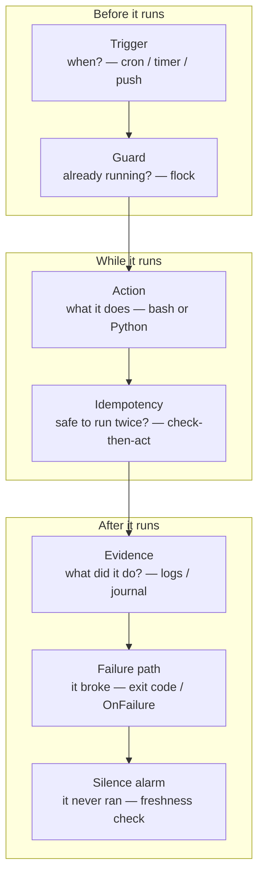
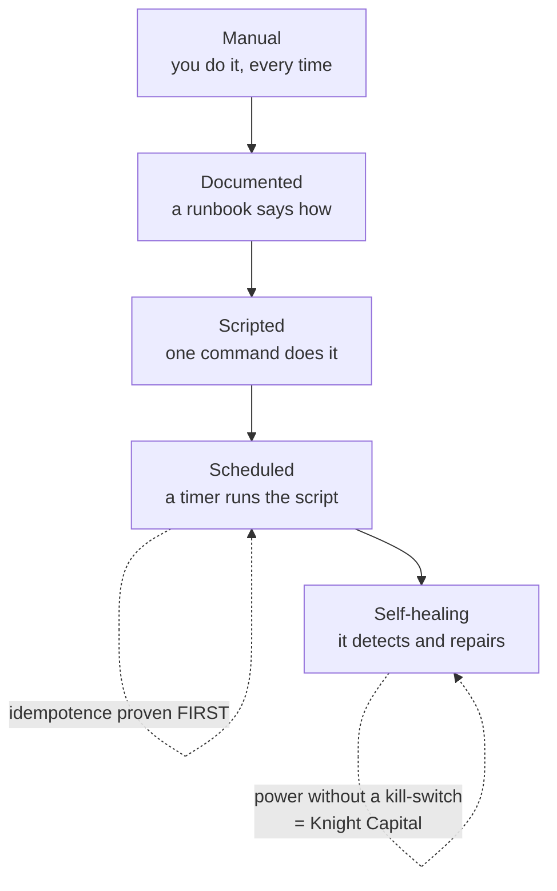
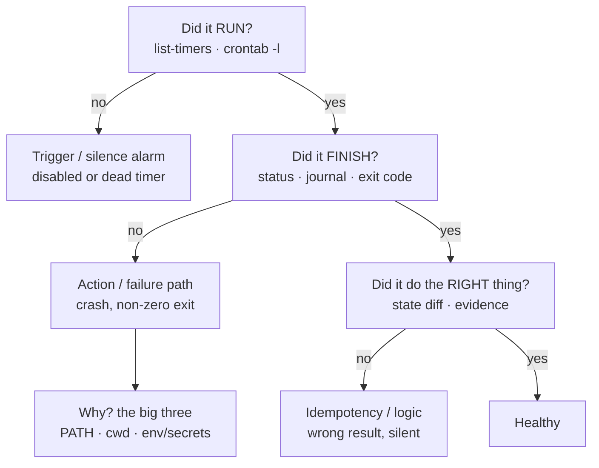

# Module 15 — Automation

<small>Stage 5 · Production Practices · ~2 weeks at 4 h/day · Prerequisite — Module 14 (Networking — Netscope's timer is the first scheduled network job you productionize here). This module opens Stage 5.</small>

## Why this matters

**Automation** is making work happen correctly **without you present**: scripts promoted to systems that
are *idempotent* (safe to re-run), *observable* (logged, alerting on silence), *defensive* (locks,
timeouts, retries), and *tested* — scheduled by machinery you trust and treated as production software,
because that is exactly what it is.

You already automate — M4's timers, M5's scripts, M14's net-log. This module adds the **engineering**:
the difference between a script that worked *while you watched it* and a system that works at **3 a.m.
unwatched**. It is also the SRE profession's entry door (toil elimination is the discipline's founding
idea) and Stage 5's opening move — "Ship It" needs build automation before Docker gives it a hull.
Everything after this module (images, clusters, ML pipelines) is automated or it doesn't exist.

!!! info "What this unlocks"
    M16–M18 (Docker) — `docker build` is a `build.sh` with layers, run by CI on every tag · M19–M20
    (Kubernetes) — a **CronJob** is your unit-pair and a **controller** is convergence running forever ·
    M24 puts security scans on these same timers · M25 replaces your freshness ledger with Prometheus and
    Grafana — *same concepts, new tools* · M26–M28 (ML pipelines) are DAGs of exactly these
    seven-organ jobs. Learn the job shape once and every later system is just this shape at a new scale.

---

## Watch

*Watch once, then rely on the notes below — you should never need to rewatch.*

<div class="lo-video-placeholder" markdown="1">
<span class="lo-play">▶</span>
**Explainer video — coming**
<small>Record per <code>../media/README.md</code>, upload to YouTube, then replace this card with the embed.</small>
</div>

??? note "For the author — drop-in YouTube embed (replace VIDEO_ID)"
    Once the explainer is on YouTube, replace the placeholder card above with:
    ```html
    <div class="lo-video-embed">
      <iframe src="https://www.youtube-nocookie.com/embed/VIDEO_ID"
              title="Module 15 — Automation"
              allow="accelerometer; autoplay; clipboard-write; encrypted-media; gyroscope; picture-in-picture"
              allowfullscreen></iframe>
    </div>
    ```
    Video script beats (from the blueprint's Definition / Architecture / Misconceptions):
    the "mopping under a leaking pipe" picture of toil → the seven organs, each introduced by the failure
    it prevents (overlap → lock; crash → atomic marker; silence → freshness) → idempotence as the *license
    to schedule*, proven by the run-twice diff → why the default flipped from cron to systemd timers →
    "declare state, don't script steps" with an Ansible play converging twice → the three-signal law
    (success quiet, failure loud, silence alarmed) as the close.

**Terminal cast — pending; record per `../media/README.md`.**

!!! tip "Follow along, don't just watch"
    Open the [Guided Lab](#guided-lab-schedule-a-job-then-converge-with-ansible) in a browser terminal and
    run each command yourself as it appears. You will write a real script, put it on a schedule, and watch
    an Ansible play converge to zero changes on its second run — typing beats watching every time, and it
    is part of how the memory forms.

---

## Key Notes

*Standalone. This is the reference you keep.*

### The picture: the seven organs of a production job

Every job this module ships has all seven organs. Miss one and you have a script, not a system —
each missing organ is a specific 3 a.m. failure waiting to happen.



The first four keep a run *correct*; the last three make an unattended run *knowable*. The silence alarm
is the one beginners skip and professionals never do — it catches the failure class the other six can't
see: the job that **stopped running in March and nobody noticed until July**.

### Idempotence — the license to schedule

**Idempotent** means *f(f(x)) = f(x)*: running twice equals running once. Only re-runnable jobs may be
scheduled — everything else is a loaded gun on a timer. The standard proof is the **run-twice diff**:
execute, snapshot the state, execute again, diff — an empty diff is the license. Write jobs by
**checking state then acting**, not by blindly repeating steps:

| Intent | Naive (breaks on re-run) | Idempotent pattern |
|---|---|---|
| Add a line to a file | `echo 'x' >> f` (appends every run) | `grep -qxF 'x' f \|\| echo 'x' >> f` |
| Create a directory | `mkdir d` (errors if it exists) | `mkdir -p d` |
| Create a symlink | `ln -s t l` (errors on the 2nd run) | `ln -sf t l` |
| Sync a tree | hand-copy changed files | `rsync -a src/ dst/` (converges) |
| Mark work done | write the marker first | do the work, `mv` the marker into place **last** (atomic) |

The last row is the crash lesson: a marker written *before* the work lies after a crash. Write it (or
move the result into place) **last**, via an atomic `mv` on the same filesystem — then the marker exists
fully or not at all.

### Scheduling — cron read fluently, timers chosen deliberately

Two schedulers. **cron** is everywhere and you must read it; **systemd timers** are what you reach for,
because cron's silences are exactly the failures this module hunts.

| | cron | systemd timer |
|---|---|---|
| Define | `crontab -e`, five fields | a `.timer` + `.service` unit pair |
| When | `30 3 * * 1-5` (min hr dom mon dow) | `OnCalendar=Mon..Fri 03:00` |
| Logging | none by default (mailed or discarded) | **journald** — queryable evidence |
| Missed while off | lost | **`Persistent=true`** catches up at wake/boot |
| Overlap guard | none (add your own `flock`) | systemd serialization + `flock` |
| Herd control | none | `RandomizedDelaySec=` spreads identical schedules |
| Status you can query | none | `systemctl status`, `list-timers` |
| Validate the expression | eyeball it | `systemd-analyze calendar "Mon..Fri 03:00"` |

The five cron fields are **minute · hour · day-of-month · month · day-of-week** — `30 3 * * 1-5` is
"03:30 on weekdays." The four OnCalendar workhorses: `Mon..Fri 03:00` (weekdays), `Sun 06:30` (weekly),
`*-*-01 12:00` (monthly, first at noon), `hourly`. Always **test the service by hand before arming the
timer** — `systemctl --user start job.service` runs it in the *exact* context the timer will.

### The three-signal law of unattended systems

Success is **quiet**, failure is **loud**, silence is **failure** — and each rule addresses a distinct
failure class:

- **Success quiet** — a job that emails you every night trains you to ignore its mail; then the one
  broken night is invisible in the noise. Alert fatigue is a real outage cause.
- **Failure loud** — a non-zero exit fires `OnFailure=` / a notification. This catches the runs that
  *ran and broke*.
- **Silence alarmed** — every job touches a freshness timestamp; a **second** job (the *dead-man's
  switch*) alarms when any timestamp ages past its budget. This is the only organ that catches the runs
  that **never happened** — a disabled timer, a crashed scheduler. `cron` mailing you errors is *not*
  monitoring: the dead timer sends no email.

### Declare state, don't script steps — config management and Ansible

Where a tool allows it, **describe the end state and let the tool diff** rather than choreographing
steps. `mkdir -p`, `ln -sf`, and `rsync` already think this way; **Ansible** industrializes it to whole
machines and fleets. A play is a list of *desired states* ("this directory exists", "this file has
exactly this content"); each **module** (`file`, `copy`, `lineinfile`, `apt`) checks reality and acts
only on the drift — so the **second run reports `changed=0`**. That is idempotence as a *product*, not a
discipline you hand-maintain.

| Imperative (a script) | Declarative (Ansible) |
|---|---|
| "run `mkdir`, then `cp`, then `chmod`…" | "the dir exists, the file has this content, mode 0644" |
| you handle the "already done" case | the module handles it — reports `ok` vs `changed` |
| re-run safety is your job to prove | re-run safety is the tool's contract |

You run a play against your own machine with no SSH via a local connection:
`ansible-playbook -i localhost, -c local play.yml` (the trailing comma makes `localhost` the whole
inventory; `-c local` skips SSH). `--check` is a **dry run** — the blast-radius habit before anything
destructive. Ansible/Puppet at fleet scale is "idempotence at scale" — the mental model you build here
transfers wholesale when M19's clusters give it targets.

### The automation ladder — climb one rung at a time

From SRE ch. 7: automate deliberately, never skipping rungs — self-healing before *scripted* is how you
build an outage multiplier.



Each rung earns the next: a job is *scripted* and proven idempotent **before** it is *scheduled*; nothing
is made *self-healing* until it has run scheduled long enough to trust. Automation that acts with power
but no kill-switch is the worst kind — **Knight Capital** lost \$440M in 45 minutes with humans watching,
unable to stop it.

### The unattended-failure drill ladder

When a job "didn't work," diagnose by evidence in order — **name the failed organ before you fix
anything**. Read the journal *before* you read the script.



"Works when I run it, fails on the timer" is almost always the **big three**: the unit's `PATH` is
minimal, its working directory isn't your home, and your interactive shell's env and secrets are absent.
The honest reproduction is to run it *the way the scheduler does* — not from your comfortable shell.

<div class="lo-remember" markdown="1">
**Must remember (if you keep only seven things):**

1. **The seven organs:** trigger · guard · action · idempotency · evidence · failure path · **silence alarm**. The last one catches the job that never ran.
2. **Idempotence is the license to schedule** — *f(f(x)) = f(x)*, proven by the **run-twice diff** (empty diff = license). Check-then-act, never blind-repeat.
3. **cron read fluently, timers chosen** — timers give logging, catch-up (`Persistent=`), serialization, and a status you can query. Validate with `systemd-analyze calendar`.
4. **Test the service before arming the timer** — the timer runs it in a bare context; the **big three** traps are PATH, cwd, and env/secrets.
5. **Success quiet · failure loud · silence alarmed** — three rules, three distinct failure classes; the silence alarm is the one nobody remembers and everybody needs.
6. **Declare state, don't script steps** — Ansible converges to `changed=0` on the second run; `--check` is your dry-run. Idempotence as a product.
7. **Climb the ladder one rung at a time** — manual → documented → scripted → scheduled → self-healing. Prove idempotence before scheduling; a backup untested-for-restore is a hope, not a backup.
</div>

---

## Guided Lab: schedule a job, then converge with Ansible

*Basic, step-by-step. You build a sandbox, prove idempotence by hand, put a script on a **cron** schedule
(the container-friendly scheduler), then write and run an **Ansible** play against localhost and watch it
converge to zero changes. Everything happens inside a throwaway `~/automation-lab/` sandbox — nothing
outside it is touched.*

<div class="lo-lab-actions" markdown="1">
[▶ Open interactive lab](https://killercoda.com/learning-os/course/killercoda/module-15){ .lo-btn target=_blank }
[⧉ Open in Codespaces](https://codespaces.new/randaguiac20/learning-os){ .lo-btn target=_blank }
[⌨ Run locally](#run-locally){ .lo-btn .lo-btn--ghost }
[View lab source](https://github.com/randaguiac20/learning-os/tree/main/killercoda/module-15){ .lo-btn .lo-btn--ghost target=_blank }
</div>

<span id="run-locally"></span>
!!! tip "Three ways to run this lab — pick any (all free)"
    - **Instant, no account** — click **Open interactive lab** (Killercoda): a real Linux terminal in your browser with `cron` and `ansible` a single `apt-get` away.
    - **Your own cloud** — click **Open in Codespaces**: runs in your GitHub account's free tier (120 core-hrs/mo).
    - **Local, unlimited, $0** — any Linux / macOS / WSL terminal, or a throwaway container: `docker run -it ubuntu bash`, then install the tools in step 1 and follow along.

    Killercoda is the zero-setup on-ramp; Codespaces and local use *your own* free resources, so they scale to any class size.

=== "1 · Set up the workshop"
    Install the two schedulers/tools and build your sandbox:
    ```bash
    sudo apt-get update -qq && sudo apt-get install -y cron ansible
    sudo service cron start          # start the cron daemon (no systemd in a container)
    mkdir -p ~/automation-lab && cd ~/automation-lab
    pwd                              # confirm: /root/automation-lab (or /home/<you>/…)
    ansible --version | head -1      # prove Ansible is installed
    ```
    `cron` is the scheduler; `ansible` is the config-management tool. In production you would prefer
    **systemd timers** (logging + catch-up) — but a container has no `systemd` as PID 1, so this lab uses
    cron, which runs anywhere. The concepts are identical.

=== "2 · Idempotence clinic — naive vs check-then-act"
    Watch a naive job damage itself on re-run, then fix it. First the naive version — run it twice and
    diff:
    ```bash
    echo 'role = worker' > config.txt              # start clean
    printf 'setup ran\n' >> config.txt             # NAIVE: append every run
    cp config.txt /tmp/after-run-1.txt
    printf 'setup ran\n' >> config.txt             # run it AGAIN
    diff /tmp/after-run-1.txt config.txt           # NOT empty — the line doubled
    ```
    Now the idempotent rewrite — check state, then act — and prove the diff is clean:
    ```bash
    echo 'role = worker' > config.txt              # reset
    grep -qxF 'setup ran' config.txt || echo 'setup ran' >> config.txt
    cp config.txt /tmp/after-run-1.txt
    grep -qxF 'setup ran' config.txt || echo 'setup ran' >> config.txt   # run AGAIN
    diff /tmp/after-run-1.txt config.txt && echo "IDEMPOTENT: second run changed nothing"
    ```
    The empty diff is the **run-twice proof** — the license to schedule. `mkdir -p` and `ln -sf` win the
    same way: they check before they act.

=== "3 · Put a job on a schedule (cron)"
    Write a small script — `set -euo pipefail` (M5), absolute paths, an idempotent log append — then
    **test it by hand before arming the schedule**:
    ```bash
    cat > ~/automation-lab/heartbeat.sh <<'EOF'
    #!/usr/bin/env bash
    set -euo pipefail
    log="$HOME/automation-lab/heartbeat.log"
    printf '%s heartbeat ok\n' "$(date -u +%FT%TZ)" >> "$log"
    EOF
    chmod +x ~/automation-lab/heartbeat.sh
    ~/automation-lab/heartbeat.sh          # MANUAL test first — the module's law
    cat ~/automation-lab/heartbeat.log     # one line proves the action works
    ```
    Now arm it — append a cron entry (every minute) without an editor, using absolute paths (cron's
    `PATH` is not your shell's):
    ```bash
    ( crontab -l 2>/dev/null; echo "* * * * * $HOME/automation-lab/heartbeat.sh" ) | crontab -
    crontab -l                              # confirm the entry is installed
    ```
    Watch it fire (wait ~60 s, optional): `sleep 65 && cat ~/automation-lab/heartbeat.log` — the log
    grows on its own. That growth *is* evidence, the fifth organ.

    Click **Check** to verify a cron entry for the script exists and it produced output.

=== "4 · Converge with Ansible — idempotence as a product"
    Write a play that declares *desired state* for three independent resources, then run it. First a run
    changes things; the second changes nothing:
    ```bash
    cat > ~/automation-lab/play.yml <<'EOF'
    - name: Converge the workshop state
      hosts: localhost
      connection: local
      gather_facts: no
      vars:
        base: "{{ lookup('env', 'HOME') }}/automation-lab/managed"
      tasks:
        - name: Ensure the managed directory exists
          file:
            path: "{{ base }}"
            state: directory
            mode: '0755'
        - name: Ensure app.conf has exactly this content
          copy:
            dest: "{{ base }}/app.conf"
            mode: '0644'
            content: |
              # Managed by Ansible — do not edit by hand
              role = worker
              retries = 3
        - name: Ensure a single owner line exists in notes.txt
          lineinfile:
            path: "{{ base }}/notes.txt"
            line: "owner = automation-lab"
            create: yes
    EOF
    ansible-playbook -i localhost, -c local ~/automation-lab/play.yml   # first run: changed>0
    ```
    Read the **PLAY RECAP**: the first run shows `changed=3`. Now run the *exact same command* again:
    ```bash
    ansible-playbook -i localhost, -c local ~/automation-lab/play.yml   # second run: changed=0
    ```
    `changed=0` on the second run is idempotence *proven by the tool* — you declared state, Ansible
    diffed reality and did nothing. Try the dry run too: `ansible-playbook -i localhost, -c local
    --check --diff ~/automation-lab/play.yml` predicts changes without making any.

    Click **Check** to verify the play applied its state and is idempotent (a fresh run reports `changed=0`).

=== "5 · The run-twice license, recapped"
    Look at what you built through the lens of the seven organs:
    ```bash
    crontab -l                               # TRIGGER — the schedule
    cat ~/automation-lab/heartbeat.log       # EVIDENCE — what it did
    ls -R ~/automation-lab/managed           # ACTION's result — converged state
    ansible-playbook -i localhost, -c local ~/automation-lab/play.yml | grep -A1 'PLAY RECAP'
    ```
    You proved idempotence two ways — by hand (the run-twice diff) and by tool (Ansible's `changed=0`).
    That proof is the *license to schedule*: only a job that survives its own second run belongs on a
    timer.

!!! success "You can stop here and have learned something real"
    If you can prove a job idempotent with a run-twice diff, put a tested script on a schedule with
    absolute paths, and write an Ansible play that converges to `changed=0` — the guided lab is done. Now
    make it harder.

---

## Solo Lab: figure it out

*Harder. Goals only — minimal hand-holding. Work inside your `~/automation-lab/` sandbox. Struggle here
is the point; reveal a hint only after you've tried.*

### Challenge 1 — Make a non-idempotent job safe
This job appends a PATH export to a profile every run: `echo 'export PATH=$PATH:/opt/tool/bin' >>
~/automation-lab/profile`. Rewrite it so a hundred runs leave exactly one line, and prove it.

??? tip "Hint"
    Check whether the exact line is already present *before* appending it. `grep` has a flag for
    whole-line, literal matching; `||` runs the append only when the check fails.

??? success "Solution"
    ```bash
    line='export PATH=$PATH:/opt/tool/bin'
    grep -qxF "$line" ~/automation-lab/profile 2>/dev/null || echo "$line" >> ~/automation-lab/profile
    # prove it: run the line above a second time, then:
    grep -cxF "$line" ~/automation-lab/profile   # → 1, no matter how many runs
    ```
    `-q` quiet, `-x` whole line, `-F` literal string. Check-then-act converts "append blindly" into a
    convergent operation — the file reaches one desired state and stays there.

### Challenge 2 — A crash-honest marker
Write a job that does "expensive" work (a `sleep 2` then create `result.txt`) and drops a `done.marker`
so it skips the work next time. Make the marker **honest** if the job is killed mid-work.

??? tip "Hint"
    A marker written *before* the work lies after a crash. Do the work to a temporary name, then move it
    into place **last** — an atomic `mv` on the same filesystem either fully happens or doesn't.

??? success "Solution"
    ```bash
    if [ ! -f done.marker ]; then
      sleep 2 && echo "computed $(date -u +%FT%TZ)" > result.txt.tmp
      mv result.txt.tmp result.txt          # atomic — the last thing that happens
      : > done.marker                        # marker written LAST
    fi
    ```
    Kill it during the `sleep` and neither `result.txt` nor `done.marker` exists — a clean "never
    happened," so the re-run does the work correctly. A marker written first would have skipped a job that
    never finished.

### Challenge 3 — Read a foreign crontab and translate one line
Given the cron line `15 2 * * 6 /opt/backup.sh`, state in plain English when it runs, and write the
equivalent systemd-timer `OnCalendar=` expression.

??? success "Solution"
    Fields are **minute hour day-of-month month day-of-week**, so `15 2 * * 6` = **02:15 every Saturday**
    (`6` = Saturday; `0`/`7` = Sunday). The timer equivalent:
    ```text
    OnCalendar=Sat 02:15
    ```
    Validate before trusting it: `systemd-analyze calendar "Sat 02:15"` prints the next elapses. Cron's
    fields are positional and unforgiving; the OnCalendar form is self-documenting — half the reason the
    default flipped.

### Challenge 4 — Add a fourth idempotent task to your play
Extend `play.yml` so it also guarantees a `logs/` subdirectory under `managed/` **and** ensures the
system has the `tree` package's binary available — then prove the whole play still reports `changed=0` on
a second run.

??? tip "Hint"
    The `file` module makes directories; the `apt` module (with `become: yes`) manages packages. Both are
    idempotent by design — the second run should be a no-op.

??? success "Solution"
    ```yaml
        - name: Ensure the logs subdirectory exists
          file:
            path: "{{ base }}/logs"
            state: directory
            mode: '0755'
        - name: Ensure tree is installed
          become: yes
          apt:
            name: tree
            state: present
            update_cache: yes
    ```
    First run: `changed` rises. Second run: `changed=0` — `file` sees the dir already there, `apt` sees
    `tree` already `present`. **Declaring state** means the tool, not you, handles the "already done" case
    — which is exactly why the play is safe to schedule.

### Challenge 5 (stretch) — A one-line dead-man's switch
Your `heartbeat.sh` writes a timestamp every minute. Write a *second* check that alarms (prints `STALE`
and exits non-zero) if the last heartbeat is more than 3 minutes old — the silence alarm, by hand.

??? success "Solution"
    ```bash
    log="$HOME/automation-lab/heartbeat.log"
    budget=180                                   # 3 minutes, in seconds
    last=$(stat -c %Y "$log")                    # mtime of the evidence file
    age=$(( $(date +%s) - last ))
    if [ "$age" -gt "$budget" ]; then echo "STALE: ${age}s old"; exit 1; else echo "fresh: ${age}s"; fi
    ```
    This is the seventh organ in miniature: a job whose only purpose is to notice **absence**. Disable the
    heartbeat's cron entry (`crontab -r`), wait past the budget, and this alarms — catching the failure a
    disabled timer would otherwise hide forever. (`healthchecks.io` is this mechanism, hosted.)

---

## Self-Check

*Close the notes. Answer aloud or in writing **first**, then reveal. Recalling — even when it's hard —
is what builds the memory.*

??? question "Name the seven organs of a production job, and the one class of failure only the last one catches."
    **Trigger · guard · action · idempotency · evidence · failure path · silence alarm.** The silence
    alarm (a freshness / dead-man's check) is the only organ that catches the run that **never happened** —
    a disabled timer or crashed scheduler — because there is no error to log when nothing ran.

??? question "Define idempotence formally and operationally. What is the standard proof?"
    Formally *f(f(x)) = f(x)* — a second run changes nothing. Operationally: safe to re-run anytime,
    including after a partial failure. The proof is the **run-twice diff**: execute, snapshot state,
    execute again, diff — an empty diff is the license to schedule.

??? question "Give four concrete reasons to prefer systemd timers over cron."
    Cron has **no logging** by default (output mailed or discarded), **no catch-up** for downtime, **no
    overlap guard**, and a **bare environment** (PATH surprises) with no queryable status. Timers add
    journald evidence, `Persistent=` catch-up, systemd serialization plus `flock`, unit-controlled env,
    and `systemctl status`/`list-timers` truth.

??? question "A job runs fine in your shell but fails on the timer. Name the big three causes and the honest way to reproduce it."
    **PATH** (the unit's is minimal — use absolute paths), **cwd** (not your home unless set), and
    **environment** (no interactive rc files, secrets absent). Reproduce it in the scheduler's *exact*
    context — `systemctl --user start job.service` (not from your comfortable shell).

??? question "Why is “success quiet, failure loud, silence alarmed” three rules and not one? What does each catch?"
    Quiet success prevents **alert fatigue** (noise trains you to ignore signals); loud failure catches
    the runs that **ran and broke**; the silence alarm catches the runs that **never happened** — the
    failure class the first two are blind to. Cron emailing errors is only the second rule; the dead timer
    sends no email.

??? question "What does “declare state, don't script steps” mean, and how does Ansible make idempotence visible?"
    You describe the desired **end state** (this dir exists, this file has this content) and let the tool
    diff reality and act only on drift — instead of choreographing steps and hand-handling the
    "already-done" case. Ansible makes it visible in the **PLAY RECAP**: a converged second run reports
    `changed=0` (everything `ok`, nothing changed).

??? question "Why is a backup that “succeeds every night” still not safe? Name the case study."
    A backup untested-for-restore is a **hope, not a backup** — the excludes, permissions, or archive
    readability can be wrong and you only learn it during the disaster. **GitLab, 2017:** five backup
    mechanisms, none restore-tested, none worked cleanly. The restore test *is* the backup.

!!! example "Teach it back (the real test)"
    Out loud, in **5 minutes, no notes** — *"The 3 a.m. test"*: put one naive script on screen and add the
    **seven organs** one at a time, each introduced by the concrete failure it prevents (overlap →
    `flock`; crash → atomic marker; silence → freshness), ending with the **run-twice diff as the license
    to schedule**. Then, in **90 seconds**, teach *"why alarm on silence?"* with the night-watchman story —
    a missing watchman and a silent one look identical unless he must check in — and show a freshness check
    catching a killed job. If you can't yet, reread the Key Notes — don't move on.

---

## Mastery checklist

*Tick these honestly, cold (no notes). They **gate** progress — passing M15 opens M16 (Docker), whose
builds ride these rails from day one. A module is only "done" when every box is true.*

- [ ] **Explain** toil and the seven organs, each motivated by the concrete failure it prevents.
- [ ] **Define** idempotence formally *and* operationally, and name the run-twice diff as its proof.
- [ ] **Identify** non-idempotent patterns on sight, and rewrite each with check-then-act.
- [ ] **Design** a crash-honest job — work to a temp name, atomic `mv` last — and prove it by killing it mid-run.
- [ ] **Compare** cron vs systemd timers as an engineering choice, with four concrete cron deficiencies.
- [ ] **Implement** a complete scheduled job with absolute paths, tested by hand *before* arming.
- [ ] **Build** an Ansible play that converges to `changed=0` on its second run, and read the PLAY RECAP.
- [ ] **Contrast** loud failure vs alarmed silence, and demonstrate a freshness/dead-man check firing.
- [ ] **Debug** works-manually-fails-on-timer by the big three (PATH, cwd, env), reproducing in the scheduler's context.
- [ ] **Analyze** an unattended failure by the drill ladder — the failed organ named *before* the fix.
- [ ] **Secure** secrets end to end (mode 600 · `EnvironmentFile=` · never argv · never git) and say why argv leaks.
- [ ] **Narrate** Knight Capital, GitLab 2017, or CrowdStrike 2024 in the module's vocabulary (blast-radius, restore test, kill-switch).
- [ ] **Teach:** pass "The 3 a.m. test" and the night-watchman explanation — organs motivated by failures, not listed as ceremony.

---

## Review — lock it in

Spaced repetition is where the memory forms. **Interleaving stays active** — every M15 review also pulls
one item from Module 14 (the network tools you now put on timers). This module opens Stage 5, so its rails
carry every later module's work. Schedule these and *keep* them:

| When | Do | Interleaved M14 item |
|---|---|---|
| **Day 1** | Organ + ladder blanks · the idempotency + OnCalendar sprints · validation A1–A2, C6 | The five-command debugging ladder, run cold |
| **Day 3** | Rewrite three naive jobs check-then-act, run-twice each · the secrets four-rules sprint | `ss -tlnp` listener audit from memory |
| **Day 7** | Stand up a fresh scheduled job with all organs in under an hour · fire-drill one planted fault | TCP vs UDP: why DNS and HTTP choose differently |
| **Day 14** | Ansible play from scratch to `changed=0` · the drill-ladder blank · validation E13–E15, J25 | Refused vs timeout, each with its distinguishing command |
| **Day 30** | Toil ledger re-measured (hours returned holding?) · full validation retake, target ≥90 | The `curl -w` timing waterfall re-read vs baseline |

**Connects forward to:** M16–M18 (Docker — image builds are automation; CI pushes images on tags) · M19–M20
(Kubernetes — CronJobs are your unit-pairs, controllers are convergence loops, declarative state is
concept 3 as an API) · M24 (security scans on these timers, secrets audited adversarially) · M25
(observability replaces the freshness ledger with Prometheus/Grafana — concepts named identically) ·
M26–M28 (ML pipelines are DAGs of seven-organ jobs, experiment tracking the evidence organ at research
scale).

!!! quote "The one-sentence takeaway"
    M15 turns scripts into systems — idempotent, evidenced, alarmed-on-silence — the rails every later
    module's work runs on, from image builds to ML pipelines.
