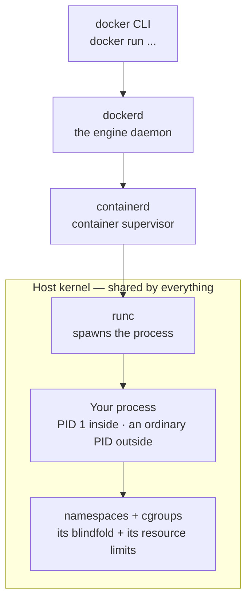
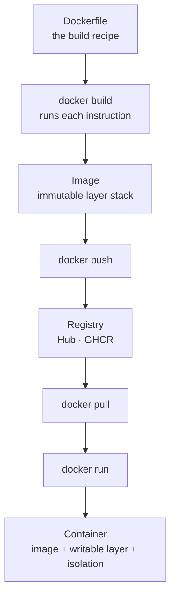

# Module 16 — Docker

<small>Stage 5 · Production Practices · ~3 weeks at 4 h/day · Prerequisites — M15 (the CI rails images ride), M14 (bridges, NAT, DNS — the networking chapter re-staged), M13 (the wheel the image carries), M1 (a container *is* a process).</small>

## Why this matters

**Docker** packages a process together with its entire userland — code, dependencies, filesystem,
config — into an **image** (an immutable, layered artifact) and runs it as a **container** (an isolated
process on a *shared* kernel). It is **not** a virtual machine: one kernel, many isolated userlands. The
isolation is ordinary kernel features (namespaces, cgroups — M17 dissects them); the *revolution* is the
artifact.

M13 built the wheel and M15 built the rail that ships it; this module builds the **hull that carries the
wheel**. The recreate-drills of the last stage proved environments must be rebuildable — containers make
the environment *shippable*: "works on my machine" becomes "runs from this digest, anywhere." The exact
same digest runs in CI, on your laptop, and in the cluster. Everything ahead assumes container literacy.

!!! info "What this unlocks"
    **M17** dissects the substrate under Docker (containerd · runc · OCI specs — your own images become
    the cadavers) · **M18** moves your dev loop *inside* a container (devcontainers) · **M19–20**
    (Kubernetes) orchestrate exactly these images — Deployments replace restart policies, Services
    replace `-p`, probes replace healthchecks · **M25** scrapes the cgroup numbers `docker stats` shows
    you · **M27–28** serve models from images built with this module's discipline. Learn to build,
    harden, and debug a container now, and every later platform is just orchestration on top.

---

## Watch

*Watch once, then rely on the notes below — you should never need to rewatch.*

<div class="lo-video-placeholder" markdown="1">
<span class="lo-play">▶</span>
**Explainer video — coming**
<small>Record per <code>../media/README.md</code>, upload to YouTube, then replace this card with the embed.</small>
</div>

??? note "For the author — drop-in YouTube embed (replace VIDEO_ID)"
    Once the explainer is on YouTube, replace the placeholder card above with:
    ```html
    <div class="lo-video-embed">
      <iframe src="https://www.youtube-nocookie.com/embed/VIDEO_ID"
              title="Module 16 — Docker"
              allow="accelerometer; autoplay; clipboard-write; encrypted-media; gyroscope; picture-in-picture"
              allowfullscreen></iframe>
    </div>
    ```
    Video script beats (from the blueprint's Definition / Architecture / Misconceptions):
    image vs container (the recipe vs the meal) → **a container is just a process** (find it in the
    host's `ps -ef --forest`, kill it by PID, watch `docker ps` agree) → layers and the cache-order law →
    Dockerfile + multi-stage hardening (deps-then-code, non-root `USER`, exec form) → port publishing is
    NAT you already understand (M14) → a compose rig by service name → the VM myth killed explicitly.

**Terminal cast — pending; record per `../media/README.md`.**

!!! tip "Follow along, don't just watch"
    Open the [Guided Lab](#guided-lab-your-first-images-and-containers) in a browser terminal and run
    each command yourself as it appears. Typing beats watching every time — and it is part of how the
    memory forms.

---

## Key Notes

*Standalone. This is the reference you keep.*

### The one demystifying fact: a container is a process



`docker run` does **not** boot a machine. The CLI asks `dockerd`, which asks `containerd`, which has
`runc` start **one ordinary process** — visible in the host's `ps`, killable by its host PID. What makes
it *feel* isolated is **namespaces** (its own view of files, network, PIDs) and **cgroups** (its resource
limits). A VM brings its own kernel and boots; a container shares the host kernel and starts in
milliseconds. Hold this and every misconception dissolves.

### Image vs container — recipe vs meal

The single most important distinction in the module:

| | Image | Container |
|---|---|---|
| **What it is** | Immutable, layered filesystem + metadata (entrypoint, config) | A running (or stopped) *instance*: image + a writable layer + namespaces/cgroups |
| **Analogy** | A class · a frozen recipe | An instance · a cooked meal |
| **Mutability** | Never changes — you build a *new* one | Disposable; you throw it away and run another |
| **Where change goes** | A new image (rebuild + replace) | The writable layer — **lost on removal** |
| **Survives `docker rm`?** | Yes (the image stays) | No (the writable layer dies) |

Containers are **cattle, not pets**: config lives in **env vars**, state lives in **volumes**, so
recreating a container loses nothing that matters. You never patch a running container — you build a new
image and replace it (M15's deploy-as-artifact, universalised).

### Layers are the economy

An image is a stack of **layers** — each layer is a content-addressed filesystem *diff* produced by one
Dockerfile instruction (think **git commits for filesystems**). Layers are billed three ways, and shared
by content address (same digest = same bytes, stored once):

- **Build time** — a cached layer is reused instead of rebuilt.
- **Disk** — each *unique* layer stored once; two images `FROM` the same base share it.
- **Network** — `push`/`pull` transfer only the layers you don't already have.

**Copy-on-write:** reads fall through the read-only stack to the first layer that has the file; the
*first write* copies that file up into the writable layer. Nothing is copied at start — that is why
containers launch in milliseconds, and why writing a lot *inside* a container is the smell of a missing
volume.

**The cache-order law:** a changed layer invalidates **every later layer**. So order instructions
**least-volatile first, most-volatile (your code) last** — copy dependency manifests and install deps
*before* copying source. Edit code and only one cheap layer rebuilds; put `COPY . .` above `pip install`
and you rebuild the install on every keystroke.

### The Dockerfile — the build recipe, read top to bottom

| Instruction | What it does | The rule you keep |
|---|---|---|
| `FROM` | Base image every layer builds on | **Pin it** (exact tag; digest for prod) — `latest` is "whoever pushed last" |
| `RUN` | Executes a command, freezes the result as a layer | Chain with `&&` so related work is one layer |
| `COPY` | Copies build-context files in | Prefer `COPY`; use `ADD` only for its auto-extract/URL trick, knowingly |
| `WORKDIR` | Sets the working directory | Use it instead of `RUN cd` |
| `ARG` / `ENV` | Build-time variable / runtime variable | `ARG` = build only · `ENV` = baked into the image **and its history** |
| `EXPOSE` | Documents a port | **Documentation only** — `-p` is what actually publishes |
| `USER` | Switches the user layers/process run as | Create a uid and `USER` it — **non-root in every image you author** |
| `ENTRYPOINT` / `CMD` | The program / its default args | **Exec form** `["prog","arg"]` so signals arrive (see below) |
| `HEALTHCHECK` | A command Docker runs to judge health | Make it *mean* something — not `exit 0` |

**Multi-stage builds** are the standard hull: a **builder** stage carries compilers and dev deps; the
**final** stage is a slim base that `COPY --from=builder`s only the runtime artifact — smaller image,
smaller attack surface. **Exec form vs shell form** decides `docker stop`: with exec form your process
*is* PID 1 and receives `SIGTERM` (clean stop); with shell form `/bin/sh` is PID 1, eats the signal, and
`docker stop` hangs the full 10-second grace before `SIGKILL` — the signature of a shell-form entrypoint.

### Registries — where images live

The whole lifecycle is one pipeline, with the registry in the middle:



An image name reads `registry/namespace/repo:tag@digest`. A **tag** is a *mutable pointer* (it can move
under you); a **digest** is the *immutable* content address. **Tags lie, digests don't** — pin by digest
for anything that ships, and take base-image updates as *reviewed* changes on a cadence, not silent
drift. The registry (Docker Hub, GHCR) is a package index with **all of PyPI's threat model** (M13):
popularity ≠ integrity, and pulling an image executes a whole userland — so prefer official/verified
images, pin digests, and scan.

### Volumes and networks

State and reachability both must be **declared explicitly** — the runtime forces it. Three ways to give
a container storage:

| Mount type | What it is | Use it for |
|---|---|---|
| **Named volume** | Docker-managed storage that outlives the container | **Persistent state** (databases, decks) — the portable default |
| **Bind mount** | A host path mapped straight in | Dev iteration (live source) — powerful but host-coupled |
| **tmpfs** | In-memory scratch, never on disk | Secrets/scratch that must not persist |

The over-mount footgun: bind-mounting an **empty** directory over the app's own path makes the app
"disappear." On networking, **publishing is NAT you already understand** — `-p 8080:80` writes a DNAT
rule that steers host `:8080` to the container's `:80`:


Two ports, easily confused: publish `8080:80`, then `curl :8080` on the **host** but `:80` **inside**.
On a **user-defined** network (which Compose creates for you) containers reach each other **by name** via
an embedded DNS resolver at **127.0.0.11**; the default bridge gives you IPs only. And the infamous
surprise: Docker's DNAT chain runs *before* ufw's `INPUT` chain, so a published `0.0.0.0` port bypasses a
firewall's default-deny — mitigate by publishing to `127.0.0.1` for host-only services.

### Compose — the multi-service rig in one file

`compose.yaml` declares **services**, **networks**, **volumes**, and `depends_on`. `docker compose up -d`
brings the whole rig up; services find each other by name; `depends_on` with a `condition:
service_healthy` fixes the *started ≠ ready* classic (the container is up, but the database process isn't
accepting connections yet). One concern per container; Compose *composes* them — the Unix-pipe philosophy
at service scale. `docker compose down -v` also deletes volumes — **a decision, not a habit**.

<div class="lo-remember" markdown="1">
**Must remember (if you keep only six things):**

1. **A container is a process**, not a mini-VM — namespaces + cgroups on the *shared* kernel; find it in the host's `ps`, kill it by PID.
2. **Image = recipe, container = meal.** Images are immutable; containers are disposable — state to **volumes**, config to **env**.
3. **Layers are the economy.** Order **deps before code**; a changed layer invalidates every layer after it.
4. **Exec form, always.** `["prog","arg"]` makes your process PID 1 so `SIGTERM` arrives — shell form causes the 10-second stop.
5. **`EXPOSE` documents; `-p` publishes** (a DNAT rule). **Tags lie, digests don't** — pin by digest, update deliberately.
6. **Non-root `USER` in every image you author**, and **never** bake a secret into a layer — history is forever (`docker history` proves it).
</div>

---

## Guided Lab: your first images and containers

*Basic, step-by-step. You run a real container, prove it is just a process, then write a Dockerfile,
`docker build` an image, run it, publish a port, and use a named volume — verifying at each step.*

<div class="lo-lab-actions" markdown="1">
[▶ Open interactive lab](https://killercoda.com/learning-os/course/killercoda/module-16){ .lo-btn target=_blank }
[⧉ Open in Codespaces](https://codespaces.new/randaguiac20/learning-os){ .lo-btn target=_blank }
[⌨ Run locally](#run-locally){ .lo-btn .lo-btn--ghost }
[View lab source](https://github.com/randaguiac20/learning-os/tree/main/killercoda/module-16){ .lo-btn .lo-btn--ghost target=_blank }
</div>

<span id="run-locally"></span>
!!! tip "Three ways to run this lab — pick any (all free)"
    - **Instant, no account** — click **Open interactive lab** (Killercoda): a full Linux VM in your browser where Docker runs.
    - **Your own cloud** — click **Open in Codespaces**: runs in your GitHub account's free tier (120 core-hrs/mo), Docker preinstalled.
    - **Local, unlimited, $0** — any Linux / macOS / WSL machine with Docker installed (`docker --version` to check), then follow the steps below.

    Killercoda is the zero-setup on-ramp; Codespaces and local use *your own* free resources, so they scale to any class size. (Docker needs a real kernel — a container-in-a-container playground may not suffice, which is why the browser option here is a full VM.)

=== "1 · Run a container, read the output"
    ```bash
    docker version            # client + engine present?
    docker run hello-world    # pulls a tiny image, runs it, prints what just happened
    docker run -it ubuntu bash -c 'cat /etc/os-release; whoami'   # a shell in another distro's userland
    ```
    Read `hello-world`'s message — it *narrates* the pull → run pipeline you'll build. The `ubuntu`
    line proves the container has its **own userland** (a whole other distro) on your **one** kernel.

=== "2 · Prove a container is just a process"
    ```bash
    docker run -d --name sleeper ubuntu sleep 3000   # -d = detached; prints a container ID
    docker ps                                        # it's running
    ps -ef | grep -m1 "sleep 3000"                   # the SAME process, in the HOST's process table
    docker exec -it sleeper ps -ef                   # inside: your sleep is PID 1
    ```
    Outside it is an ordinary PID; inside it is **PID 1**. Same process, two views — that is the whole
    "magic." `docker stop sleeper && docker rm sleeper` when you're done looking.

=== "3 · Immutability, felt"
    ```bash
    docker run -it --name scratch ubuntu bash        # inside: touch /tmp/ifixedit ; then type: exit
    docker run -it --rm ubuntu ls /tmp               # a FRESH container — your file is gone
    docker diff scratch                              # what changed in the stopped container's writable layer
    docker rm scratch
    ```
    Changes live in a container's **writable layer** and die with it. Real change belongs in the
    *image*, not in a container you edited by hand.

=== "4 · Layers and the build cache"
    ```bash
    docker pull python:3.12-slim
    docker history python:3.12-slim      # read the recipe's per-layer costs
    docker images                        # sizes on disk
    docker system df                     # the disk census — always BEFORE any prune
    ```
    `docker history` reads the layers like a git log for a filesystem. Note how much of an image is the
    shared base — that base is stored **once** even across many images.

=== "5 · Write a Dockerfile and build an image"
    ```bash
    mkdir ~/docker-lab && cd ~/docker-lab
    echo '<h1>Hello from my own image</h1>' > index.html
    printf 'FROM nginx:alpine\nCOPY index.html /usr/share/nginx/html/index.html\nEXPOSE 80\n' > Dockerfile
    docker build -t hello-web .          # each instruction becomes a layer
    docker images hello-web              # your image now exists
    ```
    `FROM` pins the base, `COPY` adds your file as a layer, `EXPOSE` *documents* the port (it does not
    publish). `docker build -t name .` — the `.` is the **build context** sent to the engine.

=== "6 · Run it, publish a port, add a volume"
    ```bash
    docker run -d --name web -p 8080:80 hello-web    # -p writes the DNAT rule
    curl -s localhost:8080                            # your page, served from your image
    docker run --rm -v mydata:/data alpine sh -c 'echo "survives" > /data/note.txt'   # write to a NAMED volume
    docker run --rm -v mydata:/data alpine cat /data/note.txt                          # a new container reads it back
    docker volume ls                                  # the volume outlived both containers
    ```
    `-p 8080:80` publishes host `:8080` → container `:80`. The **named volume** `mydata` persists across
    *different* containers — that is the state boundary: data outside, container disposable.

!!! success "You can stop here and have learned something real"
    If you can run a container, see it in the host's `ps`, build an image from a Dockerfile, publish its
    port, and persist data in a named volume — the guided lab is done. Now make it harder.

---

## Solo Lab: figure it out

*Harder. Goals only — minimal hand-holding. Work in `~/docker-lab/`. Struggle here is the point; reveal
a hint only after you've tried.*

### Challenge 1 — Fix the cache-order law
Take a Dockerfile that does `COPY . .` **before** `pip install -r requirements.txt`. Reorder it so that
editing a source file does **not** re-run the install, and explain which layer now rebuilds.

??? tip "Hint"
    Copy only the file the install depends on first, install, *then* copy the rest. The cache breaks at
    the first changed layer and everything after it.

??? success "Solution"
    ```dockerfile
    FROM python:3.12-slim
    WORKDIR /app
    COPY requirements.txt .          # least-volatile: changes rarely
    RUN pip install --no-cache-dir -r requirements.txt
    COPY . .                         # most-volatile: your code, copied last
    ```
    Now editing source invalidates only the final `COPY . .` layer; `requirements.txt` is unchanged, so
    the expensive `pip install` layer is served from cache. Deps-before-code is the whole game.

### Challenge 2 — Publish host-only, and prove the difference
Run a container reachable **only from the host**, not the LAN. Show the flag, and state how it differs
mechanically from a plain `-p 8080:80`.

??? success "Solution"
    ```bash
    docker run -d --name local-only -p 127.0.0.1:8081:80 hello-web
    curl -s localhost:8081        # works from the host
    ```
    `-p 127.0.0.1:8081:80` binds the published port to the **loopback** address, so the DNAT rule only
    matches host-local traffic. Plain `-p 8080:80` binds `0.0.0.0` — reachable from the LAN, and (the ufw
    surprise) often reachable *despite* a firewall's default-deny, because Docker's DNAT chain precedes
    `INPUT`.

### Challenge 3 — Diagnose the 10-second stop
Build an image whose entrypoint is **shell form** running a loop, `docker stop` it, and time it. Then fix
it and time again. Explain the mechanism.

??? tip "Hint"
    Shell form (`ENTRYPOINT command`) launches your program as a **child of `/bin/sh`**. Exec form
    (`ENTRYPOINT ["command"]`) makes your program PID 1 directly.

??? success "Solution"
    Shell form: `/bin/sh` is PID 1, doesn't forward `SIGTERM`; `docker stop` waits the full 10-second
    grace, then `SIGKILL`. Exec form (`ENTRYPOINT ["python","app.py"]`) makes your process PID 1, so
    `SIGTERM` reaches it and it exits at once. The 10-second stop is the shell form's fingerprint.

### Challenge 4 — A minimal hardened multi-stage image (Level 2 "Wright")
For any small app with dependencies, write a **multi-stage** Dockerfile that ships a slim, **non-root**
final image with an **exec-form** entrypoint and a **meaningful** `HEALTHCHECK`. Prove non-root with
`docker exec … whoami`.

??? success "Solution"
    ```dockerfile
    FROM python:3.12-slim AS builder
    WORKDIR /app
    COPY requirements.txt .
    RUN pip install --no-cache-dir --prefix=/install -r requirements.txt

    FROM python:3.12-slim                      # pin by digest for real ships
    RUN useradd --create-home --uid 10001 app
    COPY --from=builder /install /usr/local    # runtime deps only — build tools stay behind
    COPY --chown=app:app . /app
    WORKDIR /app
    USER app                                    # non-root before the entrypoint
    HEALTHCHECK CMD python -c "import urllib.request,sys; urllib.request.urlopen('http://localhost:8000/health'); " || exit 1
    ENTRYPOINT ["python", "app.py"]             # exec form — signals arrive
    ```
    `whoami` inside prints `app`, not `root`. The builder stage's compilers never reach the final image
    — smaller, and a smaller attack surface.

### Challenge 5 (stretch) — A 2-service compose rig with DNS
Write a `compose.yaml` with a web service and a second service that reaches the web service **by name**
(not IP). Bring it up, prove the name resolves, then tear it down.

??? success "Solution"
    ```yaml
    services:
      web:
        image: nginx:alpine
        ports: ["8082:80"]
      probe:
        image: busybox
        command: sh -c "sleep 3 && wget -qO- http://web && sleep 3600"
    ```
    ```bash
    docker compose up -d
    docker compose logs probe      # shows nginx's HTML — fetched via the name "web"
    curl -s localhost:8082
    docker compose down            # add -v ONLY if you mean to delete volumes
    ```
    `probe` resolves `web` through the embedded DNS at `127.0.0.11` on the user-defined network Compose
    created. Service discovery is DNS — M14's mechanism, container edition.

---

## Self-Check

*Close the notes. Answer aloud or in writing **first**, then reveal. Recalling — even when it's hard —
is what builds the memory.*

??? question "Image vs container vs volume — define each, and say what survives a `docker rm` of the container."
    **Image:** an immutable layered filesystem + config (the recipe). **Container:** an instance — image
    + a writable layer + isolation (the meal). **Volume:** Docker-managed persistent data. Remove the
    container and its **writable layer dies**, but the **image and any volumes survive**.

??? question "What actually happens when you type `docker run`? Name the chain and the endpoint."
    CLI → `dockerd` → `containerd` → `runc` → **one ordinary process** in namespaces under cgroups, with
    an overlay root filesystem. The endpoint is a *process* — visible in the host's `ps`, killable by its
    host PID. No machine boots.

??? question "State the cache-order law and its mechanism."
    Order instructions **least-volatile first, most-volatile (code) last**. Mechanism: a changed layer
    invalidates **every later layer's** cache — so deps-before-code means editing code rebuilds one cheap
    layer, not the whole `pip install`.

??? question "`EXPOSE 80` is set but `curl` from the host fails. Why, and what was missed?"
    `EXPOSE` only **documents** the port — it publishes nothing. The missing piece is **`-p`** (or
    Compose `ports:`). Without it the service is reachable only on the container's own network.

??? question "`docker stop` takes exactly 10 seconds every time. Diagnose and fix."
    A **shell-form** entrypoint (or a PID 1 ignoring `SIGTERM`): the signal never reaches your app, the
    10-second grace expires, then `SIGKILL`. Fix: use **exec form** `["prog","arg"]` (add a `SIGTERM`
    handler if cleanup matters; `--init` where zombie reaping is the issue).

??? question "Why is a secret in an `ENV` instruction unrecoverable-bad, even if a later layer unsets it?"
    Layers are **append-only history** — the value lives in the layer that set it forever; `docker
    history --no-trunc` shows it, and unsetting only *adds* a layer. Correct: build-time secrets via
    BuildKit `--secret` (mounted, never layered); runtime secrets via env/files injected at `run`.

??? question "Two compose services can't find each other by name on the default bridge. What's the fix, and the mechanism?"
    Put them on a **user-defined** network (Compose does this automatically). Then an **embedded DNS
    resolver at 127.0.0.11** maps service names to container IPs. The **default** bridge has no such DNS —
    IPs only.

!!! example "Teach it back (the real test)"
    Out loud, in **5 minutes, no notes** — *"It's just a process"*: perform the demystification (host
    `ps` → kill by PID → `docker ps` agrees), give the recipe-vs-meal image/container distinction, then
    live-build a **6-line** correct Dockerfile narrating order · non-root `USER` · exec form, and end on
    `docker stop` instant vs the 10-second shell-form contrast. The listener must be able to state the
    exec-form law and image-vs-container afterwards, and you must **kill the "lightweight VM" myth
    explicitly**. If you can't yet, reread the Key Notes — don't move on.

---

## Mastery checklist

*Tick these honestly, cold (no notes). They **gate** progress into M17 (containerd & OCI), which
dissects what you can now build. A module is only "done" when every box is true.*

- [ ] **Explain** image vs container vs volume with the survival matrix (what outlives a container `rm`, an image `rm`, a reboot).
- [ ] **Describe** the daemon chain (CLI → dockerd → containerd → runc → process) and what each hop adds.
- [ ] **Prove** a container is a process: `docker run -d`, find it in the host `ps`, kill by PID, watch `docker ps` agree.
- [ ] **Define** the layer economy (build/disk/network) and the content-address sharing mechanism.
- [ ] **Implement** a hardened multi-stage image — pinned `FROM`, deps-then-code order, non-root `USER`, `COPY --chown`, exec-form entrypoint, meaningful `HEALTHCHECK` — in ≤45 minutes.
- [ ] **Optimize** a build by cache order and *measure* it (edit code, rebuild, watch one layer rebuild).
- [ ] **Identify** Dockerfile smells on sight: `latest`, `ADD` misuse, root user, shell-form entrypoint, `COPY . .` above the install.
- [ ] **Contrast** named volume vs bind mount vs tmpfs, and defend one real choice; demonstrate the over-mount footgun.
- [ ] **Publish** correctly: `-p 8080:80` vs `-p 127.0.0.1:8080:80`, and read the DNAT rule that backs it.
- [ ] **Debug** by the five-rung ladder: builds? → runs (exit code)? → healthy? → reachable (two ports)? → the app (logs → exec)?
- [ ] **Secure:** non-root verified with `whoami`, pinned digests, no secret in any layer (prove with `docker history`), image scanned and triaged.
- [ ] **Compose** a multi-service rig with by-name DNS, a healthcheck driving `depends_on`, a named volume, and host-only publishes.
- [ ] **Deploy** by digest and **roll back** to a previous digest, timed and exact.
- [ ] **Narrate** Docker's interface-wins story (2013) and the Hub supply-chain lesson cleanly.

---

## Review — lock it in

Spaced repetition is where the memory forms. **Interleaving stays active** — every M16 review also pulls
one item from the rails it rides on (M15/M14/M13). From M17 on, containers are *ambient* (you dissect,
inhabit, and orchestrate them daily), so these scheduled sessions catch what daily use doesn't. Schedule
them and *keep* them:

| When | Do | Interleaved (M13–M15) |
|---|---|---|
| **Day 1** | Flashcards · the image-vs-container survival matrix · validation A1–A2, C6, C8 | M15: organ/health sprint |
| **Day 3** | Speed-run: containerize a trivial tool correctly (slim, order, non-root, exec form) ≤20 min | M14: one capture/ladder read |
| **Day 7** | Debugging drills cold — five planted faults through the ladder (exit code → logs → inspect → diff → exec) | M15: fire-drill / idempotency sprint |
| **Day 14** | Weekly base-rebuild job reviewed (new digest? scan drift?) · the rollback drill re-run | M13: recreate-drill · package sprint |
| **Day 30** | Golf table refreshed on current bases (naive/slim/alpine sizes) · validation retake ≥90% | M14: refused-vs-timeout cold |

**Connects forward to:** **M17** (the substrate beneath — containerd, runc, OCI; your images as the
cadavers) · **M18** (devcontainers — the dev loop moves inside) · **M19–20** (Kubernetes — Deployments
replace restart policies, Services replace `-p`, probes replace healthchecks) · **M25** (Prometheus
scraping the cgroup numbers `docker stats` showed you) · **M27–28** (serving models from images built
with exactly this discipline) · the capstone, whose serving stack is images end to end.

!!! quote "The one-sentence takeaway"
    M16 makes the environment itself an artifact — built by CI, pinned by digest, run as a disposable
    process — completing the packaging arc (M13's wheel → M15's rail → the image) and setting the table
    for Kubernetes to orchestrate what you can now build, harden, and debug.
