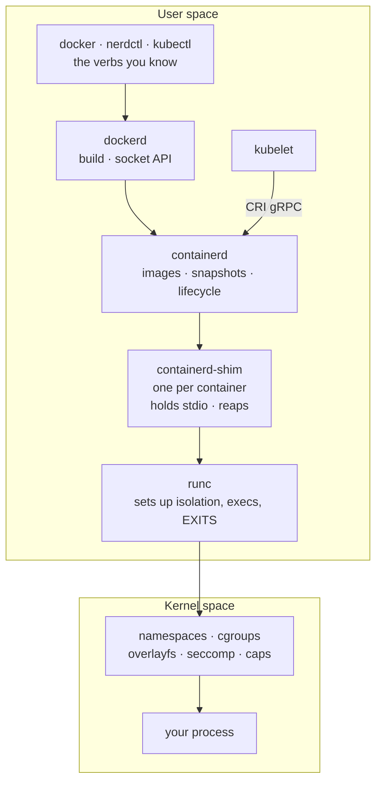
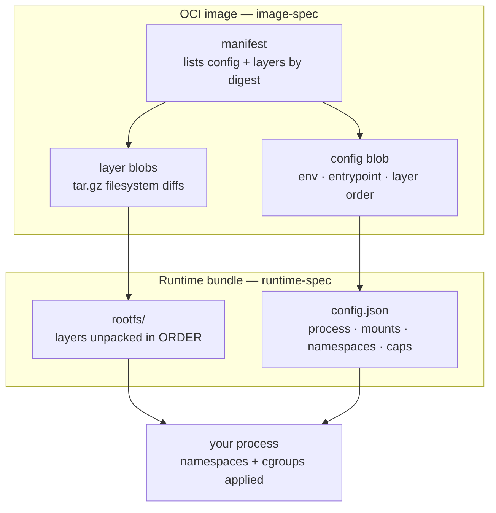

# Module 17 — containerd & OCI

<small>Stage 5 · Production Practices · ~1 week at 4 h/day · Prerequisite — Module 16 (Docker — the UX and the artifacts this module dissects, now one layer down).</small>

## Why this matters

**containerd** is the industry-standard container runtime daemon: it pulls images, manages the layer
store and snapshots, and supervises container lifecycles — the engine that **both Docker and Kubernetes
drive**. **OCI** (the Open Container Initiative) is the standards body whose three specs —
**image-spec** (what an image *is*), **runtime-spec** (how to *run* a bundle), and **distribution-spec**
(how registries *speak*) — make the whole ecosystem interoperable. This module is the layer between
M16's polished UX and the kernel's actual isolation primitives.

This is the dissection week. Every abstraction Docker handed you — an image, a container, a limit — gets
opened: images are just tarballs of tarballs, a running container is namespaces + cgroups + an overlay
mount, and `runc` is a program that sets those up and then *exits*. You spend a week below deck for three
concrete payoffs. **Debugging:** when a container misbehaves in a way `docker logs` can't explain, the
answer lives in this layer — the shim, the snapshotter, the cgroup files. **Kubernetes:** M19's nodes run
containerd directly with no Docker, and CRI is the vocabulary — this week is *why* "Kubernetes dropped
Docker" never worried you. **Literacy:** the difference between operating a black box and operating a
machine you have had apart on the bench.

!!! info "What this unlocks"
    M18 (Dev Containers) settles "what *is* this dev environment" now that the stack is legible · M19–M20
    (Kubernetes) is **kubelet → CRI → containerd → runc** — this module wearing a control plane · M21 reads
    the very cgroup files you write by hand · M23 formalises `nsenter`/`strace` into a forensics method ·
    M24 turns namespaces, capabilities, and seccomp into a security surface · M25 scrapes these exact
    cgroup files · M27–M28 (GPU serving) plug in **at this layer** — device cgroups + runtime hooks. Learn
    the stack once, by hand, and every later container tool is just a new driver on the same machinery.

---

## Watch

*Watch once, then rely on the notes below — you should never need to rewatch.*

<div class="lo-video-placeholder" markdown="1">
<span class="lo-play">▶</span>
**Explainer video — coming**
<small>Record per <code>../media/README.md</code>, upload to YouTube, then replace this card with the embed.</small>
</div>

??? note "For the author — drop-in YouTube embed (replace VIDEO_ID)"
    Once the explainer is on YouTube, replace the placeholder card above with:
    ```html
    <div class="lo-video-embed">
      <iframe src="https://www.youtube-nocookie.com/embed/VIDEO_ID"
              title="Module 17 — containerd & OCI"
              allow="accelerometer; autoplay; clipboard-write; encrypted-media; gyroscope; picture-in-picture"
              allowfullscreen></iframe>
    </div>
    ```
    Video script beats (from the blueprint's Definition / Architecture / Misconceptions):
    the monolith unbundled (2016: containerd and runc split *out* of Docker) → the six-layer stack narrated
    top-down, each with the ONE command that proves it exists (`ps -ef --forest` for the shim is the
    crowd-pleaser) → runc sets up and EXITS, the shim stays (why the container doesn't die when containerd
    restarts) → an image is a manifest + config + layer tars, all content-addressed → "Kubernetes dropped
    Docker" retold in 60 seconds (images are OCI, kubelet just changed which daemon it phones).

**Terminal cast — pending; record per `../media/README.md`.**

!!! tip "Follow along, don't just watch"
    Open the [Guided Lab](#guided-lab-drive-the-runtime-by-hand) in a browser terminal and run each command
    yourself as it appears. You will start containerd, pull a real OCI image into its store, run a container
    with `ctr`, and read a manifest as raw JSON — typing beats watching every time, and it is part of how
    the memory forms.

---

## Key Notes

*Standalone. This is the reference you keep.*

### The picture: CLI to syscall



Each layer does **one job and delegates down**. The docker CLI is a client of `dockerd`; `dockerd` is a
client of `containerd`; Kubernetes' `kubelet` skips dockerd entirely and phones containerd over **CRI**
(a gRPC interface). containerd hands the actual container to a **shim** (one per container), which calls
**runc**. runc does the kernel work — creates the namespaces and cgroups, pivots into the overlay,
drops capabilities, `execve`s your process — and then **exits**. The shim remains as the container's
parent. This is why `runc` never shows up as a running daemon in `ps`: looking for it and finding
nothing *is* the lesson.

### The six-layer stack — the table to keep

Read it top (human) to bottom (kernel). Every layer has a job and a command that proves it exists:

| Layer | Component | Its one job | Inspect it with |
|---|---|---|---|
| UX | `docker` / `nerdctl` / `kubectl` | Human interface | the commands you know |
| API daemon | `dockerd` | Build, compose, the socket API | `docker` CLI |
| Runtime daemon | **containerd** | Images, snapshots, lifecycle, per-namespace state | `ctr`, `nerdctl`, CRI |
| Supervisor | containerd-shim | Holds stdio, reaps exits, survives daemon restarts | `ps -ef --forest` |
| OCI runtime | **runc** | Creates namespaces/cgroups, execs, exits | `runc` directly |
| Kernel | namespaces + cgroups + overlayfs | The *actual* isolation | `unshare`, `/sys/fs/cgroup` |

Two structural facts do most of the work: **runc is not a daemon** (it sets up and exits — the shim
babysits), and **dockerd is optional** (`nerdctl`/`ctr` drive containerd with no Docker at all).

### OCI — three specs, one interoperable ecosystem

The OCI standardises the *substrate* so the ecosystem can compete on the *experience*. Three specs:

| Spec | Standardises | An artifact it governs |
|---|---|---|
| **image-spec** | The image format | a manifest → config blob + layer tars, content-addressed by digest |
| **runtime-spec** | How to run a filesystem bundle | a `rootfs/` directory + a `config.json` |
| **distribution-spec** | The registry protocol | manifest and blob endpoints, fetched by digest |

Because these are specs and not one vendor's internals, **build with Docker, run under Kubernetes,
inspect with skopeo** all interoperate with no translation. That interoperability is the whole point —
your GHCR image runs under `docker`, `nerdctl`, `ctr`, **and** bare `runc`.

### An image is a tarball of tarballs



An **image** is a *manifest* (JSON listing the config blob and layer blobs by digest), a *config* (env,
entrypoint, the order the layers stack), and *layer blobs* (tar diffs — a deletion rides a layer as a
**whiteout**, a `0:0` character device). A **bundle** is what runc actually runs: a `rootfs/` (the layers
untarred in order) plus a `config.json`. `runc spec` generates the skeleton; **any** compliant runtime
runs it. Everything is linked by **digest** — content addressing means integrity is structural, and
`pin-by-digest` (M16) gets its power from exactly this.

### The eight namespaces — what a container SEES

A container is not a thing; it is a process wearing eight kinds of goggles. Each namespace isolates one
kind of resource:

| Namespace | Isolates |
|---|---|
| **PID** | Process IDs — why the container sees itself as PID 1 |
| **Mount** | The filesystem / mount-point view |
| **Network** | Interfaces, ports, routes — a private M14 stack |
| **UTS** | Hostname and domain name |
| **IPC** | SysV / POSIX message queues |
| **User** | uid/gid mapping — root inside, you outside (**rootless's engine**) |
| **Cgroup** | The cgroup-tree view |
| **Time** | Boot / monotonic clocks (the newest) |

Namespaces govern what a process **sees**; **cgroups** (the unified hierarchy at `/sys/fs/cgroup`) govern
what it **consumes** — `memory.max`, `cpu.max`, `pids.max`. The OOM kill is cgroups speaking; the private
`ps` is namespaces. Keeping the two straight is half of below-deck debugging.

### ctr vs nerdctl vs docker — three ways to drive the same engine

All three ultimately talk to containerd. They differ in *how far above it* they sit:

| | `docker` | `nerdctl` | `ctr` |
|---|---|---|---|
| Talks to | dockerd → containerd | containerd directly | containerd directly |
| Best for | daily driver | daily driver, no dockerd | containerd admin / debug |
| UX | full, polished | docker-compatible verbs | raw, minimal |
| Needs dockerd? | yes | no | no |
| Default containerd namespace | `moby` | `default` | `default` (`-n` to switch) |

`ctr` is a **containerd namespace** away from Docker's containers: Docker files everything under the
`moby` namespace, so bare `ctr c ls` shows nothing until you say `ctr -n moby c ls`. That containerd
namespace (daemon multi-tenancy) is **unrelated** to the kernel namespaces above — same word, colliding
meanings, an accident of naming.

<div class="lo-remember" markdown="1">
**Must remember (if you keep only seven things):**

1. **The stack is layers of delegation:** CLI → dockerd → containerd → shim → runc → kernel. Each does one job and hands down.
2. **OCI = three specs:** image-spec (what an image is) · runtime-spec (how to run a bundle) · distribution-spec (how registries speak). Specs are why build-with-X / run-with-Y interoperate.
3. **runc is not a daemon.** It sets up namespaces + cgroups, `execve`s your process, and **exits**. The shim stays — holds stdio, reaps, survives containerd restarts. Look for runc in `ps` and find nothing.
4. **An image IS** a manifest → config + layer tars, content-addressed by digest. **A bundle IS** `rootfs/` + `config.json`. The same artifact runs under docker, nerdctl, ctr, or bare runc.
5. **Kernel namespaces ≠ containerd namespaces.** `ctr` sees nothing until `-n moby` because Docker lives in the `moby` containerd namespace — unrelated to kernel isolation.
6. **Namespaces govern what a process SEES; cgroups govern what it CONSUMES.** The OOM kill is cgroups; the private `ps` is namespaces.
7. **"Kubernetes dropped Docker"** changed which daemon kubelet phones (CRI → containerd). Images are OCI, never Docker-specific — every image kept running.
</div>

---

## Guided Lab: drive the runtime by hand

*Basic, step-by-step. You install and start **containerd**, meet the three pieces of the stack
(daemon, client, and the `runc` runtime), pull a real OCI image straight into containerd's store, run a
container with `ctr` — no Docker anywhere — and read an image manifest as raw JSON. Everything runs on the
machine in front of you.*

<div class="lo-lab-actions" markdown="1">
[▶ Open interactive lab](https://killercoda.com/learning-os/course/killercoda/module-17){ .lo-btn target=_blank }
[⧉ Open in Codespaces](https://codespaces.new/randaguiac20/learning-os){ .lo-btn target=_blank }
[⌨ Run locally](#run-locally){ .lo-btn .lo-btn--ghost }
[View lab source](https://github.com/randaguiac20/learning-os/tree/main/killercoda/module-17){ .lo-btn .lo-btn--ghost target=_blank }
</div>

<span id="run-locally"></span>
!!! tip "Three ways to run this lab — pick any (all free)"
    - **Instant, no account** — click **Open interactive lab** (Killercoda): a real Linux VM in your browser where you can install and start containerd.
    - **Your own cloud** — click **Open in Codespaces**: runs in your GitHub account's free tier (120 core-hrs/mo).
    - **Local, unlimited, $0** — any Linux VM (containerd needs real kernel access — cgroups, namespaces): `sudo apt-get install -y containerd runc`, start it, then follow along. A plain unprivileged container won't do; the daemon needs the kernel underneath it.

    Killercoda is the zero-setup on-ramp; Codespaces and local use *your own* free resources, so they scale to any class size.

=== "1 · Install containerd and meet the three pieces"
    Install the runtime daemon and the reference OCI runtime, then start containerd:
    ```bash
    sudo apt-get update -qq && sudo apt-get install -y containerd runc jq
    sudo systemctl enable --now containerd 2>/dev/null || (sudo nohup containerd >/tmp/containerd.log 2>&1 & sleep 3)
    sudo ctr version        # client AND server version = the daemon is up and reachable
    runc --version          # the low-level OCI runtime — a binary, not a daemon
    which containerd ctr runc
    ```
    Three pieces, three jobs: **containerd** is the daemon (images, snapshots, lifecycle), **`ctr`** is its
    raw admin client, and **`runc`** is the runtime that actually creates the container and then exits.
    Note there is no `dockerd` here — you will run a container without it.

=== "2 · containerd's own namespaces"
    containerd is multi-tenant: it partitions its state into **containerd namespaces** (not the kernel kind).
    ```bash
    sudo ctr namespace ls          # likely empty or just 'default'
    sudo ctr namespace create demo # create one
    sudo ctr namespace ls
    ```
    On a machine that also runs Docker, `ctr namespace ls` would show `moby` — Docker's private namespace —
    which is why `ctr container ls` shows nothing until you run `ctr -n moby container ls`. This containerd
    namespace is **daemon multi-tenancy**; it has nothing to do with the kernel namespaces that isolate a
    process. Same word, two worlds.

=== "3 · Pull an OCI image (distribution-spec)"
    Pull a small image straight into containerd's content store — no Docker involved. This is the
    distribution-spec in action: the manifest is fetched, then the blobs by digest.
    ```bash
    sudo ctr image pull docker.io/library/alpine:latest
    sudo ctr image ls              # REF, TYPE, DIGEST (the manifest), SIZE, PLATFORMS
    sudo ctr content ls | head     # the raw blobs now in the store, addressed by digest
    ```
    The `DIGEST` column is the content address of the image's manifest — pull the same digest anywhere and
    you get byte-identical bytes. Integrity is structural, not a promise.

    Click **Check** to verify the image landed in containerd's store.

=== "4 · Run a container — with ctr, not Docker"
    Start a detached container. `ctr run` unpacks the image into a snapshot, writes a `config.json`, and
    hands it to a shim, which calls `runc`:
    ```bash
    sudo ctr run -d docker.io/library/alpine:latest demo sleep 600
    sudo ctr container ls          # the container 'demo' exists
    sudo ctr task ls               # STATUS RUNNING — the live process
    ```
    Now look for `runc` — and find it already gone. It set the container up and **exited**; the shim is the
    parent now:
    ```bash
    ps -ef | grep -E 'runc|shim' | grep -v grep
    ```
    You will see a **shim** process (the container's supervisor) but **no runc** — exactly the lesson from
    the Key Notes, proven on your own machine.

    Click **Check** to verify the container and its task are running.

=== "5 · Read the manifest as raw JSON (image-spec)"
    An image is just JSON pointing at tarballs. Pull the manifest straight out of the content store and read
    it:
    ```bash
    DIGEST=$(sudo ctr image ls | awk '/alpine/{print $3; exit}')
    echo "manifest digest: $DIGEST"
    sudo ctr content get "$DIGEST" | jq '.'
    ```
    For a multi-arch image like alpine you will see an **index** (a list of per-architecture manifests);
    follow one `manifests[].digest` with another `ctr content get … | jq` and you reach a real manifest —
    its `config` blob and its ordered `layers`, each by digest. That is the entire image-spec, held in your
    hand. Clean up when you are done:
    ```bash
    sudo ctr task kill demo 2>/dev/null; sleep 1
    sudo ctr container rm demo 2>/dev/null
    ```
    **Optional — the docker-UX experience, daemonlessly:** `nerdctl` gives you `nerdctl run` / `nerdctl ps`
    / `nerdctl images` on top of this same containerd. It is a single static binary from the
    [nerdctl releases](https://github.com/containerd/nerdctl/releases) (download, checksum-verify, extract) —
    a nicety, not a requirement. Everything above already ran with no Docker and no nerdctl.

!!! success "You can stop here and have learned something real"
    If you started containerd, listed its namespaces, pulled an OCI image into its store, ran a container
    with `ctr`, saw a shim but no runc, and read a manifest as JSON — the guided lab is done. Now make it
    harder.

---

## Solo Lab: figure it out

*Harder. Goals only — minimal hand-holding. Some challenges need `sudo` and a real Linux box (namespaces
and cgroups need kernel access) — every `sudo` line understood before you type it. Struggle here is the
point; reveal a hint only after you've tried.*

### Challenge 1 — Cartographer of the stack
For a container that is running, produce evidence of **four different layers** in four commands: the
shim (supervisor), containerd (runtime daemon), the container's PID namespace (kernel), and its cgroup
limits.

??? tip "Hint"
    `ps -ef --forest` shows the shim tree. `ctr` (or `ctr -n moby`) shows containerd's view. `docker
    inspect -f '{{.State.Pid}}'` (or `ctr task ls`) gives the PID; `/proc/PID/ns/` holds the namespace
    inodes. The cgroup dir lives under `/sys/fs/cgroup`.

??? success "Solution"
    ```bash
    ps -ef --forest | grep -A2 shim          # 1. supervisor: the shim, one per container
    sudo ctr -n moby container ls            # 2. runtime daemon: containerd's view (moby = Docker's ns)
    PID=$(docker inspect -f '{{.State.Pid}}' <name>); ls -l /proc/$PID/ns/   # 3. kernel: the namespace inodes
    cat /sys/fs/cgroup/system.slice/docker-*.scope/memory.max 2>/dev/null    # 4. kernel: the cgroup limit
    ```
    Four commands, four layers, every claim backed by output you actually produced. Namespaces are
    **files**: two processes share one iff the `/proc/PID/ns/*` inodes match.

### Challenge 2 — Build a container from parts
Assemble a working "container" from `unshare`, `chroot`, and a cgroup — no Docker, no runc. Prove the PID
isolation and the memory cap actually hold.

??? tip "Hint"
    Export a slim rootfs first (`docker export $(docker create alpine) | tar -x -C rootfs`). Then
    `unshare` new PID + mount + UTS namespaces, mount a fresh `/proc`, `chroot`, and wrap a
    `/sys/fs/cgroup` dir with a `memory.max` around it. `--mount-proc` is what makes `ps` honest.

??? success "Solution"
    ```bash
    mkdir rootfs && docker export $(docker create alpine) | tar -x -C rootfs   # a rootfs, by hand
    sudo unshare -pfmu --mount-proc chroot rootfs /bin/sh   # PID+mount+UTS ns; fresh /proc; chroot in
    # inside: `ps` shows your shell as PID 1; `hostname lab17` changes only this world
    ```
    Every flag maps to something runc does from `config.json`: `-p` a PID namespace, `-m` a mount
    namespace, `-u` UTS, `--mount-proc` the fresh `/proc` so `ps` reads *this* namespace. Add a cgroup —
    `sudo mkdir /sys/fs/cgroup/lab17`, `echo 50M | sudo tee …/memory.max`, `echo $$ | sudo tee
    …/cgroup.procs` — and a memory hog inside gets OOM-killed by arithmetic, not luck. That is all a
    container is; runc just does this properly.

### Challenge 3 — Dissect your own image
Take any image you have built, `docker save` it to a tar, and extract **five facts** from its manifest and
config using only `jq` — entrypoint, env count, layer count, the largest layer, and that layer's digest.

??? success "Solution"
    ```bash
    docker save <image>:latest -o img.tar && mkdir img && tar -xf img.tar -C img
    jq '.' img/manifest.json                 # config blob + ordered layer list
    jq '.config.Entrypoint, (.config.Env|length)' img/<config-sha>.json   # entrypoint + env count
    ```
    The manifest lists the config and the layers **in order**; the config holds your `ENTRYPOINT`, `ENV`,
    and the diff order. Untar one layer blob and there are your files (with a whiteout if you deleted one).
    `docker history` cross-references line-for-line: each history entry ↔ a layer blob. The digest economy,
    touched with hands.

### Challenge 4 — Below-deck medic: exit 137
A memory-limited container was OOM-killed and its logs are empty. Write the **forensics chain** — three
evidence stops from container to kernel — and explain why the app said nothing.

??? success "Solution"
    ```bash
    docker inspect <name> --format '{{.State.ExitCode}} {{.State.OOMKilled}}'   # 137 (128+9), OOMKilled=true
    cat /sys/fs/cgroup/system.slice/docker-*.scope/memory.events   # oom_kill: N — the kernel's ledger
    ```
    **exit code → `docker inspect` OOMKilled → the cgroup's `memory.events`** — app evidence, runtime
    verdict, kernel ledger. The app is silent because the kill was **SIGKILL**: uncatchable, unloggable,
    unflushable — the kernel removed the process mid-flight, so it never got a word in. When the app can't
    speak, the runtime and the kernel still testify.

### Challenge 5 (stretch) — Bundle and bare runc
Turn an image into a runtime bundle and run it under **runc alone** — no containerd, no dockerd, no daemon
of any kind.

??? tip "Hint"
    A bundle is `rootfs/` + `config.json`. You already have a rootfs from Challenge 2 (or untar the layers
    in order). `runc spec` generates a skeleton `config.json`; edit `terminal` to `false` and set your
    `args`, then `sudo runc run <id>`.

??? success "Solution"
    ```bash
    mkdir bundle && cd bundle && mkdir rootfs
    docker export $(docker create alpine) | tar -x -C rootfs   # or untar image layers in ORDER
    runc spec                                                   # writes config.json (the runtime-spec skeleton)
    sed -i 's/"terminal": true/"terminal": false/' config.json # edit args/terminal to taste
    sudo runc run demo                                          # a process, under NO daemon anywhere
    sudo runc list                                              # it's there — and note: no runc process remains
    ```
    Read `config.json` against the Key Notes: the `namespaces` array *is* Challenge 2's `unshare` flags;
    the `capabilities` list *is* M16's drop set. The artifact is just files, the standard is just JSON, and
    the runtime is just syscalls. `runc list` shows the container while `runc` itself has already exited.

---

## Self-Check

*Close the notes. Answer aloud or in writing **first**, then reveal. Recalling — even when it's hard —
is what builds the memory.*

??? question "Name the six layers of the stack from CLI to kernel, each with its one job."
    **UX/CLI** (`docker`/`nerdctl`/`kubectl` — human interface) → **dockerd** (API daemon: build, socket
    API) → **containerd** (runtime daemon: images, snapshots, lifecycle) → **shim** (per-container
    supervisor: stdio, reaping, restart-survival) → **runc** (OCI runtime: creates isolation, execs, exits)
    → **kernel** (namespaces/cgroups/overlay: the actual isolation).

??? question "Name the OCI's three specs and what each standardises."
    **image-spec** — the image format (manifest/config/layers, content-addressed). **runtime-spec** — how to
    execute a filesystem bundle (`rootfs/` + `config.json`). **distribution-spec** — the registry protocol
    (manifest and blob endpoints, by digest). Specs are why an image built with one tool runs under any other.

??? question "What does runc DO when it runs a bundle, and what happens to runc afterward?"
    It reads `config.json`, `clone`/`unshare`s the namespaces (the `CLONE_NEW*` flags), writes the cgroup
    limits, pivots into the rootfs and mounts, drops capabilities, applies seccomp, and `execve`s your
    process — then it **exits**. It is not a daemon; the shim (or your terminal, for `runc run`) holds the
    baby. Look for runc in `ps` and you find nothing.

??? question "Docker's containers don't appear in `ctr container ls`. Why, and what's the fix?"
    **containerd namespaces** — containerd's own multi-tenancy, unrelated to kernel namespaces. Docker files
    everything under the `moby` namespace; bare `ctr` looks in `default`. Fix: `ctr -n moby container ls`
    (and `ctr -n moby task ls`).

??? question "Write the forensics chain for exit code 137."
    **exit 137 (128+9 = SIGKILL)** → `docker inspect` (OOMKilled = true?) → the container's cgroup dir →
    `memory.events` (the `oom_kill` counter). App evidence, runtime verdict, kernel ledger — three stops,
    container to kernel.

??? question "memory.events shows oom_kill: 3 but the app's logs are empty. Why is the app silent?"
    **SIGKILL cannot be caught, logged, or flushed** — the kernel removed the process mid-flight, so the app
    never got to say anything. This vindicates M16's logs-to-stdout law and the whole forensics chain: when
    the app is silent, the runtime (`inspect`) and the kernel (`memory.events`) still testify.

??? question "Namespaces vs cgroups — which governs what?"
    **Namespaces govern what a process SEES** (its own PIDs, network, mounts, hostname). **cgroups govern
    what it CONSUMES** (memory, CPU, pids). The private `ps` inside a container is namespaces; the OOM kill
    is cgroups. Different mechanisms, constantly confused.

??? question "The dockershim removal (K8s 1.24) — what was actually removed, and why did informed teams shrug?"
    Removed: **dockershim**, a Kubernetes-internal adapter translating kubelet→dockerd. Kept working: every
    OCI image, every registry, every Dockerfile — nodes now speak **CRI → containerd** directly (dockerd was
    an extra hop). Images were never Docker-specific, so those who knew the specs shrugged; the panic was
    stack illiteracy. This module is the vaccine.

!!! example "Teach it back (the real test)"
    Out loud, in **4 minutes, no notes**: *"What happens when you type `docker run`?"* Narrate the six
    layers top-down, each with its one job and the ONE command that proves it exists — end with runc's exit
    and why the container doesn't care. Then, in **90 seconds**, teach *"what is a namespace?"* to a smart
    12-year-old with the **VR-goggles** story (the process wears goggles showing it its own private world
    while standing in the shared room) — and show `sudo unshare -u sh` changing the hostname *inside* only.
    Bound the analogy honestly: the boundary is code, not physics. If you can't yet, reread the Key Notes —
    don't move on.

---

## Mastery checklist

*Tick these honestly, cold (no notes). They **gate** progress into M18 (Dev Containers), Stage 5's final
week. A module is only "done" when every box is true.*

- [ ] **Explain** the six-layer stack with each layer's job — the blank drawn cold, `ps -ef --forest` proving the shim.
- [ ] **Describe** the OCI's three specs and the artifact each governs, read against your own image.
- [ ] **Define** all eight namespaces with their isolations — the sprint clean in 60 seconds.
- [ ] **Contrast** kernel namespaces vs containerd namespaces (isolation vs daemon multi-tenancy) cold.
- [ ] **Identify** which layer a symptom belongs to with the below-deck ladder — app → shim → containerd → kernel.
- [ ] **Analyze** an OOM kill to the kernel's ledger: the exit-137 chain, live, `memory.events` as the verdict.
- [ ] **Implement** a container from parts (`unshare`/`chroot`/cgroup), rebuilt cold, the memory cap demonstrably killing a hog.
- [ ] **Build** a bundle from an image and run it under **bare runc** — no daemon anywhere in the chain.
- [ ] **Debug** a shell-less container from the host with `nsenter` — sockets and filesystem, evidence without modification.
- [ ] **Test** limits by hand: `memory.max`, `pids.max`, the hog OOM-killed, the fork bomb contained by arithmetic.
- [ ] **Secure**-map a real CVE (2019-5736) to two of your own mitigations, each breaking a step of the attack.
- [ ] **Evaluate** when the sandbox tier (gVisor/Kata) is worth its tax — the criterion and the cost stated.
- [ ] **Narrate** the dockershim removal, CVE-2019-5736, or the OCI founding on demand, cleanly, in 60 seconds.
- [ ] **Teach:** pass the teach-back (six tasks, ≥4 avg, none below 3) — the goggles and shipping analogies deployed AND bounded.

---

## Review — lock it in

Spaced repetition is where the memory forms. **Interleaving stays active** — every M17 review also pulls
one item from Module 16 (the UX and artifacts this module dissects). This is a one-week module, so
in-module reviews compress to a midpoint check; schedule the rest and *keep* them:

| When | Do | Interleaved M16 item |
|---|---|---|
| **Day 4 (midpoint)** | Stack + namespace blanks · `unshare` and forensics sprints · validation A1–B4 | The Docker below-Docker ladder sprint |
| **Day 7 (gate)** | All five blanks · all sprints · validation F16–F18, K27 · **mastery gate** | Dockerfile / layer-golf sprint |
| **Day 1** | Flashcards · validation misses re-derived at the terminal | M16 misses |
| **Day 3** | `microcontainer.sh` rebuilt cold from a blank file (the crown lab) | Docker image build, cold |
| **Day 7** | The 137-forensics + wedged-shim drills re-planted · the `nsenter` kata on a shell-less container | Docker speed-run |
| **Day 14** | Image dissection cold: a fresh image → manifest → one layer read with `jq`/`tar` | Registry pull-by-digest read |
| **Day 30** | Bare-runc run from your current image digest · validation retake ≥90 | Compose rig re-run |

**Connects forward to:** M18 (Dev Containers — the stack knowledge makes "what *is* this environment"
settled) · M19–M20 (Kubernetes — **kubelet → CRI → containerd → runc** is the node's spine; the pause
container and RuntimeClass arrive) · M21 (the cgroup files become the performance interface) · M23
(`nsenter`/`strace` formalised into forensics) · M24 (namespaces, seccomp, capabilities as a security
surface; the CVE-mapping method) · M25 (node-exporter scrapes the exact files you read by hand) · M27–M28
(GPU serving plugs in at this layer — device cgroups + runtime hooks).

!!! quote "The one-sentence takeaway"
    M17 removes the last magic — the container stack climbed by hand from CLI to syscall, namespaces and
    cgroups and specs all touched — so Kubernetes (M19) arrives as familiar machinery seen from a new
    control plane, not a new mystery.
