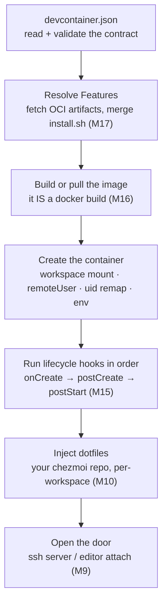
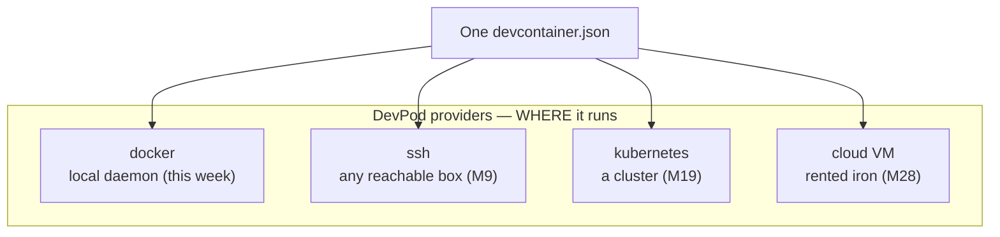
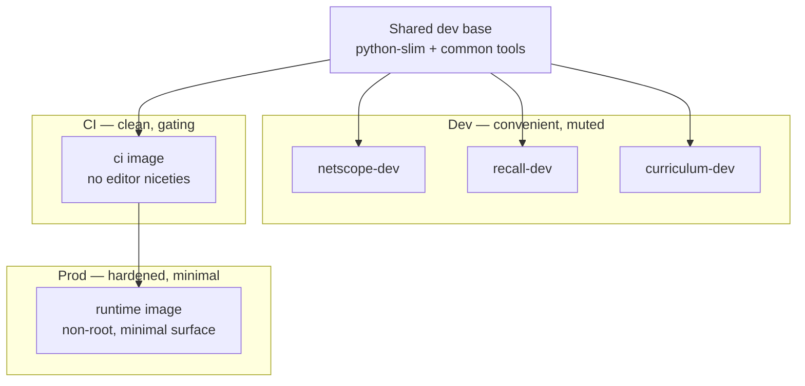
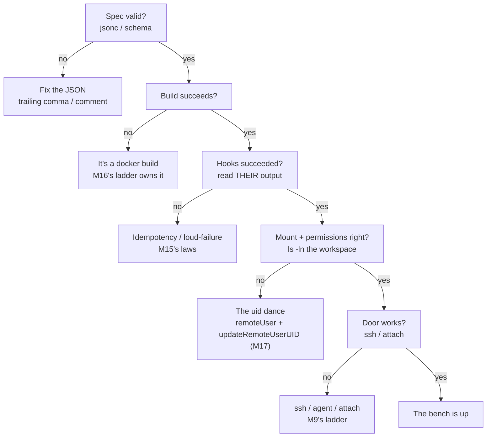

# Module 18 — devcontainers

<small>Stage 5 · Production Practices · ~1 week at 4 h/day · Prerequisite — Module 17 (what is *really* happening inside a container: uid remaps, Features as OCI artifacts, the dissection habit). Builds directly on Module 16 (images, Dockerfiles, compose, volumes). This module closes Stage 5.</small>

## Why this matters

A **dev container** is a development environment defined as code: a `devcontainer.json` — an open
specification (containers.dev) describing the image, tools, lifecycle hooks, and editor settings a repo
needs — so *"set up to hack on this"* collapses into **one command**. The file is the contract; a
client (VS Code, GitHub Codespaces, the devcontainer CLI, or DevPod) reads it and **materializes** the
bench: build or pull the image, mount your source, run the setup hooks, and open a door you work
through.

This is the final form of a drill you have run all curriculum long. A **venv** (M13) caged one Python
project's dependencies; **chezmoi** (M10) made your shell and editor rebuildable; a **Dockerfile** (M16)
made a runtime rebuildable. This week rebuilds your entire **workbench** from a JSON file. Two payoffs:
**onboarding** (any repo, any machine, in minutes — measured this week as *clone-to-productive*) and
**isolation** (each project's toolchain caged in its container; the host stays clean forever — the venv
law promoted to everything). And it closes the stage: Ship It gains its **bench** tier, and the Stage 5
gate shuts on Production Practices.

!!! info "What this unlocks"
    The spec is per-**repo**, so from now on *every* repo you touch carries its own bench. **M19–M20**
    (Kubernetes) get a cluster-dev loop that runs inside a devcontainer (DevPod's k8s provider); **M21**
    profiles *inside* benches (the cgroup layer from M17 already understood indoors); **M24** formalizes
    the trust surface (Feature audits, secrets brokering as an attack path); **M26–M28** make the CUDA
    bench — a GPU devcontainer is this week's spec plus a runtime hook, and the capstone's daily driver.
    Learn the spec by hand now and every future environment is one `up` command away.

---

## Watch

*Watch once, then rely on the notes below — you should never need to rewatch.*

<div class="lo-video-placeholder" markdown="1">
<span class="lo-play">▶</span>
**Explainer video — coming**
<small>Record per <code>../media/README.md</code>, upload to YouTube, then replace this card with the embed.</small>
</div>

??? note "For the author — drop-in YouTube embed (replace VIDEO_ID)"
    Once the explainer is on YouTube, replace the placeholder card above with:
    ```html
    <div class="lo-video-embed">
      <iframe src="https://www.youtube-nocookie.com/embed/VIDEO_ID"
              title="Module 18 — devcontainers"
              allow="accelerometer; autoplay; clipboard-write; encrypted-media; gyroscope; picture-in-picture"
              allowfullscreen></iframe>
    </div>
    ```
    Video script beats (from the blueprint's Definition / Architecture / Misconceptions):
    the wiki-archaeology onboarding pain → the spec as the contract (walk one real `devcontainer.json`
    block by block) → the `up` sequence as one composed machine (spec → Features → build → create → hooks
    → dotfiles → door, each stage owned by an earlier module) → the bake-vs-personalize hook split that
    IS prebuild economics → *disposable beats precious* (recreate beats debugging a pet bench) → close on
    the before/after clone-to-productive numbers.

**Terminal cast — pending; record per `../media/README.md`.**

!!! tip "Follow along, don't just watch"
    Open the [Guided Lab](#guided-lab-author-a-bench-from-a-blank-file) and **write the spec yourself** —
    a `Dockerfile`, a valid `devcontainer.json`, and then materialize it with a real `docker build`.
    Devcontainers are learned in the writing, not the reading; a template you paste teaches nothing.

---

## Key Notes

*Standalone. This is the reference you keep.*

### The picture: what one `up` command does

`devpod up .` (or Codespaces "Create", or `devcontainer up`) runs the same sequence — and **every stage
maps to a module you have already done**:



There is no magic here — it is your last five modules composed into one machine whose action is *prepare
my bench*. When a bench breaks, you debug it **stage by stage**, handing off to the ladder that owns each
one.

### The three base options — pick exactly one

The first decision in any spec is where the environment starts from:

| Base key | What it is | When it fits |
|---|---|---|
| `"image"` | pull a prebuilt image | **fastest** — a family/prebuilt base already carries your tools |
| `"build": { "dockerfile": … }` | build from an in-repo Dockerfile | **repo-specific** env code you own and review |
| `"dockerComposeFile"` | attach to a compose service | the app's **multi-service rig IS the dev env** — develop against live dependencies (M16's compose reused) |

`image` is to your bench what a base image is to a runtime; `build` is the third leg of the
environment-as-code tripod alongside `pyproject.toml` (a package) and a `Dockerfile` (a runtime).

### devcontainer.json anatomy — the fields that carry the weight

| Field | What it declares |
|---|---|
| `name` | a human label for the workspace |
| `image` / `build` / `dockerComposeFile` | the base (above) — **exactly one** |
| `features` | reusable installable units, **pinned** (next-but-one section) |
| `forwardPorts` | ports to surface from the container back to you |
| `remoteUser` | who you are inside — **non-root** (M16's habit does not stop at the door) |
| `containerEnv` | environment variables set inside the container |
| `mounts` | extra bind/volume mounts (e.g. a **gitignored** env-file for secrets) |
| `customizations` | editor settings & extensions (`customizations.vscode`) — a courtesy to teammates even if *you* live in the terminal |
| `postCreateCommand` (and siblings) | the lifecycle hooks (two sections down) |

!!! warning "jsonc is not JSON"
    The spec's parser allows `// comments` and trailing commas (**jsonc**); strict tools (`python3 -m
    json.tool`, most linters) do **not**. Keep your file valid *strict* JSON and any tool reads it — the
    trailing-comma surprise is this module's most common Monday-morning break.

### Features — declarative, versioned tool installs

A **Feature** is a reusable install unit referenced by an OCI address
(`ghcr.io/devcontainers/features/python:1`). Mechanically it is a **versioned OCI artifact** — a tarball
of metadata plus an `install.sh` — that the tooling fetches and **merges into the image build**. No
magic: pull one, read its script (M17's dissection habit), and you see exactly what you are trusting.
The judgment call, written down each time:

- **Feature** — composable, shared across repos, maintained upstream, *convenient*.
- **Dockerfile line** — deterministic, reviewed in-repo, no third-party trust or resolution cost.

Policy: core toolchain in the Dockerfile/family base (determinism where it matters); convenience tooling
via **pinned** Features. A Feature is a **dependency** (M13's audit reflex) *and* a build cost — read its
`install.sh` once, pin the exact version, keep the count minimal.

### Lifecycle hooks — four stations, one law

The hooks are the setup script's stations. The whole art is putting each step on the **right side of the
bake/personalize line**:

| Hook | Fires | Belongs here |
|---|---|---|
| `onCreateCommand` | once, at creation, before your checkout's personality | **bakeable**, generic steps — prebuild-able |
| `postCreateCommand` | after the workspace is mounted | **per-clone** setup: `pip install -e ".[dev]"`, `pre-commit install` |
| `postStartCommand` | every container **start** | daemons, refreshes |
| `postAttachCommand` | every **attach** / session | light session niceties |

<div class="lo-remember" markdown="1">
**The idempotency law (M15, indoors):** hooks **re-run on every recreate**, and recreation is the
reliability strategy — so a non-idempotent `postCreate` makes recreation destructive and kills the whole
reflex. **Run-twice test** every hook: create, then recreate immediately, and verify it still works.
</div>

### The devcontainer CLI and Codespaces — the same spec, different clients

The `devcontainer.json` is a **seam**: nothing above it is welded to a vendor.

- **devcontainer CLI** — the spec org's reference implementation; a Node tool that builds/runs the spec
  **headlessly**. This is what a **prebuild** job on the M15 rails uses: `devcontainer build` bakes the
  dev image in CI and pushes it to GHCR, so cold minutes become warm seconds. (Run it via its container
  image or `npx` in CI — never installed into system Node; install-minimalism holds.)
- **GitHub Codespaces** — reads the exact same file and runs the same sequence as a **cloud product**:
  aggressive prebuilds turn setup into cheap build-time, the laptop demoted to a thin client. The spec
  knowledge transfers *to* Codespaces; you never learn it *from* the hosted UX.
- **DevPod** — a client-only, **provider-agnostic** driver: the same spec materialized on your Docker
  daemon today, an ssh box or cloud VM tomorrow. The provider abstracts *where*:



Because the spec is the seam, the *client* choice is reversible — the OCI lesson (M17) and the
CI-concepts lesson (M15) completing their trilogy: **invest in the open standard, not the vendor**.

### Dev, CI, and prod are one family with a strictness gradient

The dev image is not a snowflake — it is the loose end of a family whose strictness rises as you move
toward production:



One base family, thin per-repo layers (M16's layer economy): the shared base is stored and pulled once;
bumping one repo's layer does not rebuild every repo's world. The same knowledge, three strictnesses —
dev *allows* what CI *forbids* what prod *forbids harder*.

### The dev-container troubleshooting ladder

When a bench misbehaves, name the rung **before** you produce evidence — each rung hands off to a ladder
you already own:



The standing reflex above all rungs: **bench weird for more than 10 minutes = recreate first**, then
investigate the *spec* — never perform surgery on a disposable container (the cattle law, applied to your
own desk).

<div class="lo-remember" markdown="1">
**Must remember (if you keep only seven things):**

1. **The workbench is code** — `devcontainer.json` on an open spec (containers.dev); reviewed, versioned, recreated. Laptop loss becomes a non-event.
2. **Three bases, pick one:** `image` (fastest) · `build.dockerfile` (repo env-code) · `dockerComposeFile` (the rig is the bench).
3. **Features are pinned OCI artifacts** running `install.sh` at build time — read one, pin it; they are dependencies *and* build cost.
4. **Four hook stations:** onCreate (bake) → postCreate (personalize the checkout) → postStart (every start) → postAttach (every attach). Hooks **must be idempotent** — run-twice test them.
5. **The spec is the seam** — devcontainer CLI, Codespaces, and DevPod all read it. The client is reversible; the standard is the investment.
6. **Non-root indoors, secrets never in the file** — it's committed. Use gitignored env-file mounts + **ssh-agent forwarding** (the key never enters the container, M9).
7. **The ladder:** spec → build (M16) → hooks (M15) → mount/uid (M17) → door (M9). Weird >10 min? **Recreate, don't operate.**
</div>

---

## Guided Lab: author a bench from a blank file

*Basic, step-by-step. You hand-write a `Dockerfile` and a valid `devcontainer.json` for a tiny repo,
then — because the lab VM has Docker — **build the image the spec references and run its setup by hand**,
proving the bench materializes. No editor required: this is the spec, dissected. Everything lives in a
throwaway `~/hello-bench/` repo.*

<div class="lo-lab-actions" markdown="1">
[▶ Open interactive lab](https://killercoda.com/learning-os/course/killercoda/module-18){ .lo-btn target=_blank }
[⧉ Open in Codespaces](https://codespaces.new/randaguiac20/learning-os){ .lo-btn target=_blank }
[⌨ Run locally](#run-locally){ .lo-btn .lo-btn--ghost }
[View lab source](https://github.com/randaguiac20/learning-os/tree/main/killercoda/module-18){ .lo-btn .lo-btn--ghost target=_blank }
</div>

<span id="run-locally"></span>
!!! tip "Three ways to run this lab — pick any (all free)"
    - **The live editor bench (best for this module)** — click **Open in Codespaces**: it reads a
      `devcontainer.json` and opens the exact thing you are learning, in a real editor. This module *is*
      what powers that button — running it here is the lesson materialized. Free tier: 120 core-hrs/mo.
    - **Author + build by hand, no account** — click **Open interactive lab** (Killercoda): a Linux VM
      **with Docker**, where you write the spec and a Dockerfile and actually `docker build` the bench —
      the mechanics under the editor button, no VS Code needed.
    - **Local, unlimited, $0** — any Linux / macOS / WSL box with Docker: write `.devcontainer/`, then
      `devcontainer up` (the CLI) or `devpod up .` — the same spec, your own iron.

    Codespaces is the zero-setup *editor* on-ramp; Killercoda and local let you see the machinery the
    button hides — write the spec, then watch Docker materialize it.

=== "1 · A repo that sets itself up"
    Make a tiny Python repo and note, honestly, the manual setup it would need on a bare machine:
    ```bash
    mkdir -p ~/hello-bench && cd ~/hello-bench
    git init -q
    printf 'print("hello from the bench")\n' > app.py
    printf 'ruff\npytest\n' > requirements-dev.txt
    mkdir -p .devcontainer
    ls -la
    ```
    On a bare box you'd install Python, make a venv, `pip install` the dev tools, wire pre-commit, set up
    the editor — the *"before"* number. Journal those steps: **they are the spec's TODO list.** The
    `devcontainer.json` you write next turns that archaeology into one file.

=== "2 · Write the Dockerfile — non-root by default"
    The `build` base is env-code you own. Create a Dockerfile with a **non-root** user so bind-mounted
    files aren't root-owned wreckage (M16's habit, indoors):
    ```bash
    cat > .devcontainer/Dockerfile <<'EOF'
    FROM python:3.12-slim
    # a non-root user so workspace files you create aren't root-owned on the host (M17's uid story)
    ARG USERNAME=dev
    RUN useradd --create-home "$USERNAME"
    USER $USERNAME
    EOF
    cat .devcontainer/Dockerfile
    ```
    `python:3.12-slim` is **pinned** (not `latest` — M16's tags-lie lesson). The `USER dev` line is the
    whole reason your workspace won't fill with root-owned files.

=== "3 · Write devcontainer.json — the contract"
    Now the spec itself: a base (`build` → the Dockerfile), a pinned Feature, a non-root `remoteUser`, a
    forwarded port, and a `postCreateCommand` — as **strict JSON** so every tool reads it:
    ```bash
    cat > .devcontainer/devcontainer.json <<'EOF'
    {
      "name": "hello-bench",
      "build": { "dockerfile": "Dockerfile" },
      "features": {
        "ghcr.io/devcontainers/features/common-utils:2": {}
      },
      "remoteUser": "dev",
      "forwardPorts": [8000],
      "postCreateCommand": "pip install --user -r requirements-dev.txt"
    }
    EOF
    python3 -m json.tool .devcontainer/devcontainer.json
    ```
    `json.tool` pretty-printing it **proves it parses** — no trailing commas, no comments. The real spec
    permits jsonc, but strict-clean means *any* client (Codespaces, DevPod, the CLI) accepts it.

    Click **Check** to verify the spec is valid JSON with the required keys and a non-root user.

=== "4 · Materialize it — build, then run the hook by hand"
    The lab VM has Docker, so you can *be* the devcontainer client. Install Docker, build the image the
    spec's `build` points at, then run the container the way the spec would — workspace mounted, as
    `dev`:
    ```bash
    sudo apt-get update -qq && sudo apt-get install -y docker.io >/dev/null
    sudo service docker start
    sudo docker build -t hello-bench-dev -f .devcontainer/Dockerfile .devcontainer
    sudo docker run --rm -v "$PWD":/workspace -w /workspace -u dev hello-bench-dev python app.py
    ```
    That `docker run` is the middle of the `up` sequence: **create the container, mount the workspace, be
    the remoteUser.** The `postCreateCommand` (`pip install …`) is what a client runs *for* you right
    after the mount — run it yourself to see the environment finish assembling.

    Click **Check** to verify the dev image the spec references was built.

=== "5 · Hooks, recreate, and the secrets boundary"
    Reason about **where each command belongs**, then handle secrets the right way. Prove the negative
    first — a secret in the committed spec would ship to every clone:
    ```bash
    grep -q 'TOKEN' .devcontainer/devcontainer.json && echo "SECRET in spec — wrong!" || echo "no secret in the committed spec (good)"
    # the RIGHT channel: a gitignored env-file mount for project secrets
    echo '.devcontainer/devcontainer.env' >> .gitignore
    printf 'API_TOKEN=dev-only-never-committed\n' > .devcontainer/devcontainer.env
    git status --short
    ```
    `git status` shows the spec tracked and the env-file **ignored** — that is the boundary. The
    bake/personalize split: `onCreate` bakes generic tool installs (prebuild-able); `postCreate` does
    *this checkout's* work (`pip install -e .`). And the law: **run-twice** every hook — a `postCreate`
    that breaks on the second run breaks every recreate.

!!! success "You can stop here and have learned something real"
    If you wrote a valid `devcontainer.json` and a non-root Dockerfile, built the image, ran the setup as
    the remote user, and put a secret behind a gitignored mount instead of in the committed file — the
    guided lab is done. Now make it harder.

---

## Solo Lab: figure it out

*Harder. Goals only — minimal hand-holding. Work in `~/hello-bench/` (or a fresh scratch repo). Struggle
here is the point; reveal a hint only after you've tried.*

### Challenge 1 — Feature vs Dockerfile line, decided on purpose
Your bench needs `git` niceties and a Python toolchain. Install **one** via a Feature and **one** via a
Dockerfile line — then state, in a sentence, the policy that decided which went where.

??? tip "Hint"
    Two axes: how **load-bearing** is the component, and how much does it **churn**? Determinism argues
    for the Dockerfile; convenience and sharing argue for a pinned Feature.

??? success "Solution"
    Core toolchain (the thing your gate depends on) → a **Dockerfile line** (deterministic, reviewed
    in-repo, no third-party trust or resolution cost). Convenience tooling → a **pinned Feature**
    (`…/features/common-utils:2` — composable, shared, maintained upstream). Policy: *core in the
    Dockerfile, convenience in pinned Features; the more load-bearing and the more it churns, the more it
    belongs in code you own.* Every Feature is a dependency **and** a build cost — pin the exact version
    and read its `install.sh` once.

### Challenge 2 — Map the four hook stations by prediction
Without running a client, say which station each of these belongs at, and why:
`apt-get install build tools` · `pip install -e ".[dev]"` · `start a background dev daemon` ·
`print a welcome banner`.

??? success "Solution"
    - `apt-get install build tools` → **onCreate** — generic, bakeable, independent of your checkout (a
      prebuild can cache it).
    - `pip install -e ".[dev]"` → **postCreate** — bound to *this* mounted checkout; can't be baked into a
      shared image.
    - `start a background dev daemon` → **postStart** — must run on every container start, not just
      creation.
    - `print a welcome banner` → **postAttach** — a per-session nicety, runs on every attach.

    The bake/personalize line falls **between onCreate and postCreate** — and it is exactly the split
    that lets a prebuild turn cold minutes into warm seconds.

### Challenge 3 — Files created inside show up root-owned on the host
You `touch` a file inside a bench and, back on the host, it's owned by `root`. Name the failure and the
setting that fixes it.

??? tip "Hint"
    It is the **uid dance** — the container user's uid vs your host uid across a bind mount. M17's
    user-namespace knowledge is cashing in.

??? success "Solution"
    The container user's uid ≠ your host uid on the bind mount (usually `remoteUser: root`, or uid
    remapping disabled). Fix: a **non-root `remoteUser`** plus **`updateRemoteUserUID`** (the default),
    which rewrites the container user's uid to match yours. Verify with `ls -ln` on both sides — the
    numeric owner should match. Root files on a bind mount are a *config* bug, not "Docker is broken."

### Challenge 4 — Prove why a secret in the spec is categorically wrong
Put a fake token in `devcontainer.json`, show it heading into the repo, then remove it and implement the
right channel.

??? success "Solution"
    ```bash
    # WRONG — the file is committed:
    printf '{ "name": "x", "containerEnv": { "API_TOKEN": "s3cret" } }\n' > /tmp/bad.json
    git -C ~/hello-bench add -n .devcontainer/devcontainer.json   # a real secret here would be staged → history forever
    # RIGHT — gitignored env-file mount + agent forwarding for auth
    echo '.devcontainer/devcontainer.env' >> ~/hello-bench/.gitignore
    ```
    `devcontainer.json` is **committed** — a secret in it ships to every clone and lives in history
    forever (git-history purge is a fire drill, not a plan). Right channels: **gitignored env-file
    mounts** for project secrets, and **ssh-agent forwarding** for auth — the private key never enters the
    container (M9), signatures happen host-side.

### Challenge 5 (stretch) — Attribute the KPI gaps to their mechanism
The week's headline metric is *clone-to-productive*, measured three ways: **before = 90 min**,
**cold = 8 min**, **prebuilt = 45 s**. Explain each gap by its mechanism.

??? success "Solution"
    - **90 min → 8 min (env-as-code):** the spec *executes* the setup the wiki only *described* — no human
      archaeology. Documentation drifts; a spec is tested (the run-twice test doesn't work on prose).
    - **8 min → 45 s (the prebuild split):** everything bakeable (image + Features + `onCreate`) is built
      **once in CI** and *pulled*, not rebuilt; only `postCreate`'s checkout-bound work remains at
      up-time. Put a bakeable step in `postCreate` by mistake and the warm number betrays the leak.

    The bake/personalize split *is* Codespaces' whole product insight — "sell the seconds" — at n=1. That
    same split is the difference between a bench that feels instant and one that doesn't.

---

## Self-Check

*Close the notes. Answer aloud or in writing **first**, then reveal. Recalling — even when it's hard —
is what builds the memory.*

??? question "What is a dev container, what file defines it, and what makes the definition portable across tools?"
    A development environment defined as code and run as a container — image/build + tools + hooks +
    editor settings — defined by `.devcontainer/devcontainer.json`. Portable because the file implements
    an **open spec** (containers.dev) that VS Code, Codespaces, DevPod, and the devcontainer CLI all read.

??? question "Name the three base options and when each fits."
    `image` (fastest — a prebuilt/family base already carries your tools); `build.dockerfile`
    (repo-specific env code you own and review); `dockerComposeFile` (the dev env includes a multi-service
    rig — develop against live dependencies).

??? question "Walk the `up` sequence from spec to 'door open', and name a module that owns each stage."
    Read/validate the spec → resolve **Features** (fetch OCI artifacts, merge install steps — M17) →
    **build or pull** the image (a docker build — M16) → **create** the container (workspace mount,
    remoteUser/uid remap, env) → run **hooks** in station order (M15) + inject **dotfiles** (M10) → open
    the **door** (ssh/attach — M9). It's your last five modules composed.

??? question "The four hook stations — when does each fire, and what belongs where?"
    **onCreate**: once at creation, before your checkout's personality — bakeable/generic. **postCreate**:
    after the workspace mounts — per-clone (editable installs, pre-commit). **postStart**: every container
    start — daemons, refreshes. **postAttach**: every attach — session niceties. Bake the heavy/generic;
    personalize the checkout-bound; keep start/attach light.

??? question "Why must lifecycle hooks be idempotent, and what test enforces it?"
    Recreation is the reliability strategy (disposable benches), and hooks **re-run on every recreate** —
    so a non-idempotent hook makes recreation destructive and kills the reflex. It inherits M15's
    idempotency law; the **run-twice test** (create, recreate immediately, verify) enforces it.

??? question "Your bench files show up root-owned on the host. What went wrong, and what fixes it?"
    The **uid dance** failed: the container user's uid ≠ your host uid across the bind mount (remoteUser
    root, or remapping off). Fix with a **non-root `remoteUser`** + **`updateRemoteUserUID`**, which
    rewrites the container uid to match yours; verify with `ls -ln` on both sides.

??? question "Why are secrets in devcontainer.json categorically wrong, and what are the two right channels?"
    The file is **committed** — a secret ships to every clone and lives in history forever; visibility
    changes and clones multiply. Right channels: **gitignored env-file mounts** for project secrets, and
    **ssh-agent forwarding** for auth (the key never enters the container — M9).

!!! example "Teach it back (the real test)"
    Out loud, in **4 minutes, no notes**: *"Your environment is code now."* Name the wiki-archaeology pain,
    walk a real `devcontainer.json` block by block, then land the disposability payoff — **recreate beats
    debug** — and close on before/after numbers. The pitch must land on **value, not tooling fashion**.
    Then, in **90 seconds**, teach a 12-year-old *why disposable beats precious* with the LEGO story
    (instructions vs a glued model; the cat knocks it over — you rebuild from instructions, and *the
    instructions are what you keep safe* = git). If you can't yet, reread the Key Notes — don't move on.

---

## Mastery checklist

*Tick these honestly, cold (no notes). They **gate** progress — passing M18 also closes **Stage 5** and
opens Enterprise Architecture (M19, Kubernetes). A module is only "done" when every box is true.*

- [ ] **Explain** env-as-code and its two payoffs (onboarding, isolation) — the pitch lands on value, not fashion.
- [ ] **Draw** the `up` sequence cold (spec → Features → build → create → hooks → dotfiles → door) with each stage's owning module.
- [ ] **Define** the four hook stations and place any command on the right side of the bake/personalize line.
- [ ] **Implement** a correct `devcontainer.json` from memory in ≤30 min: non-root, pinned base, one justified Feature, a gate-installing postCreate — opens/builds first try.
- [ ] **Choose** Feature vs Dockerfile line for a given tool and state the criterion (load-bearing × churn).
- [ ] **Design** the uid/permissions story for bind-mounted work — root-owned-files diagnosed and fixed (`remoteUser` + `updateRemoteUserUID`).
- [ ] **Test** a hook with the run-twice proof — recreation stays safe.
- [ ] **Secure** the boundary: no secret in the committed spec, env-file mount + agent forwarding demonstrated, docker-in-docker not on by reflex.
- [ ] **Troubleshoot** a bench by the five-rung ladder, naming the rung before the evidence, recreate-first past 10 minutes.
- [ ] **Contrast** dev / CI / prod as one image family with a rising strictness gradient — name what dev allows that CI forbids.
- [ ] **Evaluate** a community Feature before adopting it (read its `install.sh`, pin the exact version).
- [ ] **Narrate** the open-spec trilogy (OCI → CI concepts → devcontainer.json) as one lesson: invest in the standard, not the vendor.
- [ ] **Teach:** pass the teach-back — the "environment is code" pitch and the LEGO analogy, bounded, plus a live recreate without flinching.

---

## Review — lock it in

Spaced repetition is where the memory forms. **Interleaving stays active** — every M18 review also pulls
one item from **Module 17** (the mechanisms this bench sits on: uid remaps, Features as OCI artifacts,
the stack). This module closes Stage 5, so the **stage** review rides alongside the module reviews.
Schedule these and *keep* them:

| When | Do | Interleaved M17 item |
|---|---|---|
| **Day 4 (midpoint)** | Anatomy + up-sequence blanks · spec & station sprints · validation A1–B5 | Docker → containerd → runc stack sprint |
| **Day 7 (gate)** | All the diagrams cold · every sprint · validation E13–E15, G19, K27 · **STAGE 5 GATE** | Image forensics sprint (layer-walk a pulled image) |
| **Day 1** | Flashcards · validation misses re-derived at the terminal | uid-remap mechanism recited |
| **Day 3** | A fresh tiny repo given a devcontainer from memory in ≤15 min | The `unshare` namespace demo, cold |
| **Day 7** | The drills re-planted (uid wreckage · non-idempotent hook · floated Feature pin) | `memory.max` cgroup demo interpreted |
| **Day 14** | The prebuild pipeline's week reviewed — did the family rebuild? was drift caught? | The bare-`runc` bundle run once |
| **Day 30** | Validation retake (target ≥90) · one spec refactored with a month's hindsight | Stage-5 sampler across all four modules |

**Connects forward to:** M19–M20 (the cluster bench — kind/k3d inside or beside the devcontainer;
DevPod's k8s provider; dev loops against clusters) · M21 (profiling *inside* benches, the cgroup layer
already understood) · M24 (the trust surface formalized — Feature audits, secrets brokering as an attack
path) · M26–M28 (the CUDA bench — GPU devcontainers for training/serving; remote providers pointed at
GPU boxes; the capstone's daily driver) · every future repo (a `.devcontainer/` is the default from now
on).

!!! quote "The one-sentence takeaway"
    M18 completes the environment-as-code arc — venv → dotfiles → image → **bench** — closing Stage 5 with
    Ship It whole (rail, hull, understanding, bench) and a host that will never again accumulate a
    project's debris.
