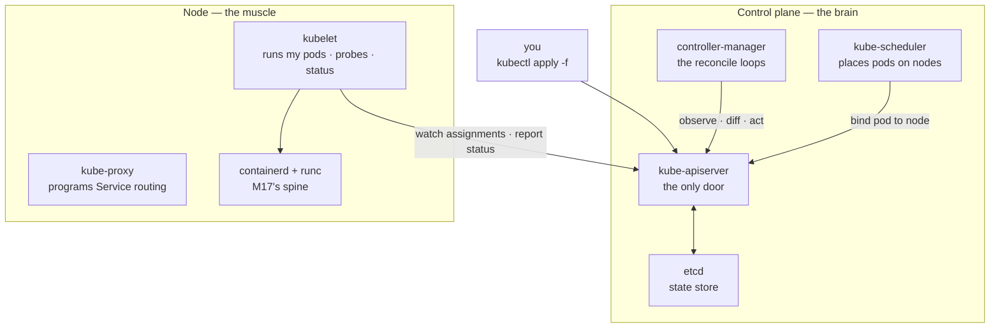
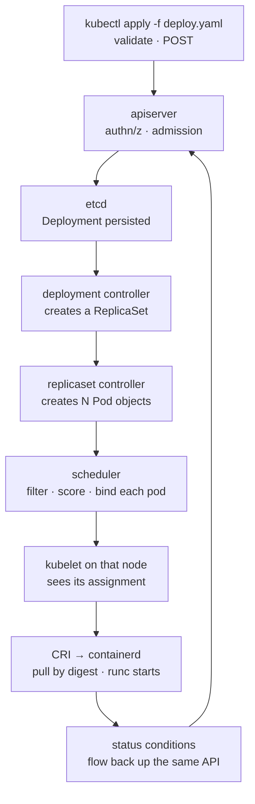
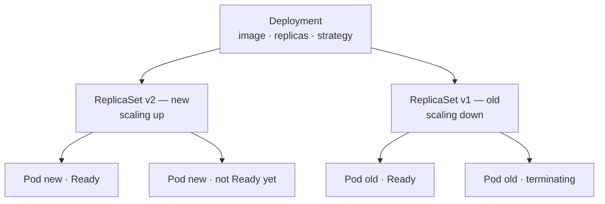
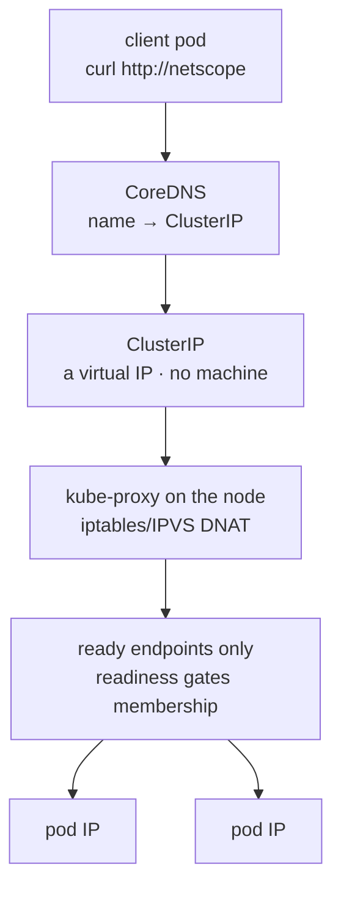
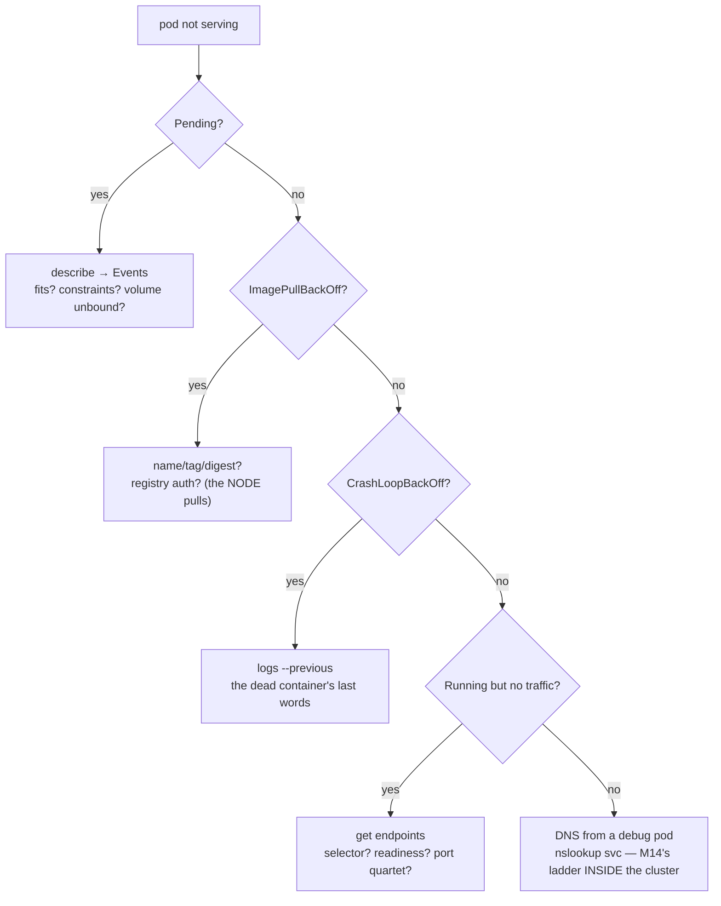

# Module 19 — Kubernetes Core

<small>Stage 6 · Enterprise Architecture · ~4 weeks at 4 h/day · Prerequisites — M16 (images/digests — the supply chain the cluster consumes), M17 (CRI → containerd → runc — the node's spine), M15 (convergence + declared state — reconciliation's platform form), M14 (Services/DNS/NAT — unlearnable without it).</small>

## Why this matters

**Kubernetes** is a declarative container orchestrator: you write the state you **want** into its API —
as objects (pods, Deployments, Services…) — and a swarm of controllers works forever to make reality
match, across many machines, through failures, without you watching. It is **M15's convergence idea
industrialized into a platform**, running your **M16 images** on **M17's runtime spine**.

You wrote the problem statement yourself back in M16: a compose file can't schedule across hosts, replace
an unhealthy container, roll an update safely, or self-heal. Kubernetes is the industry's answer and the
substrate of modern infrastructure — every cloud sells it, every ML platform assumes it, and the job
market prices it. This module makes one bet: **learn the model first** (reconciliation, the object
algebra) and `kubectl` becomes obvious; learn `kubectl` first and you recite commands forever without
understanding what they set in motion.

!!! info "What this unlocks"
    M20 (Kubernetes Operations) operates **this** cluster — Helm, ingress, RBAC, upgrades, backups · M21
    tunes requests/limits against **real measurement** (the cgroup files from M17, now a platform interface)
    · M23 folds cluster debugging into a forensics method · M24 hardens the flat network and RBAC into a
    security surface · M25 (Prometheus) was **born** for this terrain — it scrapes the kubelet/cAdvisor
    metrics whose cgroup files you read by hand in M17 · M26–M28 (the ML platform) schedule GPUs, run
    distributed-training operators, and serve models **as exactly these objects**. Learn the model once and
    every later platform tool is just another controller plugged into the same loop.

---

## Watch

*Watch once, then rely on the notes below — you should never need to rewatch.*

<div class="lo-video-placeholder" markdown="1">
<span class="lo-play">▶</span>
**Explainer video — coming**
<small>Record per <code>../media/README.md</code>, upload to YouTube, then replace this card with the embed.</small>
</div>

??? note "For the author — drop-in YouTube embed (replace VIDEO_ID)"
    Once the explainer is on YouTube, replace the placeholder card above with:
    ```html
    <div class="lo-video-embed">
      <iframe src="https://www.youtube-nocookie.com/embed/VIDEO_ID"
              title="Module 19 — Kubernetes Core"
              allow="accelerometer; autoplay; clipboard-write; encrypted-media; gyroscope; picture-in-picture"
              allowfullscreen></iframe>
    </div>
    ```
    Video script beats (from the blueprint's Definition / Architecture / Misconceptions):
    the thermostat frame (set the temperature, walk away — the furnace figures it out) → the two planes drawn,
    every component with its one job → the apply trace narrated top to bottom (apiserver → etcd → controller →
    ReplicaSet → scheduler → kubelet → CRI, M17's spine at the bottom) → the killer demo: `kubectl delete pod`
    mid-sentence, keep talking as it returns ("I never told it to make a new one — I told it there should BE
    three") → the honest seam: when a compose file should STAY a compose file.

**Terminal cast — pending; record per `../media/README.md`.**

!!! tip "Follow along, don't just watch"
    Open the [Guided Lab](#guided-lab-inspect-deploy-expose-heal) in a browser terminal and run each command
    yourself as it appears. You will inspect a running control plane, deploy an app, expose it with a Service,
    scale it, and delete a pod to watch it heal — typing beats watching every time, and it is part of how the
    memory forms.

---

## Key Notes

*Standalone. This is the reference you keep.*

### The one idea: desired state + reconciliation

Everything in Kubernetes is this single loop wearing a different object. You **declare** the state you
want; the system **owns the choreography** of getting there and staying there.



The loop that **IS** Kubernetes: you apply desired state → the apiserver stores it → controllers notice
the diff → they write sub-objects → the scheduler places pods → the kubelet runs them → status flows
back → **repeat forever**. Two structural facts do most of the work: **the API is the system** (every
component talks *through* the apiserver — there are no side channels, which is why `kubectl` can see
everything), and **controllers are level-triggered** (they compare IS vs SHOULD every loop, with no
memory of past events — so *any* divergence heals on the next pass).

### The two planes — the tables to keep

The **control plane** is the brain; the **nodes** are the muscle. Draw both until it is reflex.

| Control-plane component | Its one job |
|---|---|
| **kube-apiserver** | THE front door — every read/write of every object; validation, authn/z. Everything talks *through* it, nothing around it |
| **etcd** | The state store — every object's source of truth (a Raft-replicated key-value store) |
| **kube-scheduler** | Assigns pods → nodes: **filter** (does it fit? predicates) then **score** (best node?); writes the binding via the API |
| **kube-controller-manager** | The reconciliation swarm — deployment, replicaset, node, job controllers… each a loop: observe → diff desired/actual → act |

| Node component | Its one job |
|---|---|
| **kubelet** | The node agent — watches the API for pods assigned here, drives the runtime (CRI → containerd → runc, M17's spine), runs probes, reports status |
| **kube-proxy** | Programs Service routing on the node (iptables/IPVS — M14's NAT, fleet edition) |
| **containerd + runc** | Stage 5's stack, employed — the kubelet's hands |

### The apply trace — one manifest to running containers

`kubectl apply -f deploy.yaml` sets off a cascade you can witness live (two terminals: `get events -w` +
`get pods -w`). This is the single most important thing to understand in the module.



Note where it bottoms out: the kubelet makes **CRI** calls to containerd, which pulls the image **by
digest** and has `runc` start the container — the exact stack you climbed by hand in M17, now wearing a
control plane. The kubelet then runs the probes and reports status back up the *same* API.

### The object algebra — the workhorse chain

You own the **Deployment**; it manages **ReplicaSets** (one per revision); each keeps **N Pods** alive.
Nothing holds a hard reference — everything couples by **labels and selectors** (the design idea that
makes the whole algebra compose). Here is the chain mid-rolling-update:



The **pod** is the atom: one or more containers sharing one network identity (**one IP** — the pause
container from M17 holds the namespaces) and storage. Pods are **cattle** — created by controllers, never
hand-fed in production (a naked pod has no controller, so a delete means it is simply *gone*). The other
kinds plug into the same loop:

| Object kind | What it is |
|---|---|
| **Pod** | The atom — containers sharing network + storage; created by controllers, not by hand |
| **ReplicaSet** | Keeps N identical pods alive; one per Deployment revision (rollback = re-inflate the old one) |
| **Deployment** | The workhorse you own — image, replicas, update strategy; drives ReplicaSets |
| **Service** | A stable name + virtual IP for a churning pod set — ClusterIP (internal), NodePort (dev door), LoadBalancer (cloud door) |
| **ConfigMap / Secret** | Config injected as env or mounted files (Secret's base64 is **encoding, not encryption**) |
| **Namespace** | The cluster's folders — scoping names, quotas, RBAC domains |
| **DaemonSet / Job / CronJob** | One-per-node agents · run-to-completion · M15's timer in cluster form |
| **PVC / PV / StorageClass** | Claim (want) / volume (have) / class (how to provision) — the storage indirection |

### Services, endpoints, and DNS — the stable name over churn

A **ClusterIP is a virtual IP** — there is no "service machine" to log into. `kube-proxy` programs DNAT
rules on **every** node; CoreDNS maps the name; **readiness gates membership**.



`kubectl get endpoints SVC` is the **moment-of-truth** command: if it is empty, your selector does not
match any pod's labels, or every pod is failing readiness — either way, nobody is behind the Service. The
four ports confuse everyone until you draw them once:

| Port | Where it lives | Meaning |
|---|---|---|
| **containerPort** | Pod spec | The port the app listens on inside the container |
| **port** | Service spec | The port the Service itself exposes (the ClusterIP's port) |
| **targetPort** | Service spec | Where the Service forwards to on the pod — usually = containerPort |
| **nodePort** | Service spec (NodePort type) | A high port opened on every node — the dev door from outside |

### Probes are contracts — three different questions

Each probe answers a **different** question. Confusing readiness with liveness turns a slow start into a
restart storm — a top-five production K8s incident class.

| Probe | The question | On failure |
|---|---|---|
| **readiness** | "Route to me?" | Removed from endpoints — **no traffic, no restart** |
| **liveness** | "Restart me?" | Container killed and restarted |
| **startup** | "Patience with me?" | Holds liveness off until the first success (protects slow-boot apps) |

### Requests schedule, limits enforce — two different machines

`requests` and `limits` are separate numbers because they feed **different consumers**. Their gap is the
overcommit dial.

| | **requests** | **limits** |
|---|---|---|
| Consumed by | the **scheduler** — placement reserves them | the **runtime** — cgroups enforce them (M17) |
| Mechanism | bin-packing math; QoS/eviction ranking | `cpu.max` throttling, `memory.max` → OOM kill |
| Set too low | the noisy-neighbor / eviction lottery | throttling or `OOMKilled` (exit 137) |
| The rule | **only requests schedule** — a `Pending` pod is always a *requests* verdict, never limits | limits are walls, not reservations |

### The pod debugging ladder — evidence before hypothesis

The module's centerpiece drill. Every rung names its **evidence command before you touch anything**.



<div class="lo-remember" markdown="1">
**Must remember (if you keep only seven things):**

1. **The one idea:** desired state as objects in the API + controllers converging reality **forever**. Everything else is an object plugged into that loop.
2. **The API is the system.** Every component talks *through* the apiserver — no side channels. That is why `kubectl` (a REST client) can see everything, and why the ecosystem could extend it cheaply.
3. **Controllers are level-triggered.** They compare IS vs SHOULD each loop with no event memory — so a deleted pod comes back because the **diff itself** recreates it. Nothing "restarts" it.
4. **The workhorse chain:** Deployment → ReplicaSet (one per revision) → Pods; **rollback = re-inflate the old ReplicaSet** (`rollout undo`). Labels/selectors are the load-bearing glue.
5. **`get endpoints` is the moment of truth.** Running ≠ reachable — readiness, endpoints, and the Service chain decide whether anyone can reach a pod. A ClusterIP is DNAT on every node, not a middlebox.
6. **Requests schedule, limits enforce.** Requests feed the scheduler; limits feed cgroups (`memory.max` → OOM). `Pending` is always a requests verdict.
7. **Naked pods are forbidden in production.** No controller = no healing, no rollout, no scale. Deleted or node lost = gone. Deployments (a controller) heal; bare pods do not.
</div>

---

## Guided Lab: inspect, deploy, expose, heal

*Basic, step-by-step. You start on a **real single-node cluster** with `kubectl` already configured — no
install. You inspect the control plane, deploy an app from a handwritten manifest, expose it with a
Service, scale it, then delete a pod and watch the reconcile loop replace it — the module's whole thesis,
proven with your own hands.*

<div class="lo-lab-actions" markdown="1">
[▶ Open interactive lab](https://killercoda.com/learning-os/course/killercoda/module-19){ .lo-btn target=_blank }
[⧉ Open in Codespaces](https://codespaces.new/randaguiac20/learning-os){ .lo-btn target=_blank }
[⌨ Run locally](#run-locally){ .lo-btn .lo-btn--ghost }
[View lab source](https://github.com/randaguiac20/learning-os/tree/main/killercoda/module-19){ .lo-btn .lo-btn--ghost target=_blank }
</div>

<span id="run-locally"></span>
!!! tip "Three ways to run this lab — pick any (all free)"
    - **Instant, no account** — click **Open interactive lab** (Killercoda): a ready single-node Kubernetes cluster in your browser with `kubectl` already wired up. Nothing to install.
    - **Your own cloud** — click **Open in Codespaces**: runs in your GitHub account's free tier (120 core-hrs/mo); create a local cluster inside it with one command (below).
    - **Local, unlimited, $0** — any Linux / macOS / WSL box with Docker: `kind create cluster` (Kubernetes-in-Docker) or `k3d cluster create` gives you a real cluster in ~1 minute, then follow the steps below. `kind delete cluster` throws it away — clusters are cattle too.

    Killercoda is the zero-setup on-ramp; Codespaces and local use *your own* free resources, so they scale to any class size.

=== "1 · Meet the control plane"
    Confirm the cluster is up, then name every control-plane and node component against the Key Notes table:
    ```bash
    kubectl cluster-info                       # the apiserver's address = the only door
    kubectl get nodes -o wide                  # the machine(s) the muscle runs on
    kubectl get pods -n kube-system            # apiserver · etcd · scheduler · controller-manager · coredns · kube-proxy
    kubectl version --short                    # client and server versions (keep them within one minor)
    ```
    Every pod in `kube-system` maps to a row in the two-planes tables. Kubernetes runs its **own** control
    plane as pods on the cluster — the platform, hosting itself.

=== "2 · Deploy from a handwritten manifest"
    The iron law of this module: **manifests written from scratch**. Write a minimal Deployment (three
    replicas), reading each field against `kubectl explain`:
    ```bash
    cat > web.yaml <<'EOF'
    apiVersion: apps/v1
    kind: Deployment
    metadata:
      name: web
      labels: { app: web }
    spec:
      replicas: 3
      selector:
        matchLabels: { app: web }
      template:
        metadata:
          labels: { app: web }
        spec:
          containers:
            - name: web
              image: registry.k8s.io/e2e-test-images/agnhost:2.53
              args: ["netexec", "--http-port=8080"]
              ports:
                - containerPort: 8080
    EOF
    kubectl explain deployment.spec.template.spec.containers   # the built-in dictionary — first doc stop
    kubectl apply -f web.yaml
    kubectl get deploy,rs,pods -l app=web       # the ownership chain: Deployment → ReplicaSet → 3 Pods
    ```
    Notice you created **one** object (the Deployment) and got a ReplicaSet and three Pods for free — the
    controllers filled in the chain.

    Click **Check** to verify the Deployment has 3 ready replicas.

=== "3 · Expose it with a Service"
    A Service is a stable name + virtual IP over the churning pods. Expose the Deployment, then read the
    **endpoints** — the moment-of-truth command:
    ```bash
    kubectl expose deployment web --port=80 --target-port=8080 --name=web
    kubectl get svc web                         # a ClusterIP is assigned — a virtual IP, no machine
    kubectl get endpoints web                   # the 3 pod IPs behind it — readiness gated this membership
    kubectl run tmp --image=registry.k8s.io/e2e-test-images/agnhost:2.53 --rm -it --restart=Never \
      -- /bin/sh -c 'wget -qO- http://web/hostname; echo'   # CoreDNS resolved "web" → ClusterIP → a ready pod
    ```
    The `endpoints` list *is* the Service's membership. If it were ever empty, the Service would route to
    nothing — a selector typo or failing readiness, diagnosed in one command.

    Click **Check** to verify the Service exists and its endpoints are populated.

=== "4 · Scale, and watch the spread"
    Change the desired replica count and watch reconciliation converge:
    ```bash
    kubectl scale deployment web --replicas=5
    kubectl get pods -l app=web -w             # watch two new pods appear; Ctrl-C to stop watching
    kubectl get endpoints web                  # the Service membership grew to 5 automatically
    ```
    You never created a pod — you changed the **wish** (replicas: 5) and the ReplicaSet's diff (3 ≠ 5)
    created the rest. Scale back down with `kubectl scale deployment web --replicas=3` and watch the
    surplus terminate.

=== "5 · Delete a pod — watch it heal"
    The rite of passage. Delete a pod and watch the controller replace it — because you deleted a *fact*,
    not the *wish*:
    ```bash
    kubectl get pods -l app=web                 # note the pod names
    kubectl delete pod -l app=web --field-selector=status.phase=Running --wait=false | head -1
    kubectl get pods -l app=web -w             # a NEW pod appears within seconds; Ctrl-C when you've seen it
    ```
    Then read a pod's real YAML — what the controller actually wrote, including its `ownerReferences` back
    up the chain:
    ```bash
    kubectl get pod -l app=web -o yaml | grep -A4 ownerReferences   # this pod is OWNED by the ReplicaSet
    kubectl describe pod -l app=web | sed -n '1,25p'                 # conditions, QoS, events — read them
    ```
    Nothing "restarted" the pod: the ReplicaSet's loop saw `2 ≠ 3` and created one. That is level-triggered
    reconciliation, felt.

!!! success "You can stop here and have learned something real"
    If you inspected the control plane, deployed from a handwritten manifest, exposed a Service and read its
    endpoints, scaled the Deployment, and watched a deleted pod heal itself — the guided lab is done. Now
    make it harder.

---

## Solo Lab: figure it out

*Harder. Goals only — minimal hand-holding. Work on the same cluster. The iron law holds: **manifests
from scratch**, `kubectl explain` and the reference are your dictionary — no copy-paste from blogs.
Struggle here is the point; reveal a hint only after you've tried.*

### Challenge 1 — Break the Service, then read the truth
Relabel one of your `web` pods so it no longer matches the Service selector. **Predict** what
`get endpoints` will show *before* you run it, then prove yourself right — and put the pod back.

??? tip "Hint"
    A Service selects pods by label; endpoints membership is exactly the set of ready pods that match.
    `kubectl label pod <name> app=broken --overwrite` takes one out. `--show-labels` and `get endpoints`
    are your eyes.

??? success "Solution"
    ```bash
    POD=$(kubectl get pod -l app=web -o name | head -1)
    kubectl get endpoints web                       # N addresses now
    kubectl label "$POD" app=broken --overwrite     # it no longer matches selector app=web
    kubectl get endpoints web                        # membership SHRANK by one — live
    kubectl get pods -l app=web                      # and the ReplicaSet made a REPLACEMENT (still wants 3 matching)
    kubectl label "$POD" app=web --overwrite         # re-adopt it
    ```
    Two lessons at once: selectors are **load-bearing API** (a one-word label change moved a pod out of a
    Service), and the ReplicaSet's selector *also* matches `app=web`, so orphaning a pod made the controller
    create a fresh one to keep the count at three. Loose coupling, felt from both sides.

### Challenge 2 — Manufacture a Pending pod and read the verdict
Create a pod that can **never** be scheduled, then extract the exact reason from the cluster — without
guessing.

??? tip "Hint"
    The scheduler only reads **requests**. Ask for more of a resource than any node has (e.g. 100 CPUs).
    `describe pod` → the **Events** section is where the scheduler writes its verdict.

??? success "Solution"
    ```bash
    kubectl run hog --image=registry.k8s.io/pause:3.9 --overrides='
    {"spec":{"containers":[{"name":"hog","image":"registry.k8s.io/pause:3.9","resources":{"requests":{"cpu":"100"}}}]}}'
    kubectl get pod hog                              # STATUS: Pending, forever
    kubectl describe pod hog | sed -n '/Events/,$p'  # "0/1 nodes are available: Insufficient cpu"
    kubectl delete pod hog
    ```
    `Pending` is never a mystery — it is the scheduler saying *no node passed a filter*, and `describe`'s
    Events names which filter (insufficient resources, unsatisfiable constraints, or an unbound volume).
    Note it is the **request** (100 CPUs) that blocked placement; limits never schedule.

### Challenge 3 — Roll an update, then roll it back
Change your Deployment's image to a new tag, watch the rolling update pod-by-pod, then `rollout undo` and
prove the old ReplicaSet came back.

??? success "Solution"
    ```bash
    kubectl set image deployment/web web=registry.k8s.io/e2e-test-images/agnhost:2.52
    kubectl rollout status deployment/web            # the choreography: new RS up as old scales down
    kubectl get rs -l app=web                         # TWO ReplicaSets now — one per revision
    kubectl rollout history deployment/web
    kubectl rollout undo deployment/web               # re-inflate the previous ReplicaSet
    kubectl rollout status deployment/web
    ```
    Rollback is not a re-deploy — it is the **old ReplicaSet re-scaled up**. The revision history is the
    list of ReplicaSets the Deployment still owns; `undo` just changes which one is at the desired count.

### Challenge 4 — Prove reconciliation is level-triggered
Try to "fix" the replica count by editing the **ReplicaSet** directly instead of the Deployment. Predict
what happens, then explain the mechanism.

??? tip "Hint"
    The ReplicaSet is *owned* by the Deployment controller. `kubectl scale rs <name> --replicas=1` sets it
    low; watch what the owner does on its next loop.

??? success "Solution"
    ```bash
    RS=$(kubectl get rs -l app=web -o name | head -1)
    kubectl scale "$RS" --replicas=1                  # you set the RS low by hand
    kubectl get pods -l app=web -w                    # it climbs BACK to 3 within seconds; Ctrl-C
    ```
    You fought the controller and lost — on purpose. The Deployment's spec still says three; its next
    reconcile loop sees the ReplicaSet diverged from desired and corrects it. The lesson: **always edit the
    top of the ownership chain** (the Deployment, in git), never the objects a controller owns. Hand-edits
    to owned objects are drift, and drift gets reverted.

### Challenge 5 (stretch) — Read a Service's DNAT on the node
A ClusterIP has no machine behind it — it is DNAT rules. Find the `kube-proxy`'s rules for your Service's
virtual IP and connect them back to M14.

??? tip "Hint"
    Get the ClusterIP (`kubectl get svc web`). On a single-node cluster the node *is* reachable; look at the
    NAT table for the VIP: `iptables -t nat -L -n | grep <clusterip>` (or `sudo` / a node shell, depending on
    the environment). On kind, `docker exec` into the node container first.

??? success "Solution"
    ```bash
    VIP=$(kubectl get svc web -o jsonpath='{.spec.clusterIP}'); echo "$VIP"
    # on the node (kind: docker exec -it <node> bash first):
    iptables -t nat -L -n 2>/dev/null | grep -E "$VIP|KUBE-SVC" | head
    ```
    You will find `KUBE-SVC-*` / `KUBE-SEP-*` chains that DNAT the ClusterIP to a **random ready endpoint's
    pod IP** — M14's NAT, programmed on every node by kube-proxy. There is no proxy appliance and no "service
    machine": the load-spreading is packet-rewriting in the kernel. That is why there is nothing to log into.

---

## Self-Check

*Close the notes. Answer aloud or in writing **first**, then reveal. Recalling — even when it's hard —
is what builds the memory.*

??? question "Name the four control-plane components and two node components, one job each."
    **Control plane:** kube-apiserver (the only door — validation, authn/z, persistence), etcd (the state
    store), kube-scheduler (pod → node placement: filter then score), kube-controller-manager (the
    reconciliation loops). **Node:** kubelet (runs assigned pods via CRI, runs probes, reports status),
    kube-proxy (programs Service routing). containerd/runc is the acceptable third node citizen.

??? question "State the reconciliation model in two sentences. Which earlier module's concept does it industrialize?"
    Desired state lives as objects in the API; controllers perpetually observe actual state, diff it against
    desired, and act to converge — forever, with no memory beyond the diff. It industrializes **M15's**
    convergence / declared-state concept into a platform.

??? question "Trace `kubectl apply` of a new Deployment to running containers — every hop."
    kubectl validates and POSTs → apiserver authn/z + admission → etcd persists → the **deployment
    controller** (watching) creates a **ReplicaSet** → the **RS controller** creates **Pod** objects → the
    **scheduler** filters + scores nodes and binds each pod → that node's **kubelet** sees its assignment →
    **CRI**: containerd pulls by digest, shim + runc start the container (M17) → the kubelet runs probes and
    reports status back up the same API.

??? question "How does a Service's ClusterIP actually route traffic? Name the programmer, the mechanism, and what gates membership."
    **kube-proxy** programs iptables/IPVS **DNAT** rules on **every** node: traffic to the virtual ClusterIP
    is rewritten to a **random ready endpoint's** pod IP (M14's NAT). CoreDNS maps the name to the ClusterIP.
    Membership is gated by **readiness** — fail readiness and the pod leaves the endpoints, so traffic stops
    with no restart.

??? question "Why are controllers level-triggered rather than event-driven? Give the healing consequence."
    Level-triggered loops only compare IS vs SHOULD — they need no event history, so **any** divergence (a
    missed event, a crashed controller, a deleted pod, a restored etcd) heals on the next loop. Correctness
    comes from *state*, not from a fragile ledger of actions. The consequence: delete a pod, and the diff
    itself recreates it — nothing "restarts" it.

??? question "Why do requests and limits exist as separate numbers? Name each one's consumer."
    **Requests** are consumed by the **scheduler** — placement reserves them, and QoS/eviction ranks by them.
    **Limits** are consumed by the **runtime** — cgroup ceilings (`cpu.max` throttling, `memory.max` → OOM
    kill; M17's files). Placement honesty and runtime protection are different problems; the gap between the
    two numbers is the overcommit dial. `Pending` comes from requests, never limits.

??? question "Your pod is Pending. Give the evidence command and the three most common verdicts."
    `kubectl describe pod X` → the **Events** section. Verdicts: **insufficient resources** (requests fit no
    node), **unsatisfiable constraints** (nodeSelector / affinity / taints), or a **volume problem** (PVC
    unbound). It is always a scheduler verdict — read the Events, don't guess.

??? question "The Service returns connection refused but pods are Running. Two evidence commands, in order."
    (1) `kubectl get endpoints SVC` — **empty?** then a selector mismatch or failing readiness (the routing
    layer is ruled in or out in one command). (2) If endpoints exist, audit the **port quartet**: Service
    `port`/`targetPort` vs the pod's `containerPort` — refused with correct endpoints usually means a wrong
    `targetPort` or an app bound to localhost (M16's lesson, cluster edition). Running ≠ reachable.

!!! example "Teach it back (the real test)"
    Out loud, in **5 minutes, no notes** — audience: a compose power-user: *"What does Kubernetes actually
    do?"* Name their compose file's limits back to them (your own M16 problem statement), give the
    **thermostat** frame (set 21°, walk away — the furnace figures it out; open a window, it compensates;
    nobody "remembers" the window — the temperature IS the instruction), draw the two planes, then the
    **killer demo**: `kubectl delete pod` mid-sentence and keep talking as it returns — *"I never told it to
    make a new one; I told it there should BE three."* Close with the honest **seam**: when their compose
    file should stay a compose file (single host, no multi-node scheduling or SLO healing needed — K8s's
    complexity budget unearned). If you catch yourself listing components instead of telling the loop story,
    reread the Key Notes — don't move on.

---

## Mastery checklist

*Tick these honestly, cold (no notes). They **gate** progress into M20 (Kubernetes Operations), which
operates **this** cluster and completes the stage project. A module is only "done" when every box is true.*

- [ ] **Explain** the reconciliation model with the thermostat frame **and** the mechanism (level-triggered, the diff heals).
- [ ] **Describe** all control-plane + node components with their one job — the two-planes blank drawn cold.
- [ ] **Define** the object algebra (pod / ReplicaSet / Deployment / Service / endpoints and their label glue) from memory.
- [ ] **Analyze** the apply trace live — narrated against real events, no hop skipped, the M17 spine at the bottom.
- [ ] **Compare** the three probes with a failure story each (the restart storm, the silent traffic-drain).
- [ ] **Contrast** requests vs limits — two consumers (scheduler vs cgroups), two mechanisms — and why `Pending` is a requests verdict.
- [ ] **Design** a workload's manifest from stated requirements: Deployment (digest, replicas, probes, resources, non-root) + Service, from a blank buffer.
- [ ] **Build** the deploy → expose → scale → heal sequence from scratch in under 20 minutes, every field explainable.
- [ ] **Identify** the pod ladder's rung from a status + events glance — Pending / ImagePull / CrashLoop / not-ready / DNS.
- [ ] **Debug** with evidence-first discipline: `describe`/Events, `logs --previous`, `get endpoints` — command named **before** hypothesis.
- [ ] **Deploy** a rolling change and roll it back calmly — the old ReplicaSet re-inflated, revision history read.
- [ ] **Demonstrate** self-healing: delete a pod, watch the diff replace it; edit an owned ReplicaSet, watch it revert.
- [ ] **Teach** the 10-minute "What Kubernetes actually does" lesson — the returning pod lands as the thesis proof, the seam stated honestly.

---

## Review — lock it in

Spaced repetition is where the memory forms. **Interleaving stays active** — every M19 review also pulls
one item from an earlier module (the runtime spine and the networking chapter this module stands on).
This is a four-week module, so in-module reviews land at each week's close; schedule the rest and *keep*
them:

| When | Do | Interleaved earlier item |
|---|---|---|
| **Week-1 close** | Two-planes + apply-trace blanks · components + manifest sprints · validation A1–B3 | M17: the CLI-to-syscall stack sprint |
| **Week-2 close** | Probe + port-quartet sprints · the pod ladder (break-lab I debrief) · validation C7, D10–D12 | M16: the image-build / forensics sprint |
| **Week-3 close** | Service-routing + rollout blanks · break-lab II debrief · validation F16–F18, G20 | M14: the refused-vs-timeout DNS walk |
| **Module close (gate)** | All five blanks · all sprints · validation J25–J26, K27 · **mastery gate** | M17: the exit-137 forensics chain |
| **Day 3** | Speed rep: a fresh app deployed + exposed from scratch in ≤20 min, every field explained | M18: the 15-minute devcontainer spec |
| **Day 14** | The cluster **recreate-drill**: delete → create → apply-from-git → green (a cluster you can't rebuild is a pet) | M15: a restore test observed |
| **Day 30** | Validation retake ≥90 · the deferred-items table reviewed against M20's actual coverage | Stage-5 sampler |

**Connects forward to:** M20 (Kubernetes Operations — Helm, ingress, RBAC, upgrades, backups; the
deferred-items table becomes its syllabus) · M21 (requests/limits meet real measurement — the cgroup files
as a tuning interface) · M23 (cluster debugging folded into a forensics method) · M24 (the flat network and
RBAC hardened into a security surface) · M25 (Prometheus/Grafana — born for this terrain, scraping the
kubelet/cAdvisor metrics) · M26–M28 (the ML platform — GPU scheduling, distributed-training operators,
model-serving Deployments — all K8s-shaped).

!!! quote "The one-sentence takeaway"
    M19 turns Stage 5's artifacts into orchestrated workloads under the industry's one big idea — desired
    state plus reconciliation — making the cluster home terrain for everything ahead: operations,
    measurement, security, observability, and the ML platforms of the capstone.
