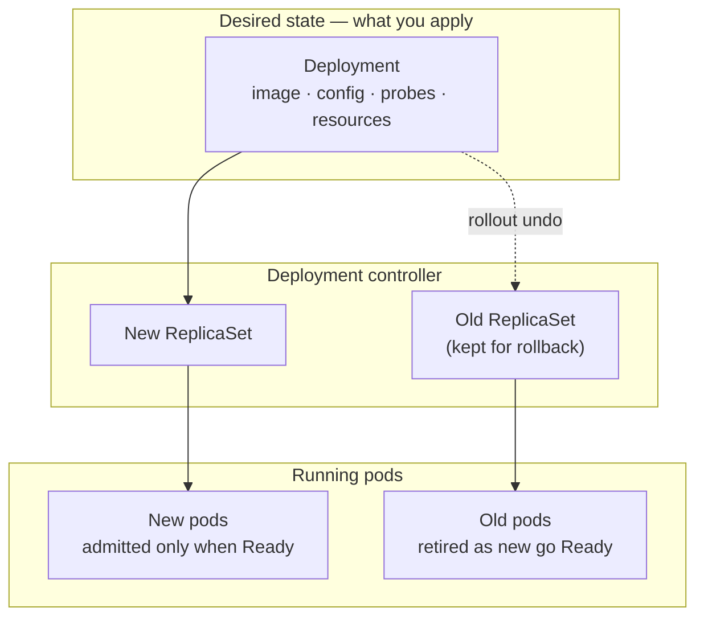
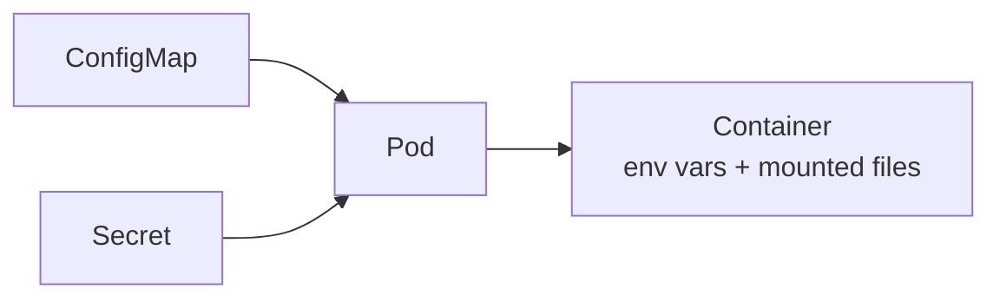

# Module 20 — Kubernetes Operations

<small>Stage 6 · Enterprise Architecture · ~2 weeks at 4 h/day · Prerequisite — Module 19 (the cluster model and your first working Deployment).</small>

## Why this matters

Module 19 gave you a **running Deployment** — a model of the cluster and an app that starts. Production
asks the questions the core didn't: how do you change config **without rebuilding the image**? how does
a wedged container **heal itself**? what stops one greedy pod from **starving its neighbours**? how do
you ship a new version you can **undo in one command**? who is allowed to do **what**, and how do you
prove it's minimal? how does the outside world reach your app through **one door**? and when it all
breaks at 3 a.m., what's the **method**?

This module is the discipline layer that turns "I can deploy to Kubernetes" into "I can be **trusted**
with one." Every answer here is an **object** you apply and inspect — ConfigMap, Secret, probe, resource
request, ReplicaSet revision, Role, Ingress — so operations never leaves the model M19 taught you. That
is why it is one module, not a career: nothing escapes the object model.

!!! info "What this unlocks"
    This is the operable floor everything above stands on. **M21** (performance) needs a stable cluster
    as its measurement bench — requests/limits tuning meets real instruments. **M24** (security)
    formalises the RBAC and least-privilege method you learn here into a discipline. **M25**
    (observability) arrives *via* a Helm chart you'll audit and install with exactly these habits. **M26–28**
    (ML platforms) schedule GPUs on this same floor. Learn to operate one Deployment cleanly now and
    every later platform is the same reflexes at larger scale.

---

## Watch

*Watch once, then rely on the notes below — you should never need to rewatch.*

<div class="lo-video-placeholder" markdown="1">
<span class="lo-play">▶</span>
**Explainer video — coming**
<small>Record per <code>../media/README.md</code>, upload to YouTube, then replace this card with the embed.</small>
</div>

??? note "For the author — drop-in YouTube embed (replace VIDEO_ID)"
    Once the explainer is on YouTube, replace the placeholder card above with:
    ```html
    <div class="lo-video-embed">
      <iframe src="https://www.youtube-nocookie.com/embed/VIDEO_ID"
              title="Module 20 — Kubernetes Operations"
              allow="accelerometer; autoplay; clipboard-write; encrypted-media; gyroscope; picture-in-picture"
              allowfullscreen></iframe>
    </div>
    ```
    Video script beats (from the blueprint's Definition / Architecture / Misconceptions):
    config as **data** — ConfigMap/Secret injected as env and mounted files (no rebuild) → the **three
    probes** and what each one controls (traffic vs restart vs boot) → **requests vs limits** as the
    cgroup bound (Pending when a request won't fit; OOMKilled when memory blows the limit) → the
    **rolling update** and why `rollout undo` is a first-class verb → **namespaces + least-privilege
    RBAC** (a Forbidden error is a requirements doc, not a bug) → **one ingress door** with TLS ending at
    the controller → the **day-2 troubleshooting ladder** (describe → events → logs → endpoints →
    rollout status).

**Terminal cast — pending; record per `../media/README.md`.**

!!! tip "Follow along, don't just watch"
    Open the [Guided Lab](#guided-lab-operate-one-deployment) in a browser terminal and run each
    command yourself as it appears. Typing beats watching every time — and it is part of how the memory
    forms.

---

## Key Notes

*Standalone. This is the reference you keep.*

### The picture: how a change reaches your pods



You never edit pods. You change the **Deployment's** pod template and apply it; the controller creates a
**new ReplicaSet**, brings its pods up, waits for each to pass its **readiness** probe, and only then
retires the old pods. The **old ReplicaSet is kept** — that is what `kubectl rollout undo` re-applies. A
rollout is therefore reversible by construction, and a bad version that never goes Ready **can't take the
old one down**.

### Config as data — ConfigMaps and Secrets

Configuration does **not** belong baked into an image. Externalise it so the same image runs in dev and
prod with different values:

- **ConfigMap** — non-secret config (URLs, feature flags, tuning). Inject two ways: as **env vars**
  (`valueFrom.configMapKeyRef`) or as **mounted files** (a volume; each key becomes a file).
- **Secret** — same shapes, for sensitive values (tokens, passwords). ⚠️ A Secret is only **base64**, not
  encrypted at rest by default — treat it as "keep out of git," not "safe if the cluster leaks." Encryption
  at rest and external-secret stores are the production upgrade (named in M24).



Rule of thumb: **env** for a handful of scalar values a process reads at startup; **mounted files** for
whole config files or anything that should update without a restart.

### Health: the three probes

The kubelet asks three different questions with three probes. Confusing them is the classic mistake —
a liveness probe that's really a readiness probe restarts healthy-but-busy pods.

| Probe | Question it answers | What failure does |
|---|---|---|
| **startupProbe** | "Has the app finished **booting** yet?" | Holds the other two off until boot completes; kills the container only if it never boots — protects slow starters from a trigger-happy liveness probe |
| **readinessProbe** | "Should this pod get **traffic** right now?" | Pod is **removed from the Service's endpoints** — no traffic, **no restart**, still running |
| **livenessProbe** | "Is this container **wedged** and beyond recovery?" | kubelet **restarts the container** (the `RESTARTS` count climbs) |

Readiness gates the **rollout** (new pods join traffic only when Ready) and the **Service** (a failing
pod is pulled from load-balancing, not killed). Liveness is the self-heal for deadlocks. Startup is the
grace period that keeps liveness from murdering an app that just takes 40 s to warm up.

### Resources: requests vs limits

Every container should declare both. They are **different** knobs used by **different** systems:

| | **Request** | **Limit** |
|---|---|---|
| Meaning | Guaranteed minimum **reserved** | Hard **ceiling** (a cgroup cap) |
| Used by | The **scheduler** — which node has room | The **kubelet/kernel** — enforcement |
| CPU over it | — | **Throttled** (slowed, never killed) |
| Memory over it | — | **OOMKilled** (container killed, then restarts) |
| Set too high | Pod stuck **Pending** — no node fits the request | — |

Two failure signatures fall straight out of this table: a pod that won't schedule (`Pending`,
`Insufficient memory/cpu`) is a **request** too big for any node; a container that keeps dying with
`OOMKilled` is real usage above its **memory limit**. CPU is compressible (throttle); memory is not
(kill). HPA, later, divides observed usage by the **request** — no request, no autoscaling math.

### Rollouts and rollback

- `kubectl apply` a changed template → new revision, rolling update (see the diagram above).
- `kubectl rollout status deploy/NAME` → watch it progress (or hang on a stuck pod).
- `kubectl rollout history deploy/NAME` → the revision ledger.
- `kubectl rollout undo deploy/NAME` → re-apply the previous revision. **Rollback is a first-class verb** —
  drilled, not improvised (the Knight Capital / Pi-Day lesson: your kill-switch must be rehearsed *before*
  you need it).

### Namespaces and least-privilege RBAC

**Namespaces** partition one cluster into scopes (`team-a`, `staging`, your `k8s-ops` sandbox) — names,
quotas, and policies apply per namespace. **RBAC** decides who may act on what within them.

| Verb | Allows |
|---|---|
| `get` | Read one named object |
| `list` | Enumerate objects of a kind |
| `watch` | Stream changes as they happen |
| `create` | Make new objects |
| `update` / `patch` | Modify existing objects |
| `delete` | Remove objects |

A **Role** grants (verb × resource) inside one namespace; a **RoleBinding** ties it to a **subject**
(usually a **ServiceAccount** — a pod's identity). RBAC is pure **allow-listing**: there are no deny
rules; **denial is absence**. So the method is a loop, not a guess:

> **The error-driven least-privilege loop:** start from **zero** grants → run the workload → read the
> `Forbidden` error (it names the exact verb, resource, and namespace) → add **only that** to the Role →
> repeat until green → **stop**. Prove it with `kubectl auth can-i --list --as=system:serviceaccount:NS:NAME`.

A `Forbidden` error is the **requirements document**, not a bug. And most workloads need **zero** API
access — give them a dedicated ServiceAccount with `automountServiceAccountToken: false` and move on.

### Ingress: one door

A **Service** is a stable in-cluster address (a room number). An **Ingress** is the building's **front
door**: host- and path-based routing plus TLS, implemented by a **controller pod** (e.g. ingress-nginx)
that watches Ingress objects and regenerates its config — the reconciliation loop, again. **TLS
terminates at the door**: client→controller is encrypted; controller→pod is plaintext unless you
re-encrypt. The classic failure is a **404 from a Host-header mismatch** — test with
`curl -H "Host: app.local" ...`, never the raw IP.

### The day-2 troubleshooting ladder

When something's wrong, work the ladder in order — evidence before action, and fix the **template**, never
the live instance:

1. `kubectl get pods` — what state? (`Pending` / `CrashLoopBackOff` / `OOMKilled` / `ImagePullBackOff`)
2. `kubectl describe pod POD` — the **Events** at the bottom name the real cause.
3. `kubectl logs POD` (`--previous` for a crashed container) — the app's own words.
4. `kubectl get endpoints SVC` — is any pod actually **Ready** and wired to the Service?
5. `kubectl rollout status deploy/NAME` — is a rollout **stuck**? If a bad version, `rollout undo`.

Each rung maps a symptom to a layer: `Pending` → scheduling/requests · `CrashLoop` → app or probe ·
no endpoints → readiness · 404 → Host/Ingress · timeout (not refused) → a NetworkPolicy dropped it.

<div class="lo-remember" markdown="1">
**Must remember (if you keep only seven things):**

1. **You never edit pods** — change the Deployment's template; the controller rolls out a new ReplicaSet and keeps the old one for `rollout undo`.
2. **Config is data, not image** — ConfigMap (non-secret) and Secret (base64, *not* encrypted) injected as env vars or mounted files.
3. **Three probes, three jobs:** startup = "booted?", readiness = "send traffic?" (no restart), liveness = "wedged?" (restart).
4. **Request = scheduling reservation; limit = hard cap.** Request too big → `Pending`; memory over limit → `OOMKilled`; CPU over limit → throttled.
5. **Rollback is a first-class verb** — `kubectl rollout undo`, rehearsed before you need it.
6. **Least privilege is a method:** start at zero, add what the `Forbidden` error names, stop; prove with `can-i`.
7. **Troubleshoot down the ladder** — `get` → `describe`/Events → `logs` → `endpoints` → `rollout status`; fix the template, not the instance.
</div>

---

## Guided Lab: operate one Deployment

*Basic, step-by-step, on a real single-node cluster. Everything lives in a throwaway `k8s-ops`
namespace you create first, so nothing else on the cluster is touched.*

<div class="lo-lab-actions" markdown="1">
[▶ Open interactive lab](https://killercoda.com/learning-os/course/killercoda/module-20){ .lo-btn target=_blank }
[⧉ Open in Codespaces](https://codespaces.new/randaguiac20/learning-os){ .lo-btn target=_blank }
[⌨ Run locally](#run-locally){ .lo-btn .lo-btn--ghost }
[View lab source](https://github.com/randaguiac20/learning-os/tree/main/killercoda/module-20){ .lo-btn .lo-btn--ghost target=_blank }
</div>

<span id="run-locally"></span>
!!! tip "Three ways to run this lab — pick any (all free)"
    - **Instant, no account** — click **Open interactive lab** (Killercoda): a real single-node Kubernetes cluster in your browser, `kubectl` ready.
    - **Your own cloud** — click **Open in Codespaces**: runs in your GitHub account's free tier (120 core-hrs/mo); start a cluster with `kind create cluster`.
    - **Local, unlimited, $0** — any cluster you control: `kind create cluster` or `minikube start` (or Docker Desktop's built-in Kubernetes), then follow the steps below with `kubectl`.

    Killercoda is the zero-setup on-ramp; Codespaces and local use *your own* free resources, so they scale to any class size.

=== "1 · Get your bearings + a namespace"
    ```bash
    kubectl get nodes -o wide         # your cluster: one node, Ready?
    kubectl create namespace k8s-ops  # a scoped sandbox for everything below
    kubectl config set-context --current --namespace=k8s-ops   # make it the default
    kubectl auth can-i create deployments   # a quick RBAC self-check (you're admin here: "yes")
    ```
    Everything from here runs **in `k8s-ops`**. Namespaces are how one cluster is partitioned; deleting
    the namespace at the end removes every object in one command.

=== "2 · Config as data — ConfigMap + Secret"
    ```bash
    kubectl -n k8s-ops create configmap web-config \
      --from-literal=APP_GREETING='Hello from a ConfigMap' \
      --from-literal=app.conf='server_tokens off;'
    kubectl -n k8s-ops create secret generic web-secret \
      --from-literal=API_TOKEN='s3cr3t-token'
    kubectl -n k8s-ops get configmap web-config -o yaml   # note: values in plain text
    kubectl -n k8s-ops get secret web-secret -o yaml      # note: values are base64, NOT encrypted
    ```
    Decode a Secret to prove base64 is not encryption:
    ```bash
    kubectl -n k8s-ops get secret web-secret -o jsonpath='{.data.API_TOKEN}' | base64 -d; echo
    ```

=== "3 · A Deployment that consumes them"
    Apply a Deployment that reads config as **env vars** *and* **mounted files**, with **readiness +
    liveness** probes and **requests/limits**:
    ```bash
    kubectl apply -f - <<'EOF'
    apiVersion: apps/v1
    kind: Deployment
    metadata:
      name: web
      namespace: k8s-ops
    spec:
      replicas: 2
      selector: { matchLabels: { app: web } }
      template:
        metadata: { labels: { app: web } }
        spec:
          containers:
          - name: web
            image: nginx:1.25-alpine
            ports: [ { containerPort: 80 } ]
            env:
            - name: APP_GREETING
              valueFrom: { configMapKeyRef: { name: web-config, key: APP_GREETING } }
            - name: API_TOKEN
              valueFrom: { secretKeyRef: { name: web-secret, key: API_TOKEN } }
            volumeMounts:
            - { name: cfg, mountPath: /etc/web/config }
            - { name: sec, mountPath: /etc/web/secret, readOnly: true }
            readinessProbe:
              httpGet: { path: /, port: 80 }
              periodSeconds: 5
            livenessProbe:
              httpGet: { path: /, port: 80 }
              initialDelaySeconds: 5
              periodSeconds: 10
            resources:
              requests: { cpu: 50m, memory: 32Mi }
              limits:   { cpu: 200m, memory: 64Mi }
          volumes:
          - { name: cfg, configMap: { name: web-config } }
          - { name: sec, secret: { secretName: web-secret } }
    EOF
    kubectl -n k8s-ops rollout status deploy/web
    kubectl -n k8s-ops exec deploy/web -- printenv APP_GREETING API_TOKEN   # env injection worked
    kubectl -n k8s-ops exec deploy/web -- ls /etc/web/config /etc/web/secret  # mounted files
    ```

=== "4 · Watch a failing probe restart a pod"
    A separate throwaway pod whose liveness probe **deliberately fails** after 30 s — watch `RESTARTS`
    climb, then clean it up:
    ```bash
    kubectl apply -f - <<'EOF'
    apiVersion: v1
    kind: Pod
    metadata: { name: probe-demo, namespace: k8s-ops }
    spec:
      containers:
      - name: app
        image: busybox:1.36
        args: ["/bin/sh","-c","touch /tmp/healthy; sleep 30; rm -f /tmp/healthy; sleep 600"]
        livenessProbe:
          exec: { command: ["cat","/tmp/healthy"] }
          initialDelaySeconds: 5
          periodSeconds: 5
    EOF
    kubectl -n k8s-ops get pod probe-demo -w   # wait ~40s: RESTARTS goes 0 -> 1 -> ... ; Ctrl-C to stop
    kubectl -n k8s-ops describe pod probe-demo | grep -A3 -i liveness  # the failing probe in Events
    kubectl -n k8s-ops delete pod probe-demo
    ```
    Liveness **restarts** the container; readiness would have only pulled it from traffic. Different jobs.

=== "5 · A rolling update, then roll it back"
    Ship an update that requests an impossible amount of memory — the new pod can't schedule, but the
    **old pods keep serving**. Then undo:
    ```bash
    kubectl -n k8s-ops set resources deploy/web --requests=memory=100Gi --limits=memory=100Gi   # a bad rollout
    kubectl -n k8s-ops rollout status deploy/web --timeout=30s || true     # it will NOT finish
    kubectl -n k8s-ops get pods                                            # new pod: Pending
    kubectl -n k8s-ops describe pod -l app=web | grep -i -m1 insufficient  # "Insufficient memory"
    kubectl -n k8s-ops rollout undo deploy/web                             # one-command recovery
    kubectl -n k8s-ops rollout status deploy/web                           # healthy again
    kubectl -n k8s-ops rollout history deploy/web                          # the revision ledger
    ```
    The rolling update never took the old version down — that safety is *why* readiness gates rollouts.

=== "6 · The day-2 troubleshooting ladder"
    ```bash
    kubectl -n k8s-ops get pods                        # 1. what state is everything in?
    kubectl -n k8s-ops describe deploy web | tail -20  # 2. Events name causes
    kubectl -n k8s-ops logs deploy/web --tail=10       # 3. the app's own words
    kubectl -n k8s-ops get endpoints                   # 4. is a Ready pod wired to a Service?
    kubectl -n k8s-ops rollout status deploy/web       # 5. is a rollout stuck?
    ```
    Tear the whole lab down in one command when you're done:
    ```bash
    kubectl delete namespace k8s-ops
    ```

!!! success "You can stop here and have learned something real"
    If you can inject config as data, add the right probe for the right job, read the requests/limits
    failure signatures, ship a rolling update and undo it, and walk the troubleshooting ladder — the
    guided lab is done. Now make it harder.

---

## Solo Lab: figure it out

*Harder. Goals only — minimal hand-holding. Work in your `k8s-ops` namespace. Struggle here is the
point; reveal a hint only after you've tried.*

### Challenge 1 — Least privilege by the loop
A pod needs to `list` pods in `k8s-ops` and **nothing else**. Create a ServiceAccount, run a pod under
it that tries `kubectl get pods`, and use the `Forbidden` error to build the **minimal** Role. Prove the
result with `can-i`.

??? tip "Hint"
    Start with a SA and **no** Role at all. Run `kubectl get pods` from inside the pod (its mounted token
    is the identity). The error names the verb (`list`), resource (`pods`), and namespace — grant exactly
    that in a Role + RoleBinding, and re-test.

??? success "Solution"
    ```bash
    kubectl -n k8s-ops create serviceaccount reader
    kubectl -n k8s-ops run probe --image=bitnami/kubectl --restart=Never \
      --overrides='{"spec":{"serviceAccountName":"reader"}}' -- get pods
    kubectl -n k8s-ops logs probe          # -> Forbidden: cannot "list" resource "pods"
    kubectl -n k8s-ops create role pod-reader --verb=list --resource=pods
    kubectl -n k8s-ops create rolebinding reader-can-list \
      --role=pod-reader --serviceaccount=k8s-ops:reader
    kubectl auth can-i list pods -n k8s-ops --as=system:serviceaccount:k8s-ops:reader   # yes
    kubectl auth can-i delete pods -n k8s-ops --as=system:serviceaccount:k8s-ops:reader # no — minimal
    ```
    The error was the requirements doc. You granted `list` — not `get`, not `*` — and stopped.

### Challenge 2 — A slow starter that shouldn't be killed
Design probes for an app that takes ~40 s to become useful. It must **not** receive traffic before it's
ready, and its liveness probe must **not** kill it during the slow boot.

??? tip "Hint"
    Three probes exist for exactly this. One holds the other two off until boot finishes.
    `startupProbe` with `failureThreshold × periodSeconds` ≥ 40 s.

??? success "Solution"
    ```yaml
    startupProbe:   { httpGet: { path: /healthz, port: 80 }, failureThreshold: 30, periodSeconds: 2 }  # ~60s budget
    readinessProbe: { httpGet: { path: /ready,  port: 80 }, periodSeconds: 5 }
    livenessProbe:  { httpGet: { path: /healthz, port: 80 }, periodSeconds: 10 }
    ```
    The startup probe gates the others; liveness only starts checking once startup passes, so a 40 s boot
    is never mistaken for a deadlock.

### Challenge 3 — Diagnose a wedged rollout without guessing
Someone shipped a Deployment stuck part-way: `rollout status` never finishes and some pods are `Pending`.
Find the cause **by evidence** and recover.

??? success "Solution"
    ```bash
    kubectl -n k8s-ops rollout status deploy/web --timeout=20s   # confirms: not progressing
    kubectl -n k8s-ops get pods                                  # some Pending
    kubectl -n k8s-ops describe pod -l app=web | grep -iA2 events # "Insufficient cpu/memory" = request too big
    kubectl -n k8s-ops rollout undo deploy/web                   # roll back to the last good revision
    ```
    `Pending` + `Insufficient …` = a **request** no node can satisfy. The old ReplicaSet was still up, so
    the fix is `rollout undo`, not surgery on a pod.

### Challenge 4 — The NetworkPolicy that eats DNS
Apply a **default-deny** (ingress + egress) policy to `k8s-ops`. Everything breaks. Explain *what breaks
first* and write the single allowance that fixes name resolution.

??? tip "Hint"
    The very first casualty of default-deny egress is not HTTP — it's every **name lookup**. What must a
    pod reach, on which port, to resolve a name?

??? success "Solution"
    Default-deny egress blocks pods from reaching **CoreDNS**, so every lookup dies before any connection
    is even tried. The canonical first allowance is egress to kube-dns on **port 53 UDP + TCP**:
    ```yaml
    apiVersion: networking.k8s.io/v1
    kind: NetworkPolicy
    metadata: { name: allow-dns, namespace: k8s-ops }
    spec:
      podSelector: {}
      policyTypes: [Egress]
      egress:
      - to: [ { namespaceSelector: {} } ]
        ports: [ { protocol: UDP, port: 53 }, { protocol: TCP, port: 53 } ]
    ```
    Policies are **allow-lists**: the first one selecting a pod flips it to deny for that direction — by
    design, exactly like RBAC's absence-is-denial.

### Challenge 5 (stretch) — One door, and a 404 to solve
Expose `web` through an **Ingress** at host `web.local`, then reproduce and fix the classic 404.

??? success "Solution"
    ```bash
    kubectl -n k8s-ops expose deployment web --port=80        # the Service (room number)
    kubectl -n k8s-ops create ingress web --rule="web.local/*=web:80"
    NODE=$(kubectl get node -o jsonpath='{.items[0].status.addresses[0].address}')
    curl -s "http://$NODE/"                    # 404 — no Host header matches a rule
    curl -s -H "Host: web.local" "http://$NODE/"   # correct: routed to web
    ```
    The IP-only request has no matching **Host**, so the controller returns 404. Ingress routes on the
    Host header (and TLS terminates at the controller) — the M14 Host lesson, cluster edition. *(Requires
    an ingress controller installed; the concept is the deliverable.)*

---

## Self-Check

*Close the notes. Answer aloud or in writing **first**, then reveal. Recalling — even when it's hard —
is what builds the memory.*

??? question "You change a Deployment and apply it. What does the controller actually do, and why is rollback safe?"
    It creates a **new ReplicaSet**, brings its pods up, and retires old pods **only as new ones pass
    readiness** — the **old ReplicaSet is kept**. `kubectl rollout undo` re-applies that stored previous
    revision. A bad version that never goes Ready can't take the old one down, so rollback is safe by
    construction.

??? question "ConfigMap vs Secret — and is a Secret encrypted?"
    Both externalise config from the image and inject as env vars or mounted files. A **ConfigMap** is
    non-secret; a **Secret** is for sensitive values but is only **base64-encoded, not encrypted at rest**
    by default — "keep out of git," not "safe if the cluster leaks." Encryption-at-rest / external stores
    are the production upgrade.

??? question "A pod is healthy but overloaded. Which probe should react, and how — not the other?"
    The **readiness** probe: it pulls the pod from the Service's endpoints so it stops getting traffic —
    **no restart**. A **liveness** probe here would *restart* a perfectly healthy-but-busy pod, making
    things worse. Liveness is only for wedged/deadlocked containers.

??? question "Request vs limit: which one causes `Pending`, and which one causes `OOMKilled`?"
    A **request** too large for any node → the pod stays **Pending** (`Insufficient memory/cpu`) — it's a
    scheduling reservation. A container exceeding its **memory limit** → **OOMKilled** (memory is
    incompressible). CPU over its limit is **throttled**, not killed.

??? question "`Error … Forbidden: … cannot list resource \"pods\"…` — what exactly do you do with it?"
    Treat it as the **requirements doc**: it names the identity, verb (`list`), resource (`pods`), and
    namespace. Add **exactly that** rule to that ServiceAccount's Role (or bind a suitable one), confirm
    with `kubectl auth can-i`, and re-run. **Not**: grant `cluster-admin`; **not**: swap in a powerful SA.

??? question "Ingress returns 404 but the controller and Service are healthy. First check?"
    The **Host header**. Ingress routes on host — a request to the raw IP (no matching Host) returns 404.
    Test with `curl -H \"Host: app.local\" ...`. Then check the Ingress rule's service/port and the
    Service's **endpoints** (readiness again).

??? question "Walk the day-2 troubleshooting ladder in order."
    `get pods` (what state?) → `describe pod` (**Events** name the cause) → `logs --previous` (the app's
    words) → `get endpoints` (is a Ready pod wired to the Service?) → `rollout status` (stuck? if bad,
    `rollout undo`). Fix the **template**, never the live instance.

!!! example "Teach it back (the real test)"
    Out loud, in **4 minutes, no notes**: *"The four questions the core module didn't answer — change?
    heal? bound? who-may? — and the object that answers each."* Then, in **90 seconds**, teach *least
    privilege* to a 12-year-old: nobody gets the master keyring; each kid gets exactly the locker key they
    **demonstrate needing** (the `Forbidden` error), and the teacher writes down who has what (`can-i`).
    If you can't yet, that's your signal to reread the Key Notes, not to move on.

---

## Mastery checklist

*Tick these honestly, cold (no notes). They **gate** progress — Module 20 is the Stage 6 finale. A
module is only "done" when every box is true.*

- [ ] **Explain** the four operations questions (change / heal / bound / who-may) and the object that answers each.
- [ ] **Externalise** config: create a ConfigMap and a Secret and consume both as env vars *and* mounted files — and state why a Secret is not encryption.
- [ ] **Choose** the right probe for a scenario (traffic vs restart vs slow boot) and justify it.
- [ ] **Set** requests and limits, and predict the failure signature from the numbers (`Pending` vs `OOMKilled` vs throttled).
- [ ] **Roll out** a change and **`rollout undo`** it — and read `rollout history` as the revision ledger.
- [ ] **Watch** a failing liveness probe restart a container, and explain why readiness would *not* have.
- [ ] **Build** least privilege via the error-driven loop (zero → add what `Forbidden` names → stop) and prove it with `can-i`.
- [ ] **Scope** work to a namespace and tear it down in one command.
- [ ] **Route** through one ingress door and diagnose a Host-header 404 by evidence.
- [ ] **Troubleshoot** an unseen failure down the ladder (`get`→`describe`/Events→`logs`→`endpoints`→`rollout`), naming the layer first.
- [ ] **Teach** the four questions and pass the least-privilege teach-back.

---

## Review — lock it in

Spaced repetition is where the memory actually forms. **Interleaving is active** — every Module 20
review also pulls in one Module 19 item. Schedule these and *keep* them:

| When | Do | Interleaved M19 item |
|---|---|---|
| **Day 1** | The probe table + requests/limits table cold · rebuild the `web` Deployment from memory | The pod → deployment → service chain drawn |
| **Day 3** | The least-privilege loop run cold on a fresh SA · read one `Forbidden` as requirements | A 20-minute deploy rep (raw manifests) |
| **Day 7** | The rolling-update-then-undo drill · the host-header 404 reproduced and fixed | The crashlooping-pod ladder, performed |
| **Day 14** | Redraw "how a change reaches your pods" · the day-2 ladder recited | Requests/limits down to the cgroup mechanism |
| **Day 30** | Full drill: config → probes → resources → rollout → rollback → troubleshoot, timed | The 10-minute "what Kubernetes actually does" lesson |

**Connects forward to:** M21 (performance — this stable cluster becomes the measurement bench; requests/limits
meet real instruments) · M24 (security — the RBAC method formalised into a discipline, admission policy added) ·
M25 (observability — installed *via* a Helm chart audited with these habits) · M26–28 (ML platforms — operators,
charts, and GPU scheduling on exactly this floor).

!!! quote "The one-sentence takeaway"
    M19 taught what the cluster is; M20 taught how to *operate* one — config as data, health that heals,
    bounds that protect, rollouts you can undo, permissions that are minimal — every answer an object you
    can apply, inspect, and roll back.
