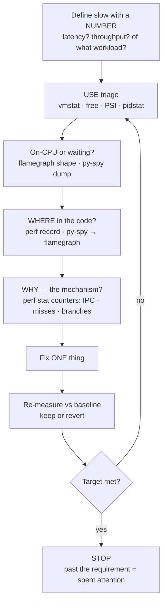
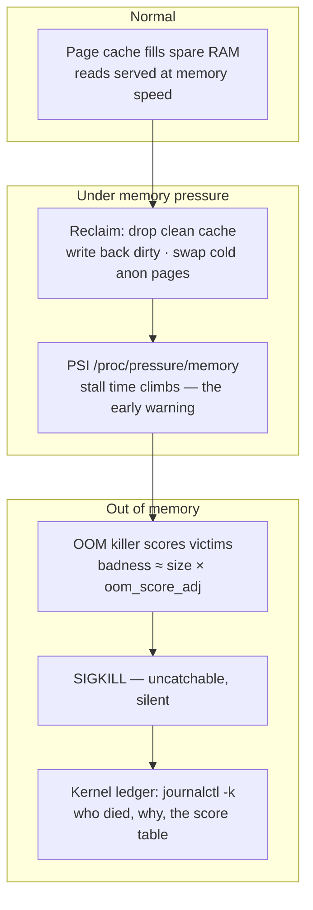

# Module 21 — CPU & Memory Performance

<small>Stage 7 · Optimization · ~2 weeks at 4 h/day · Prerequisites — M1 (the hardware, now instrumented) · M13 (cProfile, graduating to sampling) · M17 (cgroups as the pressure bench) · M15 (baselines, numbers-not-adjectives).</small>

## Why this matters

**Performance engineering** is the discipline of making software fast by MEASURING what the hardware
actually does — where the cycles go (profiling), *why* they go there (caches, pipelines, branch
predictors), and how memory really behaves (the hierarchy, the page cache, pressure). It replaces
folklore — "Python is slow", "just add RAM" — with **evidence and mechanism**.

"It's slow" is the most common and worst-specified bug report in computing. Without instruments you get
cargo-cult fixes: caching things that were never hot, rewriting code the CPU never runs, buying hardware
to paper over an O(n²). Module 1 gave you the map of the machine; this module hands you the
**instruments** and the reflex to use them **first**. The profile names the guilty function; the
counters name the guilty *mechanism* (cache misses? branch mispredicts? allocation storms?); the fix
targets it — with before/after numbers as the proof (M15's evidence law, applied to speed).

!!! info "What this unlocks"
    M22 (GPUs) is *this* thinking on different silicon — the ladder gains a VRAM rung, occupancy
    replaces IPC · M23 debugs "slow" as a symptom class beside "broken" · M25 graphs what you read here
    by hand (PSI, counters, OOM events) · M26–28 spend these mechanics **daily** — training throughput
    IS memory-bandwidth management. The deeper unlock: the **measure-first reflex** as permanent
    equipment — you never guess at speed again.

---

## Watch

*Watch once, then rely on the notes below — you should never need to rewatch.*

<div class="lo-video-placeholder" markdown="1">
<span class="lo-play">▶</span>
**Explainer video — coming**
<small>Record per <code>../media/README.md</code>, upload to YouTube, then replace this card with the embed.</small>
</div>

??? note "For the author — drop-in YouTube embed (replace VIDEO_ID)"
    Once the explainer is on YouTube, replace the placeholder card above with:
    ```html
    <div class="lo-video-embed">
      <iframe src="https://www.youtube-nocookie.com/embed/VIDEO_ID"
              title="Module 21 — CPU & Memory Performance"
              allow="accelerometer; autoplay; clipboard-write; encrypted-media; gyroscope; picture-in-picture"
              allowfullscreen></iframe>
    </div>
    ```
    Video script beats (from the blueprint's Definition / Architecture / Misconceptions):
    measure-first, the profile is the permission slip → the **latency ladder** (L1 to DRAM is ~100×) →
    **IPC**: is the core fed or stalled? → a cache miss's stall (waiting, not computing) →
    `free`'s "available" is the number, not "free" (the page cache is not waste) → the OOM killer as the
    lifeboat officer (SIGKILL is not a conversation).

**Terminal cast — pending; record per `../media/README.md`.**

!!! tip "Follow along, don't just watch"
    Open the [Guided Lab](#guided-lab-instruments-load-and-locality) in a browser terminal and run each
    command yourself as it appears. Generating a load and *watching the meters move* is how the numbers
    stop being trivia and become intuition.

---

## Key Notes

*Standalone. This is the reference you keep.*

### The latency ladder — the map of every performance mystery

Every "why is this slow?" is really "which level of the hierarchy am I actually hitting?" Memorize
this — it is the one table this curriculum insists lives in your head:

| Level | Size (typical) | Latency (approx) | The lesson |
|---|---|---|---|
| Registers | ~KB | ~0 cycles | Where work happens |
| L1 cache | 32–64 KB | ~4 cycles (~1 ns) | Per-core, split instruction/data |
| L2 cache | 256 KB–2 MB | ~12 cycles (~4 ns) | Per-core |
| L3 cache | 8–128 MB | ~40 cycles (~15 ns) | Shared — the last line of defence |
| DRAM | GBs | ~60–100 ns | **The wall: ~100× L1** |
| NVMe SSD | TBs | ~20–100 µs | ~1000× DRAM |
| Network (same DC) | — | ~500 µs | M14's floor |
| Disk seek / far network | — | ~ms–100 ms | Geological time |

The **memory wall**: DRAM is ~100× L1 — a cache miss costs ~300+ instructions of lost opportunity.
That single ratio explains why "slow" so often means **waiting on memory**, not computing.

### IPC — the most diagnostic number on the bench

`perf stat` reports **instructions per cycle**. It is the first fork in the road:

| IPC | Meaning | Check next |
|---|---|---|
| High (≈2–4) | **Compute-bound** — the core is fed | Reduce work (algorithm) or vectorize |
| Low (<1) | **Stalled** — waiting, not computing | The counters say *which* wait ↓ |

When IPC is low, the other counters disambiguate the mechanism — this is the diagnostic triangle:

| Counter is high | Signature | Fix family |
|---|---|---|
| cache-misses | **Memory-bound** — poor locality, working set > cache | Contiguous layout, access order, streaming, chunking |
| branch-misses | **Prediction-hostile** — unpredictable branches (~15–20 cyc each) | Sort/structure the data, branchless code |
| neither | **Off-CPU** — locks, sleep, I/O | py-spy dump, `strace -c`, off-CPU analysis |

### The USE method — the 60-second triage

Before profiling any code, triage the whole system. For every resource, read three things — Gregg's
**USE** method — and let it point you at the guilty resource:

| Tool | Reads | Signal it gives |
|---|---|---|
| `uptime` | Load average | Runnable + uninterruptible demand over 1/5/15 min |
| `vmstat 1` | CPU / memory / IO, live | `r` (run queue), `si/so` (swap!), `wa` (iowait), `bi/bo` (disk) |
| `free -h` | Memory | **available** is the number — the page cache is not waste |
| `mpstat`/`pidstat 1` | Per-CPU / per-process | Which core, which process is busy |
| `cat /proc/pressure/*` | PSI stall time | The honest modern pressure signal — climbs *before* the cliff |
| `perf top` / `top` | Live hot spots | What is running right now |

### The performance ladder — the loop you drive on every "slow"



Intuition **proposes**; the counters **dispose**. The profile is the permission slip — no optimization
without one. And you *stop at the requirement*: a 10× that took a day beats a 50× that took a month
nobody needed.

### Linux memory, read truthfully — and the OOM ledger

`free`'s "free" column is small **by design** — Linux fills spare RAM with the page cache (every
`read(2)` lands there and stays; the second read is a memory op, not a disk op). Reclaimable cache is
counted in **available**, which is the number that matters. Pressure looks like this from cache down to
the kill:



`si/so` nonzero in `vmstat` = swap thrash (working set exceeds RAM). An exit **137** with empty logs is
the OOM killer's signature: SIGKILL is uncatchable, so the app gets no last word — the kernel testifies
instead. The forensics chain is now complete end to end: kubectl (M19) → docker (M16) → cgroup
`memory.events` (M17) → `journalctl -k` (here).

### Python's contract

Interpreted bytecode costs ~10–100× C because of per-operation dispatch overhead. numpy escapes by
handing a whole batch to a silent C-plus-SIMD specialist under one Python call. The **GIL** means one
thread interprets at a time — I/O parallelism is fine, but CPU parallelism needs **processes or native
code**. The boundary law from M13/M15, with a performance clause: glue at Python speed, hot loops at C
speed.

<div class="lo-remember" markdown="1">
**Must remember (if you keep only seven things):**

1. **Measure first.** The profile decides, not the intuition — no optimization without one.
2. **The latency ladder is the map.** L1 ~1 ns → DRAM ~60–100 ns (**~100×**); a line is **64 bytes**.
3. **IPC splits the world:** high = fed/compute-bound; low = stalled — then the counters say *why*.
4. **Locality is the game.** Caches only help repeated/nearby access — layout and access *order* are performance decisions.
5. **`free`'s answer is "available", not "free".** The page cache is not waste; `si/so` ≠ 0 means thrash; PSI warns first.
6. **Exit 137 = the OOM killer.** SIGKILL is uncatchable — the kernel log is the manifest.
7. **Optimize in order:** algorithmic → batching → locality → vectorize → cache → **parallelize last** (compute Amdahl first). Then **stop at the requirement**.
</div>

---

## Guided Lab: instruments, load, and locality

*Basic, step-by-step. You install the toolkit, read an idle machine with the USE checklist, generate a
CPU load and watch it, then FEEL the cache with a row-major vs column-major timing. Everything runs in a
throwaway `~/perf-lab/` you build first; the machine is restored at the end.*

<div class="lo-lab-actions" markdown="1">
[▶ Open interactive lab](https://killercoda.com/learning-os/course/killercoda/module-21){ .lo-btn target=_blank }
[⧉ Open in Codespaces](https://codespaces.new/randaguiac20/learning-os){ .lo-btn target=_blank }
[⌨ Run locally](#run-locally){ .lo-btn .lo-btn--ghost }
[View lab source](https://github.com/randaguiac20/learning-os/tree/main/killercoda/module-21){ .lo-btn .lo-btn--ghost target=_blank }
</div>

<span id="run-locally"></span>
!!! tip "Three ways to run this lab — pick any (all free)"
    - **Instant, no account** — click **Open interactive lab** (Killercoda): a Linux terminal in your browser.
    - **Your own cloud** — click **Open in Codespaces**: runs in your GitHub account's free tier (120 core-hrs/mo).
    - **Local, unlimited, $0** — any Linux / macOS / WSL terminal, or a throwaway container: `docker run -it ubuntu bash`, then `apt-get update && apt-get install -y stress-ng sysstat gcc time` and follow the steps below.

    Killercoda is the zero-setup on-ramp; Codespaces and local use *your own* free resources, so they scale to any class size.

    > **`perf` note:** in a shared browser VM the kernel's `perf` counters are often unavailable (a
    > paranoia/permissions gate). This lab therefore reads mechanism with tools that *always* work —
    > `mpstat`, `pidstat`, `vmstat`, `/usr/bin/time -v`, and a compiled C timer. Where you *do* have
    > `perf`, `perf stat` adds the IPC/cache-miss census on top.

=== "1 · Install the toolkit and read the spec sheet"
    ```bash
    sudo apt-get update -qq
    sudo apt-get install -y stress-ng sysstat linux-tools-common time gcc
    lscpu                         # cores/threads, cache sizes, flags — find sse/avx
    lscpu | grep -i cache         # YOUR L1/L2/L3 sizes — copy them into the ladder
    nproc                         # how many logical CPUs load generation should target
    ```
    Journal: your machine's L1/L2/L3 sizes beside the latency-ladder numbers. Everything downstream is
    "which level am I hitting?" — you need YOUR sizes to answer it.

=== "2 · The 60-second USE checklist (idle baseline)"
    ```bash
    uptime                        # load average — demand over 1/5/15 min
    vmstat 1 3                    # r, si/so (swap), wa (iowait), bi/bo (disk) — 3 samples
    free -h                       # read AVAILABLE, not free — the cache is not waste
    mpstat 1 3                    # per-CPU busy vs idle, idle machine
    cat /proc/pressure/cpu /proc/pressure/memory   # PSI: stall time (near zero when idle)
    ```
    You need a **baseline** — anomaly detection needs to know what "normal idle" looks like here. Note
    the idle `%idle` and the near-zero PSI `some` values; you will watch them move next.

=== "3 · Generate a CPU load and measure it"
    ```bash
    mkdir -p ~/perf-lab && cd ~/perf-lab
    stress-ng --cpu "$(nproc)" --timeout 12s &      # busy every core for 12s (background)
    mpstat 1 5 | tee ~/perf-lab/cpu-load.log        # capture 5s of per-CPU stats
    wait                                            # let stress-ng finish
    # record the measurement (the Average line's last field is %idle)
    idle=$(awk '/^Average:/{print $NF}' ~/perf-lab/cpu-load.log)
    printf 'workload=stress-ng-cpu\ntool=mpstat\nidle_percent=%s\nresource=CPU\nverdict=utilization-high\n' "$idle" | tee -a ~/perf-lab/measurements.log
    ```
    `%idle` should crater toward 0 while stress-ng runs — utilization is high, the CPU is the busy
    resource. That is the **U** in USE, measured. (With `perf`: `perf stat stress-ng --cpu 1 -t 3s` shows
    a high IPC — a fed core.) **Click Check** to verify your measurement log.

=== "4 · Feel the cache: row-major vs column-major"
    Build a tiny C timer that sums a 64 MB matrix two ways — along rows (sequential, cache-friendly) and
    down columns (strided, cache-hostile):
    ```bash
    cat > ~/perf-lab/locality.c <<'EOF'
    #include <stdio.h>
    #include <stdlib.h>
    #include <string.h>
    #include <time.h>
    #define N 4096
    int main(int argc, char **argv) {
        int *a = malloc((size_t)N*N*sizeof(int));
        memset(a, 1, (size_t)N*N*sizeof(int));
        int col = (argc > 1 && strcmp(argv[1], "col") == 0);
        struct timespec s, e; long long sum = 0;
        clock_gettime(CLOCK_MONOTONIC, &s);
        if (col) { for (int j=0;j<N;j++) for (int i=0;i<N;i++) sum += a[(size_t)i*N+j]; }
        else     { for (int i=0;i<N;i++) for (int j=0;j<N;j++) sum += a[(size_t)i*N+j]; }
        clock_gettime(CLOCK_MONOTONIC, &e);
        double t = (e.tv_sec-s.tv_sec) + (e.tv_nsec-s.tv_nsec)/1e9;
        printf("%s_major_seconds %.4f\n", col ? "col" : "row", t);
        return (int)(sum & 1);
    }
    EOF
    gcc -O2 -o ~/perf-lab/locality ~/perf-lab/locality.c
    ~/perf-lab/locality row | tee -a ~/perf-lab/locality.log      # sequential — cache-friendly
    ~/perf-lab/locality col | tee -a ~/perf-lab/locality.log      # strided — cache-hostile
    # look at the two numbers, then RECORD which was faster:
    echo "faster=row" | tee -a ~/perf-lab/locality.log
    ```
    Same instructions, same data, same total work — column-major is typically **several times slower**
    because each step jumps 16 KB and misses the cache. That gap is the memory wall, felt. **Click
    Check** to verify both timings and your recorded verdict. (With `perf`:
    `perf stat -e cache-misses ~/perf-lab/locality col` shows the misses that cause it.)

=== "5 · Memory-bound vs CPU-bound, then restore"
    ```bash
    # memory pressure: watch PSI and swap move (safe, short, self-limiting)
    stress-ng --vm 2 --vm-bytes 75% --timeout 10s &
    vmstat 1 5                                   # si/so and free move — the memory resource strains
    cat /proc/pressure/memory                    # PSI 'some' climbs — the honest warning
    wait
    free -h                                       # available recovers after the load ends
    # restore the machine — leave nothing running
    pkill stress-ng 2>/dev/null; echo "clean"
    ```
    CPU-bound (Step 3) pins `%idle` low with calm memory; memory-bound pushes `si/so` and PSI while the
    CPU may sit waiting. **Different resource, different meter** — that is the whole point of USE.

!!! success "You can stop here and have learned something real"
    If you installed the kit, read an idle machine with USE, drove a CPU load and *saw the meters move*,
    and felt the cache cliff between row and column order — the guided lab is done. Now make it harder.

---

## Solo Lab: figure it out

*Harder. Goals only — minimal hand-holding. Work in `~/perf-lab/`, keep `bench.sh` hygiene (governor
acknowledged, a warmup run, N≥5, median + spread, one variable at a time). A number without spread is a
vibe. Struggle here is the point; reveal a hint only after you've tried.*

### Challenge 1 — Classify three workloads by their signature
Build three small loops — a tight arithmetic loop, a pointer-chasing loop over a shuffled array, and a
branchy loop over random data. Time each (or `perf stat` if available) and classify each as
**compute- / memory- / branch-bound**, citing the evidence.

??? tip "Hint"
    Compute-bound = high IPC / high `%usr` with calm cache. Memory-bound = slow despite simple work
    (the pointer chase can't be prefetched). Branch-bound = fast work but the *unpredictable* `if`
    dominates. Without `perf`, argue from the access pattern + `/usr/bin/time -v` and the structure.

??? success "Solution"
    ```bash
    /usr/bin/time -v ./tight   ; /usr/bin/time -v ./chase   ; /usr/bin/time -v ./branchy
    # with perf: perf stat -e instructions,cycles,cache-misses,branch-misses ./chase
    ```
    Tight loop: IPC ≈2–4, negligible misses → **compute-bound**. Pointer chase: low IPC, high
    cache-misses (each load waits ~100 ns on DRAM, un-prefetchable) → **memory-bound**. Branchy random:
    high branch-misses, each a ~15–20-cycle flush → **branch-bound**. The counter you cite IS the
    diagnosis.

### Challenge 2 — Prove a mechanism from a blank editor
In ≤45 min, build **one** mechanism demo from scratch with full bench hygiene: the **sorted-vs-unsorted
sum** (branch prediction) or the **stride walk** (locality). Get the expected order-of-magnitude effect
and attach the evidence.

??? tip "Hint"
    Sorted vs unsorted: sum only elements above a threshold; sort the array first in one variant. Same
    data, same work — the *predictability* of the branch is the only difference. Report median + spread
    over N≥5 runs, warmup excluded.

??? success "Solution"
    ```bash
    # sorted branches are predictable → the predictor learns the runs → ~severalfold faster
    # branch-misses (perf) or wall-time (time) is the smoking gun; a branchless arithmetic
    # variant (mask instead of if) closes the gap and proves it was the branch.
    ```
    The predictor learns long runs of taken/not-taken in sorted data (~free); random data defeats it,
    flushing the pipeline per miss. If your two runs aren't clearly apart, your array is too small or the
    compiler vectorized the branch away — grow it, or drop optimization for the demo.

### Challenge 3 — Diagnose a planted slow program by the ladder
Take an unknown slow program and drive the **performance ladder aloud**: define the number → USE triage
→ on-CPU or waiting → where → **why** (mechanism with evidence) → name the fix family. Fix one and
re-measure.

??? tip "Hint"
    Resist opening a flamegraph first — that skips triage and you may chase the wrong resource. Is the
    CPU even busy? `vmstat`/PSI split CPU vs memory vs IO. iowait is *not* CPU. An O(n²) is slow in every
    language — don't blame Python before you check the algorithm.

??? success "Solution"
    The graded parts are **order and evidence**: the mechanism is named with a counter/tool *before* any
    fix talk, off-CPU time isn't misread as innocent, and the fixed one shows a real delta vs baseline.
    Common trap: a page-cache-cold first run misread as a regression (run it twice).

### Challenge 4 — Make It Fast (the stage project's core)
Take the five-sin log pipeline — per-line regex re-compilation, string-concat accumulation, O(n²)
list-scan dedup, unbuffered per-line writes, a second full pass for stats — to **≥10×** on a large
generated input. Preserve `victim.py` beside `fixed.py`; every win explained in hardware terms.

??? tip "Hint"
    Baseline with `bench.sh` (median + spread) → profile (py-spy flamegraph names the #1 plateau) → fix
    **one** thing → re-measure → journal the delta → repeat. Prove output equivalence with a diff
    harness at every step — speed with wrong answers is a bug with a good PR.

??? success "Solution"
    The expected arc, **found not told**: hoist the regex → `"".join()` not `+=` → **set not list** (the
    O(n²) kill — algorithmic beats every constant) → batched/buffered IO → single pass. The report is the
    deliverable: an iteration table (fix · mechanism · before · after · cumulative), before/after
    flamegraphs, the bench conditions, the stop-decision, and the null results kept ("this didn't help —
    worth knowing"). If the O(n²) survived to the end, the profile discipline failed.

### Challenge 5 (stretch) — Amdahl and the GIL
Compute the **maximum** speedup for a program that is 20% serial, then demonstrate why CPU-bound Python
*threads* don't achieve it.

??? success "Solution"
    Speedup = 1 / (0.2 + 0.8/N); as N→∞ this is 1/0.2 = **5×** — the serial fraction is the ceiling, so
    measure it *before* building parallelism. Threads on a CPU-bound loop serialize on the **GIL** (one
    interpreter at a time; py-spy shows the dance) — the escapes are **multiprocessing** or **native/
    numpy**. Shrinking the serial part often beats adding cores.

---

## Self-Check

*Close the notes. Answer aloud or in writing **first**, then reveal. Recalling — even when it's hard —
is what builds the memory. The latency ladder is drilled DAILY this module; it must survive to the
capstone.*

??? question "Recite the latency ladder (five levels + numbers) and state the memory wall."
    Registers ~0 · **L1 ~1 ns** (~4 cyc) · **L2 ~4 ns** · **L3 ~15 ns** · **DRAM ~60–100 ns** · NVMe
    ~20–100 µs · same-DC network ~500 µs · HDD/far net ~ms+. The wall: **DRAM ≈ 100× L1** — ~300+
    instructions of lost opportunity per miss. A cache line is **64 bytes**.

??? question "IPC is 0.4 with high cache-misses on a data loop. Bound by what, and the fix family?"
    **Memory-bound** — low IPC means stalled, and the high cache-misses name the reason: poor locality
    or a working set larger than cache. Fix family: **contiguous layout (arrays/numpy), fix the access
    order, stream/chunk** so the working set fits. (Not "rewrite in a faster language" — the stalls
    remain.)

??? question "How does a sampling profiler watch production where a tracing one shouldn't?"
    It **interrupts N times/sec and records the stack**; hot code statistically dominates the samples.
    Overhead is tiny and constant (no per-call instrumentation) → production-safe. Tracing instruments
    *every* call — exact counts but heavy distortion (the Heisenberg tax). py-spy/perf sample; cProfile
    traces.

??? question "A script runs 40 s the first time, 4 s every time after. Explain; which number ships?"
    The first run paid **cold-cache disk reads**; later runs hit the **page cache** (a memory op, not
    disk). Prove it by dropping caches / using a fresh file (the 40 s returns); `vmstat`'s `bi` column
    shows the disk truth. Report **both, labeled cold/warm** — headline whichever matches production.

??? question "`free` shows gigabytes 'free' in cache, yet `vmstat` shows si/so and the box crawls. Reconcile."
    The file-backed page cache looks abundant, but the **anonymous working set exceeds RAM** — the
    kernel is swapping hot anon pages (`si/so` ≠ 0 = thrash) while cache holds file pages. `free`'s
    totals can look fine under severe pressure. The metric that would have warned you: **PSI**
    (`/proc/pressure/memory` stall % climbing well before the crawl).

??? question "A service restarts 'randomly' with exit 137 and empty logs. The forensics chain?"
    137 = 128+9 = **SIGKILL**, and empty logs because SIGKILL is uncatchable. Chain: (1) supervisor's
    verdict — `docker inspect` OOMKilled / `kubectl describe` last state → (2) cgroup ledger —
    `memory.events` oom_kill count (M17) → (3) kernel log — `journalctl -k` score table (who, badness,
    victim) → (4) history — `memory.current`/PSI trend before death (leak or spike?).

??? question "Amdahl: a program is 20% serial. Max speedup across infinite cores, and the lesson?"
    Speedup = 1/(0.2 + 0.8/N) → **5×** as N→∞. The **serial fraction is the ceiling** — compute it before
    building parallelism (Amdahl first, threads later); shrinking the serial part often beats adding
    cores.

!!! example "Teach it back (the real test)"
    Out loud, in **4 minutes, no notes**: *"The profile is the permission slip"* — name the guess-culture
    failure (caching cold code, rewriting the wrong function), then the loop (number → profile →
    mechanism → fix → re-measure), using your own iteration table as the exhibit — **including a null
    result**. Then, in **90 seconds**, teach *"what is a cache?"* to a smart 12-year-old — the
    desk-and-library analogy required (books in arm's reach vs the library at 100×; the library ships
    whole shelves, so neighbours are nearly free). If you can't yet, reread the Key Notes, don't move on.

---

## Mastery checklist

*Tick these honestly, cold (no notes). They **gate** progress — passing M21 opens M22 (GPU & NPU), the
same thinking on parallel silicon. A module is only "done" when every box is true.*

- [ ] **Explain** the measure-first loop and defend it against instinct-culture (the profile is the permission slip).
- [ ] **Describe** the latency ladder with numbers, from memory — the module's one required memorization.
- [ ] **Define** IPC and identify the three `perf stat` signatures (compute / memory / branch-bound) with the counter as evidence.
- [ ] **Contrast** on-CPU vs off-CPU time and name the tools for each (py-spy dump, `strace -c`, vmstat iowait).
- [ ] **Analyze** a flamegraph fluently — plateaus (hot leaves), towers (deep calls), width = time.
- [ ] **Design** a trustworthy benchmark: the hygiene five (governor pinned · warmup · N≥5 · median+spread · one variable).
- [ ] **Implement** mechanism demos from scratch (stride/locality, branch prediction, GIL, cache warm/cold, batching).
- [ ] **Build** the ≥10× Make It Fast with the defended report — every row's mechanism survives interrogation.
- [ ] **Optimize** in the right order: algorithmic → batch → locality → vectorize → cache → parallelize LAST.
- [ ] **Troubleshoot** memory pressure truthfully: `available` vs `free`, PSI, swap's honest role.
- [ ] **Deploy** the OOM forensics chain end to end (137 → supervisor → cgroup `memory.events` → `journalctl -k`).
- [ ] **Test** output equivalence on every optimization (the diff harness — speed with wrong answers rejected).
- [ ] **Restore** the machine: governor back, sandboxes cleaned, no lingering stress processes, ≥1 null result journaled.

---

## Review — lock it in

Spaced repetition is where the memory forms — and this module's **latency ladder** stays in weekly
rotation until the capstone (the one memorization the curriculum insists on). **Interleaving continues:**
every M21 review also pulls one earlier item. Schedule these and *keep* them:

| When | Do | Interleaved item |
|---|---|---|
| **Week-1 close (Day 7)** | Ladder + core + flamegraph blanks · signature + hygiene sprints · validation A1–C8 | M20 least-privilege loop · M17 cgroup files |
| **Module close (Day 14, gate)** | All five blanks · all sprints · validation E13–E15, F16–F18, J25–J26 | M19 pod ladder · M14 waterfall read |
| **Day 1** | Flashcards · the ladder sprint (45 s) · validation misses re-derived at the bench | M20 policy misses |
| **Day 3** | A fresh flamegraph generated and read (any tool of yours), ≤15 min | M19 20-minute deploy |
| **Day 7** | The two planted-slow-program drills re-run cold · the OOM chain performed | M20 policy plants |
| **Day 14** | The Make It Fast victim RE-broken differently → re-fixed by the ladder | M18 bench spec |
| **Day 30** | Validation retake ≥90 · the personal latency atlas re-verified (numbers still true?) | Stage-6 sampler |

**Connects forward to:** GPUs (M22 — this thinking, VRAM bandwidth and occupancy replacing DRAM and
IPC) · Debugging (M23 — "slow" as a diagnosable symptom class) · Monitoring (M25 — the counters, PSI,
and OOM events you read by hand, now scraped and graphed with alerts) · ML training (M26–28 — throughput
IS memory-bandwidth management, the OOM chain on 80 GB GPUs, the report format on every experiment).

!!! quote "The one-sentence takeaway"
    M1 taught what the machine is; M21 turns that hardware story into an instrumented practice — the
    ladder in your head, the profiler in your hand, the mechanism named before the fix — the discipline
    every remaining module spends.
