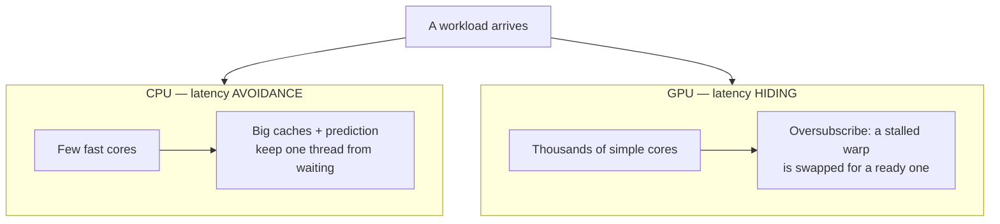
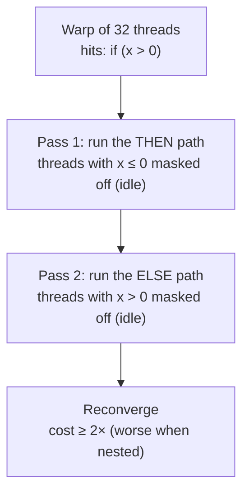
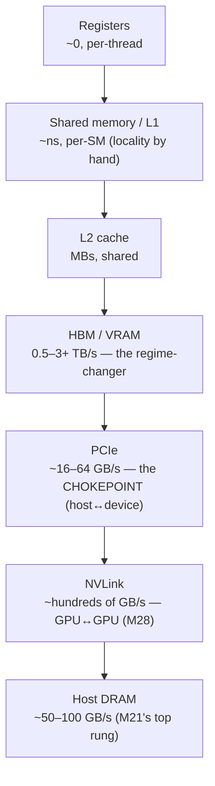
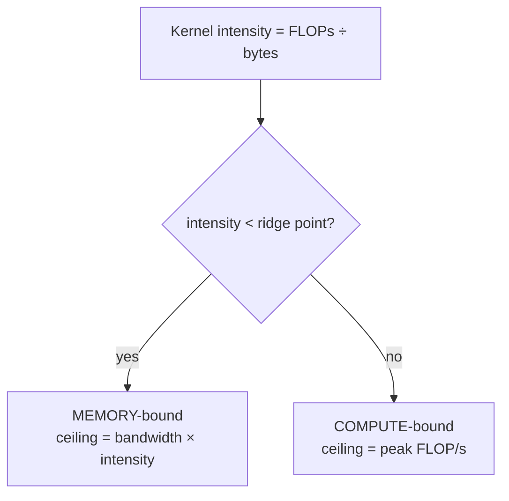

# Module 22 — GPU & NPU Performance

<small>Stage 7 · Optimization · ~1 week at 4 h/day · Prerequisite — Module 21 (the memory ladder, bandwidth thinking, the profile-first reflex, Amdahl). Builds on M1 (the hardware vocabulary) and M14 (PCIe/NVLink as networks). This module closes Stage 7.</small>

## Why this matters

A **GPU** is a throughput machine: thousands of simple cores that **hide** memory latency with massive
parallelism, where a CPU (M21) **avoids** latency with caches and prediction — the same machine,
philosophically inverted, and fed by memory ~10–20× wider. An **NPU** (and Google's TPU) narrows
further: fixed-function matrix engines that trade generality for efficiency. This week teaches the
architecture well enough to **size workloads, read the instruments, and argue CPU-vs-GPU-vs-NPU
credibly** — the hardware literacy the AI stage spends daily.

M21 ended at a ceiling: the free lunch is over, Amdahl caps threading, and DRAM bandwidth (~50–100 GB/s)
starves data-parallel math. For workloads that are **wide and regular** — exactly ML's matmuls — the GPU
changes the regime: ~10–20× the memory bandwidth (HBM: 1–3+ TB/s), ~100× the raw FLOPs, latency
**hidden** by oversubscription instead of avoided by caches. What it does **not** fix: serial logic,
branchy code, and small/chatty workloads (the transfer tax eats them). Knowing that boundary *is* the
module — and the habit it installs is **sizing math before you reach for silicon.**

!!! info "What this unlocks"
    The curriculum's AI stage runs on this silicon. **M26** (training) is a GPU-feeding exercise — batches,
    mixed precision, and the starvation clinic on real DataLoaders. **M27** (inference) is bandwidth
    arithmetic: the napkin law productized as quantization + continuous batching. **M28** (infrastructure)
    schedules this silicon — NVLink fabrics, `nvidia.com/gpu` on M19's platform, utilization-is-money. And
    the capstone's budget is GPU-hours priced by this week's dossier. Learn the sizing and judgment now and
    every hardware decision ahead runs on arithmetic instead of faith.

---

## Watch

*Watch once, then rely on the notes below — you should never need to rewatch.*

<div class="lo-video-placeholder" markdown="1">
<span class="lo-play">▶</span>
**Explainer video — coming**
<small>Record per <code>../media/README.md</code>, upload to YouTube, then replace this card with the embed.</small>
</div>

??? note "For the author — drop-in YouTube embed (replace VIDEO_ID)"
    Once the explainer is on YouTube, replace the placeholder card above with:
    ```html
    <div class="lo-video-embed">
      <iframe src="https://www.youtube-nocookie.com/embed/VIDEO_ID"
              title="Module 22 — GPU & NPU Performance"
              allow="accelerometer; autoplay; clipboard-write; encrypted-media; gyroscope; picture-in-picture"
              allowfullscreen></iframe>
    </div>
    ```
    Video script beats (from the blueprint's Definition / Architecture / Misconceptions):
    the two philosophies (four geniuses vs a ten-thousand-worker factory with a giant conveyor) → SIMT and
    the warp as the unit → latency hidden, not avoided (the 400-cycle stall swapped away) → why matmul is
    the perfect workload (N³ FLOPs on N² data) → the crossover curve as the honest boundary (the loading
    dock is narrow — small jobs lose in shipping) → the napkin law derived live (tokens/s ≈ bandwidth ÷
    model bytes) → close on the judgment table: *is this workload wide and regular?*

**Terminal cast — pending; record per `../media/README.md`.**

!!! tip "Follow along, don't just watch"
    Open the [Guided Lab](#guided-lab-the-numbers-that-decide) and **run the arithmetic yourself** — the
    roofline classification, the batching curve, the transfer break-even. Every idea here is a number you
    can compute on a plain CPU; the GPU just lives on the same curves, larger. Typing beats watching, and
    it is part of how the memory forms.

---

## Key Notes

*Standalone. This is the reference you keep.*

### The picture: two philosophies



The CPU spends its die on *not waiting* — caches, branch prediction, out-of-order execution keep one fast
thread fed. The GPU does the opposite: it *assumes* it will wait on memory and keeps so many threads in
flight that a stalled one costs nothing — the scheduler instantly runs a ready one. Same stall M21 fought
with caches, **defeated by oversubscription** instead.

### CPU vs GPU, side by side

| | CPU (M21) | GPU (this week) |
|---|---|---|
| Philosophy | Latency avoidance (caches, prediction, OoO) | Latency hiding (10 000s of threads in flight) |
| Cores | Few, complex, fast (~GHz, deep OoO) | Thousands, simple, slower — grouped into SMs |
| Execution | Independent threads | **SIMT**: warps of 32 threads in lockstep |
| Cache role | The main event (most of the die) | Small; bandwidth + parallelism do the job |
| Memory | DDR ~50–100 GB/s | HBM/GDDR ~0.5–3+ TB/s |
| Wins at | Serial, branchy, latency-critical | Wide, regular, throughput math |

The software model (CUDA's, but vendor-neutral in concept): a **kernel** launched over a **grid** of
**blocks** of **threads**; blocks land on **SMs** (streaming multiprocessors); threads run in **warps**
(32, lockstep). Occupancy — resident warps vs the SM's capacity — is the fuel gauge for latency hiding:
too few warps and the machine idles.

### SIMT divergence — the warp is the unit

A warp's 32 threads share one instruction pointer. Hit a data-dependent branch and **both paths run
serially under masks** — half the threads idle each way:



This is the branch-mispredict lesson's harsher sibling: not a *probabilistic* penalty but **guaranteed
serialization**. It is why GPU code avoids branching on data, and why you reason in warps of 32, not in
threads.

### The memory ladder — new rungs

M21's ladder gains a top end. The numbers to add to your atlas:



The two facts that drive everything below: **HBM is 10–20× a CPU's DRAM bandwidth** (the product you're
buying), and **PCIe is 30–100× slower than HBM** (the transfer tax that gates small jobs).

### Arithmetic intensity & the roofline

**Arithmetic intensity** = FLOPs performed per byte moved. Plot it against the machine's two ceilings and
one plot answers *"can this workload ever be fast here?"*:

| Term | Meaning |
|---|---|
| Arithmetic intensity | FLOPs ÷ bytes moved — the workload's position on the x-axis |
| Bandwidth roof | intensity × memory bandwidth — the ceiling *below* the ridge |
| Compute roof | the chip's peak FLOP/s — the flat ceiling *above* the ridge |
| Ridge point | compute roof ÷ bandwidth — where the two roofs cross |
| Memory-bound | intensity < ridge: bandwidth is your ceiling (most ML kernels) |
| Compute-bound | intensity > ridge: FLOP/s is your ceiling (big matmul) |



**Matmul is the perfect workload:** an N×N multiply does N³ FLOPs on N² data, so intensity **grows with
N** — tiles stage into shared memory, get reused many times, and tensor cores chew them compute-bound.
"AI runs on GPUs" reduces to "AI is mostly matmul."

### Batching — the GPU's oxygen

Two mechanisms make batching *mandatory* here where it was merely *nice* on a CPU. (1) **Occupancy:** the
machine needs thousands of resident threads to hide latency — batch-1 leaves SMs empty (starvation).
(2) **Amortization:** fixed costs (kernel launches, weight fetches over HBM) divide across the batch, so
per-sample cost collapses. The batch-size knob trades **latency for throughput** — you measure this exact
curve on a CPU in the Guided Lab.

### The transfer tax and the napkin law

**The transfer tax:** host→device over PCIe is ~tens of GB/s vs HBM's TB/s. A small job spends more time
*shipping* than *computing*, so the CPU finishes before the GPU's data even arrives. The rule: **move
data once, keep it resident, batch the work.** There is a **crossover size** below which the GPU always
loses — you compute it in the lab.

**Why inference is memory-bound (the napkin law):** generating one token reads **every weight once**
(~model-size bytes) for only a handful of FLOPs each — tiny intensity, firmly memory-bound. So:

> **tokens/s ≈ HBM bandwidth ÷ model bytes.**

This one line predicts single-stream LLM serving speed to first order — and explains why **batching is the
only lever that changes the arithmetic** (the weight-read amortizes across sequences). It is the price of
every AI API, on a napkin.

### The instruments — nvidia-smi's four vital signs

`nvidia-smi` is the GPU's `top`. Read these four fluently:

| Vital sign | Healthy | The anomaly it reveals |
|---|---|---|
| **Utilization %** | high + steady | low = starvation or CPU fallback; spiky = batch too small |
| **Memory (used/total)** | headroom below total | at the ceiling = OOM risk; unexpectedly empty = **CPU fallback** |
| **Power (draw vs cap)** | near cap when working | far under cap = starved (not being fed) |
| **Temperature** | below throttle | high = thermal **throttling** — clocks drop, performance sags |

The timing law that keeps GPU numbers honest: **execution is asynchronous — synchronize before every
timestamp.** Recipe: warmup run (JIT + allocator) → `torch.cuda.synchronize()` around the timed region →
N runs, median + spread (M21's hygiene, intact). Skip the sync and the benchmark *lies* impossibly fast.

### Precision menu and the NPU/TPU tier

| Precision | Bytes/param | Effect |
|---|---|---|
| FP32 | 4 | the baseline |
| TF32 / FP16 / BF16 | 2 | ~2× throughput, ½ memory — tensor cores feast |
| FP8 / INT8 | 1 | ~2× again — accuracy managed with a *test*, not a mood |

Each halving roughly doubles tensor-core throughput and halves memory. Below the GPU sits the **NPU/TPU**
tier: **systolic arrays** — data marches through a fixed grid of multiply-accumulate units (matmul as
plumbing). TPUs do this at datacenter scale; edge NPUs (phone/laptop SoCs) run *blessed* ops at
single-digit watts. Fixity buys perf/W and costs generality — only the blessed ops run fast.

### The accelerator judgment table — the module's closing artifact

| | CPU | GPU | NPU / TPU |
|---|---|---|---|
| **Wins at** | serial, branchy, latency-critical, small | wide/regular throughput math (matmul) | stable *blessed* ops at best perf/W |
| **Loses at** | wide data-parallel math | serial/branchy/small (transfer tax) | anything novel or off its fixed path |
| **Feed it** | keep the working set in cache | batches + resident data (kill the transfer) | the exact op it was built for |
| **Measure it** | perf/py-spy flamegraph (M21) | nvidia-smi + honest sync-timing | vendor tooling; perf/W |

The workflow, daily form: **is it wide and regular?** (no → CPU) → **does it fit?** (the VRAM math) →
**is it worth the transfer?** (crossover size) → **memory- or compute-bound?** (intensity/napkin math) →
then the instrument loop (nvidia-smi *during* the run: starved? full? hot?). And remember the moat: the
market runs on **CUDA's software ecosystem**, not the transistors — the M13→M16→M17 interface thesis at
industry scale.

<div class="lo-remember" markdown="1">
**Must remember (if you keep only seven things):**

1. **Latency hidden, not avoided** — the CPU avoids waiting with caches; the GPU oversubscribes so a stalled warp costs nothing. The whole design secret.
2. **The warp is the unit** — think in 32s; **divergence** serializes both branch paths under masks (≥2×), the mispredict lesson's harsher sibling.
3. **Bandwidth is the product** — HBM is 10–20× a CPU's DRAM; most ML kernels are **memory-bound**, so bytes-÷-bandwidth predicts real speed shockingly well.
4. **The napkin law:** tokens/s ≈ HBM bandwidth ÷ model bytes — inference reads every weight per token; **batching** is the only lever that moves it.
5. **The transfer tax gates entry** — PCIe is 30–100× slower than HBM; below the **crossover size** the GPU loses before it computes. Residency is strategy.
6. **Sizing is `params × bytes-per-param`** — 13B at FP16 ≈ 26 GB *weights alone*; training with Adam multiplies again. "13B ≠ 13 GB."
7. **Synchronize before timing** — GPU execution is async; skip the sync and the number lies. Warmup → sync → N runs, median + spread.
</div>

---

## Guided Lab: the numbers that decide

*Basic, step-by-step, and **GPU-optional** — every activity is a number you compute on a plain CPU, the
same curve a GPU lives on, larger. You'll classify kernels on the roofline, MEASURE the batching effect
with numpy, read a saved `nvidia-smi` sample, and compute the host↔device transfer break-even. The live
CUDA path is signposted for when you have real silicon. Everything lives in a throwaway `~/gpu-lab/`.*

<div class="lo-lab-actions" markdown="1">
[▶ Open interactive lab](https://killercoda.com/learning-os/course/killercoda/module-22){ .lo-btn target=_blank }
[⧉ Open in Codespaces](https://codespaces.new/randaguiac20/learning-os){ .lo-btn target=_blank }
[⌨ Run locally](#run-locally){ .lo-btn .lo-btn--ghost }
[View lab source](https://github.com/randaguiac20/learning-os/tree/main/killercoda/module-22){ .lo-btn .lo-btn--ghost target=_blank }
</div>

<span id="run-locally"></span>
!!! tip "Ways to run this lab — pick any (all free)"
    - **Instant, no account** — click **Open interactive lab** (Killercoda): a plain Linux CPU VM. It has
      **no GPU**, and it doesn't need one — the roofline, batching, and transfer arithmetic are the same
      numbers on any silicon. GPU-specific commands are shown as *"run on your own NVIDIA box."*
    - **Your own cloud** — click **Open in Codespaces**: runs in your GitHub account's free tier (120
      core-hrs/mo). Also CPU-only, and equally sufficient for every activity here.
    - **Local, unlimited, $0** — any Linux / macOS / WSL terminal, or `docker run -it ubuntu bash`, then
      follow the steps below.
    - **With a real GPU** — run locally on an NVIDIA box, or rent a **cloud spot GPU** (M37): only then do
      live `nvidia-smi`, CUDA, and vLLM produce real numbers. The lab teaches the reasoning so those
      numbers *mean* something when you get there.

    Killercoda is the zero-setup on-ramp; the transferable ideas (intensity, batching, the transfer tax)
    need no accelerator — the GPU just relocates the same curves.

=== "1 · Two philosophies + your bench"
    Set up a sandbox and check what silicon this box actually has — hardware honesty first:
    ```bash
    mkdir -p ~/gpu-lab && cd ~/gpu-lab
    lspci 2>/dev/null | grep -i 'vga\|3d\|display' || echo "no discrete GPU enumerated (expected on Killercoda)"
    command -v nvidia-smi >/dev/null && nvidia-smi || echo "no nvidia-smi here — that's fine; we compute the numbers instead"
    python3 --version
    ```
    On this VM there is **no GPU** — and that is the point of the design. The CPU **avoids** latency
    (caches, prediction); the GPU **hides** it (thousands of resident warps). Everything a GPU is *good at*
    reduces to arithmetic you can do here: how much data moves, how many FLOPs, and how a fixed cost
    amortizes over a batch. Journal the one question this module hangs on: **is my workload wide and
    regular?**

=== "2 · Arithmetic intensity & the roofline"
    Write a tiny classifier: FLOPs ÷ bytes gives a kernel's **intensity**; compare it to the machine's
    **ridge point** (compute roof ÷ bandwidth) to call it memory- or compute-bound.
    ```bash
    cat > ai.py <<'EOF'
    # Roofline classifier — pure arithmetic, no GPU needed.
    # A model H100-class machine: 2 TB/s HBM, 100 TFLOP/s compute.
    BW    = 2_000e9      # bytes/s  (2 TB/s HBM)
    PEAK  = 100e12       # FLOP/s   (100 TFLOP/s)
    RIDGE = PEAK / BW    # FLOP/byte where the two roofs cross
    
    def classify(name, flops, bytes_moved):
        ai = flops / bytes_moved
        verdict = "MEMORY-BOUND" if ai < RIDGE else "COMPUTE-BOUND"
        print(f"{name:14s} intensity={ai:8.2f} FLOP/byte -> {verdict}")
    
    print(f"ridge point = {RIDGE:.1f} FLOP/byte\n")
    # SAXPY: y = a*x + y  -> 2 FLOP, reads x,y writes y = 12 bytes (FP32)
    classify("saxpy",       2,                       12)
    # LLM decode: read every weight once (2 bytes FP16) for ~2 FLOP each
    classify("llm_decode",  2,                       2)
    # Big matmul N=4096: 2*N^3 FLOPs on 3*N^2 * 4 bytes
    N = 4096
    classify("matmul_4096", 2*N**3,                  3*N*N*4)
    EOF
    python3 ai.py
    ```
    Read the output: **saxpy** and **llm_decode** sit far below the ridge — memory-bound, bandwidth is
    their ceiling. **matmul_4096** towers above it — compute-bound, the one workload where every GPU
    feature aligns. Change `N` to 64 and re-run: small matmul is memory-bound too (intensity ≈ N/6). That
    is why *size* decides whether a matmul is GPU-shaped.

=== "3 · Measure the batching effect (numpy, CPU)"
    The GPU's oxygen is batching — and you can measure the exact curve on a CPU. Each **forward pass reads
    every weight once** (a fixed cost, the napkin law's *model bytes*), then does the per-sample compute;
    the fixed read amortizes across the batch. Install numpy and time it at growing batch sizes:
    ```bash
    pip install numpy >/dev/null 2>&1 || pip3 install numpy >/dev/null 2>&1 || sudo apt-get install -y python3-numpy >/dev/null 2>&1
    cat > batch.py <<'EOF'
    import time, numpy as np
    # The "weights": read once per forward pass — the FIXED cost (the napkin law's model bytes),
    # batch-independent, and larger than cache so it streams from RAM every call.
    W  = np.random.rand(4096, 4096).astype(np.float32)   # ~67 MB of weights
    Dc = 256
    Wc = np.random.rand(Dc, Dc).astype(np.float32)       # the per-sample compute
    reps = 20
    rows = []
    print(f"weights = {W.nbytes/1e6:.0f} MB, read once per forward pass (the fixed cost)\n")
    for B in (1, 8, 64, 512):
        X = np.random.rand(B, Dc).astype(np.float32)
        _ = W.sum(); _ = X @ Wc                          # warmup
        t0 = time.perf_counter()
        for _ in range(reps):
            _ = W.sum()      # fetch every weight once — batch-INDEPENDENT (the weight tax)
            Y = X @ Wc       # per-sample compute — scales WITH the batch
        total = (time.perf_counter() - t0) / reps
        per_item = total / B
        rows.append((B, total, per_item))
        print(f"batch={B:4d}  total={total*1e3:8.3f} ms  per-item={per_item*1e3:.5f} ms")
    with open("batch-results.csv", "w") as f:
        f.write("batch,total_ms,per_item_ms\n")
        for B, total, per_item in rows:
            f.write(f"{B},{total*1e3:.5f},{per_item*1e3:.6f}\n")
    print("\nwrote batch-results.csv")
    EOF
    python3 batch.py
    ```
    **Total** time barely moves (the fixed weight-read dominates), but **per-item** time *plummets* —
    often 100×+ from batch 1 to batch 512. That is the napkin law in miniature: batch-1 pays the whole
    weight-read for one result; batch-512 shares it across 512. A starved GPU at batch-1 wastes the machine
    the same way — this curve is why serving fleets batch hard.

    Click **Check** (in the interactive lab) to verify `batch-results.csv` shows per-item time decreasing.

=== "4 · Read nvidia-smi like an instrument"
    There's no GPU here, so read a **saved sample** — the same skill, offline. Create it, then interpret
    the four vital signs:
    ```bash
    cat > nvidia-smi-sample.txt <<'EOF'
    +-----------------------------------------------------------------------------+
    | NVIDIA-SMI 550.54      Driver Version: 550.54      CUDA Version: 12.4        |
    |-------------------------------+----------------------+----------------------+
    | GPU  Name        Persistence-M| Bus-Id        Disp.A | Volatile Uncorr. ECC |
    | Fan  Temp  Perf  Pwr:Usage/Cap|         Memory-Usage | GPU-Util  Compute M. |
    |===============================+======================+======================|
    |   0  NVIDIA A100-80GB    On   | 00000000:07:00.0 Off |                    0 |
    | N/A   38C    P0    71W / 400W |   2048MiB / 81920MiB |     18%      Default |
    +-------------------------------+----------------------+----------------------+
    | Processes:                                                                  |
    |  GPU   GI   CI        PID   Type   Process name            GPU Memory Usage |
    |    0   N/A  N/A     31337      C   python train.py             2046MiB      |
    +-----------------------------------------------------------------------------+
    EOF
    cat nvidia-smi-sample.txt
    ```
    Now diagnose from the four vital signs — **utilization 18%**, **power 71W of 400W**, **memory 2 GB of
    80 GB**, **temp 38C**. A python process *is* on the GPU (so not a silent CPU fallback), temperature is
    cool (no throttle), VRAM is nearly empty. Util 18% + power far under cap = **starvation**: the GPU is
    fed too slowly. The verdict this module drills: *low util is a **data-pipeline** symptom* — M21's
    ladder owns the fix (profile the host: disk? decode? single-threaded transform?), not the GPU.

    > On a real NVIDIA box, run `nvidia-smi` live and `nvidia-smi dmon` for the time series — the columns
    > you just read are the same.

=== "5 · The transfer tax — compute the break-even"
    A GPU only wins if the compute it saves beats the cost of **shipping the data across PCIe**. Compute
    the crossover size for a matmul — pure arithmetic, no silicon:
    ```bash
    cat > breakeven.py <<'EOF'
    # Should this matmul go to the GPU? Compare CPU-only vs GPU (transfer + compute).
    CPU   = 500e9     # FLOP/s  (fast numpy on CPU)
    GPU   = 20e12     # FLOP/s  (device compute)
    PCIE  = 16e9      # bytes/s (host<->device)
    LAUNCH = 1e-5     # s, fixed kernel-launch overhead
    
    print(f"{'N':>6} {'cpu_ms':>9} {'gpu_ms':>9} {'transfer_ms':>12}  winner")
    crossover = None
    for N in (64, 128, 256, 512, 1024, 2048, 4096, 8192):
        flops = 2 * N**3
        bytes_moved = 3 * N*N * 4          # ship A, B, and C back (FP32)
        cpu   = flops / CPU
        gpu   = flops / GPU + bytes_moved / PCIE + LAUNCH
        win = "GPU" if gpu < cpu else "CPU"
        if win == "GPU" and crossover is None:
            crossover = N
        print(f"{N:6d} {cpu*1e3:9.3f} {gpu*1e3:9.3f} {bytes_moved/PCIE*1e3:12.3f}  {win}")
    print(f"\ncrossover: the GPU first wins at N = {crossover}")
    EOF
    python3 breakeven.py
    ```
    Below the crossover the **CPU wins** — the tiny compute can't repay the PCIe shipping + launch cost;
    above it the GPU's throughput dominates. That single number is the transfer tax made concrete, and it
    is why *"we have a GPU"* never means *"use the GPU."* Small, chatty workloads lose before they compute.

    Click **Check** (in the interactive lab) to verify `breakeven.py` prints a crossover and the small
    sizes favor the CPU.

!!! success "You can stop here and have learned something real"
    If you classified kernels on the roofline, watched per-item time fall as the batch grew, read the four
    vital signs off a saved `nvidia-smi`, and computed a transfer break-even — you have the module's whole
    reasoning, no GPU required. Now make it harder.

---

## Solo Lab: figure it out

*Harder. Goals only — minimal hand-holding. The arithmetic is **bare-hands**: estimate on paper first,
confirm with a script after. Struggle here is the point; reveal a hint only after you've tried.*

### Challenge 1 — Size three models cold
For each, give VRAM for **weights only** and state the method: a **3B** at FP16, an **8B** at INT8, a
**70B** for training with Adam. No calculator before your estimate.

??? tip "Hint"
    The whole method is `params × bytes-per-param` (FP16 = 2, INT8 = 1), then **overhead honesty**.
    Training is not weights alone — optimizer states (Adam keeps two extra tensors per parameter) plus
    activations multiply the number several times over.

??? success "Solution"
    - **3B FP16:** 3e9 × 2 = **~6 GB** weights (fits a 24 GB card with room for activations/KV cache).
    - **8B INT8:** 8e9 × 1 = **~8 GB** weights (a 16 GB card becomes plausible — with the caveat that INT8
      is *measured against an accuracy budget*, never assumed free).
    - **70B training (Adam):** weights ~140 GB at FP16 **alone**, then Adam's two moment tensors + master
      copy + activations push it to **several hundred GB** — many GPUs, not one. The universal mistake is
      "70B = 70 GB": params × *bytes*, and training multiplies again.

### Challenge 2 — Assign silicon to three workloads
Assign **CPU / GPU / NPU** and defend each with the judgment table's logic (shape → size → transfer →
perf/W): (a) a **branchy regex log-miner**, (b) **nightly embedding of 10M documents**, (c) an
**always-on wake-word detector on a phone**.

??? success "Solution"
    - **(a) regex log-miner → CPU.** Branchy and serial — SIMT's worst case (divergence). Latency-critical,
      pointer-chasing, small per-item work: the CPU's home turf.
    - **(b) 10M-doc embedding → GPU.** Wide and regular (the same matmul over millions of inputs), and
      **batchable** — the transfer tax amortizes across a huge, pre-staged corpus. Right answer for the
      right reason: the batch/residency argument, not "it's ML so GPU."
    - **(c) wake-word on battery → NPU.** A stable, *blessed* op where **perf/W** dominates — fixity's whole
      point. A GPU would win on throughput and lose on the power bill; the NPU exists for exactly this.

### Challenge 3 — Find the three timing sins
A colleague's GPU benchmark claims a matmul is "impossibly fast," the first run is counted in the average,
and the end-to-end number omits something. Name all three sins and the fix for each.

??? tip "Hint"
    One is about *when* the timer reads relative to async execution; one is about the *first* launch; one
    is about what the "end-to-end" number quietly leaves out.

??? success "Solution"
    1. **No synchronize.** GPU execution is asynchronous, so the timer stops before the kernel finishes —
       an impossible speed. Fix: `torch.cuda.synchronize()` before *and* after the timed region.
    2. **First-run JIT counted.** Run 1 pays kernel compilation + allocator warmup (seconds vs
       milliseconds). Fix: a **warmup** run, then measure runs 2…N (median + spread).
    3. **Transfer excluded.** The "end-to-end" claim timed only the resident kernel, not the host→device
       copy — the kernel is fast, the pipeline slow. Fix: include the PCIe transfer in any end-to-end
       number (M21's *measure the whole thing* law).

### Challenge 4 — The roofline verdict, by hand
A kernel moves **4 bytes per FLOP**. The GPU has **2 TB/s** bandwidth and **100 TFLOP/s** compute. Which
roof binds, and what is the actual ceiling — regardless of the FLOP/s on the spec sheet?

??? success "Solution"
    Intensity = 1 FLOP ÷ 4 bytes = **0.25 FLOP/byte**. Bandwidth roof = 2 TB/s × 0.25 = **0.5 TFLOP/s**.
    Against the 100 TFLOP/s compute roof, it is **memory-bound by 200×** — the ceiling is **0.5 TFLOP/s** no
    matter what the spec sheet advertises. This is the napkin law generalized: for low-intensity kernels,
    *bandwidth × intensity* is the truth, and 100% utilization can still be "slow."

### Challenge 5 (stretch) — The accelerator postscript
Your "Make It Fast" victim (Stage 7 project) had branchy parsing, string/dict work, and disk IO on a
~500 MB dataset. Would a GPU have helped? Argue the verdict as rigorously as a positive one.

??? success "Solution"
    **Mostly no — and the *why* is the lesson.** Shape: the parsing is branchy/serial (divergence), the
    string/dict work is pointer-chasing (cache-hostile, not matmul), and the GPU cannot touch disk IO.
    Size + transfer: ~500 MB with per-item logic sits **below the crossover** — the PCIe transfer tax is
    never amortized. **If** a heavy numeric pass existed (a big aggregation expressible as matrix math), you
    would run the sizing math — but here the CPU fixes (M21's profiling ladder) were the right fixes. A
    negative verdict, defended with mechanisms (divergence, intensity, crossover), is worth as much as a
    positive one.

---

## Self-Check

*Close the notes. Answer aloud or in writing **first**, then reveal. Recalling — even when it's hard — is
what builds the memory.*

??? question "State the two latency philosophies (CPU vs GPU) and the mechanism behind each."
    **CPU — latency avoidance:** caches, branch prediction, and out-of-order execution keep one fast thread
    from waiting. **GPU — latency hiding:** massive oversubscription (thousands of resident warps); a
    stalled warp is swapped for a ready one, so stalls cost nothing while work remains. Same problem,
    opposite answer.

??? question "Define warp, SM, occupancy, and divergence — one line each."
    **Warp:** 32 threads executing in lockstep (the real unit of execution). **SM:** the GPU's
    core-equivalent — warp schedulers + ALUs + tensor cores + shared memory. **Occupancy:** resident warps
    vs the SM's capacity (the latency-hiding fuel gauge). **Divergence:** a warp's threads disagreeing at a
    branch — both paths run serially under masks.

??? question "Derive the napkin law for LLM token generation and state what it predicts."
    Each generated token reads **every weight once** (~P params × bytes-per-param) for only a few FLOPs
    each → tiny intensity → memory-bound → **tokens/s ≈ HBM bandwidth ÷ model bytes**. It predicts
    single-stream serving speed to first order, and shows why **batching** (amortizing the weight-read
    across sequences) is the economic lever.

??? question "Size a 13B model: VRAM for FP16 inference (weights only), and roughly with INT8?"
    FP16: 13e9 × 2 bytes ≈ **26 GB** weights alone (fits a 40/80 GB card; not a 24 GB card once
    activations/KV land). INT8: ×1 byte ≈ **13 GB** (a 24 GB card becomes plausible with overheads).
    Method: `params × bytes-per-param`, then overhead honesty — never "13B = 13 GB."

??? question "GPU util reads 20% with host CPUs pegged. Diagnose it, and name which module owns the fix."
    The GPU is **starved**: the host-side data pipeline (loading/preprocessing/augmenting) can't feed it —
    classic input-bound training. **M21's ladder owns it** — profile the *host* (disk? decode?
    single-threaded transform?); the fix is prefetch/parallel loading/faster IO, not GPU work.

??? question "Training is slow and nvidia-smi shows NO python process on the GPU. What happened, and the one-line check?"
    **Silent CPU fallback** — tensors/model never moved to the device (or CUDA was unavailable and the code
    defaulted quietly). Check: `print(next(model.parameters()).device)` — assert `"cuda"` early, and gate
    on `torch.cuda.is_available()` at startup.

??? question "util reads 100% but throughput is far below the napkin prediction. Why can 100% util still be 'slow'?"
    util% means "an SM had work this sample period," **not** efficiency. The kernels can be
    bandwidth-starved (low-intensity ops pinned at the memory roof), divergent, or non-coalesced — busy
    machinery moving little useful work. The **roofline verdict** and effective GB/s tell the truth util%
    can't.

!!! example "Teach it back (the real test)"
    Out loud, in **5 minutes, no notes** — *"The factory and the geniuses"*: four geniuses (CPU) vs ten
    thousand assembly workers with a giant conveyor (GPU); one hard puzzle vs a million identical stickers.
    Then land the twist that makes the module: the factory's **loading dock is narrow** (PCIe) — a small
    job spends longer in shipping than in the factory. Bound the analogy honestly: the workers move in
    **lockstep rows of 32**, and a fork in the instructions makes half of each row wait (divergence).
    Finish by **deriving the napkin law live** (bandwidth ÷ bytes) and stating the judgment table's
    one-sentence version. If you can't yet, reread the Key Notes — don't move on.

---

## Mastery checklist

*Tick these honestly, cold (no notes). They **gate** progress — passing M22 also closes **Stage 7**
(Optimization) and opens Troubleshooting (M23). A module is only "done" when every box is true.*

- [ ] **Explain** latency hiding vs avoidance with the mechanism — no CPU-thinking leaks ("the GPU caches it").
- [ ] **Describe** the SIMT model — warps, SMs, occupancy, divergence — reasoning in 32s, not threads.
- [ ] **Draw** the extended memory ladder cold, with numbers (HBM, PCIe, NVLink) and PCIe marked as the chokepoint.
- [ ] **Contrast** memory-bound vs compute-bound via the roofline, and place two workloads (LLM decode; a big matmul).
- [ ] **Derive** the napkin law from first principles and apply it to a model on a stated bandwidth.
- [ ] **Size** a model's VRAM cold — `params × bytes-per-param` + overhead honesty; "13B ≠ 13 GB."
- [ ] **Identify** the four failure signatures — CPU fallback, starvation, OOM, throttle — from nvidia-smi.
- [ ] **Analyze** nvidia-smi's four vital signs fluently (util, memory, power, temp) and each anomaly.
- [ ] **Design** honest GPU benchmarks — the sync-before-timing law + warmup + N-runs hygiene.
- [ ] **Compute** the transfer break-even and read the crossover curve's three regions.
- [ ] **Evaluate** CPU vs GPU vs NPU for three fresh workloads with the judgment table's logic.
- [ ] **Optimize** by the GPU catalog — batch, keep resident, drop precision (with a test), coalesce.
- [ ] **Teach:** pass the teach-back — the factory analogy bounded, the napkin law derived live, "when NOT to use a GPU" landed.

---

## Review — lock it in

Spaced repetition is where the memory forms. **Interleaving stays active** — every M22 review also pulls
one item from **Module 21** (the ladder, the profile-first reflex, the hygiene this week extends). This
module closes Stage 7, so the **stage** review rides alongside the module reviews. The napkin + ladder
sprints join permanent weekly rotation through the capstone. Schedule these and *keep* them:

| When | Do | Interleaved M21 item |
|---|---|---|
| **Day 4 (midpoint)** | Philosophy + ladder blanks · the timing + napkin sprints · validation A1–C7 | Memory-ladder sprint (registers → disk, with numbers) |
| **Day 7 (gate)** | All five blanks cold · every sprint · validation E13–F18, I23–I24 · **STAGE 7 GATE** | The four host-side starvation signatures, cold |
| **Day 1** | Flashcards · the napkin sprint · validation misses re-derived | M21 misses |
| **Day 3** | A fresh model sized cold (one you haven't sized) + the worksheet cross-check | Read a flamegraph, cold |
| **Day 7** | The crossover experiment re-run on a fresh runtime (variance witnessed) | An OOM log interpreted (the cgroup ledger) |
| **Day 14** | The judgment table reproduced cold + one real workload assigned per column | The OOM chain (cgroup → kernel → allocator) |
| **Day 30** | Validation retake (target ≥90) · the atlas's GPU column re-verified | Stage-7 sampler (both M21 and M22) |

**Connects forward to:** M23 (debugging methodology — the GPU ladder joins the symptom catalog) · M25
(DCGM metrics on the dashboards; utilization-is-money automated) · M26 (training — mixed precision, the
starvation clinic on real DataLoaders, batch sizing as the first hyperparameter) · M27 (inference — the
napkin law productized: quantization, continuous batching, the latency/throughput SLO knob) · M28
(infrastructure — NVLink fabrics, `nvidia.com/gpu` on M19's platform, the rent-vs-own arithmetic) · the
capstone, whose every hardware decision cites this week's dossier.

!!! quote "The one-sentence takeaway"
    M22 completes the hardware arc begun in M1 — the throughput machine understood, measured, and sized —
    closing Stage 7 with the instruments *and* the judgment to command silicon, so the AI stage ahead runs
    on arithmetic instead of faith.
