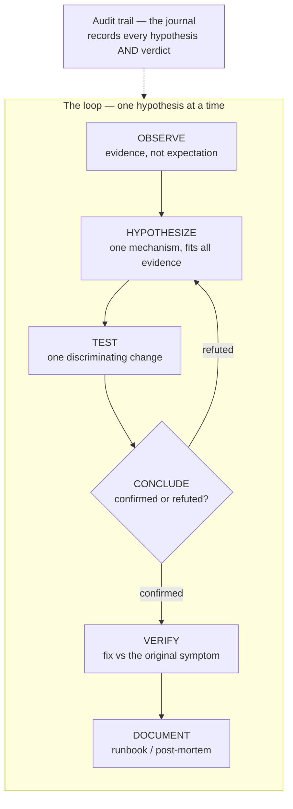
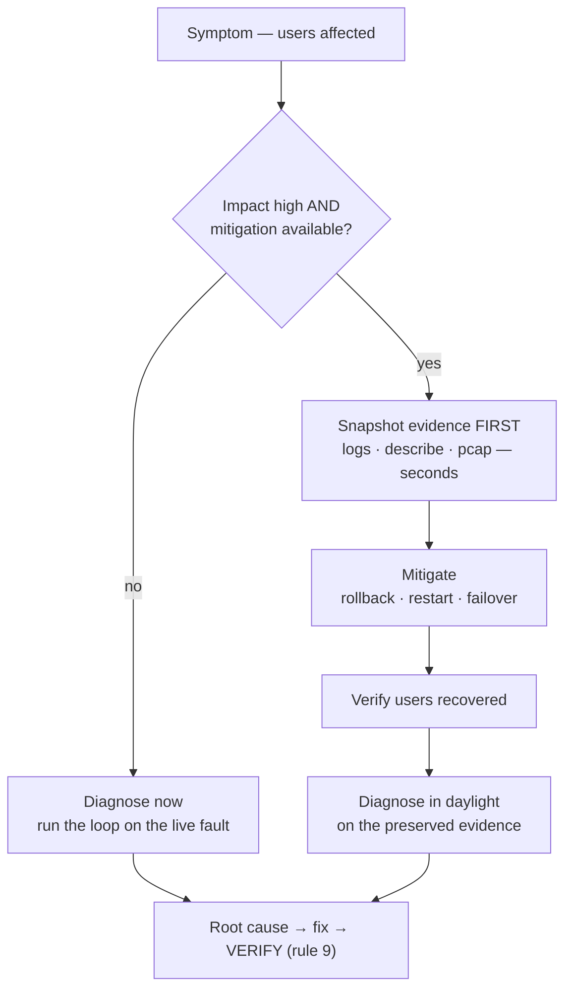

# Module 23 — Debugging Methodology

<small>Stage 8 · Troubleshooting · ~2 weeks at 4 h/day · Prerequisite — Modules 01–22 (every ladder this method routes between). Opens Stage 8; the one-module stage that turns twenty-two modules of layer knowledge into one routed discipline.</small>

## Why this matters

**Debugging methodology** is the scientific method aimed at broken systems: observe what **is** (not what
*should* be), form **one** testable hypothesis, test it with **one** change, conclude honestly, and repeat —
with an audit trail — until the root cause is found, fixed, *verified* fixed, and documented.

You already debug — every prior module planted faults and drilled their ladders. What's missing is the
**unified layer above them**: when a system breaks and nobody tells you *which* layer, where do you start?
How do you keep three hypotheses from becoming thirty minutes of flailing? How do you debug at 3 a.m.
without trusting your 3 a.m. brain? This module answers all three — and the profession treats it as **the**
senior-engineer differentiator: everyone can fix bugs they understand; *method* is how you fix the ones you
don't.

!!! info "What this unlocks"
    The layer matrix's six rows **are** the curriculum's stages — app (M12–13), container (M16), below-deck
    (M17), orchestrator (M19–20), network (M14), OS/hardware (M1–M4, M21–22). M23 adds no new layer; it adds
    the **method that routes between them**. Forward: **M24** (security) is this loop under an adversary who
    edits the logs · **M25** (observability) industrialises the OBSERVE stage · **M26–28** run the same loop
    on *stochastic* systems · the **capstone** is where something *will* break. Learn the method now and
    every later failure is the same conversation with new vocabulary.

---

## Watch

*Watch once, then rely on the notes below — you should never need to rewatch.*

<div class="lo-video-placeholder" markdown="1">
<span class="lo-play">▶</span>
**Explainer video — coming**
<small>Record per <code>../media/README.md</code>, upload to YouTube, then replace this card with the embed.</small>
</div>

??? note "For the author — drop-in YouTube embed (replace VIDEO_ID)"
    Once the explainer is on YouTube, replace the placeholder card above with:
    ```html
    <div class="lo-video-embed">
      <iframe src="https://www.youtube-nocookie.com/embed/VIDEO_ID"
              title="Module 23 — Debugging Methodology"
              allow="accelerometer; autoplay; clipboard-write; encrypted-media; gyroscope; picture-in-picture"
              allowfullscreen></iframe>
    </div>
    ```
    Video script beats (from the blueprint's Definition / Architecture / Internal mechanisms):
    the loop as the engine (observe → hypothesize → test → conclude → verify → document) →
    "quit thinking and look" vs confirmation bias (read the *actual* error, aloud) →
    one variable is information theory (N changes buy 2ⁿ ambiguity) →
    the layer matrix and the triage question ("where does the first *hard* evidence point?") →
    strace as the wiretap between program and kernel → git bisect as binary search over history →
    the 3 a.m. fork and why mitigation ≠ resolution → the blameless post-mortem as an evidence-quality mechanism.

**Terminal cast — pending; record per `../media/README.md`.**

!!! tip "Follow along, don't just watch"
    Open the [Guided Lab](#guided-lab-the-loop-and-the-instruments) in a browser terminal and run each
    command yourself as it appears. In this module especially, *reading the actual output* is the whole
    skill — you can't build that muscle by watching.

---

## Key Notes

*Standalone. This is the reference you keep.*

### The picture: the debugging loop



The loop **starts at OBSERVE** because the debugger's disease is confirmation bias — the brain
pattern-matches to the *last* similar bug and then sees supporting evidence everywhere. Refuted
hypotheses aren't failures; they feed the next observation. That's why it's a *loop*, and why the journal
wrapping it is half the value: it makes negative results reusable and hand-offs possible.

### Agans' nine rules — the guardrails

1. **Understand the system** — the ladders exist because of this.
2. **Make it fail** — reproduce first; the smallest reliable trigger (M12's minimal-repro instinct).
3. **Quit thinking and look** — evidence before theory; read the *actual* error, aloud, to the end.
4. **Divide and conquer** — bisect the layers, bisect the history.
5. **Change one thing at a time** — M21's bench law, generalised.
6. **Keep an audit trail** — the journal (a habit since M2, on purpose).
7. **Check the plug** — the dumb thing first: right cluster? right namespace? plugged in?
8. **Get a fresh view** — the rubber duck, a walk, AI as reviewer of your *trail* (never as the loop).
9. **If you didn't fix it, it ain't fixed** — verify against the original symptom; the coincidence killer.

### The layer matrix — the map that picks the ladder

The triage question that chooses the row: **where does the first *hard* evidence point?**

| Layer | First evidence | The ladder (its module) | Deep tools |
|---|---|---|---|
| **App** | logs, traceback, exit code | M12 traceback autopsy · pdb/pytest (M13) | pdb, py-spy dump, `git bisect` |
| **Container** | `ps -a` exit codes, `docker logs`/`inspect` | M16's five rungs | `docker diff`/`exec`, the debug image |
| **Below deck** | shim tree, cgroup files | M17's below-deck ladder | `nsenter`, `ctr`, `memory.events`, `strace` |
| **Orchestrator** | events, `describe`, endpoints | M19 pod ladder · M20 operations | `kubectl debug`, `auth can-i`, `helm diff` |
| **Network** | refused-vs-timeout, `dig` | M14's five commands | `tcpdump`/wireshark, netscope, `ss` |
| **OS / hardware** | `journalctl -k`, PSI, `dmesg` | M4 service ladder · M21 perf ladder | `strace`, `perf`, `vmstat`, the OOM chain |

### Reading the smell — symptom vocabulary → layer

The fast prior that aims the first probe (a *hypothesis*, never a verdict — "it's always DNS" is a prior,
not a conclusion):

| Symptom / errno | Smells like | Where to look next |
|---|---|---|
| `ETIMEDOUT`, hang, no answer | a silent drop | network / policy / firewall (M14: timeout ≠ refused) |
| `ECONNREFUSED` | the service said "no" | wrong port, or the process is down |
| **Exit 137** | OOM-killed (128 + SIGKILL 9) | memory — the OOM chain (M17/M21) |
| `EACCES` | permissions | M3: owner / mode / ACL, seen from the syscall side |
| `ENOENT` *despite* `ls` | wrong namespace / cwd / symlink | container fs, relative path, `$HOME` under another user |
| "works locally" | environment | PATH · cwd · env (M15's big three) |
| `futex` storm | lock contention | pair `strace` with `py-spy dump` |

### The instruments — one question each

The toolkit is a set of witnesses, each answering a *different* question. Fluency in six beats mastery of
one — this is the matrix's argument:

| The question | The instrument that answers it |
|---|---|
| Which file did it **actually** open? | `strace -f -e trace=file -y` — the ENOENT hunt, the "works-on-my-machine" killer |
| Which address did it **actually** dial? | `strace -e trace=network` — the `connect()`/`ETIMEDOUT` tail |
| Where is a *live* process stuck? | `strace -p PID` — the syscall it's blocked in |
| What's the syscall *bill*? | `strace -c` — the census (unbatched-I/O, quantified) |
| Which **library** call failed? | `ltrace` — one layer up from syscalls |
| Which **commit** introduced it? | `git bisect run <test>` — binary search over history |
| What happened, **in order**? | `journalctl --since … -o short-precise` — build the timeline first |

`strace` gets its truth by `ptrace`: the kernel stops the process at each syscall and strace reads the
registers — the **actual** kernel-boundary traffic. Logs say what the programmer chose to *claim*;
syscalls confess what the program *did*. Working set: `-f` (children) · `-p` (attach) · `-e trace=` (focus)
· `-c` (census) · `-y` (fd paths) · `-T` (durations). Reading discipline: the **last lines before death**,
and the errno vocabulary spoken aloud.

### git bisect — halving beats scanning

1000 commits ≈ **10** tests; six layers ≈ **3** probes with good discriminators. Binary search over
history works *because* of the M8 dividend — **atomic commits** (each is a testable, meaningful state) and
a **fast reliable oracle** test (M13's suite). `git bisect start` → mark `bad`/`good` → `git bisect run
<test>` and the machine executes the method for you. The matrix's triage *is* layer-bisection: "does a
pod-to-pod curl work?" splits the stack in half in one probe.

### The 3 a.m. fork — mitigate now vs diagnose now



Impact decides the fork — but **mitigation ≠ resolution**: rollback stops the bleeding; the loop still owes
a root cause. Preserve evidence *before* mitigating where it's cheap (seconds), because a restart that
truncates the logs destroys the case.

### Root cause vs symptom — and why plural

The error message is a symptom **at the reporting layer**, not the cause **at the origin layer** — the
500-mile email *said* mail failed by distance; the cause was a units bug (a timeout zeroed to ~3 ms) three
layers down. And root causes are **plural**: real failures are conjunctions. Cloudflare's 2019 outage was a
catastrophic-backtracking regex **plus** a missing CPU limit **plus** a global instant rollout **plus** a
rusted kill-switch. A post-mortem that found *one* cause stopped early. The blameless form —
timeline · impact · causes (plural) · contributing factors · what-went-well · action items with owners —
is an **evidence-quality mechanism**: blame taxes testimony, and Therac-25 is the body count of the
alternative.

<div class="lo-remember" markdown="1">
**Must remember (if you keep only seven things):**

1. **The loop:** observe → hypothesize → test → conclude → verify → document — and it *loops* (refuted feeds the next observe).
2. **Evidence before theory.** Read the *actual* error, aloud, to the end — the mechanical antidote to confirmation bias.
3. **One variable per test = one bit.** N simultaneous changes buy 2ⁿ ambiguity; flailing destroys attribution.
4. **The triage question:** *where does the first hard evidence point?* — it picks the matrix row, and the row picks the ladder.
5. **strace confesses; logs claim.** The syscall boundary shows the file it *actually* opened, the address it *actually* dialed.
6. **Bisection halves** — history with `git bisect`, layers with a discriminating probe. Halving beats scanning.
7. **Mitigation ≠ resolution; "it went away" ≠ fixed (rule 9).** Root causes are plural; blameless post-mortems buy complete timelines.
</div>

---

## Guided Lab: the loop and the instruments

*Basic, step-by-step. You'll debug **real planted failures** by method: read the error and its exit code,
use `strace` to see the syscall the program actually made, `git bisect` a regression buried in a throwaway
repo, and fix each **root cause** — then prove it. Everything lives inside a disposable `~/debug-lab/`.*

<div class="lo-lab-actions" markdown="1">
[▶ Open interactive lab](https://killercoda.com/learning-os/course/killercoda/module-23){ .lo-btn target=_blank }
[⧉ Open in Codespaces](https://codespaces.new/randaguiac20/learning-os){ .lo-btn target=_blank }
[⌨ Run locally](#run-locally){ .lo-btn .lo-btn--ghost }
[View lab source](https://github.com/randaguiac20/learning-os/tree/main/killercoda/module-23){ .lo-btn .lo-btn--ghost target=_blank }
</div>

<span id="run-locally"></span>
!!! tip "Three ways to run this lab — pick any (all free)"
    - **Instant, no account** — click **Open interactive lab** (Killercoda): a Linux terminal in your browser.
    - **Your own cloud** — click **Open in Codespaces**: runs in your GitHub account's free tier (120 core-hrs/mo).
    - **Local, unlimited, $0** — any Linux / macOS / WSL terminal, or a throwaway container: `docker run -it ubuntu bash`, then `apt-get update && apt-get install -y gdb strace ltrace file git` and follow the steps below.

    Killercoda is the zero-setup on-ramp; Codespaces and local use *your own* free resources, so they scale to any class size.

=== "1 · Install the tools, meet the bench"
    ```bash
    apt-get update -qq && apt-get install -y gdb strace ltrace file git
    mkdir -p ~/debug-lab && cd ~/debug-lab
    strace -V | head -1     # the syscall wiretap
    ltrace -V | head -1     # the library-call tracer
    gdb --version | head -1  # the interactive debugger
    ```
    These are your standing instruments. `strace` reads the program↔kernel boundary, `ltrace` the
    program↔library boundary, `gdb` stops a process and inspects it. You'll reach for `strace` first this
    lab — it needs no source and cannot be lied to.

=== "2 · Read the error, read the exit code"
    ```bash
    cat > ~/debug-lab/report.sh <<'EOF'
    #!/bin/bash
    set -euo pipefail
    config="$HOME/debug-lab/etc/report.conf"
    threshold=$(grep '^threshold=' "$config" | cut -d= -f2)
    echo "Report OK — threshold=$threshold"
    EOF
    chmod +x ~/debug-lab/report.sh
    printf 'threshold=42\n' > ~/debug-lab/report.conf   # a config exists...
    ~/debug-lab/report.sh; echo "exit=$?"
    ```
    It fails. **Read it, don't guess:** the message names a file, and `exit=` is non-zero. `ls
    ~/debug-lab` shows a `report.conf` *does* exist — so why `No such file or directory`? Resist the urge
    to theorise. The next step *looks*.

=== "3 · strace the failing syscall, fix the root cause"
    ```bash
    strace -f -e trace=file ~/debug-lab/report.sh 2>&1 | grep -i 'report.conf'
    ```
    The `openat(... ) = -1 ENOENT` line shows the **exact path** the program tried — and it's *not* where
    your `report.conf` sits. This is the "works locally" bug: the file exists, just not where the code
    opens it. Fix the **root cause** (put the config where it's actually looked for), then **verify**:
    ```bash
    mkdir -p ~/debug-lab/etc
    cp ~/debug-lab/report.conf ~/debug-lab/etc/report.conf
    ~/debug-lab/report.sh; echo "exit=$?"     # exit=0, prints threshold=42
    ```
    Click **Check** — the verifier confirms `report.sh` now exits 0 with the right threshold.

=== "4 · git bisect a planted regression"
    Build a throwaway repo whose history hides a regression, then let binary search find it:
    ```bash
    mkdir -p ~/debug-lab/calc && cd ~/debug-lab/calc && git init -q
    git config user.email dev@example.com && git config user.name dev
    printf '#!/bin/bash\nadd() { echo $(( $1 + $2 )); }\n' > calc.sh
    printf '#!/bin/bash\nsource "$(dirname "$0")/calc.sh"\nadd "$1" "$2"\n' > run.sh
    printf '#!/bin/bash\ngot=$(bash "$(dirname "$0")/run.sh" 2 3)\n[ "$got" = "5" ] || { echo "FAIL: 2+3=$got"; exit 1; }\necho "PASS: 2+3=5"\n' > test.sh
    echo "calc" > README.md && git add -A && git commit -qm "init calc"
    for i in 1 2 3 4 5; do echo "note $i" >> README.md; git commit -aqm "docs: note $i"; done
    sed -i 's/\$1 + \$2/\$1 - \$2/' calc.sh && git commit -aqm "refactor: simplify add"
    for i in 6 7 8 9; do echo "note $i" >> README.md; git commit -aqm "docs: note $i"; done
    bash test.sh; echo "exit=$?"      # FAIL — the bug is somewhere in history
    ```
    Now bisect — good is the root commit, bad is `HEAD`, and the oracle is the test:
    ```bash
    git bisect start
    git bisect bad
    git bisect good $(git rev-list --max-parents=0 HEAD)
    git bisect run bash test.sh       # names "refactor: simplify add" as the culprit
    git bisect reset
    ```
    Fix the **root cause** (the flipped operator), verify, and check:
    ```bash
    sed -i 's/\$1 - \$2/\$1 + \$2/' calc.sh
    bash test.sh; echo "exit=$?"       # PASS, exit=0
    ```
    Click **Check** — the verifier confirms the regression is gone and the test is green.

=== "5 · Root cause vs symptom — and a gdb/ltrace taste"
    Re-run **both** original symptoms to satisfy rule 9 ("if you didn't fix it, it ain't fixed"):
    ```bash
    ~/debug-lab/report.sh; echo "exit=$?"          # 0
    ( cd ~/debug-lab/calc && bash test.sh )        # PASS
    ```
    Then taste the other two instruments. `ltrace` shows library calls a level above syscalls:
    ```bash
    ltrace -e '+puts+printf' ls >/dev/null
    ```
    And `gdb` catches a crash and prints where it happened — no source required:
    ```bash
    gdb -q -batch -ex run -ex bt --args bash -c 'kill -SEGV $$'
    ```
    Symptom = the error you *saw* (grep's `ENOENT`, the failing test). Root cause = what actually broke
    (a misplaced config, a flipped operator). You fixed causes, not symptoms — and you verified.

!!! success "You can stop here and have learned something real"
    If you read an error and its exit code instead of guessing, used `strace` to see the syscall a program
    *actually* made, bisected a regression to a single commit, and fixed + verified two root causes — the
    guided lab is done. Now make it harder.

---

## Solo Lab: figure it out

*Harder. Goals only — minimal hand-holding. Work in `~/debug-lab/`. The gauntlet is **bare-hands by law**:
no AI during a scenario (rule 8 is post-game analysis, never a mid-loop crutch). Struggle here is the
point; reveal a hint only after you've tried.*

### Challenge 1 — Read one strace tail correctly
A process' `strace` tail ends with `connect(3, {sa_family=AF_INET, sin_port=htons(5432), ...}) = -1
ETIMEDOUT`. State, in one breath: what was attempted, which layer the verdict implicates, and the next two
probes.

??? tip "Hint"
    5432 is Postgres. `ETIMEDOUT` is *not* `ECONNREFUSED` — one means silence, the other means a `RST`.
    Which one implicates the *path* rather than the *service*?

??? success "Solution"
    The process tried to open a TCP connection (fd 3) to port 5432 and the connect **timed out** — no
    answer at all (not refused). That implicates the **network path or a silent drop** (firewall /
    NetworkPolicy / dead host) — *not* "wrong password / DB down," which would return `ECONNREFUSED`. Next
    probes: (1) `nc -zv host 5432` from the *same context* (refused vs timeout vs success splits it), and
    (2) the policy/route check for that destination (NetworkPolicy / ufw / route — the timeout's usual
    suspects). This is M14's signature, read at the syscall boundary.

### Challenge 2 — ENOENT despite `ls`
`strace` shows `openat(AT_FDCWD, "/etc/app/config.yml") = -1 ENOENT`, but the file **exists** when you `ls`
it. Give three distinct explanations, each with its check.

??? success "Solution"
    (1) **Different namespace/root** — the process runs in a container/chroot, so *its* `/etc` isn't yours
    (check: `nsenter -m -t PID ls /etc/app`, or inspect the image's fs). (2) **Different user/cwd
    resolution** — a relative path or `$HOME` expansion differs under the service user (the strace shows
    the *exact* string tried — compare it). (3) **A race/order issue** — the file exists *now* but didn't
    at open time (check timestamps; does a retry succeed?). Honourable fourth: a **symlink to a missing
    target** — `ls` sees the link, `open` follows it (`ls -L` / `stat`).

### Challenge 3 — Corner a flake before chasing its cause
A script fails intermittently (~1 in 8 runs). Before you diagnose anything, what is your first move, and
why is it the *first* move?

??? tip "Hint"
    Reproduction is a *rate* problem before it's a *cause* problem. You cannot debug what won't fail on
    demand.

??? success "Solution"
    **Make it fail *more*** — raise the frequency until it's reliable: loop it (`for i in $(seq 100); do
    ...; done`), add load, tighten the timing window. Only once it fails on demand do you diagnose (a race
    becomes visible when frequency cooperates), then fix, then **verify with a 100-run soak** at zero
    failures. Instrument *less* invasively if adding logging makes it vanish — that's a heisenbug
    (observation-dependent); sample (`py-spy`) rather than perturb.

### Challenge 4 — The 3 a.m. fork, walked
A service is down and users are bleeding. Walk the fork: the decision, the order of operations, and what
gets preserved.

??? success "Solution"
    Impact high **and** mitigation available → **mitigate first**. Order: **snapshot evidence where cheap**
    (copy logs, save `kubectl describe`/`docker inspect` output, a `pcap` if network-shaped — seconds, not
    minutes) → **mitigate** (rollback to the previous digest / restart / failover) → **verify users
    recovered** → *then* run the diagnosis loop on the preserved evidence **in daylight**. Preserve: logs,
    state dumps, the exact deployed versions/digests, and the timeline of actions you took. Mitigation
    bought daylight; it did **not** discharge the root cause.

### Challenge 5 (stretch) — Design a failure (the mastery inversion)
The stage project is **"Break My System."** Author one *realistic* failure: an `inject.sh` (idempotent), a
**tested** `restore.sh`, and a sealed `SOLUTION.md` (symptom → expected loop → root cause → the
discriminating test that cracks it). State which of the nine rules it teaches.

??? tip "Hint"
    Realistic, not a puzzle-box. A plausible production mistake — a bind-mount shadowing code, an env-var
    absent in the unit file, a wrong-context `kubectl` session (the plug!). Difficulty via *realism*, never
    obscurity.

??? success "Solution"
    Example: **inject** a config that points a service at `etc/app.conf` while the file ships at
    `conf/app.conf` (the M15 "big three" — cwd/PATH/env). **restore** deletes the misdirection and is run
    *after* every solve (the restore law applies to drills too). **SOLUTION.md**: symptom = `ENOENT` on
    start; expected loop = read error → `strace -e trace=file` → see the real path → fix location →
    verify; root cause = wrong config path in the unit; discriminating test = does a fresh start from the
    *same image* reproduce it (config bug) or not (host bug)? Rule taught: **make it fail** (reproduce
    before fixing). The mastery thesis: designing a convincing failure requires knowing the layer's real
    failure modes — solving only requires following one.

---

## Self-Check

*Close the notes. Answer aloud or in writing **first**, then reveal. Recalling — even when it's hard — is
what builds the memory. This module's whole subject is not fooling yourself, so grade honestly.*

??? question "State the debugging loop's six stages and what the audit trail adds."
    **Observe** (evidence, not expectation) → **hypothesize** (one mechanism fitting *all* evidence) →
    **test** (one discriminating change/measurement) → **conclude** (confirmed/refuted, honestly) →
    **verify** (the fix against the original symptom) → **document** (runbook/post-mortem). The audit trail
    makes negative results reusable, enables hand-off, and feeds the documentation — it's the loop's memory.

??? question "Why does changing one variable per test converge faster — the information argument?"
    One change = **one bit** cleanly attributed: the outcome discriminates exactly one hypothesis. N
    simultaneous changes create **2ⁿ** candidate explanations for the observation — you spent a test and
    *bought* ambiguity. Convergence is measured in eliminated hypotheses per test; one-at-a-time maximises
    it. (Flailing isn't slow because it's sloppy — it's slow because it destroys attribution.)

??? question "How does strace get its information, and what truth does it offer that logs cannot?"
    Via `ptrace`: the kernel stops the process at syscall entry/exit and strace reads its registers/memory
    — the **actual** kernel-boundary traffic. Truth class: what the program really **did** (paths actually
    opened, addresses actually dialed, errors actually returned) versus logs, which say what the
    programmer *chose to claim*. No source needed; lies impossible.

??? question "`strace` shows `openat(..., \"/etc/app/config.yml\") = -1 ENOENT` but the file exists on `ls`. Three explanations?"
    (1) **Different namespace/root** — a container/chroot's `/etc` isn't yours; (2) **different
    user/cwd/`$HOME` resolution** — a relative path resolves elsewhere under the service user (the strace
    shows the exact string tried); (3) **a race** — it exists now but didn't at open time. (Also: a
    **symlink to a missing target** — `ls` sees the link, `open` follows it.)

??? question "How does git bisect find a culprit in 1000 commits, and which two M8 disciplines make it work?"
    Binary search over history: each test **halves** the suspect range — 1000 commits ≈ 10 tests; `git
    bisect run` automates it via a test's exit code. It works because of **atomic commits** (each is a
    testable, meaningful state) and a **fast, reliable oracle** test (M13's suite) to judge good/bad.

??? question "Why are post-mortems blameless — the *evidence* argument, not the kindness one?"
    Post-mortems run on **testimony**; blame taxes it — people facing consequences sand timelines, omit
    the fatal 4:07 command, defend instead of narrate. Psychological safety is an **evidence-quality
    mechanism**: blameless culture buys complete timelines, and complete timelines buy real (plural) root
    causes. Kindness is a bonus; accuracy is the argument. Therac-25 is the cost of the alternative.

??? question "Your fix 'seems to work.' What does rule 9 demand, concretely?"
    Re-trigger the **original** failure condition (the reproduction from rule 2) and observe it **not**
    fail — and, where stakes warrant, state **why** the fix works (the mechanism). "Seems better" without
    re-running the original trigger is a coincidence candidate. If you *can't* reproduce-then-verify, say
    so explicitly in the trail (known-unverified).

??? question "Exit 137, `EACCES`, `ETIMEDOUT`, 'works locally' — the smell each points to?"
    137 = **OOM-killed** (128 + SIGKILL 9) → memory/the OOM chain. `EACCES` = **permissions** (M3).
    `ETIMEDOUT` = a **silent drop** → network/policy (M14: timeout ≠ refused). "Works locally" =
    **environment** → PATH/cwd/env (M15's big three). A smell is a *prior* that aims the first probe — not
    a verdict.

!!! example "Teach it back (the real test)"
    Out loud, in **3 minutes, no notes**, to a non-technical friend: *"How do you debug?"* — the detective
    frame required (collect evidence before naming suspects, test one alibi at a time, write everything in
    the case file, never close a case on a hunch you didn't re-test). Then, in **90 seconds**, compare the
    three witnesses: **logs** (the program's own testimony — can lie or omit), the **debugger** (the
    interrogation room — total control, but the suspect must come in / be reproducible), and **strace**
    (the wiretap — what it *actually* did, works on live suspects via `-p`). If you can't yet, that's your
    signal to reread the Key Notes, not to move on.

---

## Mastery checklist

*Tick these honestly, cold (no notes) — "honestly" is more load-bearing here than anywhere, because the
whole module is about not fooling yourself. They **gate** progress; passing M23 also **opens Stage 8's
gate** into M24. A module is only "done" when every box is true.*

- [ ] **Define** the loop's six stages and what each produces — and why it *loops* (refuted feeds the next observe).
- [ ] **Explain** why evidence precedes hypothesis: the confirmation bias it defeats and the mechanical antidote (read the actual error, aloud).
- [ ] **List** Agans' nine rules from memory, in phrases, in 45 seconds.
- [ ] **Identify** the likely layer from a symptom smell (timeout, 137, `EACCES`, works-locally, futex) — the smell sprint, cold.
- [ ] **Use** the journal template on every scenario without prompting — every hypothesis written *before* its test, every verdict recorded.
- [ ] **Implement** the first-five-minutes protocol as one practiced parallel sweep, one probe per matrix layer.
- [ ] **Demonstrate** strace fluency — `-f -p -e -c -y -T` chosen for stated reasons, errno vocabulary read aloud, last-lines discipline.
- [ ] **Analyze** a multi-source incident by building the unified timeline **first** — the clock skew detected and corrected before theorising.
- [ ] **Debug** a flaky failure by raising its frequency *before* chasing its cause; verify with a 100-run soak.
- [ ] **Troubleshoot** across all six matrix layers with the right ladder per layer — triage picks the layer within two probes.
- [ ] **Compare** logs vs debugger vs strace as witnesses (when each lies, when each binds) and explain the pincer.
- [ ] **Evaluate** the mitigate-vs-diagnose fork and name what to snapshot first; state why mitigation ≠ resolution.
- [ ] **Bisect** a planted regression manually and with `git bisect run`, and name the two M8 disciplines that make it work.
- [ ] **Design** realistic failure scenarios that each teach a *distinct* rule, with idempotent inject / **tested** restore / sealed solution.
- [ ] **Write** a blameless post-mortem with plural causes and owned action items — zero sentences naming a person as a cause.
- [ ] **Teach:** pass the teach-back — the detective frame, the three witnesses, and rule 9 landed on a listener who can retell it.

---

## Review — lock it in

Spaced repetition is where the memory forms. **Interleaving stays active** — every M23 review also pulls
one item from **Module 22** (the GPU/NPU napkin and the performance ladder, which now slot into the matrix
as the OS/hardware row's symptom class). This module **opens Stage 8**, so the *stage* review rides
alongside the module reviews, and from here the **gauntlet is the review engine** (`make gauntlet N=1`
weekly, forever). Schedule these and *keep* them:

| When | Do | Interleaved M22 item |
|---|---|---|
| **Day 1** | The loop + matrix blanks cold · the rules + smell sprints · flashcards | The napkin law derived (params × bytes-per-param) |
| **Day 3** | strace triathlon (ENOENT/EACCES ≤8 min · bisect ≤10 min · timeline ≤12 min) · validation misses | A model's VRAM sized cold ("13B ≠ 13 GB") |
| **Day 7** | `make gauntlet N=2` (blind draw) · the 3 a.m. fork drilled on paper | The roofline placed (memory-bound vs compute-bound) |
| **Day 14** | `make gauntlet N=3` — MTTR tracked against the module's trend · post-mortem #1 re-read | nvidia-smi's four vital signs read fluently |
| **Day 30** | Validation retake (target ≥90) · one **new** scenario designed and added to the pack | The transfer break-even / crossover curve, cold |

**Connects forward to:** **M24** (security — the same loop under an adversary who deletes logs; the
bug-or-attack fork added to triage) · **M25** (observability — the OBSERVE stage industrialised; every
gauntlet's "what dashboard would have caught this in 30 s?" postscript is its requirements doc) · **M26–28**
(debugging *stochastic* systems — the loop survives, but "make it fail" becomes seeds, datasets, and eval
harnesses) · the **capstone**, whose incident drills draw literally from this module's "Break My System"
pack.

!!! quote "The one-sentence takeaway"
    Every prior module built a ladder for its layer; M23 built the **method that routes between them** —
    evidence picks the layer, the ladder walks it, the journal remembers it, and the post-mortem makes sure
    it never costs full price twice.
