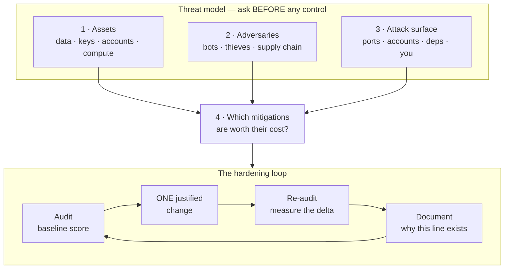
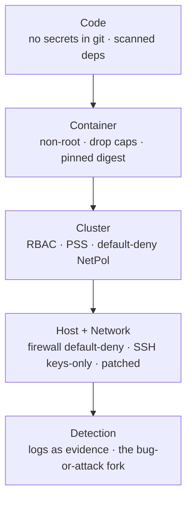

# Module 24 — Security

<small>Stage 9 · Professional Workflows · ~3 weeks at 4 h/day · Prerequisites — M3 (permissions — least privilege's original mechanism), M9 (SSH — your first hardening target), M23 (the debugging loop and the bug-or-attack fork). Opens Stage 9.</small>

## Why this matters

**Security** is the engineering discipline of making a system resist an **adversary** — someone
intelligent who wants what the system has and probes it where you didn't look. It is not a product or a
checklist; it is a **posture** built from four practices: **threat modeling** (what am I protecting,
from whom, at what cost?), **least privilege** (everything gets the minimum it needs — M3's permissions
philosophy, universalized), **hardening** (attack surface reduced, each change justified), and
**hygiene** (secrets encrypted, patches applied, evidence preserved). The defining asymmetry:
**you must be right everywhere; the attacker needs to be right once.**

Everything you built in 23 modules currently **trusts its environment**. This module removes that
assumption. Your SSH port is a doorway (M9); your containers share a kernel (M17); your cluster API has
power over everything (M19–20); your dotfiles repo may already contain a token you forgot (M8/M11). You
will threat-model your own stack, harden it with **measured** before/after audits (numbers, not vibes),
and take over M23's bug-or-attack fork as a full discipline — the same loop, but now the logs may have
been edited by the intruder.

!!! info "What this unlocks"
    This is the module that re-reads the whole curriculum **adversarially**. Every permission (M3), key
    (M9), digest (M16), and RBAC verb (M20) you learned as *good practice* turns out to be a wall in a
    fortress you were already building. **M25 (Observability)** gives that fortress a watchtower — the
    audit scores become metrics, auth events become alerts. **M29** applies least privilege to AI agents
    (tool allowlists are the blast-radius question asked of a model). The **capstone** inherits the
    hardened substrate wholesale. Learn the posture now and every later system is defended by reflex.

---

## Watch

*Watch once, then rely on the notes below — you should never need to rewatch.*

<div class="lo-video-placeholder" markdown="1">
<span class="lo-play">▶</span>
**Explainer video — coming**
<small>Record per <code>../media/README.md</code>, upload to YouTube, then replace this card with the embed.</small>
</div>

??? note "For the author — drop-in YouTube embed (replace VIDEO_ID)"
    Once the explainer is on YouTube, replace the placeholder card above with:
    ```html
    <div class="lo-video-embed">
      <iframe src="https://www.youtube-nocookie.com/embed/VIDEO_ID"
              title="Module 24 — Security"
              allow="accelerometer; autoplay; clipboard-write; encrypted-media; gyroscope; picture-in-picture"
              allowfullscreen></iframe>
    </div>
    ```
    Video script beats (from the blueprint's Definition / Analogy / Misconceptions): the defender's
    asymmetry (right everywhere vs right once) → the four questions that come *before* any control →
    least privilege as one idea in six uniforms → the hardening loop (audit → one change → re-audit →
    document) → the medieval city (gates that must stay open, the postern everyone forgot, the gift horse
    from upstream) → "nobody would target me" answered by Mirai (bots target addresses, not people).

**Terminal cast — pending; record per `../media/README.md`.**

!!! tip "Follow along, don't just watch"
    Open the [Guided Lab](#guided-lab-harden-a-box-you-own) in a browser terminal and run each command
    yourself as it appears. Security is muscle memory — the lockout-safe order, the `ls`-before-`chmod`
    habit, `sshd -t` before every reload — and typing beats watching every time.

---

## Key Notes

*Standalone. This is the reference you keep.*

### The picture: the threat model comes first, then the loop



Security without a threat model is superstition — buying padlocks for the windows while the door stands
open. The four questions run *before* you touch a control; the loop then applies each control **one at a
time**, measures the delta, and writes down why the line exists. Cargo-culting a hardening guide
produces a system nobody can debug; every line carries its justification.

### CIA — what "secure" actually protects

Every control serves one (or more) of three goals. Name the goal before you name the control:

| Goal | Question it answers | Broken by | Guarded by |
|---|---|---|---|
| **Confidentiality** | Can only the right eyes see it? | leaked secret, stolen disk, sniffed traffic | permissions, encryption at rest, TLS |
| **Integrity** | Is it unchanged and authentic? | tampering, backdoored dependency | checksums, signatures, pinned digests |
| **Availability** | Is it there when needed? | DoS, resource exhaustion, ransomware | resource limits, backups, rate-limiting |

A control that raises confidentiality can cost availability (a firewall that locks *you* out). The
threat model decides which corner of the triad matters here — and gives you permission to say **no** to
a control whose cost exceeds its value.

### Least privilege — one idea in six uniforms

The load-bearing principle: **everything gets the minimum access it needs to function.** You have already
met it five times; this module names it once and enforces it everywhere:

| Where | The mechanism | Module |
|---|---|---|
| File modes & users | `rwx` bits, ownership, no needless root | M3 |
| Service accounts | systemd `DynamicUser`, `ProtectSystem` | M15 |
| Container user | non-root `USER` in the image | M16 |
| Capabilities | root split into grantable slivers, `--cap-drop=ALL` | M17 |
| Cluster identity | RBAC least-verbs (`kubectl auth can-i`) | M20 |
| Escalation | `sudo` rules, no `NOPASSWD` without justification | M3/M24 |

Its dual is **blast radius**: assume this identity *is* compromised — what can it reach? An unjustified
grant is debt; every standing privilege is a wall you must defend.

### Defense in depth — because one wall always falls

The asymmetry (right everywhere vs right once) means **no single control may be load-bearing alone.**
Layer them so a breach of one meets another, and add **detection** for when prevention fails:



This is the **4 C's** (Code → Container → Cluster → Cloud/host), each an independent layer with its own
controls, wrapped by detection. The perimeter died with laptops and clouds; identity, patching, and
provenance became the walls.

### Users, permissions & sudo — read the bits

Least privilege on a host starts with the `rwx` bits M3 taught. Read a mode as three triads (owner /
group / other) plus special bits — and treat any surprise as an incident:

| Symbolic | Octal | Meaning | Use it for |
|---|---|---|---|
| `-rw-------` | `600` | owner read/write only | a secrets file — nobody else reads it |
| `-rw-r--r--` | `644` | owner writes, all read | normal config, code |
| `-rwxr-xr-x` | `755` | owner writes, all read/execute | programs, directories |
| `-rw-rw-rw-` | `666` | **world-writable** — anyone edits it | **never** — a tampering hole |
| `-rwsr-xr-x` | `4755` | **SUID** — runs as the file's *owner* | rare, audited (`find / -perm -4000`) |

A world-writable file (`666`, `777`) lets any local user rewrite it — integrity gone. A **SUID-root**
binary runs with root's power regardless of who launches it: "root by another door." `sudo -l` shows
what escalation *you* hold; `NOPASSWD` without a written reason is a standing hole.

### Firewalls — default-deny fails safe

A host firewall (`ufw`, `nftables`, `iptables`) decides which listeners the network can reach. The only
sane default is **deny inbound, then allow by exception** — because of *how each policy fails*:

| Policy | New/forgotten service is… | Fails | Cost |
|---|---|---|---|
| **Default-deny** (allowlist) | unreachable until you allow it | **safe** — errors are visible, fixable | you must KNOW your flows (enumeration) |
| **Default-allow** (blocklist) | exposed until you remember to block it | **open** — errors are invisible until exploited | none up front — you pay on breach |

Default-deny demands you enumerate your flows (that work *is the point*). The lockout law: **allow SSH
first, and test it from a second session, before you enable the firewall** — never close a door you are
standing behind.

### SSH hardening — keys-only, justified line by line

SSH is your first and most important hardening target (M9's key ceremony, now enforced). Harden
`sshd_config` against `man sshd_config`, **one line at a time, each with its WHY** — and always
`sshd -t` before reloading:

| Directive | Set to | Why |
|---|---|---|
| `PasswordAuthentication` | `no` | passwords on a reachable port are Mirai food — keys can't be brute-forced |
| `PermitRootLogin` | `no` | force a named user + `sudo` — accountability and one less target |
| `PubkeyAuthentication` | `yes` | keys are the AuthN you keep |
| `AllowUsers` | `you` | an explicit allowlist of who may even try |
| `MaxAuthTries` | `3` | cut brute-force room and log noise |

The lockout-safe order: keep a second session alive → verify **key** login works while passwords are
still on → *then* set `PasswordAuthentication no` → `sshd -t` → **`reload`, not restart** → confirm a
fresh login in a third session while the lifeboats stay open.

### Secrets — the hierarchy of sin

Where a secret lives decides how badly it leaks. Climb the ladder worst-to-best, and name the leak path
at each rung:

| Rung (worst → best) | Leak path |
|---|---|
| Hardcoded in code | anyone who reads the source |
| Committed to git | history is forever — clones, forks, scrapers already have it |
| In an env var | `/proc/PID/environ`, crash dumps, `docker inspect`, logging frameworks |
| In a `0600` file | plaintext at rest — any process running as you reads it; a stolen disk ignores the mode |
| **Encrypted at rest** (sops+age) | ciphertext in the repo; plaintext exists only *at time of use* |

The rule that surprises everyone: **a committed secret is burned the moment it's pushed.** History
rewriting only cleans *your* copy — clones and mirrors kept it. The only real fix is **rotation**
(making the old value worthless). `gitleaks` audits your own history because git never forgets (M8's
feature, now a liability).

### TLS & PKI — identity plus confidentiality

TLS (M14's handshake, operationalized) does two jobs at once: **confidentiality** (the traffic is
encrypted) and **identity** (a certificate, signed by a Certificate Authority you trust, proves the
server is who it claims). The chain of trust: a **CA** signs a server's **certificate**; your machine
ships a store of trusted CA roots; the handshake verifies the chain and the hostname. Hygiene that
actually matters at home scale: **modern versions only** (TLS 1.2+), watch **expiry dates** of anything
you serve (`openssl s_client -connect host:443` inspects the chain), and remember encryption only
*relocates* trust — now the **private key's** storage and rotation are the attack surface.

### AuthN vs AuthZ — logged in never means authorized

Two different questions, endlessly confused: **AuthN** (authentication) = *who are you?* (keys,
passwords); **AuthZ** (authorization) = *what may you do?* (`sudo`, RBAC). The classic hole is treating
"the request is authenticated" as "the request is allowed" — any logged-in identity then reaches admin
actions. Keys beat passwords for AuthN; least privilege governs AuthZ.

### Auditing & logging — measure the delta, preserve the evidence

Two uses of observation. **Auditing** is the loop's measuring instrument: a baseline **number** (a
hardening index), one change, the delta *measured* not asserted — `ss -tlnp` enumerates every listener,
`find / -perm -4000` every SUID binary, `sudo -l` every grant. **Logging** is detection's raw material:
`journalctl -u ssh`, `auth.log`, `lastb` (the failed-login census makes Mirai concrete). When an anomaly
appears, the **bug-or-attack fork** (M23's handoff): **preserve first** — timestamped copies of logs,
`last`/`who` output — *then* diagnose, because mitigation destroys evidence and the logs themselves may
have been edited by the intruder.

<div class="lo-remember" markdown="1">
**Must remember (if you keep only six things):**

1. **The threat model comes first** — assets, adversaries, attack surface, mitigations-worth-their-cost. Honest adversaries only (bots, not nation-states).
2. **Least privilege is one idea in six uniforms** — file modes, service accounts, container users, capabilities, RBAC verbs, sudo. Always ask the blast-radius question.
3. **The hardening loop:** audit (score) → **one** justified change → re-audit (delta) → document (why). Cargo-cult hardening is a system nobody can debug.
4. **Default-deny fails safe; default-allow fails open.** Firewall + SSH: allow the door, test from a second session, *then* close — the lockout law.
5. **A committed secret is burned — rotate it.** History rewriting is cosmetic; encrypted-at-rest (sops+age) is the ceiling. Env vars leak through a dozen side channels.
6. **Preserve before you mitigate.** Logs are evidence; the bug-or-attack fork copies first, diagnoses second — the intruder may have edited the logs.
</div>

---

## Guided Lab: harden a box you own

*Basic, step-by-step. Every action targets the throwaway machine in front of you — a box you own. You
will enumerate its attack surface, add a least-privilege user, fix an over-permissioned secret and a
SUID surprise, put up a default-deny firewall, and harden `sshd` — verifying at every step, the way
real hardening is done.*

<div class="lo-lab-actions" markdown="1">
[▶ Open interactive lab](https://killercoda.com/learning-os/course/killercoda/module-24){ .lo-btn target=_blank }
[⧉ Open in Codespaces](https://codespaces.new/randaguiac20/learning-os){ .lo-btn target=_blank }
[⌨ Run locally](#run-locally){ .lo-btn .lo-btn--ghost }
[View lab source](https://github.com/randaguiac20/learning-os/tree/main/killercoda/module-24){ .lo-btn .lo-btn--ghost target=_blank }
</div>

<span id="run-locally"></span>
!!! tip "Three ways to run this lab — pick any (all free)"
    - **Instant, no account** — click **Open interactive lab** (Killercoda): a root-capable Linux VM in your browser.
    - **Your own cloud** — click **Open in Codespaces**: runs in your GitHub account's free tier (120 core-hrs/mo).
    - **Local, unlimited, $0** — a **throwaway** VM or container you own: `docker run -it --rm ubuntu bash`, then `apt-get update`. Never run the hardening steps on a machine you can't afford to lock yourself out of.

    Killercoda is the zero-setup on-ramp; Codespaces and local use *your own* free resources, so they scale to any class size.

!!! warning "The lockout law — read before you touch sshd"
    Every hardening change is a **change**: one at a time, verified, reversible. The `sshd` step disables
    password login — in this disposable lab that is safe, but on any machine you reach *by* SSH you
    **test key login in a second session first**, run `sshd -t`, and **reload** (never blindly restart).
    Test the door before you close it behind you.

=== "1 · Map the attack surface"
    You cannot secure what you haven't enumerated. Use instruments, not memory:
    ```bash
    ss -tlnp                    # every listening socket — each is a doorway
    sudo -l                     # what escalation do I hold?
    id                          # who am I, and in which groups?
    find / -perm -4000 -type f 2>/dev/null   # every SUID binary on the box
    ```
    Journal: which listeners do you recognize? Which SUID files are the normal system set (`sudo`,
    `passwd`, `mount`) versus a surprise? This snapshot is your **baseline** — everything after is a
    measured delta.

=== "2 · Add a least-privilege user"
    Root does everything; a service should do almost nothing. Create a named, minimal user — **not** in
    the sudo group, **no** `NOPASSWD`:
    ```bash
    sudo useradd -m -s /bin/bash webops
    id webops                   # confirm: no sudo/admin groups
    sudo -l -U webops 2>/dev/null || echo "webops holds no sudo grants — good"
    ```
    `webops` can own and run one service without holding the keys to the whole host. That is least
    privilege: the bakers don't hold the gate keys.

=== "3 · Fix the leak — permissions & a SUID surprise"
    The previous admin left two holes. First reproduce the found state, then fix it the right way:
    ```bash
    sudo mkdir -p /opt/app
    echo 'API_TOKEN=sk-live-DEADBEEF' | sudo tee /opt/app/config.env   # a real-looking secret
    sudo chmod 0666 /opt/app/config.env         # world-writable AND world-readable — the surprise
    sudo cp /bin/bash /opt/app/backup-tool
    sudo chmod 4755 /opt/app/backup-tool        # SUID-root — root by another door
    ls -l /opt/app                              # SEE the problem before you fix it
    ```
    Now harden — least privilege on the bits:
    ```bash
    sudo chown root:root /opt/app/config.env
    sudo chmod 0600 /opt/app/config.env         # owner-only: confidentiality restored
    sudo chmod u-s /opt/app/backup-tool         # strip the SUID bit: no more root-by-another-door
    ls -l /opt/app                              # verify: -rw------- and no 's'
    ```
    Click **Check** to verify the secret is `0600` root-owned and the SUID bit is gone.

=== "4 · Lock the doors — firewall + sshd"
    Put up a **default-deny** firewall, but **allow SSH first** (the lockout law), then harden `sshd`:
    ```bash
    sudo apt-get update -qq && sudo apt-get install -y -qq ufw openssh-server
    sudo ufw default deny incoming        # deny inbound by default — fails safe
    sudo ufw default allow outgoing
    sudo ufw allow OpenSSH                 # the ONE door we keep open — before enabling
    sudo ufw --force enable
    sudo ufw status verbose                # confirm: Default deny (incoming) + OpenSSH ALLOW
    ```
    Now harden `sshd` — keys-only, no root login — with a drop-in, and **validate before reload**:
    ```bash
    printf 'PasswordAuthentication no\nPermitRootLogin no\nMaxAuthTries 3\n' \
      | sudo tee /etc/ssh/sshd_config.d/99-hardening.conf
    sudo sshd -t && echo "config OK"       # syntax test BEFORE touching the running daemon
    sudo systemctl reload ssh 2>/dev/null || sudo systemctl reload sshd 2>/dev/null || true
    ```
    Click **Check** to verify the firewall is default-deny with SSH allowed and `sshd` is keys-only,
    no-root, and passes `sshd -t`.

=== "5 · Re-audit — measure the delta"
    The loop closes with a **second** look — the delta is the proof:
    ```bash
    ss -tlnp                     # what still listens? (compare to Step 1)
    sudo ufw status verbose      # the firewall's live policy
    sudo sshd -T | grep -Ei 'passwordauthentication|permitrootlogin'   # effective sshd config
    find / -perm -4000 -type f 2>/dev/null   # the SUID surprise should be gone from /opt
    ```
    Write one justification line per change — that journal *is* the Fortress doc. A change you can't
    justify is debt: learn why it's there, or remove it.

!!! success "You can stop here and have learned something real"
    If you enumerated a surface with instruments, added a least-privilege user, fixed an
    over-permissioned secret and a SUID surprise, stood up a default-deny firewall the lockout-safe way,
    and hardened `sshd` with `sshd -t` before reload — the guided lab is done. Now make it harder.

---

## Solo Lab: figure it out

*Harder. Goals only — minimal hand-holding. Work on the throwaway box. Every change is one-at-a-time,
verified, and reversible; struggle here is the point. Reveal a hint only after you've tried.*

### Challenge 1 — The unrecognized listener
`ss -tlnp` shows a process listening on `0.0.0.0:6379`. Walk your response using the hardening loop and
M23's method — do not just kill it.

??? tip "Hint"
    `6379` is a well-known service port. Observe before you judge: which process (`-p`), since when, what
    package put it there, and does it *need* to face the network at all?

??? success "Solution"
    ```bash
    sudo ss -tlnp | grep 6379     # -p reveals the pid/name — it's redis-server
    dpkg -S $(which redis-server) 2>/dev/null   # package origin
    ```
    6379 is Redis. Observe (M23: quit thinking and look), then the loop: **justify or remove.** If it's
    only used locally, bind it to `127.0.0.1` (one change) and re-check with `ss`; if unused, disable the
    unit; if genuinely unexplained *and* reachable from outside → the **bug-or-attack fork**: preserve
    logs before you touch anything.

### Challenge 2 — Lockout-safe sshd, narrated
You must harden `sshd` on a machine you can reach **only** by SSH. State the order of steps so you cannot
lock yourself out, and name the command that proves the config is valid *before* it takes effect.

??? success "Solution"
    Keep a **second** session alive as a lifeboat. Add your key; verify **key-only** login works in a
    **third** session *while passwords are still on*. Only then set `PasswordAuthentication no` /
    `PermitRootLogin no`; run **`sshd -t`** (syntax test) *before* touching the daemon;
    **`reload`** (not restart); confirm a fresh login while the old sessions stay open. Console/out-of-band
    access confirmed first if it exists.

### Challenge 3 — The teammate who wants `--privileged`
A teammate proposes running a container with `--privileged` because it needs to read one device. Give the
least-privilege alternative and name the module that taught the mechanism.

??? success "Solution"
    Grant only what's needed: `--device=/dev/thing` for the one device and/or `--cap-drop=ALL` then
    `--cap-add` the single capability that breaks — run **non-root**. `--privileged` grants *all*
    capabilities + device access and disables most isolation: root by another door. **M17** taught
    capabilities; **M16** the non-root discipline.

### Challenge 4 (stretch) — Rank two controls by adversary
Compare **sops+age** encryption against a plain **`0600`** secrets file for three different adversaries:
(a) a stolen laptop disk, (b) a leaked repo, (c) a compromised process running *as you*. State which wins
each and the general lesson.

??? success "Solution"
    (a) Stolen disk: `0600` is worthless — an offline mount ignores file modes; **sops wins** (ciphertext).
    (b) Leaked repo: `0600` is irrelevant, the sops file stays ciphertext — **sops wins decisively**.
    (c) Compromised process as you: **both lose at time-of-use** — the process reads the decrypted material
    either way; sops only narrows the *window*. The lesson: **name the adversary before you score the
    control** — every control relocates risk rather than abolishing it.

### Challenge 5 (stretch) — The Fortress line, defended
Pick one hardening change you made in the Guided Lab. In writing, answer the three interrogation
questions: **why does this line exist? what does it cost? what breaks if it's wrong?** Then justify one
line you would deliberately **skip**, and what the skip must carry.

??? success "Solution"
    Example — `PasswordAuthentication no`: *exists* because passwords on a reachable port are brute-forced
    at internet scale (Mirai); *costs* new-device onboarding friction (a key must be enrolled first);
    *breaks* all access if you disable it before verifying key login works — hence the lockout law. A
    justified **skip** (e.g. a kube-bench check that assumes cloud metadata on a local kind cluster) must
    carry, in writing, **the line, the reasoning, and the residual risk accepted.** A silent skip is
    negligence; a justified skip is engineering.

---

## Self-Check

*Close the notes. Answer aloud or in writing **first**, then reveal. Recalling — even when it's hard —
is what builds the memory.*

??? question "State the four threat-model questions, in order."
    **What are the assets? Who are the adversaries? What is the attack surface? Which mitigations are
    worth their cost?** They run *before* any control — and the fourth question exists to say **no** to
    controls too. Honest adversaries only (bots and thieves, not nation-state cosplay).

??? question "Least privilege appears as a concrete mechanism in five modules — name them."
    File modes/users (**M3**), sandboxed systemd units / `DynamicUser` (**M15**), non-root container
    `USER` (**M16**), dropped capabilities (**M17**), RBAC least-verbs (**M20**). One principle, five (or
    six, with `sudo`) enforcement points — plus its dual, the **blast-radius** question.

??? question "Why must a committed secret be ROTATED rather than just removed from git history?"
    History is effectively **unerasable**: clones, forks, mirrors, reflogs, and scrapers already have it,
    and rewriting your copy changes nothing they hold. The secret is **burned**; only rotation — making
    the value worthless — actually fixes it.

??? question "Default-deny vs default-allow — which fails safe, and what does it cost?"
    **Default-deny fails safe**: an unknown service is unreachable until explicitly allowed, so errors are
    *visible and fixable*. Default-allow **fails open**: a forgotten block leaves you exposed, invisibly,
    until exploited. Default-deny's cost is that you must **know your flows** (enumeration, occasional
    breakage) — and that cost is the point.

??? question "You must harden sshd on a box you can only reach by SSH. Order the steps."
    Second session alive → add key, verify key-only login in a third session **while passwords still on**
    → set `PasswordAuthentication no` / `PermitRootLogin no` → **`sshd -t`** before touching the daemon →
    **`reload`** not restart → confirm a fresh login while lifeboats stay open. The lockout law: test the
    door before closing it.

??? question "Why is a world-writable (666) file or a SUID-root binary an incident?"
    A world-writable file lets **any** local user rewrite it — **integrity** gone (tampering). A SUID-root
    binary runs with **root's** power no matter who launches it — "root by another door," an **elevation**
    path. Both are least-privilege violations you find with `find / -perm -4000` and fix with `chmod`.

??? question "\"There's nothing valuable on this box.\" Rebut it in three sentences."
    Bots don't target value, they target **addresses** — scanners try every reachable port on the whole
    internet and keep whatever answers. A hit yields bandwidth, CPU, a residential IP for laundering
    traffic, and a lateral hop toward things that *do* matter (your keys reach other machines). Mirai built
    a record-breaking weapon entirely from "worthless" devices — your box is valuable precisely because
    it's a computer that answers.

!!! example "Teach it back (the real test)"
    Out loud, in **5 minutes, no notes**, teach *"The minimum key"*: pull **one** real workload through
    its constraint layers — file perms → non-root user/container → dropped caps → RBAC verbs → firewall —
    asking the **blast-radius question at each layer** ("if THIS is compromised, what does it reach?").
    Close with the asymmetry (right everywhere vs right once) and *why layers exist*. Then, in **3
    minutes**, teach the **medieval city** to a non-technical friend — gates that must stay open for
    commerce, the postern everyone forgot, the gift horse from upstream — with the bots-scan-addresses
    truth in one sentence. If you can't yet, that's your signal to reread the Key Notes, not to move on.

---

## Mastery checklist

*Tick these honestly, cold (no notes). They **gate** progress — passing M24 ships the Fortress; Stage 9
closes at M25 when the Watchtower stands beside it. A module is only "done" when every box is true.*

- [ ] **Define** the four threat-model questions and STRIDE, and run them cold on any system named at random.
- [ ] **Explain** the defender's asymmetry and what it implies — layers (defense in depth) plus detection, never one load-bearing wall.
- [ ] **Describe** least privilege as one principle across five modules' mechanisms, and ask the blast-radius question on a new example.
- [ ] **Identify** a full attack surface with instruments (`ss -tlnp`, `sudo -l`, `find / -perm -4000`, authorized_keys), not memory.
- [ ] **Use** the hardening loop: one justified change, measured delta, documented why — no batching.
- [ ] **Implement** lockout-safe, keys-only sshd hardening, justified line by line, `sshd -t` before reload.
- [ ] **Secure** a host firewall default-deny with the intended allow, added the lockout-safe way (door first, then close).
- [ ] **Fix** an over-permissioned secret (to `0600`) and a SUID surprise (strip the bit), verifying with `ls -l` each time.
- [ ] **List** the secrets hierarchy of sin with each rung's leak path, and know that a committed secret is rotated, not deleted.
- [ ] **Compare** controls against named adversaries (stolen disk vs leaked repo vs live compromise) — name the adversary first.
- [ ] **Debug** a hardening change that broke a service with M23's loop, and add the missing post-change check to the list.
- [ ] **Assess** an anomaly through the bug-or-attack fork with **preservation first** (copy logs, `last`/`who`, before mitigating).
- [ ] **Evaluate** a benchmark line into fix / justified-skip / investigate — the skip carrying line, reasoning, and residual risk in writing.
- [ ] **Teach** least privilege through one workload's constraint layers, and pass the teach-back rubric.

---

## Review — lock it in

Spaced repetition is not optional; it's where the memory actually forms. Interleaving stays active —
every M24 review also pulls in one **Module 23** item (the debugging gauntlet stays warm) and the
four-questions sprint runs on one random system daily. Schedule these and *keep* them:

| When | Do | Interleaved M23 item |
|---|---|---|
| **Day 1** | Flashcards · STRIDE + least-privilege sprints · the hierarchy-of-sin sprint (worst→best) | The smell-test sprint (bug-or-attack tells) |
| **Day 3** | The four questions on a NEW random system, cold · recite the lockout-safe sshd procedure | `make gauntlet N=1` — one planted scenario |
| **Day 7** | Re-audit the box (`ss` / `ufw status` / `sshd -T`) — explain or investigate every delta | The MTTR glance — is the loop still fast? |
| **Day 14** | Secrets lifecycle drilled: one rotation rehearsed for real · re-run the SUID/permissions hunt | Re-run one gauntlet scenario with preservation-first |
| **Day 30** | Validation retake ≥90% · the residual-risk list re-read — is each acceptance still honest? | The bug-or-attack fork narrated on a fresh anomaly |

**Connects forward to:** Observability (M25 — the audit scores become metrics, auth events become
alerts; prevention fails eventually and the Watchtower sees it happen) · AI/ML security (M26–28 — prompt
injection and model provenance; xz's lesson recurs for model weights) · Claude Code advanced (M29 —
agent permissions ARE least privilege for AI: tool allowlists and the blast-radius question asked of an
agent) · the **Capstone**, which serves models on this hardened substrate — API keys in the sops estate,
containers non-root with dropped caps, cluster enforcing PSS + default-deny.

!!! quote "The one-sentence takeaway"
    Security is the curriculum re-read with an adversary in the margins — this module drew the map,
    measured the walls, and wrote down why each one stands: you must be right everywhere, so you build in
    layers and watch for the day one falls.
