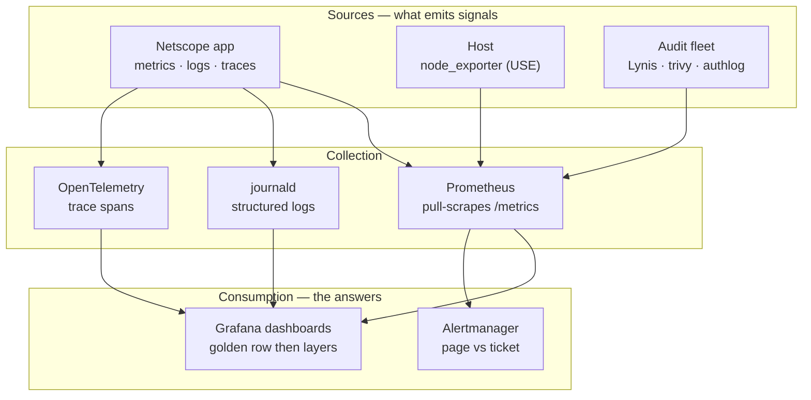

# Module 25 — Observability

<small>Stage 9 · Professional Workflows · ~2 weeks at 4 h/day · Prerequisites — Module 23 (the requirements doc you wrote) and Module 24 (the Fortress this Watchtower now guards).</small>

## Why this matters

**Observability** is the property of a system that lets you answer questions about its internal state
from its external outputs — **without shipping new code to ask**. Its raw materials are three signals:
**metrics** (cheap numeric time series — *what* and *how much*), **logs** (discrete structured events —
*what exactly* happened), and **traces** (a request's journey across components — *where* the time
went). *Operations* is the practice built on top: dashboards that answer questions, alerts that demand
actions, runbooks that make 3 a.m. survivable.

You wrote the requirements for this module yourself. In Module 23 every gauntlet scenario got a
postscript — *"what dashboard or alert would have caught this in 30 seconds?"* This module **builds
those answers.** The defining test, inherited from M23: **"what changed?" answered from a screen in 30
seconds, not from an `ssh` session in 30 minutes.** And it teaches the discipline's hard half — which is
not installing Prometheus (that's an afternoon) but **alert quality**: the alert that wakes you must be
actionable, symptom-based, and runbooked, because the alternative is the fatigue that let 97 unread
warnings drown at Knight Capital.

!!! info "What this unlocks"
    This is the Watchtower that completes Stage 9's medieval city — walls (M24) without watchmen are
    archaeology. It industrializes M23's OBSERVE stage (the first-five-minutes protocol becomes a
    Grafana tab) and gives M24's Fortress eyes (audit scores graphed, auth anomalies alerted). Forward:
    M26–M28 put **new numbers** on the same boards — training-loss curves, token throughput, GPU
    saturation are just new tenants; M29 traces agent runs; the **capstone inherits the whole
    Watchtower.** Learn the laws here and every later system just reports in.

---

## Watch

*Watch once, then rely on the notes below — you should never need to rewatch.*

<div class="lo-video-placeholder" markdown="1">
<span class="lo-play">▶</span>
**Explainer video — coming**
<small>Record per <code>../media/README.md</code>, upload to YouTube, then replace this card with the embed.</small>
</div>

??? note "For the author — drop-in YouTube embed (replace VIDEO_ID)"
    Once the explainer is on YouTube, replace the placeholder card above with:
    ```html
    <div class="lo-video-embed">
      <iframe src="https://www.youtube-nocookie.com/embed/VIDEO_ID"
              title="Module 25 — Observability"
              allow="accelerometer; autoplay; clipboard-write; encrypted-media; gyroscope; picture-in-picture"
              allowfullscreen></iframe>
    </div>
    ```
    Video script beats (from the blueprint's Analogy / Visual Model / Misconceptions):
    the three signals by their **economics** (tally board vs gate ledger vs the numbered flag on one
    cart) → the four **golden signals** → the **pull model** and why the scrape list is an inventory →
    **alert fatigue as a mechanism** (Knight's 97 emails, the two-bell code) → the **watch loop**
    (instrument → graph → alert → drill → tune) and why an alert that never fired in a drill is a
    hypothesis, not a control.

**Terminal cast — pending; record per `../media/README.md`.**

!!! tip "Follow along, don't just watch"
    Open the [Guided Lab](#guided-lab-stand-up-a-real-prometheus) in a browser terminal and run each
    command yourself as it appears. You will start a real Prometheus, scrape a real target, and query it
    over the HTTP API — typing beats watching every time, and it is part of how the memory forms.

---

## Key Notes

*Standalone. This is the reference you keep.*

### The three signals — choose by the question

Ship all three from one instrument (OpenTelemetry) when you can; but know which answers which question,
because their **economics** differ:

| Signal | Cost | Precision | Answers | Reach for it when |
|---|---|---|---|---|
| **Metrics** | cheap, pre-aggregated | low (you chose the questions in advance) | *what* / *how much* — trends | you need a cheap, always-on number to detect and alert on |
| **Logs** | expensive, linear forever | exact — one event per line | *what exactly* happened | you need the precise event after the fact (usernames, IPs, the error) |
| **Traces** | sampled, cross-service | per-request | *where* the time/failure was | a request crossed components and you must find which hop lost the 800 ms |

**The signal ladder for a mystery: metric *detects* → trace *localizes* → log *identifies*.** Smell,
then component, then event. Reaching for `grep` first is the expensive habit this module retires.

### The Watchtower — how the signals flow



Prometheus **pulls** — it reaches out and scrapes each target's `/metrics` endpoint on a timer. The
operational consequence: targets are **enumerable**, so **the scrape list IS an inventory** (M24's
attack-surface enumeration, now automated). A target you forgot to scrape is a service you forgot you
ran — and `up` (is this target reachable?) comes free with every scrape.

### The four golden signals

The four questions that cover any request-serving system (the SRE book's monitoring chapter — this
module's canon). Their cousins: **USE** for resources (M21 — utilization/saturation/errors) and **RED**
for services (rate/errors/duration).

| Golden signal | The question | Example PromQL |
|---|---|---|
| **Latency** | how long do requests take (especially the tail)? | `histogram_quantile(0.99, rate(http_request_duration_seconds_bucket[5m]))` |
| **Traffic** | how much demand is arriving? | `rate(http_requests_total[5m])` |
| **Errors** | what fraction is failing? | `rate(http_requests_total{code=~"5.."}[5m]) / rate(http_requests_total[5m])` |
| **Saturation** | how full is the most-constrained resource? | `node_load1 / count(node_cpu_seconds_total{mode="idle"})` |

Average latency hides the users having the worst day; **p99 is user empathy in math** — at 100
requests, p99 *is* someone, every second.

### The four metric types

| Type | What it is | Example | How you query it |
|---|---|---|---|
| **Counter** | only ever goes up (and resets to 0 on restart) | `http_requests_total` | always via `rate()` — never raw |
| **Gauge** | a value that goes up and down | `in_flight_requests`, `node_memory_free_bytes` | read directly, `avg`/`max` over time |
| **Histogram** | bucketed observations (client-side buckets) | `http_request_duration_seconds` | `histogram_quantile()` on the `_bucket` series |
| **Summary** | pre-computed quantiles (client-side) | request-size summary | read the quantile series directly (can't re-aggregate) |

**Why `rate()` exists — raw counters lie twice.** The absolute value reflects *uptime*, not current
behaviour; and a restart resets the counter to zero, which reads as a crash. `rate()` differentiates
over a window and **absorbs resets**, giving you the per-second truth. The classic bug is `sum` **before**
`rate` — that aggregates away the resets. Always `rate()` first, then aggregate.

### Cardinality — the loaded gun

Every unique **label combination** is a stored time series, and memory/storage scale with the series
count — which is the **product** of each label's distinct values. A `user_id` label turns one series
into a million.

!!! warning "The cardinality law"
    **Labels are for DIMENSIONS you aggregate over** (endpoint, status, instance) — **never for
    identities** (user ID, request ID, full path). Identity-level questions belong to **logs**
    (searchable) and **traces** (per-request), which are built for high cardinality. Detection by
    dimension; identification by log.

### SLI / SLO / error budgets

- **SLI** — the *measured* signal (e.g. fraction of checks completing successfully under a latency
  bound: good events / total).
- **SLO** — the SLI's *target with a time window* (e.g. 99% over a rolling 7 days). Choose the objective
  **after measuring current truth** — an objective you already miss is an aspiration, not an objective.
- **Error budget** — the allowed failure (1 − SLO). You alert on **burn rate** (how fast the budget is
  being consumed): **fast burn pages, slow burn tickets.**

### The alert law — the module's moral core

<div class="lo-remember" markdown="1">
**Must remember (if you keep only six things):**

1. **Three signals, three questions:** metric *detects* (cheap), trace *localizes* (where), log *identifies* (exact). No single one is cheap, exact, AND cross-component.
2. **The golden signals:** latency · traffic · errors · saturation — the symptom row, always first on the dashboard.
3. **Prometheus pulls.** Time series = **name + label set**; the scrape list is an **inventory**; `up` is free. Query counters with **`rate()` first**, then aggregate.
4. **The alert law:** every alert **symptom-based · actionable · runbooked · honest severity.** The dividing question: **"must a human act NOW?"** — yes → alert; no → dashboard.
5. **Alert fatigue is a mechanism, not an annoyance.** Every non-actionable ring trains people to ignore rings. Knight's 97 emails were "everything" alerted; the real one drowned. Delete bells until every ring means *run*.
6. **The drill law:** an alert that never fired in a drill is a **hypothesis, not a control** — inject the failure, time the bell (M23's restore-law, applied to detection).
</div>

**Dashboards are pre-answered questions**, designed top-down: golden-signals row first (the symptom
row), then drill-down rows per layer (M23's matrix as tab order). The anti-pattern is the wall of
every-metric-we-have — *a dashboard nobody can read is a log file with colours.* And the **stack is
code**: scrape configs, recording/alert rules, and dashboard JSON live in the repo — the bench rebuilds
from files (M15's law).

---

## Guided Lab: stand up a real Prometheus

*Basic, step-by-step. You will obtain the real Prometheus binary, run a target that exposes `/metrics`,
write a scrape config, start Prometheus, and query it over the HTTP API. Everything lives in a throwaway
`~/obs-lab/` sandbox; nothing outside it is touched.*

<div class="lo-lab-actions" markdown="1">
[▶ Open interactive lab](https://killercoda.com/learning-os/course/killercoda/module-25){ .lo-btn target=_blank }
[⧉ Open in Codespaces](https://codespaces.new/randaguiac20/learning-os){ .lo-btn target=_blank }
[⌨ Run locally](#run-locally){ .lo-btn .lo-btn--ghost }
[View lab source](https://github.com/randaguiac20/learning-os/tree/main/killercoda/module-25){ .lo-btn .lo-btn--ghost target=_blank }
</div>

<span id="run-locally"></span>
!!! tip "Three ways to run this lab — pick any (all free)"
    - **Instant, no account** — click **Open interactive lab** (Killercoda): a Linux terminal in your browser.
    - **Your own cloud** — click **Open in Codespaces**: runs in your GitHub account's free tier (120 core-hrs/mo).
    - **Local, unlimited, $0** — any Linux / macOS / WSL terminal, or a throwaway container: `docker run -it ubuntu bash`, then follow the steps below.

    Killercoda is the zero-setup on-ramp; Codespaces and local use *your own* free resources, so they scale to any class size.

=== "1 · Get a real Prometheus"
    Build the sandbox, then fetch the static Prometheus binary (no dependencies — one tarball). If the
    download is flaky, the package manager is the fallback:
    ```bash
    mkdir -p ~/obs-lab && cd ~/obs-lab
    VER=2.53.0
    curl -fsSL -o prom.tar.gz \
      "https://github.com/prometheus/prometheus/releases/download/v${VER}/prometheus-${VER}.linux-amd64.tar.gz" \
      && tar --strip-components=1 -xzf prom.tar.gz \
      || { sudo apt-get update -qq && sudo apt-get install -y prometheus; }
    command -v ./prometheus >/dev/null 2>&1 && ./prometheus --version || prometheus --version
    ```
    You now have a `prometheus` binary. It is one static executable — the whole "monitoring stack" is an
    afternoon; the *discipline* is the module.

=== "2 · Run a target that exposes /metrics"
    Prometheus scrapes HTTP endpoints that speak its text format. Write a tiny app (Python stdlib only —
    always available) that exposes a **counter** and a **gauge**, then start it in the background:
    ```bash
    cat > ~/obs-lab/app.py <<'PY'
    import http.server, time
    reqs = 0
    class H(http.server.BaseHTTPRequestHandler):
        def do_GET(self):
            global reqs
            reqs += 1
            body = (
                "# HELP app_requests_total Requests handled\n"
                "# TYPE app_requests_total counter\n"
                f"app_requests_total {reqs}\n"
                "# HELP app_up App self-health\n"
                "# TYPE app_up gauge\n"
                "app_up 1\n"
            ).encode()
            self.send_response(200)
            self.send_header("Content-Type", "text/plain; version=0.0.4")
            self.end_headers(); self.wfile.write(body)
        def log_message(self, *a): pass
    http.server.HTTPServer(("127.0.0.1", 8000), H).serve_forever()
    PY
    nohup python3 ~/obs-lab/app.py >/dev/null 2>&1 &
    sleep 1
    curl -s localhost:8000/metrics
    ```
    Read that output — **this is what an exporter actually says**: a `# HELP`/`# TYPE` header, then
    `name{labels} value` lines. Each `curl` increments the counter.

=== "3 · Write the scrape config"
    Prometheus reads a `prometheus.yml`. Declare a global scrape interval and **two jobs**: Prometheus
    scraping itself, and your app. The `job` label is a dimension you will aggregate by later:
    ```bash
    cat > ~/obs-lab/prometheus.yml <<'YML'
    global:
      scrape_interval: 5s
    scrape_configs:
      - job_name: prometheus
        static_configs:
          - targets: ["localhost:9090"]
      - job_name: metrics-app
        static_configs:
          - targets: ["localhost:8000"]
    YML
    cat ~/obs-lab/prometheus.yml
    ```
    This file **is** the inventory: every service Prometheus knows about is listed here. Click **Check**
    to verify the config declares the `metrics-app` job.

=== "4 · Start Prometheus and query the API"
    Start Prometheus against your config (in the background), give it a few seconds to scrape, then ask
    it the most fundamental question — **which targets are up?** — over the HTTP query API:
    ```bash
    cd ~/obs-lab
    PROM=./prometheus; command -v $PROM >/dev/null 2>&1 || PROM=prometheus
    nohup $PROM --config.file=prometheus.yml >/dev/null 2>&1 &
    sleep 8
    curl -s 'localhost:9090/api/v1/query?query=up' | head -c 600; echo
    ```
    Each target reports `up` = `1` (reachable) or `0` (down). `up` is the cheapest, most important series
    you own. Click **Check** to verify Prometheus is running and a target is `up == 1`.

=== "5 · A golden-signal query, then reason about an alert"
    Generate some traffic, then ask a real golden-signal question — **traffic**, as a per-second rate off
    the counter:
    ```bash
    for i in $(seq 1 20); do curl -s localhost:8000/metrics >/dev/null; done
    curl -s 'localhost:9090/api/v1/query?query=rate(app_requests_total[1m])' | head -c 400; echo
    ```
    `rate()` turns the ever-climbing counter into "requests per second right now" — and would survive an
    app restart (it absorbs the reset). Now **reason about an alert** without writing YAML yet:

    > If `app_up == 0` for 1 minute, is that page-worthy or ticket-worthy? Apply the dividing question —
    > *must a human act NOW?* A single-instance app being down and user-facing → **page**. Note also the
    > **absent-metric trap**: if the target vanishes entirely, a threshold on `app_up` never evaluates —
    > which is why you alert on **`up == 0`** (absence itself), not only on the value.

!!! success "You can stop here and have learned something real"
    If you started a real Prometheus, scraped a target you wrote, saw `up == 1` over the query API, and
    wrote one `rate()` golden-signal query — the guided lab is done. Now make it harder.

---

## Solo Lab: the traps and the alert law

*Harder. Goals only — minimal hand-holding. Keep the Guided Lab's stack running in `~/obs-lab/`. These
are the traps the curriculum plants and the discipline that separates a monitored system from an
observable one. Struggle here is the point; reveal a hint only after you've tried.*

### Challenge 1 — The absent-metric trap
Stop your app, wait for the next scrape, and prove — from the query API — that the target is now down.
Then state the alert expression that would catch it, and why a threshold on `app_up` alone would **not**.

??? tip "Hint"
    `up{job="metrics-app"}` is the free liveness series. Kill the app process; re-query `up`. If the
    metric is *gone* rather than *bad*, what can a `> ` / `< ` threshold on it evaluate?

??? success "Solution"
    ```bash
    pkill -f obs-lab/app.py
    sleep 8
    curl -s 'localhost:9090/api/v1/query?query=up{job="metrics-app"}' | head -c 400; echo
    ```
    `up` for the app flips to `0` (Prometheus tried to scrape and failed). The standing alert is
    **`up == 0`** — because when a target disappears, `app_up` returns *no data*, and a threshold can't
    fire on data that isn't there. **Absence needs its own alert.** (Restart the app for the next
    challenges: `nohup python3 ~/obs-lab/app.py >/dev/null 2>&1 &`)

### Challenge 2 — Counter reset: attack or artifact?
Restart your app so the counter falls off a cliff to zero. Show, in one query, that `rate()` reads
*across* the reset without reporting a giant negative spike — and state the discriminating check for
"cliff at 03:00: attack or artifact?"

??? tip "Hint"
    Raw `app_requests_total` drops to 0 on restart; `rate(...[1m])` is designed to absorb exactly that.
    What real-world evidence (a process metric, a journald line) distinguishes a restart from an attack?

??? success "Solution"
    ```bash
    pkill -f obs-lab/app.py; sleep 1; nohup python3 ~/obs-lab/app.py >/dev/null 2>&1 &
    sleep 8
    curl -s 'localhost:9090/api/v1/query?query=rate(app_requests_total[1m])' | head -c 300; echo
    ```
    The raw counter cliffs to zero; `rate()` treats the drop as a reset and keeps reporting sane
    per-second values. **A cliff-then-climb is *most likely* an artifact (a restart).** Discriminating
    check: process start-time / uptime metric or journald at that timestamp — restart evidence. No
    restart evidence? *Now* investigate (the fork's honesty: verify, don't assume).

### Challenge 3 — The cardinality bomb
Reason precisely: a teammate wants to add `request_id` as a metric label "so we can debug per-user
issues." State what happens to the series count, the instrument that would show it, the reversal, and
the correct alternative that still lets you debug per-user.

??? tip "Hint"
    Series count = the product of each label's distinct values. What is the cardinality of `request_id`?
    Which series does Prometheus expose about its own head block?

??? success "Solution"
    `request_id` has **unbounded** cardinality — every request is a new value, so one series becomes
    millions; Prometheus holds series indexes in memory, so memory explodes. The instrument:
    `prometheus_tsdb_head_series` (or the TSDB status page) — watch it jump. Reversal: **remove the label
    at the instrument** and let the old series go stale. The correct alternative: **keep metrics
    aggregated** (per-endpoint error rate detects that *someone* is failing), put the `request_id`/user
    in **structured logs and trace attributes**. Detection by dimension, identification by log — the
    cardinality law.

### Challenge 4 — One lawful alert, and one deletion
Write, in words (condition · duration · severity · runbook's first three probes), the alert for
"Netscope is failing its checks." Then take a **cause-based CPU alert** ("CPU > 90%") and argue it *out
loud* into deletion.

??? tip "Hint"
    The alert law: symptom-based, actionable, runbooked, honest severity. The deletion argument is a
    single question: *"when this fires, what do I DO?"*

??? success "Solution"
    **The alert:** *Condition* — check error ratio over 5 m above the SLO-derived threshold (e.g. > 5%);
    *duration* — sustained 5 m (filters blips); *severity* — page if user-facing/SLO-burning, ticket if
    redundancy holds; *runbook first three (matrix-ordered)* — (1) dashboard: all targets failing or
    some? (2) `up`/scrape health + Netscope's structured logs (correlation IDs); (3) the M23
    first-five sweep on the implicated layer. **The deletion:** "CPU > 90%" is a *cause*, not a symptom —
    a batch job at 90% is fine, and users hurting at 30% is missed. Ask "when it fires, what do I do?" —
    "look at whether it matters" — which means it's a **dashboard panel**, not a page. Delete it; the
    information moves to the saturation row where it belongs.

### Challenge 5 (stretch) — Who watches the watchtower?
Your Prometheus watches your bench *from inside it*. Name the failure this shares with the 2017 AWS S3
outage, and design the minimal fix.

??? success "Solution"
    The **S3 trap**: the status dashboard depended on S3, so it couldn't show red when S3 died — you
    must **monitor from outside the failure domain.** At home scale: run the checker on a **second
    device** (an old laptop, a Pi, a phone via Termux) that probes the bench's endpoints and consumes a
    **dead-man's switch** — an always-firing heartbeat whose *silence* is the alarm — over a channel that
    doesn't depend on the bench. The residual (what watches the second device? *nothing*) is stated and
    accepted; its simplicity is the design argument.

---

## Self-Check

*Close the notes. Answer aloud or in writing **first**, then reveal. Recalling — even when it's hard —
is what builds the memory.*

??? question "Name the three signals with each one's economics and the question it answers."
    **Metrics** — cheap, pre-aggregated; answer *what / how much* (trends, chosen in advance).
    **Logs** — expensive, exact, discrete events; answer *what exactly* happened, after the fact.
    **Traces** — sampled, cross-component; answer *where* the time/failure was in a request's journey.
    The ladder: **metric detects → trace localizes → log identifies.**

??? question "State the four golden signals and the alert law's four requirements."
    Golden signals: **latency · traffic · errors · saturation.** Alert law: every alert
    **symptom-based · actionable · runbooked · honest severity.** The dividing question between alert and
    dashboard: *must a human act NOW?*

??? question "Explain symptom-based vs cause-based alerting, and why the law prefers symptoms."
    **Symptom** = user-visible badness (error rate, SLO burn) — pages because users are hurting.
    **Cause** = internal state (CPU 90%) — may be fine (a batch job) and by itself demands no action.
    Symptoms have bounded false-positive cost and cover *unknown* causes; cause-alerts multiply, cry
    wolf, and still miss novel failure modes.

??? question "Why does `rate()` exist — what two lies do raw counter values tell?"
    Counters only increase and occasionally **reset** (restart → zero). Raw values lie twice: the
    absolute number reflects **uptime**, not current behaviour; and a reset **reads as a crash**.
    `rate()` differentiates over a window and absorbs the reset, giving the per-second truth. Corollary:
    `rate()` **before** aggregating (`sum` first destroys the reset handling).

??? question "A teammate adds `user_id` as a metric label to debug per-user. Your response?"
    **Refuse the label** (cardinality law: identities are unbounded — series = product of label values,
    so memory explodes). Alternative: keep metrics **aggregated** (per-endpoint error rate detects that
    *someone* is failing), put the user ID in **structured logs and trace attributes**. Detection by
    dimension, identification by log.

??? question "Explain alert fatigue as a MECHANISM (not an annoyance), using Knight Capital."
    Every non-actionable alert teaches receivers that alerts are ignorable; **attention is a budget**
    spent by every ring. Knight: 97 warning emails before market open — routed like noise, treated like
    noise — then the real one drowned with them ($460 M in 45 minutes). Fatigue is *trained* and
    dose-dependent, reversed only by **deleting** alerts until every ring demands action.

??? question "A target's metrics vanish from dashboards but no alert fired. The trap and the fix?"
    The **absent-metric trap**: dashboards render gaps and alert expressions on the metric return *no
    data* (not "bad data") — so threshold alerts can't evaluate. Standing fix: alert on **`up == 0`** per
    target (absence itself alerts), plus `absent()`-style guards on load-bearing series.

??? question "Map each case study — Knight, S3, GitHub — to its one-line lesson."
    **Knight:** warnings that don't page aren't alerts — routing and severity decide whether information
    becomes action. **S3:** monitor from *outside* the failure domain — the status page died with its
    dependency. **GitHub:** seeing everything is necessary but not sufficient — and a great public
    timeline is observability's visible product.

!!! example "Teach it back (the real test)"
    Out loud, in **5 minutes, bare notes**: teach *"The two bells."* Use Knight's 97 emails to install
    alert fatigue as a mechanism, install the dividing question (*"must a human act NOW?"*), and
    demonstrate the bell code on your **own** alert set — one page, one ticket, and **one deletion with
    its argument** (the hardest, most valuable move). Close with the drill law. The listener should be
    able to classify three fresh symptoms as page / ticket / dashboard afterward. If they can't, that's
    your signal to reread the Key Notes, not to move on.

---

## Mastery checklist

*Tick these honestly, cold (no notes). They **gate** progress — passing M25 also closes **Stage 9**
(Fortress & Watchtower together). A module is only "done" when every box is true.*

- [ ] **Define** observability and the ≤30 s test; **explain** the three signals' economics and the metric→trace→log ladder.
- [ ] **List** the golden signals, USE, and RED, and say when each frame applies.
- [ ] **Describe** the alert law (symptom · actionable · runbooked · honest severity) and the dividing question.
- [ ] **Use** PromQL fluently: `rate()`, aggregation by label, `histogram_quantile()`, and one recording rule — vector types never confused.
- [ ] **Implement** instrumentation: the four metric types on Netscope, every label **defended** against the cardinality law.
- [ ] **Demonstrate** structured logging with correlation IDs and journald fields queried (`journalctl -o json`).
- [ ] **Apply** OpenTelemetry tracing and read a waterfall to find where the time went.
- [ ] **Analyze** a mystery from the SCREEN first — no reflexive `ssh` — matrix-ordered (symptom row → layer rows).
- [ ] **Debug** the four traps: absent metrics (`up == 0`), counter resets, cardinality bombs, stale panels.
- [ ] **Evaluate** an alert against the law — and **DELETE** one with the argument.
- [ ] **Write** an SLO from measured truth (objective chosen *after* measuring) with a burn-rate guard.
- [ ] **Automate** detection drills (`make drill`) and the stack-as-code (configs, rules, dashboards rebuild from files).
- [ ] **Predict** detection: for any pack scenario, name the panel/alert that catches it — the requirements table GREEN with measured times.
- [ ] **Assess** the watchtower's own risks: dependency boundary + dead-man's answer, telemetry leaks, the stack's own audit.
- [ ] **Teach** the two bells and the deletion discipline (teach-back rubric passed, ≤1 Weak row).
- [ ] **STAGE 9 GATE:** one pack scenario injected → detected on the screen → runbook followed → restored; threat model, justified hardening, secrets, and least-privilege all defended.

---

## Review — lock it in

Spaced repetition is not optional; it's where the memory actually forms. Interleaving stays active —
every M25 review also pulls one **Module 24** (or older) item, and the weekly `make drill` joins the
standing gauntlet. Schedule these and *keep* them:

| When | Do | Interleaved (prior-module recall) |
|---|---|---|
| **Week-1 close (Day 7)** | Golden + signal-ladder sprints · PromQL drills cold · the first drill's gaps reviewed | **M24:** the four audit questions · **M23:** the smell sprint |
| **Module close (Day 14, gate)** | All four blanks drawn cold · validation D–K · the requirements table walked green | **M24:** the sin sprint · **M21:** the USE method |
| **Day 1** | Flashcards · alert-law + case sprints · validation misses | **M24:** the audit misses |
| **Day 3** | `make drill` ×2 (detection timed against the table) | **M23:** gauntlet N = 1 |
| **Day 7** | Three PromQL questions cold (no docs) · one dashboard critiqued against the anti-patterns | **M24:** `make audit` glance |
| **Day 30** | Validation retake ≥ 90 · the alert set audited — any ring that didn't demand action? **DELETE** it | Stage-9 sampler (M24 + M25) |

**Connects forward to:** M26–M28 (AI/ML — loss curves, token throughput, GPU saturation become new
tenants on these same boards; drift detection is alerting on model symptoms) · M29 (Claude Code advanced
— agent runs as traced workflows, sessions as spans) · the **capstone**, whose inference SLO and incident
drills run on this module's rails — the Watchtower doesn't get rebuilt for AI, it gets new tenants.

!!! quote "The one-sentence takeaway"
    Observability is the curriculum growing a nervous system: every layer now reports in, every number
    M21 taught you to measure streams to a board, every failure M23 taught you to debug rings a lawful
    bell — and the 3 a.m. engineer who once had only a terminal now starts with an answer.
