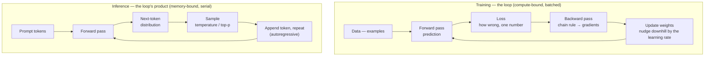
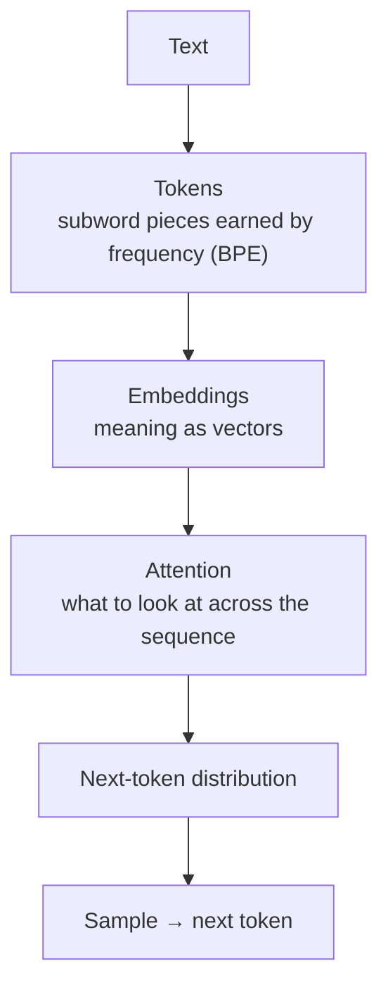

# Module 26 — AI Foundations

<small>Stage 10 · Expert Mastery · ~2 weeks at 4 h/day · Prerequisites — M13 (Python you'll write the math in), M21–M22 (the silicon and the napkin law), M24 (the API key estate), M25 (a number over time is a signal).</small>

## Why this matters

**Artificial intelligence**, as practiced today, is overwhelmingly **machine learning**: instead of writing
rules, you fit a FUNCTION to data. A **neural network** is one family of such functions — layered matrix
multiplications with a nonlinearity between each layer — whose millions or billions of adjustable numbers
(**weights**) are found by **training**: measure how wrong the function is (**loss**), compute which
direction each weight should move to be less wrong (**gradients**, via **backpropagation**), nudge them
(**gradient descent**), repeat. **Inference** is just running the fitted function forward. An **LLM** is
this machinery at scale, trained to predict the next token of text — and everything you've experienced
using Claude since Stage 3 (context windows, temperature, hallucination, token limits) falls out of that
one sentence.

You have used AI daily since Module 10 — as a reviewer, never a crutch — while deliberately deferring the
question *"what IS this thing?"* This module answers it with the curriculum's standard weapon: build it
bare-hands. You will represent words as vectors and measure meaning as geometry, run a tiny gradient
descent and WATCH the loss fall (the module's measured number), tokenize text and see why Claude counts
tokens instead of words, and place training vs inference onto Module 22's silicon map. By the end,
"the model hallucinated" stops being a mystery-phrase and becomes a mechanism you can explain.

!!! info "What this unlocks"
    M27 (Machine Learning) turns this frame into a discipline — datasets, validation, the overfitting
    dragon first sighted here · M28 (AI Infrastructure) industrialises the inference loop you'll time —
    batching, quantization, serving · M29 (Claude Code Advanced) builds agents on the machinery you now
    understand, and defends prompt injection as engineering, not folklore. The tool that has reviewed your
    work since Stage 3 turns out to run on chain rule, matrix multiplication, and next-token prediction —
    machinery you can now build in miniature, size on a napkin, and trust exactly as far as its mechanism
    deserves.

---

## Watch

*Watch once, then rely on the notes below — you should never need to rewatch.*

<div class="lo-video-placeholder" markdown="1">
<span class="lo-play">▶</span>
**Explainer video — coming**
<small>Record per <code>../media/README.md</code>, upload to YouTube, then replace this card with the embed.</small>
</div>

??? note "For the author — drop-in YouTube embed (replace VIDEO_ID)"
    Once the explainer is on YouTube, replace the placeholder card above with:
    ```html
    <div class="lo-video-embed">
      <iframe src="https://www.youtube-nocookie.com/embed/VIDEO_ID"
              title="Module 26 — AI Foundations"
              allow="accelerometer; autoplay; clipboard-write; encrypted-media; gyroscope; picture-in-picture"
              allowfullscreen></iframe>
    </div>
    ```
    Video script beats (from the blueprint's Definition / Analogy / Misconceptions):
    the deflation — a model is a fitted function, learning is tuning a million dials to reduce static →
    the neuron and why nonlinearity is load-bearing (the 1969 XOR winter) → the training loop
    (forward → loss → backward → step) with a line-fit converging live → tokens/embeddings/attention at
    high altitude → training vs inference as two different silicon workloads (M22's napkin law) →
    hallucination from mechanism, not moral failing.

**Terminal cast — pending; record per `../media/README.md`.**

!!! tip "Follow along, don't just watch"
    Open the [Guided Lab](#guided-lab-a-model-with-your-own-hands) in a browser terminal and run each
    step yourself as it appears. Typing the math beats watching it — the loss curve only teaches you
    something once you've made it fall with your own numbers.

---

## Key Notes

*Standalone. This is the reference you keep.*

### The picture: two loops



Training runs forward, measures wrongness, sends the error backward to nudge every weight, and repeats —
the LOSS CURVE falling is the whole story. Inference just runs the fitted function forward, one token at a
time, sampling each next token and feeding it back in. Same forward pass; two very different workloads.

### A model is a fitted function

The deflationary core: input numbers → weighted sums and nonlinearities → output numbers. "Learning" is
adjusting weights to reduce a measured loss on examples. No rules, no lookup, no understanding built in —
behaviour EMERGES from fit. Training a model is breeding a dog's nose, not writing a field guide: nobody
writes the rule for what explosives smell like; you present examples, reward correct signals, and the nose
ends up ENCODING the task without anyone being able to point at the rule inside.

### The neuron, and why nonlinearity is load-bearing

A neuron is a weighted sum of its inputs plus a bias, passed through a nonlinear **activation**. The
nonlinearity is not decoration. Stack two *linear* layers and they collapse into one matrix — a matrix
times a matrix is just another matrix, so depth buys nothing. The activation between layers breaks the
collapse, letting depth compose features. **XOR** is the classic proof: one linear neuron provably cannot
fit it (the 1969 "winter" argument), but one hidden nonlinear layer can.

### Loss and gradient descent — the knobs

Loss is wrongness as a single number: you get what you measure. Gradient descent reads the slope of that
number with respect to each weight and steps downhill. Its knobs decide whether you converge:

| Knob | Too small | Too big | What it controls |
|---|---|---|---|
| **Learning rate** | geology — creeps for eternity | divergence — loss explodes to NaN | step size downhill |
| **Batch size** | noisy, jittery curve | smooth but slower per example | how many examples per step |
| **Epochs** | underfit — stops too early | overfitting risk | passes over the data |
| **Capacity** (neurons) | can't fit the pattern | memorises noise | how much the model *can* learn |

The loss curve is training's **golden signal** (Module 25's habit, now aimed at a model): a number over
time. Plot train loss AND held-out loss on one axes and you can read *overfitting* directly — train keeps
falling while held-out turns back up.

### Backprop — the chain rule, industrialised

Backpropagation computes, for every weight, the partial derivative of the loss (∂loss/∂w). Every operation
records its local derivative on the way forward; the graph is replayed backward, multiplying and
accumulating those local derivatives by the chain rule. Every weight learns its own "which way is less
wrong." The honesty test is **gradient checking**: perturb a weight by ±ε, recompute the loss numerically,
and compare `(L(w+ε) − L(w−ε)) / 2ε` against backprop's answer — they must agree, because the definition of
a derivative doesn't need your code to be right.

### The text pipeline



- **Tokens.** Text is chopped into subword pieces; frequent fragments earn their own IDs (BPE). The model
  sees pieces, not letters — which is why long numbers and spelling questions go wrong, why context is a
  *budget*, and why cost is per token. English words often own a whole token; a rarer language fragments
  into many, so the same 12 words can cost twice as many tokens.
- **Embeddings.** Meaning as geometry: tokens (and documents) become high-dimensional vectors where
  similarity ≈ proximity. This is how "related" becomes *computable* — and how retrieval/RAG works. You
  measure it with **cosine similarity**: the cosine of the angle between two vectors, `a·b / (|a||b|)`.
- **Attention and the transformer.** Each position computes what else in the sequence to draw from
  (query/key/value, conceptually). Attention replaced recurrence, so the whole sequence processes in
  PARALLEL — which is exactly the dense, regular arithmetic Module 22's GPU is built for. That is *why*
  transformers and GPUs found each other.

### Training vs inference — two different workloads

| | Training | Inference |
|---|---|---|
| **What runs** | forward + backward + weight update | forward only, one token at a time |
| **Bottleneck** | compute (amortises weights over a batch) | memory bandwidth (streams weights per token) |
| **Silicon** | the cluster's job (M28) | the napkin law (M22) |
| **Napkin law** | — | tokens/s ≈ memory bandwidth ÷ model bytes |

Autoregressive inference must stream essentially ALL the weights through memory for a little arithmetic per
token — bandwidth dominates. A 7B model in 4-bit is ~3.5 GB; on 50 GB/s that's ≈ 14 tokens/s. Sampling adds
**temperature** (divides the logits before softmax — 0 is deterministic argmax, high flattens the
distribution) and **top-p** (truncates the tail to the smallest set summing to p).

### What LLMs are — and aren't

An LLM is a trained next-token predictor, shaped by fine-tuning/RLHF into an assistant. Read the familiar
phenomena mechanically:

- **Hallucination** — fluent continuation IS the objective; truth is correlated with high probability but
  not guaranteed. Beyond the fit's support (post-cutoff, rare facts, leading questions) the model still
  produces fluent, confident text. Grounding (putting the facts INTO context) works because attention uses
  them directly — conditioning beats recall.
- **Context window** — attention's span is finite and paid for.
- **Knowledge cutoff** — the fit froze at training time.
- **Prompting** — conditions the distribution; "think step by step" spends tokens on intermediate
  computation, few-shot examples condition on a pattern.

<div class="lo-remember" markdown="1">
**Must remember (if you keep only six things):**

1. **A model is a function with adjustable weights, fit to data.** Training = reduce measured loss;
   inference = run it forward. No rules, no database — a lossy fit in the weights.
2. **Depth needs nonlinearity.** Stacked linear layers collapse into one matrix; activations break the
   collapse. XOR is the proof.
3. **Backprop is the chain rule applied backward through the graph** — ∂loss/∂w for every weight. The
   gradient check is the honesty test.
4. **The pipeline:** tokens (pieces, not words) → embeddings (meaning as vectors) → attention (what to look
   at) → next-token distribution → sample.
5. **Two workloads:** training is compute-bound and batched; inference is bandwidth-bound and serial —
   tokens/s ≈ bandwidth ÷ model bytes.
6. **Hallucination is the mechanism working**, not a bug: fluent continuation is the objective. Grounding
   manages it; verification, not vibes, is how you trust an output.
</div>

---

## Guided Lab: a model with your own hands

*Basic, step-by-step. CPU-only Python with numpy — no GPU, no API key. You'll represent words as vectors
and compute cosine similarity by hand, run a gradient descent that fits a line and watch the loss fall,
and build a toy tokenizer. Everything runs in a throwaway `~/ai-foundations/` project.*

<div class="lo-lab-actions" markdown="1">
[▶ Open interactive lab](https://killercoda.com/learning-os/course/killercoda/module-26){ .lo-btn target=_blank }
[⧉ Open in Codespaces](https://codespaces.new/randaguiac20/learning-os){ .lo-btn target=_blank }
[⌨ Run locally](#run-locally){ .lo-btn .lo-btn--ghost }
[View lab source](https://github.com/randaguiac20/learning-os/tree/main/killercoda/module-26){ .lo-btn .lo-btn--ghost target=_blank }
</div>

<span id="run-locally"></span>
!!! tip "Three ways to run this lab — pick any (all free)"
    - **Instant, no account** — click **Open interactive lab** (Killercoda): a Linux terminal in your browser.
    - **Your own cloud** — click **Open in Codespaces**: runs in your GitHub account's free tier (120 core-hrs/mo).
    - **Local, unlimited, $0** — any Linux / macOS / WSL terminal, or a throwaway container: `docker run -it ubuntu bash`, then follow the steps below.

    Killercoda is the zero-setup on-ramp; Codespaces and local use *your own* free resources, so they scale to any class size. The only step that needs a network account is the optional **"run locally with your key"** Claude API call at the end.

=== "1 · Set up the bench"
    ```bash
    apt-get update -qq && apt-get install -y python3-pip   # pip for the CPU-only stack
    pip install numpy                                       # the only dependency we need
    mkdir -p ~/ai-foundations && cd ~/ai-foundations        # a throwaway project
    python3 -c "import numpy; print('numpy', numpy.__version__)"
    ```
    No GPU, no API key, no gigabytes of downloads — every idea in this module fits in plain numpy on a CPU.
    Journal: what is the difference between a *library* (numpy) and a *model*? (One is code you call; the
    other is numbers you fit.)

=== "2 · Words as vectors"
    ```bash
    cat > words.py <<'PY'
    import numpy as np
    # Each word is a hand-made vector over 4 interpretable features:
    # [is_living, is_royal, can_fly, is_vehicle]
    words = {
        "king":  np.array([0.95, 0.90, 0.00, 0.00]),
        "queen": np.array([0.95, 0.85, 0.00, 0.00]),
        "dog":   np.array([0.90, 0.00, 0.00, 0.00]),
        "cat":   np.array([0.85, 0.00, 0.00, 0.00]),
        "car":   np.array([0.00, 0.00, 0.00, 0.90]),
        "jet":   np.array([0.00, 0.00, 0.80, 0.95]),
    }
    for w, v in words.items():
        print(f"{w:5} -> {v}")
    PY
    python3 words.py
    ```
    "Meaning" here is just position in space. Real embeddings have hundreds of dimensions and are *learned*,
    not hand-typed — but the idea is identical: related things sit close together. Journal: which two words
    do you expect to be nearest, just by looking at the numbers?

=== "3 · Similarity by hand — the nearest word"
    ```bash
    cat > cosine.py <<'PY'
    import numpy as np
    from words import words

    def cosine(a, b):                                   # YOUR own line — no black-box helper
        return float(a @ b / (np.linalg.norm(a) * np.linalg.norm(b)))

    query = "king"
    scores = {w: cosine(words[query], words[w]) for w in words if w != query}
    for w, s in sorted(scores.items(), key=lambda kv: -kv[1]):
        print(f"  cos({query}, {w:5}) = {s:.3f}")
    best = max(scores, key=scores.get)
    print(f"nearest to '{query}': {best}")
    with open("nearest.txt", "w") as f:
        f.write(best + "\n")                            # the artifact the verifier checks
    PY
    python3 cosine.py
    ```
    You just built RAG's whole trick, naked: embed everything, rank by cosine similarity, take the top match.
    "king" should land nearest "queen" (same living + royal features), while "car" would land nearest "jet".
    Click **Check** to verify the nearest word.

=== "4 · Gradient descent — fit a line, watch the loss fall"
    ```bash
    cat > gd.py <<'PY'
    import numpy as np
    rng = np.random.default_rng(0)
    x = np.linspace(0, 1, 10)
    y = 2.0 * x + 1.0 + rng.normal(0, 0.05, size=10)   # ~ y = 2x + 1, plus noise

    w, b = 0.0, 0.0                                     # start knowing nothing
    lr = 0.5                                            # the learning rate knob
    for step in range(200):
        yhat = w * x + b
        err = yhat - y
        loss = float(np.mean(err**2))                  # mean squared error = "how wrong"
        grad_w = float(np.mean(2 * err * x))           # chain rule, by hand
        grad_b = float(np.mean(2 * err))
        w -= lr * grad_w                               # nudge downhill
        b -= lr * grad_b
        if step % 40 == 0:
            print(f"step {step:3d}  loss={loss:.4f}  w={w:.3f}  b={b:.3f}")

    final_loss = float(np.mean((w * x + b - y) ** 2))
    print(f"final: loss={final_loss:.4f}  w={w:.3f}  b={b:.3f}  (true w=2, b=1)")
    with open("loss.txt", "w") as f:
        f.write(f"{final_loss:.6f}\n")                  # the measured number
    PY
    python3 gd.py
    ```
    You have now trained a model. The loss falls, `w` climbs toward 2 and `b` toward 1 — gradient descent
    *found* the line without ever being told it. **Predict first, then experiment:** change `lr` to `5.0`
    (watch it explode to `inf`/`nan`) and to `0.01` (watch geology). Those broken runs also overwrite
    `loss.txt`, so re-run `python3 gd.py` to restore the good fit before you **Check** it.

=== "5 · A toy tokenizer — and the API path"
    ```bash
    cat > tokenize.py <<'PY'
    text = "the cat sat on the mat and the cat ran"
    tokens = text.split()                              # naive whitespace tokenizer
    vocab = {}
    for t in tokens:
        if t not in vocab:
            vocab[t] = len(vocab)                      # earn an id on first sight
    ids = [vocab[t] for t in tokens]
    print("vocab:", vocab)
    print("ids:  ", ids)
    print("tokens:", len(tokens), " vocab size:", len(vocab))
    PY
    python3 tokenize.py
    ```
    Repeated words share an id — that reuse is what real BPE industrialises on subword *pieces*, not whole
    words. Journal: why does "the" appear three times but claim only one vocab slot? That is the whole idea
    behind a context *budget*.

    !!! note "Run locally with your key — call a real LLM"
        The steps above run everywhere with no account. To watch the *same mechanism* at scale, call the
        Claude API from your own machine with your own key (never in code or shell history — decrypt at use,
        per Module 24). This block is illustrative — do **not** run it on Killercoda:
        ```python
        # pip install anthropic ; export ANTHROPIC_API_KEY=...  (from your sops estate)
        import anthropic
        client = anthropic.Anthropic()                 # reads ANTHROPIC_API_KEY
        resp = client.messages.create(
            model="claude-opus-5",
            max_tokens=200,
            messages=[{"role": "user", "content": "In one sentence: what is a token?"}],
        )
        print(resp.content[0].text)
        print("input tokens:", resp.usage.input_tokens)   # the same tokens you just counted
        ```
        Same loop as your `gd.py`, only with billions more dials and text pieces instead of numbers — and
        `usage.input_tokens` is exactly the count your toy tokenizer was estimating.

!!! success "You can stop here and have learned something real"
    If you can measure similarity with your own cosine line, make a loss curve fall with gradient descent,
    and turn text into token ids — you have touched every layer of the machine. Now make it harder.

---

## Solo Lab: figure it out

*Harder. Goals only — minimal hand-holding. Work in your `~/ai-foundations/` project. Predict before you
run; reveal a hint only after you've tried.*

### Challenge 1 — The collapse, shown not asserted
Show, with two 2×2 matrices, that stacking two linear layers is just one matrix — so depth without a
nonlinearity buys nothing.

??? tip "Hint"
    A linear layer is a matrix multiply. Two of them applied in sequence is `M2 @ (M1 @ x)`. What does
    matrix multiplication let you regroup?

??? success "Solution"
    ```python
    import numpy as np
    M1 = np.array([[2., 0.], [1., 3.]])
    M2 = np.array([[1., -1.], [0., 2.]])
    x = np.array([1., 1.])
    print(M2 @ (M1 @ x))        # two layers
    print((M2 @ M1) @ x)        # one combined matrix — identical
    ```
    `M2 @ (M1 @ x) == (M2 @ M1) @ x` by associativity: the two linear layers ARE the single matrix
    `M2 @ M1`. Only a nonlinear activation *between* them breaks the collapse — that is why XOR needs a
    hidden nonlinear layer, and why "nonlinearity because it's nonlinear" is not an answer.

### Challenge 2 — The learning-rate cliff
Find, by experiment, roughly the largest learning rate for the Step-4 line-fit that still converges (loss
falls to near zero) instead of diverging (loss growing without bound, eventually `inf`/`nan`). State your
prediction first.

??? tip "Hint"
    Sweep `lr` over something like `[0.01, 0.1, 0.5, 1.0, 1.5, 2.0]`, run the loop for each, and print the
    final loss without a fixed format so divergent runs show scientific notation. The boundary between
    "geology," "converges," and "explodes" is sharp.

??? success "Solution"
    ```python
    import numpy as np
    rng = np.random.default_rng(0)
    x = np.linspace(0, 1, 10); y = 2*x + 1 + rng.normal(0, 0.05, 10)
    for lr in [0.01, 0.1, 0.5, 1.0, 1.5, 2.0]:
        w = b = 0.0
        for _ in range(200):
            err = (w*x + b) - y
            w -= lr * np.mean(2*err*x); b -= lr * np.mean(2*err)
        print(f"lr={lr:<4} final loss={np.mean(((w*x+b)-y)**2)}")
    ```
    With this data the cliff sits between about `0.5` and `1.0`: `0.01` barely moves (geology), `0.1` and
    `0.5` converge cleanly to near-zero loss, and from `1.0` upward the updates overshoot, the weights grow
    each step, and the loss races off to astronomically large values (and, at larger rates or more steps,
    `inf`/`nan`). That blow-up is the C8 failure from the validation bank, felt directly: the fix is always
    to *reduce* the learning rate and confirm the curve becomes a fall.

### Challenge 3 — Embeddings cluster
Add three more words to `words.py` (e.g. `truck`, `bird`, `prince`) with feature vectors you choose, then
print the full pairwise cosine-similarity matrix and read it: do the animals cluster, the vehicles cluster,
and the royalty cluster — measured, not asserted?

??? success "Solution"
    ```python
    import numpy as np
    from words import words                     # extend the dict first
    ws = list(words)
    def cos(a, b): return a @ b / (np.linalg.norm(a) * np.linalg.norm(b))
    print("      " + " ".join(f"{w:>6}" for w in ws))
    for a in ws:
        row = " ".join(f"{cos(words[a], words[b]):6.2f}" for b in ws)
        print(f"{a:>5} {row}")
    ```
    High cosines cluster the living things together, the vehicles together, and `king`/`queen`/`prince`
    together — proximity ≈ relatedness, exactly the geometry a retrieval system ranks on. If a word you
    added lands in the wrong cluster, its feature vector — not the math — is what to fix.

### Challenge 4 — Why 10 words cost 40 tokens
Explain, from BPE's construction, why a 12-word English sentence might cost 15 tokens while a 12-word
Finnish sentence costs 34 — even though both scripts are "just letters."

??? success "Solution"
    BPE earns its vocabulary by FREQUENCY in the training data, which is English-heavy. Common English
    words own whole tokens; an agglutinative, rarer-in-the-data language like Finnish shatters into many
    small subword pieces. Same information, more tokens — with real consequences: a smaller effective
    context budget, higher cost per sentence, and sometimes worse quality. Your Step-5 tokenizer showed the
    same effect in miniature: a repeated word claims one id, a never-seen word claims a fresh one.

### Challenge 5 (stretch) — Where does the knowledge live?
Argue, in three sentences a skeptic can't dismiss, the honest middle between "it's just autocomplete" and
"it understands like a person" — grounded in mechanism, not vibes.

??? success "Solution"
    It is a next-token predictor — that mechanism is not in dispute; and at scale that objective yields
    measurable capabilities (code, synthesis, reasoning-shaped output) alongside sharp, measurable failure
    modes (hallucination, brittleness at the distribution's edge). "Just autocomplete" ignores the measured
    capabilities; "understands like a person" ignores the mechanism and its failures. The knowledge lives in
    the weights — a compressed, lossy fit — which is *why* grounding facts in context beats trusting recall,
    and why you decide by verification, not vibes.

---

## Self-Check

*Close the notes. Answer aloud or in writing **first**, then reveal. Recalling — even when it's hard — is
what builds the memory.*

??? question "Define model, training, inference, loss, and gradient — one line each, in the fitted-function frame."
    **Model:** a function with adjustable weights mapping inputs to outputs. **Training:** adjusting weights
    to reduce measured wrongness on examples. **Inference:** running the fitted function forward.
    **Loss:** wrongness as a single number. **Gradient:** for each weight, which direction (and how
    strongly) a change reduces the loss.

??? question "Why is nonlinearity load-bearing? Include the collapse argument and XOR."
    A stack of linear layers is itself linear (a matrix product of matrices is a matrix), so depth buys
    nothing — the stack collapses into one matrix. Nonlinear activations between layers break the collapse,
    letting depth compose features. XOR is the classic non-linearly-separable function: one linear neuron
    provably can't fit it (1969's winter argument); one hidden nonlinear layer can.

??? question "What does backpropagation compute, and what is the honesty test for a hand-built one?"
    It computes ∂loss/∂w for every weight — the chain rule applied backward through the recorded computation
    graph, multiplying and accumulating local derivatives. The honesty test is **gradient checking**:
    perturb a weight by ±ε, compute the loss numerically, and compare `(L(w+ε) − L(w−ε)) / 2ε` against your
    backward pass — they must agree to ~1e-6, because the numerical definition doesn't depend on your code
    being right.

??? question "Your training loss explodes to NaN after a few steps. The most likely knob, the mechanism, and the fix?"
    **Learning rate too large.** Updates overshoot, weights grow, activations and gradients amplify each
    step until they overflow to NaN. Fix: reduce the learning rate (10×) and confirm the curve becomes a
    fall. (Gradient clipping is the industrial-strength variant, met in M27.)

??? question "The same prompt at temperature 0 twice, then at temperature 1.5 twice — what differs and why?"
    Temperature 0 is argmax sampling: deterministic, so the two runs match (modulo serving nondeterminism).
    1.5 flattens the distribution: randomness is amplified, so the two runs diverge and likely ramble — mass
    spread onto weaker continuations. Mechanism: temperature divides the logits before the softmax.

??? question "Who computes cosine similarity between two embeddings, and what does a high value mean?"
    You do — `a·b / (|a||b|)`, the cosine of the angle between the vectors. A high value (near 1) means the
    vectors point the same way: the two items are close in the meaning-space, i.e. related. That single line
    is the ranking step at the heart of retrieval/RAG.

??? question "Explain hallucination from mechanism, and why grounding manages it."
    The objective is fluent continuation — produce the most probable next token given context and the
    training fit. Truth correlates with probability but is not the objective, so beyond the fit's support
    (post-cutoff, rare facts, leading questions) the model still emits fluent, high-probability text:
    hallucination. Grounding puts the facts INTO context, where attention uses them directly — conditioning
    beats recall.

!!! example "Teach it back (the real test)"
    Out loud, in **5 minutes, no notes** — *"The million dials."* Give the fitted-function frame via the
    radio-static analogy (tuning a million dials to reduce static on songs it's never played), show ONE live
    demo (your line-fit converging, loss falling on screen in real time), then bridge to Claude: the same
    loop, more dials, text pieces. Land **one honest capability and one honest limit** (hallucination from
    mechanism). Your listener must be able to answer afterward: *"So where does the knowledge live?"* (in the
    dial positions) and *"Why does it make things up?"* If they can't, that's your signal to reread the Key
    Notes, not to move on.

---

## Mastery checklist

*Tick these honestly, cold (no notes). They **gate** progress into Module 27. A module is only "done" when
every box is true.*

- [ ] **Define** model / training / inference / loss / gradient in the fitted-function frame, cold.
- [ ] **Explain** why nonlinearity is load-bearing — the collapse argument shown with matrices, plus XOR.
- [ ] **List** the text pipeline's five stages (tokens → embeddings → attention → distribution → sample) with each one's job.
- [ ] **Draw** both loops from memory: training (forward → loss → backward → step) and autoregressive inference, with the compute-bound / bandwidth-bound annotations.
- [ ] **Demonstrate** a training run whose loss curve you make fall, and read the final number against the true answer.
- [ ] **Analyze** embeddings by computing cosine similarities with your own numpy line, and read the clustering.
- [ ] **Apply** a toy tokenizer (split → vocab → ids) and explain a real tokenizer's quirks (spelling, arithmetic, other languages).
- [ ] **Debug** the NaN / divergence pathology: name the knob, the mechanism, and the fix; reproduce the learning-rate cliff.
- [ ] **Compare** weights vs context as knowledge stores (stale/vast/lossy/free vs fresh/small/reliable/paid) with the RAG conclusion.
- [ ] **Predict** napkin throughput for a model on given hardware (tokens/s ≈ bandwidth ÷ model bytes), then sanity-check the arithmetic.
- [ ] **Assess** where an LLM should NOT be used — two problem classes, each argued from mechanism.
- [ ] **Teach:** pass the teach-back above — the listener can say where the knowledge lives and why it makes things up.

---

## Review — lock it in

Spaced repetition is not optional; it's where the memory actually forms. Interleaving stays active — every
M26 review also pulls one item from an earlier module. Schedule these and *keep* them:

| When | Do | Interleaved item |
|---|---|---|
| **Day 1** | Loop sprint (training's four stages + inference's cycle) · flashcards · the line-fit rebuilt from an empty file | M25: "a metric over time is a signal — the loss curve is a golden signal" |
| **Day 3** | The line-fit redone cold in ≤15 min · temperature 0 vs 1.5 re-predicted, then reasoned | M22: napkin law — size one model cold (params + precision → tokens/s on your bandwidth) |
| **Day 7** | Cosine similarity re-derived and the nearest-word demo re-run · the collapse argument shown with matrices | M24: the API key's lifecycle — decrypt-at-use, never in history |
| **Day 14** | Both loops + the text pipeline drawn cold · the overfitting plot narrated (train falls, held-out rises) | M21: predict → measure → reconcile, applied to a knob experiment |
| **Day 30** | Validation retake ≥90% · the "what Claude is doing" explanation given to your Stage-3 self | M13: the `Value`-class shape (data, grad, a backward closure) narrated aloud |

**Connects forward to:** Machine Learning (M27 — the frame becomes a discipline; the overfitting dragon
gets hunted) · AI Infrastructure (M28 — the inference loop industrialised: batching, quantization, serving)
· Claude Code Advanced (M29 — agents on this machinery; injection defended as engineering) · the Capstone,
where every layer you named here runs live in one service.

!!! quote "The one-sentence takeaway"
    A model is a fitted function, training is gradient descent, and an LLM is a next-token predictor — the
    black box is glass now, and it stays glass all the way up.
