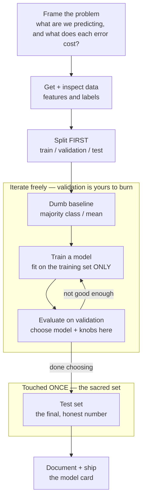
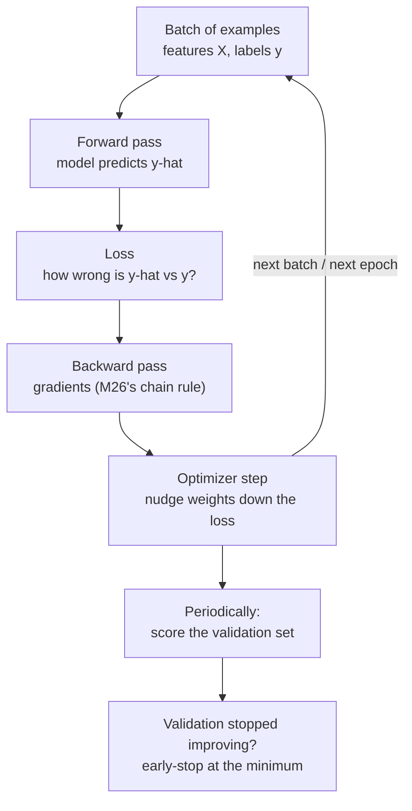

# Module 27 — Machine Learning

<small>Stage 10 · Expert Mastery · ~4 weeks at 4 h/day · Prerequisite — Module 26 (AI Foundations — the mechanism; backprop is glass, and its overfitting preview becomes this module's syllabus). Builds on M13 (Python / numpy / sklearn), M22 (the GPU finally trains real models), M25 (curves as signals), M21 (predict → measure → reconcile).</small>

## Why this matters

**Machine learning**, done as an engineer rather than a hobbyist, is three commitments layered on M26's
fitted-function mechanism: a **workflow** (frame → get and split data → baseline → train → evaluate on
data the model never saw → iterate → ship with documentation), a **methodology** (the train/validation/test
contract, cross-validation, metrics chosen for the problem's real costs — the machinery that turns "it
works" into a *measured* claim), and a **toolbox** (classical models — linear, logistic, trees, ensembles —
that win on tabular data, plus deep networks where depth pays). Everything derives from one law:
**generalization is the only thing being purchased.** Performance on data you trained on is an accounting
fiction — memorization is free; earning it on unseen data is the whole job.

M26 showed you the mechanism and planted the dragon: train loss falling while held-out loss rises. This
module is the hunt. You will learn why that plot is *the* central problem of the field, and master the
defenses — honest splits, cross-validation, regularization, early stopping — and the cardinal sin's
detection: **leakage**, when test information seeps into training and your beautiful metric becomes a lie.
The module's product is not a model. It is a **practice**: every claim measured on unseen data, every
choice justified, every model shipped with its card.

!!! info "What this unlocks"
    This is Stage 10's methodological heart. **M28** (AI Infrastructure) turns your trained models into
    *serving* problems — the card's "intended use" line becomes deployment policy. **M29** (Agentic
    automation) is this discipline applied to workflows: evals are held-out tasks, honest metrics, slices by
    task type. The **capstone** selects and fine-tunes a model *by this exact process* — baselines before
    belief, sliced evals before claims, a card before shipping. Learn the discipline now and every AI claim
    you ever make — or are shown — gets weighed on evidence instead of enthusiasm.

---

## Watch

*Watch once, then rely on the notes below — you should never need to rewatch.*

<div class="lo-video-placeholder" markdown="1">
<span class="lo-play">▶</span>
**Explainer video — coming**
<small>Record per <code>../media/README.md</code>, upload to YouTube, then replace this card with the embed.</small>
</div>

??? note "For the author — drop-in YouTube embed (replace VIDEO_ID)"
    Once the explainer is on YouTube, replace the placeholder card above with:
    ```html
    <div class="lo-video-embed">
      <iframe src="https://www.youtube-nocookie.com/embed/VIDEO_ID"
              title="Module 27 — Machine Learning"
              allow="accelerometer; autoplay; clipboard-write; encrypted-media; gyroscope; picture-in-picture"
              allowfullscreen></iframe>
    </div>
    ```
    Video script beats (from the blueprint's Definition / Analogy / Misconceptions):
    machine learning as a *drug trial*, not a potion (bench / animal study / human trial run ONCE) → the
    split contract and why peeking at the test set is fraud even when it feels like diligence → the dragon
    (train error → 0 while validation rises: the bias-variance U-curve) → leakage as contaminating the
    control group (the results glow, the medicine is worthless) → the baseline as the placebo arm ("87%
    recovered" means nothing without it) → metrics chosen for costs before the trial → close on the three
    questions to ask of any impressive number: *what baseline? what split? whose slices?*

**Terminal cast — pending; record per `../media/README.md`.**

!!! tip "Follow along, don't just watch"
    Open the [Guided Lab](#guided-lab-your-first-honest-model) in a browser terminal and **run each step
    yourself** — the honest split, the trained model, the confusion matrix, the overfitting you cause on
    purpose and then cure. Every idea here is a number you can compute on a plain CPU in seconds. Typing
    beats watching, and it is part of how the memory forms.

---

## Key Notes

*Standalone. This is the reference you keep.*

### The one law, and two kinds of learning

The single law from which everything else follows: **generalization is the only thing being purchased.**
A model that scores 100% on its training data has told you nothing — it may have *memorized* rather than
*learned*. The only honest evidence is performance on data it never saw.

Most of this module is **supervised** learning — you have labels and you learn to predict them — but it is
worth knowing the whole map:

| | Supervised | Unsupervised |
|---|---|---|
| **Data you have** | features `X` **and** labels `y` | features `X` only — no labels |
| **The goal** | learn the mapping `X → y` (predict the label) | find structure — groups, or a compression |
| **Examples** | classification, regression | k-means clustering, PCA |
| **A "right answer" to check against?** | yes — the label | no ground truth — you judge the structure |

**Features and labels** are the vocabulary: a **feature** is an input column the model reads (age, pixel,
word count); the **label** is the answer you want back (spam / not-spam, house price, digit `0–9`). One row
= one example = its features plus, in supervised learning, its label.

### The workflow — a loop, not a ritual



Each stage exists because *skipping it produces a specific, named disaster.* Learn the disasters and the
workflow becomes reflex instead of routine:

| Stage | What happens | Disaster if you skip it |
|---|---|---|
| **Frame** | decide what to predict and the cost of each error | you optimize the wrong thing beautifully |
| **Split first** | carve out validation + test *before* exploring | you grade homework with the answer key (leakage) |
| **Baseline** | a dumb model — majority class, the mean | you cannot tell whether your model learned *anything* |
| **Train** | fit weights on the training set only | (the only set the model's weights may ever see) |
| **Validate** | score on validation; make **every** choice here | choices tuned against test silently inflate the final number |
| **Test once** | one measurement, logged with the date | every extra peek converts test into validation |
| **Document** | the model card — provenance, use, failures | the next engineer inherits your blind spots |

### The split contract

The heart of the discipline. Three sets, three roles, one law:

- **Train** — the model *sees* it; weights are fit on it.
- **Validation** — **you** see it. Every choice (which model, which hyperparameters, which features, when to
  stop) is made on its evidence. It gets *burned* by your decisions — that is its job.
- **Test** — touched **ONCE**, at the very end, as the generalization claim's only honest measurement. The
  moment you choose anything *by* test performance, it has become a validation set and its number is
  inflated. Touched once means once — log the touch, literally, with a date.

The analogy that makes it stick: this is a **drug trial**. Train is the lab bench; validation is the animal
study (you may iterate on its results); test is the human trial — run once, pre-registered. Peek and adjust,
and your approval is fraud *even though it feels like diligence.*

### The training loop

Under the workflow's "Train" box sits M26's mechanism, now industrialized:



Classical sklearn models (logistic regression, trees) run this loop internally — you call `.fit()` and it
happens. Deep nets in PyTorch (Week 3) make the loop explicit, and it is the *same* loop you built by hand
in M26: forward → loss → backward → step, repeated, with validation watched.

### The dragon: over/underfitting and bias–variance

Two ways to be wrong, and they pull in opposite directions:

- **Underfitting (high bias)** — the model is too rigid to capture the real structure. Train *and*
  validation error are both high. The fix is more capacity or better features.
- **Overfitting (high variance)** — the model has enough capacity to memorize *noise*. Train error keeps
  falling toward zero while validation error turns and *rises*. This is the dragon.

Plot error against capacity (tree depth, epochs, polynomial degree) and you get the **U-curve**: validation
error falls, bottoms out at the **sweet spot**, then climbs as memorization sets in. The sweet spot is found
**empirically — via validation curves, never by theory alone.** **Regularization** (L2 / weight decay,
early stopping, dropout, data augmentation) is *deliberately chosen bias*: you trade a little flexibility to
tame a lot of variance. A 100%-train / 71%-validation model is not "almost there" — it is far to the right
of the U, and the cure is to move left (early stop, regularize, or reduce capacity).

### Evaluation metrics — chosen for costs, before the test

**Accuracy lies under imbalance.** In a 99:1 problem, a model that always predicts the majority scores 99%
while detecting *nothing*. So you pick the metric that prices the error that actually hurts:

| Family | Metric | The question it answers | Reach for it when |
|---|---|---|---|
| Classification | **Accuracy** | of all predictions, what fraction were right? | classes are balanced and errors cost the same |
| Classification | **Precision** | of my *alarms*, how many were real? | false positives are expensive (deleting real mail) |
| Classification | **Recall** | of the *real* cases, how many did I catch? | false negatives are expensive (missing cancer) |
| Classification | **F1** | precision and recall in one number | imbalance, and you need both to be decent |
| Classification | **ROC-AUC / PR-AUC** | ranking quality across every threshold | comparing models, or choosing a threshold |
| Regression | **MAE** | average error size | every error counts equally |
| Regression | **RMSE** | error, penalizing large misses extra | big misses are disproportionately bad |

The **threshold** (where a probability becomes a "yes") is a **business decision** — where the two error
costs balance — not a statistic. Moving it trades precision against recall. The **confusion matrix** is
where all of this comes from: true/false positives and negatives, and precision and recall are just two
ratios read off its cells.

### Cross-validation — and why it never replaces the test set

Under **small data**, a single validation split is noisy — you might get lucky or unlucky. **k-fold
cross-validation** splits the training data into `k` parts, trains on `k−1` and validates on the held-out
one, rotating through all `k`, then averages. You get a more stable estimate for *choosing*.

But CV is **not** a substitute for the final test set. You *tuned* on those CV averages — model choice,
hyperparameters, features were all optimized against them — so the CV number carries **selection optimism**.
The untouched test set remains the only measurement your decisions never optimized against.

### Two laws that keep you honest

- **The baseline law** — never believe (or ship) a model that has not beaten a dumb baseline: majority
  class, the mean, last-value for time series, logistic regression before any neural net. The baseline is
  engineering's *null hypothesis* — it prices what no-learning achieves, so your model's worth is the
  *difference*, not the absolute. "87%" means nothing until you know the majority class scores 86%.
- **Leakage — the cardinal sin.** Information unavailable at prediction time reaching training: a scaler fit
  on the *full* dataset, duplicate rows spanning splits, a target-derived feature, a time series split
  randomly (the future leaking into the past). The tell is *results too good to be true*; the audit habit is
  one question — **"could production know this at prediction time?"** The structural cure is a `Pipeline`
  whose transforms are fit on the training fold only.

And know the toolbox's shape — because **when classical beats deep is a real, common answer:**

| Rung | Model | What it adds | Overfits? |
|---|---|---|---|
| 1 | **Linear / Logistic** | fast, interpretable, shockingly strong with good features | rarely |
| 2 | **Decision tree** | nonlinear, no scaling needed, its logic is inspectable | eagerly |
| 3 | **Random forest** | many deep trees averaged — variance cancels | resistant |
| 4 | **Gradient boosting** | shallow trees fitting residuals — the **tabular king** | if unwatched (early-stop) |

Gradient boosting wins most *tabular* problems; deep nets win *perception and language*. The reason is
**inductive bias** — trees assume table-shaped truth (axis-aligned cuts on mixed features), CNNs assume
locality (nearby pixels relate). Match the model's assumptions to the data's shape.

<div class="lo-remember" markdown="1">
**Must remember (if you keep only six things):**

1. **Generalization is the only product.** Training-set performance is an accounting fiction.
2. **The split contract:** train (model sees) · validation (you see, it burns) · **test (touched ONCE)**.
   Choosing *by* test performance inflates the number.
3. **The dragon:** train error → 0 while validation rises = overfitting. Find the sweet spot **empirically**;
   regularization is deliberately-chosen bias.
4. **Accuracy lies under imbalance.** Pick the metric that prices the costly error — precision, recall, F1.
   The threshold is a business decision.
5. **Leakage is flattery by contamination.** The tell: too good to be true. The audit: *could production
   know this at prediction time?* The cure: a `Pipeline` fit on train only.
6. **The baseline law:** beat a dumb model or you have nothing. Your worth is the *difference*.
</div>

---

## Guided Lab: your first honest model

*Basic, step-by-step. Everything runs on a plain CPU with scikit-learn's built-in datasets — no downloads,
no GPU. You will train a real classifier, read a confusion matrix, then cause overfitting on purpose and
cure it — the module's whole story in miniature.*

<div class="lo-lab-actions" markdown="1">
[▶ Open interactive lab](https://killercoda.com/learning-os/course/killercoda/module-27){ .lo-btn target=_blank }
[⧉ Open in Codespaces](https://codespaces.new/randaguiac20/learning-os){ .lo-btn target=_blank }
[⌨ Run locally](#run-locally){ .lo-btn .lo-btn--ghost }
[View lab source](https://github.com/randaguiac20/learning-os/tree/main/killercoda/module-27){ .lo-btn .lo-btn--ghost target=_blank }
</div>

<span id="run-locally"></span>
!!! tip "Three ways to run this lab — pick any (all free)"
    - **Instant, no account** — click **Open interactive lab** (Killercoda): a Linux terminal in your browser.
    - **Your own cloud** — click **Open in Codespaces**: runs in your GitHub account's free tier (120 core-hrs/mo).
    - **Local, unlimited, $0** — any Linux / macOS / WSL terminal, or a throwaway container: `docker run -it ubuntu bash`, then follow the steps below.

    Killercoda is the zero-setup on-ramp; Codespaces and local use *your own* free resources, so they scale to any class size.

=== "1 · Set up the bench"
    Install scikit-learn and numpy, and make a working directory. scikit-learn ships toy datasets
    (iris, digits) *inside the package* — nothing is downloaded.
    ```bash
    apt-get update -qq && apt-get install -y python3-pip >/dev/null 2>&1
    pip install --quiet scikit-learn numpy
    mkdir -p ~/ml-lab && cd ~/ml-lab
    python3 -c "import sklearn, numpy; print('sklearn', sklearn.__version__, '· numpy', numpy.__version__)"
    ```
    You now have the classical toolbox's lingua franca on a CPU. Everything below lives in `~/ml-lab/`.

=== "2 · Load data, split honestly"
    Load the **digits** dataset (1797 hand-written digits, 64 pixel features, labels `0–9`) and split it
    **before** you do anything else. The split comes FIRST — looking at relationships before splitting
    leaks your choices.
    ```bash
    cd ~/ml-lab
    cat > explore.py <<'EOF'
    from sklearn.datasets import load_digits
    from sklearn.model_selection import train_test_split

    X, y = load_digits(return_X_y=True)          # X = features, y = labels
    print("features X:", X.shape, "· labels y:", y.shape)
    print("one example is", X.shape[1], "pixel values; its label is a digit 0-9")

    # Split FIRST. stratify=y keeps the class balance in every split.
    Xtr, Xte, ytr, yte = train_test_split(
        X, y, test_size=0.25, random_state=42, stratify=y)
    print("train rows:", len(ytr), "· test rows:", len(yte))
    EOF
    python3 explore.py
    ```
    `train_test_split` sealed 25% of the data away as test. The model will never see those rows until the
    single final measurement — that is the split contract, enforced in one line.

=== "3 · Train and evaluate"
    Train a **logistic regression** (rung 1 of the ladder — the honest baseline for a first model), then
    measure it on the held-out test set and read the **confusion matrix**. The script writes `metrics.json`
    and records that the train and test sets never overlapped.
    ```bash
    cd ~/ml-lab
    cat > train.py <<'EOF'
    import json
    import numpy as np
    from sklearn.datasets import load_digits
    from sklearn.model_selection import train_test_split
    from sklearn.linear_model import LogisticRegression
    from sklearn.metrics import accuracy_score, confusion_matrix

    X, y = load_digits(return_X_y=True)
    idx = np.arange(len(y))
    Xtr, Xte, ytr, yte, itr, ite = train_test_split(
        X, y, idx, test_size=0.25, random_state=42, stratify=y)

    clf = LogisticRegression(max_iter=5000)
    clf.fit(Xtr, ytr)                                  # fit on TRAIN only

    train_acc = accuracy_score(ytr, clf.predict(Xtr))
    test_acc  = accuracy_score(yte, clf.predict(Xte))  # the honest number
    cm = confusion_matrix(yte, clf.predict(Xte))
    overlap = len(set(itr.tolist()) & set(ite.tolist()))   # honesty check: must be 0

    metrics = {
        "model": "logistic_regression",
        "n_train": int(len(itr)), "n_test": int(len(ite)),
        "train_accuracy": round(float(train_acc), 4),
        "test_accuracy":  round(float(test_acc), 4),
        "train_test_overlap": int(overlap),
    }
    with open("metrics.json", "w") as f:
        json.dump(metrics, f, indent=2)
    print(json.dumps(metrics, indent=2))
    print("Confusion matrix (rows = true, cols = predicted):")
    print(cm)
    EOF
    python3 train.py
    ```
    Test accuracy lands around **0.96**, and `train_test_overlap` is **0** — the split was honest. Read the
    confusion matrix: the strong diagonal is correct predictions; off-diagonal cells are the specific
    mistakes (which digits get confused for which).

    Click **Check** (in the interactive lab) to verify `metrics.json` shows honest test accuracy above the bar.

=== "4 · Meet the dragon — overfit, then cure it"
    Now cause overfitting deliberately. An **unbounded decision tree** keeps splitting until it *memorizes*
    the training set — train accuracy hits 100%, but test accuracy sags. Then cap its depth (regularize)
    and watch the **gap shrink**.
    ```bash
    cd ~/ml-lab
    cat > overfit.py <<'EOF'
    import json
    from sklearn.datasets import load_digits
    from sklearn.model_selection import train_test_split
    from sklearn.tree import DecisionTreeClassifier
    from sklearn.metrics import accuracy_score

    X, y = load_digits(return_X_y=True)
    Xtr, Xte, ytr, yte = train_test_split(
        X, y, test_size=0.25, random_state=42, stratify=y)

    # OVERFIT: no depth limit -> the tree memorizes noise (high variance).
    deep = DecisionTreeClassifier(random_state=0).fit(Xtr, ytr)
    d_tr = accuracy_score(ytr, deep.predict(Xtr))
    d_te = accuracy_score(yte, deep.predict(Xte))

    # CURE: cap capacity -> deliberately-chosen bias tames the variance.
    fixed = DecisionTreeClassifier(max_depth=8, random_state=0).fit(Xtr, ytr)
    f_tr = accuracy_score(ytr, fixed.predict(Xtr))
    f_te = accuracy_score(yte, fixed.predict(Xte))

    res = {
        "overfit_train_accuracy": round(float(d_tr), 4),
        "overfit_test_accuracy":  round(float(d_te), 4),
        "overfit_gap":            round(float(d_tr - d_te), 4),
        "fixed_train_accuracy":   round(float(f_tr), 4),
        "fixed_test_accuracy":    round(float(f_te), 4),
        "fixed_gap":              round(float(f_tr - f_te), 4),
    }
    with open("overfit.json", "w") as f:
        json.dump(res, f, indent=2)
    print(json.dumps(res, indent=2))
    print("\nThe overfit tree scored ~1.0 on train but far less on test:",
          "that gap IS the dragon. Capping depth shrank it.")
    EOF
    python3 overfit.py
    ```
    The unbounded tree shows train ≈ **1.0** with a large train-minus-test **gap** (~0.18); the depth-capped
    tree gives up a little train accuracy but its gap shrinks (~0.12). You just watched the U-curve happen:
    regularization traded a sliver of flexibility for honesty.

    Click **Check** (in the interactive lab) to verify `overfit.json` shows a large overfit gap that the cure reduced.

=== "5 · Baseline + cross-validation"
    Two habits that separate engineers from notebook artists. First the **baseline law** — how well does a
    *dumb* model do? Then **cross-validation** for a stable estimate under the split you already made.
    ```bash
    cd ~/ml-lab
    cat > baseline_cv.py <<'EOF'
    import numpy as np
    from sklearn.datasets import load_digits
    from sklearn.model_selection import train_test_split, cross_val_score
    from sklearn.dummy import DummyClassifier
    from sklearn.linear_model import LogisticRegression

    X, y = load_digits(return_X_y=True)
    Xtr, Xte, ytr, yte = train_test_split(
        X, y, test_size=0.25, random_state=42, stratify=y)

    dummy = DummyClassifier(strategy="most_frequent").fit(Xtr, ytr)
    print("baseline (always the majority class):", round(dummy.score(Xte, yte), 4))

    # 5-fold CV on the TRAINING data only -> a stable estimate for CHOICES.
    scores = cross_val_score(LogisticRegression(max_iter=5000), Xtr, ytr, cv=5)
    print("logistic 5-fold CV accuracy:", np.round(scores, 4))
    print("CV mean +/- std:", round(scores.mean(), 4), "+/-", round(scores.std(), 4))
    print("\nYour model's worth is the DIFFERENCE from the ~0.10 baseline,",
          "not the absolute number.")
    EOF
    python3 baseline_cv.py
    ```
    The majority-class baseline scores about **0.10** (ten roughly-equal classes). Your 0.96 model is worth
    the *gap* over that floor — that is the baseline law made concrete. The CV scores cluster tightly, so the
    logistic model's quality is a stable finding, not a lucky split.

!!! success "You can stop here and have learned something real"
    If you split honestly, trained a model, read a confusion matrix, caused overfitting and cured it, and
    beat a baseline with cross-validated evidence — you have run the module's entire workflow on a CPU in
    minutes. Now make it harder.

---

## Solo Lab: figure it out

*Harder. Goals only — minimal hand-holding. Pipelines and models built **bare-hands**; an AI may review a
pipeline AFTER it runs and its numbers are honest — never write it for you first. Struggle here is the
point; reveal a hint only after you've tried.*

### Challenge 1 — The whole workflow, cold (Contract Keeper)
On a **fresh** built-in dataset (`load_wine` or `load_breast_cancer`), run the full workflow in one script:
split **first**, a dumb baseline, one linear/logistic model, honest metrics, and a two-line "mini-card"
(what it predicts, on what data, its test number). Recite each stage's named disaster as you go.

??? tip "Hint"
    Reuse Step 3's skeleton. For the split, `train_test_split(..., stratify=y, random_state=...)`. For the
    baseline, `DummyClassifier`. The card is just a docstring or a printed block — provenance, intended use,
    the single test number.

??? success "Solution"
    ```python
    from sklearn.datasets import load_breast_cancer
    from sklearn.model_selection import train_test_split
    from sklearn.dummy import DummyClassifier
    from sklearn.linear_model import LogisticRegression
    from sklearn.metrics import accuracy_score, f1_score

    X, y = load_breast_cancer(return_X_y=True)
    Xtr, Xte, ytr, yte = train_test_split(X, y, test_size=0.25, random_state=0, stratify=y)
    print("baseline:", DummyClassifier(strategy="most_frequent").fit(Xtr, ytr).score(Xte, yte))
    clf = LogisticRegression(max_iter=10000).fit(Xtr, ytr)
    print("test accuracy:", round(accuracy_score(yte, clf.predict(Xte)), 4))
    print("test F1:", round(f1_score(yte, clf.predict(Xte)), 4))
    # MINI-CARD: predicts malignant/benign from 30 cell-nucleus measurements;
    # data = sklearn's breast-cancer set; test touched ONCE; number above.
    ```
    The split precedes all exploration (looking first = leaking your choices); the metric is justified by
    cost (in screening, recall matters — a missed malignancy is catastrophic), not by habit.

### Challenge 2 — The accuracy trap, felt (the honest panel)
Build (or find) an **imbalanced** problem — e.g. relabel digits as "is it an 8?" (~10% positives). Train a
classifier, report **accuracy**, then build the honest panel by hand: confusion matrix, precision, recall,
F1. Show in writing why accuracy flatters and which metric you would actually report.

??? tip "Hint"
    `y8 = (y == 8).astype(int)` makes the imbalanced label. A classifier that never says "8" still scores
    ~90% accuracy. `from sklearn.metrics import precision_score, recall_score, f1_score, confusion_matrix`.

??? success "Solution"
    ```python
    import numpy as np
    from sklearn.datasets import load_digits
    from sklearn.model_selection import train_test_split
    from sklearn.linear_model import LogisticRegression
    from sklearn.metrics import confusion_matrix, precision_score, recall_score, f1_score
    X, y = load_digits(return_X_y=True); y8 = (y == 8).astype(int)
    Xtr, Xte, ytr, yte = train_test_split(X, y8, test_size=0.25, random_state=0, stratify=y8)
    p = LogisticRegression(max_iter=5000).fit(Xtr, ytr).predict(Xte)
    print("accuracy:", round((p == yte).mean(), 4))          # flatteringly high
    print(confusion_matrix(yte, p))
    print("precision:", round(precision_score(yte, p), 4),
          "recall:", round(recall_score(yte, p), 4), "F1:", round(f1_score(yte, p), 4))
    ```
    Accuracy is high because ~90% of rows are "not 8" — predicting the majority is free. The honest report is
    precision/recall/F1: the number that actually measures whether the rare class was *detected*.

### Challenge 3 — Plant a leak, then catch it (Leakage Hunter)
Fit a **scaler on the full dataset** *before* splitting, train, and record the metric. Then do it the
**right** way — scale inside a `Pipeline` fit on train only — and record again. Report the before/after gap.
Name the door and the mechanism.

??? tip "Hint"
    The leaky version: `StandardScaler().fit_transform(X)` on all of `X`, *then* split. The cure:
    `make_pipeline(StandardScaler(), LogisticRegression())` — the pipeline fits the scaler on each training
    fold only. The leak's *tell* is a validation number that is a touch too good.

??? success "Solution"
    ```python
    from sklearn.datasets import load_breast_cancer
    from sklearn.model_selection import cross_val_score
    from sklearn.preprocessing import StandardScaler
    from sklearn.linear_model import LogisticRegression
    from sklearn.pipeline import make_pipeline
    X, y = load_breast_cancer(return_X_y=True)
    Xleak = StandardScaler().fit_transform(X)   # DOOR: scaler saw the whole set
    leaky  = cross_val_score(LogisticRegression(max_iter=10000), Xleak, y, cv=5).mean()
    honest = cross_val_score(make_pipeline(StandardScaler(), LogisticRegression(max_iter=10000)),
                             X, y, cv=5).mean()   # scaler fit per-fold, on train only
    print("leaky CV:", round(leaky, 4), "· honest CV:", round(honest, 4))
    ```
    What leaked: the scaler's mean/std were computed using the validation rows, so every "training" example
    was transformed with knowledge of data the model should never have seen. The structural cure is the
    `Pipeline` — the fix is a *structure*, not a patch. The honest number is the real one.

### Challenge 4 — Climb the classical ladder (Toolbox Journeyman)
On one tabular dataset with one CV protocol, climb the ladder in order: logistic → decision tree → random
forest → gradient boosting. Report each model's CV score and write a one-paragraph **verdict**: which ships,
and *why* — including operability, not just accuracy.

??? tip "Hint"
    `from sklearn.ensemble import RandomForestClassifier, GradientBoostingClassifier`. Climb in order — no
    skipping to boosting. The winner is often boosting *by a hair*; the verdict must weigh whether that hair
    is worth the extra complexity to operate.

??? success "Solution"
    ```python
    from sklearn.datasets import load_breast_cancer
    from sklearn.model_selection import cross_val_score
    from sklearn.linear_model import LogisticRegression
    from sklearn.tree import DecisionTreeClassifier
    from sklearn.ensemble import RandomForestClassifier, GradientBoostingClassifier
    from sklearn.pipeline import make_pipeline
    from sklearn.preprocessing import StandardScaler
    X, y = load_breast_cancer(return_X_y=True)
    for name, m in [
        ("logistic", make_pipeline(StandardScaler(), LogisticRegression(max_iter=10000))),
        ("tree", DecisionTreeClassifier(random_state=0)),
        ("forest", RandomForestClassifier(random_state=0)),
        ("boosting", GradientBoostingClassifier(random_state=0))]:
        print(name, round(cross_val_score(m, X, y, cv=5).mean(), 4))
    ```
    Verdict template: "Boosting edged the others by ~1 point, but logistic regression is within noise and is
    *far* cheaper to serve, debug, and explain — so **logistic ships** unless that point is worth money. The
    ladder was climbed in order; complexity had to *earn* its place and here it did not." (That reasoning —
    not the winning score — is the grade.)

### Challenge 5 (stretch) — The verdict: "don't ship"
Construct a case where the honest answer is **don't ship any model**: either metrics that are fine in
aggregate but fail on a *slice* you compute, or an objective that would only learn a bias baked into
history. Write the three-sentence professional reply to a stakeholder who says *"just get the number up."*

??? success "Solution"
    Compute per-slice metrics (e.g. accuracy split by a subgroup column) and show the aggregate hiding a
    subgroup failure — then argue that shipping it would encode that failure. Or invoke the Amazon hiring
    case: a model trained on a decade of biased hiring learned the bias; no data-scrubbing fixes an objective
    that *is* the history. The reply the module trains:

    > "I can get the number up several ways — some are real and cost time, some are leakage and cost us the
    > truth; the number only means anything if it survives untouched-data evaluation. Tell me which error is
    > expensive for the business and I'll optimize the metric that prices it, with a baseline so we know what
    > we actually bought. What I won't do is tune against the test set — that's not a better model, it's a
    > worse thermometer."

    "No model" is a legitimate engineering deliverable — the documented verdict plus the alternative (rules,
    a human process, a narrower scope).

---

## Self-Check

*Close the notes. Answer aloud or in writing **first**, then reveal. Recalling — even when it's hard — is
what builds the memory.*

??? question "State the split contract: the three sets, who 'sees' each, and the test set's law."
    **Train:** the model sees it (weights fit on it). **Validation:** *you* see it — every choice
    (architecture, hyperparameters, features, stopping) is made on its evidence; it is burned by your
    decisions. **Test:** touched **once**, at the end, as the generalization claim's only honest measurement.
    Choosing anything *by* test performance converts it into a validation set and inflates its number.

??? question "Define overfitting via bias–variance, and name three defenses."
    Overfitting is excess capacity fitting *noise* (variance): train error keeps falling while unseen-data
    error rises past the sweet spot. Underfitting is the opposite — too rigid (bias), both errors high. Any
    three defenses: more/better data, regularization (L2 / weight decay), early stopping by the validation
    curve, capacity reduction / pruning, dropout, data augmentation.

??? question "Why is accuracy a trap under class imbalance? What replaces it, and what is the threshold?"
    With 99:1 classes, predicting the majority scores 99% while detecting *nothing* — accuracy rewards
    ignoring the minority. The panel that replaces it: confusion matrix, precision (of my alarms, how many
    real?), recall (of the real cases, how many caught?), F1, PR/ROC curves. The threshold is a **business
    decision** — where the two error costs balance — not a statistic; moving it trades precision for recall.

??? question "Why doesn't cross-validation exempt you from a final test set?"
    CV averages validation folds — but you *tuned* on those averages: model choice, hyperparameters, and
    features were all optimized against CV scores, so the CV number carries selection optimism. The untouched
    test set is the only measurement your decisions never optimized against.

??? question "Fitting a scaler on the full dataset is leakage. What, exactly, leaks?"
    The scaler's statistics (mean/std, min/max) are computed over *all* rows, including test — so every
    training-time feature is transformed using knowledge of the test set's distribution (its range, its
    outliers). The model is handed information it must never have at prediction time. Structural cure: a
    `Pipeline` that fits transforms on the training fold only.

??? question "Explain the baseline law: what does a dumb baseline actually purchase?"
    It is the null hypothesis — it prices what structure-free prediction achieves, so your model's number
    becomes a *difference* (evidence of learned structure) rather than an absolute (which could be noise).
    "87%" means nothing until you know the majority class already scores 86% — then it means almost nothing,
    *measured*.

??? question "Your neural net just ties logistic regression on tabular data after a week of tuning. What does the discipline say?"
    Ship the simpler model. The baseline law's verdict: the net did not earn its complexity. At equal
    accuracy, simpler wins on operability — debuggable, cheap, explainable. Journal the negative result; it
    is a finding, not a failure. (Gradient boosting, not deep nets, is the tabular king anyway — match the
    model's inductive bias to the data's shape.)

!!! example "Teach it back (the real test)"
    Out loud, in **3 minutes, no notes** — *"The drug trial"*: the training set is the lab bench, validation
    the animal study (you may iterate), the test set the human trial run **once**. Then land the two images
    that make the module: **leakage** is contaminating the control group — the results *glow*, and the glow
    is exactly the poison; the **baseline** is the placebo arm — "87% recovered" means nothing without it.
    Close with the three questions to ask of any impressive number: *what baseline? what split? whose
    slices?* If your listener can retell why "it worked on our data" means nothing, you have it. If you
    can't yet, reread the Key Notes — don't move on.

---

## Mastery checklist

*Tick these honestly, cold (no notes). They **gate** progress toward M28. This gate certifies the
methodology has become identity — the final Stage-10 gate waits at M29. A module is only "done" when every
box is true.*

- [ ] **Define** the split contract and the one law it serves — three sets, three roles, "touched once."
- [ ] **Explain** overfitting via bias–variance, with your own sweep (deep vs depth-capped tree) as evidence.
- [ ] **List** leakage's doors (full-set preprocessing, cross-split duplicates, target/future features, random time splits) with the structural fix.
- [ ] **Describe** the workflow with each stage's named disaster — split-first, baseline, validate, test once, document.
- [ ] **Identify** the right metric from a problem's error costs (cancer → recall, spam → precision) and defend it in writing.
- [ ] **Use** the honest panel: confusion matrix → precision / recall / F1, and the threshold as a business decision.
- [ ] **Implement** cross-validation and use it for *choices*, never as the final claim.
- [ ] **Demonstrate** the classical ladder (linear → tree → forest → boosting) and say what each rung adds.
- [ ] **Apply** a `Pipeline` so preprocessing cannot leak — fit on the training fold only.
- [ ] **Analyze** a model by slices and by reading individual errors, not aggregates alone.
- [ ] **Troubleshoot** a glowing result with the ordered audit — baseline sanity → split hygiene → the per-feature question → the pipeline's fit boundaries.
- [ ] **Compare** classical vs deep as *inductive bias*, with the rule "match the model's assumptions to the data's shape."
- [ ] **Assess** when the honest verdict is "don't ship," and deliver the professional reply to "just get the number up."
- [ ] **Teach:** pass the teach-back — the drug trial, leakage-as-glow, and the three questions land.

---

## Review — lock it in

Spaced repetition is where the memory actually forms. **Interleaving stays active** — every M27 review also
pulls one item from **Module 26** (the mechanism this module disciplines: the loop you built, the napkin
math, the overfitting preview now made syllabus). The contract sprint and the U-curve join permanent
rotation. Schedule these and *keep* them:

| When | Do | Interleaved M26 item |
|---|---|---|
| **Week-1 close** | Contract + leakage-door sprints · the U-curve blank · self-check on the split and metrics | The training-loop sprint (forward → loss → backward → step) |
| **Week-2 close** | The classical-ladder sprint · the confusion-matrix panel derived from cells · the accuracy-trap re-narrated | The napkin sprint (params × bytes; where compute goes) |
| **Week-3 close** | The engineered-run checklist recited (seeds, config, curves, checkpoints) · a kill-and-resume drill | The micrograd → PyTorch bridge (Value → tensor, closures → autograd) |
| **Day 1** | Flashcards · contract + door sprints · self-check misses re-derived | M26 misses |
| **Day 3** | A 90-minute tabular gauntlet on a *fresh* dataset, cold — split, baseline, ladder, verdict | The pipeline sprint (forward/backward as one graph) |
| **Day 7** | One leaky pipeline diagnosed cold · the panel derived from a raw confusion matrix | The overfitting preview plot, drawn from memory |
| **Day 14** | The mini-card re-read: still true? · one slice re-evaluated | The chain-rule derivation, cold |
| **Day 30** | Self-check retake (target ≥90%) · error analysis on 10 fresh mistakes of your model | The M26 loss-curve narration |

**Connects forward to:** M28 (AI Infrastructure — the trained model becomes a *serving* problem: batching,
quantization, VRAM; the card's intended-use line becomes deployment policy) · M29 (Agentic automation —
evals *are* this discipline applied to workflows: held-out tasks, honest metrics, slices by task type) · the
**capstone**, whose model is selected and fine-tuned by exactly this process — baselines before belief,
sliced evals before claims, a card before shipping.

!!! quote "The one-sentence takeaway"
    M26 taught the mechanism; M27 taught the *discipline* — a model will happily flatter you with memorized
    answers, on data that leaks, judged by metrics that lie, unless the split contract, the baseline law, and
    the card stand between your enthusiasm and your claims.
