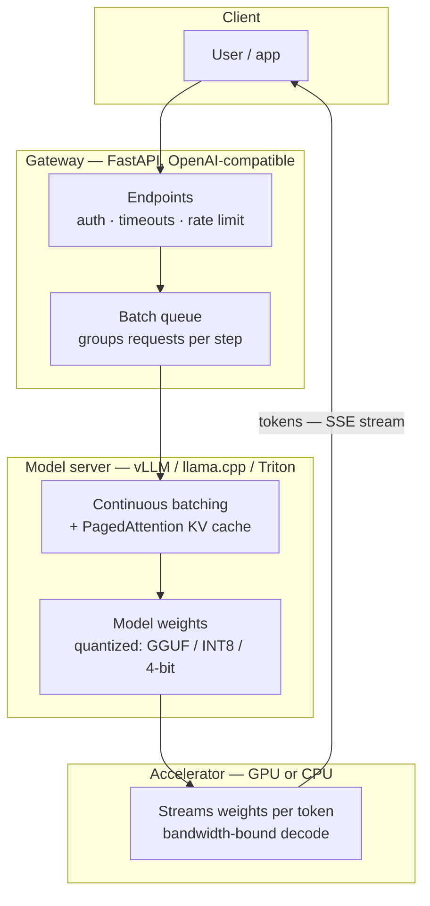

# Module 28 — AI Infrastructure

<small>Stage 10 · Expert Mastery · ~3 weeks at 4 h/day · Prerequisites — M22 (the napkin law and the atlas — this module is its career), M26 (the inference loop), M27 (evals guard every shortcut), M16/M19/M20 (containers, cluster, Helm — the stage), M24/M25 (a hardened, watched tenant). Opens Stage 10.</small>

## Why this matters

**AI infrastructure** is the systems engineering that turns model weights into a **service**: acquiring
and verifying models (the supply chain), shrinking them to fit real hardware (**quantization**),
executing inference efficiently (**batching** and **KV-cache** management), exposing them behind APIs
(**model servers**), scheduling them onto accelerators (**GPU scheduling** on Kubernetes), and operating
the result (latency SLOs, throughput economics, incident response). Its two ruling numbers are latencies
users feel — **TTFT** (time to first token) and **tokens/s** (the decode stream, M22's napkin law now a
product metric) — and its central trade is one sentence: **throughput is bought with batching; latency
is what pays.**

You can train and evaluate a model (M27). This module answers the question every AI product lives or
dies on: can you **serve** it — at a latency users accept, a throughput that pays for the silicon, on
infrastructure you control? Nothing here is new territory: it is **your** stack with a new tenant. The
container discipline (M16), the cluster (M19–20), the Fortress (M24), the Watchtower (M25) — the model
lands on all of it. What **is** new is the workload's shape: a memory-bandwidth-bound, stateful (the KV
cache), bursty, expensive-per-request service unlike anything you have operated — the final boss of the
curriculum's operations arc.

!!! info "What this unlocks"
    This is the module where the whole curriculum **reports for duty**. **M1**'s virtual memory returns as
    **PagedAttention** (the KV cache paged in blocks). **M14**'s retry discipline is the only thing standing
    between you and the queue **death spiral**. **M16**'s digests guard the model's provenance; **M19–20**
    schedule the silicon and roll it out; **M22**'s napkin law turns out to have been the business plan all
    along. **M29** then gives this service hands (agentic access, MCP) and a voice (the recorded teach-back),
    and the **final gate** closes there. Build the stage now; M29 seals it.

---

## Watch

*Watch once, then rely on the notes below — you should never need to rewatch.*

<div class="lo-video-placeholder" markdown="1">
<span class="lo-play">▶</span>
**Explainer video — coming**
<small>Record per <code>../media/README.md</code>, upload to YouTube, then replace this card with the embed.</small>
</div>

??? note "For the author — drop-in YouTube embed (replace VIDEO_ID)"
    Once the explainer is on YouTube, replace the placeholder card above with:
    ```html
    <div class="lo-video-embed">
      <iframe src="https://www.youtube-nocookie.com/embed/VIDEO_ID"
              title="Module 28 — AI Infrastructure"
              allow="accelerometer; autoplay; clipboard-write; encrypted-media; gyroscope; picture-in-picture"
              allowfullscreen></iframe>
    </div>
    ```
    Video script beats (from the blueprint's Definition / Analogy / Misconceptions):
    the restaurant with one extraordinary chef (the GPU) → a lone diner leaves the chef idle (batch-of-one
    wastes the silicon) → seat many tables, interleave courses (continuous batching — throughput up, each
    table waits a little longer) → the order ticket every table holds is the KV cache (success eats memory) →
    TTFT is the appetizer clock, tokens/s is the course rhythm → quantization is the prix-fixe menu (fewer
    bits, nearly the same taste — **if** the food critic/your eval agrees) → the supply chain: no ingredients
    from an unmarked truck (pickle files) → close on the law: **throughput is bought with batching; latency
    pays** — and the spiral's one-sentence warning.

**Terminal cast — pending; record per `../media/README.md`.**

!!! tip "Follow along, don't just watch"
    Open the [Guided Lab](#guided-lab-a-cpu-inference-gateway) in a browser terminal and **build the gateway
    yourself** — write the endpoints, run the server, curl it, then watch dynamic batching change the
    throughput number in front of you. Every idea here is a number you can measure on a plain CPU; a real GPU
    just lives on the same curves, larger. Typing beats watching, and it is part of how the memory forms.

---

## Key Notes

*Standalone. This is the reference you keep.*

### The picture: a request's journey through the stack



A request enters a **gateway** (the thing you build in the lab), waits briefly in a **queue** so it can
be **batched** with its neighbours, is executed by a **model server** that manages the KV cache, and is
computed on an **accelerator** that streams the weights. The tokens stream back the way they came (SSE —
M14 recognises the wire). The whole module is about making that path fast **and** cheap **and**
survivable under load.

### The serving equation — "does it fit?" is three questions

> **VRAM = weights (params × bytes) + KV cache (batch × context × layers × heads × dims × 2) + overhead.**

- **Weights** are fixed at load (parameters × bytes-per-parameter, set by precision).
- **The KV cache is the surprise ledger** — per token of context, per sequence in the batch, layers ×
  heads × dims accumulate (the ×2 is **K and V** — forget it and your arithmetic is half right). It
  scales with **usage**: more users and longer contexts eat VRAM faster than weights do. **Success is the
  tax.**
- **Overhead** is activations, buffers, and fragmentation.

The equation decides batch size, context limits, and which model fits at all. "It fits" computed at rest
(weights + overhead) is not "it fits" under load — the second term grows with your users.

### The two latencies — name them separately

| Latency | Phase | Bound by | User feels | A lever |
|---|---|---|---|---|
| **TTFT** (time to first token) | **Prefill** — whole prompt processed in parallel | **Compute** (scales with prompt length) | "Is it thinking?" (responsiveness) | Shorten the prompt · offload more layers · prefix caching |
| **Tokens/s** (inter-token) | **Decode** — autoregressive, one token per weight-stream | **Memory bandwidth** (the napkin law) | Reading speed | Quantize · faster memory · bigger batch (aggregate) |

Users feel both differently, so **SLOs name them separately**. "It thinks forever, then types fine" is a
TTFT/prefill problem, not a decode one.

### Batching — the economics engine

One sequence decoding leaves the GPU starving: the entire weight stream is paid to produce **one**
token's worth of math (bandwidth-bound). **Batching** amortises that stream across sequences — N next
tokens per stream instead of one. **Continuous batching** (vLLM's insight) lets sequences join and leave
the running batch **per decode step** instead of waiting for the slowest member — utilisation without
head-of-line blocking. The law, journaled with your own numbers: **throughput is bought with batching;
latency pays** (each user's tokens/s dips as the batch grows). The **knee** is where aggregate gains
flatten while per-user latency dives — you find it by **measurement**, then set the operating point from
the SLO.

### Quantization — the access technology

Store weights in fewer bits and you stream fewer bytes per token — the napkin law says decode speeds up
**almost proportionally** — at a **quality cost that must be measured, not vibed** (M27 guards M28: the
honest sentence is "4-bit passed my 20-task eval; 2-bit broke extraction").

| Precision | Bytes/param | VRAM vs FP16 | Decode (napkin) | Quality — the rule |
|---|---|---|---|---|
| **FP16 / BF16** | 2 | 1× | 1× (baseline) | The reference the others are judged against |
| **INT8** | 1 | ~½ | ~2× | Usually near-lossless — **still eval it** |
| **4-bit** (GGUF Q4, AWQ, GPTQ) | ~0.5 | ~¼ | ~4× | The workhorse tier — measure the delta on **your** eval |
| **2-bit-class** (aggressive) | ~0.25 | ~⅛ | ~8× | Fast and small; breaks reasoning/extraction first — **prove it passes** |

The ladder: try the **smallest quant that passes your eval**. GGUF is the local-inference format;
perplexity is the field's metric, but a small fixed task-eval is the honest home-scale version.

### PagedAttention — the OS lesson returns (M1's homecoming)

Naïve KV allocation reserves a contiguous block per sequence at **max** length → internal fragmentation
wastes most of it. Paging the cache in **fixed blocks** mapped through a block table — **M1's virtual
memory, verbatim** — recovers the waste, enabling bigger effective batches and the **2–4×** throughput.
The curriculum's full-circle moment: Module 1's concept saves Module 28's GPU dollars. (Say it out loud
during the lab: *this is virtual memory.*)

### The serving tiers and the wire protocol

| Framework | Tier | Batching | Best when |
|---|---|---|---|
| **llama.cpp** | Local / edge | Modest (parallel slots) | Home benches, laptops, single-user tools, CPU-only truth (GGUF) |
| **vLLM** | Throughput | Continuous + PagedAttention | A real GPU serving many users; utilisation is money |
| **NVIDIA Triton / TGI** | Dedicated server | Dynamic batching | Multi-model, versioned production fleets |
| **Ray Serve** | Orchestration | Framework-agnostic | Composing models/pipelines across a cluster; Python-native scaling |
| **KServe** | Kubernetes-native | Via the backend | Model serving as a K8s CRD — autoscaling, canaries, standardised |
| **Managed API** | Someone else's fleet | Theirs | The make-vs-buy boundary — priced with the napkin, not fashion |

They (mostly) speak the **OpenAI-compatible API** — the wire-protocol lingua franca. Your clients don't
care which tier answers, so tiers are **swappable**: the same client scripts run unchanged across
engines. That is the whole point of the protocol.

### GPUs on Kubernetes, and operating the tenant

The **device plugin** advertises `nvidia.com/gpu` as a schedulable resource; pods **request** whole GPUs
(limits), the scheduler places them, the container toolkit maps the devices in. **A GPU pod is a pod** —
every M19–20 habit transfers (a Pending GPU pod is read the same way: `describe pod` reads the
scheduler's own explanation). Then the Watchtower (M25) takes the tenant: TTFT and tokens/s as
histograms (the two SLOs separately), GPU saturation and VRAM as first-class series, queue depth, KV-cache
utilisation — alerts by the M25 law (symptom: *TTFT SLO burn*, not "GPU is hot"), each runbooked at
birth. And **cost per million tokens** computed for your bench (watts × time ÷ tokens vs an API's price)
— the economics made personal.

### The supply chain — a model file is a program

Weights are artifacts: provenance (who trained it, on what — the card, M27), licenses (real
constraints), integrity (hashes, pinned revisions — M16's digest law), and **format security**.
Pickle-based files **execute code on load** (downloading weights was running strangers' code — RCE by
`.bin`); **safetensors** exists because of it — data only, hash-friendly, mmap-friendly. The gate:
**hash + safetensors-or-quarantine + license + card**, before any loader touches it. M24's supply-chain
posture applies verbatim to weights.

<div class="lo-remember" markdown="1">
**Must remember (if you keep only six things):**

1. **The serving equation has three terms** — weights + **KV cache** + overhead — and the middle one
   **scales with usage** (batch × context). "It fits" at rest is not "it fits" under load.
2. **Two latencies, named separately:** **TTFT** (prefill, compute-bound, "is it thinking?") and
   **tokens/s** (decode, bandwidth-bound, reading speed).
3. **Throughput is bought with batching; latency pays.** Find the **knee** by measurement; set the
   operating point from the SLO.
4. **Quantization is measured access** — fewer bytes → ~proportionally faster decode — adopted only when
   it **passes your eval** (M27 guards M28).
5. **PagedAttention is M1's virtual memory**; the **death spiral** is M14's retry amplification. Old
   ideas, new workload.
6. **A model file is a program until proven otherwise** — hash, format-check (safetensors), read the
   license, quarantine pickle.
</div>

---

## Guided Lab: a CPU inference gateway

*Basic, step-by-step. You build a **FastAPI inference gateway** that serves a tiny CPU "model", add
`/healthz` and `/predict`, run it with uvicorn, then add **dynamic batching** and measure throughput vs
latency — the batching law with your own numbers. Everything runs on a plain CPU; no GPU required.*

<div class="lo-lab-actions" markdown="1">
[▶ Open interactive lab](https://killercoda.com/learning-os/course/killercoda/module-28){ .lo-btn target=_blank }
[⧉ Open in Codespaces](https://codespaces.new/randaguiac20/learning-os){ .lo-btn target=_blank }
[⌨ Run locally](#run-locally){ .lo-btn .lo-btn--ghost }
[View lab source](https://github.com/randaguiac20/learning-os/tree/main/killercoda/module-28){ .lo-btn .lo-btn--ghost target=_blank }
</div>

<span id="run-locally"></span>
!!! tip "Three ways to run this lab — pick any (all free)"
    - **Instant, no account** — click **Open interactive lab** (Killercoda): a Linux terminal in your browser.
    - **Your own cloud** — click **Open in Codespaces**: runs in your GitHub account's free tier (120 core-hrs/mo).
    - **Local, unlimited, $0** — any Linux / macOS / WSL terminal, or a throwaway container: `docker run -it ubuntu bash`, then follow the steps below.

    Killercoda is the zero-setup on-ramp; Codespaces and local use *your own* free resources, so they scale to any class size.

!!! note "No GPU here — and that is the point"
    Killercoda has no GPU, so this lab serves a **tiny deterministic CPU "model"** (`y = 2x + 1`). Every
    mechanism you need — an OpenAI-style gateway, a health check, a batch **queue**, the throughput-vs-latency
    trade — is real and measurable on CPU. The forward pass carries a small **fixed cost paid once per batch**
    (standing in for the weight stream a GPU pays), so batching amortises it exactly as it does on real
    silicon. When you have a GPU, swap the toy model for **llama.cpp** (CPU/GPU, GGUF) or **vLLM** (CUDA,
    continuous batching) behind the *same* endpoints — the client scripts don't change. Real GPU / cloud spot
    GPU serving is the "run locally with a GPU" path (and M37's cloud-GPU economics).

=== "1 · Install the serving deps"
    ```bash
    apt-get update -qq && apt-get install -y python3-pip
    ```
    ```bash
    pip install fastapi uvicorn 2>/dev/null || pip install --break-system-packages fastapi uvicorn
    ```
    FastAPI is your **gateway** framework; uvicorn is the ASGI server that runs it. No GPU libraries — the
    model is a plain Python function, so the whole stack is a few hundred KB. Make a project directory:
    ```bash
    mkdir -p ~/ai-serve && cd ~/ai-serve
    ```

=== "2 · Build the gateway (model + `/healthz` + `/predict`)"
    Write the tiny model and a two-endpoint gateway:
    ```bash
    cat > ~/ai-serve/app.py <<'PY'
    from fastapi import FastAPI
    from pydantic import BaseModel

    app = FastAPI()

    # The tiny deterministic "model": y = 2x + 1 (weights are fixed at load).
    def forward_one(x: float) -> float:
        return 2.0 * x + 1.0

    class PredictIn(BaseModel):
        x: float

    @app.get("/healthz")          # liveness — the M25 dead-man's check
    def healthz():
        return {"status": "ok"}

    @app.post("/predict")         # the inference endpoint
    def predict(req: PredictIn):
        return {"y": forward_one(req.x)}
    PY
    ```
    Start it in the background and give it a moment:
    ```bash
    cd ~/ai-serve && nohup uvicorn app:app --host 0.0.0.0 --port 8000 >/tmp/uvicorn.log 2>&1 & sleep 3
    ```
    `/healthz` is your liveness probe; `/predict` is the service. The gateway is where auth, timeouts, and
    rate limits would live in production — the front door to every model server behind it.

=== "3 · Hit it with curl"
    Ask if it's alive, then send a known input and check the answer:
    ```bash
    curl -s http://localhost:8000/healthz
    ```
    ```bash
    curl -s -X POST http://localhost:8000/predict \
      -H 'content-type: application/json' -d '{"x": 10}'
    ```
    For `x = 10` the model must return `y = 21` (`2·10 + 1`). If `/healthz` says `{"status":"ok"}` and
    `/predict` returns `{"y":21.0}`, your gateway serves. (Check `/tmp/uvicorn.log` if curl can't connect —
    the server may still be starting.)

    Click **Check** to verify the server answers `/healthz` and returns the correct prediction.

=== "4 · Add dynamic batching, then measure"
    Now the module's whole point. Replace the app with one that also exposes `/predict_batched`, fed by a
    **queue** and a background **batcher** that groups requests and runs them as **one** forward pass —
    amortising the fixed cost. A single `accel_lock` models the one shared accelerator both paths compete for:
    ```bash
    cat > ~/ai-serve/app.py <<'PY'
    import asyncio, time
    from fastapi import FastAPI
    from pydantic import BaseModel

    app = FastAPI()

    FIXED = 0.05      # seconds paid ONCE per forward (the weight stream)
    PER_ITEM = 0.002  # cheap per-item math
    MAX_BATCH = 16
    MAX_WAIT = 0.02   # batch window: 20 ms

    accel_lock = asyncio.Lock()   # the single "accelerator" — one forward at a time

    async def forward(xs):
        async with accel_lock:                       # a batch of any size = ONE weight stream
            await asyncio.sleep(FIXED + PER_ITEM * len(xs))
        return [2.0 * x + 1.0 for x in xs]

    class PredictIn(BaseModel):
        x: float

    queue: asyncio.Queue = asyncio.Queue()

    async def batcher():
        while True:
            x, fut = await queue.get()
            batch = [(x, fut)]
            deadline = time.monotonic() + MAX_WAIT
            while len(batch) < MAX_BATCH:
                timeout = deadline - time.monotonic()
                if timeout <= 0:
                    break
                try:
                    batch.append(await asyncio.wait_for(queue.get(), timeout))
                except asyncio.TimeoutError:
                    break
            ys = await forward([b[0] for b in batch])   # one forward for the whole group
            for (_, fut), y in zip(batch, ys):
                fut.set_result(y)

    @app.on_event("startup")
    async def _start():
        asyncio.create_task(batcher())

    @app.get("/healthz")
    def healthz():
        return {"status": "ok"}

    @app.post("/predict")                 # naive: one forward per request
    async def predict(req: PredictIn):
        y = (await forward([req.x]))[0]
        return {"y": y}

    @app.post("/predict_batched")         # dynamic batching via the queue
    async def predict_batched(req: PredictIn):
        fut = asyncio.get_event_loop().create_future()
        await queue.put((req.x, fut))
        return {"y": await fut}
    PY
    ```
    Restart the server on the new app:
    ```bash
    pkill -f "uvicorn app:app" 2>/dev/null; sleep 1
    cd ~/ai-serve && nohup uvicorn app:app --host 0.0.0.0 --port 8000 >/tmp/uvicorn.log 2>&1 & sleep 3
    ```
    Now a benchmark (stdlib only) fires **64 concurrent** requests at each endpoint, measuring throughput and
    average latency, and writes the result:
    ```bash
    cat > ~/ai-serve/bench.py <<'PY'
    import json, time, urllib.request
    from concurrent.futures import ThreadPoolExecutor

    BASE, N, CONC = "http://localhost:8000", 64, 64

    def one(path, x):
        data = json.dumps({"x": x}).encode()
        req = urllib.request.Request(BASE + path, data=data,
                                     headers={"content-type": "application/json"})
        t0 = time.time()
        with urllib.request.urlopen(req) as r:
            r.read()
        return time.time() - t0

    def run(path):
        t0 = time.time()
        with ThreadPoolExecutor(max_workers=CONC) as ex:
            lats = list(ex.map(lambda i: one(path, i), range(N)))
        wall = time.time() - t0
        return {"throughput": N / wall, "avg_latency": sum(lats) / len(lats)}

    out = {"requests": N, "concurrency": CONC,
           "naive": run("/predict"), "batched": run("/predict_batched")}
    json.dump(out, open("results.json", "w"), indent=2)
    print(f"naive   : {out['naive']['throughput']:6.1f} req/s | "
          f"avg latency {out['naive']['avg_latency']*1000:6.1f} ms")
    print(f"batched : {out['batched']['throughput']:6.1f} req/s | "
          f"avg latency {out['batched']['avg_latency']*1000:6.1f} ms")
    print(f"speedup : {out['batched']['throughput']/out['naive']['throughput']:.1f}x throughput")
    PY
    cd ~/ai-serve && python3 bench.py
    ```
    Read the two lines. **Naive** serialises 64 forwards on the one accelerator (each pays the fixed cost);
    **batched** groups them into ~4 forwards of 16, paying the fixed cost a quarter as often — several times
    the throughput. That is the law on your screen: **throughput bought with batching**. (At *low* load the
    batch window *adds* latency — that is what "latency pays" means; the win shows when the accelerator is
    contended.)

    Click **Check** to verify the results file exists and batched beat naive on throughput.

=== "5 · The real-GPU path (framing)"
    Your gateway, queue, and batcher are the exact shapes vLLM and Triton implement — in CUDA, at token
    granularity, with **PagedAttention** managing the KV cache:
    ```bash
    echo "Local GPU tier : llama.cpp -m model.gguf --server   (GGUF, CPU+GPU hybrid)"
    echo "Throughput tier: vllm serve <model>                 (CUDA, continuous batching)"
    echo "Same wire      : both speak the OpenAI-compatible API — your client scripts DON'T change"
    ```
    On a GPU box, swap `forward()` for a real model server behind the same `/predict` — the benchmark runs
    unchanged (the wire protocol's whole value). The batch window becomes **continuous batching** (sequences
    join per decode step); the fixed cost becomes the real weight stream; the knee moves right. Cloud spot
    GPUs make this cheap on demand — the "run locally with a GPU / M37 cloud-GPU" path.

!!! success "You can stop here and have learned something real"
    If you built a gateway, served a health check and a prediction, added a batch queue, and **watched
    batching raise throughput with your own measurement**, the guided lab is done. Now make it harder.

---

## Solo Lab: figure it out

*Harder. Goals only — minimal hand-holding. Extend the `~/ai-serve` gateway. Struggle here is the point;
reveal a hint only after you have tried.*

### Challenge 1 — Sweep the batch and find the knee
Run the benchmark at several concurrency levels (e.g. 1, 2, 4, 8, 16, 32, 64) and record, for the batched
endpoint, aggregate throughput **and** per-request latency. Where does aggregate stop climbing while
latency starts diving? Name the **knee**.

??? tip "Hint"
    Parametrise `CONC` (and matching `N`) in `bench.py`, loop over the values, and append one row per level to
    a file. Plot mentally: throughput flattens; latency rises. The knee is the elbow.

??? success "Solution"
    ```bash
    for c in 1 2 4 8 16 32 64; do
      python3 - "$c" <<'PY'
    import sys, json, time, urllib.request
    from concurrent.futures import ThreadPoolExecutor
    c = int(sys.argv[1]); N = c
    def one(i):
        d = json.dumps({"x": i}).encode()
        r = urllib.request.Request("http://localhost:8000/predict_batched", data=d,
                                   headers={"content-type": "application/json"})
        t0 = time.time()
        with urllib.request.urlopen(r) as resp: resp.read()
        return time.time() - t0
    t0 = time.time()
    with ThreadPoolExecutor(max_workers=c) as ex:
        lats = list(ex.map(one, range(N)))
    wall = time.time() - t0
    print(f"conc={c:3d}  thru={N/wall:7.1f} req/s  avg_lat={sum(lats)/len(lats)*1000:7.1f} ms")
    PY
    done
    ```
    The knee sits near `MAX_BATCH`: below it, more concurrency fills the batch and throughput climbs almost
    free; above it, batches are already full, so extra requests only **wait** — throughput flattens, latency
    dives. **Throughput is bought with batching; latency pays** — measured, not asserted.

### Challenge 2 — Prove the KV/context cost with the equation
Without a GPU, compute the serving equation for a real model on paper. For an **8B** model at **FP16** on a
**24 GB** GPU (assume ~1 GB overhead): does it fit, and how much is left for the KV cache? Then at **4-bit**.
State what the leftover buys.

??? tip "Hint"
    Weights = params × bytes/param. FP16 = 2 bytes; 4-bit ≈ 0.5 bytes. VRAM − weights − overhead = KV budget.

??? success "Solution"
    FP16: `8B × 2 = 16 GB` weights; `24 − 16 − 1 ≈ 7 GB` for KV — a real but modest batch×context budget.
    4-bit: `8B × 0.5 = 4 GB`; `24 − 4 − 1 ≈ 19 GB` for KV — nearly **3×** the headroom. The lesson:
    **quantization buys batch (throughput), not just fit.** And never quote weights-only as "it fits" — the KV
    term is where success lives.

### Challenge 3 — Induce and defend the death spiral
Make the model slow (raise `FIXED`) and hammer the naive endpoint past saturation with short client
timeouts. Watch requests pile up. Then install one defence and re-test.

??? tip "Hint"
    A bounded queue that rejects fast (HTTP 503) beats an unbounded one that dies slow. Fail fast is mercy.

??? success "Solution"
    Past saturation, queue wait inflates TTFT past the client timeout; clients **retry**, adding load to an
    already-drowning server (M14's retry amplification) — the collapse feeds itself. Defences: **admission
    control** (a bounded queue + load shedding — a quick `503` beats a 90-second timeout) and **timeout/retry
    discipline** (server timeouts < client timeouts, backoff + jitter, retry budgets). Add a queue-size cap
    that returns `503` when full and the spiral flattens into honest refusals. **Raising limits feeds the
    spiral; bounding it is the fix.**

### Challenge 4 — Make it OpenAI-shaped
Add an endpoint that accepts the OpenAI-compatible shape (a `messages` list) and returns a compatible
response, so an off-the-shelf client could call your gateway unchanged. Why does this matter?

??? success "Solution"
    Map the last user message to your `forward()` and wrap the result in the `choices[0].message.content`
    shape. It matters because the **wire protocol is the swap point**: once your gateway speaks it, you can
    replace the toy model with llama.cpp or vLLM — or a managed API — and **no client changes**. The tier
    becomes an implementation detail; that is the whole reason the protocol won.

### Challenge 5 (stretch) — Compute cost per million tokens
Assume your bench draws 300 W and produces a measured 20 tokens/s. Electricity is ~$0.30/kWh. Compute cost
per million tokens, then compare to an API at $0.50/million. State the caveat that can flip it.

??? success "Solution"
    `300 W = 0.3 kW`; at 20 tok/s, one hour = 72,000 tokens for `0.3 kWh × $0.30 ≈ $0.09` → per million:
    `1,000,000 ÷ 72,000 × 0.09 ≈ $1.25/million` — the **API wins** on marginal cost here. The flip: **batching**
    pushes aggregate tok/s 5–10× (the knee), dropping your cost to ~$0.25/million — now cheaper — and owned
    hardware is sunk cost while API spend scales linearly forever. **Compute both numbers for your load shape;
    fashion decides nothing.**

---

## Self-Check

*Close the notes. Answer aloud or in writing **first**, then reveal. Recalling — even when it's hard — is
what builds the memory.*

??? question "State the serving equation's three terms, and what makes the second one dangerous."
    `VRAM = weights (params × bytes) + KV cache (batch × context × layers × heads × dims × 2) + overhead`.
    The **KV cache** is dangerous because it scales with **usage** — batch size and context length grow with
    success — so more users and longer contexts consume it; weights are fixed. Success is the tax.

??? question "TTFT vs tokens/s — phase, bound resource, and what the user feels for each?"
    **TTFT** = time to first token — the **prefill** phase (whole prompt in parallel), **compute-bound**,
    scales with prompt length; the user feels **responsiveness** ("is it thinking?"). **Tokens/s** = the
    **decode** stream — autoregressive, **memory-bandwidth-bound** (the napkin law); the user feels **reading
    speed**.

??? question "Why does batching buy throughput, and what exactly pays?"
    In decode the entire weight stream is paid to produce one token's math — the arithmetic units starve
    (bandwidth-bound). Batching serves **N** sequences' next tokens per stream, so aggregate throughput
    multiplies. What pays: **each user's inter-token latency grows** as the batch grows; the **knee** is where
    aggregate gains flatten while per-user latency dives — a measured trade, never free.

??? question "PagedAttention in one line — the borrowed idea, and the win."
    The KV cache is paged in **fixed blocks** mapped through a block table — **M1's virtual memory** — instead
    of reserving a contiguous max-length block per sequence. Fragmentation is recovered → bigger effective
    batches → **2–4×** throughput.

??? question "Why is a pickle-era model file a security problem, and what does safetensors change?"
    Pickle **executes embedded code on load** — a model file is a **program**, so downloading weights ran
    strangers' code (RCE by `.bin`). **safetensors** stores tensor data + metadata only (no code paths on
    load), making weights **data** again — plus hash- and mmap-friendly. The gate: format + provenance decide
    whether a file may touch a loader.

??? question "The service passes at 5 req/s but collapses at 7 with timeouts cascading. Name the pattern and two defenses."
    The **queue death spiral**: past saturation, queue wait inflates TTFT past client timeouts; clients retry,
    adding load to a saturated server (M14's retry amplification) — the collapse feeds itself. Defences:
    **admission control** (bounded queue + fast load shedding — a quick `503` beats a slow death) and
    **timeout/retry discipline** (server timeouts < client, backoff + jitter, retry budgets).

??? question "When is the honest answer 'don't self-host — use the API'?"
    (1) **Capability gap** — the task needs a frontier model that doesn't fit your silicon at acceptable
    quality (the eval says so). (2) **Load shape** — spiky/low-volume traffic where the per-million arithmetic
    plus your pager cost favours the API, and no privacy/control constraint outweighs it. Both are engineering
    verdicts from **measurements** (eval + cost), written in the dossier.

!!! example "Teach it back (the real test)"
    Out loud, in **5 minutes, no notes**: *"One chef, many tables."* Build the restaurant piece by piece —
    the chef (weights/GPU), the tables (batch), the order tickets (KV cache), the knee, the polite bounce at
    capacity — show **one real artifact** (your knee plot or the bench output), and land the law: **throughput
    is bought with batching; latency pays**, plus the spiral's one-sentence warning. The listener must be able
    to predict what happens to per-user speed when the tables double, and why a full room must bounce new
    tables **quickly**. If you can't yet, that's your signal to reread the Key Notes, not to move on.

---

## Mastery checklist

*Tick these honestly, cold (no notes). They **gate** progress — passing M28 stands the capstone's stage;
M29 gives it hands and a voice, and the final gate closes there. A module is only "done" when every box is
true.*

- [ ] **Define** the serving equation and flag its usage-scaling (KV) term.
- [ ] **Explain** the two latencies (phase, bound, feel, levers) with your bench's numbers.
- [ ] **List** the supply-chain gate's checks (hash / safetensors / license / card) and the pickle mechanism they answer.
- [ ] **Describe** continuous batching and PagedAttention — the M1 homecoming named out loud.
- [ ] **Identify** the batching knee on a real sweep and derive SLOs from it.
- [ ] **Build** a gateway end to end: `/healthz`, `/predict`, a batch queue, measured throughput vs latency.
- [ ] **Implement** the OpenAI-compatible protocol shape so a client runs unchanged across backends.
- [ ] **Demonstrate** the quant ladder with eval-adjudicated verdicts (M27 guards M28).
- [ ] **Apply** GPU scheduling reasoning on K8s (device plugin, resource requests, the Pending diagnosis).
- [ ] **Analyze** cost per million tokens both directions (bench vs API) with the caveats that flip it.
- [ ] **Troubleshoot** the death spiral live: induce, narrate (queue → TTFT → timeouts → retries), recover with defenses.
- [ ] **Design** the SLO + lawful alert set for a serving workload (TTFT burn pages; saturation tickets).
- [ ] **Assess** the service with M24's four questions and name the prompt-injection posture for the RAG path.
- [ ] **Connect** the convergence: M1's paging, M14's retries, M16's digests, M22's napkin — all reporting for duty here.

---

## Review — lock it in

Spaced repetition is not optional; it's where the memory actually forms. Interleaving stays active — every
M28 review also pulls one **M22** (the napkin) or **M26/M27** item, and the serving equation joins the
napkin in permanent rotation. Schedule these and *keep* them:

| When | Do | Interleaved prior-module item |
|---|---|---|
| **Day 1** | Equation sprint (3 terms + the danger) · latency sprint (TTFT vs tokens/s) · flashcards | **M22:** the napkin law recited (tokens/s ≈ bandwidth ÷ model bytes) |
| **Day 3** | `bench.py` re-run — batched vs naive throughput vs today's numbers (drift?) · gate sprint | **M27:** one quant level re-scored blind on the fixed eval |
| **Day 7** | The serving equation cold on a **new** model size · the model-update procedure with its rollback step | **M26:** the prefill/decode split narrated |
| **Day 14** | The knee re-found live (sweep, plot, name it) · the spiral induced and recovered | **M25:** one alert defended as lawful (symptom, actionable, runbooked) |
| **Day 30** | Validation retake ≥90% · cost-per-million re-computed with current numbers | **M22:** the atlas's serving chapter re-read |

**Connects forward to:** **M29 (Agentic automation)** — this service becomes a **tool**: MCP exposes it,
agents call it, the injection posture (retrieved text as untrusted input) completes, and the capstone is
**sealed** with the recorded teach-back. Beyond: multi-GPU serving, speculative decoding, LoRA serving
(many adapters, one base), inference platforms as a career.

!!! quote "The one-sentence takeaway"
    AI infrastructure is the curriculum's final convergence — the OS's paging saves the GPU's memory, the
    network's retry discipline prevents the queue's collapse, the container's digests guard the model's
    provenance, the cluster schedules the silicon — and the napkin law, scribbled in Module 22, turns out to
    have been the business plan all along.
