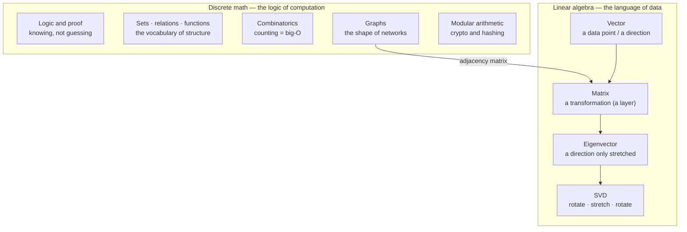

# Module 30 — Discrete Math & Linear Algebra

<small>Stage 11 · Math & CS Foundations · ~3 weeks at 4 h/day · Prerequisites — M13 (Python — numpy is the lab bench), M1 (binary and logic gates — logic's hardware), high-school algebra. Generated in Stage 11; studied between Stage 4 and Stage 10 — it retro-fits the math M22/M26/M27 assumed.</small>

## Why this matters

Two branches of mathematics, one purpose — to make computation and data **rigorous** (provably correct,
not merely tested). **Discrete mathematics** studies countable, separate structures — integers, sets,
graphs, logical statements — the mathematics of things a computer can actually represent. It gives you
**proof** (knowing something is true, not just testing it), **counting** (how many operations, how fast —
the root of big-O), and **structure** (graphs and relations — the shape of data and networks). **Linear
algebra** studies **vectors** (lists of numbers that name a point or a direction in space) and the
**linear transformations** between them — and since a dataset is a matrix, a model's weights are matrices,
and an **embedding** (a piece of data turned into a vector, M26) is a vector, it is quite literally the
language every AI system is written in.

You have been reading this language **phonetically** since Module 22 (multiplying matrices you didn't
name) and Module 26 (following gradients across a graph). M26 built backprop bare-hands but leaned on a
chain rule "revived gently"; M27 ran PCA without saying **eigenvector**; M22's napkin law multiplied
without eigenvalues in sight. That worked because the *concepts* carried the load — but an AI **engineer**
(not just a user) owns the mathematics underneath, or the ceiling is low: you can't read the attention
paper's linear algebra, reason about why a covariance matrix's eigenvectors are the principal components,
prove an algorithm's complexity, or model a network as a graph. This module teaches both at
**intuition-plus-mechanism** depth: enough to read the papers, size the models, and never be bluffed by a
Greek letter.

!!! info "What this unlocks"
    This module is the **retroactive foundation** the AI stage assumed and the base the CS/data stages
    stand on. **M1**'s logic gates return as Boolean algebra (truth tables, formalized). **M8**'s git
    history and **M15**'s systemd dependencies are **graphs** (specifically **DAGs**). **M22**'s matmul
    and **M26**'s "a layer" become the same thing — *a matrix is a transformation*. **M26**'s embedding
    similarity is a **dot product**; **M27**'s PCA is **eigenvectors of the covariance matrix**; **M24**'s
    TLS keys rest on **modular arithmetic**. It is the on-ramp to **M31** (the continuous half — calculus,
    probability, statistics) and **M32** (data structures & algorithms — big-O, graphs, hashing all come
    from here). Its job is to make the mathematics of every later module **readable**.

---

## Watch

*Watch once, then rely on the notes below — you should never need to rewatch.*

<div class="lo-video-placeholder" markdown="1">
<span class="lo-play">▶</span>
**Explainer video — coming**
<small>Record per <code>../media/README.md</code>, upload to YouTube, then replace this card with the embed.</small>
</div>

??? note "For the author — drop-in YouTube embed (replace VIDEO_ID)"
    Once the explainer is on YouTube, replace the placeholder card above with:
    ```html
    <div class="lo-video-embed">
      <iframe src="https://www.youtube-nocookie.com/embed/VIDEO_ID"
              title="Module 30 — Discrete Math & Linear Algebra"
              allow="accelerometer; autoplay; clipboard-write; encrypted-media; gyroscope; picture-in-picture"
              allowfullscreen></iframe>
    </div>
    ```
    Video script beats (from the blueprint's Analogy / Visual Model / Misconceptions):
    the two languages AI is written in — discrete math is the **grammar** (rules of valid reasoning,
    counting words, how sentences connect), linear algebra is the **vocabulary** (nouns = vectors, verbs =
    matrices, idioms = eigenvectors) → you've read it phonetically since M22/M26 → a 2×2 matrix applied to
    the unit square (rotate/scale/shear — "a matrix is a verb") → the eigenvector, the one direction it
    doesn't turn → the bridge: a graph written as an **adjacency matrix** (discrete meets linear) → close
    on proof vs testing (M27): testing shows a bug exists, proof shows one never can.

**Terminal cast — pending; record per `../media/README.md`.**

!!! tip "Follow along, don't just watch"
    Open the [Guided Lab](#guided-lab-the-numpy-bench) in a browser terminal and run each cell yourself as
    it appears. In this module the rule is **predict → compute → reconcile** (M21's ritual): say what the
    number should be *before* numpy prints it. Never trust a hand-calc you didn't machine-check.

---

## Key Notes

*Standalone. This is the reference you keep.*

### The picture: two languages, one bridge



**Discrete** for the algorithms and structure; **linear algebra** for the data and models. The two meet
at the **adjacency matrix** — a graph (discrete) written as a matrix (linear algebra). Modern AI needs
both.

### Discrete math — the logic of computation

**Logic & proof.** A **proposition** is a statement that is either true or false. **Connectives** combine
them: `∧` (and), `∨` (or), `¬` (not), `→` (implies), `↔` (if-and-only-if). **Quantifiers** range over
collections: `∀` (for all), `∃` (there exists). A **truth table** lists every input combination and the
result — these *are* M1's logic gates, formalized. The one that surprises everyone: **`P → Q`** ("if P
then Q") is false **only** when `P` is true and `Q` is false.

A **proof** is an argument that a claim holds for **every** case, not just the ones you tried. Four
methods, one per shape of claim:

| Method | Skeleton | Use when |
|---|---|---|
| **Direct** | assume `P`, derive `Q` | "if P then Q" follows straightforwardly (e.g. n even ⟹ n² even) |
| **Contrapositive** | prove `¬Q → ¬P` (logically identical) | the negation is easier (n² odd ⟹ n odd) |
| **Contradiction** | assume the opposite, reach an absurdity | "there is no…" claims (√2 is irrational; no largest prime) |
| **Induction** | prove a **base case**, then that `P(k) → P(k+1)` | "for all n" — the domino chain |

**The insight that pays for the whole module: induction ≈ recursion.** Induction's base case *is*
recursion's stopping condition; induction's step (assume `P(k)`, prove `P(k+1)`) *is* the recursive call
trusting the smaller result and combining. Writing `sum(n) = n + sum(n−1)` with `sum(0) = 0` in Python (M13)
**is** the induction proof of `1+2+…+n = n(n+1)/2`, in code. Proof is the point: it's how you **KNOW**,
versus M27's testing (how you gain **evidence**) — testing can show a bug exists but never that none does.

**Sets, relations, functions** — the vocabulary of everything. A **set** is an unordered collection;
operations are union (`∪`), intersection (`∩`), complement. A **relation** links elements and can be
**reflexive / symmetric / transitive** (all three = an **equivalence relation**, which partitions a set —
e.g. "same remainder mod 3" splits the integers into three classes). A **function** is a special relation:
**injective** (one-to-one — no two inputs share an output), **surjective** (onto — every output is hit),
**bijective** (both). The punchline: a **hash function** (maps a key to a bucket, M32) is a *non-injective*
function — which is exactly **why collisions exist**.

**Combinatorics (counting) → big-O.** The **sum rule** (either/or → add) and **product rule** (this-then-that
→ multiply); **permutations** (ordered arrangements) and **combinations** (`nCr` — unordered choices); the
**pigeonhole principle** (n items in m < n boxes ⟹ some box holds ≥ ⌈n/m⌉ — the `⌈ ⌉` is the ceiling, round
up). Counting **is** complexity: **big-O** (asymptotic notation — how the operation *count* grows with input
size `n`) is applied combinatorics, not a table to memorize.

| Class | Name | Grows like | Code shape |
|---|---|---|---|
| `O(1)` | constant | fixed, whatever `n` is | index one list element |
| `O(log n)` | logarithmic | +1 step each time `n` doubles | binary search |
| `O(n)` | linear | doubles when `n` doubles | one loop over the input |
| `O(n log n)` | linearithmic | a hair above linear | a good sort |
| `O(n²)` | quadratic | ×4 when `n` doubles | a loop inside a loop |
| `O(2ⁿ)` | exponential | doubles per **+1** input | try every subset — intractable fast |

**Graph theory** — the shape of everything. A **graph** is **vertices** (nodes) joined by **edges**;
edges can be **directed** (one-way), **undirected**, or **weighted** (carry a number). Key ideas: **degree**
(edges at a vertex), **path**, **cycle**, **tree** (connected, no cycles, `n` nodes ⟹ `n−1` edges), and a
**DAG** (**directed acyclic graph** — directed, no cycles). Euler abstracted Königsberg to a graph and
proved no walk crosses all seven bridges once (1736 — graph theory's birth: **structure**, not detail,
decides). The recognition tour: your git history is a DAG (M8), systemd dependencies are a graph (M15), a
network is a graph (M14), and **backprop runs on a DAG** (M26's computation graph).

**The bridge — adjacency matrix.** Write a graph as a square table where cell `[i][j] = 1` if there's an
edge `i → j`. For nodes A, B, C with edges A→B, A→C, B→C:

| from ＼ to | A | B | C |
|---|---|---|---|
| **A** | 0 | 1 | 1 |
| **B** | 0 | 0 | 1 |
| **C** | 0 | 0 | 0 |

Now the magic: **`Aⁿ[i][j]` = the number of length-`n` walks from `i` to `j`** — a discrete fact you verify
with matrix multiplication (linear algebra). The graph and the matrix are the same object in two languages.

**Number theory & modular arithmetic.** **Divisibility**, **primes** (divisible only by 1 and themselves),
**gcd** (greatest common divisor — Euclid's algorithm), and **modular arithmetic** ("clock math" — `a mod n`
is the remainder). Two payoffs: **crypto** (modular exponentiation is easy forward but its inverse — the
discrete logarithm — is believed **hard**, a one-way function; this asymmetry is what makes M24's TLS/RSA
keys work) and **hashing** (`mod` maps a hash to a bucket, M32).

### Linear algebra — the language of data

**Vectors — the atom of data.** A **vector** is a point / a direction / a list of numbers, all at once. Two
operations: **addition** (tip-to-tail) and **scalar multiplication** (a **scalar** is a plain number that
stretches the vector). The **dot product** `a·b = Σ aᵢbᵢ` (`Σ` = sum over the components) measures
**alignment**: large positive when they point the same way, zero when perpendicular, negative when opposed.
The **norm** `‖a‖` (the `‖ ‖` bars mean length/magnitude — `np.linalg.norm`) is the vector's length. Because
the dot product also scales with length, a long unrelated vector can score high; dividing it out gives
**cosine similarity** `a·b / (‖a‖‖b‖)` — pure directional similarity, which is why M26's embedding
similarity is cosine, not raw dot product.

**Matrices ARE transformations.** A **matrix** is a **function that transforms vectors linearly** — rotate,
scale, shear, project. **`A·x`** applies the transformation `A` to the vector `x`; the matrix's **columns
are where the basis vectors land**. **Matrix multiplication** `AB` is **composition** — "do `B`, then `A`" —
which is why **`AB ≠ BA`** in general (a rotation-then-shear lands somewhere different from a
shear-then-rotation). The **identity** `I` leaves everything unchanged; the **inverse** `A⁻¹` undoes `A`
(`A·A⁻¹ = I`, `np.linalg.inv`) — but only if `A` isn't **singular** (**determinant** ≈ 0, no inverse, it
squashes space flat). **A neural-network layer IS a matrix** (M26), and **matmul is the GPU's core op**
(M22) — the thing you multiplied without understanding now has geometric meaning.

> **A matrix is a verb — `A·x` moves the vector `x` through space; an eigenvector `v` is the one direction
> it only stretches, never rotates: `A·v = λ·v`.**

**Systems, rank, solvability.** **Gaussian elimination** solves a system of linear equations by hand
(`np.linalg.solve` in code). **Rank** is the number of **linearly independent** rows/columns — "how much
independent information the matrix carries." A system has **one** solution / **none** / **infinitely many**
depending on rank (geometrically: planes meeting at a point / nowhere / along a line). Rank ≈ 0 information
is the singular case from above — and the same idea PCA will exploit.

**Eigenvalues & eigenvectors.** An **eigenvector** is a direction the transformation **only stretches**,
never rotates; the **eigenvalue** `λ` (lambda) is the stretch factor: **`A·v = λ·v`** (`np.linalg.eig`).
They reveal a matrix's "essence." **PCA** (principal component analysis — M27's dimensionality reduction)
is exactly this: center the data, compute the **covariance matrix** (which encodes the spread/variance),
take **its eigenvectors** — those are the **principal components**, the directions of maximum variance —
and project onto the top ones. The eigenvalues *are* the variance captured. Same math runs **PageRank**
(the web's importance ranking is the link matrix's principal eigenvector) and **eigenfaces** (face
recognition on the top eigenvectors of a face-covariance matrix).

**Matrix factorization — SVD.** Decomposing a matrix into simpler pieces. **SVD** (singular value
decomposition) writes **any** matrix as **`A = UΣVᵀ`** — "any transformation = rotate (`Vᵀ`), stretch (`Σ`,
the diagonal of non-negative **singular values**), rotate (`U`)." It's the swiss army knife:
**compression** (keep the top-`k` singular values, drop the rest — quality vs `k`), **recommendation
systems**, and the low-rank math under embeddings and **LoRA** (low-rank adapters — M27's stretch).
SVD is more general than eigendecomposition (`A = QΛQ⁻¹`, square matrices only) because it factors *any*
rectangular map — which is why it powers real engineering.

<div class="lo-remember" markdown="1">
**Must remember (if you keep only six things):**

1. **Induction ≈ recursion.** Base case = stopping condition; inductive step = the recursive call. Proof
   gives **certainty** (all cases); testing gives **evidence** (sampled cases) — M27's bridge.
2. **Big-O comes from counting.** It's the answer to "how many operations as `n` grows?" — derive it, then
   measure it (M21). `O(1) < O(log n) < O(n) < O(n log n) < O(n²) < O(2ⁿ)`.
3. **A graph and its adjacency matrix are one object in two languages** — `Aⁿ[i][j]` counts length-`n`
   walks. This is where discrete meets linear.
4. **A matrix is a verb.** `A·x` transforms space; columns are where the basis vectors land; `AB ≠ BA`
   because composition order matters.
5. **Dot product = alignment; normalize → cosine similarity.** An embedding is a vector, "similar meanings
   are nearby" is a dot-product statement (M26).
6. **`A·v = λ·v` — the eigenvector is the direction only stretched.** PCA = eigenvectors of the covariance
   matrix; SVD = `UΣVᵀ` = rotate·stretch·rotate.
</div>

### Where you already met all of this

| Concept | Where it already appeared |
|---|---|
| Truth tables | **M1** — logic gates (Boolean algebra is the hardware) |
| DAGs | **M8** git history · **M15** systemd deps · **M26** backprop graph |
| matmul | **M22** the GPU's core op · **M26** a layer is a matrix |
| dot product | **M26** — embedding (cosine) similarity |
| modular arithmetic | **M24** crypto/keys · **M32** hashing |
| big-O | **M21** performance instincts · **M13/M23** the cost of code |

---

## Guided Lab: the numpy bench

*Basic, step-by-step. On a plain CPU you install numpy, then **verify every claim in code**: the dot
product as similarity, a matrix as a transformation with `A·A⁻¹ = I`, eigenvalues confirming `A·v = λ·v`, a
graph's adjacency matrix whose powers count walks, and a modular-arithmetic / combinatorics exercise. The
ritual is **predict → compute → reconcile** — say the answer before numpy prints it.*

<div class="lo-lab-actions" markdown="1">
[▶ Open interactive lab](https://killercoda.com/learning-os/course/killercoda/module-30){ .lo-btn target=_blank }
[⧉ Open in Codespaces](https://codespaces.new/randaguiac20/learning-os){ .lo-btn target=_blank }
[⌨ Run locally](#run-locally){ .lo-btn .lo-btn--ghost }
[View lab source](https://github.com/randaguiac20/learning-os/tree/main/killercoda/module-30){ .lo-btn .lo-btn--ghost target=_blank }
</div>

<span id="run-locally"></span>
!!! tip "Three ways to run this lab — pick any (all free)"
    - **Instant, no account** — click **Open interactive lab** (Killercoda): a Linux terminal in your browser.
    - **Your own cloud** — click **Open in Codespaces**: runs in your GitHub account's free tier (120 core-hrs/mo).
    - **Local, unlimited, $0** — any Linux / macOS / WSL terminal, or a throwaway container: `docker run -it ubuntu bash`, then follow the steps below.

    Killercoda is the zero-setup on-ramp; Codespaces and local use *your own* free resources, so they scale to any class size.

!!! note "CPU only — and that is enough"
    Every concept here — vectors, transformations, eigenvalues, adjacency-matrix walks, modular arithmetic —
    runs in **milliseconds on a plain CPU** with nothing but numpy. No GPU, no downloads. The linear algebra
    is identical to what a GPU does (M22); it's just smaller.

=== "1 · Set up the bench"
    ```bash
    apt-get update -qq && apt-get install -y python3-pip
    pip install numpy
    mkdir -p ~/math-lab && cd ~/math-lab
    python3 -c "import numpy; print('numpy', numpy.__version__)"
    ```
    A full linear-algebra toolbox on a plain CPU. Everything below lives in `~/math-lab`.

=== "2 · Vectors: dot product = similarity"
    ```bash
    cd ~/math-lab
    python3 - <<'EOF'
    import numpy as np
    a = np.array([2.0, 1.0]); b = np.array([3.0, 4.0]); c = np.array([-1.0, 2.0])
    print("a·b =", np.dot(a, b))            # predict first: 2*3 + 1*4 = 10
    print("a·c =", np.dot(a, c))            # 2*-1 + 1*2 = 0  → perpendicular!
    def cosine(u, v): return np.dot(u, v) / (np.linalg.norm(u) * np.linalg.norm(v))
    print("cos(a,b) =", round(float(cosine(a, b)), 4))   # aligned → near 1
    print("cos(a,c) =", round(float(cosine(a, c)), 4))   # perpendicular → 0
    EOF
    ```
    `a·c = 0` means **perpendicular** — the dot product caught it. Cosine strips out length and leaves pure
    direction: this is M26's embedding similarity, named.

=== "3 · A matrix is a transformation"
    ```bash
    cd ~/math-lab
    python3 - <<'EOF'
    import numpy as np
    # A 90° rotation matrix — predict what it does to (1,0): it should land on (0,1)
    A = np.array([[0.0, -1.0], [1.0, 0.0]])
    print("A @ [1,0] =", A @ np.array([1.0, 0.0]))     # → [0, 1]
    # Composition is not commutative: a shear S then A ≠ A then S
    S = np.array([[1.0, 1.0], [0.0, 1.0]])
    print("AB == BA ?", np.allclose(A @ S, S @ A))     # False
    # Inverse undoes the transform: A @ inv(A) = I
    print("A @ inv(A) =\n", np.round(A @ np.linalg.inv(A), 6))   # the identity
    EOF
    ```
    Columns are where the basis vectors land; `AB ≠ BA` because composition order matters; `A·A⁻¹ = I`
    proves the inverse undoes the verb.

=== "4 · Eigenvalues: the directions only stretched"
    ```bash
    cd ~/math-lab
    python3 - <<'EOF'
    import numpy as np
    A = np.array([[2.0, 0.0], [0.0, 3.0]])   # a pure stretch: x by 2, y by 3
    vals, vecs = np.linalg.eig(A)
    for i in range(len(vals)):
        lam, v = vals[i], vecs[:, i]
        lhs, rhs = A @ v, lam * v
        print(f"λ={lam:.1f}  A·v == λ·v ? {np.allclose(lhs, rhs)}")   # both True
    EOF
    ```
    `A·v = λ·v` holds for each eigenpair — the eigenvector is the direction `A` only stretches, `λ` is the
    stretch. (Try a rotation and `eig` returns **complex** eigenvalues — not a bug: a rotation turns *every*
    direction, so it has no real invariant one.)

=== "5 · The bridge: a graph as a matrix, walks by matrix powers"
    ```bash
    cd ~/math-lab
    python3 - <<'EOF'
    import numpy as np
    # Nodes A,B,C ; edges A->B, A->C, B->C
    A = np.array([[0,1,1],[0,0,1],[0,0,0]])
    print("A^2 =\n", np.linalg.matrix_power(A, 2))   # counts length-2 walks
    # A^2[0][2] = number of 2-step walks A->?->C  (via B: exactly 1)
    print("length-2 walks A->C:", np.linalg.matrix_power(A, 2)[0][2])
    EOF
    ```
    `A²[0][2] = 1` — the single 2-step walk A→B→C, found by **matrix multiplication**. A graph (discrete)
    written as a matrix (linear algebra): the bridge in code.

=== "6 · Modular arithmetic & pigeonhole"
    ```bash
    cd ~/math-lab
    python3 - <<'EOF'
    from math import comb, gcd
    print("gcd(48, 18) =", gcd(48, 18))          # Euclid → 6
    print("7^4 mod 13 =", pow(7, 4, 13))         # modular exponentiation (crypto's engine)
    print("C(5,2) =", comb(5, 2))                # 10 unordered choices
    # Pigeonhole: 11 keys into 10 buckets → some bucket has >= 2 (collisions are provable)
    keys = range(11); buckets = {}
    for k in keys: buckets.setdefault(k % 10, []).append(k)
    print("a bucket with >=2 keys?", any(len(v) >= 2 for v in buckets.values()))  # True
    EOF
    ```
    `mod` is crypto's one-way engine (M24) and hashing's bucket map (M32); the pigeonhole principle is
    **why hash collisions provably exist** — 11 keys can't fit 10 buckets without a repeat.

!!! success "You can stop here and have learned something real"
    If you can read a dot product as similarity, see a matrix as a transformation you can invert, confirm
    `A·v = λ·v`, count graph walks with a matrix power, and explain why collisions are inevitable — the
    guided lab is done. Now make it harder.

---

## Solo Lab: figure it out

*Harder. Goals only — minimal hand-holding. Work in `~/math-lab`. The Learner's Law: predict by hand,
then numpy-verify; a proof written by YOUR hand before any check. Struggle here is the point.*

### Challenge 1 — Derive big-O by counting (not reciting)
Take three snippets of your own M13/M23 code, **count the operations** as a function of input size `n`, and
read off the class. Then **measure** it: time each at `n`, `2n`, `4n` and check the ratio matches (M21's loop).

??? tip "Hint"
    A single loop over the input is `O(n)`; a loop inside a loop is usually `O(n²)`; halving the search space
    each step is `O(log n)`. Don't pattern-match "nested = n²" — check the **bounds**: an inner loop that runs
    a *fixed* number of times is still `O(n)`.

??? success "Solution"
    Count, then confirm empirically:
    ```python
    import time
    def quad(n):                      # two nested loops over n  → O(n^2)
        c = 0
        for i in range(n):
            for j in range(n): c += 1
        return c
    for n in (1000, 2000, 4000):
        t = time.perf_counter(); quad(n); print(n, round(time.perf_counter()-t, 4))
    ```
    Doubling `n` should **quadruple** the time. If you counted `O(n²)` but the time only *doubles*, the count
    was wrong — the measurement falsifies the derivation. Big-O stops being a table and becomes "the answer to
    a counting question."

### Challenge 2 — Model a real problem as a graph, then verify with the matrix
Model something you own (git commits, systemd units, or your build order) as a graph: name the **nodes** and
**edges**, state one property (connected? cyclic? is there a valid order?), then build the adjacency matrix
and verify a walk count with `Aⁿ` in numpy.

??? tip "Hint"
    Dependencies are **directed** edges ("must run before"). "Is there a valid order?" is asking **is this a
    DAG?** — a valid order (topological sort) exists **iff** there are no cycles.

??? success "Solution"
    ```python
    import numpy as np
    # 4 build steps: 0->1, 0->2, 1->3, 2->3  (a diamond — a DAG, so an order exists)
    A = np.array([[0,1,1,0],[0,0,0,1],[0,0,0,1],[0,0,0,0]])
    print("length-2 walks:\n", np.linalg.matrix_power(A, 2))
    print("0 -> 3 in two steps:", np.linalg.matrix_power(A, 2)[0][3])   # 2 (via 1 and via 2)
    ```
    Two 2-step paths from 0 to 3 (via node 1 and via node 2). No cycle ⟹ a valid build order exists; a cycle
    would mean a circular dependency and **no** order — exactly the systemd/build failure you'd debug (M15/M23),
    now stated as a graph property.

### Challenge 3 — PCA from scratch (the module's payload)
On a real 2-D dataset: **center** it (subtract the mean), compute the **covariance matrix**, take **its
eigenvectors** (the principal components), project onto the top one, and see the dimensionality reduction.
Recognize this **is** M27's PCA — now with a reason.

??? tip "Hint"
    `cov = np.cov(X_centered.T)`; then `vals, vecs = np.linalg.eig(cov)`. The eigenvector with the **largest**
    eigenvalue is the direction of most variance — the top principal component. Project with a dot product.

??? success "Solution"
    ```python
    import numpy as np
    rng = np.random.default_rng(0)
    X = rng.normal(size=(200, 2)) @ np.array([[2.0, 1.0], [1.0, 1.0]])  # a tilted cloud
    Xc = X - X.mean(axis=0)                       # center
    cov = np.cov(Xc.T)                            # covariance matrix (variance/spread)
    vals, vecs = np.linalg.eig(cov)
    top = vecs[:, np.argmax(vals)]               # eigenvector of largest eigenvalue = PC1
    proj = Xc @ top                              # project onto the principal component
    print("variance captured by PC1:", round(float(max(vals) / vals.sum()), 3))
    print("2-D reduced to 1-D, shape:", proj.shape)
    ```
    The top eigenvector of the covariance matrix **is** "the important direction in the data." The eigenvalue
    ratio is the fraction of variance captured — the honest way to choose *how many* components to keep (the
    energy threshold). This is M27's PCA, defended from meaning, not recited from a recipe.

### Challenge 4 — Classify a transformation and show `AB ≠ BA`
Take two 2×2 matrices (say a rotation and a shear). Predict what each does to the unit square, confirm the
**non-commutativity** in numpy, then identify a **singular** matrix three ways (determinant, rank, condition
number).

??? success "Solution"
    ```python
    import numpy as np
    R = np.array([[0,-1],[1,0]]);  Sh = np.array([[1,1],[0,1]])
    print("R@Sh == Sh@R ?", np.allclose(R @ Sh, Sh @ R))     # False — order matters
    Sing = np.array([[1.0, 2.0], [2.0, 4.0]])                # row 2 = 2 × row 1
    print("det:", round(float(np.linalg.det(Sing)), 6))      # ~0
    print("rank:", np.linalg.matrix_rank(Sing))              # 1, not 2
    print("cond:", np.linalg.cond(Sing))                     # huge
    ```
    A singular matrix squashes space flat — no inverse, rank < n, det ≈ 0, condition number blows up. Its
    linear system has no unique solution (the "planes" don't meet in a point).

### Challenge 5 (stretch) — SVD image compression
`U, S, Vt = np.linalg.svd(A)` on a small matrix (or an image), rebuild with only the top-`k` singular values,
and watch quality climb with `k`. Choose `k` by the **energy threshold** (cumulative `S²` ≥ 95%), not by guess.

??? success "Solution"
    ```python
    import numpy as np
    rng = np.random.default_rng(0); A = rng.normal(size=(20, 20))
    U, S, Vt = np.linalg.svd(A)
    energy = np.cumsum(S**2) / np.sum(S**2)
    k = int(np.searchsorted(energy, 0.95) + 1)               # smallest k reaching 95%
    Ak = U[:, :k] @ np.diag(S[:k]) @ Vt[:k]                   # rank-k reconstruction
    print(f"k={k} of {len(S)} captures 95% energy; error:",
          round(float(np.linalg.norm(A - Ak) / np.linalg.norm(A)), 4))
    ```
    `A = UΣVᵀ` = rotate·stretch·rotate; keeping the top-`k` singular values is compression made visible
    (storage ≈ `k(m+n+1)` vs `mn`). The measured — not assumed — choice of `k`.

---

## Self-Check

*Close the notes. Answer aloud or in writing **first**, then reveal. Recalling — even when it's hard — is
what builds the memory.*

??? question "Why are induction and recursion 'the same shape'? Map base case and step to code."
    Both reduce a problem of size `n` to the same problem at `n−1` plus a base case. Induction's **base case**
    = recursion's **stopping condition**; induction's **step** (assume `P(k)`, prove `P(k+1)`) = the
    **recursive call** trusting the smaller result and combining. `sum(n)=n+sum(n−1)` with `sum(0)=0` *is* the
    induction proof of `n(n+1)/2`, written in code.

??? question "Where does big-O come from, and how do you confirm you got it right?"
    **Counting** — how many operations run as input `n` grows; read off the growth class. Confirm it
    **empirically**: time at `n, 2n, 4n` and check the ratio (`O(n)` doubles, `O(n²)` quadruples, `O(log n)`
    grows by a constant step). If your counted `O(n²)` only doubles, the count was wrong — measurement
    falsifies the derivation (M21).

??? question "What does a matrix DO geometrically, and why is `AB ≠ BA`?"
    A matrix **transforms space linearly** — it sends the basis vectors to new positions (its columns) and
    drags all of space along (rotate/scale/shear/project). `AB` means "do `B`, then `A`" — composition — and
    doing a rotation then a shear generally lands somewhere different from the shear then the rotation.
    Composition of transformations isn't commutative.

??? question "What is an eigenvector, and why does PCA use eigenvectors of the *covariance* matrix?"
    An eigenvector is a direction the transformation leaves pointing the same way, only scaling it by `λ`
    (`A·v = λ·v`). PCA wants the directions of maximum **variance**; the covariance matrix encodes variance,
    and **its** eigenvectors are exactly those directions (eigenvalues = variance captured). Projecting onto
    the top ones keeps the most information for the fewest dimensions.

??? question "A hash table has 10 buckets; you insert 11 keys. Prove a collision is unavoidable."
    **Pigeonhole principle**: `n` items into `m < n` boxes ⟹ some box holds ≥ `⌈n/m⌉ = ⌈11/10⌉ = 2`. So at
    least one bucket has ≥ 2 keys. This is *why* hash collisions provably exist (M32/M24) — it's not bad luck,
    it's arithmetic.

??? question "`A @ B` raises a shape error: A is (3,4), B is (3,5). Diagnose and state the rule."
    The **inner dimensions must match**: `(m,k)@(k,n) → (m,n)`. Here `4 ≠ 3`, so it fails. Fix: transpose one
    operand if the data intends it (`A @ B.T` where shapes allow), or you've mixed up which matrix is the
    transformation. Shapes are the linear-algebra type system.

??? question "Your rotation matrix's `np.linalg.eig` returns complex eigenvalues. Bug or feature?"
    **Feature.** A pure rotation turns *every* vector, so **no real vector keeps its direction** — there are
    no real eigenvectors, and `eig` correctly returns complex eigenvalues (magnitude 1, encoding the angle).
    It's reporting "this transformation has no real invariant directions."

??? question "Proof vs testing — what does each give you, and when do you need the first?"
    **Testing** (M27) gives **evidence** over sampled cases — it can show a bug exists but never that none
    does. **Proof** gives **certainty** over all cases. You need proof for algorithm correctness, complexity
    bounds, and security guarantees — anywhere a single missed counterexample would be catastrophic and
    sampling can't cover the space.

!!! example "Teach it back (the real test)"
    Out loud, in **5 minutes, no notes**: *"Discrete math and linear algebra are the two languages AI is
    written in — what is each, and where have I already used them?"* You must frame discrete = grammar
    (logic/proof, counting, structure) and linear algebra = vocabulary (vectors/matrices/eigenvectors), with
    **≥2 real curriculum callbacks** (M22 matmul, M26 embeddings/gradients-DAG, M27 PCA). Then, in **3
    minutes** to a non-technical friend: *"A matrix is a **verb**"* — it does something to space (spins,
    stretches, flattens it); a data point is an arrow; a neural network is a stack of these moves with a
    squish between. Close on eigenvectors: "the directions it doesn't turn." If you can't yet, that's your
    signal to reread the Key Notes, not to move on.

---

## Mastery checklist

*Tick these honestly, cold (no notes). They **gate** progress into Module 31 (the continuous half). A
module is only "done" when every box is true.*

- [ ] **Define** the four proof methods and logic's connectives/quantifiers, cold.
- [ ] **Explain** why induction and recursion are the same shape, mapping base case and step to code.
- [ ] **List** the big-O growth classes and **derive** them by counting (not reciting).
- [ ] **Describe** a matrix as a transformation — what it does to space — and why `AB ≠ BA`.
- [ ] **Use** sets/relations/functions as fluent vocabulary (incl. why a hash is a non-injective function).
- [ ] **Implement** proofs by hand: direct, contrapositive, contradiction, induction (the portfolio, ≥5 incl. one induction paired with its recursion).
- [ ] **Demonstrate** the dot product as similarity, with the cosine fix (M26).
- [ ] **Apply** Gaussian elimination and interpret rank/solvability; catch the singular case three ways.
- [ ] **Analyze** a real problem as a graph (paths/cycles/trees/toposort) and verify walk counts with `Aⁿ`.
- [ ] **Debug** a flawed proof — find the missing base case or the step that assumes the conclusion.
- [ ] **Troubleshoot** linear-algebra code: shape errors, singular matrices, unnormalized similarity.
- [ ] **Write** eigenvectors/PCA from scratch (`A·v = λ·v`; covariance → eigenvectors → project) and interpret the eigenvalues as variance.
- [ ] **Evaluate** how many PCA components to keep by the variance/energy threshold — measured, not guessed.
- [ ] **Design** an SVD compressor (quality vs `k`) and a graph model of a real dependency problem.
- [ ] **Assess** the crypto/hashing consequences of modular arithmetic and the pigeonhole principle (M24/M32).
- [ ] **Connect** every concept to where the curriculum already used it (M22 matmul, M26 gradients-DAG, M27 PCA, M14 graphs, M24 crypto).
- [ ] **Teach:** pass the teach-back above — "a matrix is a verb," with a live demo — and score ≥90% on the validation bank.

---

## Review — lock it in

Spaced repetition is not optional; it's where the memory actually forms. This module's material is spoken
in **every** module after M26, so its reviews are permanent by nature. Interleaving stays active — every
M30 review also pulls one earlier item back. Schedule these and *keep* them:

| When | Do | Interleaved prior-module item |
|---|---|---|
| **Week-1 close (Day 4)** | Proof sprint (four methods + which fits "for all n") · logic/sets recall · the induction↔recursion equivalence re-derived | **M13:** one recursion re-read as its induction proof |
| **Week-2 close (Day 7)** | Big-O sprint (six classes, slow→fast) · graph recall · the adjacency-matrix bridge redrawn | **M21:** one performance number re-measured · **M8:** the git DAG named |
| **Day 14** | The linear-algebra map redrawn cold · a matrix-as-transformation explained live (`AB ≠ BA`) | **M22:** the napkin law recited |
| **Module close (gate)** | All four blank diagrams · all sprints · PCA recited end to end (center → covariance → eigenvectors → project) | **M26:** embeddings as vectors (cosine) · **M22:** matmul as the GPU's op |
| **Day 30** | Validation retake ≥90% · SVD image compression re-run at a new `k` · one induction proof written cold | earlier-module sampler |

**Connects forward to:** **M31 (Calculus, Probability & Statistics)** — the **continuous** half; gradients
need derivatives, models need distributions, and together M30 + M31 are the complete mathematics an AI
engineer reads by. **M32 (Data Structures & Algorithms)** stands on big-O, graphs, hashing, and
induction-for-correctness from here. **M26–M28 are retroactively upgraded** — the matmuls, gradients,
embeddings, PCA, and napkin-law arithmetic you followed phonetically are now **readable**. Carry the
linear-algebra notebook forward: M31 and M27 extend it.

!!! quote "The one-sentence takeaway"
    Discrete math and linear algebra are the two languages the entire back half of the curriculum was
    written in — discrete for the algorithms, structure, and proofs that make computation rigorous, and
    linear algebra for the vectors, matrices, and eigenvectors that every dataset, model, and embedding is
    spelled in — and learning to READ them is exactly the line between *using* AI systems and *engineering*
    them.
