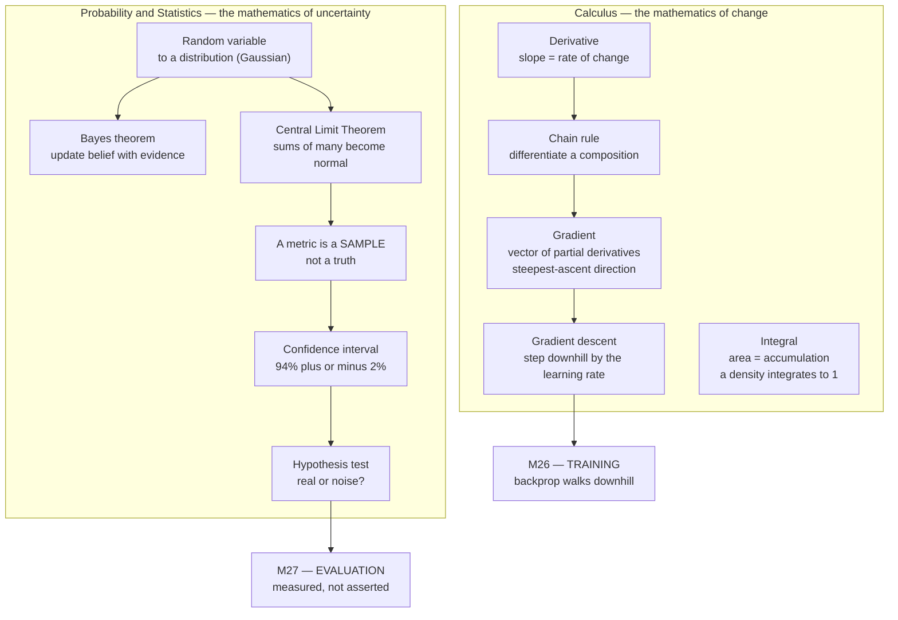

# Module 31 — Calculus, Probability & Statistics

<small>Stage 11 · Math & CS Foundations · ~3 weeks at 4 h/day · Prerequisite — Module 30 (discrete math & linear algebra — the gradient is a vector).</small>

## Why this matters

This module teaches two continuous mathematical languages, both load-bearing for machine learning.
**Calculus** is the mathematics of *change and accumulation*: the **derivative** (the instantaneous
rate of change of a function — the slope of its tangent line) and the **integral** (the accumulated
total — the area under a curve). Its multivariable form gives the **gradient** (the vector of partial
derivatives — a **partial derivative** is the slope in one input direction while the others are held
fixed; the gradient points in the direction of steepest increase), and the gradient is how every neural
network learns. **Probability** is the mathematics of *uncertainty*: distributions, expectation, and
**Bayes' theorem** (updating a belief with evidence). **Statistics** is probability turned into a tool
for reasoning from *data*: estimation, hypothesis testing, and confidence.

Two earlier modules leaned on these tools with an accent. Module 26 (AI Foundations) "revived the chain
rule gently" and called gradients "which way is less wrong"; Module 27 (ML Fundamentals) chose metrics
and split data but never named a distribution, a confidence interval, or Bayes. Those ideas carried the
load — but an AI **engineer** must *own* the calculus (to reason about optimization, learning rates,
convergence, and why gradients vanish or explode) and the statistics (to know whether a 2% metric
improvement is real or noise). This module supplies both, and it completes the Stage 11 pair: Module 30
gave you the discrete structures and the linear algebra of *data*; Module 31 gives you the continuous
mathematics of *training* (calculus) and the mathematics of *evidence* (statistics).

!!! info "What this unlocks"
    **M26 (backprop/training)** — the chain rule and gradient descent, now owned, explain learning
    rates, convergence, and vanishing/exploding gradients · **M27 (evaluation)** — metrics carry
    confidence intervals and model comparison becomes a hypothesis test · **M38 (NLP)** — naive Bayes
    and probabilistic language models · **M39 (Computer Vision)** — loss surfaces and interval-honest
    detection metrics · **the capstone**, whose model claims must carry intervals and a real/noise
    verdict, and whose training story must invoke gradient descent by name. Together with M30, this is
    the mathematics an AI engineer reads by.

---

## Watch

*Watch once, then rely on the notes below — you should never need to rewatch.*

<div class="lo-video-placeholder" markdown="1">
<span class="lo-play">▶</span>
**Explainer video — coming**
<small>Record per <code>../media/README.md</code>, upload to YouTube, then replace this card with the embed.</small>
</div>

??? note "For the author — drop-in YouTube embed (replace VIDEO_ID)"
    Once the explainer is on YouTube, replace the placeholder card above with:
    ```html
    <div class="lo-video-embed">
      <iframe src="https://www.youtube-nocookie.com/embed/VIDEO_ID"
              title="Module 31 — Calculus, Probability & Statistics"
              allow="accelerometer; autoplay; clipboard-write; encrypted-media; gyroscope; picture-in-picture"
              allowfullscreen></iframe>
    </div>
    ```
    Video script beats (from the blueprint's Definition / Analogy / Misconceptions):
    the accelerator and the speedometer (calculus moves the model, statistics reads whether it arrived) →
    derivative as a limit → the chain rule IS backprop (M26) → the gradient and one gradient-descent step,
    with the three learning-rate regimes → the mammogram / base-rate shock (Bayes) → "94%" needs a ± after
    it (a metric is a sample) → "is +2% real or noise?" is a hypothesis test, and p-hacking is M27's
    leakage discipline in statistical dress.

**Terminal cast — pending; record per `../media/README.md`.**

!!! tip "Follow along, don't just watch"
    Open the [Guided Lab](#guided-lab-feel-the-two-instruments) in a browser terminal and run each block
    yourself as it appears. Typing beats watching every time — and computing a derivative, watching
    gradient descent walk downhill, and being surprised by a Bayes answer is how the memory forms.

---

## Key Notes

*Standalone. This is the reference you keep.*

### The picture: two languages, two bridges



The two halves meet the curriculum's spine at two bridges: **calculus trains the model** (M26), and
**statistics judges the result** (M27). The analogy to hold onto: calculus is the **accelerator** (the
derivative tells you which way and how hard to press to go downhill on the loss surface) and statistics
is the **speedometer with error bars** (it tells you not just "94%" but "94% ± 2%, and that ± is why last
week's 92% might not really be worse").

### Calculus — the derivative, the chain rule, the gradient

The **derivative** `f'(x)` is the instantaneous rate of change of `f` at `x` — the slope of the tangent
line. It is defined as a **limit** (the value a quantity approaches as another shrinks to zero):

> **f'(x) = lim (h → 0) of (f(x+h) − f(x)) / h**

You can *feel* that limit numerically: compute `(f(x+h) − f(x−h)) / (2h)` for a tiny `h` (the **symmetric
difference quotient**, the numerical derivative) and watch it converge to the analytic answer. That check
— hand derivative vs numerical derivative — is the **gradient-check habit** you first met in M26.

The **chain rule** is the module's keystone. For a **composition** (one function fed into another),
`f(g(x))`:

> **(f∘g)'(x) = f'(g(x)) · g'(x)** — the outer derivative times the inner derivative.

This is *literally* what **backprop** (backpropagation — the algorithm that computes a loss's gradient)
does. A neural network is a deep composition of functions (its layers); the loss is a function of them
all. Backprop applies the chain rule *backward* through the **computation graph** (a DAG — directed
acyclic graph, M30's object): each node multiplies the upstream gradient by its local derivative and
passes it back. "Backprop is the chain rule applied backward through the DAG" stops being a slogan and
becomes something you can do with a pencil.

The **gradient** `∇f` (read "grad f" or "del f") is the derivative's multivariable generalization: the
vector of partial derivatives, one per input dimension. It points in the direction of **steepest
ascent** — the fastest way uphill on the surface.

### Gradient descent and the learning rate

To *minimize* a loss `L`, step *opposite* the gradient — downhill:

> **θ ← θ − η ∇L(θ)** — the gradient-descent update. `θ` (theta) is the parameters; `η` (eta) is the
> **learning rate** (the step size).

This is THE training algorithm (M26), and it is old — Cauchy published it in 1847, and it powers every
modern model from SGD to Adam. The learning rate `η` is the one knob the calculus fully explains:

| `η` (learning rate) | What the calculus does | What you see |
|---|---|---|
| **Too big** | The step overshoots the minimum; the surface's curvature sends it *higher* | Loss oscillates or **diverges** — it bounces out |
| **Too small** | Each step barely moves | **Crawls** — converges, but takes forever |
| **Just right** | Steps shrink appropriately near the minimum | Smooth **convergence** |

A gradient descent that diverges is almost never a code bug — it is `η` too large. The fix is the
calculus, not trial-and-error: reduce `η` (say 10×), optionally decay it over steps, and confirm the loss
now falls.

### Integrals — accumulation and area

The **integral** `∫f` is accumulation: the area under a curve, built as the limit of thin rectangles
(a **Riemann sum**). The **Fundamental Theorem of Calculus** says differentiation and integration undo
each other — they are inverses. Why it matters for ML: a **probability density** (the continuous
analogue of a distribution's per-value probability) **integrates to 1**, and an **expectation** (the
long-run average) *is* an integral. That is the seam where calculus meets probability.

### Distributions, expectation, variance

A **random variable** takes values with probabilities described by a **distribution**. Two you must know:

- **Discrete** — **Bernoulli** (a single yes/no trial, e.g. one coin flip) and **binomial** (the count of
  successes over many Bernoulli trials). The per-value probability is the **pmf** (probability mass
  function).
- **Continuous** — the **normal / Gaussian** distribution (the bell curve — the one that's everywhere).
  Its per-value density is the **pdf** (probability density function).

A distribution's first two **moments** summarize it: the **expectation** (mean `μ` — the long-run
average, the center) and the **variance** (`σ²` — the spread; its square root `σ` is the **standard
deviation**).

### Bayes' theorem and the base-rate fallacy

**Conditional probability** `P(A|B)` is the probability of `A` *given* that `B` happened. **Bayes'
theorem** updates a belief with evidence:

> **P(H|E) = P(E|H) · P(H) / P(E)** — posterior = likelihood × prior / evidence.

The famous shock is the **mammogram / base-rate problem**. A test that is 90% accurate for a disease
affecting 1% of people: a positive result is *more likely a false alarm than real*. Walk the counts on
100,000 people:

| Group | Count | Test says positive | Positives |
|---|---|---|---|
| Have the disease (1%) | 1,000 | 90% caught (sensitivity) | **900 true positives** |
| Healthy (99%) | 99,000 | 10% false alarm (1 − specificity) | **9,900 false positives** |
| **Total positive** | | | 10,800 |

`P(disease | positive) = 900 / 10,800 ≈ 8.3%`. Despite "90% accuracy," a positive is ~92% likely a false
alarm — because the disease is rare, the **base rate** (the prior prevalence) dominates. This IS M27's
**precision** under class imbalance: **precision = P(real | flagged) = Bayes**, and "90% accurate" is
meaningless without the base rate.

### The CLT, the standard error, and honest metrics

The **Central Limit Theorem (CLT)** says the sum (or mean) of many independent, finite-variance random
variables tends toward a *normal* distribution regardless of the originals' shapes. That is *why* the
normal shows up everywhere and why so much of statistics is built on it — it isn't arbitrary, it
**emerges**.

The CLT is also why a test-set metric needs error bars. A test set is a random **sample** of the data
distribution; the metric on it *estimates* the true performance but varies from sample to sample — that
variation is the **sampling error**. Its size is the **standard error** (the standard deviation of the
sample mean), which scales as **1/√n**:

> **Halve a confidence interval → 4× the data.** Precision improves only with the *square root* of the
> sample size — diminishing returns that set what evaluation costs.

A **confidence interval (CI)** is a range that captures the true value with a stated long-run frequency
(a 95% CI: 95% of such intervals, computed the same way, contain the truth). Built from scratch it is
**point estimate ± margin**, where the margin is `z · standard error`. "94%" becomes "**94% ± 2%**," and
that ± is the honesty M27's number was missing.

### Hypothesis testing, the p-value, and p-hacking

The keystone question — **"is model B's +2% over model A real or noise?"** — is a **hypothesis test**.
The **null hypothesis** `H₀` says there's no real difference; you compute a **p-value** and decide.

> A **p-value** IS `P(observing data at least this extreme | the null is true)`. It is **NOT** the
> probability the null is true, **NOT** the effect size, and **NOT** proof that a result matters.

Two traps this module drills:

- **Significance vs effect size.** Significance asks *is it real* (small p = distinguishable from noise);
  effect size asks *is it big* (the magnitude). With a huge sample a 0.1% improvement can be "highly
  significant" yet worthless. Report both.
- **p-hacking / multiple comparisons.** Test 20 hypotheses on pure noise at the 5% level and, by
  construction, ~1 comes out "significant" (`20 × 0.05 = 1`). Optimizing against a metric until it
  "wins" IS p-hacking — M27's touched-the-test-set-once and leakage discipline stated in statistical
  terms. The cures: correct for multiplicity, pre-register the hypothesis, hold out a fresh test set.

<div class="lo-remember" markdown="1">
**Must remember (if you keep only six things):**

1. **The derivative is the slope; the gradient is the vector of partial derivatives** pointing steepest
   uphill. Use the derivative for one variable, the gradient for many (every model parameter).
2. **Backprop IS the chain rule** — `(f∘g)' = f'(g)·g'` — applied backward through the computation graph.
3. **Gradient descent:** `θ ← θ − η∇L`. `η` too big → overshoot/diverge; too small → crawl; right →
   converge. A diverging run is `η`, not a bug.
4. **Bayes with the base rate:** `P(H|E) = P(E|H)P(H)/P(E)`. "90% accurate" on a 1% disease → a positive
   is mostly a false alarm. Precision = P(real | flagged) = Bayes.
5. **A metric is a SAMPLE, not a truth.** It has a standard error (∝ 1/√n), so it has a confidence
   interval. "94%" → "94% ± 2%."
6. **"Is +2% real or noise?" is a hypothesis test.** A p-value is `P(data this extreme | null true)` —
   not the effect size, not the chance the null is true. Beware p-hacking.
</div>

---

## Guided Lab: feel the two instruments

*Basic, step-by-step. You'll compute a numerical derivative and match it to the analytic one, run
gradient descent from scratch and watch it reach the minimum, sample a distribution and see the mean
converge to theory, work the Bayes mammogram, and put a confidence interval and a p-value on a model
comparison. Everything runs in Python with numpy — no black-box optimizer, no statistics library.*

<div class="lo-lab-actions" markdown="1">
[▶ Open interactive lab](https://killercoda.com/learning-os/course/killercoda/module-31){ .lo-btn target=_blank }
[⧉ Open in Codespaces](https://codespaces.new/randaguiac20/learning-os){ .lo-btn target=_blank }
[⌨ Run locally](#run-locally){ .lo-btn .lo-btn--ghost }
[View lab source](https://github.com/randaguiac20/learning-os/tree/main/killercoda/module-31){ .lo-btn .lo-btn--ghost target=_blank }
</div>

<span id="run-locally"></span>
!!! tip "Three ways to run this lab — pick any (all free)"
    - **Instant, no account** — click **Open interactive lab** (Killercoda): a Linux terminal in your browser.
    - **Your own cloud** — click **Open in Codespaces**: runs in your GitHub account's free tier (120 core-hrs/mo).
    - **Local, unlimited, $0** — any Linux / macOS / WSL terminal, or a throwaway container: `docker run -it ubuntu bash`, then `apt-get update && apt-get install -y python3-pip && pip install numpy` and follow the steps below.

    Killercoda is the zero-setup on-ramp; Codespaces and local use *your own* free resources, so they scale to any class size.

=== "1 · The derivative, felt as a limit"
    Set up the bench, then compute a **numerical derivative** and compare it to the **analytic** one.
    For `f(x) = x²` the analytic derivative is `f'(x) = 2x`, so `f'(3) = 6`:
    ```bash
    mkdir -p ~/mathlab && cd ~/mathlab
    apt-get update -y && apt-get install -y python3-pip && pip install numpy
    ```
    ```bash
    python3 - <<'PY'
    import numpy as np
    f = lambda x: x**2                       # f(x) = x^2
    h, x = 1e-5, 3.0
    numeric  = (f(x+h) - f(x-h)) / (2*h)     # symmetric difference quotient
    analytic = 2*x                           # f'(x) = 2x  ->  6
    err = abs(numeric - analytic)
    print(f"numerical f'(3) = {numeric:.6f}")
    print(f"analytic  f'(3) = {analytic:.6f}")
    print(f"abs error       = {err:.2e}")
    open("gradient_check.txt", "w").write(f"{err:.3e}\n")
    PY
    ```
    The error is tiny (~1e-10). The derivative isn't a formula you memorize — it's a *limit you can watch
    converge*. This exact check (hand answer vs numerical) is the gradient-check habit from M26.

=== "2 · Gradient descent, from scratch"
    Minimize `f(x) = (x−4)²` (minimum at `x = 4`) with the update `θ ← θ − η∇L`. The gradient is
    `f'(x) = 2(x−4)`. Run three learning rates and watch the three regimes:
    ```bash
    python3 - <<'PY'
    import numpy as np
    grad = lambda x: 2*(x-4)                 # d/dx (x-4)^2
    def descend(eta, steps=100, x0=0.0):
        x = x0
        for _ in range(steps):
            x = x - eta*grad(x)              # theta <- theta - eta * gradient
        return x
    for eta in [0.01, 0.1, 1.01]:
        print(f"eta={eta:<5} final x = {descend(eta):.4f}")
    x_good = descend(0.1)
    open("gd.txt", "w").write(f"{x_good:.4f}\n")
    print(f"converged x = {x_good:.4f}  (true minimum at x = 4)")
    PY
    ```
    Read the three lines: `η=0.1` lands on 4 (**converged**); `η=0.01` is still short of 4 (**crawl** —
    too small); `η=1.01` blows up to a huge number (**diverge** — overshoot). That divergence is the
    calculus, not a bug: the step is larger than the curvature can absorb.

=== "3 · The law of large numbers"
    Sample a fair six-sided die many times and watch the **empirical mean** approach the theoretical
    `3.5` and the **empirical variance** approach `35/12 ≈ 2.9167`. This is the **law of large numbers**:
    an average of many samples converges to the expectation.
    ```bash
    python3 - <<'PY'
    import numpy as np
    rng = np.random.default_rng(31)          # pinned seed -> reproducible
    n = 200_000
    rolls = rng.integers(1, 7, size=n)       # fair six-sided die
    mean, var = rolls.mean(), rolls.var()
    print(f"n = {n:,}  empirical mean = {mean:.4f}  (theory 3.5000)")
    print(f"            empirical var = {var:.4f}  (theory 2.9167)")
    open("lln.txt", "w").write(f"{mean:.4f} {var:.4f}\n")
    PY
    ```
    Click **Check** — the verifier confirms the gradient-check error is below tolerance *and* the sampled
    mean has converged to within a band of `3.5`.

=== "4 · Bayes: the mammogram shock"
    A test 90% accurate for a 1%-prevalence disease returns positive. Compute `P(disease | positive)`
    with Bayes, then simulate 100,000 patients to confirm the (surprising) answer:
    ```bash
    python3 - <<'PY'
    import numpy as np
    prev, tpr, fpr = 0.01, 0.90, 0.10        # prevalence, true-positive rate, false-positive rate
    post = tpr*prev / (tpr*prev + fpr*(1-prev))
    print(f"P(disease | positive) = {post:.4f}  (~{post*100:.1f}%)")
    rng = np.random.default_rng(31)
    N = 100_000
    sick = rng.random(N) < prev
    positive = np.where(sick, rng.random(N) < tpr, rng.random(N) < fpr)
    print(f"simulated over {N:,} patients: {sick[positive].mean():.4f}")
    open("bayes.txt", "w").write(f"{post:.4f}\n")
    PY
    ```
    ~8.3%, not 90% — the base rate dominates. This IS M27's precision under class imbalance. Click
    **Check** to verify the posterior matches the expected value.

=== "5 · A confidence interval and a p-value"
    Two models on one 500-example test set: A at 92% (460/500), B at 94% (470/500). Put a **confidence
    interval** on each, then run a **two-proportion test** on the difference to decide *real or noise*.
    We compute the normal-approximation p-value with `math.erf` — no statistics library needed:
    ```bash
    python3 - <<'PY'
    import math
    def ci(correct, n, z=1.96):
        p = correct/n
        return p, z*math.sqrt(p*(1-p)/n)               # point estimate, margin
    def two_prop_p(cA, nA, cB, nB):
        pA, pB = cA/nA, cB/nB
        pool = (cA+cB)/(nA+nB)
        se = math.sqrt(pool*(1-pool)*(1/nA + 1/nB))
        z = (pB-pA)/se
        return z, 2*(1 - 0.5*(1+math.erf(abs(z)/math.sqrt(2))))   # two-sided
    nA = nB = 500
    (pA,hA), (pB,hB) = ci(460,nA), ci(470,nB)
    print(f"Model A: {pA*100:.1f}% +/- {hA*100:.1f}%")
    print(f"Model B: {pB*100:.1f}% +/- {hB*100:.1f}%")
    z, p = two_prop_p(460,nA,470,nB)
    print(f"difference test: z = {z:.2f}   p = {p:.3f}")
    print("verdict:", "significant" if p < 0.05 else "NOT significant — the +2% is within noise")
    PY
    ```
    The intervals overlap and `p ≈ 0.22` — the 2% gap is **not** significant on 500 examples. "B is
    better" was a claim the point estimates couldn't support; the interval and the test say so honestly.

!!! success "You can stop here and have learned something real"
    If you watched a numerical derivative converge to the analytic one, ran gradient descent to a
    minimum and saw all three learning-rate regimes, watched a sample mean approach its expectation, were
    surprised by the mammogram, and put a ± and a p-value on a model comparison — the guided lab is done.
    Now make it harder.

---

## Solo Lab: figure it out

*Harder. Goals only — minimal hand-holding. Derive by hand first, then let the code verify. Struggle
here is the point; reveal a hint only after you've tried.*

### Challenge 1 — Own the chain rule on a composition
Differentiate `f(x) = (3x² + 1)³` by hand with the chain rule, then verify your `f'(2)` against a
numerical derivative in Python.

??? tip "Hint"
    Outer function `u³` (derivative `3u²`), inner function `u = 3x² + 1` (derivative `6x`). The chain
    rule multiplies them: `f'(x) = 3(3x²+1)² · 6x`.

??? success "Solution"
    ```bash
    python3 - <<'PY'
    f = lambda x: (3*x**2 + 1)**3
    hand = lambda x: 3*(3*x**2 + 1)**2 * (6*x)        # chain rule: outer' * inner'
    h = 1e-6; x = 2.0
    num = (f(x+h) - f(x-h)) / (2*h)
    print(f"hand f'(2)      = {hand(x):.4f}")
    print(f"numerical f'(2) = {num:.4f}")
    PY
    ```
    Both give `6_084`. A deep network is a deep composition — this multiply-the-local-derivatives move,
    applied backward, is exactly backprop.

### Challenge 2 — Make gradient descent diverge, then explain it
Take `f(x) = (x−4)²` from the guided lab and find, by reasoning about the update `x ← x − η·2(x−4)`, the
learning rate above which it diverges. Confirm it in code.

??? tip "Hint"
    Substitute the gradient into the update and write it as `x_new − 4 = (1 − 2η)(x_old − 4)`. Divergence
    happens when the multiplier's absolute value exceeds 1: `|1 − 2η| > 1`.

??? success "Solution"
    `|1 − 2η| > 1` ⇒ `η > 1`. At `η = 1` the point oscillates without settling; above 1 it flies out.
    ```bash
    python3 - <<'PY'
    grad = lambda x: 2*(x-4)
    for eta in [0.9, 1.0, 1.1]:
        x = 0.0
        for _ in range(50): x = x - eta*grad(x)
        print(f"eta={eta}: x={x:.2f}")
    PY
    ```
    The threshold is a property of the surface's curvature, not the code — the calculus reason M26's
    "learning rate too high" hides.

### Challenge 3 — Demonstrate the CLT
Take a decidedly *non-normal* distribution (e.g. a uniform or an exponential), draw many samples of size
`n = 30`, and show that the **distribution of the sample means** looks normal even though the source
isn't.

??? success "Solution"
    ```bash
    python3 - <<'PY'
    import numpy as np
    rng = np.random.default_rng(31)
    means = [rng.exponential(1.0, size=30).mean() for _ in range(20_000)]
    means = np.array(means)
    print(f"sample-of-means: mean={means.mean():.3f} (theory 1.0), std={means.std():.3f}")
    print(f"theory std of the mean = 1/sqrt(30) = {1/np.sqrt(30):.3f}")   # 1/sqrt(n) law
    PY
    ```
    The exponential is skewed, but its sample means cluster into a bell whose spread is `1/√n`. That is
    *why* confidence intervals work — the normal **emerges**.

### Challenge 4 — Halve a confidence interval
You have a metric with a 95% CI of ±3% on 1,000 test examples. Roughly how many examples do you need to
tighten it to ±1.5%? State the law, then verify the margin numerically.

??? success "Solution"
    The margin scales as `1/√n`, so halving it needs **4×** the data → about **4,000** examples.
    ```bash
    python3 - <<'PY'
    import math
    margin = lambda n, p=0.5: 1.96*math.sqrt(p*(1-p)/n)
    print(f"n=1000 -> +/-{margin(1000)*100:.2f}%")
    print(f"n=4000 -> +/-{margin(4000)*100:.2f}%")
    PY
    ```
    Precision improves only with the square root of data — the diminishing return that sets what
    evaluation costs.

### Challenge 5 (stretch) — p-hack yourself
Generate pure noise, run 20 independent "hypothesis tests" at the 5% level, and count how many come out
"significant." Then say why finding one is *expected*, not a discovery.

??? success "Solution"
    ```bash
    python3 - <<'PY'
    import numpy as np, math
    rng = np.random.default_rng(7)
    hits = 0
    for _ in range(20):
        a, b = rng.normal(0,1,200), rng.normal(0,1,200)   # SAME distribution — no real effect
        se = math.sqrt(a.var()/len(a) + b.var()/len(b))
        z = (a.mean()-b.mean())/se
        p = 2*(1 - 0.5*(1+math.erf(abs(z)/math.sqrt(2))))
        hits += p < 0.05
    print(f"'significant' results from pure noise: {hits} of 20  (expected ~1)")
    PY
    ```
    `20 × 0.05 = 1` false positive is *expected under the null*. Optimizing against a metric until it
    "wins" is this trap with extra steps — M27's leakage discipline, stated in statistics.

---

## Self-Check

*Close the notes. Answer aloud or in writing **first**, then reveal. Recalling — even when it's hard —
is what builds the memory.*

??? question "Derivative vs gradient — how are they related, and when do you use each?"
    The **derivative** is the single-variable rate of change (a scalar slope); the **gradient** is its
    multivariable generalization — a vector of partial derivatives, one per input dimension, pointing
    uphill. Use the derivative for a function of one variable; use the gradient whenever the function has
    many inputs (every model parameter) — training optimizes over millions of dimensions, so it's always
    the gradient.

??? question "Explain how backprop IS the chain rule, referencing the computation graph."
    A network is a deep composition of functions (layers); the loss is a function of them all. Backprop
    computes `∂loss/∂each-weight` by applying the chain rule `(f∘g)' = f'(g)·g'` *backward* through the
    computation graph (a DAG): each node multiplies the upstream gradient by its local derivative and
    passes it back. It's the chain rule, industrialized over the graph (M26's micrograd).

??? question "Your gradient descent oscillates and diverges. The cause from the calculus, and the fix?"
    The **learning rate `η` is too large**: the step overshoots the minimum and the surface's curvature
    sends it to a *higher* point, compounding into oscillation or divergence. Fix: **reduce `η`** (e.g.
    10×), optionally add a decay schedule or clip gradients, and confirm the loss now falls. It's a
    step-size-vs-curvature trade, not a code bug.

??? question "A 90%-accurate test for a 1%-prevalence disease returns positive. P(disease | positive)?"
    With sensitivity 0.9 and (assuming) specificity 0.9: `P(pos) = 0.9·0.01 + 0.1·0.99 = 0.108`, so
    `P(disease|pos) = 0.009/0.108 ≈ 8.3%`. Despite "90% accuracy," a positive is ~92% likely a false
    alarm — the **base rate** dominates rare events. This IS precision under class imbalance (M27).

??? question "Why does a test-set metric need a confidence interval?"
    A test set is a random **sample** of the data distribution; the metric estimates the true performance
    but varies from sample to sample (**sampling error**). A confidence interval quantifies that
    variation — without it, "94%" hides whether the truth could be 90% or 98%, and comparing two models
    becomes a signal-vs-noise guess. "94%" should read "94% ± X%."

??? question "What is a p-value, and name two things it is NOT."
    A p-value IS `P(observing data at least this extreme | the null hypothesis is true)`. It is **NOT**
    the probability the null is true, and **NOT** the effect size (nor proof a result matters). Small p =
    "surprising under the null," nothing more.

??? question "You tested 20 hypotheses on random noise and one came out p < 0.05. What happened?"
    With 20 independent tests at α = 0.05, the *expected* number of false positives under pure noise is
    `20 × 0.05 = 1` — so "one significant" in noise is **expected, not a discovery**. The trap is
    **multiple comparisons / the garden of forking paths**. Fixes: correct for multiplicity
    (Bonferroni/FDR), pre-register, or hold out a fresh test set (M27's touched-once).

!!! example "Teach it back (the real test)"
    Out loud, in **4 minutes, no notes**, using the **accelerator/speedometer** analogy: *"What are the
    two languages this module teaches, and why does an AI engineer need BOTH?"* You must (1) state that
    **backprop IS the chain rule walking downhill** and explain `η`, and (2) put a **confidence interval**
    on a metric and frame *"+2% real or noise?"* as a **hypothesis test** with a p-hacking guardrail.
    Then field two challenges: *"why not just trust 94%?"* and *"isn't calculus too advanced?"* — and
    name the bridges to **M26** (training) and **M27** (evaluation). If you can't yet, that's your signal
    to reread the Key Notes, not to move on.

---

## Mastery checklist

*Tick these honestly, cold (no notes). They **gate** progress — passing M31 (with M30) completes the
mathematics of **Stage 11**. A module is only "done" when every box is true.*

- [ ] **Define** derivative, gradient, integral, distribution, Bayes, confidence interval, and p-value — one line each, cold.
- [ ] **Explain** why backprop IS the chain rule over the computation graph (M26/M30).
- [ ] **Compute** derivatives including the chain rule, verified against a numerical derivative.
- [ ] **Assemble** the gradient as the vector of partial derivatives, and say why it's a vector (M30).
- [ ] **Implement** gradient descent from scratch and **reason** about `η` (overshoot / crawl / converge) from the calculus, not trial-and-error.
- [ ] **Gradient-check** a hand derivative numerically (the M26 habit).
- [ ] **Explain** integrals and why a probability density integrates to 1.
- [ ] **Describe** Bernoulli, binomial, and normal distributions with their mean and variance; distinguish pmf from pdf.
- [ ] **State and apply** Bayes' theorem to the mammogram, and **connect** it to M27 precision under class imbalance.
- [ ] **Demonstrate** the CLT by simulation and **explain** the standard error and the 1/√n law.
- [ ] **Compute** a confidence interval on a real metric and **reframe** the metric as a sample with uncertainty ("94% ± X%").
- [ ] **Run and interpret** a hypothesis test on two models; **state** what a p-value is and is NOT; **distinguish** significance from effect size.
- [ ] **Identify and avoid** p-hacking / multiple comparisons; apply the base-rate fallacy to security detection (M24/M25).
- [ ] **Teach** calculus-as-accelerator and statistics-as-speedometer, making both curriculum bridges (M26/M27).

---

## Review — lock it in

Spaced repetition is not optional; it's where the memory actually forms. Interleaving stays active —
every M31 review also pulls in one **Module 30** item (its discrete/linear-algebra companion; the
gradient is a vector M30 built). Schedule these and *keep* them:

| When | Do | Interleaved M30 item |
|---|---|---|
| **Day 1** | Flashcards 1–20 · re-derive one gradient-descent step and one Bayes problem by hand | One "why is the gradient a vector?" recall — a vector is M30's object |
| **Day 3** | The three cases (Cauchy/GPT · mammogram · replication) · what a p-value is/isn't · compute a CI from scratch | Restate matrix–vector multiply as the linear map M30 defined |
| **Day 7** | Reproduce the full Visual Model blank · run a two-model hypothesis test · name the p-hacking trap | Reproduce the PCA-via-eigenvalues idea from memory |
| **Day 14** | Chain rule ⇄ backprop · base-rate ⇄ precision · gradient-check a hand derivative | A short proof by induction, cold (M30's proof card) |
| **Day 30** | Whole module in five-minute-review form · reproduce both artifacts (GD notebook + "make M27 rigorous" notebook) | Big-O-as-counting on a small combinatorics problem |

**Connects forward to:** M26 (backprop and training — the chain rule and gradient descent, now owned,
explain learning rates and vanishing/exploding gradients) · M27 (evaluation — metrics with confidence
intervals, model comparison as a hypothesis test) · M38 (NLP — naive Bayes, probabilistic language
models) · M39 (Computer Vision — loss surfaces, interval-honest metrics) · information theory and
optimization theory (entropy, cross-entropy loss, convex optimization — the named next mathematics).

!!! quote "The one-sentence takeaway"
    M31 is the two continuous languages under the curriculum's spine — calculus is how the model *moves*
    (M26's training, owned) and statistics is how you *know* it moved (M27's evaluation, made honest) —
    completing, with M30, the mathematics an AI engineer reads by.
