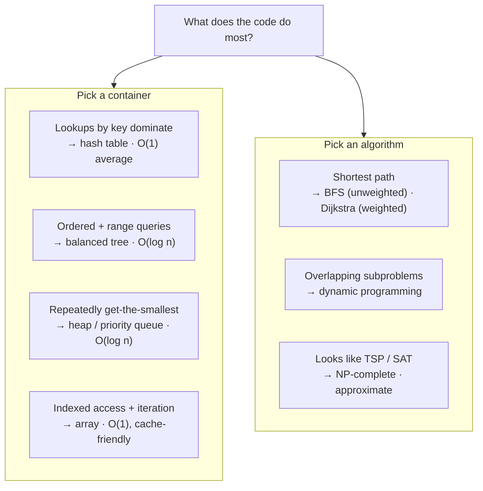
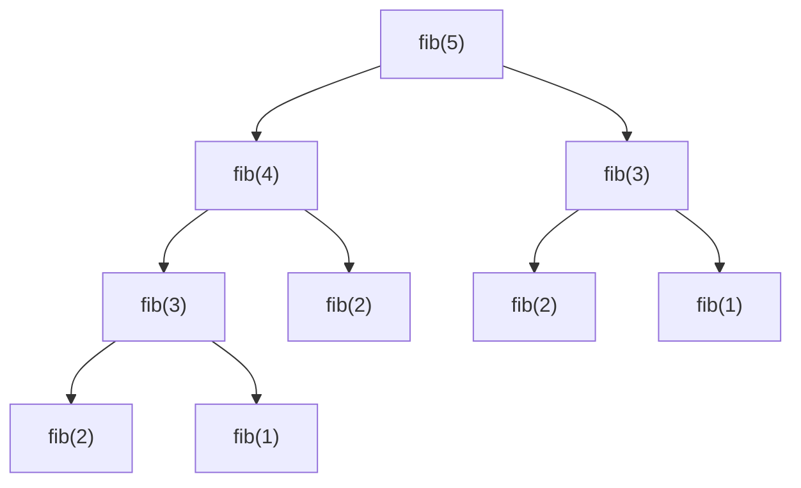

# Module 32 — Data Structures & Algorithms

<small>Stage 11 · Mathematical & CS Foundations · ~3 weeks at 4 h/day · Prerequisites — Module 13 (Python — lists, dicts, functions, recursion are the bench) and Module 30 (big-O as counting, graph theory, modular arithmetic for hashing).</small>

## Why this matters

A **data structure** is a way of organizing data in memory so that certain operations on it are fast —
the array, the linked list, the stack, the queue, the hash table, trees, and graphs. An **algorithm**
is a well-defined step-by-step procedure for solving a problem — searching, sorting, traversing a
graph, or one of the great paradigms (divide-and-conquer, greedy, dynamic programming). Binding them
together is **big-O notation** — how an algorithm's time or space cost grows as the input size *n*
grows, ignoring constants (the upper-bound growth rate). *"Programs = data structures + algorithms"* is
literally the title of Wirth's book, and it is the truth this module makes explicit.

You have **used** these everywhere already — Module 13's Python `list` and `dict` are an array and a
hash table; Module 17's git history is a graph; Module 26's computation graph is a DAG (directed
acyclic graph — a graph with directed edges and no cycles) traversed in order; Modules 24–25 processed
logs at scale. What you have never done is the **discipline**: choosing the right container on purpose
and *knowing the cost*. This module is Module 30's mathematics, executed — every complexity **derived**
from the code (M30) and **measured** by timing at growing *n* (M21). By the end you pick a hash table
over a list because lookups dominate (and can prove the gap), recognize a problem as a graph problem,
reach for dynamic programming when subproblems overlap, and recognize an **NP-complete** problem so you
stop chasing a fast exact answer and reach for a heuristic instead.

!!! info "What this unlocks"
    M33 (Databases) — a B-tree index **is** a balanced tree, a hash join **is** a hash table, and query
    planning is algorithm choice · M34 (Big Data) — the external-memory and distributed versions of
    these algorithms · M21 (Performance) — this module supplies the algorithmic half of *"why is it
    slow?"* · M38 (NLP) — tries, hash-table vocabularies, and dynamic programming (edit distance,
    Viterbi). Passing M32 **closes Stage 11** — the mathematical and algorithmic toolkit an AI/systems
    engineer reads by is then owned, not glimpsed.

---

## Watch

*Watch once, then rely on the notes below — you should never need to rewatch.*

<div class="lo-video-placeholder" markdown="1">
<span class="lo-play">▶</span>
**Explainer video — coming**
<small>Record per <code>../media/README.md</code>, upload to YouTube, then replace this card with the embed.</small>
</div>

??? note "For the author — drop-in YouTube embed (replace VIDEO_ID)"
    Once the explainer is on YouTube, replace the placeholder card above with:
    ```html
    <div class="lo-video-embed">
      <iframe src="https://www.youtube-nocookie.com/embed/VIDEO_ID"
              title="Module 32 — Data Structures & Algorithms"
              allow="accelerometer; autoplay; clipboard-write; encrypted-media; gyroscope; picture-in-picture"
              allowfullscreen></iframe>
    </div>
    ```
    Video script beats (from the blueprint's Definition / Analogy / Misconceptions): the workshop of
    containers and procedures → why list-vs-dict is a big-O decision (the O(n) vs O(1) picture) → the
    big-O ladder (constant → linear → n-log-n → quadratic → exponential) → recognizing a graph problem →
    deriving dynamic programming by memoizing naive Fibonacci → recognizing NP-completeness and
    switching to a heuristic. Always: **derive** the cost, then **measure** it.

**Terminal cast — pending; record per `../media/README.md`.**

!!! tip "Follow along, don't just watch"
    Open the [Guided Lab](#guided-lab-build-the-containers-then-measure-the-cost) in a browser terminal
    and run each command yourself as it appears. Typing beats watching every time — and building each
    structure by hand *before* comparing it to Python's built-in is the whole point.

---

## Key Notes

*Standalone. This is the reference you keep.*

### The picture: choose the container, then know the cost

Half of algorithm design is **recognizing** which container or algorithm a problem calls for. Read this
as a decision guide:



A **hash table** computes `hash(key) % n_buckets` to jump straight to the bucket holding the key (M30's
modular arithmetic) — one computation, no scanning, so **O(1) average**. A **list** has no such index
by value, so membership means scanning element by element — **O(n)**. That single choice, list-vs-dict,
is the most consequential data-structure decision most programs make, and you now make it on purpose.

### The big-O ladder — how cost grows with n

**Big-O** (also big-Θ for a tight bound and big-Ω for a lower bound) describes the *shape* of the growth
curve, not the exact time. Learn this ladder cold — it is the ruler you measure code with:

| Big-O | Name | At n = 1,000,000 | Seen in |
|---|---|---|---|
| **O(1)** | constant | instant | hash lookup, array index, heap peek |
| **O(log n)** | logarithmic | ~20 steps | binary search, balanced-BST op |
| **O(n)** | linear | one scan | list search, BFS, DFS |
| **O(n log n)** | linearithmic | a fast sort | merge sort, quicksort (average) |
| **O(n²)** | quadratic | a ~40-minute hang | bubble sort, nested-loop membership |
| **O(2ⁿ)** | exponential | hopeless past n≈40 | naive Fibonacci, brute-force subsets |
| **O(n!)** | factorial | hopeless past n≈13 | brute-force travelling salesman |

The gap between O(n) and O(n²) is the gap between a working product and a timeout — an O(n²) loop that's
fine at n=1,000 is a multi-minute hang at n=1,000,000.

### The container cheat card — operation costs

Each structure is fast at *some* operations and slow at others; you pick the one whose cheap operation
is the one your code does most:

| Structure | Access / Peek | Search | Insert | Delete | Note |
|---|---|---|---|---|---|
| **Array (dynamic)** | O(1) by index | O(n) | O(1) amortized append | O(n) | contiguous → cache-friendly (M22) |
| **Linked list** | O(n) | O(n) | O(1) at a known node | O(1) at a known node | pointer-chained → cache-hostile |
| **Stack** (LIFO) | O(1) top | O(n) | O(1) push | O(1) pop | LIFO = last-in-first-out; the call stack |
| **Queue** (FIFO) | O(1) front | O(n) | O(1) enqueue | O(1) dequeue | FIFO = first-in-first-out; drives BFS |
| **Hash table** | — | O(1) avg / O(n) worst | O(1) avg | O(1) avg | Python's `dict`/`set` **are** this |
| **Balanced BST** | O(log n) | O(log n) | O(log n) | O(log n) | ordered; supports range queries |
| **Min-heap** | O(1) peek-min | O(n) | O(log n) | O(log n) extract-min | the priority queue; Dijkstra's engine |

- **Amortized O(1)** means the *average* cost over many appends is constant: most appends drop into an
  empty slot (O(1)); occasionally the buffer is full and the array doubles, copying all *n* elements
  (O(n)), but those copies sum to a geometric series (n + n/2 + n/4 + … < 2n) spread over *n* appends —
  so the average stays constant. That doubling array **is** Python's `list`.
- A **BST** (binary search tree) is O(log n) *only while balanced*; insert already-sorted data and every
  node becomes a right child, degenerating the tree into a linked list of height *n* — search back to
  O(n). **Self-balancing** trees (AVL, red-black) rotate on insert to keep the height O(log n).

### Searching and sorting

- **Linear search** scans every element — O(n). **Binary search** compares the target to the middle
  element and discards half the range each step — O(log n), the logarithm being *"how many times you can
  halve n."* But it **requires sorted input**: on unsorted data, *"the target is larger than the middle"*
  tells you nothing about which half it's in, so you can't discard either. Sorted order is the invariant
  the halving relies on.
- **The sorting ladder** climbs from the O(n²) simple sorts to the O(n log n) divide-and-conquer sorts.
  You cannot beat O(n log n) by comparing elements — that is the proven **comparison-sort lower bound**:

| Sort | Average | Worst | Extra space | Stable? |
|---|---|---|---|---|
| Bubble / insertion / selection | O(n²) | O(n²) | O(1) | insertion: yes |
| **Merge sort** (divide-and-conquer) | O(n log n) | O(n log n) | O(n) | yes |
| **Quicksort** (divide-and-conquer) | O(n log n) | O(n²) bad pivots | O(log n) | no |

Python's `sorted()` uses **Timsort** — an O(n log n) hybrid. You build these to understand the ladder,
then trust the built-in.

### Graphs and dynamic programming

- A **graph** is M30's vertices and edges as running code. An **adjacency list** stores each vertex's
  neighbours (space O(V+E), sparse-friendly); an **adjacency matrix** is a V×V table (space O(V²), O(1)
  edge check). **BFS** (breadth-first search) uses a **queue** and finds the shortest path in an
  *unweighted* graph (it reaches each vertex by the fewest edges); **DFS** (depth-first search) uses a
  **stack** or recursion and does cycle detection and **topological sort** (M26's DAG executed in
  dependency order — like `apt` resolving packages or Docker building layers).
- **Dynamic programming (DP)** is not a special trick — it is *"a slow recursion with the answers
  remembered."* Naive recursive Fibonacci recomputes the same subproblems exponentially often — O(2ⁿ):



`fib(3)` is computed twice, `fib(2)` three times — the subproblems **overlap**. **Memoize** each
subproblem's answer (top-down) and the O(2ⁿ) collapses to **O(n)** — each of the *n* distinct
subproblems is computed once. Filling a table from the base cases up instead is **tabulation**
(bottom-up). That is the whole of DP: overlapping subproblems + optimal substructure, answers cached.

### The tractability frontier: P, NP, and NP-complete

- **P** = problems solvable in polynomial time (fast). **NP** = problems whose proposed solution is
  *verifiable* in polynomial time. **NP-complete** = the hardest problems in NP — if any one had a fast
  solution, all of NP would (the famous open **P vs NP** question). Examples: SAT, the travelling
  salesman (TSP), knapsack.
- **NP-complete does not mean impossible** — it means no known *fast exact* algorithm. Brute-force TSP is
  O(n!): fine at 10 cities, hopeless at 20. The engineer's most valuable algorithmic skill is
  **recognizing** this and switching strategy — an approximation or heuristic (nearest-neighbour,
  greedy, a solver with a time budget) that accepts *"good enough."* Knowing when to **stop** optimizing
  an exact answer is as important as knowing how to.

<div class="lo-remember" markdown="1">
**Must remember (if you keep only six things):**

1. **Choose the container for the operation that dominates.** Lookups → hash table (O(1)); order + range
   → tree (O(log n)); get-the-smallest → heap; indexed iteration → array.
2. **`x in a_set` is O(1); `x in a_list` is O(n).** A hash computes the bucket; a list scans. Swapping a
   list for a set in a loop is the single most common real-world performance fix (O(n²) → O(n)).
3. **Learn the big-O ladder cold:** O(1) < O(log n) < O(n) < O(n log n) < O(n²) < O(2ⁿ) < O(n!).
4. **Binary search needs sorted input;** the O(n log n) comparison-sort lower bound means you can't beat
   merge/quicksort by comparing.
5. **Dynamic programming = recursion + remembering overlapping subproblems.** Memoize a slow recursion
   and you've derived DP (naive Fibonacci O(2ⁿ) → O(n)).
6. **NP-complete = no known fast *exact* algorithm → recognize it and approximate.** And always: big-O is
   the first question, not the last — constants and cache (M22) matter; **derive** the cost, then
   **measure** it (M21).
</div>

---

## Guided Lab: build the containers, then measure the cost

*Basic, step-by-step. You build every structure from scratch in Python (standard library only — no
`pip`), then confirm the complexity by measuring it. Everything runs in a throwaway `~/dsa-lab/`
directory you create first.*

<div class="lo-lab-actions" markdown="1">
[▶ Open interactive lab](https://killercoda.com/learning-os/course/killercoda/module-32){ .lo-btn target=_blank }
[⧉ Open in Codespaces](https://codespaces.new/randaguiac20/learning-os){ .lo-btn target=_blank }
[⌨ Run locally](#run-locally){ .lo-btn .lo-btn--ghost }
[View lab source](https://github.com/randaguiac20/learning-os/tree/main/killercoda/module-32){ .lo-btn .lo-btn--ghost target=_blank }
</div>

<span id="run-locally"></span>
!!! tip "Three ways to run this lab — pick any (all free)"
    - **Instant, no account** — click **Open interactive lab** (Killercoda): a Linux terminal in your browser.
    - **Your own cloud** — click **Open in Codespaces**: runs in your GitHub account's free tier (120 core-hrs/mo).
    - **Local, unlimited, $0** — any Linux / macOS / WSL terminal with `python3`, or a throwaway container: `docker run -it ubuntu bash`, then follow the steps below.

    Killercoda is the zero-setup on-ramp; Codespaces and local use *your own* free resources, so they scale to any class size.

=== "1 · Stack, queue & a hash-map counter"
    Build the three simplest containers by hand, then use Python's `dict` (a hash table) as a word
    counter — the workhorse structure:
    ```bash
    mkdir -p ~/dsa-lab && cd ~/dsa-lab
    python3 - <<'PY'
    class Stack:          # LIFO — last in, first out
        def __init__(self): self._items = []
        def push(self, x): self._items.append(x)   # O(1) amortized
        def pop(self):     return self._items.pop() # O(1)
        def peek(self):    return self._items[-1]   # O(1)

    class Queue:          # FIFO — first in, first out
        def __init__(self): self._items = []
        def enqueue(self, x): self._items.append(x)     # O(1)
        def dequeue(self):    return self._items.pop(0) # O(n) on a list — a real deque uses collections.deque

    s = Stack(); [s.push(i) for i in (1, 2, 3)]
    print("stack pops:", s.pop(), s.pop())     # 3 2  (LIFO)
    q = Queue(); [q.enqueue(i) for i in (1, 2, 3)]
    print("queue dequeues:", q.dequeue(), q.dequeue())  # 1 2  (FIFO)

    counts = {}                                 # a hash table — O(1) average per update
    for word in "the cat the dog the cat".split():
        counts[word] = counts.get(word, 0) + 1
    print("counts:", counts)                    # {'the': 3, 'cat': 2, 'dog': 1}
    PY
    ```
    Journal: the stack reverses order (LIFO), the queue preserves it (FIFO). The counter touches each
    word once and each `dict` update is O(1) average — total O(n). Do it with a list-of-pairs instead and
    each update becomes an O(n) scan — the same task, quadratic.

=== "2 · O(n) vs O(n²) — see the curve"
    Prove the ladder with a stopwatch. The same task — count how many numbers appear in a collection —
    done two ways: a **nested loop** over a list (O(n²)) versus a membership test against a **set**
    (O(n)):
    ```bash
    python3 - <<'PY'
    import time
    def timed(fn, n):
        data = list(range(n)); t = time.perf_counter(); fn(data); return time.perf_counter() - t

    def quadratic(data):                 # O(n^2): for each item, scan the whole list
        found = 0
        for x in data:
            if x in list(data):          # 'in list' is an O(n) scan, inside an O(n) loop
                found += 1
        return found

    def linear(data):                    # O(n): build a set once, then O(1) lookups
        s = set(data); return sum(1 for x in data if x in s)

    for n in (1000, 2000, 4000, 8000):
        print(f"n={n:5d}  O(n^2)={timed(quadratic,n):.4f}s   O(n)={timed(linear,n):.5f}s")
    PY
    ```
    Watch the O(n²) column roughly **quadruple** when *n* doubles, while the O(n) column barely moves.
    That gap — a list scan in a loop versus a set — is the most common real-world performance bug, now a
    number you measured, not a claim.

=== "3 · Binary search + a sort, checked against `sorted()`"
    Implement binary search (and feel that it needs sorted input) and a merge sort, then confirm your
    sort matches Python's `sorted()` and your search returns the right index:
    ```bash
    cat > ~/dsa-lab/search_sort.py <<'PY'
    def binary_search(arr, target):
        """Return the index of target in a SORTED arr, or -1. O(log n)."""
        lo, hi = 0, len(arr) - 1
        while lo <= hi:
            mid = (lo + hi) // 2
            if arr[mid] == target:  return mid
            if arr[mid] < target:   lo = mid + 1     # discard the left half
            else:                   hi = mid - 1      # discard the right half
        return -1

    def merge_sort(arr):
        """Stable O(n log n) divide-and-conquer sort."""
        if len(arr) <= 1: return arr[:]
        mid = len(arr) // 2
        left, right = merge_sort(arr[:mid]), merge_sort(arr[mid:])
        out, i, j = [], 0, 0
        while i < len(left) and j < len(right):
            if left[i] <= right[j]: out.append(left[i]); i += 1
            else:                   out.append(right[j]); j += 1
        return out + left[i:] + right[j:]
    PY
    cd ~/dsa-lab && python3 - <<'PY'
    import random
    from search_sort import binary_search, merge_sort
    data = [random.randint(0, 999) for _ in range(200)]
    assert merge_sort(data) == sorted(data), "merge_sort disagrees with sorted()!"
    s = sorted(data)
    for t in (s[0], s[len(s)//2], s[-1]):
        assert s[binary_search(s, t)] == t, "binary_search returned a wrong index!"
    print("binary_search + merge_sort correct — matches Python's sorted().")
    PY
    ```
    Now break the invariant: run `binary_search` on the **unsorted** `data` and watch it miss values that
    are present — proof that sorted order is the invariant the halving relies on. Click **Check** to
    verify your `binary_search` against a fixed test set.

=== "4 · Dynamic programming — derive it from a slow recursion"
    Measure naive Fibonacci's exponential blowup, then memoize it and watch O(2ⁿ) collapse to O(n) —
    that collapse *is* dynamic programming. Then solve coin-change with DP:
    ```bash
    cat > ~/dsa-lab/dp.py <<'PY'
    def fib_naive(n):                       # O(2^n): recomputes overlapping subproblems
        if n < 2: return n
        return fib_naive(n - 1) + fib_naive(n - 2)

    def fib_memo(n, cache=None):            # O(n): each subproblem computed once
        if cache is None: cache = {}
        if n < 2: return n
        if n not in cache:
            cache[n] = fib_memo(n - 1, cache) + fib_memo(n - 2, cache)
        return cache[n]

    def coin_change(coins, amount):
        """Fewest coins to make amount, or -1. Bottom-up DP (tabulation)."""
        best = [0] + [float("inf")] * amount
        for a in range(1, amount + 1):
            for c in coins:
                if c <= a:
                    best[a] = min(best[a], best[a - c] + 1)
        return best[amount] if best[amount] != float("inf") else -1
    PY
    cd ~/dsa-lab && python3 - <<'PY'
    import time
    from dp import fib_naive, fib_memo, coin_change
    t = time.perf_counter(); fib_naive(30); print(f"fib_naive(30): {time.perf_counter()-t:.4f}s  (exponential)")
    t = time.perf_counter(); fib_memo(30);  print(f"fib_memo(30):  {time.perf_counter()-t:.6f}s  (linear)")
    assert fib_memo(30) == 832040
    assert coin_change([1, 3, 4], 6) == 2      # 3+3, not 4+1+1
    assert coin_change([2], 3) == -1           # impossible
    print("DP correct: fib memoized, coin_change on known inputs.")
    PY
    ```
    Same recursion, answers remembered — that is the whole idea. Click **Check** to verify your DP
    solution on known inputs.

=== "5 · Graphs — BFS/DFS reachability"
    Build a graph as an adjacency list and answer *"can I get from A to F?"* two ways — breadth-first
    (queue) and depth-first (stack/recursion):
    ```bash
    cd ~/dsa-lab && python3 - <<'PY'
    from collections import deque
    graph = {"A": ["B", "C"], "B": ["D"], "C": ["E"], "D": ["F"], "E": [], "F": []}

    def bfs_reachable(g, start, goal):       # queue → shortest path in an unweighted graph
        seen, q = {start}, deque([[start]])
        while q:
            path = q.popleft()
            if path[-1] == goal: return path
            for nxt in g[path[-1]]:
                if nxt not in seen:
                    seen.add(nxt); q.append(path + [nxt])
        return None

    def dfs_reachable(g, start, goal, seen=None):   # recursion (a stack) → deep first
        seen = seen or set(); seen.add(start)
        if start == goal: return True
        return any(dfs_reachable(g, n, goal, seen) for n in g[start] if n not in seen)

    print("BFS shortest path A→F:", bfs_reachable(graph, "A", "F"))  # ['A','B','D','F']
    print("DFS can reach A→F?   :", dfs_reachable(graph, "A", "F"))  # True
    print("DFS can reach A→E→A? :", dfs_reachable(graph, "E", "A"))  # False (E is a dead end)
    PY
    ```
    BFS returns the **shortest** path because it explores level by level; DFS plunges down one branch
    before backtracking. Routing, dependency resolution, and *"six degrees"* are all this one traversal.

!!! success "You can stop here and have learned something real"
    If you built a stack, a queue, and a counter; saw O(n) beat O(n²) on the clock; wrote a binary search
    and a sort that agree with `sorted()`; derived DP by memoizing Fibonacci; and traced BFS/DFS on a
    graph — the guided lab is done. Now make it harder.

---

## Solo Lab: figure it out

*Harder. Goals only — minimal hand-holding. Work in your `~/dsa-lab/` directory. Derive each complexity
first, then measure it to confirm — an asserted big-O you haven't timed is a guess.*

### Challenge 1 — Find and fix the O(n²) bug
A function counts how many query numbers appear in a big collection using `if q in data_list:` inside a
loop. It is quadratic. Find the bug by **reading the big-O**, fix it, and **measure** the speedup.

??? tip "Hint"
    What is the complexity of `x in a_list` versus `x in a_set`? The fix is one line — change the
    container the loop tests against, once, before the loop.

??? success "Solution"
    ```python
    # Before: O(n*m) — each 'in list' is an O(n) scan
    hits = sum(1 for q in queries if q in data_list)
    # After: O(n+m) — build the set once, then O(1) lookups
    lookup = set(data_list)
    hits = sum(1 for q in queries if q in lookup)
    ```
    Time both at growing *n* and watch the quadratic curve flatten. This is *the* canonical real-world
    optimization — repeated membership against a list is the most common performance bug in production.

### Challenge 2 — Make a BST degenerate, then diagnose it
Build a binary search tree, insert the numbers `1..1000` **in order**, and measure a search. Then insert
them **shuffled** and measure again. Explain the difference from the tree's *shape*.

??? tip "Hint"
    What does a BST look like after inserting already-sorted data? Every new value is larger than
    everything before it — where does each node go?

??? success "Solution"
    Sorted inserts make every node a right child, so the tree degenerates into a **linked list of height
    n** — search becomes O(n). Shuffled inserts keep the height near O(log n), so search stays fast. The
    diagnosis is read *from the shape*: a tall, one-sided tree is the tell. Balanced trees (AVL,
    red-black) rotate on insert to guarantee O(log n) **regardless** of insertion order — which is why a
    database index is a *balanced* tree (B-tree), not a plain BST (M33).

### Challenge 3 — Derive dynamic programming yourself
Without looking at the guided lab, take a naive recursive function with overlapping subproblems (edit
distance, or the number of ways to climb *n* stairs 1-or-2 at a time) and turn it into O(n) DP.

??? tip "Hint"
    Draw the call tree and circle the repeated calls. Memoization is: cache each distinct subproblem's
    answer the first time you compute it, and return the cache on every later call.

??? success "Solution"
    ```python
    def climb(n, cache=None):
        cache = {} if cache is None else cache
        if n <= 2: return n                    # 1 stair: 1 way; 2 stairs: 2 ways
        if n not in cache:
            cache[n] = climb(n - 1, cache) + climb(n - 2, cache)
        return cache[n]
    ```
    It is the Fibonacci recurrence in disguise: naive is O(2ⁿ), memoized is O(n). You did not learn a new
    trick — you *remembered* overlapping subproblems. Tabulate it bottom-up for the same result without
    recursion.

### Challenge 4 — Recognize NP-completeness and respond
Write a brute-force travelling-salesman solver (try every permutation of cities, keep the shortest
route). Time it at 8, 10, and 12 cities. Predict when it becomes unusable, then implement a
nearest-neighbour heuristic and compare.

??? tip "Hint"
    Brute-force TSP is O(n!). How much bigger is 13! than 12!? The engineer's move is not to optimize the
    exact solver — it is to *recognize* the wall and switch strategy.

??? success "Solution"
    Brute force works at ~10 cities and dies around 13 (12! ≈ 479M, 13! ≈ 6.2B routes) — the **factorial
    wall**, measured. The correct response: recognize the problem as **NP-complete**, stop trying to make
    the exact solver fast, and switch to a heuristic — nearest-neighbour (always hop to the closest
    unvisited city) runs in O(n²) and gives a *good-enough* route. Quantify the quality gap at small *n*
    where you still have the exact optimum to compare against. Knowing when to stop is the skill.

### Challenge 5 (stretch) — Hash flooding: a data-structure choice is a security property
A hash table is O(1) average — *until* every key lands in the same bucket. Craft a set of keys that all
collide under a naive hash function, insert them, and watch operations degrade to O(n). Explain the 2011
hash-flooding denial-of-service attack and the standard defense.

??? success "Solution"
    With a fixed, predictable hash function, an attacker crafts many keys that hash to the same bucket;
    every insert/lookup then walks one giant chain — O(n) per operation, so a handful of requests pins
    the server's CPU (the real 2011 hash-flooding DoS). The defense: **randomize the hash seed** per
    process (collisions can't be precomputed) and/or use a keyed hash. Modern Python's `dict` does exactly
    this. The lesson: choosing a data structure *is* a security decision (M25's threat thinking, M30's
    modular arithmetic).

---

## Self-Check

*Close the notes. Answer aloud or in writing **first**, then reveal. Recalling — even when it's hard —
is what builds the memory.*

??? question "Why is `x in a_set` O(1) but `x in a_list` O(n)?"
    A set/dict is a **hash table**: it computes `hash(x) % n_buckets` to jump straight to the bucket that
    would hold `x` — one computation, no scanning (M30's modular arithmetic), so O(1) average. A list has
    no index by value, so membership means scanning element by element until found or exhausted — O(n).

??? question "Derive why appending to a dynamic array is amortized O(1)."
    Most appends drop into an existing empty slot — O(1). Occasionally the buffer is full and the array
    doubles, copying all *n* elements — O(n). But doublings are rare, and the copy costs sum to a
    geometric series (n + n/2 + n/4 + … < 2n) spread over *n* appends, so the **average** cost per append
    is constant — amortized O(1). That doubling array is Python's `list`.

??? question "Prove binary search requires sorted input."
    Binary search compares the target to the middle element and discards half the range based on whether
    the target is larger or smaller. That decision is only valid if the data is ordered — on unsorted
    data, *"the target is larger than the middle"* tells you nothing about which half it's in, so you
    can't discard either. Sorted order is the invariant the halving relies on.

??? question "Shortest path in an unweighted maze — which algorithm and which structure, and why?"
    **BFS** (breadth-first search), which uses a **queue** (FIFO). BFS explores level by level from the
    start, so the first time it reaches the target it has done so by the fewest edges — the shortest path
    in an unweighted graph. (Weighted edges → Dijkstra, using a priority queue / heap.)

??? question "Derive dynamic programming by fixing naive Fibonacci."
    Naive `fib(n)` calls `fib(n-1)` and `fib(n-2)`, which both recompute `fib(n-3)`… — the same
    subproblems, exponentially often (O(2ⁿ)). The subproblems **overlap**. Cache each subproblem's answer
    the first time (memoization), and each of the *n* distinct subproblems is computed once — O(n). Same
    recursion, answers remembered. That is DP.

??? question "A BST's operations went from O(log n) to O(n). What happened, and how do balanced trees prevent it?"
    It **degenerated** — almost certainly from inserting already-sorted (or nearly sorted) data, which
    makes every new node a right child, producing a linked-list-shaped tree of height *n* (search O(n)).
    Balanced trees (AVL, red-black) perform rotations on insert/delete to keep the height O(log n),
    guaranteeing O(log n) operations regardless of insertion order.

??? question "Two O(n) scans differ in speed — an array scan and a linked-list scan. Why?"
    Both do *n* operations, but the array's elements are contiguous in memory, so scanning prefetches
    whole cache lines and nearly every access is a cache hit (M22's hierarchy). The linked list's nodes
    are scattered across the heap, so each `.next` is likely a cache miss — a trip to slower memory. Same
    big-O, very different constant, because memory locality dominates. Big-O is necessary, not sufficient.

??? question "The moment you recognize a problem is NP-complete, what do you do?"
    Stop trying to make the **exact** solver fast — there's no known fast exact algorithm and probably
    none exists (P vs NP). Switch strategy: use an approximation or heuristic (nearest-neighbour, greedy,
    a solver with a time budget), solve exactly only for small instances, or add constraints that make
    the real cases tractable. Recognizing it saved the team from an impossible optimization.

!!! example "Teach it back (the real test)"
    Out loud, in **3 minutes, no notes**: *"What are data structures and algorithms, and why does
    choosing the right container matter more than clever code?"* Use the **workshop-of-containers**
    analogy first (hash = labelled parts bin, O(1); linked list = a chain you walk, O(n); balanced tree =
    a filing cabinet you halve, O(log n)), then give the complexities, and field *"isn't big-O just
    academic?"* Then, in **90 seconds**, teach a beginner *"why is `x in a_list` slow and `x in a_set`
    fast?"* — grounded in hashing. If you can't yet, that's your signal to reread the Key Notes, not to
    move on.

---

## Mastery checklist

*Tick these honestly, cold (no notes). They **gate** progress — passing M32 also closes **Stage 11**
(the CS-foundations stage). A module is only "done" when every box is true.*

- [ ] **Define** data structure, algorithm, and big-O/Θ/Ω precisely, one line each.
- [ ] **State** the average/worst cost of array index, list search, hash lookup, balanced-BST search, and heap extract-min — cold.
- [ ] **Implement** a dynamic array and explain amortized O(1) append from the doubling series.
- [ ] **Implement** a linked list and explain the array-vs-list cache trade (M22).
- [ ] **Implement** a stack and a queue and name their uses (call stack / DFS; BFS).
- [ ] **Build** a hash table from scratch (hash function + collision resolution) and explain O(1) average / O(n) worst.
- [ ] **Measure** the O(1)-vs-O(n) gap (list-vs-set) and describe the curve you see.
- [ ] **Implement** a BST, show it degenerate on sorted inserts, and explain how balancing prevents it.
- [ ] **Implement** binary search and prove it needs sorted input; **implement and compare** the sorting ladder to merge/quicksort.
- [ ] **State** the O(n log n) comparison-sort lower bound.
- [ ] **Represent** a graph (adjacency list and matrix) and **implement** BFS (shortest path) and DFS (topological sort / cycles).
- [ ] **Derive** dynamic programming by memoizing a recursion (Fibonacci O(2ⁿ) → O(n)) and **apply** it to a second problem.
- [ ] **Derive** a big-O from code **and** confirm it by measurement — the derived-vs-measured discipline.
- [ ] **Explain** P vs NP, define NP-complete, and **recognize** an NP-complete problem and respond with a heuristic.
- [ ] **Explain** the hash-flooding DoS and its defense (M25/M30).
- [ ] **Teach** how to choose the right container and know its cost — pass the teach-back above.

---

## Review — lock it in

Spaced repetition is not optional; it's where the memory actually forms. Interleaving stays active —
every M32 review also pulls in one **Module 30** item (this module *is* M30's mathematics, executed).
Schedule these and *keep* them:

| When | Do | Interleaved M30 item |
|---|---|---|
| **Day 1** | Flashcards 1–20 · re-implement one structure (heap or hash) from scratch · say the list→set fix fast | Big-O as counting — derive one loop's cost |
| **Day 3** | Reproduce the list-vs-set timing plot from memory · the sorting ladder cold | Modular arithmetic — why `hash(key) % n` lands a bucket |
| **Day 7** | Full Visual Model blank (containers + procedures + complexities) · BFS+DFS on a fresh graph | Graph vertices/edges — read a small adjacency matrix |
| **Day 14** | Derive DP for a new problem · why dict O(1) / BST O(log n) from first principles | Pigeonhole — why hash collisions are inevitable |
| **Day 30** | Reproduce both artifacts (DS library + algorithms notebook) from scratch · NP-complete recognition drill | Recursion ↔ induction — every recursion has an iterative form |

**Connects forward to:** Databases (M33 — B-tree and hash indexes *are* these trees and hash tables;
query planning is algorithm choice) · Big Data (M34 — external-memory and distributed versions) ·
Performance (M21 — profile to the hot path, then choose a better structure) · NLP (M38 — tries,
hash-table vocabularies, DP for edit distance and Viterbi) · and every later module that processes data
at scale, which assumes these costs are owned.

!!! quote "The one-sentence takeaway"
    M32 is the algorithmic craft that turns M30's mathematics and M13's Python into efficient programs —
    choose the right container for the dominant operation, know its cost by deriving *and* measuring it,
    and recognize when a problem is NP-complete so you approximate instead of chase.
