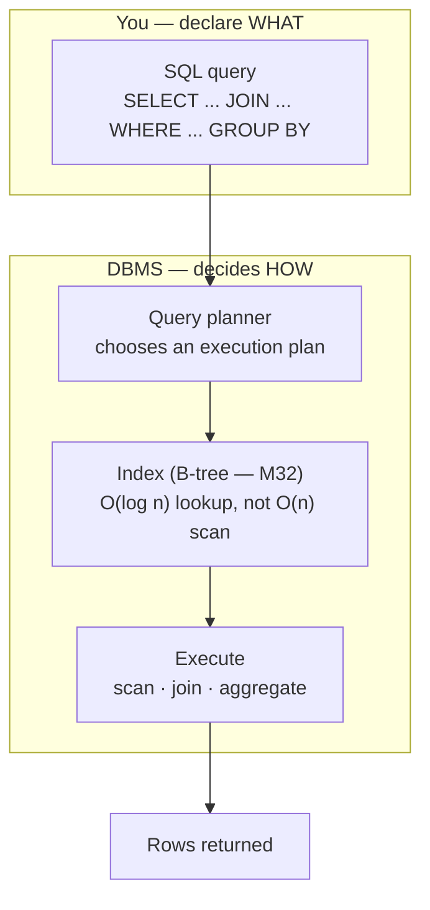
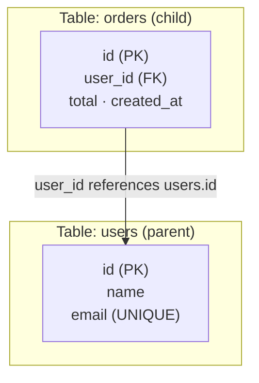

# Module 33 — Databases & SQL

<small>Stage 12 · Data & Software Engineering · ~3 weeks at 4 h/day · Prerequisites — M13 (Python — the client), M30 (sets = relations), M32 (B-trees = indexes), M21 (EXPLAIN = the profiler).</small>

## Why this matters

A **database** is an organized, persistent, queryable store of data managed by a **DBMS** (Database
Management System — the program that stores the data and answers queries about it). The dominant design
is the **relational model**: data lives in **tables** (also called *relations* — a typed set of rows),
where a **row** is one record and a **column** is one attribute of it. Tables are connected by **keys**: a
**primary key** (PK) is the column that uniquely identifies each row, and a **foreign key** (FK) is a
column that *references* another table's primary key — that reference is how one fact links to another
without copying it. You read and change all of this with **SQL** (Structured Query Language — the
declarative language for defining and querying relational data): you say **what** you want and the DBMS
decides **how** to fetch it.

Almost every application is a database with a user interface on top. The curriculum has *persisted* data
everywhere — config files (M15/M16), logs (M24–25), model artifacts (M28) — but always as flat files,
never as a queried, related, transactional store. This module supplies the missing foundation: model a
domain into tables with the right keys; write SQL that joins and aggregates (the single most transferable
data skill there is); **normalize** to avoid the redundancy that corrupts data; reason about
**transactions** and **ACID** when many clients write at once; add the right **index** (a B-tree from M32)
when a query is slow; and know when a relational database is the wrong tool and a **NoSQL** store is right.
Data outlives code — the schema is the most important design decision most systems ever make.

!!! info "What this unlocks"
    This is the persistence layer under everything downstream. **M34** (Big Data) picks up where one
    PostgreSQL machine stops — warehouses, lakes, streams. **M36** (Backend & API) is a thin layer over
    *this* database — ORMs, connection pools, the N+1 trap. **M28**'s Redis cache is finally named for what
    it is: a **key-value** NoSQL store. And the **capstone** service is backed by exactly the kind of
    designed, normalized, indexed schema you build here. Model data well now and every later data module is
    a variation on this one.

---

## Watch

*Watch once, then rely on the notes below — you should never need to rewatch.*

<div class="lo-video-placeholder" markdown="1">
<span class="lo-play">▶</span>
**Explainer video — coming**
<small>Record per <code>../media/README.md</code>, upload to YouTube, then replace this card with the embed.</small>
</div>

??? note "For the author — drop-in YouTube embed (replace VIDEO_ID)"
    Once the explainer is on YouTube, replace the placeholder card above with:
    ```html
    <div class="lo-video-embed">
      <iframe src="https://www.youtube-nocookie.com/embed/VIDEO_ID"
              title="Module 33 — Databases & SQL"
              allow="accelerometer; autoplay; clipboard-write; encrypted-media; gyroscope; picture-in-picture"
              allowfullscreen></iframe>
    </div>
    ```
    Video script beats (from the blueprint's Definition / Analogy / Misconceptions):
    the relational database as a well-run library (shelves = tables, catalog number = primary key, a loan
    slip = a foreign key) → why we split data into related tables (normalization prevents the update
    anomaly) → SQL declares WHAT, the planner decides HOW → transactions and ACID via the bank transfer →
    an index IS M32's B-tree, proven with EXPLAIN → NoSQL and CAP as a workload choice, not a war.

**Terminal cast — pending; record per `../media/README.md`.**

!!! tip "Follow along, don't just watch"
    Open the [Guided Lab](#guided-lab-model-query-and-guard-a-database) in a browser terminal and run each
    statement yourself. Writing SQL by hand — predicting each result before you run it — is the only way
    joins and aggregates ever become yours.

---

## Key Notes

*Standalone. This is the reference you keep.*

### The picture: you declare WHAT, the DBMS decides HOW



SQL is **declarative**: you describe the result you want, not the loop that produces it. The DBMS's
**query planner** figures out the cheapest way to get it — and if there is an **index** on the column you
filter or join on, it navigates straight to the matching rows (a B-tree walk, `O(log n)`) instead of
reading every row (a full scan, `O(n)`). That last sentence is M32 and M21 fused: the query is the hot
path, `EXPLAIN` is the profiler, the index is the fix.

### The relational model — a two-table sketch



A table is M30's **relation** made concrete: a typed set of rows. The **primary key** (`users.id`) gives
each row a unique identity. The **foreign key** (`orders.user_id`) stores *only* the referenced key — so a
customer's details live in exactly one place (`users`) and every order points at them. The three
cardinalities: **one-to-one**, **one-to-many** (one user, many orders — the case above), and
**many-to-many** (resolved with a **junction table** holding two foreign keys). The database enforces
**referential integrity**: you cannot insert an order that references a user who does not exist.

### Normalization — structure that prevents corruption

**Normalization** is the discipline of arranging columns so each fact lives in exactly one place,
eliminating the redundancy that causes **anomalies** (a repeated value that drifts out of sync). You climb
three normal forms:

| Normal form | Requires | Removes |
|---|---|---|
| **1NF** — first normal form | Every value atomic (no lists/repeating groups in a cell); a key | Non-atomic / repeating fields |
| **2NF** — second normal form | 1NF **and** every non-key column depends on the *whole* primary key | Partial dependencies on part of a composite key |
| **3NF** — third normal form | 2NF **and** no non-key column depends on another non-key column | Transitive dependencies |

The payoff is concrete: put a customer's address on every order row and changing it means finding *every*
row or the data lies (an **update anomaly**); you can't record a customer with no order yet (**insert
anomaly**); deleting their last order loses the address (**delete anomaly**). Splitting `customers` out and
referencing it by a foreign key puts the address in one place and all three anomalies vanish.
**Denormalization** — deliberately duplicating data to avoid joins — is the *opposite* move, taken only for
a measured, read-heavy hot path, accepting the redundancy you must now keep in sync.

### SQL — the query skeleton and its logical order

Read a query in this shape; it **executes** in a different order than it reads:

```sql
SELECT   columns, aggregates      -- 5. what to return
FROM     table                    -- 1. the source
JOIN     other ON keys match      -- 2. combine on keys
WHERE    row filter               -- 3. keep rows (before grouping)
GROUP BY columns                  -- 4a. collapse into groups
HAVING   group filter             -- 4b. keep groups (after aggregating)
ORDER BY columns                  -- 6. sort
LIMIT    n;                       -- 7. cap the rows
```

Logical execution order: **FROM → WHERE → GROUP BY → HAVING → SELECT → ORDER BY → LIMIT**. That order is
why you can't reference a `SELECT` alias in `WHERE` (the alias doesn't exist yet), and why **WHERE filters
rows before grouping** while **HAVING filters groups after** (it can test aggregates like `COUNT(*)`).
**DDL** (Data Definition Language — `CREATE`/`ALTER`/`DROP`) defines the schema; **DML** (Data Manipulation
Language — `SELECT`/`INSERT`/`UPDATE`/`DELETE`) reads and changes the data.

### JOINs — the heart of relational querying

A **JOIN** combines rows from two tables where their keys match. The family, drawn as set overlaps (M30):

| Join | Returns | Use when |
|---|---|---|
| **INNER JOIN** | Only rows with a match in *both* tables | You want matched pairs only |
| **LEFT (OUTER) JOIN** | All left rows + matches from the right (NULL where none) | You must keep unmatched left rows (users with zero orders) |
| **RIGHT (OUTER) JOIN** | All right rows + matches from the left | Symmetric to LEFT (rarely needed — flip the tables) |
| **FULL (OUTER) JOIN** | All rows from both, matched where possible | You need every row from either side |

The classic bug: using `INNER` where you needed `LEFT` **silently drops** the unmatched rows (members with
no loans disappear). The other: a `LEFT`/`INNER` on a one-to-many **fans out** — each parent row repeats
once per child. Fix a fan-out with an aggregate + `GROUP BY`, `DISTINCT`, or a subquery — join at the
right *grain*.

### Transactions & ACID — why we trust a database with money

A **transaction** groups statements into one all-or-nothing unit: `BEGIN` … `COMMIT` (make it permanent)
or `ROLLBACK` (undo it all). Transactions give the **ACID** guarantees:

| Letter | Property | Meaning |
|---|---|---|
| **A** | **Atomicity** | The whole transaction happens, or none of it does |
| **C** | **Consistency** | It moves the database from one valid state to another (constraints hold) |
| **I** | **Isolation** | Concurrent transactions don't corrupt each other |
| **D** | **Durability** | Once committed, it survives a crash |

The canonical example: move \$100 from account A to B is two steps (debit A, credit B). Crash between them
without a transaction and the money vanishes or duplicates. Wrap it in `BEGIN … COMMIT` and **atomicity**
guarantees both or neither. Under concurrency, too-low **isolation** allows anomalies (dirty / non-repeatable
/ phantom reads, and lost updates); raising the isolation level — or `SELECT … FOR UPDATE`, or an atomic
`balance = balance - 100` — makes the writes serialize.

### Indexes — M32's B-tree, applied to data at rest

Without an **index**, finding rows matching a value means reading every row — `O(n)`. An index is a
separate data structure (usually a **B-tree** — M32's balanced tree; sometimes a hash) keyed on that
column, so the database navigates straight to the matches in `O(log n)`. The workflow, measured: a slow
query → `EXPLAIN` shows a *sequential scan* → `CREATE INDEX` on the filtered column → `EXPLAIN` now shows an
*index scan* and the time collapses. But an index is **not free speed** — it's a B-tree that must be
maintained on every write, costing write time and disk space. Index the columns queries **filter, join, or
sort on**, not every column.

### Beyond relational — NoSQL and the CAP theorem

**NoSQL** ("not only SQL") is a family of non-relational stores, each trading some relational guarantee for
scale or flexibility: **document** (MongoDB — flexible JSON records), **key-value** (**Redis** — M28's
model-serving cache, now named for what it is), **column-family** (Cassandra — write-scale), and **graph**
(Neo4j — M30/M32's graphs as a database). The **CAP theorem** (Consistency, Availability, Partition
tolerance) says that under a network **partition** you must choose Consistency *or* Availability. Choosing a
store is a **workload** question — strong consistency and complex ad-hoc queries → relational; massive
scale, flexible schema, or one known access pattern → the matching NoSQL — not a fashion. "SQL vs NoSQL"
is a trade-off, not a war: relational databases still run the world's transactional data.

<div class="lo-remember" markdown="1">
**Must remember (if you keep only seven things):**

1. **Tables + keys.** A primary key uniquely identifies a row; a foreign key references another table's PK — that's how facts link without copying.
2. **Normalize so each fact lives once.** 1NF atomic · 2NF no partial-key deps · 3NF no transitive deps — it structurally prevents update/insert/delete anomalies.
3. **SQL is declarative.** You say WHAT; the planner decides HOW. Logical order: FROM → WHERE → GROUP BY → HAVING → SELECT → ORDER BY.
4. **INNER drops unmatched rows; LEFT keeps them.** WHERE filters rows (pre-group); HAVING filters groups (post-aggregate).
5. **Transactions = all-or-nothing (ACID).** BEGIN … COMMIT/ROLLBACK is why we trust databases with money under crashes and concurrency.
6. **An index is a B-tree (M32).** It turns an `O(n)` scan into an `O(log n)` lookup — proven with `EXPLAIN`; it costs writes and space, so index only what you filter/join on.
7. **NoSQL is a workload choice (CAP), not a successor.** Redis is a key-value store; pick relational for integrity + complex queries.
</div>

---

## Guided Lab: model, query, and guard a database

*Basic, step-by-step, in `sqlite3` (zero setup — it ships with Ubuntu/Python). You build a normalized
two-table schema, insert data, run a JOIN with a GROUP BY aggregate, prove a transaction is all-or-nothing,
add an index, and watch a normalization fix. All work lives in a throwaway `~/db-lab/` directory.*

<div class="lo-lab-actions" markdown="1">
[▶ Open interactive lab](https://killercoda.com/learning-os/course/killercoda/module-33){ .lo-btn target=_blank }
[⧉ Open in Codespaces](https://codespaces.new/randaguiac20/learning-os){ .lo-btn target=_blank }
[⌨ Run locally](#run-locally){ .lo-btn .lo-btn--ghost }
[View lab source](https://github.com/randaguiac20/learning-os/tree/main/killercoda/module-33){ .lo-btn .lo-btn--ghost target=_blank }
</div>

<span id="run-locally"></span>
!!! tip "Three ways to run this lab — pick any (all free)"
    - **Instant, no account** — click **Open interactive lab** (Killercoda): a Linux terminal in your browser with `sqlite3` ready.
    - **Your own cloud** — click **Open in Codespaces**: runs in your GitHub account's free tier (120 core-hrs/mo).
    - **Local, unlimited, $0** — any Linux / macOS / WSL terminal with `sqlite3` installed (`apt-get install -y sqlite3`), or a throwaway container: `docker run -it ubuntu bash`, then follow the steps below.

    Killercoda is the zero-setup on-ramp; Codespaces and local use *your own* free resources, so they scale to any class size.

=== "1 · A normalized schema (users + orders, with a foreign key)"
    ```bash
    command -v sqlite3 >/dev/null || { apt-get update -qq && apt-get install -y sqlite3; }
    mkdir -p ~/db-lab
    cat > ~/db-lab/schema.sql <<'SQL'
    PRAGMA foreign_keys = ON;
    CREATE TABLE users (
      id    INTEGER PRIMARY KEY,
      name  TEXT NOT NULL,
      email TEXT NOT NULL UNIQUE
    );
    CREATE TABLE orders (
      id         INTEGER PRIMARY KEY,
      user_id    INTEGER NOT NULL REFERENCES users(id),
      total      REAL    NOT NULL CHECK (total >= 0),
      created_at TEXT    NOT NULL DEFAULT (date('now'))
    );
    SQL
    rm -f ~/db-lab/shop.db
    sqlite3 ~/db-lab/shop.db < ~/db-lab/schema.sql
    sqlite3 ~/db-lab/shop.db ".tables"
    ```
    `users.id` is the **primary key**; `orders.user_id REFERENCES users(id)` is the **foreign key** — the
    one-to-many link. `UNIQUE`, `NOT NULL`, and `CHECK (total >= 0)` are constraints — the schema enforcing
    correctness. Journal: which column can *never* be duplicated, and why?

=== "2 · Insert data — and watch the foreign key reject a bad row"
    ```bash
    sqlite3 ~/db-lab/shop.db <<'SQL'
    PRAGMA foreign_keys = ON;
    INSERT INTO users (id, name, email) VALUES
      (1, 'Ada',   'ada@example.com'),
      (2, 'Linus', 'linus@example.com'),
      (3, 'Grace', 'grace@example.com');
    INSERT INTO orders (user_id, total) VALUES
      (1, 20.00), (1, 35.50), (2, 12.00);
    SQL
    sqlite3 -header -column ~/db-lab/shop.db "SELECT * FROM orders;"
    ```
    Now try to insert an order for a user who does not exist — referential integrity should reject it:
    ```bash
    sqlite3 ~/db-lab/shop.db "PRAGMA foreign_keys = ON; INSERT INTO orders (user_id, total) VALUES (999, 5.00);"
    ```
    You should see `FOREIGN KEY constraint failed` — the database refusing to store a reference to nothing.
    That rejection is the schema doing its job.

=== "3 · A JOIN with a GROUP BY aggregate"
    ```bash
    sqlite3 -header -column ~/db-lab/shop.db "
    SELECT u.name, COUNT(o.id) AS orders, IFNULL(SUM(o.total), 0) AS spent
    FROM users u
    LEFT JOIN orders o ON o.user_id = u.id
    GROUP BY u.id, u.name
    ORDER BY orders DESC;"
    ```
    Predict before you read: Ada has **2** orders (55.50), Linus **1** (12.00), Grace **0**. The **LEFT
    JOIN** is deliberate — Grace has no orders, and an `INNER JOIN` would drop her entirely. `GROUP BY`
    collapses rows per user; `COUNT`/`SUM` aggregate within each group.

    Click **Check** to verify the aggregate is correct.

=== "4 · A transaction (COMMIT and ROLLBACK), then an index"
    A committed transaction is permanent:
    ```bash
    sqlite3 ~/db-lab/shop.db <<'SQL'
    BEGIN;
    INSERT INTO orders (user_id, total) VALUES (3, 8.75);
    COMMIT;
    SQL
    ```
    A rolled-back transaction leaves **no trace** — all-or-nothing:
    ```bash
    sqlite3 ~/db-lab/shop.db <<'SQL'
    BEGIN;
    DELETE FROM orders;
    SELECT COUNT(*) AS during_txn FROM orders;   -- 0: gone inside the txn
    ROLLBACK;
    SELECT COUNT(*) AS after_rollback FROM orders; -- back to 4: undone
    SQL
    ```
    Now add an index on the column joins and filters use, and see the planner pick it:
    ```bash
    sqlite3 ~/db-lab/shop.db "CREATE INDEX IF NOT EXISTS idx_orders_user ON orders(user_id);"
    sqlite3 ~/db-lab/shop.db "EXPLAIN QUERY PLAN SELECT * FROM orders WHERE user_id = 1;"
    ```
    The plan now says `SEARCH orders USING INDEX idx_orders_user` — a B-tree lookup, not a full scan.
    Click **Check** to verify the tables, the foreign key, and the index.

=== "5 · A normalization fix — split the redundant column out"
    First, a deliberately bad wide table that repeats the customer's city on every row:
    ```bash
    sqlite3 ~/db-lab/shop.db <<'SQL'
    CREATE TABLE orders_wide (
      id INTEGER PRIMARY KEY, customer_name TEXT, customer_city TEXT, total REAL
    );
    INSERT INTO orders_wide (customer_name, customer_city, total) VALUES
      ('Ada', 'London', 20.00), ('Ada', 'London', 35.50);
    SQL
    sqlite3 ~/db-lab/shop.db "UPDATE orders_wide SET customer_city = 'Cambridge' WHERE id = 1;"
    sqlite3 -header -column ~/db-lab/shop.db "SELECT * FROM orders_wide;"
    ```
    Ada's two rows now **disagree** on her city — the update anomaly, live. Fix it by moving the repeated
    column into `users` so the city lives **once**, referenced by every order via `user_id`:
    ```bash
    sqlite3 ~/db-lab/shop.db <<'SQL'
    ALTER TABLE users ADD COLUMN city TEXT;
    UPDATE users SET city = 'London' WHERE name = 'Ada';
    DROP TABLE orders_wide;
    SQL
    sqlite3 -header -column ~/db-lab/shop.db "
    SELECT u.name, u.city, COUNT(o.id) AS orders
    FROM users u LEFT JOIN orders o ON o.user_id = u.id
    GROUP BY u.id;"
    ```
    The city is stored in exactly one row of `users`; change it there and every order reflects it through
    the join. That is 3NF's promise — each fact in one place, no anomaly possible.

!!! success "You can stop here and have learned something real"
    If you can design a keyed schema, insert data, run a JOIN with an aggregate, prove a transaction is
    all-or-nothing, add an index the planner uses, and split a redundant column out — the guided lab is
    done. Now make it harder.

---

## Solo Lab: figure it out

*Harder. Goals only — minimal hand-holding. Work against your `~/db-lab/shop.db` (or a fresh one). Model on
paper first, write the SQL by hand, and predict every result before you run it. Reveal a hint only after
you've tried.*

### Challenge 1 — A many-to-many relationship
Extend the schema so a **product** can appear on many **orders** and an order can contain many products.
Name every key.

??? tip "Hint"
    A one-to-many needs one foreign key; a **many-to-many** needs a third table — a *junction* table —
    holding two foreign keys, one to each side.

??? success "Solution"
    ```sql
    CREATE TABLE products (
      id INTEGER PRIMARY KEY, name TEXT NOT NULL, price REAL NOT NULL CHECK (price >= 0)
    );
    CREATE TABLE order_items (
      order_id   INTEGER NOT NULL REFERENCES orders(id),
      product_id INTEGER NOT NULL REFERENCES products(id),
      qty        INTEGER NOT NULL CHECK (qty > 0),
      PRIMARY KEY (order_id, product_id)
    );
    ```
    `order_items` is the junction table: its composite primary key `(order_id, product_id)` is also two
    foreign keys. That resolves the many-to-many — the same shape as `post_tags` for a blog.

### Challenge 2 — "Members above the average order count"
Write one query returning each user whose order count is **strictly greater than the average** order count
across all users.

??? tip "Hint"
    You need a per-user count (GROUP BY), then compare it to a single number — the average count — computed
    in a subquery or a CTE (`WITH`). Remember HAVING filters groups.

??? success "Solution"
    ```sql
    WITH per_user AS (
      SELECT u.id, u.name, COUNT(o.id) AS n
      FROM users u LEFT JOIN orders o ON o.user_id = u.id
      GROUP BY u.id, u.name
    )
    SELECT name, n FROM per_user
    WHERE n > (SELECT AVG(n) FROM per_user)
    ORDER BY n DESC;
    ```
    The CTE computes each user's count once; the outer `WHERE` compares it to the scalar subquery
    `AVG(n)`. (You could inline it, but the CTE reads far cleaner — and avoids recomputing the average.)

### Challenge 3 — Prove the index, don't just claim it
Load enough rows that a full scan is visibly the default, then show `EXPLAIN QUERY PLAN` changing from a
scan to an index search after you add an index.

??? tip "Hint"
    A recursive CTE can generate thousands of rows fast. Run `EXPLAIN QUERY PLAN` on a filtered query
    **before** creating the index (expect `SCAN`), then create it and re-run (expect `SEARCH ... USING
    INDEX`).

??? success "Solution"
    ```sql
    CREATE TABLE big (id INTEGER PRIMARY KEY, k INTEGER, v TEXT);
    WITH RECURSIVE seq(n) AS (SELECT 1 UNION ALL SELECT n+1 FROM seq WHERE n < 50000)
    INSERT INTO big (k, v) SELECT n % 1000, 'x' FROM seq;
    EXPLAIN QUERY PLAN SELECT * FROM big WHERE k = 42;   -- SCAN big
    CREATE INDEX idx_big_k ON big(k);
    EXPLAIN QUERY PLAN SELECT * FROM big WHERE k = 42;   -- SEARCH big USING INDEX idx_big_k
    ```
    That plan change from `SCAN` to `SEARCH ... USING INDEX` is the `O(n) → O(log n)` win made visible —
    M32's B-tree solving M21's "measure, then fix the hot path." In PostgreSQL you'd use `EXPLAIN ANALYZE`
    to see the *timing* collapse too.

### Challenge 4 (the artifact) — Defend a schema + an index win
Design a normalized (3NF) schema for a small domain of your choice (library / blog / store), seed it, and
build a short **query portfolio**: a three-table join, a GROUP BY with HAVING, a subquery or CTE, a
transaction, and the before/after `EXPLAIN` from Challenge 3. Be ready to defend *why these tables and
keys* and *why this index* (which column, the write-cost trade).

??? success "What 'defensible' means"
    The schema is in 3NF and you can name the anomaly each split prevents; every join is at the right grain
    (no fan-out duplicates); the index sits on a column queries actually filter/join on and you can state
    its write cost; and the `EXPLAIN` — not your intuition — is what proves the speedup. This is Level 4 of
    the practice ladder and one half of the module's two artifacts.

### Challenge 5 (stretch) — Break it, then defend it: SQL injection
Show how a query built by string-concatenating user input can be subverted, then give the one correct fix.

??? success "Solution"
    A query built as `"SELECT * FROM users WHERE name = '" + input + "'"` lets an attacker pass
    `' OR 1=1 --`, producing `WHERE name = '' OR 1=1 --'` — which matches **every** row (or worse,
    `; DROP TABLE`). The one correct defense is a **parameterized (prepared) query**: pass the input as a
    bound parameter (`WHERE name = ?`, `(input,)`) so the driver sends it as *data*, never as SQL — it can
    never change the query's structure. Escaping by hand is not a substitute; parameterize, always.

---

## Self-Check

*Close the notes. Answer aloud or in writing **first**, then reveal. Recalling — even when it's hard — is
what builds the memory.*

??? question "Define relation, primary key, foreign key, and SQL — one line each."
    **Relation/table:** a typed set of rows (tuples), each a record with the same columns (M30's relation).
    **Primary key:** a column (or set) that uniquely identifies each row. **Foreign key:** a column
    referencing another table's primary key, encoding a relationship. **SQL:** the declarative language for
    defining and querying relational data.

??? question "What does ACID stand for, one line per letter?"
    **Atomicity** — a transaction happens fully or not at all. **Consistency** — it moves the database from
    one valid state to another (constraints hold). **Isolation** — concurrent transactions don't corrupt
    each other. **Durability** — once committed, it survives a crash.

??? question "What do 1NF, 2NF, and 3NF each remove?"
    **1NF** removes non-atomic (repeating/multi-valued) fields. **2NF** removes partial dependencies on
    *part* of a composite key. **3NF** removes transitive dependencies (a non-key column depending on
    another non-key column). The point of all three: eliminate redundancy so each fact lives once.

??? question "How does an index make a query faster, in M32's terms?"
    Without one, matching a value means scanning every row — `O(n)`. An index is a separate data structure
    (usually a **B-tree** — M32's balanced tree, sometimes a hash) keyed on that column, so the database
    navigates directly to matching rows in `O(log n)`. It's M32's structure applied to data at rest, and
    `EXPLAIN` proves it changed the plan.

??? question "WHERE vs HAVING — what's the difference?"
    **WHERE** filters individual rows *before* grouping. **HAVING** filters *groups* after `GROUP BY`, and
    can reference aggregates. "WHERE age > 18" filters people; "HAVING COUNT(*) > 5" keeps only groups with
    more than five members.

??? question "You have members(id, name) and loans(id, member_id, book_id). Write 'each member and their loan count, most first.'"
    ```sql
    SELECT m.name, COUNT(l.id) AS loan_count
    FROM members m
    LEFT JOIN loans l ON l.member_id = m.id
    GROUP BY m.id, m.name
    ORDER BY loan_count DESC;
    ```
    **LEFT JOIN** so members with zero loans still appear (with count 0); an `INNER JOIN` would drop them.

??? question "A query on a million-row table filtering on `email` takes 40 seconds. What do you do, and what proves it worked?"
    Run `EXPLAIN` (or `EXPLAIN ANALYZE`) — it shows a sequential (full) scan. `CREATE INDEX ON <table>(email);`
    then re-run `EXPLAIN` — it now shows an index scan and the time drops from seconds to milliseconds
    (`O(n) → O(log n)`). `EXPLAIN` is the proof, not intuition (M32/M21).

??? question "A join returns duplicate rows. What's the likely cause?"
    A **fan-out**: joining on a one-to-many (or many-to-many) multiplies rows — each parent appears once per
    matching child. If you only wanted parent rows you're joining at the wrong grain; fix with an aggregate
    + `GROUP BY`, `DISTINCT`, or a subquery.

??? question "Why is 'SQL vs NoSQL' a workload question, not a war?"
    Relational databases run the world's transactional data with ACID and powerful ad-hoc queries; NoSQL
    stores trade some of that for scale or flexible schemas on a *specific* access pattern. Under the CAP
    theorem you weigh consistency vs availability for *your* workload. You choose the store to fit the job —
    relational for integrity + complex queries, the matching NoSQL for scale/flexibility — not by fashion.

!!! example "Teach it back (the real test)"
    Out loud, in **4 minutes, no notes**, to someone who has only ever used spreadsheets: *"What is a
    relational database, and why is it more than a spreadsheet?"* You must use the **library analogy first**
    (shelves = tables, catalog number = primary key, loan slip = foreign key), then explain **normalization**
    with the update-anomaly example, and name **≥2 curriculum bridges** (an index IS M32's B-tree; Redis IS
    a key-value store). Then, in **90 seconds**, walk the bank transfer to justify **transactions/ACID**. If
    you can't yet, that's your signal to reread the Key Notes, not to move on.

---

## Mastery checklist

*Tick these honestly, cold (no notes). They **gate** progress — a module is only "done" when every box is
true.*

- [ ] **Define** relation, primary key, foreign key, and SQL — one line each, cold.
- [ ] **Design** an ER (entity-relationship) model with the right cardinalities (1:1, 1:many, many:many via a junction table).
- [ ] **Write** DDL: `CREATE` tables with primary/foreign keys and constraints (NOT NULL, UNIQUE, CHECK).
- [ ] **Query** with SELECT/WHERE/ORDER BY and modify with UPDATE/DELETE **safely** (SELECT first, WHERE always).
- [ ] **Write** INNER and OUTER joins and say when each is needed (and why INNER silently drops rows).
- [ ] **Aggregate** with GROUP BY/HAVING and distinguish HAVING (groups) from WHERE (rows).
- [ ] **Write** a subquery/CTE and reason about the logical execution order.
- [ ] **Explain and apply** normalization 1NF→3NF, and name the anomaly each split prevents.
- [ ] **Denormalize** deliberately for a measured read-heavy path and justify the trade.
- [ ] **Write** a transaction and explain each ACID letter on the bank-transfer example.
- [ ] **Add** an index, explain it as a B-tree (M32), and use `EXPLAIN` to prove the `O(n)→O(log n)` win.
- [ ] **Explain** the read-speed vs write-cost/space index trade — why you don't index every column.
- [ ] **Describe** the NoSQL families, state the CAP theorem, and choose a store for a given workload.
- [ ] **Recognize** Redis as a key-value store (M28's cache) and diagnose the N+1 query problem.
- [ ] **Demonstrate** SQL injection and fix it with a parameterized query.
- [ ] **Teach** relational modeling, SQL, and the store decision (pass the teach-back above).

---

## Review — lock it in

Spaced repetition is not optional; it's where the memory actually forms. Interleaving stays active — every
M33 review also pulls one item from an earlier module (its structures ARE this module's machinery).
Schedule these and *keep* them:

| When | Do | Interleaved item |
|---|---|---|
| **Day 1** | Flashcards 1–20 · write the "user + order count" query cold · design a fresh 3-table schema with keys | M32: a B-tree keeps lookups `O(log n)` — draw one and trace a search |
| **Day 3** | Normalize a fresh redundant table to 3NF, naming each anomaly · the JOIN family as set diagrams | M30: a relation is a set of tuples — narrate UNION / INTERSECT / EXCEPT |
| **Day 7** | A three-table join + a GROUP BY/HAVING + a subquery from memory · a money-transfer transaction | M32: `O(n)` full scan vs `O(1)` hash lookup — when each applies |
| **Day 14** | Add an index and read `EXPLAIN` before/after · explain each ACID letter on the bank transfer | M21: predict → measure → reconcile, applied to a slow query |
| **Day 30** | Reproduce both artifacts (schema + query portfolio) from scratch · justify one store choice via CAP | M28: Redis named as a key-value store — where the cache sat in serving |

**Connects forward to:** Big Data & Data Architecture (M34 — this OLTP database becomes one end of a
spectrum with warehouses, lakes, and streams) · Backend & API Engineering (M36 — the API is a thin layer
over this database; ORMs, pooling, the N+1 trap) · AI Infrastructure (M28 — Redis, now recognized as a
key-value database) · the Capstone, whose service is backed by a designed, normalized, EXPLAIN-justified
schema (M21 + M32 + M33 together).

!!! quote "The one-sentence takeaway"
    A relational database stores facts as related tables of keyed rows; SQL declares WHAT you want and the
    planner uses an index (M32's B-tree) to fetch it fast; normalization keeps it honest and transactions
    keep it trustworthy — the persistence foundation every later service stands on.
