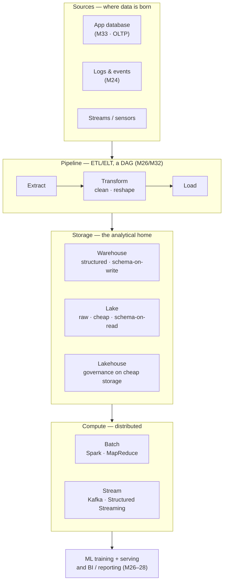

# Module 34 — Big Data & Data Architecture

<small>Stage 12 · Data & Software Engineering · ~2 weeks at 4 h/day · Prerequisite — Module 33 (Databases & SQL — the single-database, transactional world this extends).</small>

## Why this matters

**Big data** is data whose **volume, velocity, or variety** — the classic **"3 Vs"** — exceeds what one
machine or one relational database can comfortably handle. **Data architecture** is how an organization
*stores* and *moves* that data so it can be analyzed and fed to models. Module 33 gave you one
**database** running the application — many small transactions, one machine. This module is the other
half of the data world: the **analytical**, multi-machine side, where a single query scans terabytes and
a **pipeline** assembles the training set for a model.

Everything the curriculum trained and served (M26–M28) is fed by data at a scale one PostgreSQL instance
can't hold — training sets of billions of rows, event streams of millions per second, feature tables
assembled by pipelines. The job of a data/AI engineer is to choose the right **store** (warehouse vs
lake vs lakehouse) for a workload, tell **OLTP** apart from **OLAP** (defined below), decide **batch**
vs **stream**, and design a pipeline that moves and transforms data reliably. This module is the
data-architecture literacy that turns "I can query one database" into "I can architect the data platform
that feeds models" — always chosen by the workload, never by fashion.

!!! info "What this unlocks"
    M35 (SWE Practice) is the discipline that makes M33's database and this module's pipeline
    *trustworthy* — tests, review, requirements — instead of "a script that usually works." · M37 (Cloud
    Platforms) is these exact architectures **as a managed service** (BigQuery, Snowflake, Databricks,
    S3). · M26–M28 (AI/ML) are fed by **feature stores** and **training-data pipelines** built the way
    you'll build one here. **The data platform is the foundation of the model platform** — this module
    is that foundation.

---

## Watch

*Watch once, then rely on the notes below — you should never need to rewatch.*

<div class="lo-video-placeholder" markdown="1">
<span class="lo-play">▶</span>
**Explainer video — coming**
<small>Record per <code>../media/README.md</code>, upload to YouTube, then replace this card with the embed.</small>
</div>

??? note "For the author — drop-in YouTube embed (replace VIDEO_ID)"
    Once the explainer is on YouTube, replace the placeholder card above with:
    ```html
    <div class="lo-video-embed">
      <iframe src="https://www.youtube-nocookie.com/embed/VIDEO_ID"
              title="Module 34 — Big Data & Data Architecture"
              allow="accelerometer; autoplay; clipboard-write; encrypted-media; gyroscope; picture-in-picture"
              allowfullscreen></iframe>
    </div>
    ```
    Video script beats (from the blueprint's Definition / Analogy / Misconceptions):
    the city's knowledge infrastructure (reference library / warehouse district / catalogued district)
    → OLTP vs OLAP as opposite workloads (row vs column) → the storage trio (warehouse / lake /
    lakehouse) and the "swamp" failure → the pipeline (sources → ETL/ELT → store → compute → ML/BI) →
    the distributed-compute idea (MapReduce's map/shuffle/reduce, the shuffle as the cost) →
    the anti-hype judgment: **don't distribute until you must.**

**Terminal cast — pending; record per `../media/README.md`.**

!!! tip "Follow along, don't just watch"
    Open the [Guided Lab](#guided-lab-a-warehouse-on-your-laptop) in a browser terminal and run each
    command yourself as it appears. You'll load a real dataset into an analytics database, run an OLAP
    query, and write columnar Parquet — feeling the concepts, not just reading them.

---

## Key Notes

*Standalone. This is the reference you keep.*

### The picture: the data platform, end to end



Read it left of the arrows as a **flow**: raw data is *born* in sources, a **pipeline** moves and
reshapes it, a **store** holds it in analysis-ready form, a distributed **compute** engine scans it, and
the result feeds **BI** (Business Intelligence — dashboards and reports) and **ML**. Every box below is
one stop on this flow.

### OLTP vs OLAP — the workload split that drives everything

**OLTP** (Online Transaction Processing) is M33's world: many small reads/writes — "insert this order",
"fetch this user" — against a **normalized** (M33), **row-oriented** store. **OLAP** (Online Analytical
Processing) is this module's world: a few **big** scans and aggregations — "total sales per region per
month across five years" — against a **column-oriented** store. They are *opposite* workloads and favor
*opposite* storage:

| | OLTP (M33) | OLAP (M34) |
|---|---|---|
| **Typical query** | one row: "get order #4821" | one column, many rows: "SUM(amount) by month" |
| **Storage layout** | **row**-oriented (a whole record is contiguous) | **column**-oriented (a whole column is contiguous) |
| **Data model** | normalized (many small tables) | denormalized / **star schema** (facts + dimensions) |
| **Read pattern** | small, indexed point lookups | large sequential scans / aggregations |
| **Store** | a database (PostgreSQL) | a **data warehouse** (Snowflake, BigQuery) |

**Why columnar wins for analytics:** an analytical query reads *a few columns across a huge number of
rows* (e.g. `SUM(amount)`). A columnar store keeps each column contiguous, so it reads **only** the
columns it needs and compresses them well — massively less disk I/O (Input/Output — reading bytes from
storage). A row store must touch every row's every column to reach one column. For transactions the
reverse holds: fetching one whole record is one seek in a row store. Each layout matches its access
pattern; using the wrong one multiplies I/O — which is exactly why an OLAP query melts an OLTP database.

### The storage trio — warehouse vs lake vs lakehouse

| | Data **warehouse** | Data **lake** | **Lakehouse** |
|---|---|---|---|
| **Holds** | structured tables | raw data, any format | raw + structured |
| **Schema** | **schema-on-write** (validated going in) | **schema-on-read** (interpreted coming out) | enforced on cheap storage |
| **Cost** | higher | cheap (object storage) | cheap (object storage) |
| **Governance** | built in | **none by default → "swamp" risk** | ACID + governance added |
| **Best for** | structured BI / reporting | dumping cheap, flexible raw data | one platform for BI **and** ML |
| **Example** | Snowflake, BigQuery | S3 + files | Databricks / Delta Lake |

- **Schema-on-write** — the data's shape (columns and types) is *validated as it is loaded*; nothing
  malformed gets in. **Schema-on-read** — data is stored raw and its shape is *applied when you query
  it*; flexible, but nothing guarantees it is correct.
- **ACID** (Atomicity, Consistency, Isolation, Durability — M33's transaction guarantees) is what a
  lakehouse layers onto cheap storage so a half-finished write can't leave the data corrupt.
- A **"data swamp"** is a lake with **no governance** — no schemas, no catalog, no owners, no lineage.
  Data piles up until nobody knows what any dataset means or whether it's correct. Cheap storage without
  governance is a **liability, not an asset**. The **lakehouse** is the fix: warehouse-style trust
  (ACID, schema enforcement, a catalog) on lake-cheap storage, via open columnar formats.

### Parquet — the columnar file format under the lakehouse

**Parquet** is an open **columnar** file format (each column stored contiguously and compressed) — the
on-disk shape that makes a lake or lakehouse behave like a warehouse for scans. Compared with **CSV**
(Comma-Separated Values — a plain-text, *row*-oriented format), Parquet is far smaller (columnar
compression) and far faster for analytics (read only the columns a query touches, skip the rest). It is
the format you'll write in the lab and the reason the lakehouse can be both cheap and fast.

### Partitioning — split the data so a query reads less

**Partitioning** physically splits a dataset into pieces by a key — e.g. one folder per `year` or per
`region`. A query filtered on that key then reads *only the matching partitions* and skips the rest
(**partition pruning**), so it scans far less data. Partitioning is a *data-structure choice* (M32): the
same lesson as an index, applied to files. It also decides how work is divided across machines — the
setup for distributed compute.

### Distributed compute — MapReduce and Spark

When the data is too big for one machine, you split it into **shards** across many machines and run the
computation *where the data lives*. **MapReduce** (Google, 2004) is the paradigm in three phases:

- **map** — each machine transforms its shard into key-value pairs (e.g. each word → `(word, 1)`).
- **shuffle** — pairs are *moved and grouped by key across machines* so each reducer gets all values for
  its keys.
- **reduce** — each machine aggregates the values for its keys (e.g. sum the `1`s → the word's count).

**Apache Spark** (2010) is this same idea made **in-memory** (10–100× faster than MapReduce's
disk-heavy model) and ergonomic — you write **DataFrame** operations (or literally SQL) and Spark
distributes them. Two mechanics to know: **lazy evaluation** (transformations build a *plan*; nothing
runs until an *action* asks for a result) and the **shuffle** — a `groupBy` or `join` moves data between
partitions, and **that data movement is the dominant cost** (M21/M22's "the bottleneck is data
movement", now distributed). Fast Spark means *minimizing the shuffle*: filter early, partition well,
broadcast small tables in a join.

!!! note "A Spark query is M33's SQL, distributed"
    `SELECT region, SUM(amount) FROM sales GROUP BY region` is the same query whether it runs in
    PostgreSQL (M33) on one machine or in Spark across a thousand. The logic is familiar; what changed is
    that the data is **partitioned** across machines and the `GROUP BY` triggers a **shuffle**. Big data
    is not new algorithms — it's your algorithms, distributed.

### Batch vs stream — the latency-vs-complexity trade

| | **Batch** | **Stream** |
|---|---|---|
| **Data** | bounded — a fixed dataset | unbounded — events that never stop |
| **When it runs** | periodically (nightly, hourly) | continuously, per event |
| **Latency** | minutes to a day | milliseconds |
| **Complexity** | simpler (no ordering/state) | hard — state, windowing, late data, exactly-once |
| **Engine** | Spark, MapReduce | Kafka + Structured Streaming, Flink |

A **stream** is "a table that never stops growing." **Kafka** is the durable **event log** most streams
flow through. You pay real engineering complexity — handling out-of-order/late events, **windowing**
(grouping events by time), **event-time vs processing-time**, and **exactly-once** semantics — for lower
latency. So choose stream **only when the latency requirement justifies it**: a nightly fraud batch
catches fraud a day too late (stream it, milliseconds); a daily sales report does not (batch it).

### Pipelines — ETL/ELT as a governed DAG

A **data pipeline** moves data from sources into the store. The classic flow is **ETL** — **Extract**
(read from a source), **Transform** (clean/reshape), **Load** (write to the target). **ELT** swaps the
last two: load raw first, then **Transform inside the warehouse** with SQL — which rose because cloud
warehouses made in-warehouse compute cheap and elastic (the dbt style). Structurally a pipeline is a
**DAG** (Directed Acyclic Graph — tasks with dependencies, run in order; M26/M32's graph *again*),
orchestrated by a tool like **Airflow**. Three properties make it *production-grade*, not "a script":

- **Idempotency** — re-running produces the **same** result, not duplicates. Failures and retries are
  normal in distributed systems, so any step that runs twice must land the same data (overwrite a
  partition, upsert by key). Without it, every retry or backfill silently corrupts the data.
- **Backfill** — the ability to reprocess a **past window** (e.g. re-run last March) safely — which
  requires idempotency.
- **Data-quality check** — a gate that asserts the data is sane (expected schema, row counts, non-null
  keys, ranges) before it's published. This is the **swamp-prevention** gate — a schema is a contract
  (M33) even in a lake.

**Governance** — schemas/contracts, a **catalog** (what a dataset is, who owns it), **lineage** (which
sources and transforms produced it), and **access control / PII** (Personally Identifiable Information)
handling — is what keeps the whole thing an *asset* instead of a swamp, and is a **security** control at
scale (M25): you must know who can touch which data and be able to prove where a number came from.

<div class="lo-remember" markdown="1">
**Must remember (if you keep only seven things):**

1. **Big data = breaks single-machine/single-DB assumptions** (the 3 Vs) — the answer is *distribution +
   new architecture*, not a bigger server.
2. **OLTP (small transactions, row storage) vs OLAP (big scans, column storage)** — opposite workloads,
   opposite stores. Columnar wins for analytics because it reads only the columns you need.
3. **The storage trio:** warehouse (structured/BI) · lake (raw/cheap/**swamp-risk**) · lakehouse
   (governance + ACID on cheap storage — the modern default).
4. **MapReduce = map → shuffle → reduce**; Spark is that in-memory. The **shuffle (data movement) is the
   dominant cost** — filter early, partition well, broadcast small.
5. **Batch (bounded/periodic/simple) vs stream (unbounded/continuous/low-latency/hard)** — pay
   complexity for latency only when the requirement demands it.
6. **A pipeline is a DAG:** Extract → Transform → Load, **idempotent**, backfillable, **quality-checked**
   — plus governance (catalog, lineage, access), or it's a swamp that corrupts silently.
7. **Don't distribute until you must.** A few GB refreshed daily fits a single warehouse (or
   PostgreSQL). Distribution is a cost, not a virtue.
</div>

---

## Guided Lab: a warehouse on your laptop

*Basic, step-by-step. You'll build a real OLAP bench with **DuckDB** — an embedded analytics database
(the "SQLite of analytics": one `pip install`, no server) — generate a dataset, run an aggregate query,
and write columnar **Parquet**. Everything lives in a throwaway `~/bigdata-lab/` directory.*

<div class="lo-lab-actions" markdown="1">
[▶ Open interactive lab](https://killercoda.com/learning-os/course/killercoda/module-34){ .lo-btn target=_blank }
[⧉ Open in Codespaces](https://codespaces.new/randaguiac20/learning-os){ .lo-btn target=_blank }
[⌨ Run locally](#run-locally){ .lo-btn .lo-btn--ghost }
[View lab source](https://github.com/randaguiac20/learning-os/tree/main/killercoda/module-34){ .lo-btn .lo-btn--ghost target=_blank }
</div>

<span id="run-locally"></span>
!!! tip "Three ways to run this lab — pick any (all free)"
    - **Instant, no account** — click **Open interactive lab** (Killercoda): a Linux terminal in your browser.
    - **Your own cloud** — click **Open in Codespaces**: runs in your GitHub account's free tier (120 core-hrs/mo).
    - **Local, unlimited, $0** — any Linux / macOS / WSL terminal, or a throwaway container: `docker run -it ubuntu bash`, then follow the steps below.

    Killercoda is the zero-setup on-ramp; Codespaces and local use *your own* free resources, so they scale to any class size.

=== "1 · Install the bench (DuckDB)"
    ```bash
    apt-get update -qq && apt-get install -y python3-pip   # pip, if not present
    pip install duckdb                                      # the embedded analytics DB
    mkdir -p ~/bigdata-lab && cd ~/bigdata-lab              # throwaway working dir
    python3 -c "import duckdb; print('duckdb', duckdb.__version__)"
    ```
    **DuckDB** is a *column-oriented*, in-process analytics database — a real warehouse engine you run
    without a server. It reads CSV and Parquet directly. Confirm the version prints.

=== "2 · Generate a dataset"
    ```bash
    python3 - <<'PY'
    import csv, random
    random.seed(34)                      # pinned seed → reproducible data
    regions = ["north","south","east","west"]
    with open("sales.csv","w",newline="") as f:
        w = csv.writer(f); w.writerow(["id","region","year","amount"])
        for i in range(100_000):         # 100k rows — awkward to eyeball, easy for OLAP
            w.writerow([i, random.choice(regions), random.choice([2023,2024,2025]),
                        round(random.uniform(10,500),2)])
    print("wrote sales.csv")
    PY
    wc -l sales.csv        # 100001 lines (100k rows + header)
    ls -lh sales.csv       # note the CSV size — you'll compare it to Parquet later
    ```
    You now have 100,000 rows of raw **CSV** — the row-oriented text format. Too many rows to read by
    eye; exactly the shape an OLAP query is for.

=== "3 · Load into DuckDB and run an OLAP aggregate"
    ```bash
    python3 - <<'PY'
    import duckdb
    con = duckdb.connect("warehouse.db")            # a persistent DuckDB file
    con.execute("CREATE OR REPLACE TABLE sales AS SELECT * FROM read_csv_auto('sales.csv')")
    print("rows loaded:", con.execute("SELECT count(*) FROM sales").fetchone()[0])
    # the OLAP query: a big GROUP BY aggregate over all 100k rows
    rows = con.execute("""
        SELECT region, year, round(sum(amount),2) AS total, count(*) AS n
        FROM sales GROUP BY region, year ORDER BY region, year
    """).fetchall()
    for r in rows: print(r)
    PY
    ```
    That `GROUP BY region, year` is **OLAP**: one scan of 100k rows collapsed into 12 aggregate rows —
    the query that would compete with transactions on an OLTP database. Here it's on a columnar engine
    built for it.

    Click **Check** to verify the table loaded and the aggregate is correct.

=== "4 · Write Parquet — compare size and speed vs CSV"
    ```bash
    python3 - <<'PY'
    import duckdb, os, time
    con = duckdb.connect("warehouse.db")
    con.execute("COPY sales TO 'sales.parquet' (FORMAT PARQUET)")   # columnar output
    csv_sz  = os.path.getsize("sales.csv")
    pq_sz   = os.path.getsize("sales.parquet")
    print(f"CSV   : {csv_sz:>9,} bytes")
    print(f"Parquet:{pq_sz:>9,} bytes  ({csv_sz/pq_sz:.1f}x smaller)")
    # time the same aggregate over each format (read the file directly)
    for src in ["sales.csv","sales.parquet"]:
        q = f"SELECT region, sum(amount) FROM read_parquet('{src}') GROUP BY region" \
            if src.endswith("parquet") else \
            f"SELECT region, sum(amount) FROM read_csv_auto('{src}') GROUP BY region"
        t=time.time(); con.execute(q).fetchall(); print(f"{src:14} {time.time()-t:.4f}s")
    PY
    ls -lh sales.csv sales.parquet
    ```
    **Parquet** is columnar and compressed: smaller on disk and faster to scan (it reads only the columns
    the query touches). This is why a lakehouse stores Parquet — cheap *and* fast.

    Click **Check** to verify `sales.parquet` exists and answers the aggregate correctly.

=== "5 · Partition, then a tiny batch ETL script"
    ```bash
    # Partitioned write: one folder per year — a query on year reads only its partition
    python3 - <<'PY'
    import duckdb
    con = duckdb.connect("warehouse.db")
    con.execute("COPY sales TO 'by_year' (FORMAT PARQUET, PARTITION_BY (year))")
    PY
    find by_year -type f          # see year=2023/ year=2024/ year=2025/ subfolders
    # Read back ONE partition — partition pruning means less data scanned
    python3 -c "import duckdb; print(duckdb.sql(\"SELECT count(*) FROM read_parquet('by_year/*/*.parquet') WHERE year=2024\").fetchall())"
    ```
    Now the batch **ETL** in one script — Extract CSV → Transform → Load Parquet:
    ```bash
    cat > etl.py <<'PY'
    import duckdb, os
    con = duckdb.connect()
    # EXTRACT: read the raw CSV source
    con.execute("CREATE TABLE raw AS SELECT * FROM read_csv_auto('sales.csv')")
    # TRANSFORM: filter + aggregate (the reshape) — high-value sales per region/year
    con.execute("""CREATE TABLE mart AS
        SELECT region, year, round(sum(amount),2) AS total, count(*) AS n
        FROM raw WHERE amount >= 100 GROUP BY region, year""")
    # data-quality gate: no NULL keys, expected 12 groups — fail loudly if not
    bad = con.execute("SELECT count(*) FROM mart WHERE region IS NULL OR year IS NULL").fetchone()[0]
    assert bad == 0, "quality check failed: NULL keys"
    # LOAD: idempotent overwrite (re-running produces the same file, no duplicates)
    con.execute("COPY mart TO 'mart.parquet' (FORMAT PARQUET)")
    print("ETL ok — rows:", con.execute("SELECT count(*) FROM mart").fetchone()[0])
    PY
    python3 etl.py
    python3 etl.py     # run twice — idempotent: same result, no duplicates
    ```
    You built the whole loop: a columnar warehouse, an OLAP aggregate, Parquet (smaller + faster than
    CSV), a partitioned read, and an idempotent, quality-checked batch ETL — **the data platform in
    miniature.**

!!! success "You can stop here and have learned something real"
    If you loaded a dataset into a columnar store, ran an OLAP aggregate, wrote and compared Parquet, did
    a partitioned read, and ran an idempotent ETL — the guided lab is done. Now make it harder.

---

## Solo Lab: figure it out

*Harder. Goals only — minimal hand-holding. Work in `~/bigdata-lab/`. Every architecture answer must be
justified by the **workload** (volume/velocity/variety, latency, cost, governance) — never by fashion.*

### Challenge 1 — MapReduce by hand
Implement word-count as **map → shuffle → reduce** in plain Python (no library) over a few sentences.
Name which phase would be the expensive one on a real cluster and why.

??? tip "Hint"
    `map`: each word → `(word, 1)`. `shuffle`: group the pairs by word (a `dict`). `reduce`: sum each
    group. On a cluster the *shuffle* moves data between machines — the network cost.

??? success "Solution"
    ```python
    docs = ["the cat sat", "the dog sat", "the cat ran"]
    pairs = [(w, 1) for d in docs for w in d.split()]     # MAP
    groups = {}
    for w, c in pairs: groups.setdefault(w, []).append(c) # SHUFFLE (group by key)
    counts = {w: sum(cs) for w, cs in groups.items()}     # REDUCE
    print(counts)   # {'the': 3, 'cat': 2, 'sat': 2, 'dog': 1, 'ran': 1}
    ```
    The **shuffle** is the expensive phase: it moves every `(word,1)` pair across the network so each
    reducer gets all values for its words — data movement, the dominant distributed cost (M21/M22).

### Challenge 2 — Prove columnar is smaller
Using your `sales.csv`, write it to Parquet and report the exact size ratio. Then explain, in one
sentence, *why* the columnar file is smaller.

??? success "Solution"
    ```bash
    python3 -c "import duckdb,os; duckdb.sql(\"COPY (SELECT * FROM read_csv_auto('sales.csv')) TO 'c2.parquet' (FORMAT PARQUET)\"); print(os.path.getsize('sales.csv')/os.path.getsize('c2.parquet'))"
    ```
    Parquet stores each **column** contiguously, so similar values sit together and compress far better
    than CSV's row-by-row text — plus it drops CSV's repeated delimiters and per-field text encoding.

### Challenge 3 — Make a non-idempotent load, then fix it
Write a load that **appends** to a Parquet-backed table, run it twice, and show the row count doubled.
Then make it idempotent so a second run leaves the count unchanged.

??? tip "Hint"
    Appending (`INSERT`) on every run duplicates. Idempotency = **overwrite** (or upsert by key) so a
    re-run lands the same data.

??? success "Solution"
    ```python
    import duckdb
    con = duckdb.connect("c3.db")
    # non-idempotent: INSERT appends → run twice, rows double
    con.execute("CREATE TABLE IF NOT EXISTS t(id INT)")
    con.execute("INSERT INTO t SELECT * FROM range(1000)")   # BAD on re-run
    # idempotent fix: CREATE OR REPLACE overwrites — same result every run
    con.execute("CREATE OR REPLACE TABLE t AS SELECT * FROM range(1000)")
    print(con.execute("SELECT count(*) FROM t").fetchone())  # always 1000
    ```
    Re-running the `INSERT` version doubles the count; the `CREATE OR REPLACE` version is **idempotent** —
    the property that makes retries and backfills safe instead of data-corrupting.

### Challenge 4 — A data-quality gate that catches bad data
Add a check to a load that **fails loudly** if the region column contains an unexpected value. Inject one
bad row and show the check catch it.

??? success "Solution"
    ```python
    import duckdb
    con = duckdb.connect()
    con.execute("CREATE TABLE s AS SELECT * FROM read_csv_auto('sales.csv')")
    con.execute("INSERT INTO s VALUES (999999,'atlantis',2024,50.0)")  # bad region
    bad = con.execute("SELECT count(*) FROM s WHERE region NOT IN ('north','south','east','west')").fetchone()[0]
    assert bad == 0, f"quality check failed: {bad} rows with an unknown region"
    ```
    The assert fires — the gate caught `atlantis` before it could pollute the mart. A schema/value
    contract like this is what separates a governed lake from a **swamp**.

### Challenge 5 (stretch) — Choose an architecture and defend it
For a workload of **a few GB of structured sales data refreshed once nightly, queried for BI dashboards**,
choose warehouse / lake / lakehouse and batch / stream — and defend it against "but shouldn't we build a
real-time streaming lakehouse?"

??? success "Solution"
    **A single data warehouse (even PostgreSQL/DuckDB), loaded by a nightly batch job.** Volume is small
    (a few GB), velocity is low (daily), variety is nil (structured), latency need is a day. A streaming
    lakehouse (Kafka + Spark + Delta) adds enormous operational complexity — clusters, exactly-once,
    table maintenance — for scale and latency this workload *doesn't have*. **Don't distribute until you
    must:** recommend the simplest thing that meets the requirement; add a lakehouse only when
    unstructured data and ML actually arrive. Complexity is a cost, not sophistication.

---

## Self-Check

*Close the notes. Answer aloud or in writing **first**, then reveal. Recalling — even when it's hard —
is what builds the memory.*

??? question "What is 'big data', really — and why does it need different architecture than one database?"
    Data whose **volume, velocity, or variety** (the 3 Vs) exceeds what one machine or one relational
    database can handle. The response isn't a bigger server — it's **distributed storage and compute**
    plus new architectures (warehouse/lake/lakehouse, batch/stream, pipelines). "A lot of data" isn't
    the point; *breaking single-machine assumptions* is.

??? question "OLTP vs OLAP — the workloads, and which storage layout each favors?"
    **OLTP** = many small transactions (fetch/insert one record) → **row** storage (a whole record is
    contiguous, one seek). **OLAP** = big scans/aggregations (one column across many rows) → **column**
    storage (read only needed columns, compress well). Opposite workloads, opposite layouts.

??? question "Why does columnar storage win for analytics?"
    An analytical query reads a few columns across huge numbers of rows. Columnar keeps each column
    contiguous, so it reads **only** those columns and compresses them well — far less I/O than a row
    store, which must touch every column of every row to reach one column.

??? question "Warehouse vs lake vs lakehouse — one line each, and what's a 'swamp'?"
    **Warehouse:** structured, schema-on-write, SQL/BI. **Lake:** raw any-format, schema-on-read, cheap
    — but a **swamp** if ungoverned (no schema/catalog/owner → nobody knows what anything means).
    **Lakehouse:** ACID + governance on cheap storage (Parquet/Delta) — the fix, one platform for BI+ML.

??? question "MapReduce's three phases, and which is the expensive one?"
    **map** (each shard → key-value pairs), **shuffle** (group by key **across machines**), **reduce**
    (aggregate per key). The **shuffle** is expensive — it's network **data movement**, the dominant
    distributed cost. Spark is this in memory; minimizing the shuffle is what makes it fast.

??? question "Batch vs stream — when do you choose stream, and what does it cost?"
    Choose **stream** only when the **latency** requirement demands it (fraud in milliseconds, not a
    nightly batch a day late). The cost is much harder engineering: state, out-of-order/late events,
    windowing, event-time vs processing-time, exactly-once. Otherwise **batch** — simpler, bounded.

??? question "What three properties make a pipeline production-grade, not just a script?"
    **Idempotency** (re-run = same result, no duplicates), **backfill** (safely reprocess a past
    window), and a **data-quality check** (schema/row-count/non-null gate — swamp prevention). Plus
    governance (catalog, lineage, access). A script that "usually works" corrupts data silently.

??? question "A team wants a real-time streaming lakehouse for a few GB refreshed daily. Your call?"
    Massive over-engineering. A few GB, daily, structured → a single warehouse (or even PostgreSQL) with
    a nightly batch job. Kafka + Spark + Delta buys latency and scale the workload doesn't need, at huge
    operational cost. **Don't distribute until you must.**

!!! example "Teach it back (the real test)"
    Out loud, in **5 minutes, no notes**, to someone who finished M33 (one database): use the
    **city-knowledge-infrastructure** analogy *first* (reference library = warehouse, warehouse district
    = lake, catalogued district = lakehouse), then (1) OLTP vs OLAP with the row-vs-column reason, (2)
    the distributed-compute idea — **map/shuffle/reduce**, the shuffle as the cost — and (3) pipelines +
    governance, ending on **when a single machine is still the right answer**. Field "isn't more data
    always better?" and "shouldn't everything be real-time?". If you can't yet, that's your signal to
    reread the Key Notes, not to move on.

---

## Mastery checklist

*Tick these honestly, cold (no notes). They **gate** progress — a module is only "done" when every box
is true.*

- [ ] **Define** big data (3 Vs), warehouse, lake, and lakehouse — one line each, cold.
- [ ] **Distinguish** OLTP from OLAP and give the **row-vs-column** reason columnar wins for analytics.
- [ ] **Choose** warehouse / lake / lakehouse for a given workload and justify it by schema, cost, and governance.
- [ ] **Explain** the data-swamp failure and the lakehouse fix (governance + ACID on cheap storage).
- [ ] **Explain** MapReduce (map/shuffle/reduce) and why the work is distributed across machines.
- [ ] **Identify** the **shuffle** as the dominant distributed cost and name three levers to reduce it.
- [ ] **Run** a real OLAP aggregate over a dataset in a columnar store (DuckDB) and read the result.
- [ ] **Write** Parquet and **measure** it smaller and faster than CSV — and say why (columnar).
- [ ] **Partition** a dataset and do a partition-pruned read.
- [ ] **Build** an ETL (Extract → Transform → Load) as a script, made **idempotent** (re-run = no duplicates).
- [ ] **Add** a data-quality check that catches injected bad data before it lands.
- [ ] **Distinguish** ETL from ELT, and batch from stream, choosing each by the workload.
- [ ] **Recognize** over-engineering and state when a single machine / warehouse still suffices.
- [ ] **Connect** big data to the curriculum (M33 SQL/DB, M32 distributed algorithms, M26 DAG, M21/M22 data movement).
- [ ] **Teach** data architecture and the "don't distribute until you must" judgment (teach-back above).

---

## Review — lock it in

Spaced repetition is not optional; it's where the memory actually forms. **Interleaving is active** —
every M34 review also pulls in one Module 33 item (Spark SQL *is* SQL; a warehouse is tables at
analytical scale; OLTP↔OLAP is the pivot). Schedule these and *keep* them:

| When | Do | Interleaved M33 item |
|---|---|---|
| **Day 1** | Flashcards 1–20 · re-derive OLTP-vs-OLAP and why columnar wins | Write one normalized `JOIN` query from memory |
| **Day 3** | Trace MapReduce word-count cold · design a small ETL DAG on paper | Explain a primary key vs a foreign key |
| **Day 7** | Reproduce the full Visual Model blank · choose an architecture for two fresh workloads and defend it | `GROUP BY` + `HAVING` cold on M33's schema |
| **Day 14** | Reduce a shuffle in a Spark/DuckDB job and **measure** it · the governance checklist | Explain an index and when it helps |
| **Day 30** | Reproduce both artifacts (analytics job + pipeline design) from scratch | ACID and what a transaction guarantees |

**Connects forward to:** SWE Practice (M35 — the tests/review discipline that makes this pipeline
trustworthy instead of a script that corrupts silently) · Cloud Platforms (M37 — these architectures as
managed services: BigQuery, Snowflake, Databricks, S3) · AI/ML (M26–M28 — feature stores and
training-data pipelines built exactly this way, the data platform under the model platform).

!!! quote "The one-sentence takeaway"
    M33 taught one database; M34 taught how to store, move, and process data at a scale one database
    can't hold — warehouses, lakes, and lakehouses; batch and stream; distributed compute and governed
    pipelines — always chosen by the workload, never by fashion.
