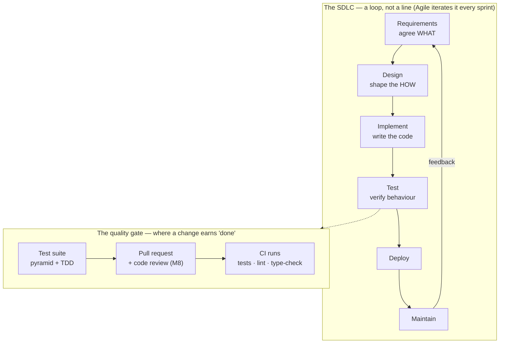
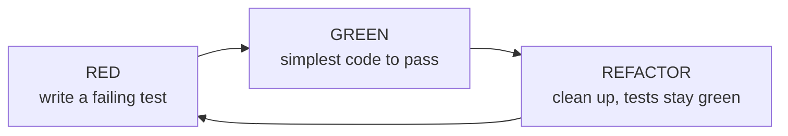

# Module 35 — Software Engineering Practice

<small>Stage 12 · Data & Software Engineering · ~2 weeks at 4 h/day · Prerequisite — Module 08 (Git — where pull requests and CI live) and Module 13 (Python — the code you'll test, design, and refactor).</small>

## Why this matters

**Software engineering** is the disciplined application of *process* to building software so it stays
correct, maintainable, and buildable by a **team** over time — as distinct from just writing code that
runs once. The curriculum has written a *lot* of code — Python (M13), a database (M33), a data pipeline
(M34) — but always as an individual producing an artifact, never inside the professional process that
makes software survive contact with a team, a deadline, and change.

That process has a name and parts. The **SDLC** (Software Development Life Cycle — the phases from idea
to retirement: requirements → design → implementation → testing → deployment → maintenance) is the
skeleton; **Agile** (an iterative, feedback-driven way of working — the 2001 Manifesto) is how modern
teams move through it. **Requirements** capture *WHAT* to build before *HOW*; **design** shapes the HOW
so the system can change; **testing** verifies correctness at levels; and **code review** — through a
pull request (M8) — is the human quality gate. The single practice that most separates professionals
from amateurs is **writing tests**: M34's lesson that "a script that usually works corrupts data
silently" is exactly why. This module supplies that discipline — the practice of quality that turns the
whole stack from a clever prototype into software a team can safely evolve.

!!! info "What this unlocks"
    M36 (Backend & API Engineering — the final Stage 12 module) is built *with* this discipline: designed
    from requirements, built test-first, and merged through review. · The **capstone** is run as a real
    mini-SDLC. · M26–M28 (AI/ML) models get tests and a definition of done. · It also systematizes habits
    the curriculum already planted — M21's "measure, don't guess" (tests measure correctness) and M24's
    threat thinking (review is a security gate). **This is the module that makes everything else
    trustworthy** instead of "a script that usually works."

---

## Watch

*Watch once, then rely on the notes below — you should never need to rewatch.*

<div class="lo-video-placeholder" markdown="1">
<span class="lo-play">▶</span>
**Explainer video — coming**
<small>Record per <code>../media/README.md</code>, upload to YouTube, then replace this card with the embed.</small>
</div>

??? note "For the author — drop-in YouTube embed (replace VIDEO_ID)"
    Once the explainer is on YouTube, replace the placeholder card above with:
    ```html
    <div class="lo-video-embed">
      <iframe src="https://www.youtube-nocookie.com/embed/VIDEO_ID"
              title="Module 35 — Software Engineering Practice"
              allow="accelerometer; autoplay; clipboard-write; encrypted-media; gyroscope; picture-in-picture"
              allowfullscreen></iframe>
    </div>
    ```
    Video script beats (from the blueprint's Definition / Analogy / Misconceptions):
    cooking for yourself vs running a restaurant kitchen (why a team/menu/deadline demands a *system*) →
    the SDLC loop and the cost-of-change curve (~100× cheaper to catch a defect in requirements than in
    production) → requirements as user stories + acceptance criteria (agree WHAT before HOW) → the test
    pyramid and TDD's red → green → refactor (test-first *defines* correct) → code review as a gate AND a
    teaching channel → the definition of done: tests pass, reviewed, documented.

**Terminal cast — pending; record per `../media/README.md`.**

!!! tip "Follow along, don't just watch"
    Open the [Guided Lab](#guided-lab-a-real-tdd-cycle) in a browser terminal and run each command
    yourself as it appears. You'll write a failing test *first*, make it pass, catch a real bug with an
    edge-case test, and review your own diff — feeling the discipline, not just reading it.

---

## Key Notes

*Standalone. This is the reference you keep.*

### The picture: the professional process, end to end



Read the top loop as the life of any change: you agree **WHAT** (requirements), shape the **HOW**
(design), write the code, **test** it, ship it, and maintain it — then feedback sends you round again.
Modern teams don't do this once end to end (that's **Waterfall** — plan everything, then build); they
iterate the loop in short cycles (**Agile**). The bottom cluster is the *quality gate* every change
passes before it merges: a **test suite**, a **pull request** (a proposed change, opened for review —
M8) with a human **code review**, and **CI** (Continuous Integration — a server that runs the tests,
linter, and type-checker automatically on every push). Nothing is "done" until it clears that gate.

### The SDLC and the cost-of-change curve

The reason process pays for itself: a defect gets roughly an order of magnitude more expensive for every
phase it survives undetected. A misunderstanding caught in a requirements conversation costs a sentence;
the same defect found in production costs an incident, a hotfix, and lost trust.

| SDLC phase | What happens here | Relative cost to fix a defect caught here |
|---|---|---|
| **Requirements** | agree WHAT — user stories + acceptance criteria | **1×** (a sentence) |
| **Design** | shape the HOW — modules, interfaces, decisions | ~3× |
| **Implementation** | write the code | ~5× |
| **Test** | verify behaviour (the pyramid, below) | ~10× |
| **Deploy / Production** | ship it and run it for real | **~100×** (an incident) |
| **Maintain** | change and fix it over its life | compounds with every untested edit |

The lesson: process **front-loads cheap prevention**. "We don't have time to write requirements/tests"
is almost always false economy — it's M34's silent-data-corruption lesson generalized.

### Waterfall vs Agile — and Scrum/Kanban

| | **Waterfall** | **Agile** (the default for most software) |
|---|---|---|
| **Shape** | sequential — plan everything, then build | iterative — short cycles with feedback |
| **Feedback** | only at the end (high risk if requirements were wrong) | every sprint (misunderstandings caught early) |
| **Fits** | fixed, well-understood requirements (some regulated/hardware work) | evolving requirements (most software) |

**Agile** is defined by the 2001 Manifesto's four values — each an *X **over** Y* (it values the right,
but prioritizes the left): individuals and interactions **over** processes and tools; working software
**over** comprehensive documentation; customer collaboration **over** contract negotiation; responding
to change **over** following a plan. Its common frameworks: **Scrum** (Schwaber & Sutherland — work in
fixed-length **sprints** with defined roles and ceremonies) and **Kanban** (continuous flow with **WIP**
limits — Work In Progress, the cap on how many items are "in flight" at once). The point is *feedback
and flow*, not ceremony worship.

| Scrum ceremony | Cadence | Purpose | Solo-practice analogue |
|---|---|---|---|
| **Sprint planning** | start of a sprint | pick backlog items to build this cycle | choose the week's feature |
| **Daily standup** | daily | sync + surface blockers | a daily note to yourself |
| **Sprint review** | end of a sprint | show *working software* to stakeholders | demo the merged feature |
| **Retrospective** | end of a sprint | improve the *process* itself | the Solo Lab's retro |

### Requirements — agree WHAT before HOW

Ambiguous requirements are the #1 cause of failed projects (two people build different things from the
same vague ask). The discipline: **functional** requirements (what the system does) and
**non-functional** requirements (how *well* — speed, security, usability), written as a **user story**
with explicit **acceptance criteria** — the testable conditions for "done."

| Piece of a user story | Template | Example |
|---|---|---|
| **Role** | "As a …" | As a library member |
| **Goal** | "I want …" | I want to search books by title |
| **Benefit** | "so that …" | so that I find one without browsing |

**Acceptance criteria** for that story: (1) a full or partial title returns all matching books,
case-insensitively; (2) a search matching nothing returns an empty result with a "no matches" message,
not an error. Each criterion is directly *testable* — this is the bridge to Week 2: **acceptance
criteria become your tests**.

### Design — for change, not just for "works"

Code is **read and modified far more than it is written**, so design targets *change*. The core moves:
**modularity** and **separation of concerns** (isolate input/output from logic), low **coupling** (parts
depend on each other as little as possible) and high **cohesion** (each part does one clear thing), and
the **SOLID** principles — of which the first, **SRP** (Single Responsibility Principle — a module
should have one reason to change), does most of the work. Record a real decision in an **ADR**
(Architecture Decision Record — a short note: the decision and its rationale, for future-you). And treat
**technical debt** (a shortcut taken to move faster now) as a *deliberate, tracked* loan — documented in
a TODO/ticket/ADR — never a hidden, accidental leak.

### The test pyramid

**Testing** verifies correctness at levels, and the *shape* matters: many fast tests at the base, few
slow ones at the top — so feedback is fast. Read it bottom-up.

| Layer | How many | Speed | Scope | What it catches |
|---|---|---|---|---|
| **End-to-end (E2E)** | few | slow | the whole system, as a user | user-visible flows breaking |
| **Integration** | some | medium | components together (e.g. code + M33's database) | wiring / interface bugs |
| **Unit** | many | fast | one function, isolated | logic bugs and edge cases |

The anti-pattern is the **"ice-cream cone"** — many slow E2E tests and few unit tests, so the suite is
slow and flaky and nobody runs it. **Coverage** (the percentage of lines/branches your tests execute) is
a *signal*, not a target: use it to *find* untested branches, but never chase 100% — you can execute
every line while asserting nothing. Judge a suite by whether it checks real *behaviour* and *edge cases*
(empty, boundary, error), not by its coverage number.

### TDD — write the failing test first

**TDD** (Test-Driven Development) inverts the usual order: write the test *before* the code, in a tight
three-step loop.



- **RED** — write a failing test for the next behaviour (run it, *watch it fail* — proving the test can
  fail).
- **GREEN** — write the simplest code that makes it pass.
- **REFACTOR** — improve the code with the test protecting you, then repeat for the next behaviour.

Writing the test first **defines "correct" before you code**, keeps you testing *behaviour* not
implementation, guarantees the code is testable, and makes later refactoring *fearless* — the test
catches any regression. It's the practice that most separates professionals from amateurs. The Python
tool is **pytest**: plain `assert`-based tests, **fixtures** (shared setup), **parametrize** (many cases
from one test), and **mocking** (`monkeypatch` / `unittest.mock` — replace a slow or external dependency
with a stand-in so a *unit* test stays isolated).

### Code review and the definition of done

A **pull request** (M8) is where a proposed change is opened for **code review** — a teammate reads the
diff before it merges. Review is both a *quality gate* and a *teaching channel*: tests verify what you
*anticipated*; review catches what you *didn't* — unclear names, subtle logic gaps, missing edge cases,
poor design — and spreads knowledge across the team. Review the **code, not the coder** (egoless
engineering). Keep **PRs small**: a reviewer can hold a small change in their head and give it real
scrutiny; a 2,000-line PR gets a rubber stamp and defects slip through. A **CI** run (tests + `ruff`
lint + `mypy` type-check) automates the mechanical part of the gate. And a change is only **done** when
the team's **definition of done** is met — not when "it works on my machine."

<div class="lo-remember" markdown="1">
**Must remember (if you keep only seven things):**

1. **Process turns code into software.** The SDLC (requirements → design → implement → test → deploy →
   maintain) is the loop; Agile iterates it with feedback. Cooking for yourself vs running a kitchen.
2. **The cost-of-change curve:** a defect gets ~10× costlier per phase it survives (~100× in
   production). Process front-loads cheap prevention — "no time for tests" is false economy (M34).
3. **Agree WHAT before HOW.** Ambiguous requirements are the #1 project killer; a **user story +
   acceptance criteria** is the cheapest defect prevention — and the criteria *become the tests*.
4. **Design for change** (code is read/modified ≫ written): modular, separation of concerns, SRP, low
   coupling / high cohesion; track technical debt, don't hide it.
5. **The test pyramid:** many fast **unit** tests, fewer **integration**, few slow **E2E**. Coverage is
   a **signal, not a target** — verify behaviour and edge cases, not lines executed.
6. **TDD = RED → GREEN → REFACTOR.** Write the failing test *first*: it defines "correct" and makes
   refactoring fearless. `pytest`: assert · fixtures · parametrize · mock.
7. **Code review through a small PR (M8)** catches what tests can't and spreads knowledge; a change is
   **done** only when tests pass, CI is green, it's reviewed, and it's documented.
</div>

---

## Guided Lab: a real TDD cycle

*Basic, step-by-step. You'll live the professional loop on a real Python function: write a **failing**
pytest test first (RED), implement it (GREEN), then catch a genuine bug with an **edge-case** test and
fix it — committing atomically with git and reviewing your own diff along the way. Everything lives in a
throwaway `~/tdd-lab/` directory.*

<div class="lo-lab-actions" markdown="1">
[▶ Open interactive lab](https://killercoda.com/learning-os/course/killercoda/module-35){ .lo-btn target=_blank }
[⧉ Open in Codespaces](https://codespaces.new/randaguiac20/learning-os){ .lo-btn target=_blank }
[⌨ Run locally](#run-locally){ .lo-btn .lo-btn--ghost }
[View lab source](https://github.com/randaguiac20/learning-os/tree/main/killercoda/module-35){ .lo-btn .lo-btn--ghost target=_blank }
</div>

<span id="run-locally"></span>
!!! tip "Three ways to run this lab — pick any (all free)"
    - **Instant, no account** — click **Open interactive lab** (Killercoda): a Linux terminal in your browser.
    - **Your own cloud** — click **Open in Codespaces**: runs in your GitHub account's free tier (120 core-hrs/mo).
    - **Local, unlimited, $0** — any Linux / macOS / WSL terminal, or a throwaway container: `docker run -it ubuntu bash`, then follow the steps below.

    Killercoda is the zero-setup on-ramp; Codespaces and local use *your own* free resources, so they scale to any class size.

=== "1 · Set up the bench (pytest + git)"
    ```bash
    apt-get update -qq && apt-get install -y python3-pip git   # pip + git, if not present
    pip install pytest                                          # the test runner
    mkdir -p ~/tdd-lab && cd ~/tdd-lab                          # throwaway project dir
    git init -q && git config user.email you@example.com && git config user.name "You"
    python3 -m pytest --version                                 # confirm pytest is installed
    ```
    You now have a real repo (**git**, M8) and **pytest** in place. Everything from here happens inside
    `~/tdd-lab/` — a sandbox you can delete when you're done.

=== "2 · RED — write the failing test first"
    Before any implementation, describe the *behaviour* you want as tests. Our function is a price
    calculator: `final_price(base, discount_pct, tax_pct=0)`. Write the tests **first**:
    ```bash
    cat > test_pricing.py <<'PY'
    from pricing import final_price

    def test_applies_discount():
        assert final_price(100, 10) == 90.0          # 10% off 100

    def test_adds_tax():
        assert final_price(100, 0, tax_pct=10) == 110.0   # +10% tax
    PY
    ```
    Now a stub that *deliberately* isn't implemented, so the tests fail for the right reason:
    ```bash
    cat > pricing.py <<'PY'
    def final_price(base, discount_pct, tax_pct=0):
        raise NotImplementedError   # RED: no logic yet
    PY
    python3 -m pytest -v            # watch both tests FAIL — this is RED
    ```
    Seeing the test fail *first* proves the test can actually catch a problem. A test that has never been
    red is a test you don't trust.

=== "3 · GREEN — implement to pass"
    Write the **simplest** code that makes the tests pass — no more:
    ```bash
    cat > pricing.py <<'PY'
    def final_price(base, discount_pct, tax_pct=0):
        discounted = base * (1 - discount_pct / 100)
        return round(discounted * (1 + tax_pct / 100), 2)
    PY
    python3 -m pytest -v            # both tests PASS — this is GREEN
    ```
    Now that it's green, make an **atomic commit** — one logical change, message says *why*:
    ```bash
    git add pricing.py test_pricing.py
    git commit -q -m "Add final_price: discount + tax (TDD, tests green)"
    ```
    **RED → GREEN** complete: you defined "correct" as tests *before* writing the code.

    Click **Check** to verify the suite is green with at least two tests.

=== "4 · An edge case that catches a bug"
    Tests are only as good as the cases you think of. What about a discount *over* 100%? Add an
    edge-case test using **parametrize** (many cases from one test):
    ```bash
    cat >> test_pricing.py <<'PY'

    import pytest

    @pytest.mark.parametrize("base,discount,expected", [
        (50, 100, 0.0),   # a full discount → free
        (50, 150, 0.0),   # a >100% discount must NOT make the price negative
    ])
    def test_discount_never_makes_price_negative(base, discount, expected):
        assert final_price(base, discount) == expected
    PY
    python3 -m pytest -v    # the (50, 150) case FAILS: it returns -25.0 — a real bug!
    ```
    The test caught a bug your first tests missed: `50 * (1 - 1.5) = -25.0`. Fix the implementation to
    **clamp** the discount into a sane range:
    ```bash
    cat > pricing.py <<'PY'
    def final_price(base, discount_pct, tax_pct=0):
        discount_pct = min(max(discount_pct, 0), 100)   # clamp to [0, 100]
        discounted = base * (1 - discount_pct / 100)
        return round(discounted * (1 + tax_pct / 100), 2)
    PY
    python3 -m pytest -v    # all tests GREEN again — bug fixed, edge case covered
    git commit -q -am "Fix: clamp discount to [0,100] so price can't go negative (+ edge-case test)"
    ```
    This is the everyday loop: an edge case reveals a bug, a test pins it, the fix makes it green — and
    the test stays as a **regression test** so the bug can never silently return.

    Click **Check** to verify the edge-case test exists, the suite is green, and the fix holds.

=== "5 · Refactor + review your own diff"
    With a green suite guarding you, refactoring is **safe**. Read your change as a stranger would —
    `git diff` shows what a reviewer would see — then run a lightweight **code-review checklist** over it:
    ```bash
    git log --oneline           # your atomic commits, each one logical change
    git show --stat HEAD        # what the last commit touched
    python3 -m pytest -q        # the WHOLE suite, one command, fast (the pyramid pays off)
    ```
    Apply this checklist to your own code (comment on the **code, not the coder**):

    - **Correctness** — do the tests trace to the requirements? Is every branch covered?
    - **Edge cases** — empty / boundary / error handled and *tested*? (the >100% discount was one)
    - **Readability** — do the names say what they mean? Would a stranger follow it?
    - **Design** — one responsibility per function? Anything over-engineered (YAGNI — *You Aren't Gonna
      Need It*)?
    - **Tests** — do they assert real behaviour, or just run lines without checking anything?

    In real work this diff goes on a **branch** and into a **pull request** (M8), where CI runs `pytest`
    + `ruff` + `mypy` and a teammate reviews it before it merges — the automated + human quality gate.

!!! success "You can stop here and have learned something real"
    If you wrote a failing test first, made it pass, caught a real bug with an edge-case test, fixed it
    under the test's protection, and reviewed your own diff — the guided lab is done. Now make it harder.

---

## Solo Lab: figure it out

*Harder. Goals only — minimal hand-holding. Work in `~/tdd-lab/`. The laws of the module: agree WHAT
before HOW; write the test **before** the code; a change isn't "done" until its tests pass and it's been
reviewed. Struggle here is the point; reveal a hint only after you've tried.*

### Challenge 1 — Turn a vague ask into a testable requirement
Take the vague feature "let users search the library" and write it as **one user story** (role / goal /
benefit) with **two acceptance criteria** — one functional, one non-functional — concrete enough that a
second person would build the same thing.

??? tip "Hint"
    Non-functional = *how well*, not *what* (speed, case-insensitivity, error behaviour). Kill every
    "should be fast/nice" — make each criterion a condition you could write an `assert` for.

??? success "Solution"
    **Story:** *As a library member, I want to search books by title so that I can find one without
    browsing.* **Acceptance criteria:** (1, functional) entering a full or partial title returns all
    books whose title contains that text, **case-insensitively**; (2, non-functional) a search matching
    nothing returns an *empty result with a "no matches" message* (not an error), in under 200 ms.
    Each maps directly to a test — the WHAT becomes the assertions.

### Challenge 2 — Prove a test can be worthless
Write a pytest test that **executes** `final_price` but **asserts nothing meaningful**, so it passes and
adds "coverage" while verifying no behaviour. Then say how a reviewer would catch it.

??? success "Solution"
    ```python
    def test_runs_but_verifies_nothing():
        final_price(100, 10)     # no assert — passes, proves nothing
        assert True              # trivially true
    ```
    It inflates coverage (the line ran) while checking nothing — **false confidence**. A reviewer catches
    it by *reading the assertions, not the coverage number*; a **mutation check** also exposes it (break
    the code and this test still passes). Coverage is a signal, not a target.

### Challenge 3 — TDD a new behaviour, strictly
Add a **minimum price floor**: no matter the discount, `final_price` never returns below a `floor`
argument (default 0). Do it **TDD-first** — failing test, then code — and keep the old tests green.

??? tip "Hint"
    Write `test_respects_floor()` asserting `final_price(50, 100, floor=5) == 5.0` *before* touching
    `pricing.py`. Watch it fail (RED), then add the parameter and a `max(..., floor)` (GREEN).

??? success "Solution"
    ```python
    # test first (RED)
    def test_respects_floor():
        assert final_price(50, 100, floor=5) == 5.0
    ```
    ```python
    # then implement (GREEN)
    def final_price(base, discount_pct, tax_pct=0, floor=0):
        discount_pct = min(max(discount_pct, 0), 100)
        discounted = base * (1 - discount_pct / 100)
        priced = round(discounted * (1 + tax_pct / 100), 2)
        return max(priced, floor)
    ```
    The pre-existing tests still pass (`floor=0` changes nothing), so the new behaviour was added
    *without fear* — that's what the suite buys you.

### Challenge 4 — Catch a flaky test
Write a test that sometimes passes and sometimes fails depending on time or randomness, explain *why*
that's forbidden, and fix it so it's deterministic.

??? tip "Hint"
    A test that calls `random`/`datetime.now()` without pinning them is non-deterministic. The fix is the
    same **idempotency** discipline as M34's pipelines: remove the non-determinism (seed it, or mock it).

??? success "Solution"
    ```python
    import random
    def test_flaky():                       # BAD: passes ~half the time
        assert random.randint(0, 1) == 1
    def test_deterministic():               # FIX: pin the randomness
        random.seed(0)
        assert random.randint(0, 1) == 1    # same every run
    ```
    A flaky test depends on order/time/randomness/external state — it destroys trust in the whole suite
    (people ignore a red that "usually" goes away). Isolate it: fresh fixtures, no shared mutable state,
    and mock time/randomness/network so the test is deterministic.

### Challenge 5 (stretch) — Answer "skip the tests, ship today"
A manager says: *"Skip the tests and the review, we need to ship today."* Respond as a **professional** —
in three sentences — surfacing the real cost and offering a path, not just complying or refusing.

??? success "Solution"
    "Skipping tests and review to save an hour risks a production defect that costs ~100× more to fix
    (the cost-of-change curve) plus the incident and lost trust — and it leaves code no one can safely
    change. Let's ship a *smaller, tested slice* today, keep the critical-path tests and a quick review,
    and defer the rest with a tracked ticket. If we truly must cut it, let's make the risk explicit and
    decide it together — I won't silently own the consequences." A professional *surfaces the trade*
    rather than quietly eating the risk.

---

## Self-Check

*Close the notes. Answer aloud or in writing **first**, then reveal. Recalling — even when it's hard —
is what builds the memory.*

??? question "Walk the SDLC and the cost-of-change curve — what does the curve imply?"
    **SDLC:** requirements → design → implement → test → deploy → maintain, and it **loops** (Agile
    iterates it). **Curve:** a defect costs ~10× more per phase it survives (~100× in production). It
    implies front-loaded prevention — clear requirements, tests, review — is far cheaper than late
    detection: **process pays for itself.** "No time for tests" is false economy (M34's silent corruption).

??? question "State Agile's four values (the form) and one thing 'Agile' does NOT mean."
    Each is *X **over** Y*: individuals/interactions **over** processes/tools; **working software over
    comprehensive documentation**; customer collaboration **over** contract negotiation; responding to
    change **over** following a plan. It does **not** mean *no planning or documentation* — Agile
    prioritizes working software and change; it still plans (per sprint) and documents what's useful.

??? question "Draw the test pyramid and say why it's that shape."
    Base = many fast **unit** tests (one function, isolated); middle = fewer **integration** tests
    (components together, e.g. code + M33's DB); top = few slow **E2E** tests (whole system). The shape
    puts fast feedback at the base; the anti-pattern is the **ice-cream cone** — too many slow E2E tests.

??? question "Explain TDD's red-green-refactor and why writing the test first helps."
    **RED:** write a failing test for the next behaviour. **GREEN:** simplest code to pass. **REFACTOR:**
    clean up under the test's protection; repeat. Test-first **defines "correct" before you code**, keeps
    you on *behaviour* not implementation, guarantees testability, and makes refactoring **fearless** (the
    test catches regressions).

??? question "Why is coverage a signal, not a target?"
    Coverage counts *lines/branches executed*, not *behaviours verified* — you can run every line while
    asserting nothing. High coverage of trivial code proves little, and chasing 100% wastes effort. Use
    it to *find untested branches* (a signal); judge quality by whether tests check real behaviour and
    edge cases.

??? question "What does code review catch that tests can't — and why keep PRs small?"
    Tests verify what you *anticipated*; review catches what you *didn't* — unclear names, subtle logic
    gaps, missing edge cases, poor design — and it **spreads knowledge**. Small PRs get **real** scrutiny
    (a reviewer holds them in their head); giant PRs get **rubber-stamped**, so small changes are a
    quality practice.

??? question "A suite has 100% coverage but a bug shipped. How is that possible?"
    Coverage measures executed lines, not verified behaviours: the tests may run every line while
    asserting little or nothing meaningful, or the bug is in an unanticipated behaviour/edge case or an
    interaction no test checked. **100% coverage ≠ correctness** — it's false confidence.

??? question "What must be true for a feature to be 'done'?"
    It meets its **acceptance criteria**; it has **tests** across the pyramid that **pass**; **CI is
    green** (tests + lint + type-check); it's been **reviewed** and approved via a PR; it's
    **documented** (docstrings/README/ADR); and it's **merged**. Not "it works on my machine."

!!! example "Teach it back (the real test)"
    Out loud, in **5 minutes, no notes**, to a capable coder (M13) who has never worked on a team or
    written a test: use the **cooking-for-yourself vs running-a-restaurant-kitchen** analogy *first* (why
    a team/menu/deadline needs a *system*), then (1) the SDLC + cost-of-change (~100×), (2) TDD and the
    test pyramid — actually *do* a red-green-refactor cycle on a tiny function and say why test-first
    defines "correct", and (3) code review + the definition of done. Field *"isn't testing a waste of
    time?"* and *"isn't Agile just no planning?"*, and connect to M8 (PRs/CI), M13 (the code), M33/M34
    (what gets tested), M24 (quality-as-security). If you can't yet, that's your signal to reread the Key
    Notes, not to move on.

---

## Mastery checklist

*Tick these honestly, cold (no notes). They **gate** progress — a module is only "done" when every box
is true.*

- [ ] **Describe** the SDLC phases and the cost-of-change curve (~100× in production), cold.
- [ ] **Compare** Waterfall and Agile and say when each fits; **state** the Agile Manifesto's four values.
- [ ] **Explain** Scrum's sprints, roles, and ceremonies (planning / standup / review / retro).
- [ ] **Write** a user story with concrete, testable acceptance criteria; **distinguish** functional from non-functional.
- [ ] **Refactor** a function for modularity / separation of concerns / SRP, and reason about coupling and cohesion.
- [ ] **Write** an ADR for a real decision and **track** a piece of technical debt deliberately.
- [ ] **Explain** the test pyramid and its shape, and name the ice-cream-cone anti-pattern.
- [ ] **Write** unit tests in pytest (assert / fixtures / parametrize) and one integration test (code + M33's DB).
- [ ] **Practice** TDD's red-green-refactor and **use** mocking to isolate a unit.
- [ ] **Use** coverage as a signal (find gaps), not a target; **test** edge cases (empty / boundary / error).
- [ ] **Conduct** a code review via a PR (give and receive), and **explain** why small PRs matter.
- [ ] **Wire** CI to run tests + lint + type-check on a PR (M8); **define and apply** a definition of done.
- [ ] **Diagnose** a flaky and an assert-nothing test, and say how each is dangerous.
- [ ] **Explain** quality-as-security (a security fix ships with a regression test — M24) and responsible technical-debt judgment.
- [ ] **Teach** why process, tests, and review turn code into software (teach-back above, with a live TDD cycle).

---

## Review — lock it in

Spaced repetition is not optional; it's where the memory actually forms. **Interleaving is active** —
every M35 review also pulls in one Module 34 item (the pipeline this discipline now makes *trustworthy*;
tests are the answer to M34's "a script that usually works corrupts data silently"). Reviews are
*writing tests and reviewing code*, not re-reading. Schedule these and *keep* them:

| When | Do | Interleaved M34 item |
|---|---|---|
| **Day 1** | Flashcards: SDLC · cost-of-change · Agile's four values · the TDD loop · definition of done | Re-derive OLTP vs OLAP and why columnar wins for analytics |
| **Day 3** | Do a red-green-refactor cycle cold on a fresh function; turn a vague ask into a story + acceptance criteria | Trace MapReduce word-count (map → shuffle → reduce) — which phase is the cost? |
| **Day 7** | Reproduce the full process picture blank; review a real PR (yours or open-source) against the checklist | Choose warehouse / lake / lakehouse for a workload and defend it |
| **Day 14** | Add tests (incl. edge cases) to a piece of untested code; check it against the definition of done | Make a load **idempotent** (re-run = no duplicates) and explain why it matters |
| **Day 30** | Reproduce the mini-SDLC on a new small feature: story → design/ADR → TDD tests → reviewed PR → retro | Recognize over-engineering — when a single machine / warehouse still suffices |

**Connects forward to:** Backend & API Engineering (M36 — the final Stage 12 module, built test-first,
reviewed, and CI-gated by default, tying the stage together by serving a model over a database) · AI/ML
(M26–M28 — models get tests, a definition of done, and reproducibility) · the **capstone**, run as a
real mini-SDLC. Back to **M8** (Git — where pull requests and CI live), **M13** (the code under test),
**M33/M34** (the database and pipeline that now get tested), **M24** (quality-as-security), and **M21**
("measure, don't guess", now a systematic practice of quality).

!!! quote "The one-sentence takeaway"
    M34 taught how to move and store data at scale; M35 taught the discipline that makes that code
    professional software — requirements before code, design for change, tests and TDD across the
    pyramid, and code review through M8's pull requests — the practice of quality that turns a clever
    prototype into a durable team asset.
