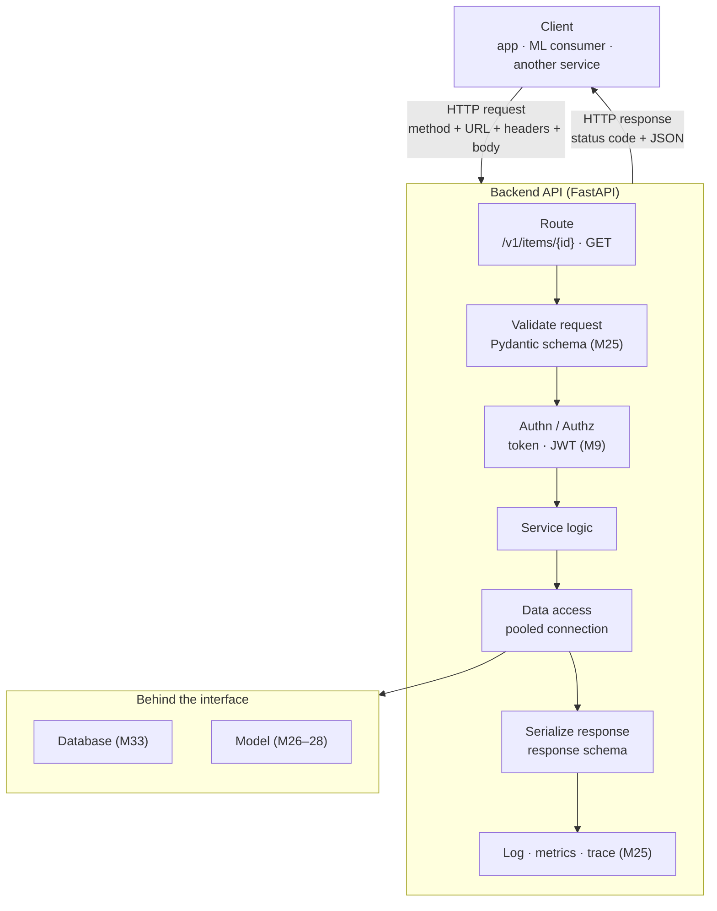
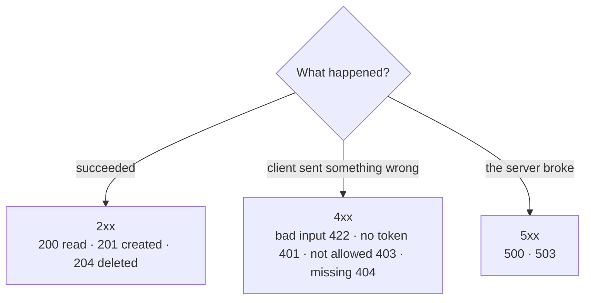

# Module 36 — Backend & API Engineering

<small>Stage 12 · Data & Software Engineering · ~3 weeks at 4 h/day · Prerequisite — Module 33 (Databases & SQL — the store this API fronts), Module 35 (SWE Practice — built test-first and reviewed).</small>

## Why this matters

A **backend** is the server-side of an application — the code that holds business logic, talks to the
database (M33) and other services, and exposes an **API** (Application Programming Interface — the set
of operations a program offers other programs) for clients to use over the network. The dominant style
is the **REST API** (REST — Representational State Transfer: an architectural style for HTTP APIs where
**resources** are nouns identified by URLs and **HTTP methods** are the verbs acting on them) over
**HTTP** (HyperText Transfer Protocol — the request/response protocol of the Web). A client sends a
request (method + URL + **headers** — key/value metadata like content type and auth + an optional body);
the server answers with a **status code** (a 3-digit outcome code) and usually a **JSON** body
(JavaScript Object Notation — the plain-text `{"key": value}` wire format).

Every service the curriculum has touched exposes an API: Module 28 served a model behind an HTTP
endpoint; Kubernetes (M19–20) ran services talking over the network; M33's database sits *behind* a
backend, never exposed raw. But those were built ad hoc — a minimal serving endpoint, a `docker run` —
without the discipline of **API design**: what makes a URL a good resource, which status code is
correct, how to validate input safely, how to authenticate, how to version so you don't break clients,
how to fail well. This module supplies that discipline. It turns *"I can return JSON from a function"*
into *"I can design and build a secure, versioned, observable REST API."*

!!! info "What this unlocks"
    This is Stage 12's **synthesis and closer**. The stage's data (M33), scale (M34), and process (M35)
    now meet an interface: a served **model** (M26–28) behind a validated, authed, versioned, observed,
    tested REST API over M33's database — the capstone's exact shape. · M37 (Cloud Platforms) deploys
    *this* containerized API to managed cloud compute, its observability becoming cloud monitoring. ·
    Every "backend engineer" and "ML/platform engineer" job lives in this module. **The API is the
    contract between your service and the world** — design it well and you can rebuild everything behind
    it without breaking a single consumer.

---

## Watch

*Watch once, then rely on the notes below — you should never need to rewatch.*

<div class="lo-video-placeholder" markdown="1">
<span class="lo-play">▶</span>
**Explainer video — coming**
<small>Record per <code>../media/README.md</code>, upload to YouTube, then replace this card with the embed.</small>
</div>

??? note "For the author — drop-in YouTube embed (replace VIDEO_ID)"
    Once the explainer is on YouTube, replace the placeholder card above with:
    ```html
    <div class="lo-video-embed">
      <iframe src="https://www.youtube-nocookie.com/embed/VIDEO_ID"
              title="Module 36 — Backend & API Engineering"
              allow="accelerometer; autoplay; clipboard-write; encrypted-media; gyroscope; picture-in-picture"
              allowfullscreen></iframe>
    </div>
    ```
    Video script beats (from the blueprint's Definition / Analogy / Misconceptions):
    the restaurant-menu analogy (the API is the menu + waiter, not the kitchen) → resources-as-nouns /
    methods-as-verbs / status-codes-as-the-waiter's-reply → validation as the waiter refusing an
    incoherent order → authn vs authz (checking your reservation vs what you're allowed to order) →
    versioning as keeping the old menu working (`/v1`, `/v2`) → why serving a model is just a new dish on
    a well-run menu.

**Terminal cast — pending; record per `../media/README.md`.**

!!! tip "Follow along, don't just watch"
    Open the [Guided Lab](#guided-lab-a-real-crud-api) in a browser terminal and build the API yourself
    as it appears. You learn an API by *hitting* it — sending a bad body and watching the 422 come back
    teaches more than any paragraph.

---

## Key Notes

*Standalone. This is the reference you keep.*

### The picture: a request's journey through the API



The client never sees the kitchen. It sends a **request** and gets a **response**; everything between —
validation, auth, logic, the database (M33), the model (M26–28) — is hidden behind the interface. That
hiding is the point: a good interface lets you rebuild everything behind it without reprinting a single
client's expectations. Notice **statelessness** — each request carries everything the server needs
(no memory of the last one), which is exactly what lets you run many copies of the API behind a load
balancer (the M19–20 scaling reason).

### HTTP methods — the verbs

Read a REST call as *verb + noun*: `POST /books` = "create a book", `GET /books/42` = "read book 42".
Two properties decide how clients (and proxies, and retry logic) may treat each method:

- **Safe** — has no side effects; only reads. A cache or crawler may call it freely.
- **Idempotent** — sending the same request repeatedly has the **same effect as sending it once**. This
  is what makes a retry safe: if the network drops the response, the client can retry without fear.

| Method | Does | Safe? | Idempotent? |
|---|---|---|---|
| `GET` | read a resource | ✅ yes | ✅ yes |
| `POST` | create (server assigns identity) | ❌ no | ❌ no — two calls make two things |
| `PUT` | replace a resource entirely | ❌ no | ✅ yes — same result each time |
| `PATCH` | partially update a resource | ❌ no | ⚠️ not necessarily |
| `DELETE` | remove a resource | ❌ no | ✅ yes — gone stays gone |

This is the M34/M35 **idempotency** idea, now expressed in HTTP. Resources are **nouns** (`/books`,
`/books/42`, `/members`) — never verbs (`/getBooks` is a design smell); the method carries the verb.

### Status codes — the waiter's reply

The status code is a **contract** every client, proxy, and monitoring tool relies on to know what
happened *without parsing the body*. Return the **correct** code — never 200-with-an-error-body.

| Class | Meaning | Codes that matter |
|---|---|---|
| **2xx** | success | `200` OK · `201` Created · `204` No Content |
| **3xx** | redirect | `301`/`304` (caching) — rare in APIs |
| **4xx** | **client's** fault | `400` Bad Request · `401` Unauthenticated · `403` Forbidden · `404` Not Found · `409` Conflict · `422` Unprocessable Entity (validation) · `429` Too Many Requests |
| **5xx** | **server's** fault | `500` Internal Server Error · `503` Service Unavailable |

The decision is a small tree — success, or whose fault:



Returning `500` for a *bad request* misattributes blame — it tells monitoring the **server** is failing
when the client sent garbage, misfires alerts, and can trigger inappropriate retries. A missing required
field is a `422` (or `400`), not a `500`; a not-found is a `404`, not a `200` with `{"error": ...}`.

### Validation — never trust the client

The client is outside your control and may send malformed, malicious, or unexpected data. **Validation**
is a *security boundary*, not a nicety. In FastAPI you declare the request shape as a **Pydantic** model
(Pydantic — the type-driven validation library FastAPI is built on); FastAPI validates every incoming
body against it and returns a **422** with a precise error automatically. Unvalidated input is the door
to crashes, injection (SQL/command — M33/M25), and corruption. Keep the **API model** (the public
Pydantic schema — what clients send/receive) **separate** from the **database model** (M33 — the internal
storage shape): the schema is a boundary that lets you change storage without breaking the API, and
expose only what clients should see.

### Authentication vs authorization — who, then what

- **Authentication (authn)** — verifying *who you are* (a login, a token). Comes first.
- **Authorization (authz)** — verifying *what you're allowed to do* (roles, scopes, ownership). Comes second.

| Scheme | What it is | Fits |
|---|---|---|
| **API key** | a shared secret in a header | simple server-to-server access; coarse (no user identity/expiry) |
| **JWT / OAuth2** | **JWT** (JSON Web Token — a signed token carrying identity/claims); **OAuth2** the delegated-auth standard around it | user-facing auth, expiry, fine-grained scopes — stateless |
| **Session** | a server-stored session id in a cookie | classic web apps; server holds state |

Passwords are stored **hashed** (with a library like `passlib`), **never plaintext** (M9). The top API
risk is **BOLA** (Broken Object-Level Authorization — OWASP API #1): a user is authenticated but the
endpoint never checks they *own* the object they're touching, so changing an id in the URL reaches
someone else's data. Fix: on every object access, verify the caller is authorized for *that specific
object* — authn is not authz.

### Production concerns — what turns an endpoint into a service

- **Error handling** — a consistent *problem+detail* shape with the right status code; catch exceptions
  so the API **never leaks a stack trace** to clients (M25). A leaked trace hands attackers your file
  paths and library versions.
- **Versioning** — put the API under `/v1`; ship a breaking change as `/v2` while `/v1` keeps working, so
  clients migrate on their *own* schedule. An API is a contract with consumers you don't control —
  changing it in place breaks every one of them at once.
- **Pagination** — a list endpoint returns *pages* (limit/offset or cursor), not a million rows — a
  memory-and-latency bomb otherwise.
- **Rate limiting** — cap requests per client (return `429`) to defend against abuse and DoS.
- **CORS** (Cross-Origin Resource Sharing — the browser rule that blocks a page on one origin from
  calling an API on another unless the API opts in) — allow cross-origin callers *deliberately*.
- **Observability** — one structured log line per request (method, path, status, latency), the **RED**
  metrics (Rate, Errors, Duration), and health/readiness probes (`/healthz`, `/readyz` — M19–20's
  Kubernetes probes). *An API you can't observe you can't operate.* All of this rides on FastAPI's
  auto-generated **OpenAPI** docs (OpenAPI/Swagger — the machine-readable API contract, served live at
  `/docs`): the API documents itself.

### REST vs the alternatives, and serving a model

**REST** is the default — resource-oriented, broadly interoperable, cacheable, simple. **GraphQL**
(clients request exactly the fields they need in one query) fits flexible, client-driven front-ends;
**gRPC** (fast binary RPC over HTTP/2) fits internal service-to-service where low latency and strict
typed contracts beat browser-friendliness. Pick by need, not fashion. And the stage's punchline:
**serving a model is just putting a powerful new dish on the same well-run menu** — a `/v1/predict`
endpoint with a validated request schema (garbage → 422, not a crash), auth + rate limits, a latency/cost
budget (M28), prediction monitoring for drift (M27/M34), model versioning, and integration tests (M35).
The gap between "the model works in a notebook" and "the model is a reliable service" *is* this module.

<div class="lo-remember" markdown="1">
**Must remember (if you keep only seven things):**

1. **Resources are nouns, methods are verbs, status codes tell the truth, and the API is a contract.**
2. **GET is safe & idempotent; PUT/DELETE idempotent; POST neither** — idempotency is what makes a retry safe.
3. **Correct status code, always:** `201` create · `404` missing · `422` validation · `401` no-token · `403` forbidden · never 200-with-an-error-body.
4. **Never trust the client** — validate at the boundary (Pydantic → 422); validation is a *security* boundary (M25).
5. **authn (who) ≠ authz (what)** — check object ownership too, or you have BOLA (OWASP #1). Hash passwords (M9).
6. **Version to evolve** (`/v1`, `/v2`) — an API is a promise to consumers you don't control.
7. **Serving a model right is 90% not-the-model** — validate · auth · rate-limit · monitor · version · test.
</div>

---

## Guided Lab: a real CRUD API

*Basic, step-by-step. You build a real **REST API** with FastAPI — an `/items` resource with correct
methods and status codes, Pydantic request validation, a token-protected route, and the auto-generated
OpenAPI docs — then exercise it with `curl`.*

<div class="lo-lab-actions" markdown="1">
[▶ Open interactive lab](https://killercoda.com/learning-os/course/killercoda/module-36){ .lo-btn target=_blank }
[⧉ Open in Codespaces](https://codespaces.new/randaguiac20/learning-os){ .lo-btn target=_blank }
[⌨ Run locally](#run-locally){ .lo-btn .lo-btn--ghost }
[View lab source](https://github.com/randaguiac20/learning-os/tree/main/killercoda/module-36){ .lo-btn .lo-btn--ghost target=_blank }
</div>

<span id="run-locally"></span>
!!! tip "Three ways to run this lab — pick any (all free)"
    - **Instant, no account** — click **Open interactive lab** (Killercoda): a Linux terminal in your browser.
    - **Your own cloud** — click **Open in Codespaces**: runs in your GitHub account's free tier (120 core-hrs/mo).
    - **Local, unlimited, $0** — any Linux / macOS / WSL terminal, or a throwaway container: `docker run -it ubuntu bash`, then `apt-get update && apt-get install -y python3-pip`, then follow the steps below.

    Killercoda is the zero-setup on-ramp; Codespaces and local use *your own* free resources, so they scale to any class size.

=== "1 · Install the bench"
    ```bash
    apt-get update && apt-get install -y python3-pip
    pip install fastapi uvicorn httpx        # web framework · ASGI server · HTTP client
    ```
    **FastAPI** is the framework; **uvicorn** is the **ASGI** server (Asynchronous Server Gateway
    Interface — the standard that runs an async Python web app) that actually serves it; **httpx** is a
    client for hitting endpoints from scripts. All three go in one `pip install`.

=== "2 · Design on paper, then write the API"
    Design first (the Learner's Law): `GET /items` (list → 200), `POST /items` (create → **201**),
    `GET /items/{id}` (read → 200 or **404**), `DELETE /items/{id}` (remove → 200, **token-protected**).
    Bad input → **422** automatically. Now write it:
    ```bash
    mkdir -p ~/api-lab && cat > ~/api-lab/main.py <<'PY'
    from fastapi import FastAPI, HTTPException, Depends, Header, status
    from pydantic import BaseModel, Field

    app = FastAPI(title="Items API", version="1.0.0")
    API_TOKEN = "secret-token"
    _items, _next = {}, {"id": 1}

    class ItemIn(BaseModel):            # the request contract (validated)
        name: str = Field(min_length=1)
        price: float = Field(gt=0)      # must be > 0 — bad input -> 422

    class ItemOut(ItemIn):
        id: int

    def require_token(authorization: str = Header(default="")):
        if authorization != f"Bearer {API_TOKEN}":     # authn: who are you?
            raise HTTPException(status.HTTP_401_UNAUTHORIZED, "missing or invalid token")

    @app.get("/items")
    def list_items():
        return list(_items.values())

    @app.post("/items", status_code=201, response_model=ItemOut)
    def create_item(item: ItemIn):
        rec = {"id": _next["id"], **item.model_dump()}
        _items[_next["id"]] = rec
        _next["id"] += 1
        return rec

    @app.get("/items/{item_id}", response_model=ItemOut)
    def get_item(item_id: int):
        if item_id not in _items:
            raise HTTPException(404, "item not found")   # correct code, not 200
        return _items[item_id]

    @app.delete("/items/{item_id}")
    def delete_item(item_id: int, _=Depends(require_token)):   # protected route
        if item_id not in _items:
            raise HTTPException(404, "item not found")
        return {"deleted": _items.pop(item_id)["id"]}
    PY
    ```
    Read it top to bottom: the **Pydantic** model is the contract, the method+`status_code` set the verb
    and success code, `HTTPException` sets the correct failure code, and `Depends(require_token)` makes
    one route need a token.

=== "3 · Run it, then create + validate"
    ```bash
    cd ~/api-lab && nohup uvicorn main:app --host 0.0.0.0 --port 8000 >/tmp/uvicorn.log 2>&1 & sleep 3
    ```
    Create an item — expect **201** and a server-assigned `id`:
    ```bash
    curl -i -s -X POST http://localhost:8000/items \
      -H 'Content-Type: application/json' \
      -d '{"name":"Widget","price":9.99}'
    ```
    Now send a **bad body** (price ≤ 0) — expect **422**, not a 500, and note the precise error FastAPI
    returns *without you writing a line of validation*:
    ```bash
    curl -i -s -X POST http://localhost:8000/items \
      -H 'Content-Type: application/json' \
      -d '{"name":"","price":-5}'
    ```
    (If `curl` can't connect, check `/tmp/uvicorn.log`.) Click **Check** to verify create→201 and bad→422.

=== "4 · Missing → 404, and the protected route"
    A resource that isn't there is a **404**, never a 200:
    ```bash
    curl -i -s http://localhost:8000/items/999999
    ```
    The `DELETE` route is **protected**. No token → **401**:
    ```bash
    curl -i -s -X DELETE http://localhost:8000/items/1
    ```
    With the token → **200** (and it removes the item):
    ```bash
    curl -i -s -X DELETE http://localhost:8000/items/1 \
      -H 'Authorization: Bearer secret-token'
    ```
    Feel authn: the *same* request differs only by a header, and that header is the difference between
    401 and 200. Click **Check** to verify 404, 401-without-token, and 200-with-token.

=== "5 · The API documents itself"
    FastAPI generated the **OpenAPI** contract from your type hints — no extra work:
    ```bash
    curl -s http://localhost:8000/openapi.json | head -c 400 ; echo
    ```
    In a real browser, `http://localhost:8000/docs` is the interactive **Swagger UI** — every endpoint,
    its schema, and a "Try it out" button. That auto-doc is a first-class deliverable: the machine-readable
    contract other teams build against. Stop the server when done:
    ```bash
    pkill -f "uvicorn main:app"
    ```

!!! success "You can stop here and have learned something real"
    If you designed the resource, built it with correct methods and status codes, watched Pydantic reject
    bad input with a 422, protected a route with a token, and read the auto OpenAPI docs — the guided lab
    is done. Now make it harder.

---

## Solo Lab: figure it out

*Harder. Goals only — minimal hand-holding. Extend the `~/api-lab/main.py` you built. Struggle here is
the point; reveal a hint only after you've tried.*

### Challenge 1 — Add `PUT` with the right semantics
Add `PUT /items/{id}` that **replaces** an item entirely. Choose its success and not-found status codes,
and state why `PUT` is idempotent while `POST` is not.

??? tip "Hint"
    `PUT` targets a *known* URL and replaces what's there — calling it twice with the same body leaves
    the same result. Reuse `ItemIn` as the body and return the updated `ItemOut` (200), or `404` if the
    id is unknown.

??? success "Solution"
    ```python
    @app.put("/items/{item_id}", response_model=ItemOut)
    def replace_item(item_id: int, item: ItemIn):
        if item_id not in _items:
            raise HTTPException(404, "item not found")
        rec = {"id": item_id, **item.model_dump()}
        _items[item_id] = rec
        return rec
    ```
    `PUT` is idempotent: replacing item 5 with the same body twice yields the same state as once. `POST`
    creates a *new* resource each call (a new id), so two `POST`s make two items — not idempotent.

### Challenge 2 — Paginate the list
`GET /items` currently returns everything. Add `limit` and `offset` **query parameters** (with sane
defaults) so it returns a page. Why is an unbounded list endpoint a production hazard?

??? tip "Hint"
    Declare `limit: int = 20` and `offset: int = 0` as function parameters — FastAPI reads them from the
    query string automatically. Slice the list.

??? success "Solution"
    ```python
    @app.get("/items")
    def list_items(limit: int = 20, offset: int = 0):
        rows = list(_items.values())
        return rows[offset : offset + limit]
    ```
    An unbounded list can return a million rows — blowing memory and latency for the server *and* the
    client. Pagination (limit/offset or cursor) bounds every response. `curl 'localhost:8000/items?limit=2'`.

### Challenge 3 — Make the 404 honest under a fake "always-200" route
Add a *deliberately wrong* `GET /bad/{id}` that returns `200` with `{"error": "not found"}` for a missing
item. Then explain, in one paragraph, everything that breaks — for clients, retries, caches, and
monitoring — versus a real `404`.

??? success "Solution"
    ```python
    @app.get("/bad/{item_id}")
    def bad_get(item_id: int):
        if item_id not in _items:
            return {"error": "not found"}     # WRONG: 200 for a failure
        return _items[item_id]
    ```
    A client can't tell success from failure without parsing the body; automatic retry logic won't retry
    (it "succeeded"); a cache may cache the error; monitoring counts it as a healthy request, so the
    error rate reads zero while users see failures. The status code is a shared contract — lying in it
    makes the API dishonest and un-observable. The fix is the real `404` you already wrote.

### Challenge 4 — Add authorization, not just authentication
The `DELETE` route checks a token (authn). Add a rule that only an **admin** token may delete, while a
normal token may not — and name the OWASP risk you're defending against.

??? tip "Hint"
    Give admins a different token (or a claim). In the dependency, distinguish "valid token" (authn) from
    "may delete" (authz) and return **403** — not 401 — when the caller is authenticated but not allowed.

??? success "Solution"
    ```python
    ADMIN_TOKEN = "admin-token"
    def require_admin(authorization: str = Header(default="")):
        if authorization not in (f"Bearer {API_TOKEN}", f"Bearer {ADMIN_TOKEN}"):
            raise HTTPException(401, "missing or invalid token")     # authn fail
        if authorization != f"Bearer {ADMIN_TOKEN}":
            raise HTTPException(403, "admin only")                   # authz fail
    ```
    `401` = *who are you?* (not authenticated); `403` = *you're known but not allowed*. Without the object/
    role check you'd have **BOLA** (Broken Object-Level Authorization, OWASP API #1) — a logged-in user
    doing what only an admin should.

### Challenge 5 (stretch) — Version a breaking change
Suppose you must rename `name` to `title` in the response. Do it **without breaking existing clients**.
Sketch the routing that lets old and new clients coexist, and state the one rule you must never violate.

??? success "Solution"
    Freeze the current API under `/v1` (still returns `name`) and add `/v2` returning `title`:
    ```python
    from fastapi import APIRouter
    v1 = APIRouter(prefix="/v1"); v2 = APIRouter(prefix="/v2")
    # v1 routes return {"name": ...}; v2 routes return {"title": ...}
    app.include_router(v1); app.include_router(v2)
    ```
    The never-violate rule: **never change `/v1` in place** once clients depend on it. A breaking change
    ships as a new version; the old one keeps working until consumers migrate on their own schedule —
    because an API is a contract with clients you don't control.

---

## Self-Check

*Close the notes. Answer aloud or in writing **first**, then reveal. Recalling — even when it's hard —
is what builds the memory.*

??? question "Name the five main HTTP methods and what each does — which are safe, which idempotent?"
    **GET** (read — safe & idempotent), **POST** (create — neither), **PUT** (replace — idempotent),
    **PATCH** (partial update — not necessarily idempotent), **DELETE** (remove — idempotent). *Safe* =
    no side effects; *idempotent* = repeating it has the same effect as once — which is what makes a
    retry safe.

??? question "A client omits a required field. What should the API return, and why not a 500?"
    A **422** (Unprocessable Entity) or **400** — a *client* error, because the client sent invalid data.
    Not a **500**: 500 means the *server* failed, which misattributes blame, misleads monitoring (a spike
    of "server errors" that are really bad requests), and can trigger inappropriate retries.

??? question "Why is returning 200 with `{\"error\": \"not found\"}` wrong?"
    The status code is the contract every client, proxy, and monitor relies on *without parsing the body*.
    A 200-for-a-failure means clients can't tell success from failure, retries misfire, caches cache
    errors, and monitoring can't count the error rate. Return the real **404**.

??? question "authn vs authz — and what is BOLA?"
    **Authentication** = verifying *who you are* (login/token). **Authorization** = verifying *what you
    may do* (roles/scopes/ownership). **BOLA** (Broken Object-Level Authorization, OWASP API #1) is authn
    *without* object-level authz: a logged-in user reaches another user's data by changing an id, because
    the endpoint never checked ownership.

??? question "Why never trust client input, and what does validation defend against?"
    The client is outside your control and may send malformed or malicious data. Validation (Pydantic →
    422) rejects it at the boundary, defending against crashes, injection (SQL/command — M33/M25), and
    corruption. Input is hostile until proven valid — validation is a **security boundary**.

??? question "Why version an API, and how?"
    Because an API is a contract with consumers you don't control; changing it in place breaks every
    client at once. Ship breaking changes as a new version (`/v2`) while the old one (`/v1`) keeps
    working, so clients migrate on their own schedule.

??? question "You must ship a model as a real endpoint. List the concerns beyond `model.predict()`."
    A validated request schema (bad → 422, not a crash); auth + rate limiting (not open to the world);
    a latency/cost budget with batching/async (M28); prediction monitoring for drift (M27/M34); model
    versioning (`/v1/predict`); consistent error handling; a health probe (M19–20); and integration tests
    (M35). That gap *is* the module.

!!! example "Teach it back (the real test)"
    Out loud, in **3 minutes, no notes**: *"What is a REST API and why is it more than returning JSON?"*
    Lead with the **restaurant-menu** analogy (the menu + waiter, not the kitchen), then name
    resources/methods/status-codes as a **contract**. Then, in **90 seconds**, answer a skeptic: *"can't
    we add auth and versioning later?"* — say why both are **architectural** (retrofitting auth is
    dangerous; re-versioning after clients depend on you breaks them). If you can't yet, reread the Key
    Notes — don't move on.

---

## Mastery checklist

*Tick these honestly, cold (no notes). They **gate** progress — passing M36 also closes **Stage 12**
(Data & Software Engineering). A module is only "done" when every box is true.*

- [ ] **Explain** HTTP's request/response model and why statelessness scales (M19–20).
- [ ] **Design** RESTful resources (nouns) and choose the correct method — and explain safe vs idempotent.
- [ ] **Choose** the correct status code for any outcome (201/204/400/401/403/404/409/422/429/500).
- [ ] **Build** a FastAPI endpoint with path/query params and JSON, and read its auto OpenAPI docs.
- [ ] **Validate** requests with Pydantic — bad input returns 422, not 500 — and say why validation is a security boundary.
- [ ] **Separate** the API model from the database model (M33) and explain the boundary.
- [ ] **Structure** the backend in layers (routes → services → data) with dependency injection (M35 design-for-change).
- [ ] **Implement** authentication (token/JWT), hash passwords (M9), and add authorization without BOLA.
- [ ] **Handle** errors consistently (problem+detail, right code, no leaked stack traces).
- [ ] **Version** an API (`/v1`→`/v2`) so a breaking change never breaks existing clients.
- [ ] **Add** pagination and rate limiting, and configure CORS deliberately.
- [ ] **Compare** REST, GraphQL, and gRPC and pick by need; walk three OWASP API Top-10 risks against your API.
- [ ] **Instrument** the API — one log line per request, RED metrics, `/healthz`/`/readyz` (M19–20).
- [ ] **Serve** a model as a hardened API (validate/auth/rate-limit/monitor/version/test) — the stage synthesis.
- [ ] **Test** endpoints with integration tests (httpx/TestClient — M35): assert status + body.
- [ ] **Teach:** pass the teach-back above (menu analogy + "add security later" dismantled).

---

## Review — lock it in

Spaced repetition is not optional; it's where the memory actually forms. **Interleaving is active** —
every M36 review also pulls in one Module 35 item (the API is built **test-first**, reviewed in a small
PR, and the *definition of done* gates it — process is what makes it a service, not a script). Schedule
these and *keep* them:

| When | Do | Interleaved M35 item |
|---|---|---|
| **Day 1** | Flashcards 1–20 · design CRUD endpoints for a fresh domain cold (methods + status codes) | Write one failing test first, then make it pass (red→green) |
| **Day 3** | The three cases · add validation + correct status codes to an endpoint | Explain the test pyramid (unit vs integration vs e2e) |
| **Day 7** | Reproduce the full Visual Model blank · add JWT auth + a `/v2` version to an API | Review a small PR against a definition-of-done checklist |
| **Day 14** | Wrap a model in a hardened endpoint (validate/auth/rate-limit/monitor/test) | Refactor under a green test suite without changing behavior |
| **Day 30** | Reproduce both artifacts (REST API + model service) from scratch | Turn a vague ask into written requirements + acceptance criteria |

**Connects forward to:** Cloud Platforms (M37 — this containerized API and model deployed to a cloud
provider's managed compute and AI services; the observability becomes cloud monitoring; the database
becomes a managed database) · the **capstone** — a served model over a database, professionally built,
which *is* this API done right. **Stage 12 (Data & Software Engineering) is complete** — data (M33),
scale (M34), process (M35), and the interface (M36): a full data-backed-service capability.

!!! quote "The one-sentence takeaway"
    M33 built the store, M34 scaled it, M35 made the process trustworthy — M36 is the **interface**: a
    REST API, validated and secured and versioned and observable, exposing a system to the world, with a
    served model as its capstone dish.
