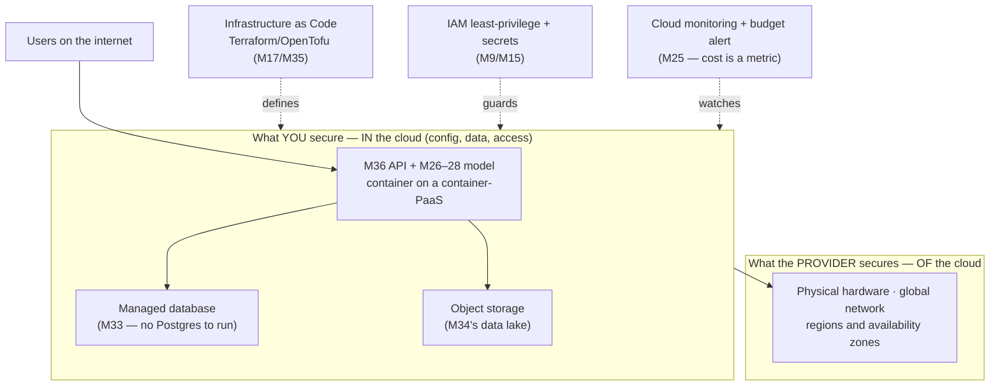

# Module 37 — Cloud Platforms & Certification

<small>Stage 13 · Cloud & AI Domains · ~3 weeks at 4 h/day · Prerequisite — Modules 18–20 (containers/Kubernetes — the cloud runs these), M28 (model serving), M36 (the API you will deploy).</small>

## Why this matters

**Cloud computing** is the on-demand delivery of computing resources — compute, storage, databases,
networking, and higher-level services — over the internet with **pay-as-you-go pricing**, instead of
owning and running physical hardware. Everything you have built so far ran locally or on a
self-managed **Kubernetes** cluster (M19–20) — but essentially **no production AI runs that way**. It
runs in the cloud: on managed compute and **GPUs** (Graphics Processing Units — the accelerators that
train models), behind managed databases and object storage, monitored by managed observability, and
increasingly using managed AI services.

This module is the deployment target for everything the curriculum built. The container from Module 18,
the **API** (Application Programming Interface — the M36 service other programs call), the model from
Modules 26–28, the database from Module 33, the data lake from Module 34 — this is where they all go to
run for real. You learn the cloud model well enough to *choose* the right service, deploy your own
stack, reason about cost (the pay-per-use model is both a superpower and a footgun), and speak the
certification vocabulary that job listings demand.

!!! info "What this unlocks"
    M38 (NLP) and M39 (Computer Vision) train their models on cloud GPUs and serve them on the M36 API
    running on managed compute — *this module*. The **capstone** ships cloud-native on the free tier.
    Every high-pay path — cloud engineer, DevOps/platform engineer, ML/AI engineer, SRE (Site
    Reliability Engineer) — deploys to the cloud, and an entry **certification** (Azure AI Fundamentals
    / AWS Cloud Practitioner) is a near-universal hiring signal. The cloud is where the whole curriculum
    finally runs where real AI runs.

---

## Watch

*Watch once, then rely on the notes below — you should never need to rewatch.*

<div class="lo-video-placeholder" markdown="1">
<span class="lo-play">▶</span>
**Explainer video — coming**
<small>Record per <code>../media/README.md</code>, upload to YouTube, then replace this card with the embed.</small>
</div>

??? note "For the author — drop-in YouTube embed (replace VIDEO_ID)"
    Once the explainer is on YouTube, replace the placeholder card above with:
    ```html
    <div class="lo-video-embed">
      <iframe src="https://www.youtube-nocookie.com/embed/VIDEO_ID"
              title="Module 37 — Cloud Platforms & Certification"
              allow="accelerometer; autoplay; clipboard-write; encrypted-media; gyroscope; picture-in-picture"
              allowfullscreen></iframe>
    </div>
    ```
    Video script beats (from the blueprint's Definition / Analogy / Misconceptions):
    renting vs owning a home (IaaS = empty apartment, PaaS = serviced apartment, SaaS = hotel) →
    the management spectrum (who manages the OS, runtime, app) → the shared-responsibility split (the
    open S3 bucket) → cost as a superpower *and* a footgun (the $10k idle GPU) → the curriculum's own
    stack deployed cloud-native → build-vs-buy and the certification on-ramp.

**Terminal cast — pending; record per `../media/README.md`.**

!!! tip "Follow along, don't just watch"
    Open the [Guided Lab](#guided-lab-the-infrastructure-as-code-lifecycle) in a browser terminal and
    run each command yourself as it appears. Typing beats watching every time — and it is part of how the
    memory forms.

---

## Key Notes

*Standalone. This is the reference you keep.*

### The picture: your stack, cloud-native



The cloud is *not* just "someone else's computer." It is someone else's computer **plus** managed
services, elasticity, a global network, and a pricing model — and the managed services and elasticity
are the point. This module takes the exact stack you built and runs each piece as a **managed service**:
the provider runs the machines; you configure, secure, and pay for what you use.

### The service models — who manages what

The service models layer by how much the provider manages. **IaaS** (Infrastructure as a Service),
**PaaS** (Platform as a Service), and **SaaS** (Software as a Service) are a spectrum from *most
control, most work* to *least control, least work*:

| Model | You manage | Provider manages | Example | Renting analogy |
|---|---|---|---|---|
| **IaaS** | Your app **+ the OS** (Operating System — the software that runs your programs) | Hardware, network, storage | A virtual machine (**VM** — a rented computer): EC2 / Azure VM / Compute Engine | An **empty apartment** — you bring furniture, cook, clean |
| **PaaS** | Your app (code) only | OS, runtime, scaling, hardware | A container service: AWS App Runner / Azure Container Apps / GCP Cloud Run | A **serviced apartment** — furnished, cleaned, you just live |
| **SaaS** | Nothing — you just use it | Everything | Web email; a pre-built AI vision/language API | A **hotel** — you show up, everything's done |

The rule: **more managed = less control and portability, less operational work.** It is a deliberate
control-vs-convenience trade per workload — not "more managed is always better." The M36 API's natural
home is the container-PaaS: you deploy the container, the platform runs and scales it.

**Deployment models** describe *where* it runs: **public** (shared provider infrastructure —
**AWS** (Amazon Web Services), **Azure** (Microsoft's cloud), **GCP** (Google Cloud Platform)),
**private** (dedicated), and **hybrid / multi-cloud** (a mix — flexibility vs lock-in).

### The core services — mapped to what you already built

The big three providers offer hundreds of services, but the load-bearing ones map 1:1 onto the
curriculum. The concepts are provider-agnostic (the console differs, the ideas transfer):

| Capability | AWS | Azure | GCP | You built it in |
|---|---|---|---|---|
| **Containers / K8s** | ECS / EKS | Container Apps / AKS | Cloud Run / GKE | M18–20 (Docker, Kubernetes) |
| **Serverless functions** | Lambda | Functions | Cloud Functions | event-driven, no server to manage |
| **Object storage** | **S3** (Simple Storage Service) | Blob Storage | GCS (Cloud Storage) | M34 (the data lake) |
| **Managed database** | **RDS** (Relational Database Service) | Azure SQL | Cloud SQL | M33 (Postgres, run for you) |
| **Managed AI / ML** | SageMaker | Azure ML | Vertex AI | M26–28 (train, host, serve) |
| **GPU compute** | GPU instances | GPU VMs | GPU VMs | M22/M28 (rent by the hour) |
| **Infrastructure as Code** | CloudFormation | ARM/Bicep | Deployment Manager | M17/M35 (reproducibility) |

**Managed Kubernetes** (EKS / AKS / GKE — Amazon/Azure/Google's hosted Kubernetes) is Modules 19–20's
Kubernetes, run by the provider. Object storage is M34's lake as a service. A managed database is M33's
PostgreSQL without you running it. You understand what is *underneath* each — so you choose "managed" to
shed the ops burden, not out of ignorance.

### The shared-responsibility model — where breaches actually happen

Security in the cloud is **split**. The provider secures the cloud; you secure what you put *in* it:

| Layer | Who secures it | Examples |
|---|---|---|
| Physical hardware, data centres, host OS, the managed service itself | **Provider** — security **OF** the cloud | facilities, hypervisor, network backbone |
| Your data, access, and configuration | **YOU** — security **IN** the cloud | **IAM** (Identity & Access Management — least-privilege roles, M9), secrets (M15), private buckets, encryption |

The line matters because **the #1 cause of cloud breaches is customer misconfiguration, not provider
failure** — a storage bucket accidentally set to public, an over-broad IAM role, a secret committed to
code. The provider secured the building; the break-ins are your unlocked doors. Config hygiene *is*
cloud security.

### Regions, availability zones, and cost

- **Regions and availability zones (AZ — an isolated data centre within a region).** Providers run in
  many geographic **regions**; each region has multiple **AZs** so a single data-centre failure doesn't
  take you down. This is Modules 19–20's high availability (**HA** — surviving failures) at provider
  scale.
- **Cloud economics — the superpower and the footgun.** Pay-as-you-go turns **CapEx** (Capital
  Expenditure — buying hardware upfront) into **OpEx** (Operating Expenditure — paying as you go), and
  lets you rent a supercomputer (a GPU) *by the hour*. That is the economics that democratized deep
  learning. **But the meter never stops:** an idle GPU, a runaway job, or an over-sized instance bills
  relentlessly whether you use it or not — the **$10,000 idle GPU** left running over a weekend is a
  real story. Cost is an engineering constraint (Module 21 applied to money).

### Infrastructure as Code — the professional way to build

**IaC** (Infrastructure as Code) defines your cloud resources **declaratively** in version-controlled
files, so anyone can recreate the exact infrastructure with one command. Clicking in a web console is
imperative, un-versioned, and un-reproducible; IaC is Module 35's "reproducible, versioned" discipline
applied to infrastructure. The industry-standard tool is **OpenTofu** (the open-source successor to
Terraform, which moved to a restricted licence in 2023) — you write **HCL** (HashiCorp Configuration
Language) describing the *desired state*, and the tool computes and applies the difference. Its lifecycle
— **plan → apply → state → drift → destroy** — is what you drill in the lab, and it transfers **1:1** to
AWS/Azure/GCP: only the provider block changes.

### Certification alignment — you already know most of it

An entry **certification** validates this knowledge in the language employers recognize. The target is
**Azure AI Fundamentals** (exam **AI-901** — the renumbered AI-900: AI workloads, machine learning,
computer vision, NLP, and generative AI), or the **AWS Certified Cloud Practitioner** (AWS CP — general
cloud) / ML Engineer Associate. You already know most of the *content*: Modules 26–28 **are** the
machine-learning material (you built it by hand); this module supplies the cloud model. A cert validates
vocabulary and breadth and is a hiring signal — it is a **complement**, not a substitute for the
hands-on ability this whole curriculum gives you.

<div class="lo-remember" markdown="1">
**Must remember (if you keep only six things):**

1. **The service models are a management spectrum:** IaaS = your app + OS · PaaS = your app · SaaS = just
   use it. More managed = less control, less ops. (Empty apartment → serviced apartment → hotel.)
2. **The shared-responsibility model:** the provider secures the cloud; **YOU** secure your data, access,
   and config — and that is where **most breaches** happen (the open bucket).
3. **The core services map to the curriculum:** containers→M18–20 · object storage→M34 · managed DB→M33 ·
   AI/GPU→M28 · the app→M36 · IAM→M9 · monitoring→M25 · IaC→M17/M35.
4. **Cost is a superpower AND a footgun.** Two cost laws: **set a budget alert on day one**, and
   **STOP/DELETE every resource when done** (especially a GPU).
5. **Infrastructure as Code** (OpenTofu/Terraform) makes infrastructure reproducible — plan → apply →
   state → drift → destroy. Console-clicking is not reproducible.
6. **Build vs buy** an AI capability by **TCO** (Total Cost of Ownership) at your volume, not by vibe — a
   managed API (fast, per-call) vs your own model (control, no per-call fee).
</div>

---

## Guided Lab: the Infrastructure-as-Code lifecycle

*Basic, step-by-step. You cannot use a real cloud account in a browser terminal — so you learn the
**transferable** skill instead: the Infrastructure-as-Code lifecycle with **OpenTofu**, using providers
that need **no cloud credentials and cost nothing**. The `plan → apply → state → drift → destroy` loop
you drill here transfers **1:1** to AWS/Azure/GCP.*

<div class="lo-lab-actions" markdown="1">
[▶ Open interactive lab](https://killercoda.com/learning-os/course/killercoda/module-37){ .lo-btn target=_blank }
[⧉ Open in Codespaces](https://codespaces.new/randaguiac20/learning-os){ .lo-btn target=_blank }
[⌨ Run locally](#run-locally){ .lo-btn .lo-btn--ghost }
[View lab source](https://github.com/randaguiac20/learning-os/tree/main/killercoda/module-37){ .lo-btn .lo-btn--ghost target=_blank }
</div>

<span id="run-locally"></span>
!!! tip "Three ways to run this lab — pick any (all free)"
    - **Instant, no account** — click **Open interactive lab** (Killercoda): a Linux terminal in your browser.
    - **Your own cloud** — click **Open in Codespaces**: runs in your GitHub account's free tier (120 core-hrs/mo).
    - **Local, unlimited, $0** — any Linux / macOS / WSL terminal, or a throwaway container: `docker run -it ubuntu bash`, then follow the steps below.

    Killercoda is the zero-setup on-ramp; Codespaces and local use *your own* free resources, so they scale to any class size.

!!! warning "Why no real cloud here — and how the skill still transfers"
    A browser sandbox has **no cloud account**, and putting one there would violate the module's cost
    law. So the lab uses OpenTofu's **`random`** and **`local`** providers — they create a real local
    file with zero cloud and zero cost. The *lifecycle* is identical to provisioning a real VM, database,
    or bucket; only the provider block differs. Real-cloud provisioning (free tier + **mandatory budget
    alerts and stop/delete**) is the "run in your own account" path in the Solo Lab.

=== "1 · Install OpenTofu"
    ```bash
    curl --proto '=https' --tlsv1.2 -fsSL https://get.opentofu.org/install-opentofu.sh -o install.sh
    chmod +x install.sh
    ./install.sh --install-method standalone
    tofu version
    ```
    `tofu version` should print a version. (If the standalone installer can't reach GitHub, fall back to
    the Debian package method: `./install.sh --install-method deb`.) OpenTofu is the open-source
    successor to Terraform — same commands, same **HCL** config language.

=== "2 · Write your first config (main.tf)"
    ```bash
    mkdir -p ~/iac-lab && cd ~/iac-lab
    cat > main.tf <<'HCL'
    terraform {
      required_providers {
        random = { source = "hashicorp/random" }
        local  = { source = "hashicorp/local"  }
      }
    }

    # A resource with NO cloud and NO cost — a random pet name.
    resource "random_pet" "server" {
      length = 2
    }

    # A REAL local file, its content driven by the resource above.
    resource "local_file" "note" {
      filename = "${path.module}/server-name.txt"
      content  = "Provisioned server: ${random_pet.server.id}\n"
    }
    HCL
    cat main.tf
    ```
    This declares the **desired state**: a `random_pet` name and a `local_file` whose content depends on
    it. You describe *what you want*; OpenTofu figures out *how* to get there — the essence of IaC.

=== "3 · tofu init — download the providers"
    ```bash
    cd ~/iac-lab
    tofu init
    ```
    `init` reads `main.tf`, downloads the `random` and `local` provider plugins into `.terraform/`, and
    writes a `.terraform.lock.hcl` lock file (pinned versions — reproducibility, like Module 17's lockfiles).
    You should see **"OpenTofu has been successfully initialized!"**

=== "4 · tofu plan — read the diff before you change anything"
    ```bash
    cd ~/iac-lab
    tofu plan
    ```
    `plan` compares your desired state (`main.tf`) against reality (nothing yet) and prints exactly what
    it **would** do — here, `2 to add, 0 to change, 0 to destroy`. **Read the plan every time**: this is
    the "look before you leap" of infrastructure. In real cloud, this is where you catch "wait, that
    would delete the database."

=== "5 · tofu apply — create it, then inspect the state"
    ```bash
    cd ~/iac-lab
    tofu apply -auto-approve
    cat server-name.txt
    ```
    `apply` executes the plan and creates the **real** local file. Now inspect the **state file** —
    OpenTofu's record of what it created and manages:
    ```bash
    ls -l terraform.tfstate
    tofu show
    ```
    `terraform.tfstate` is the source of truth linking your config to real resources. In the cloud it
    records resource IDs, IP addresses, and secrets — so it is sensitive and, on a team, stored remotely.

=== "6 · Change, re-plan, then destroy"
    ```bash
    cd ~/iac-lab
    sed -i 's/length = 2/length = 3/' main.tf   # change the desired state
    tofu plan                                   # see: "1 to add, 0 to change, 1 to destroy" (replace)
    tofu apply -auto-approve
    cat server-name.txt                         # a new 3-word name
    ```
    You changed the config and OpenTofu computed the **update** — that is drift management. Now tear it
    all down (the cost law, rehearsed):
    ```bash
    tofu destroy -auto-approve
    ls server-name.txt 2>/dev/null || echo "file gone — destroy complete"
    ```
    `destroy` removes everything in the state. On real cloud, this is how you obey **"STOP/DELETE when
    done"** with a single command — the discipline that prevents the idle-GPU bill.

!!! success "You can stop here and have learned something real"
    If you installed OpenTofu, wrote a config, ran `init → plan → apply`, read the **state file**,
    changed the config and saw the **plan** update, then `destroy`ed it — you have done the *exact*
    lifecycle that provisions a real VM, database, or GPU. Only the provider block changes. Now make it
    harder.

---

## Solo Lab: figure it out

*Harder. Goals only — minimal hand-holding. The first three extend the IaC lab; the last two are the
judgment layer (paper artifacts). Struggle here is the point; reveal a hint only after you've tried.*

### Challenge 1 — Add an output and a variable
Make the pet name's word-count a **variable** (default 2) and expose the generated name as an
**output**, so `tofu output` prints it. Re-`apply` and read the output.

??? tip "Hint"
    OpenTofu has `variable "name" { ... }` and `output "name" { value = ... }` blocks. Reference a
    variable with `var.<name>` inside a resource.

??? success "Solution"
    ```hcl
    variable "words" {
      type    = number
      default = 2
    }
    resource "random_pet" "server" {
      length = var.words
    }
    output "server_name" {
      value = random_pet.server.id
    }
    ```
    ```bash
    tofu apply -auto-approve && tofu output server_name
    tofu apply -auto-approve -var 'words=4'   # override on the command line
    ```
    Variables parameterize a config (reuse across environments); outputs surface values (an IP, a URL, a
    name) for humans or other tools.

### Challenge 2 — Simulate drift, then let IaC heal it
With the stack applied, **delete `server-name.txt` by hand** (as if someone clicked in the console).
Run `tofu plan`. What does OpenTofu say, and why?

??? tip "Hint"
    IaC compares *desired state* (config) against *actual state*. If reality no longer matches, that gap
    is **drift**.

??? success "Solution"
    ```bash
    rm server-name.txt
    tofu plan     # "1 to add" — it will RECREATE the file to match desired state
    tofu apply -auto-approve
    ```
    OpenTofu detects the file is missing (drift from the desired state recorded in `main.tf`) and plans to
    recreate it. This is why IaC beats console-clicking: the config is the source of truth, and it heals
    manual changes back to the declared state.

### Challenge 3 — The real-cloud path (on paper): the two cost laws
You will *not* run this in the sandbox. **Write the plan** for taking the M36 API to a real provider's
free tier safely — the first two things you do, in order, before any resource.

??? tip "Hint"
    The module has two non-negotiable **cost laws**. Both happen before you provision anything heavy.
    Think budget, and think teardown.

??? success "Solution"
    1. **Cost law #1 — set a budget + billing alert on day one** (e.g. AWS Budgets / Azure Cost
       Management / GCP Budgets), *before* creating any resource. A hard cap where the provider supports it.
    2. **Cost law #2 — STOP/DELETE every resource when done** — ideally as `tofu destroy` of an IaC stack,
       plus auto-shutdown for any GPU. Provision → use → destroy.

    Then: deploy the M36 container to a container-PaaS (Cloud Run / App Runner / Container Apps) for a
    public HTTPS URL and autoscaling; inject secrets from the secrets manager (M15, **not** the image);
    point it at a managed DB (M33); give it an IAM role with **least privilege** (M9); ensure **no public
    buckets** (M34); and add cloud monitoring (M25). The $10k-idle-GPU case is what law #2 prevents.

### Challenge 4 — Build vs buy, by the numbers
A team needs image labels. Option A: call a managed vision API at \$1.50 per 1,000 images. Option B:
host your own M26–27 model at ~\$70/month for a small always-on instance. At what monthly volume does
building beat buying? Show the break-even.

??? success "Solution"
    Break-even where API cost = hosting cost: `$1.50 × (N / 1000) = $70` → `N ≈ 46,700 images/month`.
    Below ~47k images/month, **buy** (the managed API — no ops, pay only for calls); above it, the per-call
    fee exceeds the flat hosting cost, so **build** starts to win — *plus* control, domain-tuned quality,
    and no lock-in. The decision is **TCO at your actual volume**, not a vibe. (For a genuine one-off,
    always buy — hosting a model for a single job is never worth the effort.)

### Challenge 5 (stretch) — Map the curriculum to AI-901
Open the **AI-901** (Azure AI Fundamentals) exam domains and map each to the module that already taught
it. Note how much you already know.

??? success "Solution"
    AI workloads & considerations → **M26**; machine-learning fundamentals → **M27** (you built it by
    hand); computer vision → **M39** (preview); NLP → **M38** (preview); generative AI → **M26–28**; the
    cloud model → **this module (M37)**. The curriculum teaches the concepts from first principles; the
    cert mainly adds the **Azure-service vocabulary**. You are largely exam-ready on concepts — take the
    free practice assessment and study the gaps (the provider-specific service names).

---

## Self-Check

*Close the notes. Answer aloud or in writing **first**, then reveal. Recalling — even when it's hard —
is what builds the memory.*

??? question "Define IaaS, PaaS, and SaaS with the renting-a-home analogy."
    **IaaS** = rented raw infrastructure (a VM); you manage the OS up — an **empty apartment** (you bring
    furniture, cook, clean). **PaaS** = deploy your code, the platform runs it — a **serviced apartment**
    (furnished, cleaned). **SaaS** = a finished product you just use — a **hotel** (everything's done).
    More managed = less control, less ops work.

??? question "State the shared-responsibility model and who owns what."
    The **provider** secures the cloud (physical hardware, host OS, the managed service itself); **YOU**
    secure what's *in* the cloud — your **data, access (IAM), and configuration**. Most breaches are on
    the customer side (a public bucket, an over-broad role) — config hygiene is your job.

??? question "Why is cloud cost a superpower AND a footgun?"
    **Superpower:** pay-as-you-go with no upfront hardware lets you rent an H100 GPU for an hour and scale
    up for a burst then down when idle (CapEx→OpEx). **Footgun:** the meter never stops — an idle GPU, a
    runaway job, or an over-sized instance bills relentlessly. Hence the two cost laws: budget alert on
    day one, STOP/DELETE when done.

??? question "Map object storage, managed DB, and managed Kubernetes to the curriculum."
    **Object storage** (S3/Blob/GCS) = M34's data lake, managed. **Managed database** (RDS/Cloud SQL) =
    M33's PostgreSQL, run by the provider. **Managed Kubernetes** (EKS/AKS/GKE) = Modules 19–20's
    Kubernetes, run by the provider. You built each from the ground up; the cloud offers each as a service.

??? question "You need to train a model but don't own a GPU. What do you do, and the one rule you can't forget?"
    **Rent** a GPU instance (or use a managed training job — SageMaker/Vertex/Azure ML) — pay by the hour
    instead of owning. The unbreakable rule: **STOP/DELETE it the moment the job finishes** (and set a
    budget alert first), because an idle GPU bills relentlessly — the $10k-idle-GPU case. Rent, run, stop.

??? question "Your infrastructure isn't reproducible — a teammate can't recreate it. What were you missing?"
    You provisioned by **clicking in the console** (imperative, un-versioned, un-reproducible) instead of
    using **Infrastructure as Code** (OpenTofu/Terraform). IaC defines the stack declaratively in
    version-controlled files, so anyone recreates the exact infrastructure with one command — the M17/M35
    reproducibility discipline for infra.

??? question "Is a certification worth it, and what does it (and doesn't it) prove?"
    Worth it as a **hiring signal** and a structured way to learn a provider's vocabulary and breadth —
    especially an entry cert (AI-901 / Cloud Practitioner) early in a career or a cloud/AI role switch. It
    does **not** prove you can do the job — hands-on ability (this curriculum) does that. It's a
    complement that opens doors, not a substitute for capability.

!!! example "Teach it back (the real test)"
    Out loud, in **3 minutes, no notes**: *"What is the cloud, and what do IaaS, PaaS, and SaaS mean?"* —
    analogy first (renting vs owning), then the management spectrum, then map two services to the
    curriculum. Then field two objections in **60 seconds each**: *"Isn't the cloud just someone else's
    computer?"* (plus managed services + elasticity + a pricing model — that's the point) and *"Isn't the
    cloud always cheaper?"* (cheaper for variable/bursty loads; a steady 24/7 heavy load can cost more,
    and idle resources bill relentlessly — it's a trade). If you can't yet, reread the Key Notes, don't
    move on.

---

## Mastery checklist

*Tick these honestly, cold (no notes). They **gate** progress. A module is only "done" when every box is
true.*

- [ ] **Define** cloud computing and IaaS/PaaS/SaaS — one line each, cold, with the renting analogy.
- [ ] **Explain** the deployment models (public/private/hybrid/multi-cloud) and the control-vs-convenience trade.
- [ ] **State and apply** the shared-responsibility model — and name customer misconfiguration as the #1 breach cause.
- [ ] **Set** a budget/billing alert (cost law #1) and **STOP/DELETE** resources when done (cost law #2).
- [ ] **Deploy** the M36 container to managed compute (container-PaaS) — public HTTPS URL, health probes wired.
- [ ] **Inject** secrets/config in the cloud (M15 — not baked into the image) and **configure IAM least-privilege** (M9).
- [ ] **Use** a managed database (M33) and object storage (M34); **ensure no public buckets / over-broad IAM**.
- [ ] **Define** the stack as Infrastructure as Code (OpenTofu/Terraform) and **prove reproducibility** (destroy + re-apply).
- [ ] **Run** the full IaC lifecycle cold — `init → plan → apply → inspect state → change → destroy` — and read every plan.
- [ ] **Provision and STOP** a GPU (cost law #2 — M22/M28) and **make a build-vs-buy decision** by TCO, not vibe.
- [ ] **Analyze** cloud cost, right-size resources (M21), and use cloud observability (M25 at cloud scale).
- [ ] **Map** the curriculum to an entry cert's exam domains (AI-901 / AWS CP-ML) and take a practice assessment.
- [ ] **Recognize** when the cloud is the wrong choice (steady 24/7 heavy load, data-residency, lock-in/egress).
- [ ] **Teach** the cloud model, deployment, and cloud judgment — stressing the cost laws and shared responsibility.

---

## Review — lock it in

Spaced repetition is not optional; it's where the memory actually forms. **Interleaving is active** —
every M37 review also pulls in one Module 28 item (serving/GPUs — what you now deploy and rent in the
cloud). Schedule these and *keep* them:

| When | Do | Interleaved M28 item |
|---|---|---|
| **Day 1** | Flashcards 1–20 · say the service models fast (app+OS / app / use it) · the two cost laws | One "why serve a model behind an API, not a notebook?" explanation |
| **Day 3** | The three cases (idle GPU · open bucket · build-vs-buy) · shared responsibility cold | Recall the RED metrics (Rate, Errors, Duration) for a served model |
| **Day 7** | Reproduce the Visual Model blank · run the IaC lifecycle (`init→plan→apply→destroy`) unaided | Latency vs throughput trade for an inference endpoint |
| **Day 14** | Codify a small stack in OpenTofu, apply + destroy · IAM/least-privilege from memory | CPU-vs-GPU serving decision — when is a GPU pure waste? |
| **Day 30** | Whole module in five-minute-review form · take an AI-901/CP practice assessment | Batching / model-server (M28) recall, cold |

**Connects forward to:** M38 (NLP) and M39 (Computer Vision) — domain models trained on cloud GPUs and
served on the M36 API on managed compute, with the same managed-API-vs-own-model build-vs-buy call · the
**capstone**, deployed cloud-native on the free tier · and the deeper disciplines this opens — cloud
architecture, DevOps, **FinOps** (cloud cost management), and MLOps.

!!! quote "The one-sentence takeaway"
    M37 is where the curriculum's locally-built stack — container (M18), API (M36), model (M26–28),
    database (M33), storage (M34) — runs on a real provider's managed compute, secured under the
    shared-responsibility model, reproducible as code, and cost-bounded: the platform where essentially
    all production AI actually runs.
