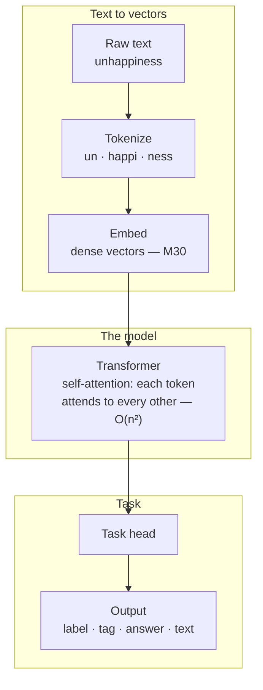

# Module 38 — Natural Language Processing

<small>Stage 13 · Cloud & AI Domains · ~3 weeks at 4 h/day · Prerequisites — M26–27 (AI/ML fundamentals: training, backprop, evaluation) · M30 (linear algebra — vectors) · M31 (probability — distributions) · M32 (complexity — O(n²)).</small>

## Why this matters

**NLP** (Natural Language Processing) is the field of making computers represent, understand, and
generate human language. Language is discrete symbols but machine learning needs numbers, so NLP's
whole foundation is one bridge: **turn text into vectors, run a model, turn the result back into an
answer.** Every chatbot, search box, spam filter, translator, and RAG assistant you have ever used is
that bridge, built well.

Modules 26–28 gave you the LLM (Large Language Model — a transformer trained on massive text)
through-line: you built a tiny network's guts (backprop), met tokens and embeddings gently, and served
a model. This module makes that through-line a genuine **specialty** — it goes deep on how text
becomes vectors, how **self-attention** actually works, how the classic tasks function, and — hardest
of all — how to *evaluate* them, because "it generates fluent text" is not "it is correct."

!!! info "What this unlocks"
    This is the language half of applied AI. M39 (Computer Vision) reuses the *same* transfer-learning
    workflow on images · the capstone, if language-based, is a fine-tuned or RAG-backed service built
    exactly like here · and the whole current AI-product wave — assistants, semantic search, RAG over
    company docs, moderation, translation — is this module at scale. NLP is where most applied AI
    engineering lives today.

---

## Watch

*Watch once, then rely on the notes below — you should never need to rewatch.*

<div class="lo-video-placeholder" markdown="1">
<span class="lo-play">▶</span>
**Explainer video — coming**
<small>Record per <code>../media/README.md</code>, upload to YouTube, then replace this card with the embed.</small>
</div>

??? note "For the author — drop-in YouTube embed (replace VIDEO_ID)"
    Once the explainer is on YouTube, replace the placeholder card above with:
    ```html
    <div class="lo-video-embed">
      <iframe src="https://www.youtube-nocookie.com/embed/VIDEO_ID"
              title="Module 38 — Natural Language Processing"
              allow="accelerometer; autoplay; clipboard-write; encrypted-media; gyroscope; picture-in-picture"
              allowfullscreen></iframe>
    </div>
    ```
    Video script beats (from the blueprint's Definition / Analogy / Misconceptions):
    words as points on a map of meaning → tokenization (whole words vs subwords) → embeddings
    (king − man + woman ≈ queen) → the traveler who predicts the next stop (the language model) →
    self-attention: look at the whole journey at once (and why that is O(n²)) → fine-tuning as a short
    local tour → and the hard part: fluent ≠ correct, so the metric must match the task.

**Terminal cast — pending; record per `../media/README.md`.**

!!! tip "Follow along, don't just watch"
    Open the [Guided Lab](#guided-lab-text-to-a-trained-classifier) in a browser terminal and run each
    command yourself as it appears. You will tokenize by hand, build a **TF-IDF** vectorizer, train a
    classifier, and measure it — typing beats watching every time, and it is part of how the memory forms.

---

## Key Notes

*Standalone. This is the reference you keep.*

### The picture: text → meaning → task



Read it left-of-the-arrows as a pipeline: **tokenize → embed → model → task head → decode/evaluate.**
Everything in this module is one stage of that pipeline made deep.

### Text to vectors

- **Token** — the atomic input unit the model consumes. **Tokenization** is splitting text into tokens.
  The **vocabulary** is the fixed set of tokens the model knows (each with an integer id).
- **Subword tokenization** — schemes like **BPE** (Byte-Pair Encoding) and **WordPiece** that split
  rare words into reusable pieces (`unhappiness → un · happi · ness`), so even a never-seen word still
  gets tokens. This is *not* trivial: token boundaries affect cost, context length, and even arithmetic
  and spelling behavior.
- **Embedding** — a dense vector representing a token (or a whole document) in a space *learned* so that
  semantic similarity is geometric proximity (M30's vectors). Words that appear in similar contexts sit
  near each other (the distributional hypothesis).
- **Cosine similarity** — the standard nearness measure: the **dot product** (M30) of two vectors
  divided by their lengths (normalized), so it reads pure *direction*. High cosine = same meaning.
  This is why analogies are arithmetic: `king − man + woman ≈ queen`.

| Tokenization scheme | Unit | Trade-off |
|---|---|---|
| **Word** | whole words | small sequences, but a huge vocabulary and no way to handle unseen words |
| **Character** | single characters | tiny vocabulary, handles anything, but very long sequences and weak units |
| **Subword (BPE / WordPiece)** | word pieces | the modern default — bounded vocabulary *and* any word is representable |

### The model — from bag-of-words to the transformer

- **Bag-of-words / TF-IDF** — the simplest text vector: count the words, ignore order. **TF-IDF**
  (Term Frequency–Inverse Document Frequency) weights each word by how *informative* it is — frequent in
  this document but rare across the corpus — so "the" counts for little and "refund" counts for a lot. A
  strong, cheap baseline for classification (what you build in the lab), but it *loses word order*.
- **Language model** — a model that assigns probabilities to sequences: `P(next token | context)`
  (M31's distributions). **Autoregressive** generation produces one token at a time, feeding each back
  as context (the GPT objective). **Perplexity** is its intrinsic metric — lower = less "surprised."
- **n-gram** — a language model that conditions only on the last *n−1* tokens; it generates
  locally-plausible but globally-incoherent text because it *cannot remember far back*. That failure
  motivates attention.
- **RNN / LSTM** — Recurrent Neural Network / Long Short-Term Memory: process a sequence step by step
  with a fading memory; they struggle with long-range dependencies (vanishing gradients, M26).
- **Self-attention** — the transformer's core: each token forms a **query** and compares it (dot
  product) against every token's **key** to get relevance scores, softmaxes them into weights, and takes
  the weighted sum of every token's **value** (Q · Kᵀ → softmax → Σ V — M30's weighted average). So
  every token's new representation blends information from *every other token*, weighted by learned
  relevance — directly connecting distant tokens (unlike an RNN's fading memory). **Attention is not
  magic; it is a weighted average.**
- **The transformer** — stacks self-attention with **multi-head** attention (several attention patterns
  at once) and **positional encoding** (order re-injected, since attention itself is order-blind); the
  2017 paper is *"Attention Is All You Need."* **BERT** (Bidirectional Encoder Representations from
  Transformers) attends both directions → good at *understanding* (classification, NER, QA); **GPT**
  (Generative Pre-trained Transformer) attends only leftward → good at *generation*.
- **O(n²)** — self-attention compares every token with every other, so *n* tokens → *n²* interactions.
  Doubling the context roughly quadruples the cost (M32). This is exactly why long context is expensive
  and why retrieval (RAG) is often preferred over stuffing everything in.
- **Fine-tuning** — take a **pretrained** transformer (trained self-supervised on massive text) and
  adapt it to your task on a *small* labeled dataset. This is **transfer learning** — the practical
  modern workflow. You almost never train from scratch.

### Tasks & evaluation

Different tasks reuse the *same* transformer backbone with a different **task head** — and each demands
its *own* correct metric.

| Task | What it does | Metric | Blind spot to know |
|---|---|---|---|
| **Classification** | label text (sentiment, spam, topic) | **F1** (not just accuracy) | accuracy hides failure on imbalanced classes (M27/M31) |
| **NER** (Named Entity Recognition) | tag people / places / orgs (sequence labeling) | span **F1** | partial-span matches |
| **QA** (Question Answering) | find the answer span (extractive) | **exact-match / F1** | correct answer phrased differently |
| **Translation / Summarization** | rewrite / condense text | **BLEU / ROUGE** (+ human) | reward surface n-gram overlap, blind to meaning and truth |
| **Language modeling** | predict the next token | **perplexity** | says nothing about factual correctness |

**F1** is the harmonic mean of **precision** (of what you flagged, how much was right) and **recall** (of
what should have been flagged, how much you caught) — it exposes the failure a lone **accuracy** number
hides, because a model can score 95% accuracy on imbalanced text by always guessing the majority class.
**BLEU** (Bilingual Evaluation Understudy) and **ROUGE** (Recall-Oriented Understudy for Gisting
Evaluation) both measure n-gram overlap with a reference — cheap and automatic, but they cannot tell a
fluent *wrong* answer from a right one.

<div class="lo-remember" markdown="1">
**Must remember (if you keep only six things):**

1. **The pipeline:** tokenize → embed → model → task head → decode/evaluate. Everything is one stage of it.
2. **Meaning is geometry.** Embeddings place tokens as vectors; **cosine similarity** (normalized dot product, M30) is nearness; analogies are arithmetic (king − man + woman ≈ queen).
3. **Attention is a weighted average, not magic** — each token weights every other by learned relevance (Q · Kᵀ → softmax → Σ V), which is why it captures long range **and** why it is **O(n²)** (M32).
4. **Fine-tuning ≠ training from scratch** — you adapt a pretrained model on little data (transfer learning). You rarely train an LLM yourself.
5. **The metric must match the task:** F1 for classification, exact-match/F1 for QA, BLEU/ROUGE for translation/summary, perplexity for LMs.
6. **Fluent ≠ correct.** A model produces *plausible* text, not *true* text — hallucination is the proof. Verify factual output; RAG grounds it.
</div>

---

## Guided Lab: text to a trained classifier

*Basic, step-by-step. You will tokenize a corpus by hand, build a **TF-IDF** vectorizer over a small
inline labeled corpus (defined in the lab — no downloads), train a classifier, evaluate it on held-out
sentences, and inspect the most informative words. Everything runs on CPU in a throwaway
`~/nlp-lab/` directory.*

<div class="lo-lab-actions" markdown="1">
[▶ Open interactive lab](https://killercoda.com/learning-os/course/killercoda/module-38){ .lo-btn target=_blank }
[⧉ Open in Codespaces](https://codespaces.new/randaguiac20/learning-os){ .lo-btn target=_blank }
[⌨ Run locally](#run-locally){ .lo-btn .lo-btn--ghost }
[View lab source](https://github.com/randaguiac20/learning-os/tree/main/killercoda/module-38){ .lo-btn .lo-btn--ghost target=_blank }
</div>

<span id="run-locally"></span>
!!! tip "Three ways to run this lab — pick any (all free)"
    - **Instant, no account** — click **Open interactive lab** (Killercoda): a Linux terminal in your browser.
    - **Your own cloud** — click **Open in Codespaces**: runs in your GitHub account's free tier (120 core-hrs/mo).
    - **Local, unlimited, $0** — any Linux / macOS / WSL terminal, or a throwaway container: `docker run -it ubuntu bash`, then follow the steps below (Step 1 installs Python + scikit-learn).

    Killercoda is the zero-setup on-ramp; Codespaces and local use *your own* free resources, so they scale to any class size. The lab uses only scikit-learn and numpy on CPU — **no model downloads.**

=== "1 · Set up the bench"
    ```bash
    sudo apt-get update -y && sudo apt-get install -y python3-pip
    pip install --break-system-packages scikit-learn numpy
    mkdir -p ~/nlp-lab && cd ~/nlp-lab
    ```
    `scikit-learn` gives you `TfidfVectorizer` and `LogisticRegression`; `numpy` is the vector math.
    Everything lives in `~/nlp-lab/`. Confirm with `python3 -c "import sklearn, numpy; print('ok')"`.

=== "2 · Tokenize by hand"
    Before any library, *feel* what tokenization is: lowercase, strip punctuation, split on whitespace.
    ```bash
    python3 - <<'PY'
    text = "I LOVE this movie -- it was fantastic!"
    norm = "".join(c.lower() if c.isalnum() or c.isspace() else " " for c in text)
    tokens = norm.split()
    print("tokens:", tokens)
    print("count :", len(tokens))
    PY
    ```
    Splitting on spaces is the naive scheme — it explodes the vocabulary and can't handle unseen words,
    which is exactly why real models use **subword** tokenization. You just did the first pipeline stage.

=== "3 · Build the vocabulary"
    Turn a whole corpus into a **vocabulary** (sorted unique tokens) and a **token → id** map — the
    integer ids a model actually consumes. This writes `vocab.json`; the **Check** verifies it.
    ```bash
    cd ~/nlp-lab && python3 tokenizer.py
    ```
    (The lab drops `tokenizer.py` in for you.) Inspect the result — how many tokens, and which id did
    "movie" get?
    ```bash
    python3 -c "import json;v=json.load(open('vocab.json'));print('vocab_size:',v['vocab_size']);print('movie ->',v['token_to_id'].get('movie'))"
    ```

=== "4 · TF-IDF + train + evaluate"
    Build a **TF-IDF** matrix over the 12-sentence labeled corpus, train a `LogisticRegression`
    classifier, and evaluate it on held-out sentences it never saw. This writes `metrics.json`; the
    **Check** requires the held-out **accuracy** to clear the bar.
    ```bash
    cd ~/nlp-lab && python3 classify.py
    ```
    ```bash
    cat metrics.json
    ```
    Note the lab reports **F1** alongside accuracy — on real, imbalanced text F1 is the number that
    matters (M27), because accuracy can look high while the minority class is missed entirely.

=== "5 · Cosine similarity + informative words"
    Two more pipeline reflexes. First, **cosine similarity** (M30) between two documents' TF-IDF vectors
    — near 1 = same topic, near 0 = unrelated:
    ```bash
    cd ~/nlp-lab && python3 similarity.py
    ```
    Then inspect the classifier's **most informative words** — the features it leaned on hardest:
    ```bash
    python3 informative.py
    ```
    The top positive and negative words should read like the sentiment they signal. That is the model
    made legible: it learned which words carry the label.

!!! success "You can stop here and have learned something real"
    If you tokenized text by hand, built a vocabulary, trained a TF-IDF classifier that beats the bar on
    held-out data, and can read a cosine similarity and the top features — the guided lab is done. Now
    make it harder.

---

## Solo Lab: figure it out

*Harder. Goals only — minimal hand-holding. Work in `~/nlp-lab/`. Struggle here is the point; reveal a
hint only after you've tried.*

### Challenge 1 — Prove accuracy lies on imbalanced text
Build a corpus that is 90% one class, train the classifier, and show a case where **accuracy** looks
great but **F1** exposes the failure.

??? tip "Hint"
    Duplicate the majority-class sentences until they dominate, then compare `accuracy_score` with
    `f1_score(..., average='macro')` on a held-out set that contains the minority class.

??? success "Solution"
    ```python
    from sklearn.metrics import accuracy_score, f1_score
    # a model that always predicts the majority class scores ~0.9 accuracy...
    # ...but macro-F1 collapses because the minority class recall is ~0.
    print("accuracy:", accuracy_score(y_true, y_pred))
    print("macro-F1:", f1_score(y_true, y_pred, average="macro"))
    ```
    Accuracy rewards guessing the majority; **macro-F1** averages per-class F1, so a class the model
    never gets right drags it down. This is M27's accuracy trap = M31's base-rate problem, in text.

### Challenge 2 — Analogy arithmetic by hand
Using any small set of word vectors, compute `king − man + woman` and show its nearest word is `queen`,
using **cosine similarity** you compute yourself (dot product / norms — no library helper).

??? tip "Hint"
    Normalize each vector (divide by its L2 norm), then cosine is just the dot product of the normalized
    vectors. Rank all candidate words by cosine to the result vector.

??? success "Solution"
    ```python
    import numpy as np
    def cos(a, b): return a @ b / (np.linalg.norm(a) * np.linalg.norm(b))
    result = vec["king"] - vec["man"] + vec["woman"]
    ranked = sorted(vocab, key=lambda w: -cos(result, vec[w]))
    print(ranked[:3])   # expect 'queen' near the top
    ```
    Meaning became geometry (M30): the *displacement* man→woman is roughly king→queen, so vector
    arithmetic lands on the analogy. The dark side (M25): the same math gives `doctor − man + woman ≈
    nurse` — the bias the model learned from the text.

### Challenge 3 — A tokenizer mismatch breaks everything
Deliberately tokenize your held-out sentences with a *different* normalization than the training corpus
(e.g. keep punctuation, or don't lowercase) and show the classifier's quality collapses.

??? success "Solution"
    Feed raw, unnormalized strings to a vectorizer fit on normalized text: shared words no longer match
    (`"Movie!"` ≠ `"movie"`), so the TF-IDF vectors barely overlap and accuracy drops toward chance.
    **Lesson:** always use the *same* tokenizer for training and inference — a mismatch produces garbage
    vectors and garbage predictions (a planted failure in the module's troubleshooting drills).

### Challenge 4 — Add a third class
Extend the corpus to three sentiment classes (positive / neutral / negative) and re-evaluate. Which
metric averaging (`micro` / `macro` / `weighted`) tells the honest story, and why?

??? success "Solution"
    Use **macro-F1**: it averages each class's F1 equally, so a weak middle ("neutral") class can't hide
    behind two strong ones. `micro`/`weighted` let the majority classes mask a failing minority — the
    same imbalance lesson, now with three classes.

### Challenge 5 (stretch) — Sketch the RAG guardrail
Without building it fully, describe in code comments the **RAG** (Retrieval-Augmented Generation)
pipeline and the *one* guardrail that stops it hallucinating on a retrieval miss.

??? success "Solution"
    ```text
    corpus -> embed -> vector store        # index once
    query  -> embed -> top-k by cosine     # retrieve (M30/M32)
    if top score < threshold: refuse / "I don't know"   # THE guardrail
    else: feed retrieved chunks as context -> generate grounded answer, cite sources
    ```
    The generator will answer *regardless* of whether relevant context was retrieved — so on a miss it
    hallucinates from parametric memory. Thresholding retrieval relevance and refusing (or citing) is
    what turns fluent-but-ungrounded into honest (M27's calibrated skepticism).

---

## Self-Check

*Close the notes. Answer aloud or in writing **first**, then reveal. Recalling — even when it's hard —
is what builds the memory.*

??? question "Define, one line each: tokenization, embedding, self-attention, fine-tuning."
    **Tokenization** — splitting text into tokens (words/subwords) the model consumes. **Embedding** — a
    dense vector for a token/text where semantic similarity is geometric proximity. **Self-attention** —
    each token's new representation is a weighted sum of all tokens, weighted by learned relevance
    (Q · Kᵀ). **Fine-tuning** — adapting a pretrained model to a task on a small dataset (transfer
    learning).

??? question "Why do embeddings make meaning 'geometric'? Reference dot-product similarity (M30)."
    Embeddings place tokens as vectors in a space learned so that words used in similar contexts sit near
    each other (the distributional hypothesis). "Nearness" is **cosine similarity** — the normalized
    **dot product** (M30): a high dot product means the vectors point the same way, i.e. similar meaning.
    So relationships become geometry and analogies (king − man + woman ≈ queen) become vector arithmetic.

??? question "Explain self-attention in one breath — and why it is O(n²)."
    Each token forms a query and dot-products it against every token's key to get relevance scores,
    softmaxes them to weights, and takes the weighted sum of every token's value — so each token blends
    information from all others by learned relevance. Comparing every token with every other means *n*
    tokens → *n²* interactions, so cost grows quadratically with sequence length (M32) — which is why
    long context is expensive.

??? question "Why fine-tune instead of training from scratch?"
    A pretrained model already encodes broad language structure from massive text and compute you don't
    have. **Fine-tuning** reuses that and only adapts it to your task on a small dataset — far cheaper,
    faster, and more effective than training from scratch, which would need enormous data. It's transfer
    learning: stand on the pretrained model's shoulders.

??? question "Give the correct metric for classification, extractive QA, translation, and a language model."
    Classification → **F1** (not just accuracy — accuracy misleads on imbalance). Extractive QA →
    **exact-match / span F1**. Translation → **BLEU** (plus human eval). Language model → **perplexity**.

??? question "Why is a 'fluent and confident' generation not necessarily 'correct'?"
    A language model is trained to produce *plausible* continuations, not *true* ones — it models the
    statistics of text. So it can generate fluent, well-formed, confident output that is factually wrong
    (a **hallucination**). Fluency measures how language-like the text is; correctness measures whether it
    matches reality — different properties. That's why BLEU/ROUGE can score a wrong answer well, and why
    generation needs task-appropriate and often human evaluation (M27).

??? question "A classifier scores 95% accuracy on product reviews but is useless. What happened, and the fix?"
    The data is **imbalanced** — most reviews are one class, so a model that always predicts the majority
    scores 95% accuracy while failing the minority entirely (M27's accuracy trap = M31's base rate).
    Report **F1** (per-class precision/recall), which exposes the failure, and evaluate on a set that
    actually contains the minority class.

??? question "A stakeholder says the demo 'understands our documents.' Respond as an engineer."
    Gently correct the framing: the model doesn't *understand* — it retrieves and generates plausible
    text conditioned on the documents, and can produce fluent, confident answers that are wrong
    (hallucination). It's a powerful tool for drafting/search/QA, but factual output must be **grounded**
    (RAG with citations), **verified**, and **evaluated for correctness** — not trusted because it sounds
    authoritative (M27's calibrated skepticism).

!!! example "Teach it back (the real test)"
    Out loud, in **5 minutes, no notes**: teach *"how does a machine read?"* — the map-of-meaning analogy
    first (tokenize → embed → transformer → task), then hand-trace **one** self-attention step
    (Q · Kᵀ → softmax → Σ V) and name the **O(n²)** cost. Then, in **90 seconds**, dismantle two
    misconceptions: *"the model understands"* and *"a fluent answer is a correct answer."* You must ground
    embeddings in M30's dot product and match each task to its metric. If you can't yet, that's your
    signal to reread the Key Notes, not to move on.

---

## Mastery checklist

*Tick these honestly, cold (no notes). They **gate** progress — a module is only "done" when every box
is true.*

- [ ] **Define** tokenization, embedding, self-attention, and fine-tuning — one line each, cold.
- [ ] **Apply** subword tokenization and explain why it beats splitting on spaces (unseen words, vocab size).
- [ ] **Compute** embedding **cosine similarity** by hand (dot product / norms — M30), and do the analogy arithmetic.
- [ ] **Explain** a language model as a distribution `P(next | context)` and what autoregressive generation is (M31).
- [ ] **Build** a bag-of-words / **TF-IDF** classifier and read its most informative words.
- [ ] **Hand-trace** one self-attention step (Q · Kᵀ → softmax → Σ V) and **state** the O(n²) cost and its implication (M32).
- [ ] **Contrast** BERT (bidirectional → understanding) and GPT (autoregressive → generation).
- [ ] **Choose** the task-appropriate metric (F1 / exact-match / BLEU / ROUGE / perplexity) and justify it.
- [ ] **Explain** why accuracy misleads on imbalanced text and why F1 exposes it (M27/M31).
- [ ] **Demonstrate** that fluent ≠ correct — a metric's blind spot and a hallucination.
- [ ] **Sketch** an embeddings-based **RAG** pipeline and the guardrail that stops it hallucinating on a retrieval miss.
- [ ] **Reason** about NLP bias/ethics and the engineer's responsibility (M25).
- [ ] **Connect** NLP to the curriculum (M30 vectors · M31 distributions · M32 O(n²) · M26–28 LLM guts · M27 evaluation).
- [ ] **Teach** the pipeline and why evaluation is the hard part — passing the teach-back above.

---

## Review — lock it in

Spaced repetition is not optional; it's where the memory actually forms. Interleaving stays active —
every M38 review also pulls in one prior-module item. Schedule these and *keep* them:

| When | Do | Interleaved prior-module item |
|---|---|---|
| **Day 1** | Flashcards 1–20 · say the pipeline fast (tokenize → embed → attention → head → eval) | M30: compute a **dot product** of two vectors by hand |
| **Day 3** | The three cases · the metric map · hand-trace one self-attention step | M31: state `P(next \| context)` — what a distribution is |
| **Day 7** | Reproduce the full Visual Model blank · rebuild the TF-IDF classifier and read F1 | M27: why **F1**, not accuracy, on imbalanced data |
| **Day 14** | Attention **O(n²)** · a demonstrated hallucination · sketch a RAG pipeline | M32: what **O(n²)** means and why doubling *n* quadruples cost |
| **Day 30** | Whole module in five-minute-review form · reproduce the classifier + a RAG sketch cold | M26: one self-attention step tied back to backprop/gradient descent |

**Connects forward to:** M39 (Computer Vision — the *same* transfer-learning workflow and the transformer,
now on images via ViT) · the capstone (a language-based AI service — fine-tuned or RAG-backed, evaluated
with the correct metric, served behind the M36 API on M37's cloud) · and LLM engineering / RAG systems /
agents — the applied AI-engineering frontier where this module is load-bearing.

!!! quote "The one-sentence takeaway"
    M38 turns the curriculum's LLM through-line into a specialty — tokenization and embeddings (meaning as
    geometry, M30), the transformer and self-attention (with M32's O(n²) cost), fine-tuning (transfer
    learning), and task-appropriate evaluation (M27 at its hardest, where **fluent ≠ correct**).
