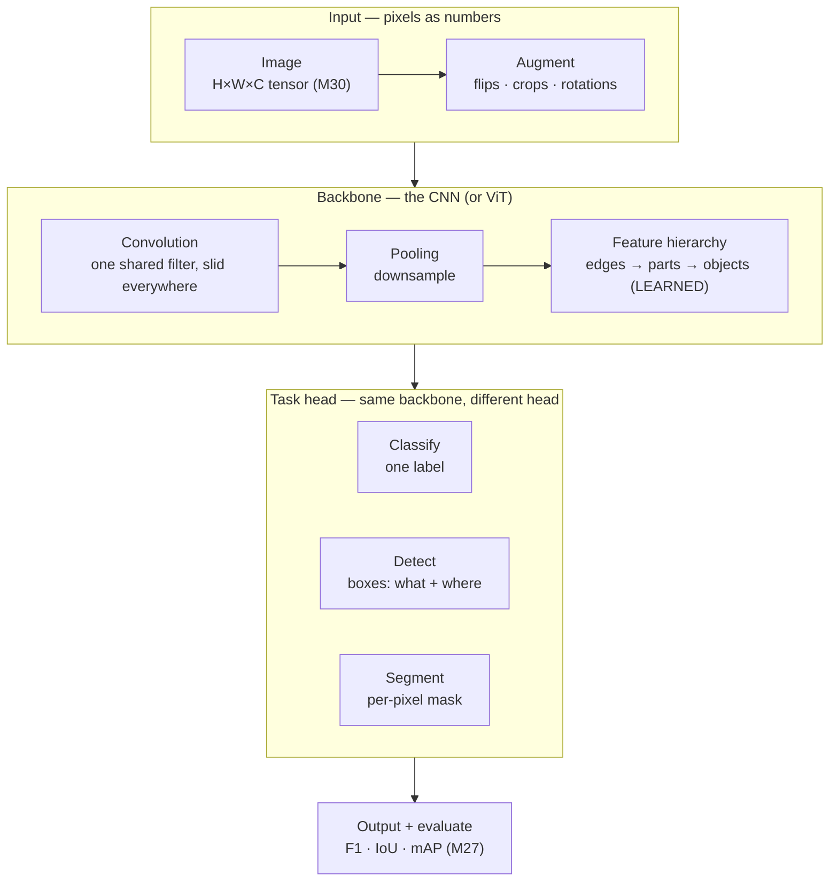

# Module 39 — Computer Vision

<small>Stage 13 · Cloud & AI Domains · ~3 weeks at 4 h/day · Prerequisite — Module 38 (NLP — the transfer-learning workflow and the transformer, both reused here). **The curriculum's final module.**</small>

## Why this matters

**Computer vision** is the field of making a computer extract meaning from images and video. To a
computer an **image** is not a picture — it is a grid of **pixels** (picture elements), a **tensor** (a
multi-dimensional array of numbers, M30) of shape **H × W × C** — height × width × **channels**, where
channels are usually **RGB** (Red, Green, Blue). Module 38 taught the AI domain of *language*; this
final module teaches the other major AI domain — *sight* — and completes the pair.

Because nearby pixels are correlated and an object can appear anywhere in the frame, the load-bearing
architecture is the **CNN** (Convolutional Neural Network): a **convolution** slides a small learned
**filter** (also called a **kernel** — a small matrix slid over the image to detect one feature) across
the whole image, detecting a local pattern *regardless of position*, and stacking these composes simple
features into complex ones (edges → textures → parts → objects). The job of a vision engineer is to
represent image data, understand the CNN deeply enough to reason about *why it works and what it costs*,
use **transfer learning** (M38's workflow, in vision) to build a real classifier with little data,
choose the **task-appropriate metric** (not just accuracy — M27), deploy the model behind an API (M36)
on the cloud (M37), and — the lesson the whole curriculum has been building toward — judge whether a
confident, on-average-accurate model is *actually* correct and *fair* enough to ship.

!!! info "What this unlocks — and closes"
    This module completes the two-domain AI picture (language + vision) and reuses everything the
    curriculum built: **M30–31** (tensors and probability — images *are* tensors, softmax outputs the
    class), **M26–27** (training and evaluation), **M38** (transfer learning and the transformer, now on
    pixels via the **ViT**), **M36–37** (serving and deploying), **M25** (ethics). It sets up the
    **capstone** — a deployed, evaluated, responsibly-assessed AI model — and points forward to applied
    CV (medical imaging, autonomous driving, robotics, manufacturing QA) and generative/multimodal vision
    (diffusion, CLIP). **This is where deep learning historically began (AlexNet, 2012) and where the
    engineer's responsibility is most acute.**

---

## Watch

*Watch once, then rely on the notes below — you should never need to rewatch.*

<div class="lo-video-placeholder" markdown="1">
<span class="lo-play">▶</span>
**Explainer video — coming**
<small>Record per <code>../media/README.md</code>, upload to YouTube, then replace this card with the embed.</small>
</div>

??? note "For the author — drop-in YouTube embed (replace VIDEO_ID)"
    Once the explainer is on YouTube, replace the placeholder card above with:
    ```html
    <div class="lo-video-embed">
      <iframe src="https://www.youtube-nocookie.com/embed/VIDEO_ID"
              title="Module 39 — Computer Vision"
              allow="accelerometer; autoplay; clipboard-write; encrypted-media; gyroscope; picture-in-picture"
              allowfullscreen></iframe>
    </div>
    ```
    Video script beats (from the blueprint's Analogy / Visual Model / Misconceptions):
    recognize-a-face-in-a-crowd by building up from small clues → an image is an (H×W×C) tensor →
    convolution as one *shared* small filter slid everywhere (translation invariance + parameter sharing)
    → pooling and the learned feature hierarchy (edges → parts → objects, the end of hand-crafted
    SIFT/HOG) → the architecture story (AlexNet 2012 → ResNet's skip connections → ViT) → transfer
    learning (fine-tune a pretrained model on little data) → the three tasks and their *different*
    metrics → the closing judgment: **confident ≠ correct (adversarial/shift), and accurate-on-average
    hides who it fails (fairness).**

**Terminal cast — pending; record per `../media/README.md`.**

!!! tip "Follow along, don't just watch"
    Open the [Guided Lab](#guided-lab-how-a-machine-sees) in a browser terminal and run each command
    yourself as it appears. You'll build a synthetic image, slide an edge-detecting kernel across it *by
    hand* and watch the edges light up, pool it smaller, and threshold it to a mask — feeling the
    concepts, not just reading them.

---

## Key Notes

*Standalone. This is the reference you keep.*

### The picture: pixels → meaning → task



Read it as a **flow**: raw pixels enter as a tensor, cheap **augmentation** multiplies the data, the
**backbone** (a CNN, or a **ViT** — Vision Transformer) turns pixels into a learned feature hierarchy,
a **task head** turns those features into the answer, and the answer is **measured** with the metric
that matches the task. Every note below is one stop on this flow.

### An image is a tensor

A **pixel** (picture element) is a number. A **grayscale** image is a 2-D grid of one number per pixel
(0 = black … 255 = white); a color image is a 3-D **tensor** of shape **H × W × C** (height × width ×
channels), where the three **RGB** channels (Red, Green, Blue) give each pixel three numbers. This is
**M30's tensor, made visual** — convolution below is just **M30's linear algebra** (weighted sums)
applied to that grid.

- **Preprocessing / normalization** — rescale pixel values (e.g. to 0–1 or zero-mean) so training
  behaves; unnormalized pixels are a classic reason a net won't learn (M26).
- **Data augmentation** — cheap, label-preserving transformations (flips, crops, rotations,
  color-jitter) applied at training time. It's the vision analogue of "get more data": one image becomes
  many, so the model generalizes and overfits less — the standard defense on a small dataset.

### Convolution — the keystone mechanic

A **convolution** slides a small learned **filter/kernel** (e.g. a 3×3 matrix) across the image, and at
each position computes a **weighted sum** of the pixels under it. The grid of those sums is a **feature
map** — high where the filter's pattern is present, low elsewhere. Slide an edge-detecting kernel and
the edges *light up*. Two properties make this the right tool for images:

- **Translation invariance** — the *same* filter is used at every position, so a pattern is detected
  wherever it appears (a nose is a nose on the left or the right of the photo).
- **Parameter sharing** — one small filter (9 numbers for 3×3), not a separate weight per pixel. A
  **fully-connected** net would need a weight for every pixel-to-neuron pair — enormous, and it would
  have to relearn a pattern separately for every location. The CNN uses *far fewer* weights and
  generalizes better — this is *why CNNs beat fully-connected nets on images*.

Two knobs shape the output: **stride** (how far the filter steps each move — a bigger stride shrinks the
output) and **padding** (a border of zeros added so the output can keep the input's size).

!!! note "Convolution is not complicated math"
    It is a small filter slid across the image, taking weighted sums (M30). The clever part isn't the
    arithmetic — it's **parameter sharing** (the same filter everywhere), which is the whole reason a CNN
    is efficient enough to learn on images.

### Pooling and the layer types

**Pooling** downsamples a feature map — e.g. **max-pooling** keeps the largest value in each 2×2 block,
halving height and width. It cuts compute, adds a little position-invariance, and lets deeper layers see
a wider area. A CNN is a stack of a few layer types:

| Layer | What it does | Why it's there |
|---|---|---|
| **Convolution** | slides learned filters over the input → feature maps | detect local patterns *anywhere* (translation invariance, parameter sharing) |
| **Activation** (ReLU — Rectified Linear Unit, zeroes negatives) | adds nonlinearity | lets the network compose *nonlinear* features, not just weighted sums |
| **Pooling** | downsamples (e.g. 2×2 max-pool) | shrink size, add invariance, cut compute |
| **Fully-connected** | flattened features → class scores | the final classifier head |
| **Softmax** (M31) | scores → a probability per class | the output distribution — "how confident, per class" |

### The feature hierarchy — learned, not hand-crafted

Stacking convolutions **composes** features: early layers detect **edges** and colors; middle layers
compose those into **textures and parts** (corners, motifs); deep layers compose parts into whole
**objects**. Crucially, the network **learns** these filters automatically from data via backprop (M26)
— the end of the hand-engineered-feature era (**SIFT** — Scale-Invariant Feature Transform, **HOG** —
Histogram of Oriented Gradients). That learned hierarchy — inspired by Hubel & Wiesel's simple/complex
cells in the visual cortex — is exactly what let **AlexNet** beat hand-crafted features in 2012.

### Architectures — the lineage, and ResNet's fix

| Architecture | Year | The idea it added |
|---|---|---|
| **LeNet** | 1998 | backprop-trained CNN read handwritten digits (ZIP codes) |
| **AlexNet** | 2012 | deep CNN on **GPUs** (M22) crushed **ImageNet** — started the deep-learning era |
| **VGG** | 2014 | very deep, uniform 3×3 stacks |
| **ResNet** (Residual Network) | 2015 | **residual/skip connections** enabled 100+ layers |

**ImageNet** is the million-image benchmark AlexNet won. **ResNet's** keystone: naively stacking more
layers made networks *worse*, because gradients **vanish** as they backpropagate through the depth
(M26/M31). A **residual (skip) connection** adds a layer's *input* back to its output, giving gradients
a direct path back — so they don't vanish and very deep nets become trainable. It's a direct fix to the
gradient problem the curriculum met in M26 — *depth is powerful, but not free.*

### The Vision Transformer and multimodal

The **ViT** (Vision Transformer, 2020) splits an image into **patches**, treats each patch as a *token*,
and applies **M38's self-attention** — so vision and language now share a core architecture (the domains
converge). CNNs *bake in* spatial locality; ViTs *learn* it (needing more data/compute). **CLIP**
(Contrastive Language–Image Pre-training, 2021) joins vision and language into one **multimodal** model,
and **diffusion**/**GAN** (Generative Adversarial Network) models generate images — named here, not
built.

### Transfer learning — you almost never train from scratch

**Transfer learning** takes a model **pretrained** on a huge dataset (ImageNet) and **fine-tunes** it on
your small dataset. It is *identical in shape* to M38's NLP workflow. Two modes:

- **Feature extraction** — freeze the pretrained **backbone**, train only a new **head**. Fast, needs
  little data, good when your task resembles the pretraining data.
- **Full fine-tuning** — unfreeze and train (some of) the backbone too. Better with more data or a
  domain far from ImageNet, at more compute and overfitting risk.

With only a few hundred images per class, training from scratch overfits badly; a pretrained model
already knows general visual features and only needs to adapt — *far* better results from little data.

### The three tasks — and the metric that matches each

| Task | Question | Output | Metric |
|---|---|---|---|
| **Classification** | *what is it?* | one whole-image label | accuracy / **F1** + confusion matrix |
| **Object detection** | *what + WHERE?* | **bounding boxes** (YOLO, Faster R-CNN) | **IoU** · **mAP** |
| **Segmentation** | *which pixels?* | per-pixel mask (U-Net, Mask R-CNN) | **IoU** · pixel accuracy |

The same backbone serves all three — you just swap the **head** (M38's backbone-plus-head idea, in
vision). The metrics differ and *must* match the task:

- **F1** — the harmonic mean of precision and recall; with a **confusion matrix** it shows *which
  classes confuse* — overall accuracy can be 95% while one class fails badly (M27).
- **IoU** (Intersection over Union) — the overlap of a predicted box/mask and the truth, divided by
  their union: how well they *match*.
- **mAP** (mean Average Precision) — the detection score averaging precision across recall levels and
  classes at IoU thresholds.

A detection that "looks right" to your eye can score low mAP (loose box, missed objects) — **"looks
right" is not measured right.** The metric measures what the eye forgives (M27), and **YOLO** (You Only
Look Once), **R-CNN** (Region-based CNN), and **U-Net**/**Mask R-CNN** are the standard detection and
segmentation model families.

### Deployment and cost

The end-to-end service: image upload → validate/preprocess (M36) → CNN/ViT → task head → decode →
return prediction + confidence + model version. CNNs are **GPU-hungry** (many convolutions × many
filters × large images — M22/M28), but **serving** is a *right-sizing* decision (M37): single-image,
low-traffic inference is often **CPU-fine and cheaper**; high-throughput or low-latency serving justifies
a GPU. Measure the workload; a GPU idle between requests is waste.

### The closing judgment — confident ≠ correct, and fair for whom

- **Adversarial examples** — a few (nearly invisible) changed pixels flip a confident prediction. The
  model relies on brittle statistical features, not human-like understanding — and it's a *security*
  threat (M9/M25).
- **Distribution shift** — a model trained on clean daytime images fails on real night photos; it's only
  as good as the distribution it was trained on. Fix: representative data, and *test on the deployment
  distribution*.
- **Bias / fairness** — vision models inherit their data's biases. Commercial face recognition had far
  higher error for darker-skinned and female faces (*Gender Shades*), with real harm (wrongful arrests).
  "99% accurate on average" *hides who it fails*. The engineer's duty: evaluate **per group**, not just
  overall; test robustness; and decide whether to deploy **at all** (M25). This is the curriculum's
  hardest, final evaluation lesson.

<div class="lo-remember" markdown="1">
**Must remember (if you keep only eight things):**

1. **An image is an (H × W × C) tensor** of pixels (M30) — vision is the curriculum's math, on pixels.
2. **Convolution = one small learned filter slid everywhere**, taking weighted sums → a feature map.
   **Parameter sharing + translation invariance** is *why CNNs beat fully-connected nets on images.*
3. **Pooling downsamples**; stacking convolutions builds a **learned feature hierarchy** (edges → parts
   → objects) — the end of hand-crafted SIFT/HOG (AlexNet, 2012).
4. **ResNet's skip connections fixed vanishing gradients** (M26/M31) — the reason nets could go 100+
   layers deep. **ViT** puts M38's transformer on image patches.
5. **Transfer learning** (fine-tune an ImageNet-pretrained model on small data — M38's workflow) — you
   almost never train from scratch.
6. **Three tasks, three metrics:** classification → F1 + confusion matrix · detection → IoU/mAP ·
   segmentation → IoU. **Match the metric to the task; "looks right" ≠ measured right.**
7. **Serving is a right-sizing decision** (M37): CPU is often fine; reach for a GPU only when the
   measured workload demands it (M22/M28).
8. **Confident ≠ correct** (adversarial + distribution shift), and **accurate-on-average hides who it
   fails** (fairness) — evaluate per group and decide whether to deploy at all (M25). *The curriculum's
   closing lesson.*
</div>

---

## Guided Lab: how a machine sees

*Basic, step-by-step. On a plain **CPU** with only `numpy` and `pillow`, you'll build a synthetic image,
see it as a tensor, slide an edge-detecting kernel across it **by hand** and watch the edges appear, pool
it smaller, and threshold it to a binary mask (toy segmentation). Everything lives in a throwaway
`~/vision-lab/` directory — no downloads, no GPU.*

<div class="lo-lab-actions" markdown="1">
[▶ Open interactive lab](https://killercoda.com/learning-os/course/killercoda/module-39){ .lo-btn target=_blank }
[⧉ Open in Codespaces](https://codespaces.new/randaguiac20/learning-os){ .lo-btn target=_blank }
[⌨ Run locally](#run-locally){ .lo-btn .lo-btn--ghost }
[View lab source](https://github.com/randaguiac20/learning-os/tree/main/killercoda/module-39){ .lo-btn .lo-btn--ghost target=_blank }
</div>

<span id="run-locally"></span>
!!! tip "Three ways to run this lab — pick any (all free)"
    - **Instant, no account** — click **Open interactive lab** (Killercoda): a Linux terminal in your browser.
    - **Your own cloud** — click **Open in Codespaces**: runs in your GitHub account's free tier (120 core-hrs/mo).
    - **Local, unlimited, $0** — any Linux / macOS / WSL terminal, or a throwaway container: `docker run -it ubuntu bash`, then follow the steps below.

    Killercoda is the zero-setup on-ramp; Codespaces and local use *your own* free resources, so they scale to any class size.

=== "1 · Install the bench (numpy + pillow)"
    ```bash
    apt-get update -qq && apt-get install -y python3-pip     # pip, if not present
    pip install numpy pillow 2>/dev/null || pip install --break-system-packages numpy pillow
    mkdir -p ~/vision-lab && cd ~/vision-lab                 # throwaway working dir
    python3 -c "import numpy, PIL; print('numpy', numpy.__version__, '| pillow', PIL.__version__)"
    ```
    **numpy** holds the image as an array; **pillow** (PIL) saves it to a PNG you could open. No GPU and
    no downloads — everything here runs in milliseconds on a plain CPU.

=== "2 · A synthetic image as a tensor"
    ```bash
    python3 - <<'PY'
    import numpy as np
    from PIL import Image
    # RGB image: black background, a white square — shape H × W × C
    rgb = np.zeros((64, 64, 3), dtype=np.uint8)
    rgb[16:48, 16:48] = [255, 255, 255]         # white square (all three channels high)
    print("RGB shape:", rgb.shape, "| dtype:", rgb.dtype)   # (64, 64, 3)
    print("a background pixel:", rgb[0, 0].tolist())        # [0, 0, 0]
    print("a square pixel   :", rgb[32, 32].tolist())       # [255, 255, 255] — three numbers
    Image.fromarray(rgb).save("square_rgb.png")
    # convert to grayscale (one number per pixel) for the convolution work
    gray = np.array(Image.fromarray(rgb).convert("L"), dtype=np.float64)
    print("grayscale shape:", gray.shape, "| min", gray.min(), "max", gray.max())
    np.save("gray.npy", gray)
    print("saved square_rgb.png and gray.npy")
    PY
    ```
    The image is a **tensor**: shape `(64, 64, 3)` — height × width × **channels**. Each pixel is three
    numbers (RGB). Grayscale drops the channel axis to one number per pixel — the grid the kernel will
    slide over.

=== "3 · Convolution by hand — Sobel edges"
    ```bash
    cat > convolve.py <<'PY'
    import json
    import numpy as np

    gray = np.load("gray.npy")               # (64,64) grayscale from step 2

    # A kernel/filter is a small matrix slid over the image. Sobel detects edges:
    Kx = np.array([[-1, 0, 1], [-2, 0, 2], [-1, 0, 1]], dtype=np.float64)   # vertical edges
    Ky = np.array([[-1, -2, -1], [0, 0, 0], [1, 2, 1]], dtype=np.float64)   # horizontal edges

    def convolve(im, k):
        """Slide k over im, weighted-sum at each position → a feature map (same size, zero-padded)."""
        kh, kw = k.shape
        pad = kh // 2
        padded = np.pad(im, pad, mode="constant")
        out = np.zeros_like(im)
        for r in range(im.shape[0]):
            for c in range(im.shape[1]):
                out[r, c] = np.sum(padded[r:r+kh, c:c+kw] * k)   # the convolution
        return out

    gx, gy = convolve(gray, Kx), convolve(gray, Ky)
    mag = np.sqrt(gx**2 + gy**2)             # edge magnitude — high on the square's border

    # Save a viewable edge image
    from PIL import Image
    Image.fromarray((mag / mag.max() * 255).astype("uint8")).save("edges.png")

    result = {
        "shape": list(mag.shape),
        "max_edge": float(mag.max()),
        "interior_mean": float(mag[24:40, 24:40].mean()),   # flat inside the square → ~0
        "background_mean": float(mag[0:12, 0:12].mean()),    # flat background → ~0
        "edge_pixel_fraction": float((mag > 100).mean()),    # edges are SPARSE (a border)
        "edges_png_exists": True,
    }
    with open("edge_result.json", "w") as f:
        json.dump(result, f, indent=2)
    print(json.dumps(result, indent=2))
    PY
    python3 convolve.py
    ```
    The **feature map** is high on the square's **border** and near-zero in the flat interior and
    background — the edge kernel found the edges *everywhere they appear* (translation invariance), using
    one shared 9-number filter (parameter sharing). Edges are **sparse** — a border, not the whole image.

    Click **Check** to verify the edges landed on the border and not the flat regions.

=== "4 · Blur, sharpen, and pool (downsample)"
    ```bash
    cat > pool.py <<'PY'
    import json
    import numpy as np
    from convolve import convolve          # reuse the hand convolution
    gray = np.load("gray.npy")

    blur    = np.ones((3, 3)) / 9.0                                  # box blur — averages neighbors
    sharpen = np.array([[0, -1, 0], [-1, 5, -1], [0, -1, 0]], float)  # emphasizes the center
    _ = convolve(gray, blur); _ = convolve(gray, sharpen)            # apply both (opposite effects)

    def max_pool(im, size=2):
        """Downsample: keep the max of each size×size block → half the height and width."""
        h, w = im.shape
        oh, ow = h // size, w // size
        out = np.zeros((oh, ow))
        for r in range(oh):
            for c in range(ow):
                out[r, c] = im[r*size:(r+1)*size, c*size:(c+1)*size].max()
        return out

    pooled = max_pool(gray, 2)
    result = {
        "input_shape": list(gray.shape),      # [64, 64]
        "pooled_shape": list(pooled.shape),   # [32, 32] — halved
        "pool_size": 2,
        "blur_applied": True,
        "sharpen_applied": True,
    }
    with open("pool_result.json", "w") as f:
        json.dump(result, f, indent=2)
    print(json.dumps(result, indent=2))
    PY
    python3 pool.py
    ```
    **Blur** (a box average) and **sharpen** (emphasize the center) are just two more kernels — same
    machinery, opposite effects. **Max-pooling** then **downsamples**: `(64, 64)` → `(32, 32)`, half the
    size — less compute, a wider view for deeper layers.

    Click **Check** to verify the pooled image is exactly half the input's height and width.

=== "5 · Threshold to a binary mask (toy segmentation)"
    ```bash
    python3 - <<'PY'
    import numpy as np
    from PIL import Image
    gray = np.load("gray.npy")
    mask = (gray > 127).astype(np.uint8)          # 1 where the object is, 0 for background
    Image.fromarray(mask * 255).save("mask.png")
    print("mask shape:", mask.shape)
    print("foreground pixels:", int(mask.sum()), "of", mask.size)   # 1024 of 4096 = the square
    print("foreground fraction:", round(float(mask.mean()), 3))
    PY
    ```
    A threshold splits pixels into **object (1)** and **background (0)** — a **per-pixel** label, which is
    the shape of a **segmentation** output. This toy mask is exact because the image is synthetic; a real
    segmenter (U-Net / Mask R-CNN) *learns* the mask, and you'd score it with **IoU**, not by eye.

!!! success "You can stop here and have learned something real"
    If you saw an image as an (H×W×C) tensor, slid an edge kernel across it by hand and watched the edges
    appear on the border, pooled it to half size, and thresholded a mask — the guided lab is done. You've
    touched convolution, translation invariance, pooling, and a segmentation output with your own hands.
    Now make it harder.

---

## Solo Lab: figure it out

*Harder. Goals only — minimal hand-holding. Work in `~/vision-lab/`. Reuse your `convolve` and
`max_pool` functions. The last challenge has no code — it's the judgment the curriculum ends on.*

### Challenge 1 — Prove translation invariance
Move the white square to a **different location** and re-run your Sobel edge detection. Show the same
kernel finds the edges in the new position — and explain, in one sentence, why that is the whole point of
a *shared* filter.

??? tip "Hint"
    Change the slice, e.g. `gray[4:24, 36:56] = 255`, then convolve with the same `Kx`/`Ky`. Same filter,
    new location — the edge magnitude is high wherever the border now is.

??? success "Solution"
    ```python
    import numpy as np
    from convolve import convolve, Kx, Ky
    g = np.zeros((64, 64)); g[4:24, 36:56] = 255.0        # square moved to top-right
    mag = np.hypot(convolve(g, Kx), convolve(g, Ky))
    print("edges found at moved border, max:", round(float(mag.max()), 1))
    ```
    One filter, slid over *every* position, detects the pattern wherever it is — **translation
    invariance**. A fully-connected net would have to relearn the edge separately for each location; the
    CNN never does, which is why it needs far fewer weights and generalizes on images.

### Challenge 2 — Average-pool vs max-pool
Implement **average-pooling** (mean of each block) alongside your max-pool, run both on the *edge
magnitude* map, and say when each is the better choice.

??? success "Solution"
    ```python
    import numpy as np
    def avg_pool(im, size=2):
        h, w = im.shape
        return im[:h//size*size, :w//size*size].reshape(h//size, size, w//size, size).mean(axis=(1,3))
    # max-pool keeps the strongest response (good for "is the feature present?");
    # avg-pool smooths (good for a summary / less noisy downsample).
    ```
    **Max-pool** keeps the strongest activation — it answers "does this feature appear in the block?" and
    dominates CNN backbones. **Average-pool** smooths and is common as a final **global** pool before the
    classifier head. Both halve the spatial size; they differ in what they preserve.

### Challenge 3 — The identity kernel (verify your convolution)
Convolve the grayscale image with the **identity kernel** `[[0,0,0],[0,1,0],[0,0,0]]` and show the output
equals the input. Explain why this is a good *self-check* on a hand-written convolution.

??? tip "Hint"
    An identity kernel weights only the center pixel by 1 and everything else by 0 — so each output pixel
    is its own input pixel. `np.allclose(convolve(gray, K), gray)` should be `True` (ignoring the padded
    border).

??? success "Solution"
    ```python
    import numpy as np
    from convolve import convolve
    gray = np.load("gray.npy")
    K = np.array([[0,0,0],[0,1,0],[0,0,0]], float)
    out = convolve(gray, K)
    print("identity holds (interior):", np.allclose(out[1:-1,1:-1], gray[1:-1,1:-1]))
    ```
    If a *known-answer* kernel doesn't reproduce its known output, your indexing/padding is wrong — the
    same "machine-check the hand calc" discipline as M26's gradient-check and M30's `A·A⁻¹ = I`. Never
    trust a convolution you didn't verify against a case whose answer you already know.

### Challenge 4 — IoU by hand (the metric that catches what the eye forgives)
Two boxes as `[x1, y1, x2, y2]`: truth `[10, 10, 50, 50]`, prediction `[20, 20, 60, 60]`. Compute **IoU**
(Intersection over Union) by hand in numpy, and explain how a detection can "look right" yet score low.

??? success "Solution"
    ```python
    def iou(a, b):
        ix1, iy1 = max(a[0], b[0]), max(a[1], b[1])
        ix2, iy2 = min(a[2], b[2]), min(a[3], b[3])
        inter = max(0, ix2-ix1) * max(0, iy2-iy1)
        area_a = (a[2]-a[0]) * (a[3]-a[1]); area_b = (b[2]-b[0]) * (b[3]-b[1])
        return inter / (area_a + area_b - inter)
    print(round(iou([10,10,50,50], [20,20,60,60]), 3))   # ~0.39
    ```
    The overlap is only **~0.39** — below the usual 0.5 "correct detection" bar — even though a
    right-object, roughly-placed box *looks* fine. **IoU/mAP measure the overlap the eye glosses over**;
    accuracy can't see it. Match the metric to the task (M27) — "looks right" is not measured right.

### Challenge 5 (stretch) — "99% accurate — ship it?" (the closing judgment)
A vendor says their face-recognition model is **"99% accurate."** As the engineer, write the questions you
must ask *before* believing or deploying it. No code — this is the curriculum's final lesson.

??? success "Solution"
    Ask: **99% on WHAT data** — representative of our deployment population? **By which metric** —
    accuracy hides per-group failure, so what is the **per-subgroup** performance (especially across skin
    tone and gender — *Gender Shades*)? **At what threshold**, and what are the false-positive/false-
    negative **rates** — a false match can mean a *wrongful arrest*, so the error costs are asymmetric and
    huge (M27/M31). **Tested under our real conditions** (distribution shift — lighting, angle) and how
    **robust to adversarial** inputs? Plus **consent, privacy, legal basis** — and whether it should be
    deployed **at all** (M25). "99% accurate" is nearly meaningless without the base rate, the subgroup
    breakdown, and the error costs. **Confident-and-accurate-on-average hides who it fails** — evaluating
    for fairness and robustness is a first-class engineering duty, not an afterthought. *That is the
    lesson the whole curriculum was built to earn.*

---

## Self-Check

*Close the notes. Answer aloud or in writing **first**, then reveal. Recalling — even when it's hard —
is what builds the memory.*

??? question "What is an image, to a computer — and what is a convolution?"
    An image is a grid of **pixels** — an **(H × W × C)** tensor of numbers (M30), with RGB channels for
    color. A **convolution** slides a small learned **filter/kernel** across that grid, taking a weighted
    sum at each position to produce a **feature map** — high where the filter's pattern is present.

??? question "Why does a CNN beat a fully-connected net on images?"
    **Parameter sharing** (one small filter reused everywhere, not a weight per pixel → far fewer
    weights) and **translation invariance** (the pattern is detected wherever it appears). A
    fully-connected net has no spatial structure and would relearn a pattern per location — enormous and
    worse-generalizing. The CNN matches how images actually work: local, position-independent features.

??? question "What does each layer of the feature hierarchy detect, and who learns them?"
    Early layers detect **edges/colors**; middle layers compose them into **textures and parts**; deep
    layers compose parts into **whole objects**. The network **learns** the filters automatically from
    data via backprop (M26) — the end of hand-crafted SIFT/HOG (why AlexNet's learned features won).

??? question "Why did ResNet's residual connections enable much deeper networks?"
    Stacking many layers naively makes gradients **vanish** on the way back (M26/M31), so deep plain nets
    train worse than shallow ones. A **skip connection** adds a layer's input to its output, giving
    gradients a direct path back — they stop vanishing and 100+ layer nets become trainable. A simple
    idea, a direct fix to M26's gradient problem.

??? question "Why transfer-learn instead of training from scratch?"
    A few hundred images is far too little to train a deep net from scratch — it overfits. A model
    **pretrained** on ImageNet already knows general visual features; **fine-tuning** it adapts those to
    your task with little data (M38's workflow, in vision). You almost never train from scratch.

??? question "Which metric for object detection, and why not accuracy?"
    **mAP** (mean Average Precision), built on **IoU** (Intersection over Union). Detection is about
    *localizing* objects — a box can name the right class but overlap the truth poorly, or miss objects.
    Accuracy can't measure box overlap; IoU/mAP can. Match the metric to the task (M27).

??? question "Why is a confident vision prediction not necessarily correct?"
    Its confidence reflects learned **pixel-pattern** strength, not understanding. **Adversarial
    examples** (a few imperceptible pixel changes) flip confident predictions, and **distribution shift**
    (lighting/style never trained on) causes confident failures. Confident ≠ correct — the same
    skepticism M38 taught for language, in pixels.

??? question "'Our face-recognition model is 99% accurate — ship it.' Your response?"
    "99% on which dataset, by which metric, at which threshold?" Accuracy hides **per-group** failure, so
    demand the subgroup breakdown (skin tone/gender — *Gender Shades*), the false-positive/false-negative
    costs (a false match can mean a wrongful arrest), robustness to shift/adversarial inputs, and
    consent/privacy/legal basis — then whether to deploy at all (M25). **Accurate-on-average hides who it
    fails.**

!!! example "Teach it back (the real test)"
    Out loud, in **5 minutes, no notes**, to someone who finished M26–27 (AI/ML basics) and M38 (NLP)
    but never did vision: use the **recognize-a-face-in-a-crowd** analogy *first* (small clues → parts →
    a face; the same detector used anywhere), then (1) **convolution** and why *one shared filter*
    (translation invariance + parameter sharing) is the key idea, (2) **transfer learning** and the
    architecture story (AlexNet → ResNet's skip connections → ViT), and (3) **task-appropriate
    evaluation** and the limits/ethics — ending on **confident ≠ correct, and fair for whom**. Field "does
    the CNN see like us?" and "isn't 99% accurate good enough?". If you can't yet, that's your signal to
    reread the Key Notes, not to move on.

---

## Mastery checklist

*Tick these honestly, cold (no notes). They **gate** progress — passing M39 also closes **Stage 13** and
the entire journey. A module is only "done" when every box is true.*

- [ ] **Define** image-as-tensor, convolution, pooling, and transfer learning — one line each, cold.
- [ ] **Represent** an image as an (H×W×C) tensor and apply augmentation, explaining channels (M30).
- [ ] **Implement** a convolution by hand and verify it (identity kernel / known answer).
- [ ] **Explain** why CNNs beat fully-connected nets on images (translation invariance + parameter sharing).
- [ ] **Explain** the feature hierarchy — edges → parts → objects, **learned**, not hand-crafted.
- [ ] **Describe** the architecture lineage (LeNet → AlexNet → VGG → ResNet) and what each added.
- [ ] **Explain** ResNet's residual connections and the vanishing-gradient fix (M26/M31).
- [ ] **Explain** transfer learning (fine-tune a pretrained model) and when feature-extraction vs full fine-tuning.
- [ ] **Explain** ViT and how it connects to M38's transformer (patches as tokens).
- [ ] **Distinguish** classification, detection, and segmentation by their output *and* their metric.
- [ ] **Choose** the task-appropriate metric (F1 + confusion matrix vs IoU/mAP) and compute IoU by hand.
- [ ] **Reason** about GPU vs CPU inference cost and right-size the serving (M22/M28/M37).
- [ ] **Demonstrate** an adversarial example and explain distribution shift (confident ≠ correct).
- [ ] **Evaluate** a model for fairness across groups and confront the face-recognition stakes (M25/M27).
- [ ] **Recognize** when a simpler/classical approach is the right call (don't over-engineer).
- [ ] **Connect** vision to the curriculum (M30/M31 tensors/probability · M26/M27 training/eval · M38 transfer/transformer · M36–37 serving · M25 ethics).
- [ ] **Teach** how machines see and why confident ≠ correct, fair for whom (teach-back above).

---

## Review — lock it in

Spaced repetition is not optional; it's where the memory actually forms. **Interleaving is active** —
every M39 review also pulls in one **Module 38** item (its sibling AI domain: ViT *is* M38's transformer
on patches; transfer learning is the *same* workflow; "confident ≠ correct" is M38's skepticism, in
pixels). Schedule these and *keep* them:

| When | Do | Interleaved M38 item |
|---|---|---|
| **Day 1** | Flashcards 1–20 · hand-compute one convolution feature map | Say "what is self-attention?" in one sentence |
| **Day 3** | The three cases (AlexNet · ResNet · face-recognition bias) · the metric map | Explain the fine-tune-a-pretrained-model workflow cold |
| **Day 7** | Reproduce the full Visual Model blank · run detection and evaluate with IoU/mAP | Trace tokenization → embeddings from memory |
| **Day 14** | Run an adversarial or fairness test · ResNet's gradient fix cold | Explain "why fluent ≠ correct" (hallucination) |
| **Day 30** | Reproduce both artifacts (classifier + robustness/detection analysis) | Redraw the transformer/attention diagram from memory |

**Connects forward to:** the **capstone** — a deployed, evaluated, responsibly-assessed AI model
(language *or* vision, or multimodal), built with M35's process, served via M36 on M37's cloud, evaluated
with M27's rigor, and honest about the limits and ethics M38–M39 taught. Beyond it: **generative vision**
(GANs, diffusion — Stable Diffusion, DALL·E), **multimodal** (CLIP joining M38 + M39), and the applied CV
domains (medical imaging, autonomous driving, robotics, manufacturing QA) where these skills are
load-bearing and the stakes are real.

!!! success "The journey is complete"
    Passing M39 closes **Stage 13** and the entire **BSAIE-gap expansion (M30–M39)** on top of the
    original 29 modules + capstone. You now hold the full toolkit of an AI engineer — the mathematical
    and CS foundations, the data and software discipline, the cloud, and **both** AI domains, language
    (M38) and vision (M39) — able to build, evaluate, serve, deploy, and *responsibly assess* AI systems.
    The forward path is `../../06-continuous-improvement.md` (certs, specializations, communities) and the
    roadmap's Recommended Study Sequence v2; the capstone is where it all comes together.

!!! quote "The one-sentence takeaway"
    Vision is the curriculum's math and machine learning specialized to pixels — convolution and the
    learned feature hierarchy let machines *see*, transfer learning builds a real model from little data,
    and the metric-and-fairness discipline (confident ≠ correct, and fair for whom) is the closing lesson
    the whole journey was built to earn.
